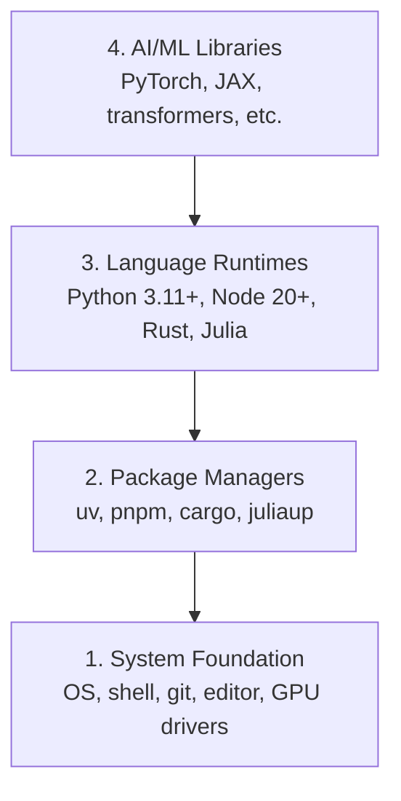

# محیط زیست

> ابزار شما تفکر شما را شکل می دهد. یک بار آنها را تنظیم کنید، آنها را درست تنظیم کنید.

**Type:** Build
**Languages:** Python, Node.js, Rust
**Prerequisites:** None
**Time:** ~45 minutes

## اهداف یادگیری

- Python 3.11+، Node.js 20+ و Rust toolchains را از ابتدا تنظیم کنید
- تنظیم محیط های مجازی و مدیران بسته برای ساخت های قابل تکرار
- دسترسی GPU را با CUDA/MPS تأیید کنید و یک عملیات تنسور آزمون را اجرا کنید
- درک چهار لایه: سیستم، بسته ها، زمان اجرا، کتابخانه های هوش مصنوعی

## مشکل

شما در حال یادگیری مهندسی هوش مصنوعی در 500 درس با استفاده از پایتون، تایپ اسکریپت، زنگ و جولیا هستید. اگر محیط شما خراب شود، هر درس به جای یادگیری، مبارزه با ابزار تبدیل می شود.

بیشتر مردم تنظیمات محیط را نادیده می گیرند. سپس ساعت ها را صرف عیب گشودن خطاهای واردات، تعارض نسخه ها و راننده های گمشده CUDA می کنند. ما این کار را یک بار انجام خواهیم داد، به درستی.

## مفهوم

محیط مهندسی هوش مصنوعی چهار لایه دارد:



ما از پایین بالا نصب می کنیم. هر لایه بستگی به لایه زیر آن دارد.

```figure
s0-env-stack
```

## آن را بسازید

### مرحله ی اول: پایه ی سیستم

سیستم رو چک کن و اصول رو نصب کن

```bash
# macOS
xcode-select --install
brew install git curl wget

# Ubuntu/Debian
sudo apt update && sudo apt install -y build-essential git curl wget unzip

# Windows (use WSL2)
wsl --install -d Ubuntu-24.04
```

### مرحله 2: پیتون با uv

ما استفاده می کنیم`uv`10-100 برابر سریع تر از پیپ است و محیط های مجازی را به طور خودکار اداره می کند.

```bash
curl -LsSf https://astral.sh/uv/install.sh | sh

uv python install 3.12

uv venv
source .venv/bin/activate  # or .venv\Scripts\activate on Windows

uv pip install numpy matplotlib jupyter
```

بررسی کنید:

```python
import sys
print(f"Python {sys.version}")

import numpy as np
print(f"NumPy {np.__version__}")
a = np.array([1, 2, 3])
print(f"Vector: {a}, dot product with itself: {np.dot(a, a)}")
```

### مرحله 3: Node.js با pnpm

برای درس های تایپ اسکریپت (آموزان، سرورهای MCP، برنامه های وب).

```bash
curl -fsSL https://fnm.vercel.app/install | bash
fnm install 22
fnm use 22

npm install -g pnpm

node -e "console.log('Node', process.version)"
```

نصب کننده fnm چک می کنه`unzip`اول و بعد ازش با`Not installing fnm due to missing dependencies.`وقتی که از دست داده می شود: در لینوکس یک آرکای zip را باز می کند، در macOS از طریق Homebrew نصب می شود.`unzip`; Ubuntu, Debian, و WSL2 آن را از خط مرحله 1 apt (`sudo apt install -y unzip`اگر از این مرحله فرار کردید).

**macOS / Apple Silicon (M1/M2/M3/M4):**اگه نصب کننده با `Error: Cannot install under Rosetta 2 in ARM default prefix (/opt/homebrew)`، ترمینال شما تحت " روزتا 2 " اجرا شده`arch`چاپ`i386`. در حالی که Homebrew یک ساخت بومی arm64 است. نصب fnm مجبور کردن arm64, آن را به پوسته خود را, سپس دوباره اجرا دستورات بالا از `fnm install 22`:

```bash
arch -arm64 brew install fnm
echo 'eval "$(fnm env --use-on-cd)"' >> ~/.zshrc
source ~/.zshrc
```

### مرحله چهارم: زنگ

برای درس های حیاتی عملکرد (تأثير، سیستم ها).

```bash
curl --proto '=https' --tlsv1.2 -sSf https://sh.rustup.rs | sh

rustc --version
cargo --version
```

### مرحله 5: جولیا (اختیاری)

براي درس هاي ریاضی که جوليا در آن رو به رويش ميده

```bash
curl -fsSL https://install.julialang.org | sh

julia -e 'println("Julia ", VERSION)'
```

### مرحله 6: تنظیم GPU (اگر شما یک دارید)

**NVIDIA (Linux / Windows):**

```bash
nvidia-smi

# Install PyTorch with CUDA
uv pip install torch torchvision torchaudio --index-url https://download.pytorch.org/whl/cu124
```

**macOS / Apple Silicon (M1/M2/M3/M4):**هیچ CUDA ای روی Mac وجود نداره که انتظارش رو داشته باشه، نه شکست**not**منظورم`--index-url .../cuXXX`(این چرخ ها فقط لینوکس/ ویندوز هستند، بنابراین نصب شکست می خورد). ساخت ساده را نصب کنید که شامل MPS (متال) GPU اپل است:

```bash
uv pip install torch torchvision torchaudio
```

تایید (در هر پلتفرم کار می کند):

```python
import torch
print(f"CUDA available: {torch.cuda.is_available()}")           # False on macOS — expected
print(f"MPS available:  {torch.backends.mps.is_available()}")   # True on Apple Silicon
if torch.cuda.is_available():
    print(f"GPU: {torch.cuda.get_device_name(0)}")
```

هیچ گپيوي؟ مشکلی نداره. بیشتر درس ها بر روی پردازنده کار مي کنند. برای درس های سنگین آموزش، از گوگل کولاب یا گپيوي های ابر استفاده کنید.

### مرحله 7: مسیر را که می خواهید شروع کنید تایید کنید

هر فرماني که در اين درس هست رو از ریشه مخزن اجرا کن
شامل`README.md`و`phases/`قبل از پرواز فقط چيزي که لازم داري رو چک ميکنه
راه انتخاب شده را شروع کنید. به طور پیش فرض ابزار بعدی را رد می کند تا یک دانش آموز جدید
و جوابى روشن به جای ديوار هشدارها

شروع به تمام رشته شروع کننده ها کنيد:

```bash
python3 phases/00-setup-and-tooling/01-dev-environment/code/verify.py --route beginner
```

یا فقط مسیر رو که میخوای چک کن:

```bash
python3 phases/00-setup-and-tooling/01-dev-environment/code/verify.py --route ml-foundations
python3 phases/00-setup-and-tooling/01-dev-environment/code/verify.py --route llm-engineering
python3 phases/00-setup-and-tooling/01-dev-environment/code/verify.py --route agents
python3 phases/00-setup-and-tooling/01-dev-environment/code/verify.py --route mcp
python3 phases/00-setup-and-tooling/01-dev-environment/code/verify.py --route agent-skills
python3 phases/00-setup-and-tooling/01-dev-environment/code/verify.py --route certification
```

اضافه کردن`--show-later`وقتی میخوای همین پیش پرواز برای بررسی ابزار اختیاری
و وابستگی های مورد استفاده در درس های بعد.
مسیر انتخاب شده

هر بررسی مورد نیاز شکست خورده شامل مسیر شناسایی شده یا خطا وارداتی و یک
. فرمان درست درستي
چک های دستی میزبان به دلیل اینکه یک اسکریپت پایتون نمی تواند ثابت کند که یک میزبان هوش مصنوعی
که مهارتی کشف کرده اید یا که دامنه مهارت های انتخاب شده تان قابل نوشتن است.

وقتي که شروع به پرواز قبل از پرواز ميگذره، اولين درس درستي که مي تونيم اجرا کنيم رو چاپ ميکنه:

```text
Ready to start Beginner course.
Next: python3 phases/01-math-foundations/01-linear-algebra-intuition/code/vectors.py
```

## ازش استفاده کن

محیط شما آماده است که مسیر را که بررسی کرده اید شروع کند. ابزار بعدی را نصب کنید
وقتی که یک درس از شما می خواهد تا به جای اینکه درسی اول را به طور کامل مسدود کنید
این چیزی است که در برنامه درسی استفاده می کنید:

| Language | Used In | Package Manager |
|----------|---------|-----------------|
| Python | Phases 1-12 (ML, DL, NLP, Vision, Audio, LLMs) | uv |
| TypeScript | Phases 13-17 (Tools, Agents, Swarms, Infra) | pnpm |
| Rust | Phases 12, 15-17 (Performance-critical systems) | cargo |
| Julia | Phase 1 (Math foundations) | Pkg |

## -باده

این درس یک اسکریپت تأیید کننده تولید می کند که هر کسی می تواند برای بررسی تنظیمات خود اجرا کند.

ببین`outputs/prompt-env-check.md`برای یک پیام که به دستیاران هوش مصنوعی کمک می کند تا مشکلات محیطی را تشخیص دهند.

## تمرینات

1. اسکریپت تایید رو اجرا کن و تمام شکست ها رو حل کن
2. برای این دوره یک محیط مجازی پایتون ایجاد کنید و PyTorch را نصب کنید
3. "سلام جهان" را به هر چهار زبان بنویسید و هر یک را اجرا کنید
