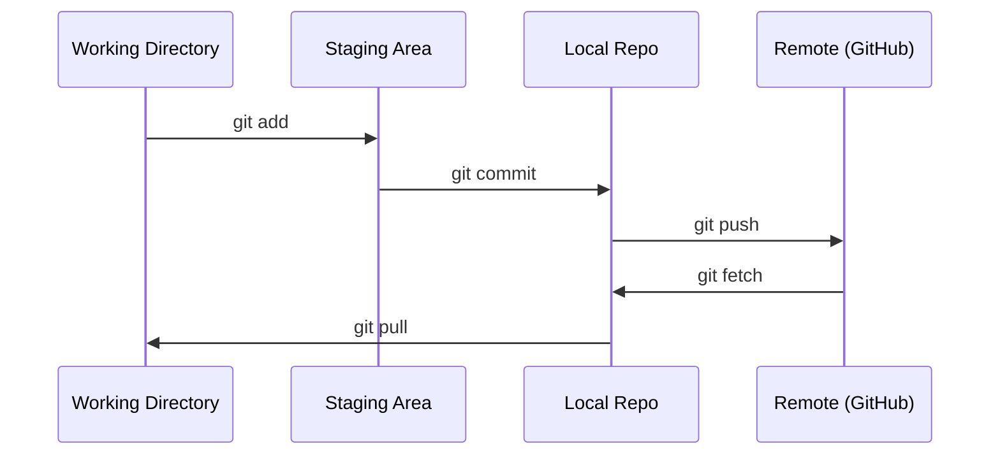

# Git & همکاری

> کنترل نسخه اختیاری نیست هر آزمایش، هر مدل، هر درس که اینجا می سازید ردیابی می شود.

**Type:** Learn
**Languages:** --
**Prerequisites:** Phase 0, Lesson 01
**Time:** ~30 minutes

## اهداف یادگیری

- تنظیم هویت git و استفاده از جریان کار روزانه اضافه کردن، تعهد و فشار
- ایجاد و ترکیب شاخه ها برای آزمایش های جداگانه بدون شکستن اصلی
- يه حرف بنويس`.gitignore`که از نقاط بازرسی مدل و فایل های دوگانه بزرگ خارج می شود
- با  تاریخچه انجام کار را مرور کنید`git log`درک تحول پروژه

## مشکل

شما در حال نوشتن صدها فایل کد در 20 مرحله هستید بدون کنترل نسخه شما کار خود را از دست می دهید، چیزهایی را که نمی توانید از بین ببرید، و هیچ راهی برای همکاری با دیگران ندارید.

Git ابزار است. GitHub جایی است که کد زندگی می کند. این درس شامل آنچه که شما برای این دوره نیاز دارید و چیزی بیشتر نیست.

## مفهوم



سه تا چيزهايي که بايد به ياد داشته باشي:
1. اغلب ذخیره کنید (`git commit`)
2. فشار به راه دور (`git push`)
3. بخش آزمایش (`git checkout -b experiment`)

```figure
s0-commit-dag
```

## آن را بسازید

### مرحله اول: تنظیم git

```bash
git config --global user.name "Your Name"
git config --global user.email "you@example.com"
```

### مرحله دوم: جریان کاری روزانه

```bash
git status
git add file.py
git commit -m "Add perceptron implementation"
git push origin main
```

### مرحله سوم: شاخه بندی برای آزمایش

```bash
git checkout -b experiment/new-optimizer

# ... make changes, commit ...

git checkout main
git merge experiment/new-optimizer
```

### مرحله 4: کار با این دوره repo

شما نمی توانید به خود repo دوره فشار دهید  فقط نگهبانان دسترسی به نوشتن دارند. ابتدا آن را در GitHub (دکمه Fork، بالا سمت راست)`origin`نکات در نسخه ی خودتون:

```bash
git clone https://github.com/YOUR-USERNAME/ai-engineering-from-scratch.git
cd ai-engineering-from-scratch

git checkout -b my-progress
# work through lessons, commit your code
git push origin my-progress
```

## ازش استفاده کن

براي اين دوره، به اين دستورات نياز داريد:

| Command | When |
|---------|------|
| `git clone` | Get the course repo |
| `git add` + `git commit` | Save your work |
| `git push` | Back it up to GitHub |
| `git checkout -b` | Try something without breaking main |
| `git log --oneline` | See what you've done |

اين تمام شد، براي اين دوره به بازيابي، انتخاب کرسي و يا ذيلي ماژول ها نياز ندارين

## تمرینات

1. این ریپو رو بکش، شکنی خود را کلان، یک شاخه به نام`my-progress`، پرونده اي بساز، انجامش بده، فشارش بده
2. ایجاد یک`.gitignore`که نمونه پرونده های پسته های بازرسی را از بین می برد (`.pt`،`.pth`،`.safetensors`)
3. به سابقه انجام اين رپو نگاه کنيد`git log --oneline`و بخونيد که چطور درس ها اضافه شده

## اصطلاحات کلیدی

| Term | What people say | What it actually means |
|------|----------------|----------------------|
| Commit | "Saving" | A snapshot of your entire project at a point in time |
| Branch | "A copy" | A pointer to a commit that moves forward as you work |
| Merge | "Combining code" | Taking changes from one branch and applying them to another |
| Remote | "The cloud" | A copy of your repo hosted somewhere else (GitHub, GitLab) |
