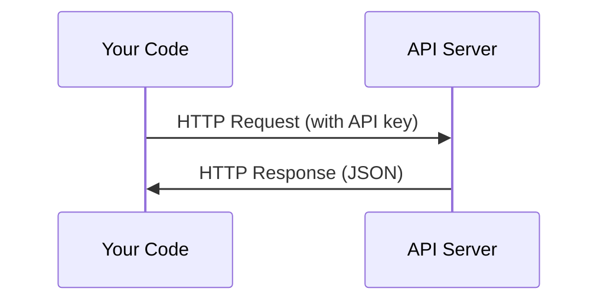

# API ها و کلید ها

> هر API هوش مصنوعی به همان شیوه کار می کند: ارسال یک درخواست، دریافت پاسخ. جزئیات تغییر می کنند، الگوی تغییر نمی کند.

**Type:** Build
**Languages:** Python, TypeScript
**Prerequisites:** Phase 0, Lesson 01
**Time:** ~30 minutes

## اهداف یادگیری

- کلید های API را با استفاده از متغیرهای محیط امن ذخیره کنید و `.env`فایل ها
- با استفاده از هر دو SDK Anthropic Python و HTTP خام یک تماس API LLM را انجام دهید
- مقایسه فرمت های درخواست/پاسخ HTTP مبتنی بر SDK و خام برای دیبگ
- شناسایی و مدیریت خطاهای رایج API از جمله محدودیت های تأیید هویت و نرخ

## مشکل

از مرحله 11 شروع می کنید، شما API های LLM (Anthropic، OpenAI، Google) را می خوانید. در مرحله 13-16 شما عوامل را ایجاد می کنید که از این API ها در حلقه ها استفاده می کنند. شما باید بدانید که کلید های API چگونه کار می کنند، چگونه آنها را به طور ایمن ذخیره کنید و چگونه اولین تماس API خود را انجام دهید.

## مفهوم



هر تماس API:
1. یک نقطه پایان (URL)
2. کلید API (اعتماد)
3. یک سازمان درخواست (چه می خواهید)
4. یک بدن پاسخ (چه چیزی را به شما باز می دهد)

```figure
s0-secret-inject
```

## آن را بسازید

### مرحله 1: کلید های API را به صورت ایمن ذخیره کنید

هرگز کلید API رو در کد نذاريد. از متغيرات محیط استفاده کنيد.

```bash
export ANTHROPIC_API_KEY="sk-ant-..."
export OPENAI_API_KEY="sk-..."
```

یا از یک`.env`فایل (به آن اضافه کنید)`.gitignore`):

```
ANTHROPIC_API_KEY=sk-ant-...
OPENAI_API_KEY=sk-...
```

### مرحله 2: اولین تماس API (Python)

```python
import os

import anthropic

client = anthropic.Anthropic()

MODEL = os.environ.get("LLM_MODEL", "claude-sonnet-5")

response = client.messages.create(
    model=MODEL,
    max_tokens=256,
    messages=[{"role": "user", "content": "What is a neural network in one sentence?"}]
)

print(response.content[0].text)
```

`LLM_MODEL`اینترنتی که در آن به عنوان یک سیستم عامل جدید شناخته می شود، به عنوان یک سیستم عامل جدید و یک سیستم عامل جدید شناخته می شود.

### مرحله 3: اولین تماس API (TypeScript)

```typescript
import Anthropic from "@anthropic-ai/sdk";

const client = new Anthropic();

const MODEL = process.env.LLM_MODEL ?? "claude-sonnet-5";

const response = await client.messages.create({
  model: MODEL,
  max_tokens: 256,
  messages: [{ role: "user", content: "What is a neural network in one sentence?" }],
});

console.log(response.content[0].text);
```

### مرحله 4: HTTP خام (بدون SDK)

```python
import os
import urllib.request
import json

url = "https://api.anthropic.com/v1/messages"
headers = {
    "Content-Type": "application/json",
    "x-api-key": os.environ["ANTHROPIC_API_KEY"],
    "anthropic-version": "2023-06-01",
}
body = json.dumps({
    "model": os.environ.get("LLM_MODEL", "claude-sonnet-5"),
    "max_tokens": 256,
    "messages": [{"role": "user", "content": "What is a neural network in one sentence?"}],
}).encode()

req = urllib.request.Request(url, data=body, headers=headers, method="POST")
with urllib.request.urlopen(req) as resp:
    result = json.loads(resp.read())
    print(result["content"][0]["text"])
```

این کاری است که SDK ها در زیر هود انجام می دهند. درک تماس HTTP خام هنگام دیبگینگ کمک می کند.

## ازش استفاده کن

براي اين دوره:

| API | When you need it | Free tier |
|-----|-----------------|-----------|
| Anthropic (Claude) | Phases 11-16 (agents, tools) | $5 credit on signup |
| OpenAI | Phase 11 (comparison) | $5 credit on signup |
| Hugging Face | Phases 4-10 (models, datasets) | Free |

الان به همهشون نياز ندارين، وقتي که درس لازم باشه، آماده کنين

## -باده

این درس نتیجه می دهد:
- `outputs/prompt-api-troubleshooter.md`- تشخیص خطاهای رایج API

## تمرینات

1. يه کلید API Anthropic رو بدست بيار و اولين تماس API رو انجام بدي
2. نسخه خام HTTP را امتحان کنید و فرمت پاسخ را با نسخه SDK مقایسه کنید
3. با استفاده عمدا از کلید API اشتباه و خواندن پیام خطا

## اصطلاحات کلیدی

| Term | What people say | What it actually means |
|------|----------------|----------------------|
| API key | "Password for the API" | A unique string that identifies your account and authorizes requests |
| Rate limit | "They're throttling me" | Maximum requests per minute/hour to prevent abuse and ensure fair usage |
| Token | "A word" (in API context) | A billing unit: input and output tokens are counted and charged separately |
| Streaming | "Real-time responses" | Getting the response word by word instead of waiting for the full response |
