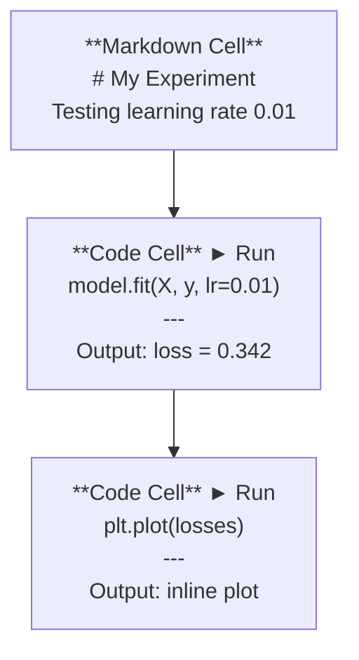
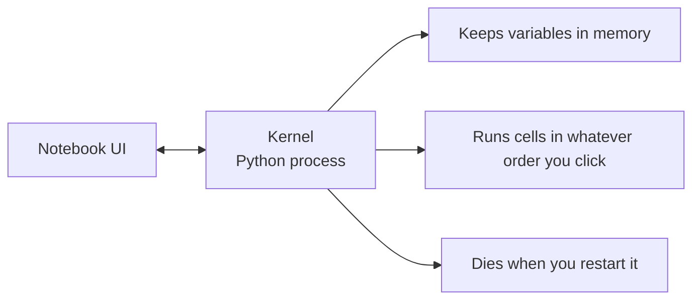

# نوت بوک های ژوپیتر

> لپ تاپ ها صندلی آزمایشگاهی مهندسی هوش مصنوعی هستند. شما نمونه اولیه را در اینجا تهیه می کنید، سپس آنچه که کار می کند را به تولید منتقل می کنید.

**Type:** Build
**Languages:** Python
**Prerequisites:** Phase 0, Lesson 01
**Time:** ~30 minutes

## اهداف یادگیری

- نصب و راه اندازی JupyterLab، Jupyter Notebook، یا VS Code با گسترش Jupyter
- از دستورات جادويي استفاده کنيد (`%timeit`،`%%time`،`%matplotlib inline`) برای مقایسه و تصویربرداری در خط
- تشخیص زمانی که از نوت بوک ها در مقابل اسکریپت ها استفاده کنید و استفاده از جریان کار "در نوت بوک ها جستجو کنید، در اسکریپت ها ارسال کنید"
- شناسایی و اجتناب از تله های معمول لپ تاپ: اجرا خارج از نظم، حالت پنهان و دزدی حافظه

## مشکل

هر مقاله هوش مصنوعی، آموزش و رقابت کگل از نوتیبرهای جپایتر استفاده می کند. آنها به شما اجازه می دهند کد را به قطعات اجرا کنید، خروجی را در خط ببینید، کد را با توضیحات مخلوط کنید و سریع تکرار کنید. اگر شما سعی کنید بدون نوتیب هوش مصنوعی را بدون نوتیب ها یاد بگیرید، شما در حال انجام کارهای ریاضی بدون کاغذ خراش هستید.

اما دفترچه های یادداشت، در آن ها تله های واقعی وجود دارد. مردم از آن ها برای همه چیز استفاده می کنند، از جمله چیزهایی که در آن ها وحشتناک هستند. دانستن زمانی که از دفترچه استفاده کنید و زمانی که از اسکریپت استفاده کنید، شما را از خرابکاری کابوس های بعد نجات می دهد.

## مفهوم

یک دفترچه یادداشت یک لیست از سلول ها است. هر سلول یا کد یا متن است.



هسته یک فرآیند پایتون است که در پس زمینه اجرا می شود. وقتی سلول را اجرا می کنید، کد را به هسته می فرستد، که آن را اجرا می کند و نتیجه را به آن می فرستد. همه سلول ها هسته مشابهی را به اشتراک می گذارند، بنابراین متغیرها بین سلول ها باقی می مانند.



اون قسمت "هرچه سفارش رو که بپرسي" هم قدرت فوق العاده و هم اسلحه ي پاستاده

```figure
s0-cell-order
```

## آن را بسازید

### مرحله اول: رابط خود را انتخاب کنید

سه گزینه، يک فرمت:

| Interface | Install | Best for |
|-----------|---------|----------|
| JupyterLab | `pip install jupyterlab` then `jupyter lab` | Full IDE experience, multiple tabs, file browser, terminal |
| Jupyter Notebook | `pip install notebook` then `jupyter notebook` | Simple, lightweight, one notebook at a time |
| VS Code | Install "Jupyter" extension | Already in your editor, git integration, debugging |

سه تا هم يه چيز رو مي خوانن و مي نويسن`.ipynb`فایل. هرچه دوست دارید انتخاب کنید. JupyterLab رایج ترین کار هوش مصنوعی است.

```bash
pip install jupyterlab
jupyter lab
```

### مرحله دوم: میانبر های کلید که اهمیت دارند

تو دو حالت کار ميکني.`Escape`برای حالت فرمان (بر آبی سمت چپ) `Enter`برای حالت ویرایش (بر سبز)

**Command mode (most used):**

| Key | Action |
|-----|--------|
| `Shift+Enter` | Run cell, move to next |
| `A` | Insert cell above |
| `B` | Insert cell below |
| `DD` | Delete cell |
| `M` | Convert to markdown |
| `Y` | Convert to code |
| `Z` | Undo cell operation |
| `Ctrl+Shift+H` | Show all shortcuts |

**Edit mode:**

| Key | Action |
|-----|--------|
| `Tab` | Autocomplete |
| `Shift+Tab` | Show function signature |
| `Ctrl+/` | Toggle comment |

`Shift+Enter`اوني که تو هزار بار در روز استفاده ميکني اولش ياد بگيري

### مرحله سوم: انواع سلول ها

**Code cells**پایتون رو اجرا کن و محصول رو نمایش بده:

```python
import numpy as np
data = np.random.randn(1000)
data.mean(), data.std()
```

تولید: `(0.0032, 0.9987)`

**Markdown cells**متن فرمت شده را ارائه دهید. از آنها برای مستند کردن آنچه که می کنید و چرا استفاده کنید. از سرنخ ها، جفت، طومار، ریاضیات لاتکس پشتیبانی می کند (`$E = mc^2$`), جدول ها و تصاویر.

### مرحله چهارم: دستورات جادویی

این ها پایتون نیستند، این ها دستورات خاص ژوپیتری هستند که با`%`(جادو خطي) يا`%%`(جادو سلول)

**Time your code:**

```python
%timeit np.random.randn(10000)
```

تولید: `45.2 us +/- 1.3 us per loop`

```python
%%time
model.fit(X_train, y_train, epochs=10)
```

تولید: `Wall time: 2.34 s`

`%timeit`کد رو چند بار اجرا ميکنه و متوسط ميکنه`%%time`يه بار اجرا کن`%timeit`برای نشان های میکروبینچ، `%%time`برای تمرینات

**Enable inline plots:**

```python
%matplotlib inline
```

هر کس`plt.plot()`یا`plt.show()`حالا به طور مستقیم در دفترچه ی یادداشت ها پخش می شود.

**Install packages without leaving the notebook:**

```python
!pip install scikit-learn
```

.`!`پیشگویی هر فرمان شال رو اجرا می کنه

**Check environment variables:**

```python
%env CUDA_VISIBLE_DEVICES
```

### مرحله 5: نمایش محصول غنی در خط

نوت بوک ها آخرین عبارت را در سلول به طور خودکار نمایش می دهند. اما شما می توانید آن را کنترل کنید:

```python
import pandas as pd

df = pd.DataFrame({
    "model": ["Linear", "Random Forest", "Neural Net"],
    "accuracy": [0.72, 0.89, 0.94],
    "training_time": [0.1, 2.3, 45.6]
})
df
```

این یک جدول HTML فرمت شده را ارائه می دهد، نه یک تخلیه متن.

```python
import matplotlib.pyplot as plt

plt.figure(figsize=(8, 4))
plt.plot([1, 2, 3, 4], [1, 4, 2, 3])
plt.title("Inline Plot")
plt.show()
```

این نقشه درست زیر سلول ظاهر می شود. به همین دلیل است که نوت بوک ها بر کار هوش مصنوعی تسلط دارند. شما داده ها، این نقشه و کد را با هم می بینید.

برای تصاویر:

```python
from IPython.display import Image, display
display(Image(filename="architecture.png"))
```

### مرحله 6: گوگل کولاب

Colab یک لپ تاپ Jupyter رایگان در ابر است. این به شما یک GPU، کتابخانه های پیش نصب و یکپارچه سازی Google Drive می دهد. هیچ تنظیم نیاز نیست.

1. برو[colab.research.google.com](https://colab.research.google.com)
2. هرکدوم رو بارگذاری کن`.ipynb`پرونده از این دوره
3. زمان اجرا > نوع زمان اجرا را تغییر دهید > GPU T4 (بخشی)

تفاوت های Colab با Jupyter محلی:
- فایل ها بین جلسات باقی نمی مانند (باغیره در Drive یا دانلود)
- نصب شده از قبل: numpy, pandas, matplotlib, مشعل, tensorflow, sklearn
- `from google.colab import files`برای بارگذاری/بارگیری فایل ها
- `from google.colab import drive; drive.mount('/content/drive')`برای ذخیره سازی مداوم
- زمان توقف جلسات پس از 90 دقیقه بیکار (در سطح رایگان)

## ازش استفاده کن

### نوت بوک ها در مقابل اسکریپت: چه زمانی باید از کدام استفاده شود

| Use notebooks for | Use scripts for |
|-------------------|-----------------|
| Exploring a dataset | Training pipelines |
| Prototyping a model | Reusable utilities |
| Visualizing results | Anything with `if __name__` |
| Explaining your work | Code that runs on a schedule |
| Quick experiments | Production code |
| Course exercises | Packages and libraries |

قانون:**explore in notebooks, ship in scripts**. .

یک جریان کار مشترک در هوش مصنوعی:
1. اطلاعات را در یک دفترچه یادداشت جستجو کنید
2. نمونه ي مدل خود را در دفترچه يادداشت
3. وقتي کار ميکنه کد رو به  منتقل کن`.py`فایل ها
4. واردشون کن`.py`پرونده ها رو برگردونيد به دفترچه يادداشت براي تجارب ديگر

### تله های مشترک

**Out-of-order execution.**شما سلول 5، سپس سلول 2، سپس سلول 7 را اجرا می کنید. نوت بوک روی دستگاه شما کار می کند اما وقتی کسی آن را از بالا به پایین اجرا می کند، شکسته می شود. درست کنید: هسته > دوباره شروع و همه را اجرا کنید قبل از به اشتراک گذاری.

**Hidden state.**شما یک سلول را حذف می کنید اما متغیر ایجاد شده هنوز در حافظه است. نوت بوک پاک به نظر می رسد اما به یک سلول شبح بستگی دارد. درست: هسته را به طور منظم دوباره شروع کنید.

**Memory leaks.**بارگذاری مجموعه داده های 4 گیگابایت، آموزش یک مدل، بارگذاری مجموعه داده های دیگر هیچ چیز آزاد نمی شود.`del variable_name`و`gc.collect()`، یا دوباره شروع کردن هسته

## -باده

این درس نتیجه می دهد:
- `outputs/prompt-notebook-helper.md`برای رفع مشکلات دفترچه یادداشت

## تمرینات

1. JupyterLab را باز کنید، یک دفترچه یادداشت ایجاد کنید و از آن استفاده کنید `%timeit`برای مقایسه درک لیست با numpy برای ایجاد یک آرایه از 100،000 عدد تصادفی
2. یک دفترچه یادداشت با هر دو سلول مرجع و کد ایجاد کنید که یک CSV بارگذاری شود، یک فریم داده نمایش داده شود و یک نمودار را نشان دهد. سپس Kernel > Restart & Run All را اجرا کنید تا تأیید کنید که از بالا تا پایین کار می کند
3. کد رو از`code/notebook_tips.py`، آن را به یک لپ تاپ Colab، و آن را با یک GPU رایگان اجرا

## اصطلاحات کلیدی

| Term | What people say | What it actually means |
|------|----------------|----------------------|
| Kernel | "The thing running my code" | A separate Python process that executes cells and keeps variables in memory |
| Cell | "A code block" | An independently runnable unit in a notebook, either code or markdown |
| Magic command | "Jupyter tricks" | Special commands prefixed with `%` or `%%` that control the notebook environment |
| `.ipynb` | "Notebook file" | A JSON file containing cells, outputs, and metadata. Stands for IPython Notebook |

## خواندن بیشتر

- [JupyterLab Docs](https://jupyterlab.readthedocs.io/)برای مجموعه ویژگی های کامل
- [Google Colab FAQ](https://research.google.com/colaboratory/faq.html)برای محدودیت ها و ویژگی های خاص Colab
- [28 Jupyter Notebook Tips](https://www.dataquest.io/blog/jupyter-notebook-tips-tricks-shortcuts/)برای میانبر های کاربری برق
