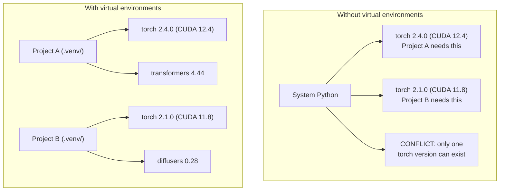

# محیط های پایتون

> جهنم وابسته بودن واقعي هست. محیط های مجازی درمان هستند.

**Type:** Build
**Languages:** Shell
**Prerequisites:** Phase 0, Lesson 01
**Time:** ~30 minutes

## اهداف یادگیری

- ایجاد محیط های مجازی متمایز با استفاده از `uv`،`venv`، یا`conda`
- يه حرف بنويس`pyproject.toml`با گروه های وابسته اختیاری و تولید فایل های قفل برای قابلیت بازیافت
- تشخیص و رفع مشکلات رایج: نصب جهانی، مخلوط کردن پیپ/کوند، عدم مطابقت نسخه CUDA
- اجرای یک استراتژی محیط زیست در هر مرحله برای پروژه هایی که وابستگی های متناقض دارند

## مشکل

شما PyTorch 2.4 را برای یک پروژه تنظیم دقیق نصب می کنید. هفته آینده، یک پروژه دیگر به PyTorch 2.1 نیاز دارد زیرا ساخت CUDA آن بسته شده است. شما به طور جهانی ارتقا می دهید و پروژه اول متوقف می شود. شما درج پایین می آورید و دوم متوقف می شود.

این جهنم وابستگی است. این اتفاق در کار AI / ML به طور مداوم اتفاق می افتد چون:

- پایتورچ، جاکس و تانسور فلو هر کدام پیوند های خود را CUDA ارسال
- کتابخانه های مدل نسخه های چارچوب خاص را مشخص می کنند
- یک جهانی`pip install`هر چيزي که قبلاً اونجا بود رو از هم مي نويسه
- ساخت CUDA 11.8 با راننده های CUDA 12.x کار نمی کند (و برعکس)

راه حل: هر پروژه یک محیط جداگانه با بسته های خاص خود را می گیرد.

## مفهوم



```figure
s0-env-isolation
```

## آن را بسازید

### گزینه ی ۱: uv venv (توصیه می شود)

`uv`این سریع ترین مدیر بسته های پایتون است (10-100 برابر سریع تر از پیپ). این محیط های مجازی، نسخه های پایتون و قطعنامه وابستگی را در یک ابزار اداره می کند.

```bash
curl -LsSf https://astral.sh/uv/install.sh | sh

uv python install 3.12

cd your-project
uv venv
source .venv/bin/activate
```

بسته های نصب:

```bash
uv pip install torch numpy
```

پروژه ای را با `pyproject.toml`در یک مرحله:

```bash
uv init my-ai-project
cd my-ai-project
uv add torch numpy matplotlib
```

### گزینه دوم: venv (بنیاد)

اگه نتوني نصب کني`uv`، سفينهاي پايتون با`venv`:

```bash
python3 -m venv .venv
source .venv/bin/activate  # Linux/macOS
.venv\Scripts\activate     # Windows

pip install torch numpy
```

آهسته تر از`uv`، اما در هر جا که پایتون نصب شده کار می کند.

### گزینه سوم: کندا (وقتی نیاز دارید)

Conda وابستگی های غیر پایتون مانند کیت ابزار CUDA، cuDNN و کتابخانه های C را مدیریت می کند.

- شما به نسخه ی ابزارک مخصوص CUDA نیاز دارید بدون اینکه آن را در کل سیستم نصب کنید
- تو در یک خوشه مشترک هستی که نمیتونی بسته های سیستم رو نصب کنی
- دستورالعمل نصب کتابخانه میگه "استفاده کندا"

```bash
# Install miniconda (not the full Anaconda)
curl -LsSf https://repo.anaconda.com/miniconda/Miniconda3-latest-Linux-x86_64.sh -o miniconda.sh
bash miniconda.sh -b

conda create -n myproject python=3.12
conda activate myproject

conda install pytorch torchvision torchaudio pytorch-cuda=12.4 -c pytorch -c nvidia
```

یک قانون: اگر شما برای یک محیط استفاده می کنید، برای تمام بسته های موجود در آن محیط استفاده کنید. مخلوط کردن `pip install`به یک محیط کندا منجر به تعلقی می شود که مشکل تر از رفع مشکل است.

### برای این دوره: استراتژی مرحله ای

شما می توانید یک محیط برای کل دوره ایجاد کنید. این کار را نکنید. مراحل مختلف نیاز به وابستگی های مختلف (گاهی اوقات متناقض) دارند.

استراتژی:

```
ai-engineering-from-scratch/
├── .venv/                    <-- shared lightweight env for phases 0-3
├── phases/
│   ├── 04-neural-networks/
│   │   └── .venv/            <-- PyTorch env
│   ├── 05-cnns/
│   │   └── .venv/            <-- same PyTorch env (symlink or shared)
│   ├── 08-transformers/
│   │   └── .venv/            <-- might need different transformer versions
│   └── 11-llm-apis/
│       └── .venv/            <-- API SDKs, no torch needed
```

اسکریپت در`code/env_setup.sh`محیط پایه ای برای این دوره ایجاد می کند.

## pyproject.toml اصول

هر پروژه پایتون باید یک`pyproject.toml`. جايگزين ميکنه`setup.py`،`setup.cfg`و`requirements.txt`در يک پرونده

```toml
[project]
name = "ai-engineering-from-scratch"
version = "0.1.0"
requires-python = ">=3.11"
dependencies = [
    "numpy>=1.26",
    "matplotlib>=3.8",
    "jupyter>=1.0",
    "scikit-learn>=1.4",
]

[project.optional-dependencies]
torch = ["torch>=2.3", "torchvision>=0.18"]
llm = ["anthropic>=0.39", "openai>=1.50"]
```

پس نصب کن:

```bash
uv pip install -e ".[torch]"    # base + PyTorch
uv pip install -e ".[llm]"     # base + LLM SDKs
uv pip install -e ".[torch,llm]" # everything
```

## فایل های قفل

یک فایل قفل هر وابستگی (از جمله متغیر) را به نسخه های دقیق می کند. این قابلیت بازیافت را تضمین می کند: هر کسی که از فایل قفل نصب کند دقیقاً همان بسته ها را دریافت می کند.

```bash
# uv generates uv.lock automatically when using uv add
uv add numpy

# pip-tools approach
uv pip compile pyproject.toml -o requirements.lock
uv pip install -r requirements.lock
```

فایل قفل رو به git بده وقتي کسي رپو رو کلان کنه از فایل قفل نصب ميکنه و نسخه هاي مشابهي پيدا ميکنه

## اشتباهات رایج

### 1. نصب در سطح جهانی

```bash
pip install torch  # BAD: installs to system Python

source .venv/bin/activate
pip install torch  # GOOD: installs to virtual environment
```

چک کن که بسته هات کجا میره:

```bash
which python       # should show .venv/bin/python, not /usr/bin/python
which pip           # should show .venv/bin/pip
```

### 2. مخلوط کردن پیپ و کندا

```bash
conda create -n myenv python=3.12
conda activate myenv
conda install pytorch -c pytorch
pip install some-other-package   # BAD: can break conda's dependency tracking
conda install some-other-package # GOOD: let conda manage everything
```

اگر باید از پیپ در داخل کاندا استفاده کنید (بعضی بسته ها فقط پیپ هستند) ، ابتدا تمام بسته های کاندا را نصب کنید، سپس بسته های پیپ به پایان می رسند.

### 3. فراموش کردن فعال کردن

```bash
python train.py           # uses system Python, missing packages
source .venv/bin/activate
python train.py           # uses project Python, packages found
```

در دستورات shell شما باید نام محیط نمایش داده شود:

```
(.venv) $ python train.py
```

### 4. . . . . . . . . . . . . . . . . . . . . . . . . . . . . . . . . . . . . . . . . . . . . . . . . . . . . . . . . . . . . . . . . . . . . . . . . . . . . . . . . . . . . . . . . . . . . . . . . . . . . . . . . . . . . . . . . . . . . . . . . . . . . . . . . . . . . . . . . . . . . . . . . . . . . . . . . . . . . . . . . . . . . . . . . . . . . . . . . . . . . . . . . . . . . . . . . . . . . . . . . . . . . . . . . . . . . . . . . . . . . . . . . . . . . . . . . . . . . . . . . . . . . . . . . . . . . . . . . . . . . . . . . . . . . . . . . . . . . . . . . . . . . . . . . . . . . . . . . . . . . . . . . . . . . . . . . . . . . . . . . . . . . . . . . . . . . . . . . . . . . . . . . . . . . . . . . . . . . . . . . . . . . . . . . . . . . . . . . . . . . . . . . . . . . . . . . . . . . . . . . . . . . . . . . . . . . . . . . . . . . . . . . . . . . . . . . . . . . . . . . . . . . . . . . . . . . . . . . . . . . . . . . . . . . . . . . . . . . . . . . . . . . . . . . . . . . . . . . . . . . . . . . . . . . . .

```bash
echo ".venv/" >> .gitignore
```

محیط های مجازی 200 میگابایت تا 2 گیگابایت هستند. محلی هستند، نه قابل حمل بین ماشین ها. تعهد`pyproject.toml`و در عوض پرونده قفل

### 5. مطابقت نابرابری نسخه CUDA

```bash
nvidia-smi                # shows driver CUDA version (e.g., 12.4)
python -c "import torch; print(torch.version.cuda)"  # shows PyTorch CUDA version

# These must be compatible.
# PyTorch CUDA version must be <= driver CUDA version.
```

## ازش استفاده کن

اسکریپت تنظیمات را اجرا کنید تا محیط دوره خود را ایجاد کنید:

```bash
bash phases/00-setup-and-tooling/06-python-environments/code/env_setup.sh
```

این باعث می شه`.venv`در ریشه repo با وابستگی های هسته ای نصب شده و تأیید شده است.

## تمرینات

1. فرار کن`env_setup.sh`و تمام چک ها رو تایید کن
2. یک محیط مجازی دوم ایجاد کنید، نسخه دیگری از numpy را در آن نصب کنید و تایید کنید که دو محیط متمایز هستند
3. يه حرف بنويس`pyproject.toml`برای یک پروژه که به PyTorch و SDK Anthropic نیاز دارد
4. عمداً یک بسته را در سطح جهانی نصب کنید (بدون فعال کردن یک venv) ، توجه کنید که به کجا می رود، سپس آن را لغو کنید

## اصطلاحات کلیدی

| Term | What people say | What it actually means |
|------|----------------|----------------------|
| Virtual environment | "A venv" | An isolated directory containing a Python interpreter and packages, separate from the system Python |
| Lockfile | "Pinned dependencies" | A file listing every package and its exact version, guaranteeing identical installs across machines |
| pyproject.toml | "The new setup.py" | The standard Python project configuration file, replacing setup.py/setup.cfg/requirements.txt |
| Transitive dependency | "A dependency of a dependency" | Package B depends on C; if you install A which depends on B, C is a transitive dependency of A |
| CUDA mismatch | "My GPU isn't working" | PyTorch was compiled for a different CUDA version than what your GPU driver supports |
