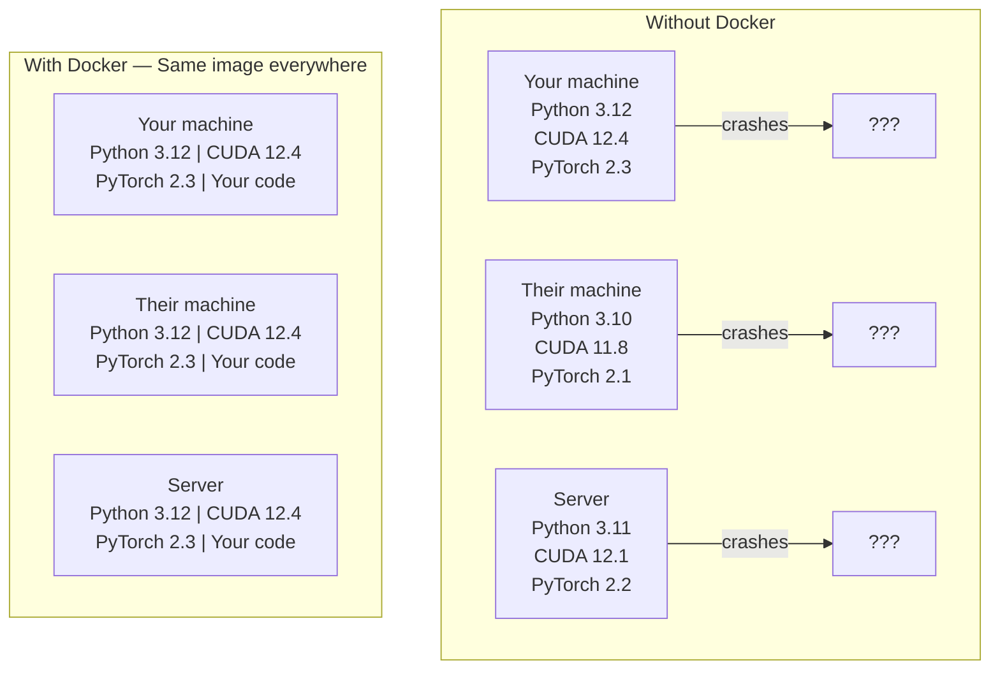

# Docker برای AI

> کانتینر ها "کار روی ماشین من" را به گذشته تبدیل می کنند.

**Type:** Build
**Languages:** Docker
**Prerequisites:** Phase 0, Lessons 01 and 03
**Time:** ~60 minutes

## اهداف یادگیری

- ایجاد یک تصویر Docker با GPU با CUDA، PyTorch و کتابخانه های AI از یک فایل Docker
- دایرکتوری های میزبان را به عنوان حجم برای حفظ مدل ها، مجموعه داده ها و کد در سراسر بازسازی های کانتینر نصب کنید
- پیکربندی ابزار NVIDIA Container Toolkit برای افشا کردن GPU ها در داخل کانتینر
- برنامه های کاربردی AI چند سرویس (سرور تعبیر + پایگاه داده ویکتور) را با استفاده از Docker Compose آرکیستر کنید

## مشکل

شما یک مدل را در لپ تاپ خود با PyTorch 2.3، CUDA 12.4 و Python 3.12 آموزش داده اید. همکار شما دارای PyTorch 2.1، CUDA 11.8 و Python 3.10 است. مدل شما در ماشین آنها سقوط می کند. فایل Docker شما در هر دو کار می کند.

پروژه های هوش مصنوعی کابوس های وابستگی هستند. یک دسته معمول شامل پایتون، PyTorch، رانندگان CUDA، cuDNN، کتابخانه های سطح سیستم C و بسته های تخصصی مانند فلاش-attn است که نیاز به نسخه های کامپایلر دقیق دارند. Docker همه این ها را به یک تصویر واحد می کند که در همه جا یکسان اجرا می شود.

## مفهوم

Docker کد، زمان اجرا، کتابخانه ها و ابزارهای سیستم شما را به یک واحد جداگانه به نام یک کانتینر پیچیده می کند. آن را به عنوان یک ماشین مجازی سبک فکر کنید، به جز اینکه در جای اجرای خود هسته OS میزبان را به اشتراک می گذارد، بنابراین در ثانیه به جای دقیقه شروع می شود.



### چرا پروژه های هوش مصنوعی بیشتر از اکثر پروژه ها به Docker نیاز دارند

1. **GPU drivers are fragile.**کد CUDA 12.4 در CUDA 11.8 اجرا نمی شود. Docker ابزار CUDA را در داخل کانتینر از طریق NVIDIA Container Toolkit جدا می کند و در حالی که درایور GPU میزبان را به اشتراک می گذارد.

2. **Model weights are large.**یک مدل پارامتر 7B 14 گیگابایت در fp16 است. شما نمی خواهید آن را هر بار که بازسازی می کنید دوباره دانلود کنید. حجم های Docker اجازه می دهد تا شما یک دایرکتوری مدل را از میزبان نصب کنید.

3. **Multi-service architectures are common.**یک برنامه واقعی هوش مصنوعی فقط یک اسکریپت پایتون نیست. این یک سرور نتیجه گیری، یک پایگاه داده ویکتور برای RAG، شاید یک فرونتند وب است. Docker Compose همه اینها را با یک فرمان تنظیم می کند.

### ذخایر کلیدی

| Term | What it means |
|------|---------------|
| Image | A read-only template. Your recipe. Built from a Dockerfile. |
| Container | A running instance of an image. Your kitchen. |
| Dockerfile | Instructions to build an image. Layer by layer. |
| Volume | Persistent storage that survives container restarts. |
| docker-compose | A tool for defining multi-container applications in YAML. |

### الگوهای کنتینر مشترک در AI

```
Dev Container
  Full toolkit. Editor support. Jupyter. Debugging tools.
  Used during development and experimentation.

Training Container
  Minimal. Just the training script and dependencies.
  Runs on GPU clusters. No editor, no Jupyter.

Inference Container
  Optimized for serving. Small image. Fast cold start.
  Runs behind a load balancer in production.
```

```figure
s0-image-layers
```

## آن را بسازید

### مرحله اول: نصب Docker

```bash
# macOS
brew install --cask docker
open /Applications/Docker.app

# Ubuntu
curl -fsSL https://get.docker.com | sh
sudo usermod -aG docker $USER
# Log out and back in for group change to take effect
```

بررسی کنید:

```bash
docker --version
docker run hello-world
```

### مرحله 2: ابزار NVIDIA Container Toolkit (لینوکس با GPU NVIDIA) را نصب کنید

این اجازه می دهد تا کانتینر های Docker به GPU شما دسترسی داشته باشند. کاربران macOS و Windows (WSL2) می توانند این کار را رد کنند؛ Docker Desktop در این سیستم عامل ها با GPU متفاوت کار می کند.

```bash
distribution=$(. /etc/os-release;echo $ID$VERSION_ID)
curl -fsSL https://nvidia.github.io/libnvidia-container/gpgkey | sudo gpg --dearmor -o /usr/share/keyrings/nvidia-container-toolkit-keyring.gpg
curl -s -L https://nvidia.github.io/libnvidia-container/$distribution/libnvidia-container.list | \
    sed 's#deb https://#deb [signed-by=/usr/share/keyrings/nvidia-container-toolkit-keyring.gpg] https://#g' | \
    sudo tee /etc/apt/sources.list.d/nvidia-container-toolkit.list

sudo apt-get update
sudo apt-get install -y nvidia-container-toolkit
sudo nvidia-ctk runtime configure --runtime=docker
sudo systemctl restart docker
```

دسترسی GPU را در داخل یک کانتینر آزمایش کنید:

```bash
docker run --rm --gpus all nvidia/cuda:12.4.1-base-ubuntu22.04 nvidia-smi
```

اگه اطلاعات گپيو رو ببيني، ابزار کار ميکنه

### مرحله سوم: درک تصاویر پایه

انتخاب تصویر پایه درست ساعت ها از دیبگینگ را صرفه جویی می کند.

```
nvidia/cuda:12.4.1-devel-ubuntu22.04
  Full CUDA toolkit. Compilers included.
  Use for: building packages that need nvcc (flash-attn, bitsandbytes)
  Size: ~4 GB

nvidia/cuda:12.4.1-runtime-ubuntu22.04
  CUDA runtime only. No compilers.
  Use for: running pre-built code
  Size: ~1.5 GB

pytorch/pytorch:2.6.0-cuda12.4-cudnn9-runtime
  PyTorch pre-installed on top of CUDA.
  Use for: skipping the PyTorch install step
  Size: ~6 GB

python:3.12-slim
  No CUDA. CPU only.
  Use for: inference on CPU, lightweight tools
  Size: ~150 MB
```

### مرحله 4: یک فایل Docker برای توسعه AI بنویسید

اينم فایل دوکر در`code/Dockerfile`. از اونجا عبور کن

```dockerfile
FROM --platform=linux/amd64 nvidia/cuda:12.4.1-devel-ubuntu22.04

ENV DEBIAN_FRONTEND=noninteractive
ENV PYTHONUNBUFFERED=1

RUN apt-get update && apt-get install -y --no-install-recommends \
    software-properties-common \
    git \
    curl \
    build-essential \
    && add-apt-repository -y ppa:deadsnakes/ppa \
    && apt-get update && apt-get install -y --no-install-recommends \
    python3.12 \
    python3.12-venv \
    python3.12-dev \
    && rm -rf /var/lib/apt/lists/*

RUN update-alternatives --install /usr/bin/python python /usr/bin/python3.12 1

RUN curl -sSL https://raw.githubusercontent.com/pypa/get-pip/3b73145063be545b649ad9ca83ea8da5fc915a4f/public/get-pip.py -o /tmp/get-pip.py \
    && echo "a341e1a43e38001c551a1508a73ff23636a11970b61d901d9a1cad2a18f57055  /tmp/get-pip.py" | sha256sum -c - \
    && python /tmp/get-pip.py \
    && rm /tmp/get-pip.py \
    && update-alternatives --install /usr/bin/pip pip /usr/local/bin/pip3.12 1

RUN python -m pip install --no-cache-dir --upgrade pip setuptools wheel

RUN python -m pip install --no-cache-dir \
    torch==2.6.0+cu124 \
    torchvision==0.21.0+cu124 \
    torchaudio==2.6.0+cu124 \
    --index-url https://download.pytorch.org/whl/cu124

RUN python -m pip install --no-cache-dir \
    numpy \
    pandas \
    scikit-learn \
    matplotlib \
    jupyter \
    transformers \
    datasets \
    accelerate \
    safetensors

WORKDIR /workspace

VOLUME ["/workspace", "/models"]

EXPOSE 8888

CMD ["python"]
```

ساختش کن

```bash
docker build -t ai-dev -f phases/00-setup-and-tooling/07-docker-for-ai/code/Dockerfile .
```

این کار در اولین بار مدتی طول می کشد (تنزیل تصویر پایه CUDA + PyTorch). ساختارهای بعدی از لایه های ذخیره شده استفاده می کنند.

**macOS / Apple Silicon (M1/M2/M3/M4):**.`--platform=linux/amd64`در`FROM`این خط چیزی است که باعث موفقیت این ساخت در یک مک می شود. تصویر پایه CUDA همچنین یک نوع arm64 را ارسال می کند و Docker Desktop آن را به طور خودکار در Apple Silicon انتخاب می کند، اما PyTorch نسخه خود را منتشر می کند `cu124`فقط چرخ های x86_64، پس `pip install torch==2.6.0+cu124`لایه با `No matching distribution found for torch==2.6.0+cu124`.پلتفرم را وصل کردن تصویر x86_64 را کشیده و تحت شبیه سازی اجرا می کند: ساخت کندتر است و کانتینر هیچ GPU (هیچ CUDA در یک مک وجود ندارد).`--gpus all`از`docker run`برای کار GPU در Apple Silicon، درس ها را با ساخت MPS از درس 01 اجرا کنید و این تصویر را برای میزبان های x86_64 لینوکس با GPU NVIDIA نگه دارید.

اجرا کن

```bash
docker run --rm -it --gpus all \
    -v $(pwd):/workspace \
    -v ~/models:/models \
    ai-dev python -c "import torch; print(f'PyTorch {torch.__version__}, CUDA: {torch.cuda.is_available()}')"
```

Jupyter رو داخل کانتینر اجرا کن:

```bash
docker run --rm -it --gpus all \
    -v $(pwd):/workspace \
    -v ~/models:/models \
    -p 8888:8888 \
    ai-dev jupyter notebook --ip=0.0.0.0 --port=8888 --no-browser --allow-root
```

### مرحله 5: نصب حجم برای داده ها و مدل ها

حجم نصب برای کار هوش مصنوعی بسیار مهم است. بدون آنها، دانلود مدل 14 گیگابایت شما وقتی کانتینر متوقف می شود ناپدید می شود.

```bash
# Mount your code
-v $(pwd):/workspace

# Mount a shared models directory
-v ~/models:/models

# Mount datasets
-v ~/datasets:/data
```

در متن آموزش شما، از مسیر نصب شده بارگذاری کنید:

```python
from transformers import AutoModel

model = AutoModel.from_pretrained("/models/llama-7b")
```

مدل روی سیستم فایل های میزبان شما زندگی می کنه. ظرف رو هرچقدر که میخوای بدون اینکه دوباره دانلودش کنی دوباره بسازید.

### مرحله 6: Docker برای برنامه های AI چند سرویس ترکیب کنید

یک برنامه واقعی RAG به یک سرور نتیجه گیری و یک پایگاه داده ویکتور نیاز دارد. Docker Compose هر دو را با یک فرمان اجرا می کند.

ببین`code/docker-compose.yml`:

```yaml
services:
  ai-dev:
    build:
      context: .
      dockerfile: Dockerfile
    deploy:
      resources:
        reservations:
          devices:
            - driver: nvidia
              count: all
              capabilities: [gpu]
    volumes:
      - ../../../:/workspace
      - ~/models:/models
      - ~/datasets:/data
    ports:
      - "8888:8888"
    stdin_open: true
    tty: true
    command: jupyter notebook --ip=0.0.0.0 --port=8888 --no-browser --allow-root

  qdrant:
    image: qdrant/qdrant:v1.12.5
    ports:
      - "6333:6333"
      - "6334:6334"
    volumes:
      - qdrant_data:/qdrant/storage

volumes:
  qdrant_data:
```

همه چيز رو شروع کن

```bash
cd phases/00-setup-and-tooling/07-docker-for-ai/code
docker compose up -d
```

حالا ظرف توسعه هوش مصنوعی شما می تواند به پایگاه داده ویکتور در `http://qdrant:6333`Docker Compose یک شبکه مشترک را به طور خودکار ایجاد می کند.

از داخل ظرف هوش مصنوعی ارتباط را امتحان کنید:

```python
from qdrant_client import QdrantClient

client = QdrantClient(host="qdrant", port=6333)
print(client.get_collections())
```

همه چيز رو متوقف کن

```bash
docker compose down
```

اضافه کردن`-v`برای حذف حجم qdrant:

```bash
docker compose down -v
```

### مرحله 7: دستورات مفید Docker برای کار هوش مصنوعی

```bash
# List running containers
docker ps

# List all images and their sizes
docker images

# Remove unused images (reclaim disk space)
docker system prune -a

# Check GPU usage inside a running container
docker exec -it <container_id> nvidia-smi

# Copy a file from container to host
docker cp <container_id>:/workspace/results.csv ./results.csv

# View container logs
docker logs -f <container_id>
```

## ازش استفاده کن

حالا شما یک محیط توسعه هوش مصنوعی قابل تکرار دارید. برای بقیه این دوره:

- استفاده کنید`docker compose up`برای شروع محیط توسعه و پایگاه داده متری خود را با هم
- کد، مدل ها و داده های خود را به شکل حجم قرار دهید تا هیچ چیزی بین بازسازی ها از دست نرود
- وقتی یک درس نیاز به یک بسته جدید پایتون دارد، آن را به فایل Docker اضافه کنید و دوباره آن را بسازید
- پرونده دوکرت رو با هم تیمیت به اشتراک بگذار اونا دقیقاً همین محیط رو دارن

### هیچ گپشو نداری؟

 حذف کن`--gpus all`پایتورچ عدم وجود CUDA را تشخیص می دهد و به طور خودکار به CPU برمی گردد.

## تمرینات

1. فایل Docker رو بساز و اجرا کن`python -c "import torch; print(torch.__version__)"`داخل ظرف
2. شروع کردن دسته بندی دوکر و بررسی کنید که Qdrant از ظرف AI در `http://qdrant:6333/collections`
3. اضافه کردن`flask`به فایل Docker، بازسازی کنید و یک سرور API ساده را در پورت 5000 اجرا کنید. پورت را با `-p 5000:5000`
4. اندازه تصویر را با  اندازه گیری کنید`docker images`. سعی کن عکس پایه رو از`devel`به`runtime`و اندازه ها را مقایسه کنید

## اصطلاحات کلیدی

| Term | What people say | What it actually means |
|------|----------------|----------------------|
| Container | "Lightweight VM" | An isolated process using the host kernel, with its own filesystem and network |
| Image layer | "Cached step" | Each Dockerfile instruction creates a layer. Unchanged layers are cached, so rebuilds are fast. |
| NVIDIA Container Toolkit | "GPU in Docker" | A runtime hook that exposes host GPUs to containers via `--gpus` flag |
| Volume mount | "Shared folder" | A directory on the host mapped into the container. Changes persist after the container stops. |
| Base image | "Starting point" | The `FROM` image your Dockerfile builds on top of. Determines what is pre-installed. |
