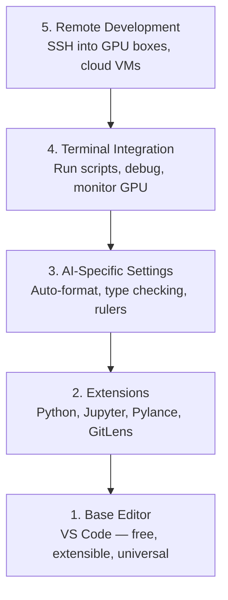

# تنظیمات ویرایشگر

> . مدیر شما همپلوتی شماست . یک بار آن را تنظیم کنید تا از راه شما دور بماند و شروع به کشیدن وزن خود کند

**Type:** Build
**Languages:** --
**Prerequisites:** Phase 0, Lesson 01
**Time:** ~20 minutes

## اهداف یادگیری

- نصب کد VS با افزونه های ضروری برای پایتون، Jupyter، linting و SSH از راه دور
- تنظیم قالب-در- ذخیره، بررسی نوع و اسکرول ورودی نوت بوک برای جریان کار هوش مصنوعی
- تنظیم Remote SSH برای ویرایش و اشکال زدایی کد در دستگاه های GPU دور افتاده مانند آنها محلی
- ارزیابی گزینه های ویرایشگر (Cursor، Windsurf، Neovim) و معامله های آنها برای کار هوش مصنوعی

## مشکل

شما هزاران ساعت را در داخل ویرایشگر خود می گذرانید که پایتون را می نویسید، نوت بوکها را اجرا می کنید، حلقه های آموزشی را خراب می کنید و SSH را در جعبه های GPU قرار می دهید. یک ویرایشگر اشتباه هر جلسه را به اصطکاک تبدیل می کند: هیچ تعدیل خودکار، هیچ راهنمایی تایپ، هیچ خط خط خط، فرمت دستی و یک جریان کار محرکه.

تنظیم درست 20 دقیقه طول میکشه و ازش فرار کردن 20 دقیقه رو در روز میخوره

## مفهوم

یک ویرایشگر مهندسی هوش مصنوعی به پنج چیز نیاز دارد:



```figure
s0-lsp-roundtrip
```

## آن را بسازید

### مرحله اول: کد VS را نصب کنید

VS Code ویرایشگر توصیه شده است. این رایگان است، در هر سیستم عامل اجرا می شود، پشتیبانی از لپ تاپ های Jupyter درجه اول دارد و اکوسیستم تمدید همه چیز را برای کار هوش مصنوعی نیاز دارید.

از [code.visualstudio.com](https://code.visualstudio.com/). .

از ترمینال چک کن:

```bash
code --version
```

اگه`code`در macOS پیدا نمی شود، کد VS را باز کنید، فشار دهید `Cmd+Shift+P`، "شال فرمان" را تایپ کنید و "نظم کد را در PATH نصب کنید" را انتخاب کنید.

### مرحله دوم: افزونه های ضروری را نصب کنید

ترمینال یکپارچه را در کد VS باز کنید (`)` Ctrl+``` در هر پلتفرم) و نصب افزونهایی که برای کار هوش مصنوعی مهم هستند:

```bash
code --install-extension ms-python.python
code --install-extension ms-python.vscode-pylance
code --install-extension ms-toolsai.jupyter
code --install-extension eamodio.gitlens
code --install-extension ms-vscode-remote.remote-ssh
code --install-extension ms-python.debugpy
code --install-extension ms-python.black-formatter
code --install-extension charliermarsh.ruff
```

هرکدوم از اونا چه کار ميکنن:

| Extension | Why |
|-----------|-----|
| Python | Language support, virtual env detection, run/debug |
| Pylance | Fast type checking, autocomplete, import resolution |
| Jupyter | Run notebooks inside VS Code, variable explorer |
| GitLens | See who changed what, inline git blame |
| Remote SSH | Open a folder on a remote GPU box as if it were local |
| Debugpy | Step-through debugging for Python |
| Black Formatter | Auto-format on save, consistent style |
| Ruff | Fast linting, catches common mistakes |

پرونده`code/.vscode/extensions.json`در این درس، لیست کامل توصیه ها وجود دارد. وقتی پوشه پروژه را باز می کنید، کد VS شما را به نصب آنها می خواهد.

### مرحله سوم: تنظیم تنظیمات

تنظیمات رو از  کپی کن`code/.vscode/settings.json`در این درس، یا آنها را به صورت دستی از طریق `Settings > Open Settings (JSON)`. .

تنظیمات کلیدی برای کار هوش مصنوعی:

```jsonc
{
    "python.analysis.typeCheckingMode": "basic",
    "editor.formatOnSave": true,
    "editor.rulers": [88, 120],
    "notebook.output.scrolling": true,
    "files.autoSave": "afterDelay"
}
```

چرا این ها مهم هستند:

- **Type checking on basic**: قبل از اجرا کردن انواع اشتباه استدلال را ضبط می کند. زمان دیبگینگ در عدم مطابقت شکل تنسور و پارامترهای API اشتباه را ذخیره می کند.
- **Format on save**هرگز به فرمت کردن فکر نکنم. سیاهش کارش رو انجام میده.
- **Rulers at 88 and 120**: سیاه بسته در 88 نشانگر 120 نشان می دهد که زمانی که سند ها و نظرات بیش از حد طولانی می شوند.
- **Notebook output scrolling**: حلقه های آموزش هزاران خط چاپ می کنند. بدون اسکرول، پنل خروجی منفجر می شود.
- **Auto-save**شما ذخیره کردن را فراموش خواهید کرد. اسکریپت آموزش شما کد قدیمی را اجرا خواهد کرد. ذخیره سازی خودکار مانع از این می شود.

### مرحله چهارم: ادغام ترمینال

ترمینال یکپارچه VS Code جایی است که شما اسکریپت های آموزشی را اجرا می کنید، GPU ها را نظارت می کنید و محیط ها را مدیریت می کنید.

درست تنظیمش کن

```jsonc
{
    "terminal.integrated.defaultProfile.osx": "zsh",
    "terminal.integrated.defaultProfile.linux": "bash",
    "terminal.integrated.fontSize": 13,
    "terminal.integrated.scrollback": 10000
}
```

راه کوتاه های مفید:

| Action | macOS | Linux/Windows |
|--------|-------|---------------|
| Toggle terminal | `` Ctrl+` `` | `` Ctrl+` `` |
| New terminal | `` Ctrl+Shift+` `` | `` Ctrl+Shift+` `` |
| Split terminal | `Cmd+\` | `Ctrl+Shift+5` |

ترمینل های تقسیم شده مفید هستند: یکی برای اجرای اسکریپت شما، یکی برای نظارت بر GPU با `nvidia-smi -l 1`یا`watch -n 1 nvidia-smi`. .

### مرحله 5: توسعه از راه دور (SSH به جعبه های GPU)

این مهمترین افزونه برای کار هوش مصنوعی است. شما در ماشین های دور افتاده (VM های ابر، سرورهای آزمایشگاه، Lambda، Vast.ai) آموزش اجرا خواهید کرد. SSH از راه دور به شما امکان می دهد سیستم فایل های دور افتاده را باز کنید، فایل ها را ویرایش کنید، ترمینال ها را اجرا کنید و هر چیزی را درست کنید.

تنظیم:

1. افزونه SSH را از راه دور نصب کنید (در مرحله 2 انجام شده).
2. مطبوعات`Ctrl+Shift+P`(یا `Cmd+Shift+P`), نوع "Remote-SSH: Connect to Host" را تایپ کنید.
3. وارد شو`user@your-gpu-box-ip`. .
4. VS Code به طور خودکار بخش سرور خود را روی دستگاه ریموتی نصب می کند.

برای دسترسی بدون رمز عبور، کلید های SSH را تنظیم کنید:

```bash
ssh-keygen -t ed25519 -C "your-email@example.com"
ssh-copy-id user@your-gpu-box-ip
```

میزبان را به  اضافه کنید`~/.ssh/config`برای راحتی:

```
Host gpu-box
    HostName 203.0.113.50
    User ubuntu
    IdentityFile ~/.ssh/id_ed25519
    ForwardAgent yes
```

حالا`Remote-SSH: Connect to Host > gpu-box`به طور فوری متصل می شود.

## گزینه های دیگر

### کلر

[cursor.com](https://cursor.com)این یک فورک کد VS با تولید کد هوش مصنوعی ساخته شده است. از همان اکوسیستم تمدید و قالب تنظیمات استفاده می کند. اگر از Cursor استفاده کنید، همه چیز در این درس هنوز هم اعمال می شود. همان ها را وارد کنید `settings.json`و`extensions.json`. .

### سرفنگ باد

[windsurf.com](https://windsurf.com)همان داستان: همان افزونه ها، همان قالب تنظیمات، همان پشتیبانی از SSH از راه دور.

### Vim/Neovim

اگر شما قبلا از Vim یا Neovim استفاده می کنید و در آن بهره مند هستید، در آنجا بمانید. حداقل تنظیم برای کار AI Python:

- **pyright**یا**pylsp**برای بررسی نوع (بر اساس ماشین آلات یا نصب دستی)
- **nvim-lspconfig**برای ادغام سرور زبان
- **jupyter-vim**یا**molten-nvim**برای اجرای مانند یک دفترچه یادداشت
- **telescope.nvim**برای جستجوی فایل/نمونه
- **none-ls.nvim**با رنگ سیاه و رنگی برای فرمت کردن/پوشاندن

اگر شما هنوز از Vim استفاده نمی کنید، همین الان شروع نکنید. منحنی یادگیری با یادگیری مهندسی هوش مصنوعی رقابت خواهد کرد. از VS Code استفاده کنید.

## ازش استفاده کن

با اين ترتيب، سير کار روزانه شما به اين شکل مياد:

1. پوشه پروژه را در کد VS باز کنید (یا از طریق SSH راه دور به یک جعبه GPU متصل شوید).
2. پایتون را با خودکار تکمیل، راهنمایی تایپ و خط خط در ویرایشگر بنویسید.
3. دفترچه های نوتیف Jupyter را با افزونه Jupyter اجرا کنید.
4. از ترمینال یکپارچه برای اسکریپت های آموزش استفاده کنید`uv pip install`، و نظارت GPU
5. قبل از تعهد تغییرات را با GitLens بررسی کنید.

## تمرینات

1. نصب کد VS و تمام افزونه های ذکر شده در مرحله 2
2. کپی از`settings.json`از اين درس به صورت تعيين کد VS
3. یک فایل پایتون را باز کنید و تایید کنید که Pylance در save، راهنمایی های تایپ و قالب های سیاه را نشان می دهد
4. اگر به یک دستگاه از راه دور دسترسی دارید، Remote SSH را تنظیم کنید و یک پوشه را روی آن باز کنید

## اصطلاحات کلیدی

| Term | What people say | What it actually means |
|------|----------------|----------------------|
| LSP | "Autocomplete engine" | Language Server Protocol: a standard for editors to get type info, completions, and diagnostics from a language-specific server |
| Pylance | "The Python plugin" | Microsoft's Python language server using Pyright for type checking and IntelliSense |
| Remote SSH | "Working on the server" | VS Code extension that runs a lightweight server on a remote machine and streams the UI to your local editor |
| Format on save | "Auto-prettier" | The editor runs a formatter (Black, Ruff) every time you save, so code style is always consistent |
