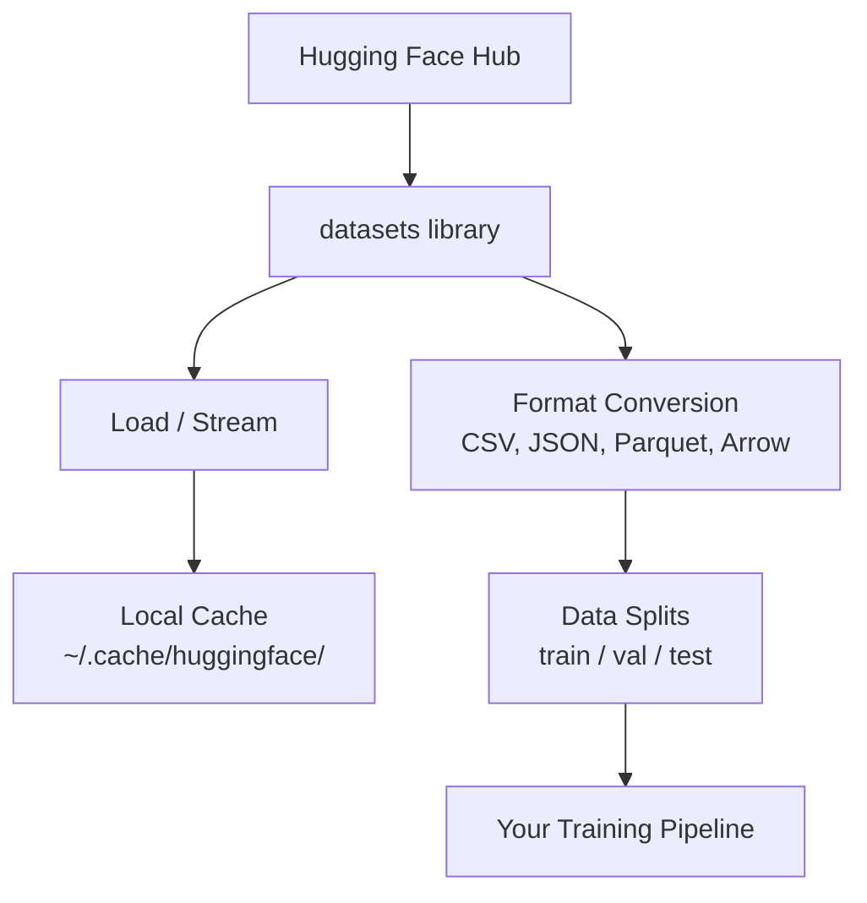

# مدیریت داده ها

> داده سوخت است. نحوه مدیریت آن تعیین می کند که چقدر سریع حرکت می کنید.

**Type:** Build
**Language:**پیتون
**Prerequisites:** Phase 0, Lesson 01
**Time:** ~45 minutes

## اهداف یادگیری

- بارگذاری، جریان و ذخیره سازی مجموعه داده ها با استفاده از صورت آغوش کردن `datasets`کتابخانه
- تبدیل بین قالب های CSV، JSON، Parquet و Arrow و توضیح دادن تعادلات آنها
- ایجاد قطعات قابل تکرار / اعتبار / آزمایش با دانه های تصادفی ثابت
- مدیریت فایل های مدل و مجموعه داده های بزرگ با استفاده از `.gitignore`, Git LFS یا DVC

## مشکل

هر پروژه هوش مصنوعی با داده ها شروع می شود. شما باید مجموعه داده ها را پیدا کنید، آنها را دانلود کنید، آنها را بین فرمت ها تبدیل کنید، آنها را برای آموزش و ارزیابی تقسیم کنید، و آنها را نسخه کنید تا آزمایشات قابل تکرار باشند. انجام این کار به صورت دستی هر بار کند و مستعد اشتباه است. شما نیاز به یک جریان کار تکراری دارید.

## مفهوم



چهره بازپوشنده`datasets`کتابخانه روش استاندارد بارگذاری داده ها برای کار هوش مصنوعی است. این دانلود، ذخیره سازی، تبدیل فرمت و پخش خارج از جعبه را اداره می کند.

```figure
s0-data-pipeline
```

## آن را بسازید

### مرحله اول: کتابخانه مجموعه داده ها را نصب کنید

```bash
pip install datasets huggingface_hub
```

### مرحله دوم: بارگذاری مجموعه داده ها

```python
from datasets import load_dataset

dataset = load_dataset("stanfordnlp/imdb")
print(dataset)
print(dataset["train"][0])
```

این مجموعه داده های بررسی فیلم IMDB را دانلود می کند. پس از اولین بار دانلود، از کیش به `~/.cache/huggingface/datasets/`. .

### مرحله 3: جریان مجموعه داده های بزرگ

بعضی از مجموعه داده ها برای قرار دادن روی دیسک خیلی بزرگ هستند. جریان آنها را ردیف به ردیف بار می کند بدون اینکه تمام چیز را دانلود کنید.

```python
dataset = load_dataset("wikimedia/wikipedia", "20231101.en", split="train", streaming=True)

for i, example in enumerate(dataset):
    print(example["title"])
    if i >= 4:
        break
```

پخش به شما یک`IterableDataset`. شما ردیف ها را در حال ورود پردازش می کنید. استفاده از حافظه بدون توجه به اندازه مجموعه داده ها ثابت می ماند.

### مرحله 4: فرمت های مجموعه داده ها

.`datasets`با استفاده از آپاچی تیر زیر کوپ، می توانید به فرمت های دیگر بسته به نیاز های خط لوله تبدیل شوید.

```python
dataset = load_dataset("stanfordnlp/imdb", split="train")

dataset.to_csv("imdb_train.csv")
dataset.to_json("imdb_train.json")
dataset.to_parquet("imdb_train.parquet")
```

مقایسه شکل:

| Format | Size | Read Speed | Best For |
|--------|------|-----------|----------|
| CSV | Large | Slow | Human readability, spreadsheets |
| JSON | Large | Slow | APIs, nested data |
| Parquet | Small | Fast | Analytics, columnar queries |
| Arrow | Small | Fastest | In-memory processing (what `datasets` uses internally) |

برای کار هوش مصنوعی، پارکت بهترین فرمت ذخیره سازی است. تیر چیزی است که شما با آن در حافظه کار می کنید. CSV و JSON برای تبادل هستند.

### مرحله 5: تقسیم داده ها

هر پروژه ML به سه بخش نیاز داره:

- **Train**: مدل از این نتیجه یاد می گیرد (معمولا 80%)
- **Validation**شما پیشرفت در طول آموزش را بررسی می کنید (معمولا 10٪)
- **Test**: ارزیابی نهایی پس از تکمیل آموزش (معمولا 10٪)

بعضی از مجموعه داده ها قبل از تقسیم میشن، وقتی که تقسیم نمیشن، خودتشون رو تقسیم کن:

```python
dataset = load_dataset("stanfordnlp/imdb", split="train")

split = dataset.train_test_split(test_size=0.2, seed=42)
train_val = split["train"].train_test_split(test_size=0.125, seed=42)

train_ds = train_val["train"]
val_ds = train_val["test"]
test_ds = split["test"]

print(f"Train: {len(train_ds)}, Val: {len(val_ds)}, Test: {len(test_ds)}")
```

هميشه براي بازپديد مي تواني بذري رو انتخاب کرد

### مرحله 6: مدل های دانلود و ذخیره سازی

مدل ها فایل های بزرگ هستند.`huggingface_hub`اداره های کتابخانه دانلود و ذخیره سازی

```python
from huggingface_hub import hf_hub_download, snapshot_download

model_path = hf_hub_download(
    repo_id="sentence-transformers/all-MiniLM-L6-v2",
    filename="config.json"
)
print(f"Cached at: {model_path}")

model_dir = snapshot_download("sentence-transformers/all-MiniLM-L6-v2")
print(f"Full model at: {model_dir}")
```

مدل ها به cache`~/.cache/huggingface/hub/`پس از دانلود، آن ها بلافاصله به اجراات بعدی حمل می شوند.

### مرحله 7: مدیریت فایل های بزرگ

وزن مدل ها و مجموعه داده های بزرگ نباید به git بروند. سه گزینه:

**Option A: .gitignore (simplest)**

```
*.bin
*.safetensors
*.pt
*.onnx
data/*.parquet
data/*.csv
models/
```

**Option B: Git LFS (track large files in git)**

```bash
git lfs install
git lfs track "*.bin"
git lfs track "*.safetensors"
git add .gitattributes
```

Git LFS اشاره ها را در repo و فایل های واقعی را در یک سرور جداگانه ذخیره می کند. GitHub به شما 1 جی بی رایگان می دهد.

**Option C: DVC (data version control)**

```bash
pip install dvc
dvc init
dvc add data/training_set.parquet
git add data/training_set.parquet.dvc data/.gitignore
git commit -m "Track training data with DVC"
```

DVC باعث ایجاد کوچک شدن`.dvc`فایل هایی که به داده های شما اشاره می کنند. خود داده ها در S3، GCS، یا پس زمینه ذخیره سازی از راه دور زندگی می کنند.

| Approach | Complexity | Best For |
|----------|-----------|----------|
| .gitignore | Low | Personal projects, downloaded data you can re-fetch |
| Git LFS | Medium | Teams sharing model weights via git |
| DVC | High | Reproducible experiments, large datasets, teams |

براي اين دوره،`.gitignore`وقتی نیاز به تکرار آزمایشات دقیق در ماشین ها دارید از DVC استفاده کنید.

### مرحله 8: الگوهای ذخیره سازی

**Local storage**برای مجموعه داده های زیر 10 جی بی کار می کند. HF cache این را به طور خودکار اداره می کند.

**Cloud storage**برای هر چیزی که بزرگتر یا در میان ماشین ها مشترک باشد:

```python
import os

local_path = os.path.expanduser("~/.cache/huggingface/datasets/")

# s3_path = "s3://my-bucket/datasets/"
# gcs_path = "gs://my-bucket/datasets/"
```

DVC مستقیماً با S3 و GCS ادغام می شود:

```bash
dvc remote add -d myremote s3://my-bucket/dvc-store
dvc push
```

برای این دوره، ذخیره سازی محلی کافی است. ذخیره سازی ابر زمانی که شما در نمونه های GPU از راه دور تنظیم کنید، مرتبط می شود.

## مجموعه داده هایی که در این دوره استفاده می شود

| Dataset | Lessons | Size | What It Teaches |
|---------|---------|------|----------------|
| IMDB | Tokenization, classification | 84 MB | Text classification basics |
| WikiText | Language modeling | 181 MB | Next-token prediction |
| SQuAD | QA systems | 35 MB | Question answering, spans |
| Common Crawl (subset) | Embeddings | Varies | Large-scale text processing |
| MNIST | Vision basics | 21 MB | Image classification fundamentals |
| COCO (subset) | Multimodal | Varies | Image-text pairs |

شما نیازی به دانلود این همه چیز ندارید. هر درس مشخص می کند که چه چیزی نیاز دارد.

## ازش استفاده کن

اسکریپت ابزار را اجرا کنید تا همه چیز کار کند:

```bash
python code/data_utils.py
```

این یک مجموعه داده کوچک را دانلود می کند، آن را تبدیل می کند، آن را تقسیم می کند و خلاصه ای را چاپ می کند.

## -باده

این درس نتیجه می دهد:
- `code/data_utils.py`- ابزار بارگذاری و ذخیره سازی داده های قابل استفاده مجدد
- `outputs/prompt-data-helper.md`- سریع برای پیدا کردن مجموعه داده های مناسب برای یک کار

## تمرینات

1. بارش رو بردار`glue`مجموعه داده ها با `mrpc`اولين 5 نمونه را مرتب و بازرسي كن
2. پخش کن`c4`مجموعه داده ها و شمارش کنید که چند نمونه را می توانید در 10 ثانیه پردازش کنید
3. تبدیل مجموعه داده ها به Parquet و مقایسه اندازه فایل به CSV
4. ایجاد یک تقسیم بندی قطار/ال/متجربه 70/15/15 با دانه ثابت و تأیید اندازه

## اصطلاحات کلیدی

| Term | What people say | What it actually means |
|------|----------------|----------------------|
| Dataset split | "Training data" | A named subset (train/val/test) used at different stages of the ML lifecycle |
| Streaming | "Load it lazily" | Processing data row by row from a remote source without downloading the full dataset |
| Parquet | "Compressed CSV" | A columnar file format optimized for analytical queries and storage efficiency |
| Arrow | "Fast dataframe" | An in-memory columnar format used internally by the datasets library for zero-copy reads |
| Git LFS | "Git for big files" | An extension that stores large files outside the git repo while keeping pointers in version control |
| DVC | "Git for data" | A version control system for datasets and models that integrates with cloud storage |
| Cache | "Already downloaded" | A local copy of previously fetched data, stored at ~/.cache/huggingface/ by default |
