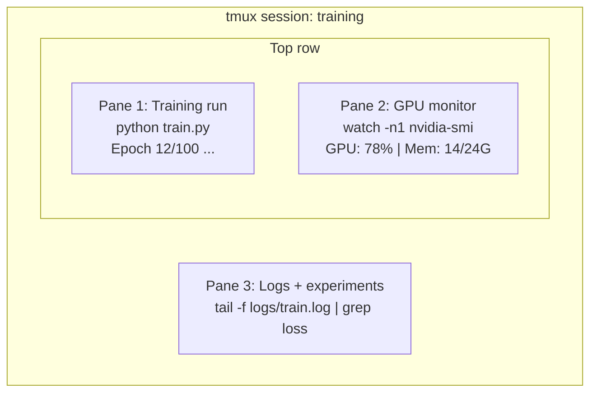

# ترمینال و شل

> ترمینال جاییه که مهندسان هوش مصنوعی زندگی می کنن.

**Type:** Learn
**Languages:** --
**Prerequisites:** Phase 0, Lesson 01
**Time:** ~35 minutes

## اهداف یادگیری

- از لوله ها استفاده کن، به سمت های دیگر برسان و`grep`برای فیلتر و پردازش روزنامه های آموزش از خط فرمان
- ایجاد جلسات tmux مداوم با چندین صفحه برای آموزش همزمان و نظارت GPU
- منابع سیستم و GPU را با `htop`،`nvtop`و`nvidia-smi`
- انتقال فایل ها بین دستگاه های محلی و دور از طریق SSH`scp`و`rsync`

## مشکل

شما زمان بیشتری را در ترمینال صرف می کنید تا در هر ویرایشگر. تمرینات، نظارت بر GPU، ردیابی روزنامه، جلسات SSH از راه دور، مدیریت محیط. هر جریان کاری هوش مصنوعی به پوسته می رسد. اگر شما در اینجا کند هستید، در همه جا کند هستید.

این درس مهارت های نهایی را که برای کار هوش مصنوعی مهم هستند پوشش می دهد هیچ سابقه ی یونیکس، هیچ عمیق در نوشتن اسکریپت باش، فقط چیزی که شما نیاز دارید.

## مفهوم



سه تا چيز در يك زمان اجرا ميشه يه ترمينال مي توني جدا بشي، به خونه بريم، SSH دوباره وارد بشه و دوباره وصل بشي.

```figure
s0-shell-pipeline
```

## آن را بسازید

### مرحله اول: پوسته خود را بشناسید

چک کن که چيه که داري اجرا ميکني:

```bash
echo $SHELL
```

بیشتر سیستم ها استفاده می کنند`bash`یا`zsh`هر دو کار خوب ميکنن فرمان هاي اين دوره هم کار ميکنن

نکته های مهم که باید بدانید:

```bash
# Move around
cd ~/projects/ai-engineering-from-scratch
pwd
ls -la

# History search (most useful shortcut you'll learn)
# Ctrl+R then type part of a previous command
# Press Ctrl+R again to cycle through matches

# Clear terminal
clear   # or Ctrl+L

# Cancel a running command
# Ctrl+C

# Suspend a running command (resume with fg)
# Ctrl+Z
```

### مرحله دوم: لوله کشی و هدایت مجدد

لوله ها دستورات را با هم متصل می کنند. این روش پردازش سوابق، تولید فیلتر و ابزارهای زنجیره ای است. شما این را به طور مداوم استفاده خواهید کرد.

```bash
# Count how many times "loss" appears in a log
cat train.log | grep "loss" | wc -l

# Extract just the loss values from training output
grep "loss:" train.log | awk '{print $NF}' > losses.txt

# Watch a log file update in real time, filtering for errors
tail -f train.log | grep --line-buffered "ERROR"

# Sort experiments by final accuracy
grep "final_accuracy" results/*.log | sort -t= -k2 -n -r

# Redirect stdout and stderr to separate files
python train.py > output.log 2> errors.log

# Redirect both to the same file
python train.py > train_full.log 2>&1
```

سه تا ریدایرکت که لازم داری:

| Symbol | What it does |
|--------|-------------|
| `>` | Write stdout to file (overwrite) |
| `>>` | Append stdout to file |
| `2>` | Write stderr to file |
| `2>&1` | Send stderr to same place as stdout |
| `\|` | Send stdout of one command as stdin to the next |

### مرحله سوم: فرآیندهای پس زمینه

تمرینات ساعت ها طول می کشد، نمیخوای تمام وقت ترمینال رو باز نگه داری

```bash
# Run in background (output still goes to terminal)
python train.py &

# Run in background, immune to hangup (closing terminal won't kill it)
nohup python train.py > train.log 2>&1 &

# Check what's running in background
jobs
ps aux | grep train.py

# Bring a background job to foreground
fg %1

# Kill a background process
kill %1
# or find its PID and kill that
kill $(pgrep -f "train.py")
```

تفاوت بین`&`،`nohup`و`screen`-بله .`tmux`:

| Method | Survives terminal close? | Can reattach? |
|--------|-------------------------|---------------|
| `command &` | No | No |
| `nohup command &` | Yes | No (check log file) |
| `screen` / `tmux` | Yes | Yes |

برای هر چیزی که بیشتر از چند دقیقه باشد، از tmux استفاده کنید.

### مرحله 4: tmux

tmux به شما امکان می دهد جلسات پایانی مداوم با چندین صفحه ایجاد کنید. این واحد مفید ترین ابزار برای مدیریت تمرینات است.

```bash
# Install
# macOS
brew install tmux
# Ubuntu
sudo apt install tmux

# Start a named session
tmux new -s training

# Split horizontally
# Ctrl+B then "

# Split vertically
# Ctrl+B then %

# Navigate between panes
# Ctrl+B then arrow keys

# Detach (session keeps running)
# Ctrl+B then d

# Reattach
tmux attach -t training

# List sessions
tmux ls

# Kill a session
tmux kill-session -t training
```

یک جلسه جریان کار معمولی هوش مصنوعی:

```bash
tmux new -s train

# Pane 1: start training
python train.py --epochs 100 --lr 1e-4

# Ctrl+B, " to split, then run GPU monitor
watch -n1 nvidia-smi

# Ctrl+B, % to split vertically, tail the logs
tail -f logs/experiment.log

# Now detach with Ctrl+B, d
# SSH out, go get coffee, come back
# tmux attach -t train
```

### مرحله 5: نظارت با htop و nvtop

```bash
# System processes (better than top)
htop

# GPU processes (if you have NVIDIA GPU)
# Install: sudo apt install nvtop (Ubuntu) or brew install nvtop (macOS)
nvtop

# Quick GPU check without nvtop
nvidia-smi

# Watch GPU usage update every second
watch -n1 nvidia-smi

# See which processes are using the GPU
nvidia-smi --query-compute-apps=pid,name,used_memory --format=csv
```

`htop`کليد هايي که ميخواي استفاده کني:
- `F6`یا`>`برای مرتب کردن به حسب ستون (در ترتیب به حسب حافظه برای پیدا کردن لاقت حافظه)
- `F5`برای تغییر نمای درخت (به بررسی فرآیند های کودک)
- `F9`برای کشتن یک فرآیند
- `/`برای جستجوی نام فرآیند

### مرحله 6: SSH برای جعبه های GPU از راه دور

وقتی یک GPU ابر (Lambda، RunPod، Vast.ai) را اجاره می کنید، از طریق SSH متصل می شوید.

```bash
# Basic connection
ssh user@gpu-box-ip

# With a specific key
ssh -i ~/.ssh/my_gpu_key user@gpu-box-ip

# Copy files to remote
scp model.pt user@gpu-box-ip:~/models/

# Copy files from remote
scp user@gpu-box-ip:~/results/metrics.json ./

# Sync a whole directory (faster for many files)
rsync -avz ./data/ user@gpu-box-ip:~/data/

# Port forward (access remote Jupyter/TensorBoard locally)
ssh -L 8888:localhost:8888 user@gpu-box-ip
# Now open localhost:8888 in your browser

# SSH config for convenience
# Add to ~/.ssh/config:
# Host gpu
#     HostName 192.168.1.100
#     User ubuntu
#     IdentityFile ~/.ssh/gpu_key
#
# Then just:
# ssh gpu
```

### مرحله 7: نام مستعار مفید برای کار هوش مصنوعی

اينو به دستتون اضافه کنيد`~/.bashrc`یا`~/.zshrc`:

```bash
source phases/00-setup-and-tooling/10-terminal-and-shell/code/shell_aliases.sh
```

یا اونها رو که میخوای کپی کنی

```bash
# GPU status at a glance
alias gpu='nvidia-smi --query-gpu=index,name,utilization.gpu,memory.used,memory.total,temperature.gpu --format=csv,noheader'

# Kill all Python training processes
alias killtraining='pkill -f "python.*train"'

# Quick virtual environment activate
alias ae='source .venv/bin/activate'

# Watch training loss
alias watchloss='tail -f logs/*.log | grep --line-buffered "loss"'
```

ببین`code/shell_aliases.sh`برای مجموعه کامل

### مرحله 8: الگوهای سرانه ی هوش مصنوعی

این ها بارها و بارها در عمل مطرح می شوند:

```bash
# Run training, log everything, notify when done
python train.py 2>&1 | tee train.log; echo "DONE" | mail -s "Training complete" you@email.com

# Compare two experiment logs side by side
diff <(grep "accuracy" exp1.log) <(grep "accuracy" exp2.log)

# Find the largest model files (clean up disk space)
find . -name "*.pt" -o -name "*.safetensors" | xargs du -h | sort -rh | head -20

# Download a model from Hugging Face
wget https://huggingface.co/model/resolve/main/model.safetensors

# Untar a dataset
tar xzf dataset.tar.gz -C ./data/

# Count lines in all Python files (see how big your project is)
find . -name "*.py" | xargs wc -l | tail -1

# Check disk space (training data fills disks fast)
df -h
du -sh ./data/*

# Environment variable check before training
env | grep -i cuda
env | grep -i torch
```

## ازش استفاده کن

در این دوره هر ابزار به بازی می آید:

| Tool | When you use it |
|------|----------------|
| tmux | Every training run (Phases 3+) |
| `tail -f` + `grep` | Monitoring training logs |
| `nohup` / `&` | Quick background tasks |
| `htop` / `nvtop` | Debugging slow training, OOM errors |
| SSH + `rsync` | Working on cloud GPUs |
| Piping + redirects | Processing experiment results |
| Aliases | Saving time on repetitive commands |

## تمرینات

1. نصب tmux، ایجاد یک جلسه با سه صفحه و اجرا کنید `htop`در یک،`watch -n1 date`در یکی دیگر، و یک اسکریپت پایتون در سوم. جدا و دوباره متصل.
2. اسم مستعار رو از  اضافه کن`code/shell_aliases.sh`به سمت قوس خود پیکربندی و بارگذاری مجدد با `source ~/.zshrc`(یا `~/.bashrc`)
3. يه دفترچه آموزش جعلی با `for i in $(seq 1 100); do echo "epoch $i loss: $(echo "scale=4; 1/$i" | bc)"; sleep 0.1; done > fake_train.log`و بعد از آن استفاده کنید`grep`،`tail`و`awk`فقط ارزش های تلفات را استخراج کنیم.
4. یک ورودی پیکربندی SSH را برای یک سرور که دسترسی دارید (یا استفاده می کنید) تنظیم کنید`localhost`برای تمرین ترکیب).

## اصطلاحات کلیدی

| Term | What people say | What it actually means |
|------|----------------|----------------------|
| Shell | "The terminal" | The program that interprets your commands (bash, zsh, fish) |
| tmux | "Terminal multiplexer" | A program that lets you run multiple terminal sessions inside one window, and detach/reattach |
| Pipe | "The bar thing" | The `\|` operator that sends one command's output as input to another |
| PID | "Process ID" | A unique number assigned to every running process, used to monitor or kill it |
| nohup | "No hangup" | Runs a command immune to the hangup signal, so closing the terminal won't kill it |
| SSH | "Connecting to the server" | Secure Shell, an encrypted protocol for running commands on a remote machine |
