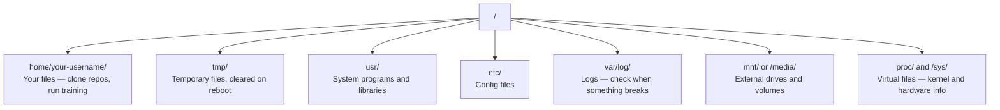

# لینوکس برای هوش مصنوعی

> بیشتر هوش مصنوعی روی لینوکس کار می کند. باید به اندازه کافی بدونی تا گیر نکنی.

**Type:** Learn
**Languages:** --
**Prerequisites:** Phase 0, Lesson 01
**Time:** ~30 minutes

## اهداف یادگیری

- در سیستم فایل لینوکس حرکت کنید و عملیات فایل ضروری را از خط فرمان انجام دهید
- مجوزهای فایل را با  مدیریت کنید`chmod`و`chown`برای حل خطاهای "حصول مجوز رد شده"
- بسته های سیستم را با  نصب کنید`apt`و یک جعبه جدید GPU برای کار هوش مصنوعی را تنظیم کنید
- شناسایی تفاوت های macOS به لینوکس که معمولاً توسعه دهندگان کار در ماشین های دور افتاده را به خطر می اندازد

## مشکل

شما در macOS یا Windows توسعه می دهید. اما در لحظه ای که شما به یک جعبه GPU ابر SSH، یک نمونه Lambda اجاره کنید، یا یک ماشین EC2 را به کار ببرید، شما در Ubuntu فرود می روید. ترمینال تنها رابط شماه هيچ فيندر، هيچ اکسپلورر، هيچ گيوي وجود نداره اگر نمی توانید سیستم فایل ها را مرور کنید، بسته ها را نصب کنید و فرآیندهای را از خط فرمان مدیریت کنید، شما در حال پرداخت ساعت های بیکار GPU هستید در حالی که در گوگل "چگونه یک فایل را در لینوکس غیر زپ کنید".

این راهنمای بقای است. دقیقاً آنچه که برای کار کردن روی یک ماشین لینوکس از راه دور برای کار هوش مصنوعی نیاز دارید را پوشش می دهد. چیزی بیشتر.

## طرح سیستم فایل

لینوکس همه چیز رو تحت یک ریشه سازماندهی می کنه`/`. وجود نداره`C:\`یا`/Volumes`. فهرست هایی که واقعاً لمس می کنی:



دفترچه خونه ات اينه`~`یا`/home/your-username`تقریباً هر کاري که ميکني اينجا اتفاق ميفته

## احکام ضروری

این 15 دستور است که 95 درصد از کاری که در یک جعبه GPU از راه دور انجام می دهید را پوشش می دهد.

### حرکت کردن

```bash
pwd                         # Where am I?
ls                          # What's here?
ls -la                      # What's here, including hidden files with details?
cd /path/to/dir             # Go there
cd ~                        # Go home
cd ..                       # Go up one level
```

### فایل ها و دایرکتوری ها

```bash
mkdir my-project            # Create a directory
mkdir -p a/b/c              # Create nested directories in one shot

cp file.txt backup.txt      # Copy a file
cp -r src/ src-backup/      # Copy a directory (recursive)

mv old.txt new.txt          # Rename a file
mv file.txt /tmp/           # Move a file

rm file.txt                 # Delete a file (no trash, it's gone)
rm -rf my-dir/              # Delete a directory and everything inside
```

`rm -rf`. نه هیچ باز کردن وجود نداره . قبل از ضربه زدن به داخل دو بار مسیر رو چک کن

### فایل های خواندن

```bash
cat file.txt                # Print entire file
head -20 file.txt           # First 20 lines
tail -20 file.txt           # Last 20 lines
tail -f log.txt             # Follow a log file in real time (Ctrl+C to stop)
less file.txt               # Scroll through a file (q to quit)
```

### جستجو

```bash
grep "error" training.log           # Find lines containing "error"
grep -r "learning_rate" .           # Search all files in current directory
grep -i "cuda" config.yaml          # Case-insensitive search

find . -name "*.py"                 # Find all Python files under current dir
find . -name "*.ckpt" -size +1G     # Find checkpoint files larger than 1GB
```

## مجوز

هر فایل در لینوکس دارای مالک و اجازه بیت است. شما در این صورت با اسکریپت اجرا نمی شود یا شما نمی توانید به یک دایرکتوری بنویسید.

```bash
ls -l train.py
# -rwxr-xr-- 1 user group 2048 Mar 19 10:00 train.py
#  ^^^             owner permissions: read, write, execute
#     ^^^          group permissions: read, execute
#        ^^        everyone else: read only
```

اصلاحات معمول:

```bash
chmod +x train.sh           # Make a script executable
chmod 755 deploy.sh         # Owner: full, others: read+execute
chmod 644 config.yaml       # Owner: read+write, others: read only

chown user:group file.txt   # Change who owns a file (needs sudo)
```

وقتی چیزی میگه "حتی اجازه رد شده" ، تقریبا همیشه یک مسئله مجوزه`chmod +x`یا`sudo`بیشتر پرونده ها رو حل ميکنه

## مدیریت بسته (اپت)

استفاده از Ubuntu`apt`اینجوری نرم افزار سطح سیستم رو نصب میکنی

```bash
sudo apt update             # Refresh the package list (always do this first)
sudo apt install -y htop    # Install a package (-y skips confirmation)
sudo apt install -y build-essential  # C compiler, make, etc. Needed by many Python packages
sudo apt install -y tmux    # Terminal multiplexer (keep sessions alive after disconnect)

apt list --installed        # What's installed?
sudo apt remove htop        # Uninstall
```

بسته های مشترک که روی یک جعبه جدید GPU نصب می کنید:

```bash
sudo apt update && sudo apt install -y \
    build-essential \
    git \
    curl \
    wget \
    tmux \
    htop \
    unzip \
    python3-venv
```

## کاربران و sudo

شما معمولا به عنوان یک کاربر عادی وارد می شوید. برخی از عملیات ها نیاز به دسترسی ریشه (admin) دارند.

```bash
whoami                      # What user am I?
sudo command                # Run a single command as root
sudo su                     # Become root (exit to go back, use sparingly)
```

در نمونه های GPU ابر، شما معمولا تنها کاربر هستید و قبلاً دسترسی به sudo دارید. همه چیز را به عنوان root اجرا نکنید. فقط در زمان نیاز از sudo استفاده کنید.

## فرآیندها و سیستم ها

وقتی تمریناتتون متوقف میشه یا باید چک کنید چه چیزی داره انجام میشه

```bash
htop                        # Interactive process viewer (q to quit)
ps aux | grep python        # Find running Python processes
kill 12345                  # Gracefully stop process with PID 12345
kill -9 12345               # Force kill (use when graceful doesn't work)
nvidia-smi                  # GPU processes and memory usage
```

سیستمد سرویس ها را مدیریت می کند (دائمون های پس زمینه). شما از آن استفاده می کنید اگر سرورهای نتیجه گیری را اجرا کنید:

```bash
sudo systemctl start nginx          # Start a service
sudo systemctl stop nginx           # Stop it
sudo systemctl restart nginx        # Restart it
sudo systemctl status nginx         # Check if it's running
sudo systemctl enable nginx         # Start automatically on boot
```

## فضای دیسک

جعبه های GPU اغلب فضای دیسک محدود دارند. مدل ها و مجموعه داده ها آن را سریع پر می کنند.

```bash
df -h                       # Disk usage for all mounted drives
df -h /home                 # Disk usage for /home specifically

du -sh *                    # Size of each item in current directory
du -sh ~/.cache             # Size of your cache (pip, huggingface models land here)
du -sh /data/checkpoints/   # Check how big your checkpoints are

# Find the biggest space hogs
du -h --max-depth=1 / 2>/dev/null | sort -hr | head -20
```

دستگاه های ذخیره فضا:

```bash
# Clear pip cache
pip cache purge

# Clear apt cache
sudo apt clean

# Remove old checkpoints you don't need
rm -rf checkpoints/epoch_01/ checkpoints/epoch_02/
```

## شبکه سازی

شما مدل ها را دانلود می کنید، فایل ها را انتقال می دهید و از خط فرمان API ها را می گیرید.

```bash
# Download files
wget https://example.com/model.bin                   # Download a file
curl -O https://example.com/data.tar.gz              # Same thing with curl
curl -s https://api.example.com/health | python3 -m json.tool  # Hit an API, pretty-print JSON

# Transfer files between machines
scp model.bin user@remote:/data/                     # Copy file to remote machine
scp user@remote:/data/results.csv .                  # Copy file from remote to local
scp -r user@remote:/data/checkpoints/ ./local-dir/   # Copy directory

# Sync directories (faster than scp for large transfers, resumes on failure)
rsync -avz --progress ./data/ user@remote:/data/
rsync -avz --progress user@remote:/results/ ./results/
```

استفاده کنید`rsync`تموم شد`scp`فقط بايت هاي عوض شده رو منتقل ميکنه و ارتباطات قطع شده رو اداره ميکنه

## "مستقبل ها زنده بمانند"

وقتی به یک جعبه دور دراز میرسی، بسته شدن لپ تاپت، تمریناتت رو می کشد.

```bash
tmux new -s train           # Start a new session named "train"
# ... start your training, then:
# Ctrl+B, then D            # Detach (training keeps running)

tmux ls                     # List sessions
tmux attach -t train        # Reattach to session

# Inside tmux:
# Ctrl+B, then %            # Split pane vertically
# Ctrl+B, then "            # Split pane horizontally
# Ctrl+B, then arrow keys   # Switch between panes
```

هميشه کار هاي آموزشي طولانی رو توي توکس انجام ميدم

## WSL2 برای کاربران ویندوز

اگر روی ویندوز هستید، WSL2 به شما یک محیط لینوکس واقعی بدون دوگانه boot می دهد.

```bash
# In PowerShell (admin)
wsl --install -d Ubuntu-24.04

# After restart, open Ubuntu from Start menu
sudo apt update && sudo apt upgrade -y
```

WSL2 یک هسته لینوکس واقعی را اجرا می کند. همه چیز در این درس در داخل آن کار می کند. فایل های ویندوز شما در`/mnt/c/Users/YourName/`از داخل WSL

GPU passthrough با راننده های NVIDIA نصب شده در طرف ویندوز کار می کند. راننده NVIDIA ویندوز (نه لینوکس) را نصب کنید و CUDA در داخل WSL2 موجود خواهد بود.

## Gotchas: macOS به لینوکس

چیزهایی که اگر از macOS میای، شما را به عقب می اندازد:

| macOS | Linux | Notes |
|-------|-------|-------|
| `brew install` | `sudo apt install` | Different package names sometimes. `brew install htop` vs `sudo apt install htop` works the same, but `brew install readline` vs `sudo apt install libreadline-dev` does not. |
| `open file.txt` | `xdg-open file.txt` | But you won't have a GUI on a remote box. Use `cat` or `less`. |
| `pbcopy` / `pbpaste` | Not available | Pipe to/from clipboard doesn't exist over SSH. |
| `~/.zshrc` | `~/.bashrc` | macOS defaults to zsh. Most Linux servers use bash. |
| `/opt/homebrew/` | `/usr/bin/`, `/usr/local/bin/` | Binaries live in different places. |
| `sed -i '' 's/a/b/' file` | `sed -i 's/a/b/' file` | macOS sed needs an empty string after `-i`. Linux does not. |
| Case-insensitive filesystem | Case-sensitive filesystem | `Model.py` and `model.py` are two different files on Linux. |
| Line endings `\n` | Line endings `\n` | Same. But Windows uses `\r\n`, which breaks bash scripts. Run `dos2unix` to fix. |

## کارت مرجع سریع

```
Navigation:     pwd, ls, cd, find
Files:          cp, mv, rm, mkdir, cat, head, tail, less
Search:         grep, find
Permissions:    chmod, chown, sudo
Packages:       apt update, apt install
Processes:      htop, ps, kill, nvidia-smi
Services:       systemctl start/stop/restart/status
Disk:           df -h, du -sh
Network:        curl, wget, scp, rsync
Sessions:       tmux new/attach/detach
```

```figure
s0-process-fork
```

## تمرینات

1. SSH را به هر دستگاه لینوکس (یا WSL2 باز) وارد کنید و به دایرکتوری اصلی خود حرکت کنید. یک پوشه پروژه ایجاد کنید، سه فایل خالی را در داخل آن با `touch`، پس آنها را با `ls -la`. .
2. نصب کنید`htop`با apt، آن را اجرا کنید و مشخص کنید که کدام فرآیند بیشترین حافظه را استفاده می کند.
3. شروع جلسه تماشايي، اجرا`sleep 300`داخلش، جدا بشين، جلسات را فهرست کنين و دوباره متصل بشين.
4. استفاده کنید`df -h`برای بررسی فضای دیسک موجود، سپس از `du -sh ~/.cache/*`تا بفهميم چه چيزي در جاى پنهان شما قرار داره
5. فایل را از دستگاه محلی تان به دستگاه دور افتاده منتقل کنید با استفاده از `scp`، پس همون انتقال رو با`rsync`و تجربه را مقایسه کنید.
