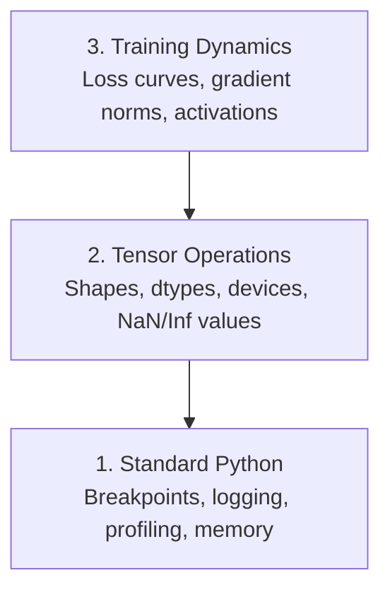

# رفع اشکال و پروفایل

> بدترین حشرات هوش مصنوعی سقوط نمی کنند، به طور خاموش روی زباله تمرین می کنند و منحنی زیان های زیبایی را گزارش می دهند.

**Type:** Build
**Language:**پیتون
**Prerequisites:** Lesson 1 (Dev Environment), basic PyTorch familiarity
**Time:** ~60 minutes

## اهداف یادگیری

- شرط بندی رو استفاده کن`breakpoint()`و`debug_print`برای بررسی شکل های تنسور، انواع و ارزش های NaN در وسط آموزش
- پروفایل تمرینات با `cProfile`،`line_profiler`و`tracemalloc`برای پیدا کردن گوشه های زباله
- تشخیص اشکال رایج هوش مصنوعی: عدم مطابقت شکل، از دست دادن NaN، نشت داده ها و تنسورهای دستگاه اشتباه
- TensorBoard را برای مشاهده منحنیات ضایع، هیستogram وزن و توزیع گرادینت تنظیم کنید

## مشکل

کد هوش مصنوعی با شکستگی متفاوت از کد معمولی است. یک برنامه وب با یک ردیابی ستک خراب می شود. یک حلقه آموزشی اشتباه برای 8 ساعت اجرا می شود، 200 دلار در زمان GPU می سوزاند و یک مدل تولید می کند که متوسط هر ورودی را پیش بینی می کند. کد هرگز اشتباه نمی کند. خطا یک تنسور در دستگاه اشتباه بود، یک فراموش شده`.detach()`، یا برچسب هایی که به ویژگی ها نفوذ می کنند

شما نیاز به ابزار های دیبگینگ دارید که این شکست های خاموش را قبل از اینکه زمان و محاسبه شما را تلف کنند، تشخیص دهند.

## مفهوم

تخفیف هوش مصنوعی در سه سطح عمل می کند:



اکثر مردم به طور مستقیم به سطح 3 (با نگاه کردن به TensorBoard) میپرند. اما 80 درصد از اشکال هوش مصنوعی در سطح 1 و 2 زندگی می کنند.

```figure
s0-flame-hot
```

## آن را بسازید

### بخش اول: اصلاح خطای چاپ (بله، کار می کند)

برای کد تنسور، یک بیانیه چاپ هدفمند از عبور از یک دیبگر بهتر است زیرا شما باید شکل ها، انواع و محدوده های ارزش را به یکباره ببینید.

```python
def debug_print(name, tensor):
    print(f"{name}: shape={tensor.shape}, dtype={tensor.dtype}, "
          f"device={tensor.device}, "
          f"min={tensor.min().item():.4f}, max={tensor.max().item():.4f}, "
          f"mean={tensor.mean().item():.4f}, "
          f"has_nan={tensor.isnan().any().item()}")
```

بعد از هر عمليات مشکوک اينو زنگ بزن وقتي که بگ پيدا بشه، اثر انگشت ها رو حذف کن

### بخش دوم: Debugger پایتون (pdb و breakpoint)

.دوبگر ساخته شده برای کار هوش مصنوعی زیر ارزیابی شده`breakpoint()`به حلقه آموزشتون وارد شويد و تنسورها رو به صورت تعاملي بازرسي کنيد

```python
def training_step(model, batch, criterion, optimizer):
    inputs, labels = batch
    outputs = model(inputs)
    loss = criterion(outputs, labels)

    if loss.item() > 100 or torch.isnan(loss):
        breakpoint()

    loss.backward()
    optimizer.step()
```

وقتي که ديبگگر شما رو به اينجا ميذاره، دستورات مفيد:

- `p outputs.shape`برای بررسی شکل ها
- `p loss.item()`برای دیدن ارزش خسارت
- `p torch.isnan(outputs).sum()`برای شمارش NN
- `p model.fc1.weight.grad`برای بررسی گرادین ها
- `c`ادامه دادن`q`ترک کردن

اين يه تحريف مشروطه، فقط وقتي که چيزي اشتباه به نظر مياد متوقف ميشه براي يک دوره آموزش 10 هزار قدم مهمه

### بخش سوم: ثبت نام پایتون

هنگام بررسی سریع، بیانات چاپ را با ثبت نام جایگزین کنید.

```python
import logging

logging.basicConfig(
    level=logging.INFO,
    format="%(asctime)s [%(levelname)s] %(message)s",
    handlers=[
        logging.FileHandler("training.log"),
        logging.StreamHandler()
    ]
)
logger = logging.getLogger(__name__)

logger.info("Starting training: lr=%.4f, batch_size=%d", lr, batch_size)
logger.warning("Loss spike detected: %.4f at step %d", loss.item(), step)
logger.error("NaN loss at step %d, stopping", step)
```

ثبت زمان، سطح شدت و تولید فایل را به شما می دهد. وقتی یک تمرین در ساعت 3 صبح شکست می خورد، شما یک فایل ثبت نام را می خواهید، نه یک محصول ترمینال که از صفحه خارج شده است.

### بخش چهارم: بخش های کد زمان

دانستن زمان کجا می رود اولین قدم برای بهینه سازی است.

```python
import time

class Timer:
    def __init__(self, name=""):
        self.name = name

    def __enter__(self):
        self.start = time.perf_counter()
        return self

    def __exit__(self, *args):
        elapsed = time.perf_counter() - self.start
        print(f"[{self.name}] {elapsed:.4f}s")

with Timer("data loading"):
    batch = next(dataloader_iter)

with Timer("forward pass"):
    outputs = model(batch)

with Timer("backward pass"):
    loss.backward()
```

یافته های رایج: بارگذاری داده ها 60 درصد زمان آموزش را می گیرد.`num_workers > 0`در DataLoader شما، نه GPU سریعتر.

### بخش 5: cProfile و line_profiiler

وقتی به تایمر های دستی نیاز دارید:

```bash
python -m cProfile -s cumtime train.py
```

این نشان می دهد هر تماس تابع مرتب شده توسط زمان تجمعی. برای پروفایل خط به خط:

```bash
pip install line_profiler
```

```python
@profile
def train_step(model, data, target):
    output = model(data)
    loss = F.cross_entropy(output, target)
    loss.backward()
    return loss

# Run with: kernprof -l -v train.py
```

### بخش ۶: پروفایل حافظه

#### حافظه CPU با tracemalloc

```python
import tracemalloc

tracemalloc.start()

# your code here
model = build_model()
data = load_dataset()

snapshot = tracemalloc.take_snapshot()
top_stats = snapshot.statistics("lineno")
for stat in top_stats[:10]:
    print(stat)
```

#### حافظه CPU با memory_profiiler

```bash
pip install memory_profiler
```

```python
from memory_profiler import profile

@profile
def load_data():
    raw = read_csv("data.csv")       # watch memory jump here
    processed = preprocess(raw)       # and here
    return processed
```

با هم فرار کن`python -m memory_profiler your_script.py`برای دیدن استفاده از حافظه خط به خط.

#### حافظه GPU با PyTorch

```python
import torch

if torch.cuda.is_available():
    print(torch.cuda.memory_summary())

    print(f"Allocated: {torch.cuda.memory_allocated() / 1e9:.2f} GB")
    print(f"Cached: {torch.cuda.memory_reserved() / 1e9:.2f} GB")
```

وقتی OOM (Out of Memory) را بزنید:

1. اندازه دسته را کاهش دهید (اولین کاری که باید انجام دهید، همیشه)
2. استفاده کنید`torch.cuda.empty_cache()`برای آزاد کردن حافظه ذخیره شده
3. استفاده کنید`del tensor`بعدش`torch.cuda.empty_cache()`برای محصولات واسطه بزرگ
4. دقت مخلوط (`torch.cuda.amp`) برای کاهش استفاده از حافظه به نصف
5. استفاده از کنترل گرادینت برای مدل های بسیار عمیق

### بخش هفتم: حشرات رایج هوش مصنوعی و چگونگی گرفتن آنها

#### شکل نامتناسب

.شترين خطاي اينه که يه تنسور شکل داره`[batch, features]`وقتی مدل انتظار داره`[batch, channels, height, width]`. .

```python
def check_shapes(model, sample_input):
    print(f"Input: {sample_input.shape}")
    hooks = []

    def make_hook(name):
        def hook(module, inp, out):
            in_shape = inp[0].shape if isinstance(inp, tuple) else inp.shape
            out_shape = out.shape if hasattr(out, "shape") else type(out)
            print(f"  {name}: {in_shape} -> {out_shape}")
        return hook

    for name, module in model.named_modules():
        hooks.append(module.register_forward_hook(make_hook(name)))

    with torch.no_grad():
        model(sample_input)

    for h in hooks:
        h.remove()
```

اين رو يه بار با نمونه ي نمونه انجام بده. اين هر تحول شکلي در مدل شما رو نقشه مي زند.

#### خسارت

از دست دادن NaN به معنی انفجار چیزی است.

- نرخ یادگیری خیلی بالا
- تقسیم با صفر در خسارت های گمرک
- ثبت صفر یا عدد منفی
- گرادینت های انفجار در RNNs

```python
def detect_nan(model, loss, step):
    if torch.isnan(loss):
        print(f"NaN loss at step {step}")
        for name, param in model.named_parameters():
            if param.grad is not None:
                if torch.isnan(param.grad).any():
                    print(f"  NaN gradient in {name}")
                if torch.isinf(param.grad).any():
                    print(f"  Inf gradient in {name}")
        return True
    return False
```

#### دزدیدن اطلاعات

مدل شما در سيستم آزمايش 99 درصد دقت داره.

```python
def check_data_leakage(train_set, test_set, id_column="id"):
    train_ids = set(train_set[id_column].tolist())
    test_ids = set(test_set[id_column].tolist())
    overlap = train_ids & test_ids
    if overlap:
        print(f"DATA LEAKAGE: {len(overlap)} samples in both train and test")
        return True
    return False
```

همچنین چک کنید که آیا برای لیک زمان: با استفاده از داده های آینده برای پیش بینی گذشته.

#### دستگاه اشتباه

تنسورهای دستگاه های مختلف (CPU vs GPU) باعث خطا زمان اجرا می شوند. اما گاهی اوقات یک تنسور به طور خاموش در CPU باقی می ماند در حالی که همه چیز دیگر در GPU است، و آموزش فقط به آرامی اجرا می شود.

```python
def check_devices(model, *tensors):
    model_device = next(model.parameters()).device
    print(f"Model device: {model_device}")
    for i, t in enumerate(tensors):
        if t.device != model_device:
            print(f"  WARNING: tensor {i} on {t.device}, model on {model_device}")
```

### بخش 8: اصول صفحه تنسور

TensorBoard به شما نشان می دهد که چه اتفاقی در داخل تمرین در طول زمان می افتد.

```bash
pip install tensorboard
```

```python
from torch.utils.tensorboard import SummaryWriter

writer = SummaryWriter("runs/experiment_1")

for step in range(num_steps):
    loss = train_step(model, batch)

    writer.add_scalar("loss/train", loss.item(), step)
    writer.add_scalar("lr", optimizer.param_groups[0]["lr"], step)

    if step % 100 == 0:
        for name, param in model.named_parameters():
            writer.add_histogram(f"weights/{name}", param, step)
            if param.grad is not None:
                writer.add_histogram(f"grads/{name}", param.grad, step)

writer.close()
```

راه اندازیش کن

```bash
tensorboard --logdir=runs
```

چه چیزی را باید دنبال کنیم؟

- **Loss not decreasing**: نرخ یادگیری بیش از حد پایین یا مشکل معماری مدل
- **Loss oscillating wildly**: میزان یادگیری بیش از حد بالا
- **Loss goes to NaN**: عدم ثبات عددی (به بخش NaN بالا نگاه کنید)
- **Train loss decreasing, val loss increasing**: اضافه کردن
- **Weight histograms collapsing to zero**: گرادین های ناپدید می شوند
- **Gradient histograms exploding**: نیاز به برش گرادینت

### بخش 9: کد بازساز VS

برای بازیافت تعاملی، کد VS را با `launch.json`:

```json
{
    "version": "0.2.0",
    "configurations": [
        {
            "name": "Debug Training",
            "type": "debugpy",
            "request": "launch",
            "program": "${file}",
            "console": "integratedTerminal",
            "justMyCode": false
        }
    ]
}
```

با کلیک کردن روی گاتر نقاط شکافی تنظیم کنید. از صفحه متغیرها برای بررسی خواص تنسور استفاده کنید. کنسول Debug به شما اجازه می دهد تا تعبیر های تعسفی پایتون را در وسط اجرا اجرا کنید.

برای عبور از خطوط پیش پردازش داده ها که می خواهید هر تحول را ببینید مفید است.

## ازش استفاده کن

اینجا جریان کار دیبگینگ است که بیشتر اشکال هوش مصنوعی را می گیرد:

1. **Before training**: ران`check_shapes`با نمونه نمونه ای. اندازه های ورودی و خروجی مطابق با انتظارات را بررسی کنید.
2. **First 10 steps**استفاده:`debug_print`ثابت کن که هيچ چيز NaN نيست و ارزش ها در محدوده معقولي هستن
3. **During training**: از دست دادن روزنامه، سرعت یادگیری و نورم های گرادینت. برای تصویربرداری از TensorBoard استفاده کنید.
4. **When something breaks**: بذار`breakpoint()`در نقطه شکست، تنسورها را با تعامل بررسی کنید.
5. **For performance**زمان بارگذاری داده ها در مقابل پیش و پس از مرور. حافظه پروفایل اگر در نزدیکی OOM هستید.

## -باده

اسکریپت ابزارک های دیبگینگ را اجرا کنید:

```bash
python phases/00-setup-and-tooling/12-debugging-and-profiling/code/debug_tools.py
```

ببین`outputs/prompt-debug-ai-code.md`برای یک پیام که به تشخیص اشکال خاص هوش مصنوعی کمک می کند.

## تمرینات

1. فرار کن`debug_tools.py`و از طریق هر بخش از محصول را بخوانید. مدل خرده ای را تغییر دهید تا یک NaN (توصیه: تقسیم با صفر در گذر جلو) را وارد کنید و تماشا کنید که آشکارساز آن را بگیرد.
2. پروفایل یک حلقه آموزش را با `cProfile`و آهسته ترین تابع را شناسایی کنید.
3. استفاده کنید`tracemalloc`برای پیدا کردن خطی که در خط لوله بارگذاری داده ها بیشترین حافظه را اختصاص می دهد.
4. TensorBoard را برای یک تمرین ساده تنظیم کنید و مشخص کنید که آیا مدل بیش از حد مناسب است.
5. استفاده کنید`breakpoint()`تمرین بررسی شکل های تنسور، دستگاه ها و ارزش های گرادینت از پرسشنامه دیبگگر
