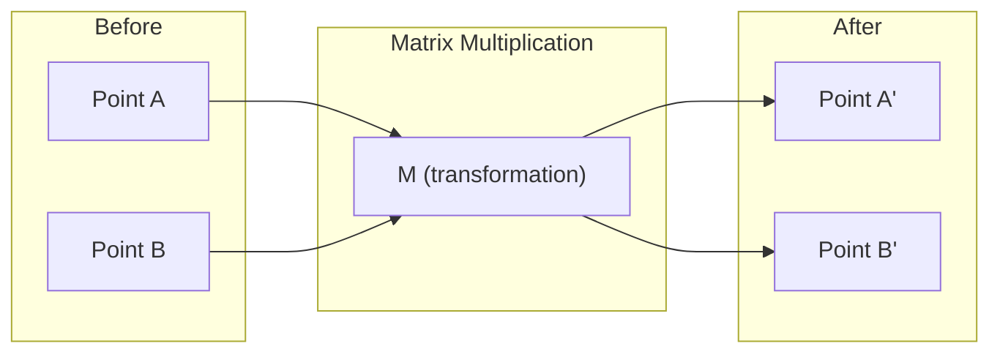
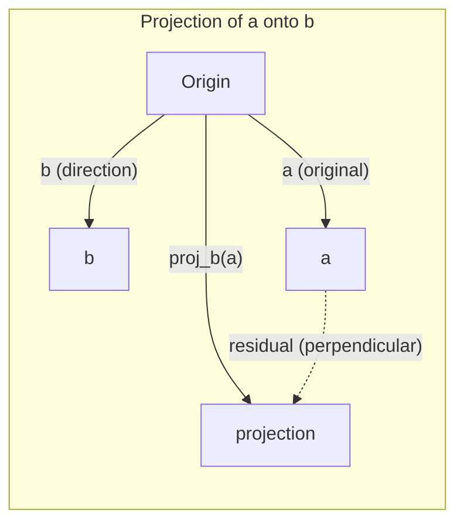

# انتیوژن الجبر خطی

> هر مدل هوش مصنوعی فقط ریاضیات ماتریکس است که یک کلاه فانتزی می پوشد.

**Type:** Learn
**Languages:** Python, Julia
**Prerequisites:** Phase 0
**Time:** ~60 minutes

## اهداف یادگیری

- پیاده سازی عملیات متری و ماتریکس (اضافه، محصول نقطه، ضرب ماتریکس) از ابتدا در پایتون
- به صورت هندسی توضیح دهید که محصول نقطه، پروژکتور و فرآیند گرام-شمیدت چه کار می کنند
- تعیین استقلال خطی، رتبه و پایه مجموعه ای از متری ها با استفاده از کاهش ردیف
- مفاهیم الجبر خطی را به برنامه های کاربردی هوش مصنوعی خود متصل کنید: گنجانده شدن، نمرات توجه و LoRA

## مشکل

هر مقاله ی ML را باز کنید. در صفحه اول، متریسه ها، محصولات نقطه ای و تحولات را خواهید دید. بدون هوش الجبر خطی، اینها فقط نمادها هستند. با آن می توانید ببینید که یک شبکه عصبی واقعا چه می کند - حرکت نقاط در فضا.

شما نیازی به ریاضی دان نیستید، شما باید ببینید که این عملیات ها از لحاظ هندسی چه معنایی دارند، سپس خود آنها را کدگذاری کنید.

## مفهوم

### متری ها نقاط (و جهت) هستند

یک متری فقط یک لیست از اعداد است. اما این اعداد معنی دارند -- هماهنگی در فضا هستند.

**2D vector [3, 2]:**

| x | y | Point |
|---|---|-------|
| 3 | 2 | The vector points from origin (0,0) to (3, 2) on the plane |

متری دارای بزرگی مربع است ((3^2 + 2^2) = مربع است ((13) و به سمت بالا و راست اشاره دارد.

در هوش مصنوعی، متری ها همه چیز را نشان می دهند:
- یک کلمه → یک ویکتور 768 عدد (معنای آن در فضای گنجانده)
- یک تصویر → یک ویکتور میلیون ها پیکسل
- یک کاربر → یک ویکتور ترجیحات

### ماتریس ها تغییراتی هستند

یک ماتریکس یک متری را به متری دیگر تبدیل می کند. می تواند چرخش، مقیاس، کشش یا پروژه کند.



در هوش مصنوعی، ماتریس ها مدل هستند:
- وزن شبکه عصبی → ماتریس هایی که ورودی را به خروجی تبدیل می کنند
- نمره توجه → ماتریس هایی که تصمیم می گیرند روی چه چیزی تمرکز کنند
- گنجانده شدن → ماتریس هایی که کلمات را به ویکتورها نقشه برداری می کنند

### شباهت اندازه گیری محصولات نقطه

ضرب نقطه دو متری به شما می گوید که چقدر شبیه هستند.

```
a · b = a₁×b₁ + a₂×b₂ + ... + aₙ×bₙ

Same direction:      a · b > 0  (similar)
Perpendicular:       a · b = 0  (unrelated)
Opposite direction:  a · b < 0  (dissimilar)
```

این دقیقاً نحوه کار موتورهای جستجو، سیستم های توصیه و RAG است -- پیدا کردن ویکتورهای با محصولات نقطه بالا.

### استقلال خطی

ویکتورها به صورت خطی مستقل هستند اگر هیچ ویکتور در مجموعه ای نمی تواند به عنوان ترکیبی از دیگران نوشته شود. اگر v1، v2، v3 مستقل باشند، آنها یک فضای 3D را پوشش می دهند. اگر یکی از آنها ترکیبی از دیگران باشد، آنها فقط یک خط را پوشش می دهند.

چرا برای هوش مصنوعی مهم است: ماتریس ویژگی های شما باید ستون های مستقل خطی داشته باشد. اگر دو ویژگی کاملاً مرتبط باشند (توقف خطی) ، مدل نمی تواند اثرات آنها را تشخیص دهد. این باعث می شود که متریکس وزن نامستقیم شود و تغییرات کوچک ورودی باعث نوسانات خروجی وحشی شود.

**Concrete example:**

```
v1 = [1, 0, 0]
v2 = [0, 1, 0]
v3 = [2, 1, 0]   # v3 = 2*v1 + v2
```

v1 و v2 مستقل هستند - نه یک ضرب مقیاس یا ترکیبی از دیگری است. اما v3 = 2*v1 + v2 است، بنابراین {v1, v2, v3} یک مجموعه وابسته است. این سه متری همه در سطح xy قرار دارند. مهم نیست که چگونه آنها را ترکیب کنید، شما نمی توانید به [0, 0, 1] برسید. شما سه متری دارید اما فقط دو ابعاد آزادی دارید.

در مجموعه داده ها: اگر feature_3 = 2*feature_1 + feature_2، اضافه کردن feature_3 به مدل اطلاعات جدیدی را صفر می دهد. بدتر از این، معادلات معمولی را تک تک می کند - هیچ راه حل منحصر به فرد برای وزنه ها وجود ندارد.

### پایه و رتبه

یک پایه مجموعه ای از متریکهای مستقل خطی است که کل فضا را پوشش می دهند. تعداد متریکهای پایه ابعاد فضا است.

پایه استاندارد برای فضای 3D {1,0,0], [0,1,0], [0,0,1] است. اما هر سه متری مستقل در 3D یک پایه معتبر را تشکیل می دهند. انتخاب پایه انتخاب سیستم هماهنگی است.

رتبه یک ماتریس = تعداد ستون های مستقل خطی = تعداد ردیف های مستقل خطی. اگر رتبه < min( ردیف ها، cols) ، ماتریس دارای رتبه کم است. این بدان معنی است:
- سیستم دارای بی نهایت بسیاری از راه حل ها (یا هیچ) است
- اطلاعات در تحول از دست می روند
- ماتریکس نمی تواند برگردانده شود

| Situation | Rank | What it means for ML |
|-----------|------|---------------------|
| Full rank (rank = min(m, n)) | Maximum possible | Unique least-squares solution exists. Model is well-conditioned. |
| Rank deficient (rank < min(m, n)) | Below maximum | Features are redundant. Infinitely many weight solutions. Regularization needed. |
| Rank 1 | 1 | Every column is a scaled copy of one vector. All data lies on a line. |
| Near rank-deficient (small singular values) | Numerically low | Matrix is ill-conditioned. Tiny input noise causes large output changes. Use SVD truncation or ridge regression. |

### پیش بینی

ویکتور پیش بینی**a**به سمت بردار**b**بخش **a**به سمت**b**:

```
proj_b(a) = (a dot b / b dot b) * b
```

باقی مانده (a - proj_b(a)) به سمت b عمودی است. این تجزیه ارتگونال پایه ی مناسبات کمترین مربع است.

پروژکتور در همه جا در ML وجود دارد:
- بازپسین خطی فاصله از مشاهدات به فضای ستون را به حداقل می رساند -- راه حل یک پروژکتور است
- PCA داده ها را بر روی جهت های حداکثر انحراف نمایش می دهد
- توجه در ترانسفورماتورها پیش بینی های سوالات را بر روی کلید ها محاسبه می کند



**Example:**a = [3, 4]، b = [1, 0]

proj_b(a) = (3*1 + 4*0) / (1*1 + 0*0) * [1, 0] = 3 * [1, 0] = [3, 0]

این طرحی عنصر y را کاهش می دهد. این کاهش ابعاد در ساده ترین شکل آن است -- سمت هایی را که شما به آنها اهمیت نمی دهید، دور می اندازید.

### فرآیند گرام-شمیدت

تبدیل هر مجموعه از متری مستقل به یک پایه ارتونورمال. ارتونورمال به این معنی است که هر متری دارای طول 1 است و هر جفت عمودی است.

الگوریتم:
1. اولين متري رو برداريد و آن را به طور معمول بگيريد
2. متری دوم را بردارید، پروژکتورش را بر روی متری اول از آن بردارید، عادی سازی کنید
3. بردار سوم را بردارید، پیش بینی های آن را بر روی تمام بردار های قبلی از دست بدهید، عادی سازی کنید
4. برای متری های باقیمانده تکرار کنید

```
Input:  v1, v2, v3, ... (linearly independent)

u1 = v1 / |v1|

w2 = v2 - (v2 dot u1) * u1
u2 = w2 / |w2|

w3 = v3 - (v3 dot u1) * u1 - (v3 dot u2) * u2
u3 = w3 / |w3|

Output: u1, u2, u3, ... (orthonormal basis)
```

این نحوه کار تجزیه QR در داخل است. Q پایه ی ارثونورمال است، R معادلات پروژکتور را ضبط می کند. تجزیه QR در:
- حل سیستم های خطی (ثابت تر از حذف گوس)
- محاسبه ارزش های خاص (الگوریتم QR)
- بازپسین کمترین مربع ها (طریق استاندارد عددی)

```figure
eigen-directions
```

## آن را بسازید

### مرحله 1: متری از ابتدا (پایتون)

```python
class Vector:
    def __init__(self, components):
        self.components = list(components)
        self.dim = len(self.components)

    def __add__(self, other):
        return Vector([a + b for a, b in zip(self.components, other.components)])

    def __sub__(self, other):
        return Vector([a - b for a, b in zip(self.components, other.components)])

    def dot(self, other):
        return sum(a * b for a, b in zip(self.components, other.components))

    def magnitude(self):
        return sum(x**2 for x in self.components) ** 0.5

    def normalize(self):
        mag = self.magnitude()
        return Vector([x / mag for x in self.components])

    def cosine_similarity(self, other):
        return self.dot(other) / (self.magnitude() * other.magnitude())

    def __repr__(self):
        return f"Vector({self.components})"


a = Vector([1, 2, 3])
b = Vector([4, 5, 6])

print(f"a + b = {a + b}")
print(f"a · b = {a.dot(b)}")
print(f"|a| = {a.magnitude():.4f}")
print(f"cosine similarity = {a.cosine_similarity(b):.4f}")
```

### مرحله دوم: ماتریس از ابتدا (پایتون)

```python
class Matrix:
    def __init__(self, rows):
        self.rows = [list(row) for row in rows]
        self.shape = (len(self.rows), len(self.rows[0]))

    def __matmul__(self, other):
        if isinstance(other, Vector):
            return Vector([
                sum(self.rows[i][j] * other.components[j] for j in range(self.shape[1]))
                for i in range(self.shape[0])
            ])
        rows = []
        for i in range(self.shape[0]):
            row = []
            for j in range(other.shape[1]):
                row.append(sum(
                    self.rows[i][k] * other.rows[k][j]
                    for k in range(self.shape[1])
                ))
            rows.append(row)
        return Matrix(rows)

    def transpose(self):
        return Matrix([
            [self.rows[j][i] for j in range(self.shape[0])]
            for i in range(self.shape[1])
        ])

    def __repr__(self):
        return f"Matrix({self.rows})"


rotation_90 = Matrix([[0, -1], [1, 0]])
point = Vector([3, 1])

rotated = rotation_90 @ point
print(f"Original: {point}")
print(f"Rotated 90°: {rotated}")
```

### مرحله سوم: چرا این برای هوش مصنوعی مهم است

```python
import random

random.seed(42)
weights = Matrix([[random.gauss(0, 0.1) for _ in range(3)] for _ in range(2)])
input_vector = Vector([1.0, 0.5, -0.3])

output = weights @ input_vector
print(f"Input (3D): {input_vector}")
print(f"Output (2D): {output}")
print("This is what a neural network layer does -- matrix multiplication.")
```

### مرحله 4: نسخه جولیا

```julia
a = [1.0, 2.0, 3.0]
b = [4.0, 5.0, 6.0]

println("a + b = ", a + b)
println("a · b = ", a ⋅ b)       # Julia supports unicode operators
println("|a| = ", √(a ⋅ a))
println("cosine = ", (a ⋅ b) / (√(a ⋅ a) * √(b ⋅ b)))

# Matrix-vector multiplication
W = [0.1 -0.2 0.3; 0.4 0.5 -0.1]
x = [1.0, 0.5, -0.3]
println("Wx = ", W * x)
println("This is a neural network layer.")
```

### مرحله 5: استقلال خطی و پروژکتور از ابتدا (پایتون)

```python
def is_linearly_independent(vectors):
    n = len(vectors)
    dim = len(vectors[0].components)
    mat = Matrix([v.components[:] for v in vectors])
    rows = [row[:] for row in mat.rows]
    rank = 0
    for col in range(dim):
        pivot = None
        for row in range(rank, len(rows)):
            if abs(rows[row][col]) > 1e-10:
                pivot = row
                break
        if pivot is None:
            continue
        rows[rank], rows[pivot] = rows[pivot], rows[rank]
        scale = rows[rank][col]
        rows[rank] = [x / scale for x in rows[rank]]
        for row in range(len(rows)):
            if row != rank and abs(rows[row][col]) > 1e-10:
                factor = rows[row][col]
                rows[row] = [rows[row][j] - factor * rows[rank][j] for j in range(dim)]
        rank += 1
    return rank == n


def project(a, b):
    scalar = a.dot(b) / b.dot(b)
    return Vector([scalar * x for x in b.components])


def gram_schmidt(vectors):
    orthonormal = []
    for v in vectors:
        w = v
        for u in orthonormal:
            proj = project(w, u)
            w = w - proj
        if w.magnitude() < 1e-10:
            continue
        orthonormal.append(w.normalize())
    return orthonormal


v1 = Vector([1, 0, 0])
v2 = Vector([1, 1, 0])
v3 = Vector([1, 1, 1])
basis = gram_schmidt([v1, v2, v3])
for i, u in enumerate(basis):
    print(f"u{i+1} = {u}")
    print(f"  |u{i+1}| = {u.magnitude():.6f}")

print(f"u1 · u2 = {basis[0].dot(basis[1]):.6f}")
print(f"u1 · u3 = {basis[0].dot(basis[2]):.6f}")
print(f"u2 · u3 = {basis[1].dot(basis[2]):.6f}")
```

## ازش استفاده کن

حالا همان چیزی که با NumPy -- آنچه شما واقعا در عمل استفاده می کنید:

```python
import numpy as np

a = np.array([1, 2, 3], dtype=float)
b = np.array([4, 5, 6], dtype=float)

print(f"a + b = {a + b}")
print(f"a · b = {np.dot(a, b)}")
print(f"|a| = {np.linalg.norm(a):.4f}")
print(f"cosine = {np.dot(a, b) / (np.linalg.norm(a) * np.linalg.norm(b)):.4f}")

W = np.random.randn(2, 3) * 0.1
x = np.array([1.0, 0.5, -0.3])
print(f"Wx = {W @ x}")
```

### رتبه بندی، پروژکتور و QR با NumPy

```python
import numpy as np

A = np.array([[1, 2], [2, 4]])
print(f"Rank: {np.linalg.matrix_rank(A)}")

a = np.array([3, 4])
b = np.array([1, 0])
proj = (np.dot(a, b) / np.dot(b, b)) * b
print(f"Projection of {a} onto {b}: {proj}")

Q, R = np.linalg.qr(np.random.randn(3, 3))
print(f"Q is orthogonal: {np.allclose(Q @ Q.T, np.eye(3))}")
print(f"R is upper triangular: {np.allclose(R, np.triu(R))}")
```

### پیتورچ -- تنسورها متری هستند با Autodiff

```python
import torch

x = torch.randn(3, requires_grad=True)
y = torch.tensor([1.0, 0.0, 0.0])

similarity = torch.dot(x, y)
similarity.backward()

print(f"x = {x.data}")
print(f"y = {y.data}")
print(f"dot product = {similarity.item():.4f}")
print(f"d(dot)/dx = {x.grad}")
```

گرادینت محصول نقطه نسبت به x فقط y است. PyTorch این را به طور خودکار محاسبه کرد. هر عملیاتی در یک شبکه عصبی از عملیات مانند این ساخته شده است - ضرب ماتریکس، محصولات نقطه، پروژکتورها - و خودآنها gradients را از طریق آنها ردیابی می کنند.

تو از ابتدا کاري که NumPy ميکنه رو توي يه خط درست کردي حالا ميدوني که تحت هود چه اتفاقي افتاده

## -باده

این درس نتیجه می دهد:
- `outputs/prompt-linear-algebra-tutor.md`-- يه درخواست براي کمکگران هوش مصنوعی براي آموزش الجبر خطي از طريق حس هندسي

## ارتباطات

همه چیز در این درس به بخش های خاصی از هوش مصنوعی مدرن متصل است:

| Concept | Where it shows up |
|---------|------------------|
| Dot product | Attention scores in transformers, cosine similarity in RAG |
| Matrix multiply | Every neural network layer, every linear transformation |
| Linear independence | Feature selection, avoiding multicollinearity |
| Rank | Determining if a system is solvable, LoRA (low-rank adaptation) |
| Projection | Linear regression (projecting onto column space), PCA |
| Gram-Schmidt / QR | Numerical solvers, eigenvalue computation |
| Orthonormal basis | Stable numerical computation, whitening transforms |

لورا مستحق ذکر ویژه است. این مدل های زبان بزرگ را با تجزیه بروزرسانی های وزن به ماتریس های درجه پایین، خوب تنظیم می کند. به جای به روز رسانی ماتریس وزن 4096x4096 (16M پارامتر) ، LoRA دو ماتریس اندازه 4096x16 و 16x4096 (131K پارامتر) را به روز می کند. محدودیت رتبه 16 به این معنی است که LoRA فرض می کند که به روزرسانی وزن در یک فرعی 16 بعدی از فضای 4096 بعدی کامل زندگی می کند. این الجبر خطی است که کار واقعی را انجام می دهد.

## تمرینات

1. اجرا`Vector.angle_between(other)`که زاویه را در درجه بین دو متری باز می کند
2. یک ماتریس مقیاس بندی 2D ایجاد کنید که هماهنگی x را دو برابر کند و هماهنگی y را سه برابر کند، سپس آن را بر روی بردار [1, 1] اعمال کنید
3. با توجه به 5 متری شبیه به کلمه تصادفی (بعضی 50) ، دو متری مشابه را با استفاده از شباهت کوسین پیدا کنید
4. بررسی کنید که خروجی گرام-شمیدت واقعاً طبیعی است: بررسی کنید که هر جفت دارای مقدار نقطه 0 و هر متری دارای مقدار 1 است
5. یک ماتریس 3x3 با رتبه 2 ایجاد کنید. با استفاده از `rank()`سپس توضیح دهید که ستون ها چه شی هندسی را پوشش می دهند.
6. ویکتور [۱، ۲، ۳] را به [۱، ۱، ۱] پیش بینی کنید. نتیجه از نظر هندسی چه چیزی است؟

## اصطلاحات کلیدی

| Term | What people say | What it actually means |
|------|----------------|----------------------|
| Vector | "An arrow" | A list of numbers representing a point or direction in n-dimensional space |
| Matrix | "A table of numbers" | A transformation that maps vectors from one space to another |
| Dot product | "Multiply and sum" | A measure of how aligned two vectors are -- the core of similarity search |
| Embedding | "Some AI magic" | A vector that represents the meaning of something (word, image, user) |
| Linear independence | "They don't overlap" | No vector in the set can be written as a combination of the others |
| Rank | "How many dimensions" | The number of linearly independent columns (or rows) in a matrix |
| Projection | "The shadow" | The component of one vector in the direction of another |
| Basis | "The coordinate axes" | A minimal set of independent vectors that span the space |
| Orthonormal | "Perpendicular unit vectors" | Vectors that are mutually perpendicular and each have length 1 |
