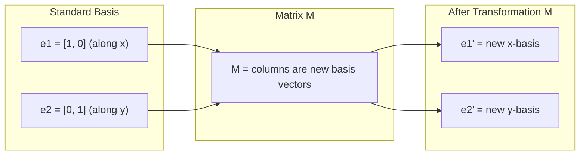
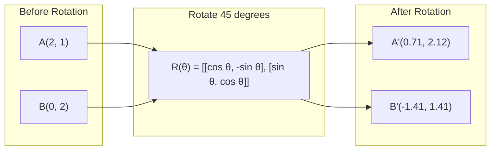
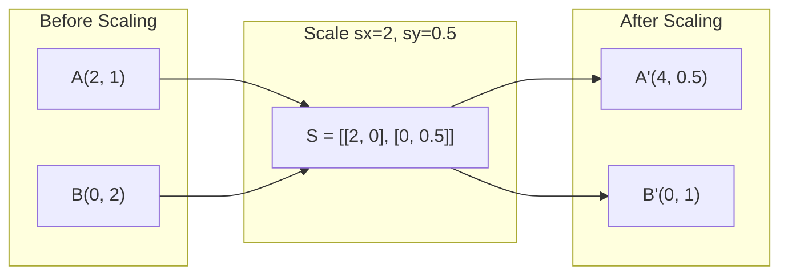
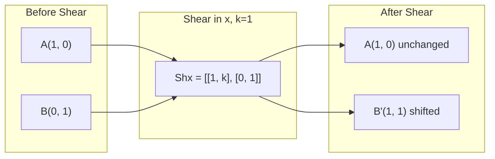
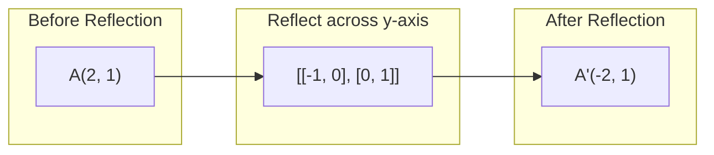
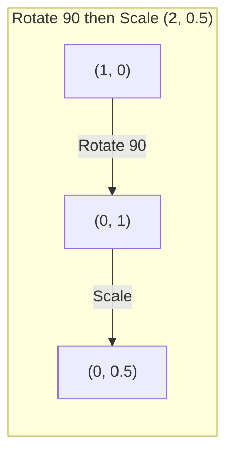
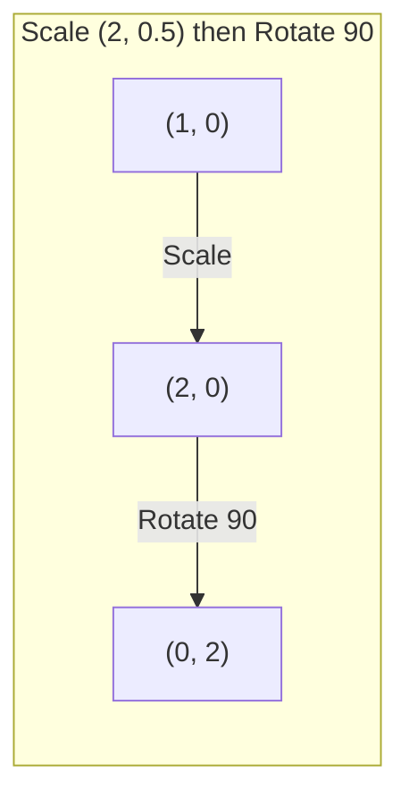

# تحولات ماتریکس

> ماتریکس یک ماشین است که فضا را تغییر می دهد. یاد بگیرید که چه کاری به هر نقطه انجام می دهد، و شما کل تحول را درک می کنید.

**Type:** Build
**Languages:** Python, Julia
**Prerequisites:** Phase 1, Lessons 01-02 (Linear Algebra Intuition, Vectors & Matrices Operations)
**Time:** ~75 minutes

## اهداف یادگیری

- ماتریس های چرخش، مقیاس بندی، برش و بازتاب را بسازید و آنها را به نقاط 2D و 3D اعمال کنید
- ترکیب چندین تحول با ضرب ماتریکس و تایید اینکه ترتیب مهم است
- ارزش های خاص و متریزهای خاص ماتریس 2×2 را از معادله مشخص محاسبه کنید
- توضیح دهید که چرا ارزش های خاص جهت PCA، ثبات RNN و رفتار گروه بندی طیف را تعیین می کند

## مشکل

شما در مورد PCA می خوانید و می بینید "ویکتورهای خودروی ماتریکس کوویاریانس را پیدا کنید". شما در مورد ثبات مدل می خوانید و می بینید "آیا همه ارزش های خودروی دارای مقادیر کمتر از 1 هستند". شما در مورد افزایش داده ها می خوانید و می بینید "تولید یک چرخش تصادفی". هیچ یک از این ها منطقی نیست تا زمانی که شما درک کنید ماتریکس ها به صورت هندسی به فضا چه می کنند.

ماتریس ها فقط شبکه های اعداد نیستند. آنها ماشین های فضایی هستند. یک ماتریس چرخش نقاط را می چرخد. یک ماتریس مقیاس بندی آنها را می کشاند. یک ماتریس برش آنها را می کند. هر تحول شبکه عصبی به داده ها اعمال می شود یکی از این عملیات یا ترکیب آنها است. این درس آن عملیات را مشخص می کند.

## مفهوم

### تحولات به عنوان ماتریس

هر تحول خطی در 2D می تواند به عنوان یک ماتریس 2x2 نوشته شود. ماتریس به شما دقیقاً می گوید که متری پایه [1, 0] و [0, 1] به کجا می رسد. همه چیز دیگر ادامه می یابد.



### چرخش

یک چرخش دو بعدی با زاویه تتا فاصله ها و زاویه ها را حفظ می کند.



در 3D، شما در اطراف یک محور چرخش می کنید. هر محور دارای ماتریس چرخش خاص خود است:

```
Rz(theta) = | cos  -sin  0 |     Rotate around z-axis
            | sin   cos  0 |     (x-y plane spins, z stays)
            |  0     0   1 |

Rx(theta) = | 1   0     0    |   Rotate around x-axis
            | 0  cos  -sin   |   (y-z plane spins, x stays)
            | 0  sin   cos   |

Ry(theta) = |  cos  0  sin |     Rotate around y-axis
            |   0   1   0  |     (x-z plane spins, y stays)
            | -sin  0  cos |
```

### مقیاس بندی

مقیاس بندی به طور مستقل در طول هر محور کشیده یا فشرده می شود.



### تراش

برش یک محور را در حالی که محور دیگر را ثابت نگه می دارد، به سمت یک محور می کند.



ماتریس های شیر:
- `Shx = [[1, k], [0, 1]]`تغییر x توسط k * y
- `Shy = [[1, 0], [k, 1]]`تغییر y توسط k * x

### بازتاب

بازتاب نقاط در یک محور یا خط را منعکس می کند.



ماتریس های بازتاب:
- در عرض محور y بازتاب کنید: `[[-1, 0], [0, 1]]`
- در طول محور x بازتاب کنید: `[[1, 0], [0, -1]]`

### ترکیب: تحولات زنجیره ای

استفاده از تحول A و سپس B، همان چیزی است که ضرب ماتریس آنها را می کند:`result = B @ A @ point`. نظم مهمه. سپس مقیاس رو به صورت مختلف از مقیاس رو به صورت مختلف انجام میده



ترکیب شده: `S @ R = [[0, -2], [0.5, 0]]`



ترکیب شده: `R @ S = [[0, -0.5], [2, 0]]`

نتایج متفاوت. ضرب ماتریکس تعادل نمی کند.

### ارزش های خاص و متریهای خاص

اکثر متریسه ها زمانی که یک ماتریس به آنها می رسد جهت تغییر می کنند. متریسه های خاص هستند: ماتریس فقط آنها را مقیاس می دهد، هرگز آنها را چرخش نمی کند. عامل مقیاس پذیری ارزش خود است.

```
A @ v = lambda * v

v is the eigenvector (direction that survives)
lambda is the eigenvalue (how much it stretches)

Example: A = | 2  1 |
             | 1  2 |

Eigenvector [1, 1] with eigenvalue 3:
  A @ [1,1] = [3, 3] = 3 * [1, 1]     (same direction, scaled by 3)

Eigenvector [1, -1] with eigenvalue 1:
  A @ [1,-1] = [1, -1] = 1 * [1, -1]  (same direction, unchanged)
```

ماتریکس فضا را به طول [1, 1] به 3x گسترش می دهد و [1, -1] را بدون تغییر نگه می دارد. هر جهت دیگر ترکیبی از این دو است.

### ترکیب خاص

اگر یک ماتریس دارای n ویکتورهای مستقل خطی باشد، می تواند تجزیه شود:

```
A = V @ D @ V^(-1)

V = matrix whose columns are eigenvectors
D = diagonal matrix of eigenvalues
V^(-1) = inverse of V

This says: rotate into eigenvector coordinates, scale along each axis, rotate back.
```

### چرا ارزش های شخصی مهم هستند

**PCA.**ویکتورهای خونی ماتریس کوویاریانس اجزای اصلی هستند. ارزش های خونی به شما می گویند که هر اجزای چقدر تفاوت را جذب می کند. به ارزش خونی ترتیب دهید، k بالا را نگه دارید و شما کاهش ابعاد دارید.

**Stability.**در شبکه های مکرر و سیستم های پویا، مقادیر خاص با شدت > 1 باعث انفجار خروجی می شود. مقادیر < 1 باعث ناپدید شدن آنها می شود. این مشکل انحلال ناپدید شدن / انفجار است که در یک جمله بیان شده است.

**Spectral methods.**شبکه های عصبی گرافیک از ارزش های خاص ماتریس همسایه استفاده می کنند. گروه بندی طیف از ارزش های خاص Laplacian استفاده می کند. ناقل های خاص ساختار گرافی را نشان می دهند.

### تعیین کننده به عنوان عامل مقیاس حجم

تعیین کننده یک ماتریس تحول به شما می گوید که چقدر آن را مقیاس منطقه (2D) یا حجم (3D).

```
det = 1:   area preserved (rotation)
det = 2:   area doubled
det = 0:   space crushed to lower dimension (singular)
det = -1:  area preserved but orientation flipped (reflection)

| det(Rotation) | = 1        (always)
| det(Scale sx, sy) | = sx * sy
| det(Shear) | = 1           (area preserved)
| det(Reflection) | = -1     (orientation flipped)
```

```figure
matrix-transform
```

## آن را بسازید

### مرحله 1: ماتریس های تبدیل از ابتدا (پایتون)

```python
import math

def rotation_2d(theta):
    c, s = math.cos(theta), math.sin(theta)
    return [[c, -s], [s, c]]

def scaling_2d(sx, sy):
    return [[sx, 0], [0, sy]]

def shearing_2d(kx, ky):
    return [[1, kx], [ky, 1]]

def reflection_x():
    return [[1, 0], [0, -1]]

def reflection_y():
    return [[-1, 0], [0, 1]]

def mat_vec_mul(matrix, vector):
    return [
        sum(matrix[i][j] * vector[j] for j in range(len(vector)))
        for i in range(len(matrix))
    ]

def mat_mul(a, b):
    rows_a, cols_b = len(a), len(b[0])
    cols_a = len(a[0])
    return [
        [sum(a[i][k] * b[k][j] for k in range(cols_a)) for j in range(cols_b)]
        for i in range(rows_a)
    ]

point = [1.0, 0.0]
angle = math.pi / 4

rotated = mat_vec_mul(rotation_2d(angle), point)
print(f"Rotate (1,0) by 45 deg: ({rotated[0]:.4f}, {rotated[1]:.4f})")

scaled = mat_vec_mul(scaling_2d(2, 3), [1.0, 1.0])
print(f"Scale (1,1) by (2,3): ({scaled[0]:.1f}, {scaled[1]:.1f})")

sheared = mat_vec_mul(shearing_2d(1, 0), [1.0, 1.0])
print(f"Shear (1,1) kx=1: ({sheared[0]:.1f}, {sheared[1]:.1f})")

reflected = mat_vec_mul(reflection_y(), [2.0, 1.0])
print(f"Reflect (2,1) across y: ({reflected[0]:.1f}, {reflected[1]:.1f})")
```

### مرحله دوم: ترکیب تحولات

```python
R = rotation_2d(math.pi / 2)
S = scaling_2d(2, 0.5)

rotate_then_scale = mat_mul(S, R)
scale_then_rotate = mat_mul(R, S)

point = [1.0, 0.0]
result1 = mat_vec_mul(rotate_then_scale, point)
result2 = mat_vec_mul(scale_then_rotate, point)

print(f"Rotate 90 then scale: ({result1[0]:.2f}, {result1[1]:.2f})")
print(f"Scale then rotate 90: ({result2[0]:.2f}, {result2[1]:.2f})")
print(f"Same? {result1 == result2}")
```

### مرحله 3: ارزش های شخصی از ابتدا (2x2)

برای ماتریک 2×2`[[a, b], [c, d]]`, ارزش های خاص معادله مشخص را حل می کنند: `lambda^2 - (a+d)*lambda + (ad - bc) = 0`. .

```python
def eigenvalues_2x2(matrix):
    a, b = matrix[0]
    c, d = matrix[1]
    trace = a + d
    det = a * d - b * c
    discriminant = trace ** 2 - 4 * det
    if discriminant < 0:
        real = trace / 2
        imag = (-discriminant) ** 0.5 / 2
        return (complex(real, imag), complex(real, -imag))
    sqrt_disc = discriminant ** 0.5
    return ((trace + sqrt_disc) / 2, (trace - sqrt_disc) / 2)

def eigenvector_2x2(matrix, eigenvalue):
    a, b = matrix[0]
    c, d = matrix[1]
    if abs(b) > 1e-10:
        v = [b, eigenvalue - a]
    elif abs(c) > 1e-10:
        v = [eigenvalue - d, c]
    else:
        if abs(a - eigenvalue) < 1e-10:
            v = [1, 0]
        else:
            v = [0, 1]
    mag = (v[0] ** 2 + v[1] ** 2) ** 0.5
    return [v[0] / mag, v[1] / mag]

A = [[2, 1], [1, 2]]
vals = eigenvalues_2x2(A)
print(f"Matrix: {A}")
print(f"Eigenvalues: {vals[0]:.4f}, {vals[1]:.4f}")

for val in vals:
    vec = eigenvector_2x2(A, val)
    result = mat_vec_mul(A, vec)
    scaled = [val * vec[0], val * vec[1]]
    print(f"  lambda={val:.1f}, v={[round(x,4) for x in vec]}")
    print(f"    A@v = {[round(x,4) for x in result]}")
    print(f"    l*v = {[round(x,4) for x in scaled]}")
```

### مرحله 4: تعیین کننده به عنوان عامل مقیاس حجم

```python
def det_2x2(matrix):
    return matrix[0][0] * matrix[1][1] - matrix[0][1] * matrix[1][0]

print(f"det(rotation 45) = {det_2x2(rotation_2d(math.pi/4)):.4f}")
print(f"det(scale 2,3)   = {det_2x2(scaling_2d(2, 3)):.1f}")
print(f"det(shear kx=1)  = {det_2x2(shearing_2d(1, 0)):.1f}")
print(f"det(reflect y)   = {det_2x2(reflection_y()):.1f}")

singular = [[1, 2], [2, 4]]
print(f"det(singular)     = {det_2x2(singular):.1f}")
print("Singular: columns are proportional, space collapses to a line.")
```

## ازش استفاده کن

NumPy با روتین های بهینه سازی شده همه این کارها را انجام می دهد.

```python
import numpy as np

theta = np.pi / 4
R = np.array([[np.cos(theta), -np.sin(theta)],
              [np.sin(theta),  np.cos(theta)]])

point = np.array([1.0, 0.0])
print(f"Rotate (1,0) by 45 deg: {R @ point}")

S = np.diag([2.0, 3.0])
composed = S @ R
print(f"Scale(2,3) after Rotate(45): {composed @ point}")

A = np.array([[2, 1], [1, 2]], dtype=float)
eigenvalues, eigenvectors = np.linalg.eig(A)
print(f"\nEigenvalues: {eigenvalues}")
print(f"Eigenvectors (columns):\n{eigenvectors}")

for i in range(len(eigenvalues)):
    v = eigenvectors[:, i]
    lam = eigenvalues[i]
    print(f"  A @ v{i} = {A @ v}, lambda * v{i} = {lam * v}")

print(f"\ndet(R) = {np.linalg.det(R):.4f}")
print(f"det(S) = {np.linalg.det(S):.1f}")

B = np.array([[3, 1], [0, 2]], dtype=float)
vals, vecs = np.linalg.eig(B)
D = np.diag(vals)
V = vecs
reconstructed = V @ D @ np.linalg.inv(V)
print(f"\nEigendecomposition A = V @ D @ V^-1:")
print(f"Original:\n{B}")
print(f"Reconstructed:\n{reconstructed}")
```

### چرخش 3D با NumPy

```python
def rotation_3d_z(theta):
    c, s = np.cos(theta), np.sin(theta)
    return np.array([[c, -s, 0], [s, c, 0], [0, 0, 1]])

def rotation_3d_x(theta):
    c, s = np.cos(theta), np.sin(theta)
    return np.array([[1, 0, 0], [0, c, -s], [0, s, c]])

point_3d = np.array([1.0, 0.0, 0.0])
rotated_z = rotation_3d_z(np.pi / 2) @ point_3d
rotated_x = rotation_3d_x(np.pi / 2) @ point_3d

print(f"\n3D point: {point_3d}")
print(f"Rotate 90 around z: {np.round(rotated_z, 4)}")
print(f"Rotate 90 around x: {np.round(rotated_x, 4)}")
```

## -باده

این درس پایه های هندسی را برای PCA (فاز 2) و تجزیه و تحلیل وزن شبکه عصبی ایجاد می کند. کد eigenvalue / eigenvector ساخته شده در اینجا همان الگوریتم است که باعث کاهش ابعاد، گروه بندی طیف و تجزیه و تحلیل ثبات در سیستم های تولید ML می شود.

## تمرینات

1. روی یک مربع واحد (زاویه ها در [0,0], [1,0], [1,1], [0,1]) چرخش، مقیاس بندی و برش را اعمال کنید. گوشه های تبدیل شده را برای هر یک چاپ کنید. بررسی کنید که چرخش فاصله بین گوشه ها را حفظ می کند.

2. با استفاده از معادله مشخص، مقادیر خود ماترکس [[4, 2]، [1, 3]] را به دست پیدا کنید. سپس با تابع از ابتدا و با NumPy تأیید کنید.

3. ترکیب سه تحول را ایجاد کنید (به سرعت 30 درجه، مقیاس با [1.5, 0.8، برش با kx=0.3) و آن را به 8 نقطه در یک دایره ترتیب دهید. قبل و بعد از همبستگی چاپ کنید. تعیین کننده ماتریس ترکیب را محاسبه کنید و تأیید کنید که برابر با محصول تعیین کننده های فردی است.

## اصطلاحات کلیدی

| Term | What people say | What it actually means |
|------|----------------|----------------------|
| Rotation matrix | "Spins things" | An orthogonal matrix that moves points along circular arcs while preserving distances and angles. Determinant is always 1. |
| Scaling matrix | "Makes things bigger" | A diagonal matrix that stretches or compresses independently along each axis. Determinant is the product of scale factors. |
| Shearing matrix | "Slants things" | A matrix that shifts one coordinate proportionally to another, turning rectangles into parallelograms. Determinant is 1. |
| Reflection | "Mirrors things" | A matrix that flips space across an axis or plane. Determinant is -1. |
| Composition | "Do two things" | Multiplying transformation matrices to chain operations. Order matters: B @ A means apply A first, then B. |
| Eigenvector | "Special direction" | A direction that the matrix only scales, never rotates. The transformation's fingerprint. |
| Eigenvalue | "How much it stretches" | The scalar factor by which the matrix scales its eigenvector. Can be negative (flip) or complex (rotation). |
| Eigendecomposition | "Break the matrix apart" | Writing a matrix as V @ D @ V^(-1), separating it into its fundamental scaling directions and magnitudes. |
| Determinant | "A single number from a matrix" | The factor by which the transformation scales area (2D) or volume (3D). Zero means the transformation is irreversible. |
| Characteristic equation | "Where eigenvalues come from" | det(A - lambda * I) = 0. The polynomial whose roots are the eigenvalues. |

## خواندن بیشتر

- [3Blue1Brown: Linear Transformations](https://www.3blue1brown.com/lessons/linear-transformations)-- حس بصری برای چگونگی شکل دادن ماتریس به فضا
- [3Blue1Brown: Eigenvectors and Eigenvalues](https://www.3blue1brown.com/lessons/eigenvalues)-- بهترین توضیح بصری از آنچه که ویکتورهای خونی به صورت هندسی معنی دارند
- [MIT 18.06 Lecture 21: Eigenvalues and Eigenvectors](https://ocw.mit.edu/courses/18-06-linear-algebra-spring-2010/)- درمان کلاسیک گيلبر استرانگ
