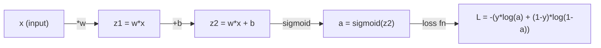
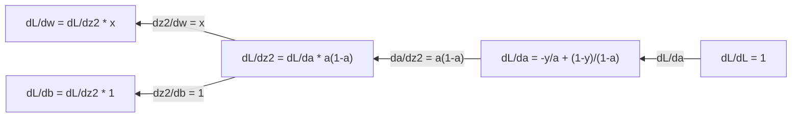
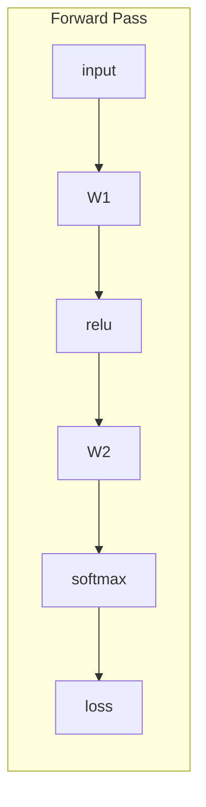
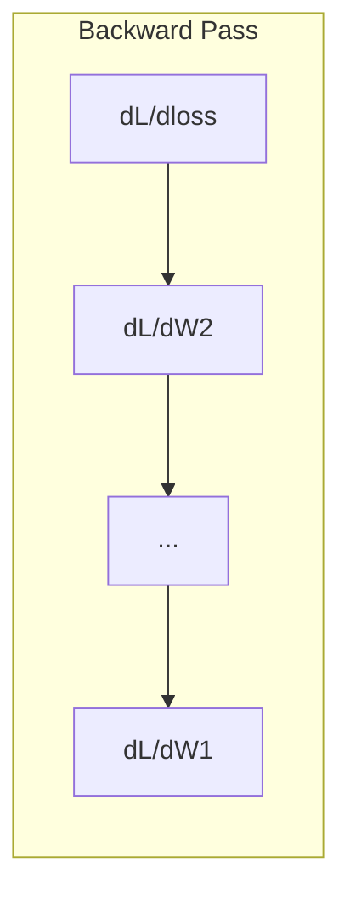

# محاسبه یادگیری ماشین

> مشتقات به شما می گویند که کدام سمت پایین است. این همه چیزی است که یک شبکه عصبی باید یاد بگیرد.

**Type:** Learn
**Language:**پیتون
**Prerequisites:** Phase 1, Lessons 01-03
**Time:** ~60 minutes

## اهداف یادگیری

- مشتق های عددی و تحلیلی برای عملکردهای ML مشترک محاسبه کنید (x^2, sigmoid, cross-entropy)
- پیاده سازی کاهش گرادینت از ابتدا برای حداقل رساندن عملکرد از دست دادن در 1D و 2D
- منحنی یک مدل بازپسین خطی را بازگردانید و آن را با استفاده از بروز رسانی وزن دستی تمرین کنید
- ماتریس هسیان، مقربات سری تیلور و ارتباط آنها با روش های بهینه سازی را توضیح دهید

## مشکل

شما یک شبکه عصبی با میلیون ها وزن دارید. هر وزن یک دکمه است. شما باید بفهمید که هر دکمه را به کدام سمت برگردانید تا مدل را کمی کمتر اشتباه کنید. محاسبه به شما این جهت را می دهد.

بدون حساب، آموزش شبکه عصبی به معنای تلاش برای تغییر تصادفی و امید به بهترین است. با مشتقات، شما دقیقا می دانید که هر وزن چگونه بر خطا تاثیر می گذارد. شما هر دکمه را به سمت درست، هر بار می کنید.

## مفهوم

### مشتق چیست؟

یک مشتق سرعت تغییر را اندازه گیری می کند. برای یک تابع y = f(x، مشتق f'(x) به شما می گوید: اگر x را با مقدار کمی فشار دهید، y چقدر تغییر می کند؟

از نظر هندسی، مشتق، انحلال خط دستک در یک نقطه است.

**f(x) = x^2:**

| x | f(x) | f'(x) (slope) |
|---|------|---------------|
| 0 | 0    | 0 (flat, at the bottom) |
| 1 | 1    | 2 |
| 2 | 4    | 4 (tangent line slope at this point) |
| 3 | 9    | 6 |

در x=2، منحنی 4 است. اگر x را کمی به سمت راست حرکت دهید، y حدود 4 برابر این مقدار افزایش می یابد. در x=0، منحنی 0 است. شما در پایین کاسه هستید.

تعریف رسمی:

```
f'(x) = lim   f(x + h) - f(x)
        h->0  -----------------
                     h
```

در کد، شما از حد عبور می کنید و فقط یک h بسیار کوچک را استفاده می کنید. این مشتق عددی است.

### مشتق های جزئی: یک متغیر در یک زمان

عملکردهای واقعی ورودی های زیادی دارند. یک از دست دادن شبکه عصبی به هزاران وزن بستگی دارد. یک مشتق جزئی تمام متغیرها را به جز یک ثابت نگه می دارد، سپس مشتق را در رابطه با آن یک می گیرد.

```
f(x, y) = x^2 + 3xy + y^2

df/dx = 2x + 3y     (treat y as a constant)
df/dy = 3x + 2y     (treat x as a constant)
```

هر مشتق جزئی پاسخ می دهد: اگر فقط این وزن را فشار دهم، چگونه کاهش تغییر می کند؟

### گرادینت: ویکتور تمام مشتق های جزئی

گرادینت هر مشتق جزئی را به یک ویکتور جمع می کند. برای یک تابع f ((x، y، z) ، گرادینت:

```
grad f = [ df/dx, df/dy, df/dz ]
```

گرادینت به سمت بلندترین صعود اشاره دارد. برای حداقل کردن یک تابع، به سمت مخالف حرکت کنید.

**Contour plot of f(x,y) = x^2 + y^2:**

این تابع شکل کاسه ای با دایره های متمرکز به عنوان خطوط کنتور تشکیل می دهد. حداقل در (0, 0) است.

| Point | grad f | -grad f (descent direction) |
|-------|--------|----------------------------|
| (1, 1) | [2, 2] (points uphill, away from minimum) | [-2, -2] (points downhill, toward minimum) |
| (0, 0) | [0, 0] (flat, at the minimum) | [0, 0] |

این پایین آمدن گرادینت در یک تصویر است. گرادینت را محاسبه کنید، آن را رد کنید، یک قدم بردارید.

### ارتباط با بهینه سازی

آموزش شبکه عصبی بهینه سازی است. شما یک تابع از دست دادن L ((w1، w2، ..., wn) دارید که اندازه گیری می کند که مدل چقدر اشتباه است. شما می خواهید آن را به حداقل برساند.

```
Gradient descent update rule:

  w_new = w_old - learning_rate * dL/dw

For every weight:
  1. Compute the partial derivative of loss with respect to that weight
  2. Subtract a small multiple of it from the weight
  3. Repeat
```

سرعت یادگیری اندازه گامها را کنترل می کند خیلی بزرگ و شما بیش از حد می گذرد خیلی کوچک و شما خزید

**Loss landscape (1D slice):**

تابع ضایع L ((w) به عنوان وزن w متفاوت، منحنی با قله ها و دره ها تشکیل می دهد.

| Feature | Description |
|---------|-------------|
| Global minimum | The lowest point on the entire curve -- the best solution |
| Local minimum | A valley that is lower than its neighbors but not the lowest overall |
| Slope | Gradient descent follows the slope downhill from any starting point |

کاهش درجه ای به دنبال پایین رفتن تپه است. این می تواند در حداقل های محلی گیر کند، اما در فضاهای ابعاد بالا (میلیون ها وزن) این به ندرت یک مشکل عملی است.

### مشتق های عددی در مقابل تحلیل

دو راه برای محاسبه یک مشتق وجود دارد.

تحلیل: قوانین حساب را به دست اعمال کنید. برای f  x = x^2 ، مشتق f  x = 2x است. دقیق. سریع.

عددی: با استفاده از تعریف تخمین بزنید. f ((x+h) و f ((x-h) را برای یک h کوچک محاسبه کنید، سپس تفاوت را استفاده کنید.

```
Numerical (central difference):

f'(x) ~= f(x + h) - f(x - h)
          -----------------------
                  2h

h = 0.0001 works well in practice
```

مشتقات عددی آهسته تر هستند اما برای هر عملکردی کار می کنند. مشتقات تحلیلی سریع هستند اما نیاز به مشتق کردن فرمول دارند. چارچوب های شبکه عصبی از یک رویکرد سوم استفاده می کنند: تفاوت خودکار، که مشتقات دقیق را به صورت مکانیکی محاسبه می کند. شما در مرحله 3 خواهید دید.

### مشتقات دست برای عملکردهای ساده

این مشتقات است که شما بارها و بارها در ML خواهید دید.

```
Function        Derivative       Used in
--------        ----------       -------
f(x) = x^2     f'(x) = 2x      Loss functions (MSE)
f(x) = wx + b  f'(w) = x        Linear layer (gradient w.r.t. weight)
                f'(b) = 1        Linear layer (gradient w.r.t. bias)
                f'(x) = w        Linear layer (gradient w.r.t. input)
f(x) = e^x     f'(x) = e^x     Softmax, attention
f(x) = ln(x)   f'(x) = 1/x     Cross-entropy loss
f(x) = 1/(1+e^-x)  f'(x) = f(x)(1-f(x))   Sigmoid activation
```

برای f ((x) = x^2:

```
f(x) = x^2    f'(x) = 2x

  x    f(x)   f'(x)   meaning
  -2    4      -4      slope tilts left (decreasing)
  -1    1      -2      slope tilts left (decreasing)
   0    0       0      flat (minimum!)
   1    1       2      slope tilts right (increasing)
   2    4       4      slope tilts right (increasing)
```

برای f(w) = wx + b با x=3, b=1:

```
f(w) = 3w + 1    f'(w) = 3

The derivative with respect to w is just x.
If x is big, a small change in w causes a big change in output.
```

### قانون زنجیره ای

وقتی تابع ها ترکیب می شوند، قانون زنجیره به شما می گوید که چگونه تفاوت کنید.

```
If y = f(g(x)), then dy/dx = f'(g(x)) * g'(x)

Example: y = (3x + 1)^2
  outer: f(u) = u^2       f'(u) = 2u
  inner: g(x) = 3x + 1    g'(x) = 3
  dy/dx = 2(3x + 1) * 3 = 6(3x + 1)
```

شبکه های عصبی زنجیره ای از عملکردها هستند: ورودی -> خطی -> فعال سازی -> خطی -> فعال سازی -> از دست دادن. پس گسترش قاعده زنجیره ای است که بارها از ورودی به ورودی اعمال می شود. این کل الگوریتم است.

### ماتریکس هسی

گرادینت به شما مهره میگه هسیان به شما منحنی میگه

Hessian ماتریس مشتق های جزئی درجه دوم است. برای یک تابع f ((x1، x2، ..., xn) ، ورودی (i، j) از Hessian عبارت است از:

```
H[i][j] = d^2f / (dx_i * dx_j)
```

برای یک تابع دو متغیر f ((x, y):

```
H = | d^2f/dx^2    d^2f/dxdy |
    | d^2f/dydx    d^2f/dy^2 |
```

**What the Hessian tells you at a critical point (where gradient = 0):**

| Hessian property | Meaning | Example surface |
|-----------------|---------|-----------------|
| Positive definite (all eigenvalues > 0) | Local minimum | Bowl pointing up |
| Negative definite (all eigenvalues < 0) | Local maximum | Bowl pointing down |
| Indefinite (mixed eigenvalues) | Saddle point | Horse saddle shape |

**Example:**f(x, y) = x^2 - y^2 (یک تابع سیله)

```
df/dx = 2x       df/dy = -2y
d^2f/dx^2 = 2    d^2f/dy^2 = -2    d^2f/dxdy = 0

H = | 2   0 |
    | 0  -2 |

Eigenvalues: 2 and -2 (one positive, one negative)
--> Saddle point at (0, 0)
```

با f ((x, y) = x^2 + y^2 (یک کاسه) مقایسه کنید:

```
H = | 2  0 |
    | 0  2 |

Eigenvalues: 2 and 2 (both positive)
--> Local minimum at (0, 0)
```

**Why the Hessian matters in ML:**

روش نیوتن از روش هسی استفاده می کند تا گام های بهینه سازی بهتری نسبت به کاهش گرادینت انجام دهد. به جای فقط دنبال پاشنه، به منحنیات حساب می دهد:

```
Newton's update:    w_new = w_old - H^(-1) * gradient
Gradient descent:   w_new = w_old - lr * gradient
```

روش نیوتن سریعتر به هم می رسد چون هسیان گرادینت را "توسع" می کند -- جهت های دوردست قدم های کوچکتر، جهت های صاف قدم های بزرگتر می گیرند.

نکته مهم: برای یک شبکه عصبی با پارامترهای N، Hessian N x N است. یک مدل با 1 میلیون پارامتر نیاز به یک ماتریس 1 تریلیون ورودی دارد. به همین دلیل ما از مقربات استفاده می کنیم.

| Method | What it uses | Cost | Convergence |
|--------|-------------|------|-------------|
| Gradient descent | First derivatives only | O(N) per step | Slow (linear) |
| Newton's method | Full Hessian | O(N^3) per step | Fast (quadratic) |
| L-BFGS | Approximate Hessian from gradient history | O(N) per step | Medium (superlinear) |
| Adam | Per-parameter adaptive rates (diagonal Hessian approx) | O(N) per step | Medium |
| Natural gradient | Fisher information matrix (statistical Hessian) | O(N^2) per step | Fast |

در عمل، آدام بهینه سازی پیش فرض برای یادگیری عمیق است. این اطلاعات درجه دوم را با ردیابی متوسط اجرا و متغیر گرادیانت ها در هر پارامتر به راحتی نزدیک می کند.

### تقرب سری تیلر

هر تابع صاف را می توان با یک چندگانه محوری تخمین زد:

```
f(x + h) = f(x) + f'(x)*h + (1/2)*f''(x)*h^2 + (1/6)*f'''(x)*h^3 + ...
```

هرچه اصطلاحات بیشتری را در میان بگذارید، نزدیک شدن بهتر می شود، اما فقط نزدیک به نقطه x.

**Why Taylor series matter for ML:**

- **First-order Taylor = gradient descent.**وقتی از f(x + h) ~ f(x) + f'(x) *h استفاده می کنید، یک مقربات خطی انجام می دهید. کاهش درجه ای این مدل خطی را به حداقل می رساند تا h = -lr * f'(x را انتخاب کنید.

- **Second-order Taylor = Newton's method.**با استفاده از f(x + h) ~ f(x) + f'(x) *h + (1/2) *f'(x) *h^2، شما یک مدل مربع را دریافت می کنید. به حداقل رساندن آن h = -f'(x) / f'(x) -- قدم نیوتن.

- **Loss function design.**MSE و کراس انترپی هموار هستند، به این معنی که گسترش های تیلور آنها به خوبی رفتار می کنند. این تصادفی نیست. از دست دادن های هموار بهینه سازی قابل پیش بینی می کنند.

```
Approximation order    What it captures    Optimization method
-------------------    -----------------   -------------------
0th order (constant)   Just the value      Random search
1st order (linear)     Slope               Gradient descent
2nd order (quadratic)  Curvature           Newton's method
Higher orders          Finer structure     Rarely used in ML
```

نکته کلیدی: تمام بهینه سازی مبتنی بر گرادینت در واقع در مورد نزدیک کردن عملکرد ضرر در محل و قدم به حداقل آن نزدیک شدن است.

### انترال در ML

مشتقات به شما شرح تغییر می گویند. انترال ها جمع آوری را محاسبه می کنند -- مساحت زیر منحنی.

در ML، شما به ندرت تکاملی را به دست محاسبه می کنید، اما مفهوم در همه جا است:

**Probability.**برای یک متغیر تصادفی مداوم با تراکم p ((x):
```
P(a < X < b) = integral from a to b of p(x) dx
```
منطقه زیر منحنی تراکم احتمال بین a و b احتمال فرود در این محدوده است.

**Expected value.**نتیجه متوسط با احتمال وزن شده:
```
E[f(X)] = integral of f(x) * p(x) dx
```
خسارت انتظار می رود بر روی توزیع داده ها یک جزء است. آموزش به حداقل رساندن نزدیک سازی تجربی از این است.

**KL divergence.**اندازه گیری تفاوت دو توزیع:
```
KL(p || q) = integral of p(x) * log(p(x) / q(x)) dx
```
در VAEs، تصفیه دانش و نتیجه گیری بیزیایی استفاده می شود.

**Normalization constants.**در نتیجه گیری بیزی:
```
p(w | data) = p(data | w) * p(w) / integral of p(data | w) * p(w) dw
```
نامزدی یک جزء تمام ارزش های پارامتر ممکن است. اغلب غیر قابل حل است، به همین دلیل ما از مقرباتی مانند MCMC و نتیجه گیری متغیر استفاده می کنیم.

| Integral concept | Where it appears in ML |
|-----------------|----------------------|
| Area under curve | Probability from density functions |
| Expected value | Loss functions, risk minimization |
| KL divergence | VAEs, policy optimization, distillation |
| Normalization | Bayesian posteriors, softmax denominator |
| Marginal likelihood | Model comparison, evidence lower bound (ELBO) |

### قانون زنجیره چند متغیر در نمودار محاسباتی

قانون زنجیره ای فقط برای عملکردهای مقیاس در یک خط اعمال نمی شود. در یک شبکه عصبی، متغیرها گسترش می یابند و ادغام می شوند. در اینجا نحوه جریان مشتقات از طریق یک گذر ساده به جلو است:



گذرگاه عقب تراز تراز راست به چپ را محاسبه می کند:



هر تیر با مشتق محلی ضرب می شود. گرادینت برای هر پارامتر محصول تمام مشتق های محلی در امتداد مسیر از از دست دادن به آن پارامتر است. هنگامی که مسیرها شاخه و ادغام می شوند، شما سهم را جمع می کنید (قاعده زنجیره چند متغیر).

این همه گسترش عقب است: قانون زنجیره ای که به طور سیستماتیک از طریق یک نمودار محاسباتی از خروجی به ورودی اعمال می شود.

### ماتریکس جکوبیان

هنگامی که یک تابع یک ویکتور را به یک ویکتور (مانند یک لایه شبکه عصبی) نقشه می زند، مشتق آن یک ماتریس است. جیکوبیان شامل هر مشتق جزئی از هر خروجی در رابطه با هر ورودی است.

برای f: R^n -> R^m، J جکوبین یک ماتریس m x n است:

| | x1 | x2 | ... | xn |
|---|---|---|---|---|
| f1 | df1/dx1 | df1/dx2 | ... | df1/dxn |
| f2 | df2/dx1 | df2/dx2 | ... | df2/dxn |
| ... | ... | ... | ... | ... |
| fm | dfm/dx1 | dfm/dx2 | ... | dfm/dxn |

شما به دست برای شبکه های عصبی جکوبیان را محاسبه نمی کنید. پیتورچ آن را اداره می کند. اما دانستن وجود آن به شما کمک می کند شکل های در پخش عقب را درک کنید: اگر یک لایه R^n را به R^m نقشه می زند، جکوبیان آن m x n است. گرادینت از طریق انتقال این ماتریس به عقب جریان می یابد.

### چرا این برای شبکه های عصبی مهم است

هر وزن در شبکه عصبی یک گرادینت می گیرد. گرادینت به شما می گوید که چگونه این وزن را تنظیم کنید تا از دست دادن را کاهش دهید.





هر روز تازه شدن وزن:
- `W1 = W1 - lr * dL/dW1`
- `W2 = W2 - lr * dL/dW2`

گذر جلو پیش بینی و از دست دادن را محاسبه می کند. گذر عقب گرادینت از دست دادن را نسبت به هر وزن محاسبه می کند. سپس هر وزن یک قدم کوچک به پایین می رود. برای میلیون ها قدم تکرار کنید. این یادگیری عمیق است.

```figure
derivative-tangent
```

## آن را بسازید

### مرحله 1: مشتق عددی از ابتدا

```python
def numerical_derivative(f, x, h=1e-7):
    return (f(x + h) - f(x - h)) / (2 * h)

def f(x):
    return x ** 2

for x in [-2, -1, 0, 1, 2]:
    numerical = numerical_derivative(f, x)
    analytical = 2 * x
    print(f"x={x:2d}  f'(x) numerical={numerical:.6f}  analytical={analytical:.1f}")
```

مشتق عددی با مشتق تحلیلی با چندین عدد دسیمال مطابقت دارد.

### مرحله دوم: مشتق های جزئی و گرادیانت ها

```python
def numerical_gradient(f, point, h=1e-7):
    gradient = []
    for i in range(len(point)):
        point_plus = list(point)
        point_minus = list(point)
        point_plus[i] += h
        point_minus[i] -= h
        partial = (f(point_plus) - f(point_minus)) / (2 * h)
        gradient.append(partial)
    return gradient

def f_multi(point):
    x, y = point
    return x**2 + 3*x*y + y**2

grad = numerical_gradient(f_multi, [1.0, 2.0])
print(f"Numerical gradient at (1,2): {[f'{g:.4f}' for g in grad]}")
print(f"Analytical gradient at (1,2): [2*1+3*2, 3*1+2*2] = [{2*1+3*2}, {3*1+2*2}]")
```

### مرحله 3: کاهش درجه ای برای پیدا کردن حداقل f ((x) = x^2

```python
x = 5.0
lr = 0.1
for step in range(20):
    grad = 2 * x
    x = x - lr * grad
    print(f"step {step:2d}  x={x:8.4f}  f(x)={x**2:10.6f}")
```

از x=5 شروع می شود، هر مرحله به x=0 (حداقل) نزدیک تر می شود.

### مرحله 4: کاهش درجه ای در یک تابع 2D

```python
def f_2d(point):
    x, y = point
    return x**2 + y**2

point = [4.0, 3.0]
lr = 0.1
for step in range(30):
    grad = numerical_gradient(f_2d, point)
    point = [p - lr * g for p, g in zip(point, grad)]
    loss = f_2d(point)
    if step % 5 == 0 or step == 29:
        print(f"step {step:2d}  point=({point[0]:7.4f}, {point[1]:7.4f})  f={loss:.6f}")
```

### مرحله 5: مقایسه مشتق های عددی و تحلیلی

```python
import math

test_functions = [
    ("x^2",      lambda x: x**2,          lambda x: 2*x),
    ("x^3",      lambda x: x**3,          lambda x: 3*x**2),
    ("sin(x)",   lambda x: math.sin(x),   lambda x: math.cos(x)),
    ("e^x",      lambda x: math.exp(x),   lambda x: math.exp(x)),
    ("1/x",      lambda x: 1/x,           lambda x: -1/x**2),
]

x = 2.0
print(f"{'Function':<12} {'Numerical':>12} {'Analytical':>12} {'Error':>12}")
print("-" * 50)
for name, f, df in test_functions:
    num = numerical_derivative(f, x)
    ana = df(x)
    err = abs(num - ana)
    print(f"{name:<12} {num:12.6f} {ana:12.6f} {err:12.2e}")
```

### مرحله 6: محاسبه Hessian به صورت عددی

```python
def hessian_2d(f, x, y, h=1e-5):
    fxx = (f(x + h, y) - 2 * f(x, y) + f(x - h, y)) / (h ** 2)
    fyy = (f(x, y + h) - 2 * f(x, y) + f(x, y - h)) / (h ** 2)
    fxy = (f(x + h, y + h) - f(x + h, y - h) - f(x - h, y + h) + f(x - h, y - h)) / (4 * h ** 2)
    return [[fxx, fxy], [fxy, fyy]]

def saddle(x, y):
    return x ** 2 - y ** 2

def bowl(x, y):
    return x ** 2 + y ** 2

H_saddle = hessian_2d(saddle, 0.0, 0.0)
H_bowl = hessian_2d(bowl, 0.0, 0.0)
print(f"Saddle Hessian: {H_saddle}")  # [[2, 0], [0, -2]] -- mixed signs
print(f"Bowl Hessian:   {H_bowl}")    # [[2, 0], [0, 2]]  -- both positive
```

Hessian تابع سیله دارای ارزش های خاص 2 و -2 (نمونه های مخلوط، تایید یک نقطه سیله) است. کاسه دارای ارزش های خاص 2 و 2 (هر دو مثبت، تایید حداقل) است.

### مرحله 7: نزدیک شدن تیلور در عمل

```python
import math

def taylor_approx(f, f_prime, f_double_prime, x0, h, order=2):
    result = f(x0)
    if order >= 1:
        result += f_prime(x0) * h
    if order >= 2:
        result += 0.5 * f_double_prime(x0) * h ** 2
    return result

x0 = 0.0
for h in [0.1, 0.5, 1.0, 2.0]:
    true_val = math.sin(h)
    t1 = taylor_approx(math.sin, math.cos, lambda x: -math.sin(x), x0, h, order=1)
    t2 = taylor_approx(math.sin, math.cos, lambda x: -math.sin(x), x0, h, order=2)
    print(f"h={h:.1f}  sin(h)={true_val:.4f}  order1={t1:.4f}  order2={t2:.4f}")
```

نزدیک x0=0, sin(x) ~ x (ترجمه ی اول تیلور). مقربه ی عالی برای h کوچک است اما برای h بزرگ تجزیه می شود. به همین دلیل کاهش گرادینت با نرخ یادگیری کوچک بهترین کار را می کند - هر مرحله فرض می کند که مقربه ی خطی دقیق است.

### مرحله 8: چرا این برای یک شبکه عصبی مهم است

```python
import random

random.seed(42)

w = random.gauss(0, 1)
b = random.gauss(0, 1)
lr = 0.01

xs = [1.0, 2.0, 3.0, 4.0, 5.0]
ys = [3.0, 5.0, 7.0, 9.0, 11.0]

for epoch in range(200):
    total_loss = 0
    dw = 0
    db = 0
    for x, y in zip(xs, ys):
        pred = w * x + b
        error = pred - y
        total_loss += error ** 2
        dw += 2 * error * x
        db += 2 * error
    dw /= len(xs)
    db /= len(xs)
    total_loss /= len(xs)
    w -= lr * dw
    b -= lr * db
    if epoch % 40 == 0 or epoch == 199:
        print(f"epoch {epoch:3d}  w={w:.4f}  b={b:.4f}  loss={total_loss:.6f}")

print(f"\nLearned: y = {w:.2f}x + {b:.2f}")
print(f"Actual:  y = 2x + 1")
```

هر حلقه آموزشی مبتنی بر گرادیانت به این الگوی عمل می کند: پیش بینی، از دست دادن محاسبه، گرادیانت محاسبه، وزنهای تازه.

## ازش استفاده کن

با NumPy، عملیات مشابه سریعتر و خلاصه تر است:

```python
import numpy as np

x = np.array([1, 2, 3, 4, 5], dtype=float)
y = np.array([3, 5, 7, 9, 11], dtype=float)

w, b = np.random.randn(), np.random.randn()
lr = 0.01

for epoch in range(200):
    pred = w * x + b
    error = pred - y
    loss = np.mean(error ** 2)
    dw = np.mean(2 * error * x)
    db = np.mean(2 * error)
    w -= lr * dw
    b -= lr * db

print(f"Learned: y = {w:.2f}x + {b:.2f}")
```

تو تازه از نو تخفیف gradient رو ساختي PyTorch حساب gradient رو خودکار ميکنه اما حلقه ي تازه اي هم همين

## تمرینات

1. اجرا`numerical_second_derivative(f, x)`استفاده کردن`numerical_derivative`ثابت کنید که مشتق دوم x^3 در x=2 12 است.
2. از کاهش گرادینت برای پیدا کردن حداقل f ((x, y) = (x - 3) ^ 2 + (y + 1) ^ 2 استفاده کنید. از (0, 0) شروع کنید. پاسخ باید به (3, -1) نزدیک شود.
3. به حلقه نزول گرادینت حرکت اضافه کنید: یک ویکتور سرعت را حفظ کنید که گرادینت های گذشته را جمع می کند. سرعت تقابل با و بدون حرکت در f ((x) = x^4 - 3x^2 مقایسه کنید.

## اصطلاحات کلیدی

| Term | What people say | What it actually means |
|------|----------------|----------------------|
| Derivative | "The slope" | The rate of change of a function at a point. Tells you how much the output changes per unit change in input. |
| Partial derivative | "Derivative of one variable" | The derivative with respect to one variable while all others are held constant. |
| Gradient | "Direction of steepest ascent" | A vector of all partial derivatives. Points in the direction that increases the function fastest. |
| Gradient descent | "Go downhill" | Subtract the gradient (times a learning rate) from the parameters to reduce the loss. The core of neural network training. |
| Learning rate | "Step size" | A scalar that controls how big each gradient descent step is. Too large: diverge. Too small: converge slowly. |
| Chain rule | "Multiply the derivatives" | The rule for differentiating composed functions: df/dx = df/dg * dg/dx. The mathematical basis of backpropagation. |
| Jacobian | "Matrix of derivatives" | When a function maps vectors to vectors, the Jacobian is the matrix of all partial derivatives of outputs with respect to inputs. |
| Numerical derivative | "Finite differences" | Approximating a derivative by evaluating the function at two nearby points and computing the slope between them. |
| Backpropagation | "Reverse-mode autodiff" | Computing gradients layer by layer from output to input using the chain rule. How neural networks learn. |
| Hessian | "Matrix of second derivatives" | The matrix of all second-order partial derivatives. Describes the curvature of a function. Positive definite Hessian at a critical point means local minimum. |
| Taylor series | "Polynomial approximation" | Approximating a function near a point using its derivatives: f(x+h) ~ f(x) + f'(x)h + (1/2)f''(x)h^2 + ... The basis for understanding why gradient descent and Newton's method work. |
| Integral | "Area under the curve" | The accumulation of a quantity over a range. In ML, integrals define probabilities, expected values, and KL divergence. |

## خواندن بیشتر

- [3Blue1Brown: Essence of Calculus](https://www.3blue1brown.com/topics/calculus)- بینش بصری برای مشتق ها، انتیگرالها و قانون زنجیره
- [Stanford CS231n: Backpropagation](https://cs231n.github.io/optimization-2/)- چگونه گرادینت ها از طریق لایه های شبکه عصبی جریان می یابند
