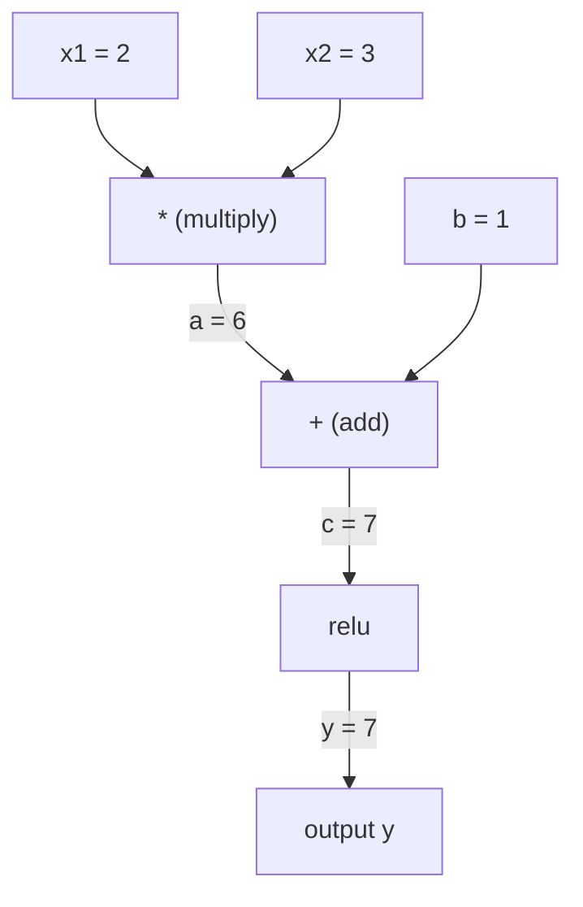
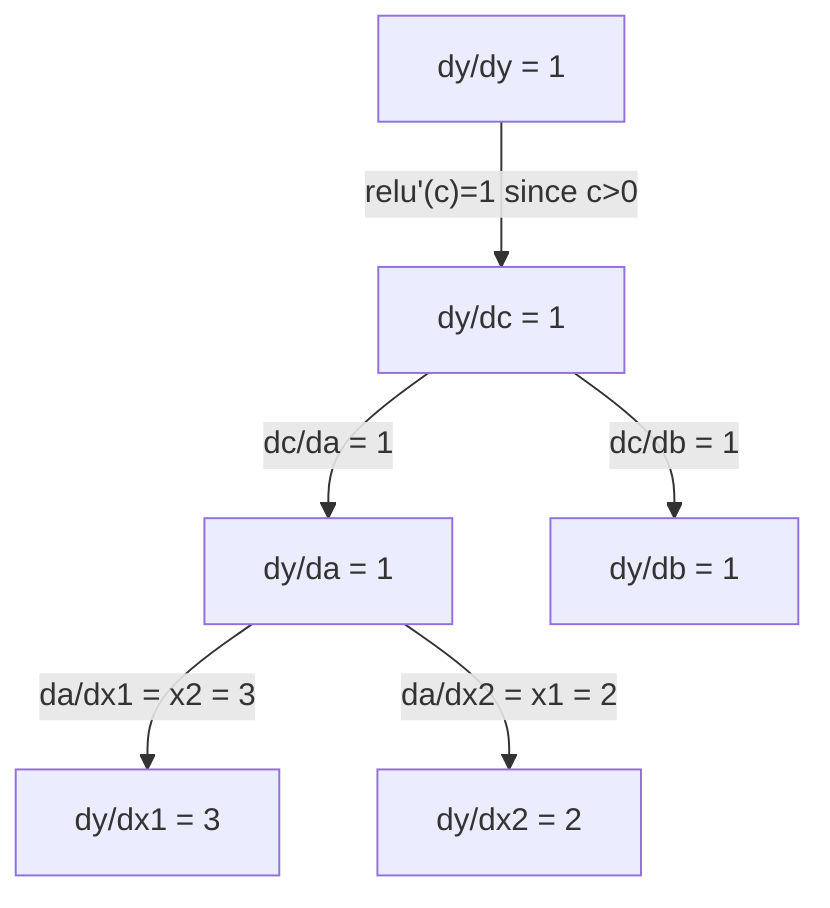

# قانون زنجیره ای و تفاوتی خودکار

> قانون زنجیره ای موتور پشت هر شبکه عصبی است که یاد می گیرد.

**Type:** Build
**Language:**پیتون
**Prerequisites:** Phase 1, Lesson 04 (Derivatives & Gradients)
**Time:** ~90 minutes

## اهداف یادگیری

- ساخت یک موتور autograd حداقل (فصل ارزش) که عملیات را ثبت و تراز را از طریق حالت برگشت خودکار محاسبه می کند
- پیاده سازی مسیرهای پیش و عقب از طریق نمودار محاسباتی با استفاده از نوع توپولوژیکی
- ساخت و آموزش یک پرسپترون چند لایه روی XOR با استفاده از تنها موتور autograd از ابتدا
- دقت خود تغییر را با استفاده از بررسی گرادینت با تفاوت های محدود عددی بررسی کنید

## مشکل

شما می توانید مشتقات تابع های ساده را محاسبه کنید. اما یک شبکه عصبی یک تابع ساده نیست. این صدها تابع ترکیب شده با هم است: ماتریس ضرب، اضافه کردن تعصب، اعمال فعال سازی، ماتریس ضرب دوباره، نرم ماکس، از دست دادن انترپی کراس. محصول یک تابع از یک تابع است.

برای آموزش شبکه، شما نیاز به گرادیوینت از دست دادن نسبت به هر وزن دارید. انجام این کار به دست برای میلیون ها پارامتر غیرممکن است. انجام آن به صورت عددی (تفرقات محدود) بسیار کند است.

قانون زنجیره به شما ریاضی می دهد. تفاوت خودکار به شما الگوریتم می دهد. با هم آنها به شما اجازه می دهند gradients دقیق را با ترکیب های تعسفی از تابع ها در زمان متناسب با یک گذر جلو محاسبه کنید.

اینجوری پایتورچ، TensorFlow و JAX کار می کنن. شما یک نسخه کوچک از نو بسازید.

## مفهوم

### قانون زنجیره ای

اگه`y = f(g(x))`، مشتق از `y`در رابطه با`x`این است:

```
dy/dx = dy/dg * dg/dx = f'(g(x)) * g'(x)
```

مشتقات را در طول زنجیره ضرب کنید. هر پیوند مشتقات محلی خود را به اشتراک می گذارد.

مثال:`y = sin(x^2)`

```
g(x) = x^2       g'(x) = 2x
f(g) = sin(g)     f'(g) = cos(g)

dy/dx = cos(x^2) * 2x
```

برای ترکیب های عمیق تر، زنجیره گسترش می یابد:

```
y = f(g(h(x)))

dy/dx = f'(g(h(x))) * g'(h(x)) * h'(x)
```

هر لایه ای در یک شبکه عصبی یک پیوند در این زنجیره است.

### نمودار های محاسباتی

یک نمودار محاسباتی قانون زنجیره را بصری می کند. هر عملی به یک گره تبدیل می شود. داده ها از طریق نمودار به جلو جریان می یابد. درجه بندی ها به عقب جریان می یابند.

**Forward pass (compute values):**



**Backward pass (compute gradients):**



گذر عقب قاعده زنجیره ای را در هر گره اعمال می کند و گرادیانتی را از خروجی به ورودی ها گسترش می دهد.

### حالت پیش رو در مقابل حالت برگشت

دو راه برای اعمال قانون زنجیره از طریق یک نمودار وجود دارد.

**Forward mode**شروع می شود در ورودی ها و مشتقات را به جلو می کشاند.`dx/dx = 1`و در هر عمل پخش می شود. خوب است وقتی که شما ورودی های کمی و ورودی های زیادی دارید.

```
Forward mode: seed dx/dx = 1, propagate forward

  x = 2       (dx/dx = 1)
  a = x^2     (da/dx = 2x = 4)
  y = sin(a)  (dy/dx = cos(a) * da/dx = cos(4) * 4 = -2.615)
```

**Reverse mode**در خروجی شروع می شود و گرادینتهای را به عقب می کشد.`dy/dy = 1`و در هر عملیه به عقب پخش می شود. خوب است وقتی که ورودی های زیادی و ورودی های کمی دارید.

```
Reverse mode: seed dy/dy = 1, propagate backward

  y = sin(a)  (dy/dy = 1)
  a = x^2     (dy/da = cos(a) = cos(4) = -0.654)
  x = 2       (dy/dx = dy/da * da/dx = -0.654 * 4 = -2.615)
```

شبکه های عصبی دارای میلیون ها ورودی (وزن) و یک خروجی (خساری) هستند. حالت معکوس تمام گرادیانتی را در یک گذر عقب محاسبه می کند. به همین دلیل پخش عقب از حالت معکوس استفاده می کند.

| Mode | Seed | Direction | Best when |
|------|------|-----------|-----------|
| Forward | `dx_i/dx_i = 1` | Input to output | Few inputs, many outputs |
| Reverse | `dy/dy = 1` | Output to input | Many inputs, few outputs (neural nets) |

### دو عدد برای حالت پیشروی

حالت پیشروی می تواند با دو عدد به صورت زیبا اجرا شود.`a + b*epsilon`کجا`epsilon^2 = 0`. .

```
Dual number: (value, derivative)

(2, 1) means: value is 2, derivative w.r.t. x is 1

Arithmetic rules:
  (a, a') + (b, b') = (a+b, a'+b')
  (a, a') * (b, b') = (a*b, a'*b + a*b')
  sin(a, a')         = (sin(a), cos(a)*a')
```

متغیر ورودی را با مشتق ۱ بیابید. مشتق به طور خودکار در هر عمل گسترش می یابد.

### ساخت موتور اوتوگراد

موتور خودکشي به سه چيز نياز داره:

1. **Value wrapping.**هر عدد را در یک شی که ارزش و گرادینت آن را ذخیره می کند، بسته کنید.
2. **Graph recording.**هر عملیه ورودی و عملکرد گرادینت محلی اش را ثبت می کند.
3. **Backward pass.**توپولوژیک نمودار را مرتب کنید، سپس آن را به عقب حرکت دهید، با اعمال قانون زنجیره در هر گره.

اين دقیقا همون چيزيه که "پيتورچ" داره`autograd`آره، اون`torch.Tensor`کلاس مقدار ها را بسته می کند، عملیات را ثبت می کند وقتی `requires_grad=True`، و گرادينت ها رو حساب ميکنه وقتي که زنگ ميزني`.backward()`. .

### چگونه PyTorch Autograd تحت کاپوس کار می کند

وقتی کد PyTorch رو می نویسی:

```python
x = torch.tensor(2.0, requires_grad=True)
y = x ** 2 + 3 * x + 1
y.backward()
print(x.grad)  # 7.0 = 2*x + 3 = 2*2 + 3
```

PyTorch داخلی:

1. ایجاد می کند`Tensor`گره ای برای `x`با`requires_grad=True`
2. هر عملیاتی (`**`،`*`،`+`) یک گره جدید ایجاد می کند و عملکرد عقب را ثبت می کند
3. `y.backward()`راه اندازی حالت برگشت خودکار از طریق نمودار ثبت شده
4. هر گره ای`grad_fn`تراشه های محلی را محاسبه می کند و آنها را به گره های اصلی منتقل می کند
5. گرادینت ها در `.grad`ویژگی ها از طریق اضافه کردن (نه جایگزینی)

نمودار پویا (دینیما) است. یک نمودار جدید در هر گذر جلو ساخته می شود. به همین دلیل PyTorch از جریان کنترل (اگر / دیگر، حلقه ها) در داخل مدل ها پشتیبانی می کند.

```figure
chain-rule
```

## آن را بسازید

### مرحله اول: کلاس ارزش

```python
class Value:
    def __init__(self, data, children=(), op=''):
        self.data = data
        self.grad = 0.0
        self._backward = lambda: None
        self._prev = set(children)
        self._op = op

    def __repr__(self):
        return f"Value(data={self.data:.4f}, grad={self.grad:.4f})"
```

هر کس`Value`داده های عددی خود را، گرادینت (در ابتدا صفر) ، یک تابع عقب نشینی و اشاره به گره های کودک که آن را تولید کرده است ذخیره می کند.

### مرحله دوم: عملیات ریاضی با ردیابی گرادینت

```python
    def __add__(self, other):
        other = other if isinstance(other, Value) else Value(other)
        out = Value(self.data + other.data, (self, other), '+')
        def _backward():
            self.grad += out.grad
            other.grad += out.grad
        out._backward = _backward
        return out

    def __mul__(self, other):
        other = other if isinstance(other, Value) else Value(other)
        out = Value(self.data * other.data, (self, other), '*')
        def _backward():
            self.grad += other.data * out.grad
            other.grad += self.data * out.grad
        out._backward = _backward
        return out

    def relu(self):
        out = Value(max(0, self.data), (self,), 'relu')
        def _backward():
            self.grad += (1.0 if out.data > 0 else 0.0) * out.grad
        out._backward = _backward
        return out
```

هر عملیه یک بسته سازی ایجاد می کند که می داند چگونه گرادینت های محلی را محاسبه کند و با گرادینت های بالا (`out.grad`)`+=`در صورت استفاده از یک مقدار در چندین عملیات، کار می کند.

### مرحله سوم: گذرگاه عقب

```python
    def backward(self):
        topo = []
        visited = set()
        def build_topo(v):
            if v not in visited:
                visited.add(v)
                for child in v._prev:
                    build_topo(child)
                topo.append(v)
        build_topo(self)

        self.grad = 1.0
        for v in reversed(topo):
            v._backward()
```

تپولوژیک مرتب کردن تضمین می کند که گرادینت هر گره قبل از گسترش به فرزندانش به طور کامل محاسبه شود. گرادینت دانه 1.0 (dy / dy = 1) است.

### مرحله 4: عملیات بیشتر برای یک موتور کامل

کلاس پایه Value شامل کردن، ضرب و ریلو می شود. یک موتور autograd واقعی نیاز به بیشتر دارد. در اینجا عملیات هایی که برای ساخت شبکه های عصبی لازم است:

```python
    def __neg__(self):
        return self * -1

    def __sub__(self, other):
        return self + (-other)

    def __radd__(self, other):
        return self + other

    def __rmul__(self, other):
        return self * other

    def __rsub__(self, other):
        return other + (-self)

    def __pow__(self, n):
        out = Value(self.data ** n, (self,), f'**{n}')
        def _backward():
            self.grad += n * (self.data ** (n - 1)) * out.grad
        out._backward = _backward
        return out

    def __truediv__(self, other):
        return self * (other ** -1) if isinstance(other, Value) else self * (Value(other) ** -1)

    def exp(self):
        import math
        e = math.exp(self.data)
        out = Value(e, (self,), 'exp')
        def _backward():
            self.grad += e * out.grad
        out._backward = _backward
        return out

    def log(self):
        import math
        out = Value(math.log(self.data), (self,), 'log')
        def _backward():
            self.grad += (1.0 / self.data) * out.grad
        out._backward = _backward
        return out

    def tanh(self):
        import math
        t = math.tanh(self.data)
        out = Value(t, (self,), 'tanh')
        def _backward():
            self.grad += (1 - t ** 2) * out.grad
        out._backward = _backward
        return out
```

**Why each operation matters:**

| Operation | Backward rule | Used in |
|-----------|--------------|---------|
| `__sub__` | Reuses add + neg | Loss computation (pred - target) |
| `__pow__` | n * x^(n-1) | Polynomial activations, MSE (error^2) |
| `__truediv__` | Reuses mul + pow(-1) | Normalization, learning rate scaling |
| `exp` | exp(x) * upstream | Softmax, log-likelihood |
| `log` | (1/x) * upstream | Cross-entropy loss, log probabilities |
| `tanh` | (1 - tanh^2) * upstream | Classic activation function |

قسمت باهوش:`__sub__`و`__truediv__`آنها gradients درست را به طور رایگان دریافت می کنند زیرا قانون زنجیره از طریق عملیات add/mul/pow زیربنایی ترکیب می شود.

### مرحله 5: مینی MLP از ابتدا

با کلاس کامل ارزش، می تونید شبکه عصبی بسازید بدون PyTorch، بدون NumPy فقط ارزش ها و قانون زنجیره

```python
import random

class Neuron:
    def __init__(self, n_inputs):
        self.w = [Value(random.uniform(-1, 1)) for _ in range(n_inputs)]
        self.b = Value(0.0)

    def __call__(self, x):
        act = sum((wi * xi for wi, xi in zip(self.w, x)), self.b)
        return act.tanh()

    def parameters(self):
        return self.w + [self.b]

class Layer:
    def __init__(self, n_inputs, n_outputs):
        self.neurons = [Neuron(n_inputs) for _ in range(n_outputs)]

    def __call__(self, x):
        return [n(x) for n in self.neurons]

    def parameters(self):
        return [p for n in self.neurons for p in n.parameters()]

class MLP:
    def __init__(self, sizes):
        self.layers = [Layer(sizes[i], sizes[i+1]) for i in range(len(sizes)-1)]

    def __call__(self, x):
        for layer in self.layers:
            x = layer(x)
        return x[0] if len(x) == 1 else x

    def parameters(self):
        return [p for layer in self.layers for p in layer.parameters()]
```

A`Neuron`حساب ها`tanh(w1*x1 + w2*x2 + ... + b)`.`Layer`این یک لیست از نورون ها است.`MLP`هر وزن يه`Value`، پس زنگ ميزني`loss.backward()`gradients را به هر پارامتر پخش می کند.

**Training on XOR:**

```python
random.seed(42)
model = MLP([2, 4, 1])  # 2 inputs, 4 hidden neurons, 1 output

xs = [[0, 0], [0, 1], [1, 0], [1, 1]]
ys = [-1, 1, 1, -1]  # XOR pattern (using -1/1 for tanh)

for step in range(100):
    preds = [model(x) for x in xs]
    loss = sum((p - y) ** 2 for p, y in zip(preds, ys))

    for p in model.parameters():
        p.grad = 0.0
    loss.backward()

    lr = 0.05
    for p in model.parameters():
        p.data -= lr * p.grad

    if step % 20 == 0:
        print(f"step {step:3d}  loss = {loss.data:.4f}")

print("\nPredictions after training:")
for x, y in zip(xs, ys):
    print(f"  input={x}  target={y:2d}  pred={model(x).data:6.3f}")
```

این میکروگراید است. یک حلقه آموزش شبکه عصبی کامل در پایتون خالص با تفاوت خودکار. هر چارچوب یادگیری عمیق تجاری در مقیاس گسترده همان کار را انجام می دهد.

### مرحله 6: بررسی درجه بندی

از کجا می دانید که خودآفرین درست است؟ با مشتق های عددی مقایسه کنید. این بررسی گرادیوینتی است.

```python
def gradient_check(build_expr, x_val, h=1e-7):
    x = Value(x_val)
    y = build_expr(x)
    y.backward()
    autodiff_grad = x.grad

    y_plus = build_expr(Value(x_val + h)).data
    y_minus = build_expr(Value(x_val - h)).data
    numerical_grad = (y_plus - y_minus) / (2 * h)

    diff = abs(autodiff_grad - numerical_grad)
    return autodiff_grad, numerical_grad, diff
```

اينو با تعبير پیچیده امتحان کن

```python
def expr(x):
    return (x ** 3 + x * 2 + 1).tanh()

ad, num, diff = gradient_check(expr, 0.5)
print(f"Autodiff:  {ad:.8f}")
print(f"Numerical: {num:.8f}")
print(f"Difference: {diff:.2e}")
# Difference should be < 1e-5
```

بررسی درجه بندی در هنگام اجرای عملیات جدید ضروری است. اگر پاس عقب شما یک خطای داشته باشد، بررسی عددی آن را می گیرد. هر اجرای عمیق یادگیری جدی در طول توسعه بررسی درجه بندی را اجرا می کند.

**When to use gradient checking:**

| Situation | Do gradient check? |
|-----------|-------------------|
| Adding a new operation to your autograd | Yes, always |
| Debugging a training loop that won't converge | Yes, check gradients first |
| Production training | No, too slow (2x forward passes per parameter) |
| Unit tests for autograd code | Yes, automate it |

### مرحله 7: بر اساس محاسبه دستی بررسی کنید

```python
x1 = Value(2.0)
x2 = Value(3.0)
a = x1 * x2          # a = 6.0
b = a + Value(1.0)    # b = 7.0
y = b.relu()          # y = 7.0

y.backward()

print(f"y = {y.data}")          # 7.0
print(f"dy/dx1 = {x1.grad}")   # 3.0 (= x2)
print(f"dy/dx2 = {x2.grad}")   # 2.0 (= x1)
```

چک دستی: `y = relu(x1*x2 + 1)`از وقتي که`x1*x2 + 1 = 7 > 0`، ريلو هویت است
`dy/dx1 = x2 = 3`.`dy/dx2 = x1 = 2`موتور همچينه

## ازش استفاده کن

### با PyTorch بررسی کنید

```python
import torch

x1 = torch.tensor(2.0, requires_grad=True)
x2 = torch.tensor(3.0, requires_grad=True)
a = x1 * x2
b = a + 1.0
y = torch.relu(b)
y.backward()

print(f"PyTorch dy/dx1 = {x1.grad.item()}")  # 3.0
print(f"PyTorch dy/dx2 = {x2.grad.item()}")  # 2.0
```

همان گرادینت ها. موتور شما همان نتیجه را با PyTorch محاسبه می کند چون ریاضیات یکسان است: حالت برگشت اتوماتیک از طریق قانون زنجیره.

### یک عبارت پیچیده تر

```python
a = Value(2.0)
b = Value(-3.0)
c = Value(10.0)
f = (a * b + c).relu()  # relu(2*(-3) + 10) = relu(4) = 4

f.backward()
print(f"df/da = {a.grad}")  # -3.0 (= b)
print(f"df/db = {b.grad}")  #  2.0 (= a)
print(f"df/dc = {c.grad}")  #  1.0
```

## -باده

این درس نتیجه می دهد:
- `outputs/skill-autodiff.md`-- مهارت برای ساخت و خرابکاری سیستم های خودکشی
- `code/autodiff.py`-- يه موتور اتوماتيك حداقل که ميتوني گسترش بدي

کلاس ارزش ساخته شده در اینجا پایه ی چرخه آموزش شبکه عصبی در مرحله 3 است.

## تمرینات

1. اضافه کردن`__pow__`به کلاس ارزش که می توانید محاسبه کنید`x ** n`- اينو بررسي کن`d/dx(x^3)`در`x=2`برابر است`12.0`. .

2. اضافه کردن`tanh`به عنوان یک تابع فعال سازی.`tanh'(0) = 1`و`tanh'(2) = 0.0707`(تقریباً)

3. برای یک نورون واحد یک نمودار محاسباتی بسازید:`y = relu(w1*x1 + w2*x2 + b)`تمام پنج درجه را محاسبه کن و با PyTorch بررسي کن

4. استفاده از دو عدد از حالت پیش رو خودکار اجرا کنید.`Dual`کلاس و تاییدش کنید که همان مشتقات موتور موثری شما را می دهد.

## اصطلاحات کلیدی

| Term | What people say | What it actually means |
|------|----------------|----------------------|
| Chain rule | "Multiply the derivatives" | The derivative of composed functions equals the product of each function's local derivative, evaluated at the right point |
| Computational graph | "The network diagram" | A directed acyclic graph where nodes are operations and edges carry values (forward) or gradients (backward) |
| Forward mode | "Push derivatives forward" | Autodiff that propagates derivatives from inputs to outputs. One pass per input variable. |
| Reverse mode | "Backpropagation" | Autodiff that propagates gradients from outputs to inputs. One pass per output variable. |
| Autograd | "Automatic gradients" | A system that records operations on values, builds a graph, and computes exact gradients via the chain rule |
| Dual numbers | "Value plus derivative" | Numbers of the form a + b*epsilon (epsilon^2 = 0) that carry derivative information through arithmetic |
| Topological sort | "Dependency order" | Ordering graph nodes so every node comes after all its dependencies. Required for correct gradient propagation. |
| Gradient accumulation | "Add, don't replace" | When a value feeds into multiple operations, its gradient is the sum of all incoming gradient contributions |
| Dynamic graph | "Define by run" | A computation graph rebuilt on every forward pass, allowing Python control flow inside models (PyTorch style) |
| Gradient checking | "Numerical verification" | Comparing autodiff gradients against numerical finite-difference gradients to verify correctness. Essential for debugging. |
| MLP | "Multi-layer perceptron" | A neural network with one or more hidden layers of neurons. Each neuron computes a weighted sum plus bias, then applies an activation function. |
| Neuron | "Weighted sum + activation" | The basic unit: output = activation(w1*x1 + w2*x2 + ... + b). The weights and bias are learnable parameters. |

## خواندن بیشتر

- [3Blue1Brown: Backpropagation calculus](https://www.youtube.com/watch?v=tIeHLnjs5U8)-- توضیح بصری از قانون زنجیره در شبکه های عصبی
- [PyTorch Autograd mechanics](https://pytorch.org/docs/stable/notes/autograd.html)-- چگونه سیستم واقعی کار می کند
- [Baydin et al., Automatic Differentiation in Machine Learning: a Survey](https://arxiv.org/abs/1502.05767)-- مرجع جامع
