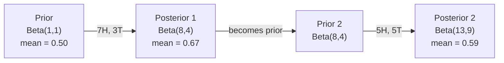

# نظریه بیز

> احتمال به آنچه انتظار دارید بستگی دارد. نظریه ی بیز به آنچه یاد می گیرید بستگی دارد.

**Type:** Build
**Language:**پیتون
**Prerequisites:** Phase 1, Lesson 06 (Probability Fundamentals)
**Time:** ~75 minutes

## اهداف یادگیری

- استفاده از نظریه بیز برای محاسبه احتمالات بعدی از پیشینه ها، احتمالات و شواهد
- یک طبقه بندی کننده متن بیز ساده را از ابتدا با نرم کردن Laplace و محاسبه فضای ثبت بسازید
- مقایسه تخمین MLE و MAP و توضیح دهید که چگونه MAP با تنظیم L2 مطابقت دارد
- پیاده سازی به روز رسانی بیزیان متوالی با استفاده از پیشینه های کنجوجات بتا-بینومیال برای آزمایش A / B

## مشکل

آزمایش پزشکی 99 درصد درست است، شما مثبت هستید چه شانس هایی دارید که واقعاً این بیماری را داشته باشید؟

اکثر مردم می گویند 99 درصد. پاسخ واقعی بستگی به اینکه بیماری چقدر نادر است دارد. اگر 1 نفر از هر 10 هزار نفر مبتلا باشد، نتیجه مثبت تنها 1% احتمال بیمار شدن را به شما می دهد. 99 درصد دیگر نتایج مثبت هشدارهای نادرستی از افراد سالم هستند.

این یک سوال فریب نیست. این نظریه ی بیز است. هر فیلتر اسپام، هر تشخیص پزشکی، هر مدل یادگیری ماشین که عدم اطمینان را مقداری می کند، از این استدلال دقیق استفاده می کند. شما با یک باور شروع می کنید. شما شواهد را می بینید. شما به روز می شوید.

اگر سیستم های ML را بدون درک این کار بسازید، نتایج مدل را اشتباه تفسیر می کنید، محدودیت های بد را تعیین می کنید و پیش بینی های بیش از حد مطمئن را ارسال می کنید.

## مفهوم

### از احتمال مشترک تا بایز

شما از درس 06 می دانید که احتمال مشروط:

```
P(A|B) = P(A and B) / P(B)
```

و همتقالي:

```
P(B|A) = P(A and B) / P(A)
```

هر دو عبارت با یک عدد مشترک هستند: P ((A و B) آنها را برابر کنید و تنظیم مجدد کنید:

```
P(A and B) = P(A|B) * P(B) = P(B|A) * P(A)

Therefore:

P(A|B) = P(B|A) * P(A) / P(B)
```

اين نظریه بايز است. چهار مقدار، يک معادله

### چهار قسمت

| Part | Name | What it means |
|------|------|---------------|
| P(A\|B) | Posterior | Your updated belief about A after seeing evidence B |
| P(B\|A) | Likelihood | How probable the evidence B is if A is true |
| P(A) | Prior | Your belief about A before seeing any evidence |
| P(B) | Evidence | Total probability of seeing B under all possibilities |

اصطلاح شواهد P ((B) به عنوان یک نرمال کننده عمل می کند. شما می توانید آن را با استفاده از قانون احتمال کامل گسترش دهید:

```
P(B) = P(B|A) * P(A) + P(B|not A) * P(not A)
```

### نمونه آزمایش پزشکی

یک بیماری در هر ۱۰ هزار نفر را تحت تاثیر قرار می دهد. تست ۹۹٪ دقیق است (۹۹٪ از بیماران را می گیرد، ۱٪ از زمان مثبت دروغین می دهد).

```
P(sick)          = 0.0001     (prior: disease is rare)
P(positive|sick) = 0.99       (likelihood: test catches it)
P(positive|healthy) = 0.01    (false positive rate)

P(positive) = P(positive|sick) * P(sick) + P(positive|healthy) * P(healthy)
            = 0.99 * 0.0001 + 0.01 * 0.9999
            = 0.000099 + 0.009999
            = 0.010098

P(sick|positive) = P(positive|sick) * P(sick) / P(positive)
                 = 0.99 * 0.0001 / 0.010098
                 = 0.0098
                 = 0.98%
```

کمتر از ۱ درصد. پیش رو غالب است. وقتی یک بیماری نادر است، حتی آزمایش های دقیق هم اغلب مثبت دروغین را تولید می کنند. به همین دلیل است که پزشکان آزمایش های تأیید را دستور می دهند.

### نمونه فیلتر اسپام

شما يه ایمیلي که شامل کلمه "لوتر" هستي دریافت مي كنيد.

```
P(spam)                = 0.3      (30% of email is spam)
P("lottery"|spam)      = 0.05     (5% of spam emails contain "lottery")
P("lottery"|not spam)  = 0.001    (0.1% of legitimate emails contain "lottery")

P("lottery") = 0.05 * 0.3 + 0.001 * 0.7
             = 0.015 + 0.0007
             = 0.0157

P(spam|"lottery") = 0.05 * 0.3 / 0.0157
                  = 0.955
                  = 95.5%
```

یک کلمه احتمال را از 30 درصد به 95 درصد تغییر می دهد. یک فیلتر اسپام واقعی باایز را در صدها کلمه همزمان اعمال می کند.

### بیز ساده: فرض استقلال

بیز ساده این را به ویژگی های متعدد گسترش می دهد با فرض اینکه همه ویژگی ها به صورت مشروط مستقل به دلیل کلاس هستند:

```
P(class | feature_1, feature_2, ..., feature_n)
  = P(class) * P(feature_1|class) * P(feature_2|class) * ... * P(feature_n|class)
    / P(feature_1, feature_2, ..., feature_n)
```

بخش "سخن" فرض استقلال است. در متن، رخ دادن کلمات مستقل نیستند ("نوی" و "یارک" مرتبط هستند). اما فرضیه به طرز شگفت انگیزی در عمل کار می کند زیرا طبقه بندی کننده فقط نیاز به رتبه بندی کلاس ها دارد، نه تولید احتمالات کالیبر شده.

از آنجا که نامگذاری برای همه کلاس ها یکسان است، می توانید آن را رد کنید و فقط شمارنده ها را مقایسه کنید:

```
score(class) = P(class) * product of P(feature_i | class)
```

کلاس با بالاترين نمره رو انتخاب کن

### تخمین احتمال حداکثر (MLE)

از اطلاعات آموزش چطور می توان از P ((صفحه ویژگی) استفاده کرد؟

```
P("free"|spam) = (number of spam emails containing "free") / (total spam emails)
```

این MLE است: ارزش های پارامتر را انتخاب کنید که داده های مشاهده شده را بیشتر احتمال می دهند. شما عملکرد احتمال را حداکثر می کنید، که برای شمارش های متمایز به فرکانس نسبی کاهش می یابد.

مشکل: اگر یک کلمه در هنگام آموزش هرگز در اسپم ظاهر نشود، MLE احتمال صفر را به آن می دهد. یک کلمه ناشناخته کل محصول را می کشد. این را با نرم کردن Laplace حل کنید:

```
P(word|class) = (count(word, class) + 1) / (total_words_in_class + vocabulary_size)
```

اضافه کردن 1 به هر شمارش تضمین می کند که هیچ احتمالی هرگز صفر نیست.

### حداکثر یک پس از (MAP)

MLE می پرسد: کدام پارامترها حداکثر P ((دست های پارامتر داده ها) را می کنند؟

MAP پرسید: کدام پارامترها حداکثر P  پارامترهای داده را دارند؟

با نظاره بازي:

```
P(parameters|data) proportional to P(data|parameters) * P(parameters)
```

MAP یک پیش فرض را بر روی پارامترهای خود اضافه می کند. اگر شما معتقدید پارامترها باید کوچک باشند، شما آن را به عنوان پیش فرض که مقادیر بزرگ را مجازات می کند، کدگذاری می کنید. این مشابه تنظیم L2 در ML است. مجازات "خرز" در بازگشت ریج به معنای واقعی کلمه یک پیش فرض گاوسی در وزنه ها است.

| Estimation | Optimizes | ML equivalent |
|------------|-----------|---------------|
| MLE | P(data\|params) | Unregularized training |
| MAP | P(data\|params) * P(params) | L2 / L1 regularization |

### بیزیان و فرکانست: تفاوت عملی

فرکانت شناسان پارامترها را به عنوان نامعلوم ثابت می دانند. آنها می پرسند: "اگر این آزمایش را بارها تکرار کنم، چه اتفاقی می افتد؟"

بهایسی ها به پارامترها به عنوان توزیع نگاه می کنند. آنها می پرسند: "با توجه به آنچه من مشاهده کرده ام، من در مورد پارامترها چه باور دارم؟"

برای ساخت سیستم های ML، تفاوت عملی:

| Aspect | Frequentist | Bayesian |
|--------|-------------|----------|
| Output | Point estimate | Distribution over values |
| Uncertainty | Confidence intervals (about procedure) | Credible intervals (about parameter) |
| Small data | Can overfit | Prior acts as regularization |
| Computation | Usually faster | Often requires sampling (MCMC) |

اکثر تولید ML فرکانس است (SGD، تخمین های نقطه). روش های بیزیایی در زمانی که نیاز به عدم اطمینان معیاری (قراردارهای پزشکی، سیستم های حیاتی ایمنی) یا زمانی که داده ها کمیاب است (تعلم چند شوت، شروع سرد) ، روشن می شوند.

### چرا تفکر بیزی برای ML مهم است

ارتباط عمیق تر از تشبيه است:

**Priors are regularization.**یک پیش از گاوسی در وزن L2 تنظیم است. یک پیش از Laplace L1 است. هر بار که یک اصطلاح تنظیم را اضافه می کنید، شما یک بیانیه بیزیایی در مورد آنچه که انتظار دارید از مقادیر پارامتر دارید، می کنید.

**Posteriors are uncertainty.**یک احتمال پیش بینی شده به شما چیزی در مورد اینکه مدل در این تخمین چقدر مطمئن است نمی گوید. روش های بیزیان به شما توزیع می دهند: "من فکر می کنم P(spam) بین 0.8 تا 0.95 است".

**Bayes updates are online learning.**پس از امروز به قبل فردا می شود. وقتی مدل شما داده های جدید را می بیند، به جای آموزش مجدد از ابتدا، باورهای خود را به طور تدریجی به روز می کند.

**Model comparison is Bayesian.**معیارهای اطلاعات بیزیانی (BIC) ، احتمال حاشیه ای و عوامل بیزیانی همه از استدلال بیزیانی برای انتخاب بین مدل ها بدون بیش از حد مناسب استفاده می کنند.

```figure
bayes-update
```

## آن را بسازید

### مرحله ی ۱: تابع نظریه ی بایز

```python
def bayes(prior, likelihood, false_positive_rate):
    evidence = likelihood * prior + false_positive_rate * (1 - prior)
    posterior = likelihood * prior / evidence
    return posterior

result = bayes(prior=0.0001, likelihood=0.99, false_positive_rate=0.01)
print(f"P(sick|positive) = {result:.4f}")
```

### مرحله دوم: طبقه بندی کننده بیز ساده

```python
import math
from collections import defaultdict

class NaiveBayes:
    def __init__(self, smoothing=1.0):
        self.smoothing = smoothing
        self.class_counts = defaultdict(int)
        self.word_counts = defaultdict(lambda: defaultdict(int))
        self.class_word_totals = defaultdict(int)
        self.vocab = set()

    def train(self, documents, labels):
        for doc, label in zip(documents, labels):
            self.class_counts[label] += 1
            words = doc.lower().split()
            for word in words:
                self.word_counts[label][word] += 1
                self.class_word_totals[label] += 1
                self.vocab.add(word)

    def predict(self, document):
        words = document.lower().split()
        total_docs = sum(self.class_counts.values())
        vocab_size = len(self.vocab)
        best_class = None
        best_score = float("-inf")
        for cls in self.class_counts:
            score = math.log(self.class_counts[cls] / total_docs)
            for word in words:
                count = self.word_counts[cls].get(word, 0)
                total = self.class_word_totals[cls]
                score += math.log((count + self.smoothing) / (total + self.smoothing * vocab_size))
            if score > best_score:
                best_score = score
                best_class = cls
        return best_class
```

احتمالات ثبت جلوگیری از جریان پایین. ضرب بسیاری از احتمالات کوچک باعث تولید اعداد بسیار کوچک برای نقطه شناور می شود. جمع کردن احتمالات ثبت ثابت و ریاضی معادل است.

### مرحله 3: آموزش در داده های اسپم

```python
train_docs = [
    "win free money now",
    "free lottery ticket winner",
    "claim your prize today free",
    "urgent offer free cash",
    "congratulations you won free",
    "meeting tomorrow at noon",
    "project update attached",
    "can we schedule a call",
    "quarterly report review",
    "lunch on thursday sounds good",
    "team standup notes attached",
    "please review the pull request",
]

train_labels = [
    "spam", "spam", "spam", "spam", "spam",
    "ham", "ham", "ham", "ham", "ham", "ham", "ham",
]

classifier = NaiveBayes()
classifier.train(train_docs, train_labels)

test_messages = [
    "free money waiting for you",
    "meeting rescheduled to friday",
    "you won a free prize",
    "please review the attached report",
]

for msg in test_messages:
    print(f"  '{msg}' -> {classifier.predict(msg)}")
```

### مرحله چهارم: احتمالات آموخته شده را بررسی کنید

```python
def show_top_words(classifier, cls, n=5):
    vocab_size = len(classifier.vocab)
    total = classifier.class_word_totals[cls]
    probs = {}
    for word in classifier.vocab:
        count = classifier.word_counts[cls].get(word, 0)
        probs[word] = (count + classifier.smoothing) / (total + classifier.smoothing * vocab_size)
    sorted_words = sorted(probs.items(), key=lambda x: x[1], reverse=True)
    for word, prob in sorted_words[:n]:
        print(f"    {word}: {prob:.4f}")

print("\nTop spam words:")
show_top_words(classifier, "spam")
print("\nTop ham words:")
show_top_words(classifier, "ham")
```

## ازش استفاده کن

کشتی های سکیت-علم آماده تولید پیاده سازی ساده بایز:

```python
from sklearn.feature_extraction.text import CountVectorizer
from sklearn.naive_bayes import MultinomialNB
from sklearn.metrics import classification_report

vectorizer = CountVectorizer()
X_train = vectorizer.fit_transform(train_docs)
clf = MultinomialNB()
clf.fit(X_train, train_labels)

X_test = vectorizer.transform(test_messages)
predictions = clf.predict(X_test)
for msg, pred in zip(test_messages, predictions):
    print(f"  '{msg}' -> {pred}")
```

همان الگوریتم. CountVectorizer به کار می رود توکن سازی و ساخت لغات. MultinomialNB به کار می رود صاف کردن و احتمال ثبت نام در داخل. نسخه شما از ابتدا همان کار را در 40 خط انجام می دهد.

## -باده

کلاس NaiveBayes که در اینجا ساخته شده است، کل خط تولید را نشان می دهد: توکن سازی، تخمین احتمال با صاف کردن Laplace، پیش بینی فضای ثبت.`code/bayes.py`بدون وابستگی فراتر از کتابخانه استاندارد پایتون اجرا می شود.

### پیشاپیش های متقابل

وقتی پیش و عقب به یک خانواده توزیع تعلق دارند، پیش رو به نام "مجموعه" نامیده می شود. این باعث می شود که به روز رسانی بیزیایی به صورت الجبری پاک باشد - شما یک شکل بسته بدون ادغام عددی دریافت می کنید.

| Likelihood | Conjugate Prior | Posterior | Example |
|-----------|----------------|-----------|---------|
| Bernoulli | Beta(a, b) | Beta(a + successes, b + failures) | Coin flip bias estimation |
| Normal (known variance) | Normal(mu_0, sigma_0) | Normal(weighted mean, smaller variance) | Sensor calibration |
| Poisson | Gamma(a, b) | Gamma(a + sum of counts, b + n) | Modeling arrival rates |
| Multinomial | Dirichlet(alpha) | Dirichlet(alpha + counts) | Topic modeling, language models |

چرا این مهم است: بدون پیشینه های همبستگی، شما نیاز به نمونه گیری مونت کارلو یا نتیجه گیری متغیر برای نزدیک شدن به پسینه دارید. با پیشینه های همبستگی، شما فقط دو عدد را به روز می کنید.

توزیع بتا رایج ترین مخلوط قبلی در عمل است. بتا ((a، b) اعتقاد شما را در مورد یک پارامتر احتمال نشان می دهد. متوسط a/(a+b است. هرچه a+b بزرگتر باشد، توزیع متمرکز تر (ثبات) می شود.

موارد ویژه ای از قبل:
- بيتا ((1,1) = یونیفورم. شما درباره پارامتر نظر نداري.
- بيتا ((10,10) = 0.5 بالا. شما به شدت معتقدید که پارامتر نزدیک به 0.5 است.
- بتا ((1, 10) = منحرف به سمت 0 شما فکر می کنید پارامتر کوچک است.

قانون تازه اي خيلي ساده است:

```
Prior:     Beta(a, b)
Data:      s successes, f failures
Posterior: Beta(a + s, b + f)
```

نه تکامل، نه نمونه برداری، فقط اضافه کردن

### به روز رسانی بعید

نتیجه گیری بیزیایی به طور طبیعی دنباله دار است. پس از امروز به قبل فردا می شود. این نحوه یادگیری سیستم های واقعی بدون پردازش مجدد تمام داده های تاریخی است.

مثال مشخصی: تخمین اینکه آیا یک سکه عادلانه است.

**Day 1: No data yet.**
با "بيتا" شروع کنيد، يک پيشواي يونيفورم.
- متوسط قبلی: 0.5
- پیشینه در عرض [0, 1]

**Day 2: Observe 7 heads, 3 tails.**
پسین = بتا ((1 + 7 ، 1 + 3) = بتا ((8, 4)
- متوسط بعد: 8/12 = 0.667
- شواهد نشان می دهد که سکه به سمت سر ها منحرف شده است

**Day 3: Observe 5 more heads, 5 more tails.**
از پسر ديروز به عنوان پيشر امروز استفاده کن
پسین = بتا ((8 + 5 ، 4 + 5) = بتا ((13, 9)
- متوسط بعد: 13/22 = 0.591
- داده های جدید متعادل تخمین را به سمت 0.5



ترتیب مشاهدات مهم نیست. Beta(1,1) با تمام 12 سر و 8 دم به یکباره به روز می شود Beta(13, 9) - نتیجه مشابه. به روز رسانی تسلسل و به روز رسانی دسته از ریاضیات معادل است. اما به روز رسانی تسلسل به شما اجازه می دهد در هر مرحله بدون ذخیره داده های خام تصمیم گیری کنید.

این پایه ی یادگیری آنلاین در سیستم های تولید ML است. نمونه گیری تامپسون برای غلو، سیستم های توصیه افزایشی و آشکارسازان نارسایی جریان همه از این الگوی استفاده می کنند.

### ارتباط با تست A/B

تست A/B نتیجه گیری بیزیایی در حال پنهان شدن است.

تنظیم: شما دو رنگ دکمه را آزمایش می کنید. ویرانت A (زرق) و ویرانت B (سبز). می خواهید بدانید کدام یک بیشتر کلیک می کند.

آزمایش بیزیانی A/B:

1. **Prior.**با Beta ((1,1) برای هر دو نوع شروع کنید.
2. **Data.**گزینه A: 50 کلیک از 1000 بازدید، گزینه B: 65 کلیک از 1000 بازدید
3. **Posteriors.**
   - A: بتا ((1 + 50 ، 1 + 950) = بتا ((51, 951) ، متوسط = 0.051
   - ب: بتا ((1 + 65، 1 + 935) = بتا ((66, 936). متوسط = 0,066
4. **Decision.**محاسبه P ((B > A) -- احتمال اینکه نرخ تبدیل واقعی B بالاتر از A است.

محاسبه P ((B > A) از نظر تحلیلی سخته اما مونت کارلو باعث می شه که ساده باشه

```
1. Draw 100,000 samples from Beta(51, 951)  -> samples_A
2. Draw 100,000 samples from Beta(66, 936)  -> samples_B
3. P(B > A) = fraction of samples where B > A
```

اگر P(B > A) > 0.95، شما نوع B را ارسال می کنید. اگر بین 0.05 و 0.95 باشد، شما اطلاعات را جمع آوری می کنید. اگر P(B > A) < 0.05، شما نوع A را ارسال می کنید.

مزایای تست A/B فرکانس:
- شما یک بیانیه احتمال مستقیم دریافت می کنید: "فرصت ۹۷٪ وجود دارد که B بهتر باشد"
- هيچ اشتباه در ارزش p، هيچ "مهميت رد فرضيه صفر"
- شما می توانید هر زمان نتایج را بدون افزایش نرخ مثبت دروغین بررسی کنید (هیچ "مشکل در جستجوی")
- شما می توانید دانش قبلی را شامل کنید (به عنوان مثال، آزمایش های قبلی نشان می دهد نرخ تبدیل معمولا 3-8٪ است)

| Aspect | Frequentist A/B | Bayesian A/B |
|--------|----------------|--------------|
| Output | p-value | P(B > A) |
| Interpretation | "How surprising is this data if A=B?" | "How likely is B better than A?" |
| Early stopping | Inflates false positives | Safe at any point (given a well-chosen prior and correctly specified model) |
| Prior knowledge | Not used | Encoded as Beta prior |
| Decision rule | p < 0.05 | P(B > A) > threshold |

## تمرینات

1. **Multiple tests.**یک بیمار دو بار در آزمایش های مستقل مثبت است (هر دو 99٪ دقیق هستند، شیوع بیماری 1 در 10،000 است). پس از هر دو آزمایش چه بیماری است؟ از پسین آزمایش اول به عنوان پیشین برای دوم استفاده کنید.

2. **Smoothing impact.**دسته بندی اسپام را با ارزش های صاف کردن 0.01، 0.1، 1.0 و 10.0 اجرا کنید. احتمالات کلمات بالا چگونه تغییر می کند؟ با صاف کردن=0 و کلمه ای که فقط در ژامون ظاهر می شود چه اتفاقی می افتد؟

3. **Add features.**کلاس NaiveBayes را گسترش دهید تا از طول پیام (قصر/طول) به عنوان یک ویژگی در کنار شمارش کلمات استفاده کنید. P(short dizerspam) و P(short dizerham) را از داده های آموزش تخمین بزنید و آن را به نمره پیش بینی بکشید.

4. **MAP by hand.**با توجه به داده های مشاهده شده (7 سر در 10 فلپ سکه) تخمین MAP از تعصب با استفاده از یک Beta ((2,2) پیش از آن را محاسبه کنید. آن را با تخمین MLE (7/10) مقایسه کنید.

## اصطلاحات کلیدی

| Term | What people say | What it actually means |
|------|----------------|----------------------|
| Prior | "My initial guess" | P(hypothesis) before observing evidence. In ML: the regularization term. |
| Likelihood | "How well the data fits" | P(evidence\|hypothesis). How probable the observed data is under a specific hypothesis. |
| Posterior | "My updated belief" | P(hypothesis\|evidence). The prior multiplied by the likelihood, then normalized. |
| Evidence | "The normalizing constant" | P(data) across all hypotheses. Ensures the posterior sums to 1. |
| Naive Bayes | "That simple text classifier" | A classifier that assumes features are independent given the class. Works well despite the false assumption. |
| Laplace smoothing | "Add-one smoothing" | Adding a small count to every feature to prevent zero probabilities from unseen data. |
| MLE | "Just use the frequencies" | Choose parameters that maximize P(data\|parameters). No prior. Can overfit with small data. |
| MAP | "MLE with a prior" | Choose parameters that maximize P(data\|parameters) * P(parameters). Equivalent to regularized MLE. |
| Log-probability | "Work in log space" | Using log(P) instead of P to avoid floating-point underflow when multiplying many small numbers. |
| False positive | "A wrong alarm" | The test says positive, but the true state is negative. Drives the base rate fallacy. |

## خواندن بیشتر

- [3Blue1Brown: Bayes' theorem](https://www.youtube.com/watch?v=HZGCoVF3YvM)- توضیح بصری با نمونه آزمایش پزشکی
- [Stanford CS229: Generative Learning Algorithms](https://cs229.stanford.edu/main_notes.pdf)- بیز ساده و ارتباط آن با مدل های تبعیض آمیز
- [Think Bayes](https://greenteapress.com/wp/think-bayes/)- کتاب رایگان، آمار بیزی با کد پایتون
- [scikit-learn Naive Bayes](https://scikit-learn.org/stable/modules/naive_bayes.html)- اجرای تولید و زمان استفاده از هر نوع
