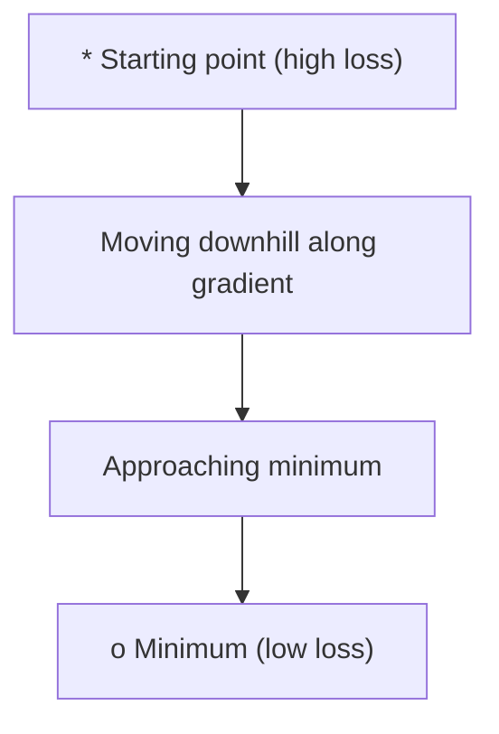
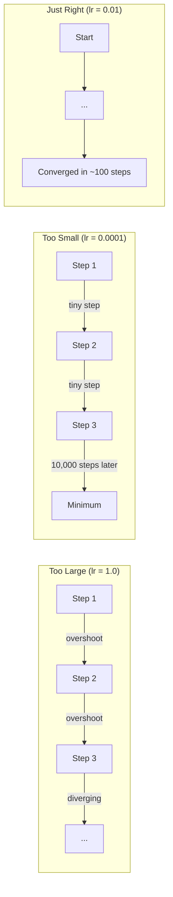
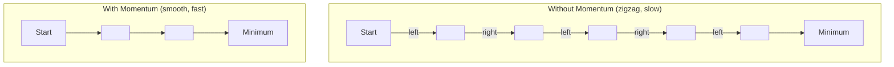
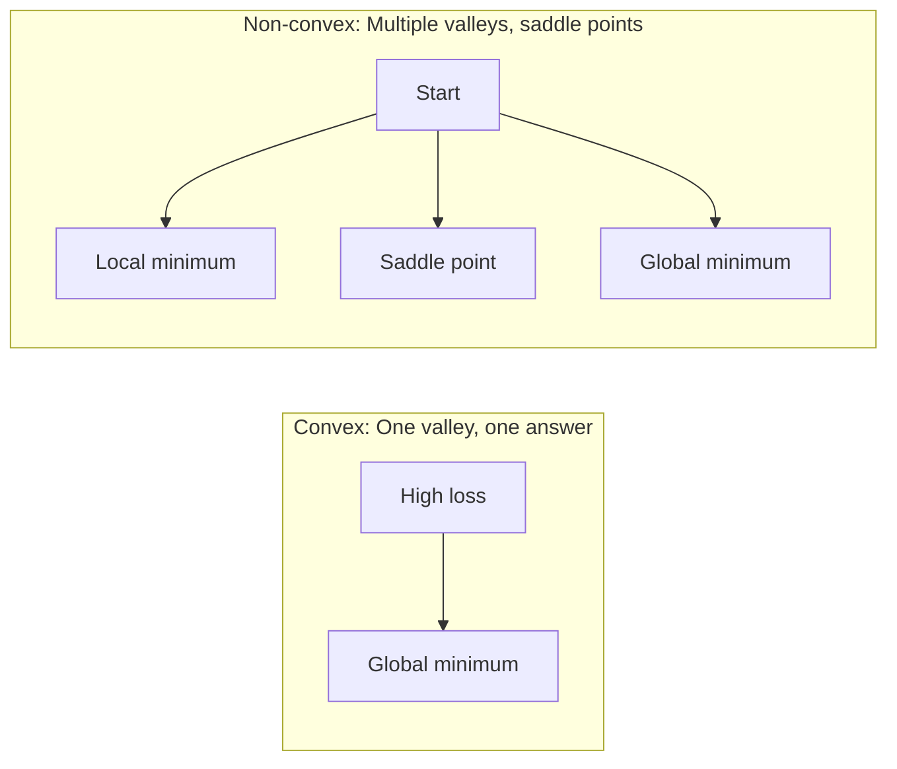
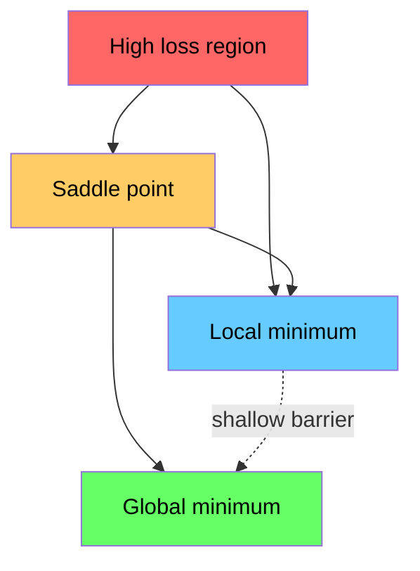

# بهینه سازی

> آموزش شبکه عصبی چیزی جز پیدا کردن پایین یک دره نیست.

**Type:** Build
**Language:**پیتون
**Prerequisites:** Phase 1, Lessons 04-05 (Derivatives, Gradients)
**Time:** ~75 minutes

## اهداف یادگیری

- پیاده سازی کاهش گرادینت وانیل، SGD با حرکت، و آدم از ابتدا
- مقایسه کنورژانس بهینه سازی در تابع روزنبروک و توضیح دهید که چرا آدام نرخ یادگیری در هر وزن را سازگار می کند
- تفاوت بین منظره های مخروط و غیر مخروط از دست دادن را تشخیص دهید و نقش نقاط صندلی در ابعاد بالا را توضیح دهید
- تنظیم برنامه های سرعت یادگیری (قضا مرحله ای، کاوش کاوش، گرم شدن) برای ثبات آموزش

## مشکل

شما یک تابع از دست دادن دارید. این به شما می گوید که مدل شما چقدر اشتباه است. شما دارای گرادینت هستید. آنها به شما می گویند که کدام جهت از دست دادن را بدتر می کند. حالا شما نیاز به یک استراتژی برای پیاده روی پایین تپه دارید.

رویکرد ساده است: حرکت در مقابل گرادینت. مرحله را با یک عدد به نام نرخ یادگیری اندازه گیری کنید. تکرار کنم این پایین رفتن گرادینت است و کار می کند. اما "کار" حذراتی داره سرعت یادگیری خیلی زیاد و شما کاملا از دره عبور می کنید، بین دیوارها قفسه می کنید. خیلی کوچک و تو به سمت جواب می رسی هزاران قدم غیر ضروری به نقطه ي سيله ضربه بزنيد و حرکت خود را متوقف مي كنيد، هر چند حداقل را پيدا نكرده ايد.

هر بهینه ساز در یادگیری عمیق پاسخ به همان سوال است: چگونه به پایین دره سریعتر و قابل اعتمادتر برسید؟

## مفهوم

### بهینه سازی چه معنایی دارد

بهینه سازی به دنبال یافتن ارزش های ورودی است که یک تابع را به حداقل می رساند (یا حداکثر می کند). در یادگیری ماشین، عملکرد از دست دادن است. ورودی ها وزن مدل است. آموزش بهینه سازی است.

```
minimize L(w) where:
  L = loss function
  w = model weights (could be millions of parameters)
```

### نشت درجه ای (وانیل)

ساده ترین بهینه ساز. تراز خسارت را نسبت به هر وزن محاسبه کنید. هر وزن را به سمت مخالف ترازش حرکت دهید. مرحله را با سرعت یادگیری مقیاس دهید.

```
w = w - lr * gradient
```

این کل الگوریتم است. یک خط.



### سرعت یادگیری: مهم ترین هائپر پارامتر

سرعت یادگیری اندازه گام را کنترل می کند. همه چیز را در مورد تقارب تعیین می کند.



هیچ فرمولی برای نرخ یادگیری مناسب وجود ندارد. شما آن را از طریق آزمایش پیدا می کنید. نقاط شروع مشترک: 0.001 برای آدم، 0.01 برای SGD با حرکت.

### SGD vs دسته vs دسته کوچک

کاهش گرادینت وانیل قبل از یک قدم، گرادینت را در کل مجموعه داده ها محاسبه می کند. این را گرادینت دسته نامیده می شود. این ثابت است اما کند است.

کاهش گرادینتی استوکاستیک (SGD) گرادینتی را در یک نمونه تصادفی واحد محاسبه می کند و بلافاصله گام می زند. این شور و صدا اما سریع است.

کاهش گرادینت دسته کوچک تفاوت را تقسیم می کند. گرادینت را بر روی یک دسته کوچک (32, 64, 128, 256 نمونه) محاسبه کنید، سپس مرحله کنید. این چیزی است که همه واقعا استفاده می کنند.

| Variant | Batch size | Gradient quality | Speed per step | Noise |
|---------|-----------|-----------------|---------------|-------|
| Batch GD | Entire dataset | Exact | Slow | None |
| SGD | 1 sample | Very noisy | Fast | High |
| Mini-batch | 32-256 | Good estimate | Balanced | Moderate |

صدا در SGD و ميني-باتچ يه بگ نيست. اين کمک ميکنه از حداقل هاي سطحی محلی و نقاط سياد فرار کنه.

### حرکت: توپ به پایین می چرخد

کاهش گرادینت وانیل فقط به گرادینت فعلی نگاه می کند. اگر گرادینت زیگزاک (معمولا در دره های باریک) باشد، پیشرفت کند است. پمنتوم این را با جمع آوری گرادینت های گذشته به یک اصطلاح سرعت تنظیم می کند.

```
v = beta * v + gradient
w = w - lr * v
```

این شبیه سازی: یک توپ که به پایین می چرخد، در هر ضربه متوقف نمی شود و دوباره شروع نمی شود. سرعت را در جهت های ثابت افزایش می دهد و نوسانات را کاهش می دهد.



`beta`(معمولا 0.9) کنترل می کند که چه مقدار تاریخچه را حفظ کنید. بیتا بالاتر به معنای حرکت بیشتر، مسیرهای صاف تر، اما واکنش آهسته تر به تغییرات جهت است.

### آدم: نرخ یادگیری سازگاری

وزن های مختلف نیاز به نرخ یادگیری متفاوت دارند. وزن هایی که به ندرت گرادیان بزرگ می گیرند باید گام های بزرگتر را بردارند. وزن هایی که به طور مداوم گرادیان بزرگ می گیرند باید گام های کوچکتر را بردارند.

آدم (تقدير لحظه سازي) دو چيز رو به وزن ميگيره:

1. اولین لحظه (m): متوسط جاری گرادینت ها (مانند حرکت)
2. لحظه دوم (v): متوسط جاری گرادینت های مربع (حجم گرادینت)

```
m = beta1 * m + (1 - beta1) * gradient
v = beta2 * v + (1 - beta2) * gradient^2

m_hat = m / (1 - beta1^t)    bias correction
v_hat = v / (1 - beta2^t)    bias correction

w = w - lr * m_hat / (sqrt(v_hat) + epsilon)
```

تقسیم توسط`sqrt(v_hat)`در این زمینه، وزن با گرادینت های بزرگ با یک عدد بزرگ (خطای موثر کوچک) تقسیم می شود. وزن با گرادینت های کوچک با یک عدد کوچک (خطای موثر بزرگ) تقسیم می شود. هر وزن نرخ یادگیری سازنده خود را می یابد.

دگرگونی های پیش فرض: `lr=0.001, beta1=0.9, beta2=0.999, epsilon=1e-8`این پیش فرض ها برای اکثر مشکلات خوب کار می کنند.

### برنامه های نرخ یادگیری

یک نرخ یادگیری ثابت یک سازش است. در اوایل آموزش، شما می خواهید گام های بزرگ را برای پیشرفت سریع. در اواخر آموزش، شما می خواهید گام های کوچک را برای تنظیم دقیق نزدیک به حداقل.

برنامه های مشترک:

| Schedule | Formula | Use case |
|----------|---------|----------|
| Step decay | lr = lr * factor every N epochs | Simple, manual control |
| Exponential decay | lr = lr_0 * decay^t | Smooth reduction |
| Cosine annealing | lr = lr_min + 0.5 * (lr_max - lr_min) * (1 + cos(pi * t / T)) | Transformers, modern training |
| Warmup + decay | Linear ramp up, then decay | Large models, prevents early instability |

### مخلوط با غیر مخلوط

یک تابع مخلوط حداقل یک تابع دارد.`f(x) = x^2`مخروط است.

عملکردهای از دست دادن شبکه عصبی غیر خم هستند. آنها دارای بسیاری از حداقل های محلی، نقاط سیله و مناطق صاف هستند.



در عمل، حداقل های محلی در شبکه های عصبی ابعاد بالا به ندرت مشکل هستند. اکثر حداقل های محلی دارای ارزش های از دست دادن نزدیک به حداقل جهانی هستند. نقاط سعد (در برخی جهت ها مسطح، در برخی دیگر منحنی) موانع واقعی هستند. حرکت و سر و صدا از دسته های کوچک به فرار از آنها کمک می کند.

### تصویربرداری از منظر از دست رفته

از دست دادن یک تابع از تمام وزن است. برای یک مدل با یک میلیون وزن، منظره از دست دادن در فضای 1,000،001 بعدی زندگی می کند. ما آن را با انتخاب دو جهت تصادفی در فضای وزن و نقشه برداری از دست دادن در طول این جهت ها، تولید یک سطح 2D.



حداقل های تیز کم کم کم کم کم کم کم کم کم کم کم کم کم کم کم کم کم کم کم کم کم کم کم کم کم کم کم کم کم کم کم کم کم کم کم کم کم کم کم کم کم کم کم کم کم کم کم کم کم کم کم کم کم کم کم کم کم کم کم کم کم کم کم کم کم کم کم کم کم کم کم کم کم کم کم کم کم کم کم کم کم کم کم کم کم کم کم کم کم کم کم کم کم کم کم کم کم کم کم کم کم کم کم کم کم کم کم کم کم کم کم کم کم کم کم کم کم کم کم کم کم کم کم کم کم کم کم کم کم کم کم کم کم کم کم کم کم کم کم کم کم کم کم کم کم کم کم کم کم کم کم کم کم کم کم کم کم کم کم کم کم کم کم کم کم کم کم کم کم کم کم کم کم کم کم کم کم کم کم کم کم کم کم کم کم کم کم کم کم کم کم کم کم کم کم کم کم کم کم کم کم کم کم کم کم کم کم کم کم کم کم کم کم کم کم کم کم کم کم کم کم کم کم کم کم کم کم کم کم کم کم کم کم کم کم کم کم کم کم کم کم کم کم کم کم کم کم کم کم کم کم کم کم کم کم کم کم کم کم کم کم کم کم کم کم کم کم کم کم کم کم کم کم کم کم کم کم کم کم کم کم کم کم کم کم کم کم کم کم کم کم کم کم کم کم کم کم کم کم کم کم کم کم کم کم کم کم کم کم کم کم کم کم کم کم کم کم کم کم کم کم کم کم کم کم کم کم کم کم کم کم کم کم کم کم کم کم کم کم کم کم کم کم کم کم کم کم کم کم کم کم کم کم کم کم کم کم کم کم کم کم کم کم کم کم کم کم کم کم کم کم کم کم کم کم کم کم کم کم کم کم کم کم کم کم کم کم کم کم کم کم کم کم کم کم کم کم کم کم کم کم کم کم کم کم کم کم کم کم کم کم کم کم کم کم کم کم کم کم کم کم کم کم کم کم کم کم کم کم کم کم کم کم کم کم کم کم کم کم کم کم کم کم کم کم کم کم کم کم کم کم کم کم کم کم کم کم کم کم کم کم کم کم کم کم کم کم کم کم کم کم کم کم کم کم کم کم کم کم کم کم کم کم کم کم کم کم کم کم کم کم کم کم کم کم کم کم کم کم کم کم کم کم کم کم کم کم

```figure
gradient-descent
```

## آن را بسازید

### مرحله ی ۱: یک عملکرد آزمون تعریف کنید

تابع روزنبروک یک معیار بهینه سازی کلاسیک است. حداقل آن در (1, 1) در داخل یک دره باریک منحنی است که پیدا کردن آسان است اما دنبال کردن دشوار است.

```
f(x, y) = (1 - x)^2 + 100 * (y - x^2)^2
```

```python
def rosenbrock(params):
    x, y = params
    return (1 - x) ** 2 + 100 * (y - x ** 2) ** 2

def rosenbrock_gradient(params):
    x, y = params
    df_dx = -2 * (1 - x) + 200 * (y - x ** 2) * (-2 * x)
    df_dy = 200 * (y - x ** 2)
    return [df_dx, df_dy]
```

### مرحله دوم: کاهش گرادینت وانیل

```python
class GradientDescent:
    def __init__(self, lr=0.001):
        self.lr = lr

    def step(self, params, grads):
        return [p - self.lr * g for p, g in zip(params, grads)]
```

### مرحله سوم: SGD با حرکت

```python
class SGDMomentum:
    def __init__(self, lr=0.001, momentum=0.9):
        self.lr = lr
        self.momentum = momentum
        self.velocity = None

    def step(self, params, grads):
        if self.velocity is None:
            self.velocity = [0.0] * len(params)
        self.velocity = [
            self.momentum * v + g
            for v, g in zip(self.velocity, grads)
        ]
        return [p - self.lr * v for p, v in zip(params, self.velocity)]
```

### مرحله چهارم: آدم

```python
class Adam:
    def __init__(self, lr=0.001, beta1=0.9, beta2=0.999, epsilon=1e-8):
        self.lr = lr
        self.beta1 = beta1
        self.beta2 = beta2
        self.epsilon = epsilon
        self.m = None
        self.v = None
        self.t = 0

    def step(self, params, grads):
        if self.m is None:
            self.m = [0.0] * len(params)
            self.v = [0.0] * len(params)

        self.t += 1

        self.m = [
            self.beta1 * m + (1 - self.beta1) * g
            for m, g in zip(self.m, grads)
        ]
        self.v = [
            self.beta2 * v + (1 - self.beta2) * g ** 2
            for v, g in zip(self.v, grads)
        ]

        m_hat = [m / (1 - self.beta1 ** self.t) for m in self.m]
        v_hat = [v / (1 - self.beta2 ** self.t) for v in self.v]

        return [
            p - self.lr * mh / (vh ** 0.5 + self.epsilon)
            for p, mh, vh in zip(params, m_hat, v_hat)
        ]
```

### مرحله 5: اجرا کنید و مقایسه کنید

```python
def optimize(optimizer, func, grad_func, start, steps=5000):
    params = list(start)
    history = [params[:]]
    for _ in range(steps):
        grads = grad_func(params)
        params = optimizer.step(params, grads)
        history.append(params[:])
    return history

start = [-1.0, 1.0]

gd_history = optimize(GradientDescent(lr=0.0005), rosenbrock, rosenbrock_gradient, start)
sgd_history = optimize(SGDMomentum(lr=0.0001, momentum=0.9), rosenbrock, rosenbrock_gradient, start)
adam_history = optimize(Adam(lr=0.01), rosenbrock, rosenbrock_gradient, start)

for name, history in [("GD", gd_history), ("SGD+M", sgd_history), ("Adam", adam_history)]:
    final = history[-1]
    loss = rosenbrock(final)
    print(f"{name:6s} -> x={final[0]:.6f}, y={final[1]:.6f}, loss={loss:.8f}")
```

تولید انتظار می رود: آدم سریع ترین حرکت را انجام می دهد. SGD با حرکت مسیر ساده تری را دنبال می کند. Vanilla GD در طول دره باریک پیشرفت کند.

## ازش استفاده کن

در عمل، از بهینه سازان PyTorch یا JAX استفاده کنید. آنها گروه های پارامتر، کاهش وزن، برش گرادینت و تسریع GPU را اداره می کنند.

```python
import torch

model = torch.nn.Linear(784, 10)

sgd = torch.optim.SGD(model.parameters(), lr=0.01, momentum=0.9)
adam = torch.optim.Adam(model.parameters(), lr=0.001)
adamw = torch.optim.AdamW(model.parameters(), lr=0.001, weight_decay=0.01)

scheduler = torch.optim.lr_scheduler.CosineAnnealingLR(adam, T_max=100)
```

قوانین عمومي:

- با آدم شروع کنید (lr=0.001) برای اکثر مشکلات بدون تنظیم کار می کند.
- وقتی به بهترین دقت نهایی نیاز دارید و می توانید تنظیمات بیشتری را پرداخت کنید، به SGD با حرکت (lr=0.01, حرکت=0.9) تغییر دهید.
- برای ترانسفورماتورها از AdamW (آدم با کاهش وزن قطع شده) استفاده کنید.
- همیشه از یک برنامه ی سرعت یادگیری برای آموزش های طولانی تر از چند دوره استفاده کنید.
- اگر آموزش غیر مستحکم باشد، سرعت یادگیری را کاهش دهید. اگر آموزش خیلی کند باشد، آن را افزایش دهید.

## -باده

این درس به شما کمک می کند تا بهترین بهینه سازی را انتخاب کنید.`outputs/prompt-optimizer-guide.md`. .

کلاس های بهینه سازی که اینجا ساخته شده در مرحله 3 دوباره ظاهر می شوند وقتی که ما یک شبکه عصبی را از ابتدا آموزش می دهیم.

## تمرینات

1. **Learning rate sweep.**کاهش گرادینت وانیل را در تابع روزنبروک با نرخ یادگیری [0.0001, 0.0005, 0.001, 0.005, 0.01] اجرا کنید. پس از 5000 مرحله برای هر یک از آنها، خروجی نهایی را نشان دهید یا چاپ کنید. بزرگترین نرخ یادگیری را پیدا کنید که هنوز هم به هم می رسد.

2. **Momentum comparison.**SGD را با ارزش های حرکت [0.0, 0.5, 0.9, 0.99] بر روی تابع روزنبروک اجرا کنید. از دست دادن در هر مرحله پیگیری کنید. کدام ارزش حرکت سریعتر به هم می پیوندد؟ کدام تخلیه می شود؟

3. **Saddle point escape.**تابع را تعریف کنید`f(x, y) = x^2 - y^2`با این حال، با این که این نوع مواد به صورت "گند" و "گند" و "آدم" در حال حرکت هستند، مقایسه کنید که کدام یک از آنها از نقطه "گند" فرار می کند.

4. **Implement learning rate decay.**یک جدول تعارفی از انحلال را به کلاس GradientDescent اضافه کنید: `lr = lr_0 * 0.999^step`.با هم تراز و بدون انحلال در تابع روزنبروک مقایسه کنید

## اصطلاحات کلیدی

| Term | What people say | What it actually means |
|------|----------------|----------------------|
| Gradient descent | "Go downhill" | Update weights by subtracting the gradient scaled by the learning rate. The most basic optimizer. |
| Learning rate | "Step size" | A scalar that controls how far each update moves the weights. Too large causes divergence. Too small wastes compute. |
| Momentum | "Keep rolling" | Accumulate past gradients into a velocity vector. Dampens oscillations and accelerates movement through consistent directions. |
| SGD | "Random sampling" | Stochastic gradient descent. Compute gradient on a random subset instead of the full dataset. Almost always means mini-batch SGD in practice. |
| Mini-batch | "A chunk of data" | A small subset of training data (32-256 samples) used to estimate the gradient. Balances speed and gradient accuracy. |
| Adam | "The default optimizer" | Adaptive Moment Estimation. Tracks per-weight running averages of gradients and squared gradients to give each weight its own learning rate. |
| Bias correction | "Fix the cold start" | Adam's first and second moments are initialized to zero. Bias correction divides by (1 - beta^t) to compensate during early steps. |
| Learning rate schedule | "Change lr over time" | A function that adjusts the learning rate during training. Large steps early, small steps late. |
| Convex function | "One valley" | A function where any local minimum is the global minimum. Gradient descent always finds it. Neural network losses are not convex. |
| Saddle point | "Flat but not a minimum" | A point where the gradient is zero but it is a minimum in some directions and a maximum in others. Common in high dimensions. |
| Loss landscape | "The terrain" | The loss function plotted over weight space. Visualized by slicing along two random directions. |
| Convergence | "Getting there" | The optimizer has reached a point where further steps do not meaningfully reduce the loss. |

## خواندن بیشتر

- [Sebastian Ruder: An overview of gradient descent optimization algorithms](https://ruder.io/optimizing-gradient-descent/)- بررسی جامع همه بهینه سازان اصلی
- [Why Momentum Really Works (Distill)](https://distill.pub/2017/momentum/)- تصویرسازی تعاملی از دینامیک حرکت
- [Adam: A Method for Stochastic Optimization (Kingma & Ba, 2014)](https://arxiv.org/abs/1412.6980)- کاغذ اصلی آدم، قابل خواندن و کوتاه
- [Visualizing the Loss Landscape of Neural Nets (Li et al., 2018)](https://arxiv.org/abs/1712.09913)- روزنامه ای که نشان داد حداقل های تیز و کم
