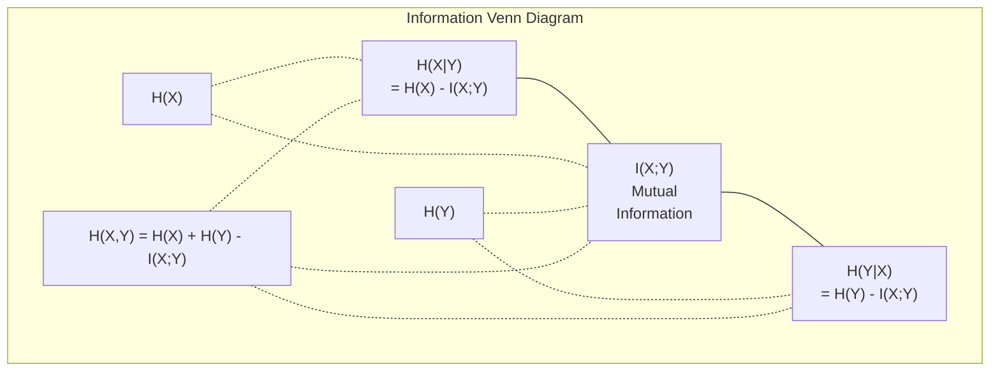

# نظریه اطلاعات

> تئوري اطلاعات اندازه ي تعجب ميکنه و تابع هاي از دست دادن بر روي آن ساخته شده

**Type:** Learn
**Language:**پیتون
**Prerequisites:** Phase 1, Lesson 06 (Probability)
**Time:** ~60 minutes

## اهداف یادگیری

- انتروپی، انتروپی متقاطع و انحراف KL را از ابتدا محاسبه کنید و رابطه آنها را توضیح دهید
- نتیجه گیری کنید که چرا کاهش از دست دادن آنترپی متقابل به حداکثر رساندن احتمال ثبت نام معادل است
- محاسبه اطلاعات متقابل بین ویژگی ها و یک هدف برای رتبه بندی اهمیت ویژگی
- پیچیدگی را به عنوان اندازه مفاهیم موثر که یک مدل زبان از آن انتخاب می کند توضیح دهید

## مشکل

تو زنگ ميزني`CrossEntropyLoss()`در هر مدل طبقه بندی که آموزش می دهید. در هر مقاله مدل زبان "مشکلیت" را می بینید. در مورد انحراف KL در VAEs، نشت و RLHF می خوانید. این مفاهیم قطع نشده نیستند. همه ایده های مشابهی هستند که کلاه های مختلف را پوشانند.

نظریه اطلاعات به شما زبان استدلال در مورد عدم اطمینان، فشرده سازی و پیش بینی می دهد. کلود شانون در سال 1948 برای حل مشکلات ارتباطی آن را اختراع کرد. معلوم است که آموزش یک شبکه عصبی یک مشکل ارتباطی است: مدل سعی دارد تا برچسب صحیح را از طریق یک کانال سر و صدا از وزنه های آموخته انتقال دهد.

این درس هر فرمول را از ابتدا می سازد تا ببینید از کجا آمده و چرا کار می کنند.

## مفهوم

### محتوای اطلاعاتی (مفاجأتی)

وقتی اتفاقی غیرممکن پیش می آید، اطلاعات بیشتری در آن می آید. یک سر پول فرود؟ تعجب آور نیست. یک برنده ی لاتری؟ بسیار شگفت انگیز.

محتوای اطلاعاتی یک رویداد با احتمال p:

```
I(x) = -log(p(x))
```

با استفاده از Log Base 2 به شما بت ها می دهد. با استفاده از Log Natural به شما nats می دهد. همان ایده، واحدهای مختلف.

```
Event              Probability    Surprise (bits)
Fair coin heads    0.5            1.0
Rolling a 6        0.167          2.58
1-in-1000 event    0.001          9.97
Certain event      1.0            0.0
```

.حوادث خاصی اطلاعات صفر را در بر دارند .تو قبلاً می دونستی که اتفاق می افتند

### انتروپیا (متوسط شگفتی)

انتروپیا، غافلگیری انتظار می رود که در تمام نتایج احتمالی توزیع اتفاق می افتد.

```
H(P) = -sum( p(x) * log(p(x)) )  for all x
```

یک سکه عادلانه حداکثر انترپی یک متغیر دوگانه را دارد: 1 بیت. یک سکه متحيز (99٪ سر) دارای انترپی پایین: 0.08 بیت. شما قبلاً می دانید چه اتفاقی می افتد، بنابراین هر فلپ به شما تقریباً هیچ چیزی نمی گوید.

```
Fair coin:    H = -(0.5 * log2(0.5) + 0.5 * log2(0.5)) = 1.0 bit
Biased coin:  H = -(0.99 * log2(0.99) + 0.01 * log2(0.01)) = 0.08 bits
```

انتروپيا ناپديد ناپديدي غير قابل کاهش در توزیع را اندازه مي گيرد.

### کراس انترپی (کار ضایعات که هر روز از آن استفاده می کنید)

کراس انترپی، تعجب متوسط را اندازه گیری می کند وقتی از توزیع Q برای کدگذاری رویدادهای واقعی که از توزیع P ناشی می شوند استفاده می کنید.

```
H(P, Q) = -sum( p(x) * log(q(x)) )  for all x
```

P توزیع واقعی (تسمک ها) است. Q پیش بینی های مدل شما است. اگر Q با P به طور کامل مطابقت داشته باشد، انترپی متقاطع برابر انترپی است. هر عدم مطابقت آن را بزرگتر می کند.

در طبقه بندی، P یک ویکتور یک گرم است (کلاس واقعی احتمال 1 دارد، همه چیز دیگر 0). این به سادگی اینترپی متقابل را به:

```
H(P, Q) = -log(q(true_class))
```

این کل فرمول از دست دادن کرس اینترپی برای طبقه بندی است. حداکثر احتمال پیش بینی شده از کلاس درست.

### KL تفاوت (مسافت بین توزیع ها)

انحراف KL اندازه گیری می کند که چقدر شگفتی اضافی از استفاده از Q به جای P دریافت می کنید.

```
D_KL(P || Q) = sum( p(x) * log(p(x) / q(x)) )  for all x
             = H(P, Q) - H(P)
```

اینترپی کراس اینترپی است که اینترپی به علاوه انحراف KL است. از آنجا که انتروپی توزیع واقعی ثابت است در طول تمرین، کاهش انتروپی کراس همان چیزی است که کاهش انحراف KL است. شما توزیع مدل خود را به سمت توزیع واقعی فشار می دهید.

انحراف KL متراکی نیست: D_KL  P  Q) != D_KL  Q  P)

### اطلاعات متقابل

اطلاعات متقابل اندازه گیری می کند که دانستن یک متغیر به شما در مورد دیگری چه چیزی می گوید.

```
I(X; Y) = H(X) - H(X|Y)
        = H(X) + H(Y) - H(X, Y)
```

اگر X و Y مستقل باشند، اطلاعات متقابل صفر است. دانستن یکی از آنها به شما چیزی در مورد دیگری نمی گوید. اگر آنها به طور کامل مرتبط باشند، اطلاعات متقابل برابر با انتروپی هر یک از متغیرها است.

در انتخاب ویژگی، اطلاعات متقابل بالا بین یک ویژگی و هدف به این معنی است که ویژگی مفید است. اطلاعات متقابل کم به این معنی است که شور است.

### انتروپی مشروط

H(Y در X) اندازه گیری می کند که بعد از مشاهده X چقدر عدم اطمینان در مورد Y باقی مانده است.

```
H(Y|X) = H(X,Y) - H(X)
```

دو تا حد:
- اگر X کاملاً Y را تعیین کند، پس H(Y ≠X) = 0. دانستن X تمام عدم اطمینان در مورد Y را از بین می برد. مثال: X = دمای در سانتیگراد، Y = دمای در فهرنهایت.
- اگر X چیزی در مورد Y به شما نمی گوید، پس H(YX (YX) = H(Y) است. دانستن X عدم اطمینان شما را در همه کاهش نمی دهد. مثال: X = فلپ سکه، Y = آب و هوا فردا.

انتروپی مشروط همیشه غیر منفی است و هرگز H(Y را فراتر نمی برد:

```
0 <= H(Y|X) <= H(Y)
```

در یادگیری ماشین، انتروپی مشروط در درختان تصمیم ظاهر می شود. در هر تقسیم، الگوریتم ویژگی X را انتخاب می کند که H  Y  X را به حداقل می رساند - ویژگی ای که بیشترین عدم اطمینان را در مورد برچسب Y حذف می کند.

### انتروپ مشترک

H ((X,Y) انتروپی توزیع مشترک X و Y با هم است.

```
H(X,Y) = -sum sum p(x,y) * log(p(x,y))   for all x, y
```

ویژگی اصلی:

```
H(X,Y) <= H(X) + H(Y)
```

برابری زمانی برقرار می شود که X و Y مستقل باشند. اگر اطلاعات را به اشتراک بگذارند، انتروپی مشترک کمتر از مجموع انتروپی های فردی است. انتروپی "متفق" دقیقاً اطلاعات متقابل است.



روابط:
- H(X,Y) = H(X) + H(Y
- X;Y) = H(X) - H(IX
- H(X,Y) = H(X) + H(Y) - I(X;Y)

### اطلاعات متقابل (زوردی عمیق)

اطلاعات متقابل I  X Y) مقدار می دهد که دانستن یک متغیر تا چه اندازه عدم اطمینان در مورد دیگری را کاهش می دهد.

```
I(X;Y) = H(X) - H(X|Y)
       = H(Y) - H(Y|X)
       = H(X) + H(Y) - H(X,Y)
       = sum sum p(x,y) * log(p(x,y) / (p(x) * p(y)))
```

خواص:
- I ((X;Y) >=0 همیشه. شما هرگز با مشاهده چیزی اطلاعات را از دست نمی دهید.
- I(X;Y) = 0 اگر و فقط اگر X و Y مستقل باشند.
- I(X;Y) = I(Y;X) این همتایی است، برخلاف انحراف KL.
- I  X = H  X) یک متغیر تمام اطلاعات خود را با خود به اشتراک می گذارد.

**Mutual information for feature selection.**در ML، شما ویژگی هایی را می خواهید که در مورد هدف اطلاعات بخش باشند. اطلاعات متقابل به شما یک روش اصول برای رتبه بندی ویژگی ها می دهد:

1. برای هر ویژگی X_i، محاسبه I(X_i؛ Y) که Y متغیر هدف است.
2. رتبه بندی از نظر نمره MI
3. .تازهاي بالا رو نگه دار

این برای هر رابطه ای بین ویژگی و هدف کار می کند - خطی، غیر خطی، یکمناطیسی یا نه. ارتباط فقط روابط خطی را ضبط می کند. MI همه چیز را ضبط می کند.

| Method | Detects | Computational cost | Handles categorical? |
|--------|---------|-------------------|---------------------|
| Pearson correlation | Linear relationships | O(n) | No |
| Spearman correlation | Monotonic relationships | O(n log n) | No |
| Mutual information | Any statistical dependency | O(n log n) with binning | Yes |

### نرم کردن برچسب و کراس انترپی

طبقه بندی استاندارد از اهداف سخت استفاده می کند: [0, 0, 1, 0]. کلاس واقعی احتمال 1 را به دست می آورد، همه چیز دیگر به دست می آید 0.

```
soft_target = (1 - epsilon) * hard_target + epsilon / num_classes
```

با ایپسایلون = 0.1 و 4 کلاس:
- هدف سخت: [0, 0, 1, 0]
- هدف نرم: [0.025, 0.025, 0.925, 0.025]

از دیدگاه نظریه اطلاعات، صاف کردن برچسب، انتروپی توزیع هدف را افزایش می دهد. هدف های سخت یک گرم دارای انتروپی 0 هستند - هیچ عدم قطعیت وجود ندارد. هدف های نرم دارای انتروپی مثبت هستند.

چرا این کمک می کند:
- از حرکت الگوی به ارزش های شدید جلوگیری می کند (لگ های نامحدود برای مطابقت کامل با یک هدف یک گرم در زیر اینتروپی متقابل مورد نیاز است)
- به عنوان تنظیم کننده عمل می کند: مدل نمی تواند 100٪ مطمئن باشد
- کالیبر را بهبود می بخشد: احتمالات پیش بینی شده بهتر منعکس کننده عدم اطمینان واقعی است
- فاصله بین آموزش و رفتار نتیجه گیری را کاهش می دهد

از دست دادن انترپی در حال نرم کردن برچسب به این شکل می شود:

```
L = (1 - epsilon) * CE(hard_target, prediction) + epsilon * H_uniform(prediction)
```

اصطلاح دوم پیش بینی هایی را مجازات می کند که از یکسانی دور هستند -- یک تنظیم مستقیم در مورد اعتماد.

### چرا کراس انترپی از دست دادن طبقه بندی است

سه دیدگاه، نتیجه ی مشابه

**Information theory view.**کراس انترپی اندازه گیری می کند که چقدر بیت از دست می دهید با استفاده از توزیع مدل شما به جای توزیع واقعی. به حداقل رساندن آن باعث می شود مدل شما موثرترین کدگر واقعیت باشد.

**Maximum likelihood view.**برای نمونه های آموزش N با کلاس های واقعی y_i:

```
Likelihood     = product( q(y_i) )
Log-likelihood = sum( log(q(y_i)) )
Negative log-likelihood = -sum( log(q(y_i)) )
```

این خط آخر، از دست دادن انترپی کراس است. حداقل کردن انترپی کراس = حداکثر کردن احتمال داده های آموزش تحت مدل شما.

**Gradient view.**گرادینت اینترپی متقابل با توجه به لوگیت ها ساده است (پیش بینی - درست). تمیز، پایدار و سریع برای محاسبه است. به همین دلیل این به طور کامل با softmax همبستگی می کند.

### بیتس در مقابل ناتس

تنها تفاوت در اساس چوب است.

```
log base 2   -> bits      (information theory tradition)
log base e   -> nats      (machine learning convention)
log base 10  -> hartleys  (rarely used)
```

1 nat = 1/ln(2) بیت = 1.4427 بیت. PyTorch و TensorFlow به طور پیش فرض از log طبیعی (nats) استفاده می کنند.

### گیج و گیج

تعصب نمایه ی انترپی متقابل است. این به شما می گوید که تعداد واقعی از گزینه های به همان اندازه احتمالی که مدل بین آنها نامشخص است.

```
Perplexity = 2^H(P,Q)   (if using bits)
Perplexity = e^H(P,Q)   (if using nats)
```

یک مدل زبان با پیچیدگی 50 به طور متوسط، به همان اندازه گیج کننده است که انگار باید از 50 توکن بعدی یکسانی انتخاب کند. پایین تر بهتر است.

GPT-2 در مقادیر مشترک، در حدود 30 درجه حیرانی را به دست آورد. مدل های مدرن برای دامنه های به خوبی نشان داده شده در اعداد واحد هستند.

```figure
entropy-kl
```

## آن را بسازید

### مرحله ی ۱: محتوای اطلاعات و انترپی

```python
import math

def information_content(p, base=2):
    if p <= 0 or p > 1:
        return float('inf') if p <= 0 else 0.0
    return -math.log(p) / math.log(base)

def entropy(probs, base=2):
    return sum(
        p * information_content(p, base)
        for p in probs if p > 0
    )

fair_coin = [0.5, 0.5]
biased_coin = [0.99, 0.01]
fair_die = [1/6] * 6

print(f"Fair coin entropy:   {entropy(fair_coin):.4f} bits")
print(f"Biased coin entropy: {entropy(biased_coin):.4f} bits")
print(f"Fair die entropy:    {entropy(fair_die):.4f} bits")
```

### مرحله دوم: انترپی کراس و انحراف KL

```python
def cross_entropy(p, q, base=2):
    total = 0.0
    for pi, qi in zip(p, q):
        if pi > 0:
            if qi <= 0:
                return float('inf')
            total += pi * (-math.log(qi) / math.log(base))
    return total

def kl_divergence(p, q, base=2):
    return cross_entropy(p, q, base) - entropy(p, base)

true_dist = [0.7, 0.2, 0.1]
good_model = [0.6, 0.25, 0.15]
bad_model = [0.1, 0.1, 0.8]

print(f"Entropy of true dist:     {entropy(true_dist):.4f} bits")
print(f"CE (good model):          {cross_entropy(true_dist, good_model):.4f} bits")
print(f"CE (bad model):           {cross_entropy(true_dist, bad_model):.4f} bits")
print(f"KL divergence (good):     {kl_divergence(true_dist, good_model):.4f} bits")
print(f"KL divergence (bad):      {kl_divergence(true_dist, bad_model):.4f} bits")
```

### مرحله سوم: کراس انترپی به عنوان از دست دادن طبقه بندی

```python
def softmax(logits):
    max_logit = max(logits)
    exps = [math.exp(z - max_logit) for z in logits]
    total = sum(exps)
    return [e / total for e in exps]

def cross_entropy_loss(true_class, logits):
    probs = softmax(logits)
    return -math.log(probs[true_class])

logits = [2.0, 1.0, 0.1]
true_class = 0

probs = softmax(logits)
loss = cross_entropy_loss(true_class, logits)

print(f"Logits:      {logits}")
print(f"Softmax:     {[f'{p:.4f}' for p in probs]}")
print(f"True class:  {true_class}")
print(f"Loss:        {loss:.4f} nats")
print(f"Perplexity:  {math.exp(loss):.2f}")
```

### مرحله 4: انترپی متقابل برابر با احتمال ثبت منفی است

```python
import random

random.seed(42)

n_samples = 1000
n_classes = 3
true_labels = [random.randint(0, n_classes - 1) for _ in range(n_samples)]
model_logits = [[random.gauss(0, 1) for _ in range(n_classes)] for _ in range(n_samples)]

ce_loss = sum(
    cross_entropy_loss(label, logits)
    for label, logits in zip(true_labels, model_logits)
) / n_samples

nll = -sum(
    math.log(softmax(logits)[label])
    for label, logits in zip(true_labels, model_logits)
) / n_samples

print(f"Cross-entropy loss:      {ce_loss:.6f}")
print(f"Negative log-likelihood: {nll:.6f}")
print(f"Difference:              {abs(ce_loss - nll):.2e}")
```

### مرحله 5: اطلاعات متقابل

```python
def mutual_information(joint_probs, base=2):
    rows = len(joint_probs)
    cols = len(joint_probs[0])

    margin_x = [sum(joint_probs[i][j] for j in range(cols)) for i in range(rows)]
    margin_y = [sum(joint_probs[i][j] for i in range(rows)) for j in range(cols)]

    mi = 0.0
    for i in range(rows):
        for j in range(cols):
            pxy = joint_probs[i][j]
            if pxy > 0:
                mi += pxy * math.log(pxy / (margin_x[i] * margin_y[j])) / math.log(base)
    return mi

independent = [[0.25, 0.25], [0.25, 0.25]]
dependent = [[0.45, 0.05], [0.05, 0.45]]

print(f"MI (independent): {mutual_information(independent):.4f} bits")
print(f"MI (dependent):   {mutual_information(dependent):.4f} bits")
```

## ازش استفاده کن

همان مفاهیم با استفاده از NumPy، روش شما آنها را در عمل استفاده می کنید:

```python
import numpy as np

def np_entropy(p):
    p = np.asarray(p, dtype=float)
    mask = p > 0
    result = np.zeros_like(p)
    result[mask] = p[mask] * np.log(p[mask])
    return -result.sum()

def np_cross_entropy(p, q):
    p, q = np.asarray(p, dtype=float), np.asarray(q, dtype=float)
    mask = p > 0
    return -(p[mask] * np.log(q[mask])).sum()

def np_kl_divergence(p, q):
    return np_cross_entropy(p, q) - np_entropy(p)

true = np.array([0.7, 0.2, 0.1])
pred = np.array([0.6, 0.25, 0.15])
print(f"Entropy:    {np_entropy(true):.4f} nats")
print(f"Cross-ent:  {np_cross_entropy(true, pred):.4f} nats")
print(f"KL div:     {np_kl_divergence(true, pred):.4f} nats")
```

از نو چه ساختي؟`torch.nn.CrossEntropyLoss()`حالا می دانید که چرا در طول تمرین، از دست دادن کاهش می یابد: توزیع پیش بینی شده مدل شما به توزیع واقعی نزدیک می شود، که در ناتس اطلاعات تلف شده اندازه گیری می شود.

## تمرینات

1. در این قسمت، اینترپی الفبا را با فرض توزیع یکسانی (26 حرف) محاسبه کنید. سپس با استفاده از فرکانس های واقعی حرف آن را تخمین بزنید. کدام یک بالاتر است و چرا؟

2. یک مدل برای نمونه با کلاس واقعی 1، logits [5.0, 2.0, 0.5] را خارج می کند. از دست از دست دادن آنترپی را محاسبه کنید و سپس با `cross_entropy_loss`چه جور لوجیت ها صفر از دست دادن را به دست می آورند؟

3. نشان دهید که انحراف KL متناظر نیست. دو توزیع P و Q را انتخاب کنید و D_KL_P_K  Q) و DL Q  P را محاسبه کنید. توضیح دهید که چرا آنها متفاوت هستند.

4. یک تابع ایجاد کنید که پیچیدگی را برای یک سری پیش بینی های توکن محاسبه کند. با توجه به یک لیست از زوج های (true_token_index، predicted_logits) ، پیچیدگی ترتیب را بازگردانید.

## اصطلاحات کلیدی

| Term | What people say | What it actually means |
|------|----------------|----------------------|
| Information content | "Surprise" | The number of bits (or nats) needed to encode an event: -log(p) |
| Entropy | "Randomness" | The average surprise across all outcomes of a distribution. Measures irreducible uncertainty. |
| Cross-entropy | "The loss function" | Average surprise when using model distribution Q to encode events from true distribution P. |
| KL divergence | "Distance between distributions" | Extra bits wasted by using Q instead of P. Equals cross-entropy minus entropy. Not symmetric. |
| Mutual information | "How related are X and Y" | Reduction in uncertainty about X from knowing Y. Zero means independent. |
| Softmax | "Turn logits into probabilities" | Exponentiate and normalize. Maps any real-valued vector to a valid probability distribution. |
| Perplexity | "How confused the model is" | Exponential of cross-entropy. The effective vocabulary size the model is choosing from at each step. |
| Bits | "Shannon's unit" | Information measured with log base 2. One bit resolves one fair coin flip. |
| Nats | "ML's unit" | Information measured with natural log. Used by PyTorch and TensorFlow by default. |
| Negative log-likelihood | "NLL loss" | Identical to cross-entropy loss for one-hot labels. Minimizing it maximizes the probability of correct predictions. |

## خواندن بیشتر

- [Shannon 1948: A Mathematical Theory of Communication](https://people.math.harvard.edu/~ctm/home/text/others/shannon/entropy/entropy.pdf)- کاغذ اصلی، هنوز قابل خواندن
- [Visual Information Theory (Chris Olah)](https://colah.github.io/posts/2015-09-Visual-Information/)- بهترین توضیح بصری از انترپی و انحراف KL
- [PyTorch CrossEntropyLoss docs](https://pytorch.org/docs/stable/generated/torch.nn.CrossEntropyLoss.html)- چگونه چارچوب آنچه که شما درست ساخته اید را اجرا می کند
