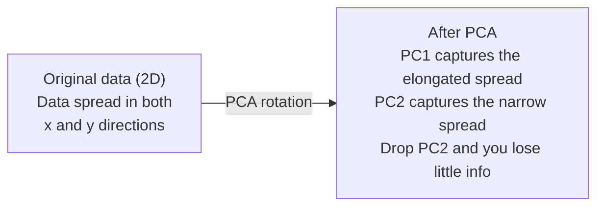

# کاهش ابعاد

> داده های بالا ابعاد ساختار دارند. شما آن را با نگاه کردن از زاویه درست پیدا می کنید.

**Type:** Build
**Language:**پیتون
**Prerequisites:** Phase 1, Lessons 01 (Linear Algebra Intuition), 02 (Vectors, Matrices & Operations), 03 (Eigenvalues & Eigenvectors), 06 (Probability & Distributions)
**Time:** ~90 minutes

## اهداف یادگیری

- اجرای PCA از ابتدا: داده های مرکز، محاسبه ماتریس کوویاریانس، خود ساخت و پروژه
- استفاده از نسبت تفاوت توضیح داده شده و روش لمب برای انتخاب تعداد اجزای اصلی
- مقایسه PCA، t-SNE، و UMAP برای تماشای ارقام MNIST در 2D و توضیح tradeoff های آنها
- استفاده از PCA هسته با هسته RBF برای جدا کردن ساختار داده های غیر خطی که PCA استاندارد نمی تواند با آن کار کند

## مشکل

شما مجموعه داده ای با 784 ویژگی در هر نمونه دارید. شاید این مقدار پیکسل های ارقام دست نوشته باشد. شاید این سطوح بیان ژن باشد. شاید این علائم رفتار کاربر باشد. شما نمی توانید 784 ابعاد را تصور کنید. شما نمی توانید آنها را نقشه برداری کنید. شما حتی نمی توانید در مورد آنها فکر کنید.

اما اکثر این ویژگی های 784 اضافی هستند. اطلاعات واقعی در سطح بسیار کوچکتر زندگی می کنند. یک "7" دست نوشته به 784 شماره مستقل برای توصیف آن نیاز ندارد. به چند مورد نیاز دارد: زاویه ضربه، طول قطب عبور، چقدر به سمت آن می کند. بقیه صدای است.

کاهش ابعاد، سطح کوچک تری را پیدا می کند. داده های 784 ابعاد شما را می گیرد و آن را به ابعاد 2، 10 یا 50 فشرده می کند در حالی که ساختار مهم را حفظ می کند.

## مفهوم

### لعنت ابعاد

فضاهای بالا ابعاد غیرقابل درک هستند. سه چیز با رشد ابعاد شکسته می شوند.

**Distance becomes meaningless.**در ابعاد بالا، فاصله بین هر دو نقطه تصادفی به همان مقدار نزدیک می شود. اگر هر نقطه تقریباً همان فاصله از هر نقطه دیگر باشد، جستجوی نزدیک ترین همسایه کار نمی کند.

```
Dimension    Avg distance ratio (max/min between random points)
2            ~5.0
10           ~1.8
100          ~1.2
1000         ~1.02
```

**Volume concentrates in corners.**یک واحد هیپرکوب در ابعاد d دارای گوشه های 2d است. در ابعاد 100، تقریبا تمام حجم در گوشه ها، دور از مرکز است. نقاط داده به حاشیه ها گسترش می یابد و مدل های شما به دنبال داده های داخل هستند.

**You need exponentially more data.**برای حفظ تراکم نمونه ها در یک فضا، رفتن از 2D به 20D به این معنی است که شما نیاز به 10^18 برابر اطلاعات بیشتری دارید. شما هرگز به اندازه کافی ندارید. کاهش ابعاد، تراکم داده را به چیزی قابل عمل می رساند.

### PCA: مسیرهای مهم را پیدا کنید

تجزیه و تحلیل اصلی اجزای (PCA) محور هایی را پیدا می کند که بیشترین تغییرات داده های شما را دارد. این محور سیستم هماهنگی شما را به طوری می چرخد که محور اول بیشترین تفاوت را ضبط می کند، محور دوم بیشترین تفاوت را ضبط می کند و غیره.

الگوریتم:

```
1. Center the data        (subtract the mean from each feature)
2. Compute covariance     (how features move together)
3. Eigendecomposition     (find the principal directions)
4. Sort by eigenvalue     (biggest variance first)
5. Project               (keep top k eigenvectors, drop the rest)
```

چرا خود ساخت؟ ماتریس همتایی و نیمه تعریف مثبت است. خود بردار های آن جهت های ارتگونال در فضای ویژگی هستند. ارزش های خود نشان می دهد که هر جهت چقدر تفاوت را ضبط می کند. خود بردار با بزرگترین نقاط ارزش خود در امتداد جهت حداکثر تفاوت.



- **Before PCA:**ابر داده ها به صورت دیآگونال در دو محور x و y پخش می شود
- **After PCA:**سیستم هماهنگی به گونه ای چرخش می شود که PC1 با جهت حداکثر انحراف (تراکم طولانی) و PC2 با جهت حداقل انحراف (تراکم تنگ) هماهنگ باشد.
- **Dimensionality reduction:**از دست دادن PC2 داده ها را به PC1 منتقل می کند، اطلاعات بسیار کمی را از دست می دهد

### نسبت تفاوت توضیح داده شده

هر جزء اصلی بخشی از کل تفاوت را ضبط می کند. نسبت تفاوت توضیح داده شده به شما می گوید چقدر.

```
Component    Eigenvalue    Explained ratio    Cumulative
PC1          4.73          0.473              0.473
PC2          2.51          0.251              0.724
PC3          1.12          0.112              0.836
PC4          0.89          0.089              0.925
...
```

وقتی که تفاوت توضیح داده شده ی تجمعی به 0.95 برسد، می دانید که بسیاری از اجزای 95 درصد اطلاعات را ضبط می کنند. همه چیز بعد از آن بیشتر شور است.

### انتخاب تعداد اجزای

سه استراتژی:

1. **Threshold.**اجزای کافی را نگه دارید تا 90 تا 95 درصد از تفاوت را توضیح دهد.
2. **Elbow method.**نقشه به اختلافات هر قطعه توضیح داده شده دنبال یه سقوط حاد
3. **Downstream performance.**از PCA به عنوان پردازش پیش از انجامش استفاده کن. k را پاک کن و دقت مدلت را اندازه گیری کن. بهترین k هر جا که سطح بالایی دقت باشد.

### ت-SNE: حفظ محله ها

t-SNE (T-SNE) برای تماشای طراحی شده است. این داده های ابعاد بالا را به 2D (یا 3D) نقشه می زند و در عین حال حفظ می کند که کدام نقاط در نزدیکی یکدیگر هستند.

اینوژن: در فضای اصلی، توزیع احتمال را بر روی جفت نقاط بر اساس فاصله آنها محاسبه کنید. نقاط نزدیک احتمال بالا را دریافت می کنند. نقاط دور احتمال پایین را دریافت می کنند. سپس یک ترتیب 2D را پیدا کنید که توزیع احتمال مشابه برقرار باشد. نقاط که در ابعاد 784 همسایه بودند، همسایه در 2D باقی می مانند.

خواص اصلی t-SNE:
- غیر خطی، می تونه انواع پیچیده ای رو که PCA نمی تونه رو باز کنه
- .استوکاستیک .مختلفهاي اجرا طرح هاي مختلف رو ميده
- پارامتر حیرانی کنترل می کند که چند همسایه باید در نظر گرفته شوند (متناسب محدوده: 5-50).
- فاصله بین کلستر ها در محصول معنی دار نیست فقط کلستر ها خودشان معنی دار هستند.
- در مجموعه داده های بزرگ آهسته.

### UMAP: ساختار جهانی سریعتر و بهتر

رویکرد و پروژکتور یکنواخت (UMAP) به طور مشابه t-SNE کار می کند اما با دو مزیت:
- سریعتر. به جای محاسبه تمام فاصله های جفتی از گراف نزدیک ترین همسایه استفاده می کند.
- ساختار جهانی بهتر. موقعیت های نسبی خوشه ها در تولید به طور کلی نسبت به t-SNE معنی بیشتری دارد.

UMAP یک نمودار با وزن در فضای بالا (تمثیل توپولوژیک مبهم) را ایجاد می کند و سپس یک طرح با ابعاد پایین را پیدا می کند که این نمودار را به خوبی حفظ می کند.

پارامترهای کلیدی:
- `n_neighbors`: چند همسایه ساختار محلی را تعریف می کنند (مانند پیچیدگی). ارزش های بالاتر ساختار جهانی را حفظ می کنند.
- `min_dist`در نتیجه، مقدار پایین تر، مجموعه های تراکم شده را ایجاد می کند.

### چه زمانی باید از کدام استفاده شود؟

| Method | Use case | Preserves | Speed |
|--------|----------|-----------|-------|
| PCA | Preprocessing before training | Global variance | Fast (exact), works on millions of samples |
| PCA | Quick exploratory visualization | Linear structure | Fast |
| t-SNE | Publication-quality 2D plots | Local neighborhoods | Slow (< 10k samples ideal) |
| UMAP | 2D visualization at scale | Local + some global structure | Medium (handles millions) |
| PCA | Feature reduction for models | Variance-ranked features | Fast |
| t-SNE / UMAP | Understanding cluster structure | Cluster separation | Medium to slow |

قانون عمومي: استفاده از PCA برای پردازش پیش از انجام و فشرده سازی داده ها. استفاده از t-SNE یا UMAP هنگامی که شما نیاز به تصویربرداری ساختار در 2D دارید.

### PCA هسته

PCA استاندارد فرعی خطی را پیدا می کند. سیستم هماهنگی شما را چرخش می کند و محورها را می کند. اما اگر داده ها روی یک متنوع غیر خطی قرار داشته باشند چه؟ یک دایره در 2D نمی تواند توسط هیچ خطی جدا شود. PCA استاندارد کمک نخواهد کرد.

PCA هسته ای PCA را در یک فضای ویژگی های بالا بعدی که توسط یک تابع هسته ای ایجاد می شود، بدون محاسبه صریح همبستگی ها در این فضا اعمال می کند. این ترفند هسته ای است - همان ایده پشت SVM.

الگوریتم:
1. ماتریس هسته K را محاسبه کنید که K_ij = k(x_i، x_j)
2. مرکز ماتریک هسته در فضای ویژگی
3. Eigendecompose ماتریس هسته مرکزی
4. متریهای اصلی بالا (با مقیاس 1/sqrt(مقدار اصلی)) پروژکتورها هستند

عملکردهای مشترک هسته:

| Kernel | Formula | Good for |
|--------|---------|----------|
| RBF (Gaussian) | exp(-gamma * \|\|x - y\|\|^2) | Most nonlinear data, smooth manifolds |
| Polynomial | (x . y + c)^d | Polynomial relationships |
| Sigmoid | tanh(alpha * x . y + c) | Neural network-like mappings |

زمانی که از PCA هسته مقابل PCA استاندارد استفاده شود:

| Criterion | Standard PCA | Kernel PCA |
|-----------|-------------|------------|
| Data structure | Linear subspace | Nonlinear manifold |
| Speed | O(min(n^2 d, d^2 n)) | O(n^2 d + n^3) |
| Interpretability | Components are linear combinations of features | Components lack direct feature interpretation |
| Scalability | Works on millions of samples | Kernel matrix is n x n, memory-limited |
| Reconstruction | Direct inverse transform | Requires pre-image approximation |

مثال کلاسیک: حلقه های متمرکز در دو بعدی. دو حلقه نقطه، یکی در داخل دیگری. PCA استاندارد هر دو را به یک خط نشان می دهد - بی فایده برای طبقه بندی. هسته PCA با هسته RBF حلقه داخلی و حلقه خارجی را به مناطق مختلف نقشه می زند، و آنها را خطی جدا می کند.

### خطای بازسازی

چقدر کاهش ابعاد خوبي داره؟ 784 ابعاد رو به 50 ابعاد فشرده کردي.

اندازه گیری خطای بازسازی:
1. داده های پروژه به k ابعاد: X_reduced = X @ W_k
2. بازسازی: X_hat = X_reduced @ W_k^T
3. MSE محاسبه: متوسط (X - X_hat) ^2)

برای PCA، خطا بازسازی رابطه پاک با تفاوت توضیح داده شده دارد:

```
Reconstruction error = sum of eigenvalues NOT included
Total variance = sum of ALL eigenvalues
Fraction lost = (sum of dropped eigenvalues) / (sum of all eigenvalues)
```

نسبت تفاوت توضیح داده شده برای هر جزء عبارت است از:

```
explained_ratio_k = eigenvalue_k / sum(all eigenvalues)
```

نقشه برداری متغیرات تجمعی توضیح داده شده در برابر تعداد اجزای به شما منحنی "کعب" می دهد. تعداد صحیح اجزای در جایی است که:
- منحنی هموار می شود (به دست آوردن سود کاهش می یابد)
- متغیر تجمعی از حد عبور می کند (معمولا 0.90 یا 0.95)
- سطح سطح عملکرد وظایف در جریان پایین

خطا بازسازی مفید است و فراتر از انتخاب k. می توانید از آن برای تشخیص ناهنجاری استفاده کنید: نمونه هایی که دارای خطا بازسازی بالا هستند، غیرمعمولی هستند که به زیر فضای آموخته نمی رسند. این پایه تشخیص ناهنجاری مبتنی بر PCA در سیستم های تولید است.

```figure
pca-axes
```

## آن را بسازید

### مرحله اول: PCA از ابتدا

```python
import numpy as np

class PCA:
    def __init__(self, n_components):
        self.n_components = n_components
        self.components = None
        self.mean = None
        self.eigenvalues = None
        self.explained_variance_ratio_ = None

    def fit(self, X):
        self.mean = np.mean(X, axis=0)
        X_centered = X - self.mean

        cov_matrix = np.cov(X_centered, rowvar=False)

        eigenvalues, eigenvectors = np.linalg.eigh(cov_matrix)

        sorted_idx = np.argsort(eigenvalues)[::-1]
        eigenvalues = eigenvalues[sorted_idx]
        eigenvectors = eigenvectors[:, sorted_idx]

        self.components = eigenvectors[:, :self.n_components].T
        self.eigenvalues = eigenvalues[:self.n_components]
        total_var = np.sum(eigenvalues)
        self.explained_variance_ratio_ = self.eigenvalues / total_var

        return self

    def transform(self, X):
        X_centered = X - self.mean
        return X_centered @ self.components.T

    def fit_transform(self, X):
        self.fit(X)
        return self.transform(X)
```

### مرحله دوم: آزمایش بر روی داده های مصنوعی

```python
np.random.seed(42)
n_samples = 500

t = np.random.uniform(0, 2 * np.pi, n_samples)
x1 = 3 * np.cos(t) + np.random.normal(0, 0.2, n_samples)
x2 = 3 * np.sin(t) + np.random.normal(0, 0.2, n_samples)
x3 = 0.5 * x1 + 0.3 * x2 + np.random.normal(0, 0.1, n_samples)

X_synthetic = np.column_stack([x1, x2, x3])

pca = PCA(n_components=2)
X_reduced = pca.fit_transform(X_synthetic)

print(f"Original shape: {X_synthetic.shape}")
print(f"Reduced shape:  {X_reduced.shape}")
print(f"Explained variance ratios: {pca.explained_variance_ratio_}")
print(f"Total variance captured: {sum(pca.explained_variance_ratio_):.4f}")
```

### مرحله 3: ارقام MNIST در 2D

```python
from sklearn.datasets import fetch_openml

mnist = fetch_openml("mnist_784", version=1, as_frame=False, parser="auto")
X_mnist = mnist.data[:5000].astype(float)
y_mnist = mnist.target[:5000].astype(int)

pca_mnist = PCA(n_components=50)
X_pca50 = pca_mnist.fit_transform(X_mnist)
print(f"50 components capture {sum(pca_mnist.explained_variance_ratio_):.2%} of variance")

pca_2d = PCA(n_components=2)
X_pca2d = pca_2d.fit_transform(X_mnist)
print(f"2 components capture {sum(pca_2d.explained_variance_ratio_):.2%} of variance")
```

### مرحله 4: مقایسه با sklearn

```python
from sklearn.decomposition import PCA as SklearnPCA
from sklearn.manifold import TSNE

sklearn_pca = SklearnPCA(n_components=2)
X_sklearn_pca = sklearn_pca.fit_transform(X_mnist)

print(f"\nOur PCA explained variance:     {pca_2d.explained_variance_ratio_}")
print(f"Sklearn PCA explained variance: {sklearn_pca.explained_variance_ratio_}")

diff = np.abs(np.abs(X_pca2d) - np.abs(X_sklearn_pca))
print(f"Max absolute difference: {diff.max():.10f}")

tsne = TSNE(n_components=2, perplexity=30, random_state=42)
X_tsne = tsne.fit_transform(X_mnist)
print(f"\nt-SNE output shape: {X_tsne.shape}")
```

### مرحله 5: مقایسه UMAP

```python
try:
    from umap import UMAP

    reducer = UMAP(n_components=2, n_neighbors=15, min_dist=0.1, random_state=42)
    X_umap = reducer.fit_transform(X_mnist)
    print(f"UMAP output shape: {X_umap.shape}")
except ImportError:
    print("Install umap-learn: pip install umap-learn")
```

## ازش استفاده کن

PCA به عنوان پیش پردازش قبل از طبقه بندی:

```python
from sklearn.decomposition import PCA as SklearnPCA
from sklearn.linear_model import LogisticRegression
from sklearn.model_selection import train_test_split
from sklearn.metrics import accuracy_score

X_train, X_test, y_train, y_test = train_test_split(
    X_mnist, y_mnist, test_size=0.2, random_state=42
)

results = {}
for k in [10, 30, 50, 100, 200]:
    pca_k = SklearnPCA(n_components=k)
    X_tr = pca_k.fit_transform(X_train)
    X_te = pca_k.transform(X_test)

    clf = LogisticRegression(max_iter=1000, random_state=42)
    clf.fit(X_tr, y_train)
    acc = accuracy_score(y_test, clf.predict(X_te))
    var_captured = sum(pca_k.explained_variance_ratio_)
    results[k] = (acc, var_captured)
    print(f"k={k:>3d}  accuracy={acc:.4f}  variance={var_captured:.4f}")
```

سطح هاي ارتفاعي قبل از ابعاد 784

## -باده

این درس نتیجه می دهد:
- `outputs/skill-dimensionality-reduction.md`- مهارت برای انتخاب تکنیک کاهش ابعاد مناسب برای یک کار خاص

## تمرینات

1. کلاس PCA را برای پشتیبانی تغییر دهید `inverse_transform`. ارقام MNIST را از 10، 50 و 200 قطعه بازسازی کنید. خطای بازسازی (متوسط تفاوت مربع از اصلی) را برای هر یک چاپ کنید.

2. t-SNE را در همان زیر مجموعه MNIST با ارزش های پیچیدگی 5، 30 و 100 اجرا کنید. شرح دهید که چگونه خروجی تغییر می کند. چرا پیچیدگی بر تنگی کلاستر تأثیر می گذارد؟

3. مجموعه داده ای را با 50 ویژگی که تنها 5 مورد اطلاعات است، بگیرید (یک با `sklearn.datasets.make_classification`) PCA را اعمال کنید و بررسی کنید که آیا منحنی متغیر توضیح داده شده به درستی نشان می دهد که داده ها به طور موثر پنج بعدی هستند.

## اصطلاحات کلیدی

| Term | What people say | What it actually means |
|------|----------------|----------------------|
| Curse of dimensionality | "Too many features" | Distances, volumes, and data density all behave counterintuitively as dimensions grow. Models need exponentially more data to compensate. |
| PCA | "Reduce dimensions" | Rotate your coordinate system so the axes align with the directions of maximum variance, then drop the low-variance axes. |
| Principal component | "An important direction" | An eigenvector of the covariance matrix. The direction in feature space along which the data varies most. |
| Explained variance ratio | "How much info this component has" | The fraction of total variance captured by one principal component. Sum the top k ratios to see how much k components preserve. |
| Covariance matrix | "How features correlate" | A symmetric matrix where entry (i,j) measures how feature i and feature j move together. Diagonal entries are individual variances. |
| t-SNE | "That cluster plot" | A nonlinear method that maps high-dimensional data to 2D by preserving pairwise neighborhood probabilities. Good for visualization, not for preprocessing. |
| UMAP | "Faster t-SNE" | A nonlinear method based on topological data analysis. Preserves both local and some global structure. Scales better than t-SNE. |
| Perplexity | "A t-SNE knob" | Controls the effective number of neighbors each point considers. Low perplexity focuses on very local structure. High perplexity captures broader patterns. |
| Manifold | "The surface the data lives on" | A lower-dimensional surface embedded in a higher-dimensional space. A sheet of paper crumpled in 3D is a 2D manifold. |

## خواندن بیشتر

- [A Tutorial on Principal Component Analysis](https://arxiv.org/abs/1404.1100)(شلنز) - اخذ واضح از PCA از زمین به بالا
- [How to Use t-SNE Effectively](https://distill.pub/2016/misread-tsne/)(واتنبرگ و همکاران) - راهنمای تعاملی برای پیچیدگی های t-SNE و انتخاب پارامتر
- [UMAP documentation](https://umap-learn.readthedocs.io/)- نظریه و راهنمایی های عملی از طرف نویسندگان UMAP
