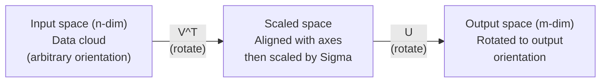
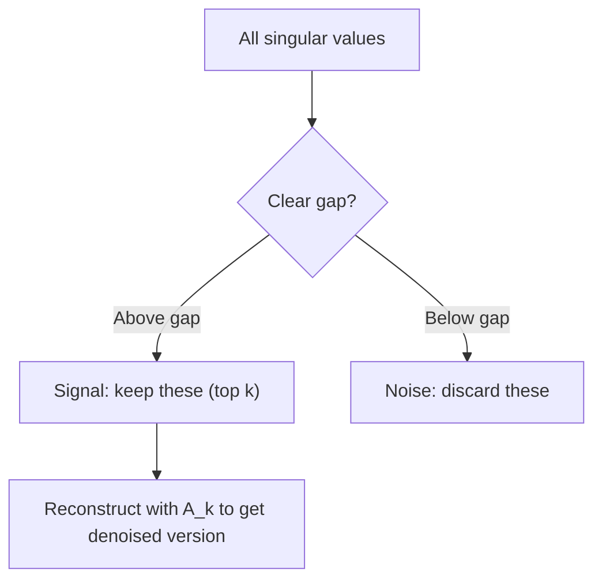

# تجزیه ارزش منحصر به فرد

> SVD چاقو ارتش سوئیس در الجبر خطی است هر ماتریکس یک دارد هر دانشمند داده نیاز به یک دارد

**Type:** Build
**Languages:** Python, Julia
**Prerequisites:** Phase 1, Lessons 01 (Linear Algebra Intuition), 02 (Vectors & Matrices Operations), 03 (Matrix Transformations)
**Time:** ~120 minutes

## اهداف یادگیری

- SVD را از طریق تکرار قدرت پیاده سازی کنید و معنای هندسی U، Sigma و V^T را توضیح دهید
- SVD کوتاه شده را برای فشرده سازی تصویر اعمال کنید و نسبت فشرده سازی نسبت به خطا بازسازی را اندازه گیری کنید
- از طریق SVD، پسویدونورس مور-پنروز را محاسبه کنید تا سیستم های کمترین مربع را حل کنید
- ارتباط SVD با PCA، سیستم های توصیه (فاکتورهای پنهان) و تحلیل معنوی پنهان در NLP

## مشکل

شما یک ماتریس 1000x2000 دارید. شاید این امتیاز فیلم کاربر باشد. شاید این یک جدول فرکانس در زمان مستند باشد. شاید این مقدار پیکسل یک تصویر باشد. شما باید آن را فشرده کنید، آن را از بین ببرید، ساختار پنهان را در آن پیدا کنید، یا یک سیستم کمترین مربع را با آن حل کنید. Eigendecomposition فقط در ماتریس مربع کار می کند. حتی در آن صورت، آن نیاز به یک مجموعه کامل از خودکشان های مستقل خطی دارد.

SVD در هر ماتریکس کار می کند. هر شکل. هر درجه. هیچ شرایطی. آن ماتریکس را به سه عامل تجزیه می کند که هندسه آنچه ماتریکس به فضا انجام می دهد را آشکار می کند. این عمومی ترین و مفیدترین فاکتورسازی در تمام الجبر خطی است.

## مفهوم

### آنچه SVD از لحاظ هندسی انجام می دهد

هر ماتریکس، بدون توجه به شکل، سه عملیات را در یک ردیف انجام می دهد: چرخش، مقیاس، چرخش. SVD این تجزیه را آشکار می کند.

```
A = U * Sigma * V^T

      m x n     m x m    m x n    n x n
     (any)    (rotate)  (scale)  (rotate)
```

در هر ماتریس A، SVD آن را به:
- V^T متری ها را در فضای ورودی (n-dimensional) چرخش می کند
- ترازو سیگما در طول هر محور (مدد یا فشرده سازی)
- U نتیجه را به فضای خروجی (m-بعدی) چرخش می کند



به این ترتیب فکر کنید. شما به SVD یک ماتریکس می دهید. می گوید: "این ماتریکس یک توپ ورودی را می گیرد، ابتدا آن را به V^T چرخش می کند، سپس آن را به یک elipsoid توسط Sigma کشیده می کند، سپس elipsoid را به U چرخش می کند". ارزش های تک تک طول محور های elipsoid هستند.

### تمام تجزیه

برای ماتریس A با شکل m x n:

```
A = U * Sigma * V^T

where:
  U     is m x m, orthogonal (U^T U = I)
  Sigma is m x n, diagonal (singular values on the diagonal)
  V     is n x n, orthogonal (V^T V = I)

The singular values sigma_1 >= sigma_2 >= ... >= sigma_r > 0
where r = rank(A)
```

ستون های U به نام متجه های تک تک چپ و ستون های V به نام متجه های تک راست و ستون های دیگال Sigma به نام ارزش های تک تک هستند. آنها همیشه غیر منفی هستند و به طور متعارف در ترتیب کاهش مرتب می شوند.

### متری های تک تک چپ، ارزش های تک تک، متری های تک راست

هر جزء SVD دارای معنای هندسی مشخصی است.

**Right singular vectors (columns of V):**این ها یک پایه ارتونورمالی برای فضای ورودی (R^n) هستند. آنها جهت های فضای ورودی هستند که ماتریس به جهت های ارتونال در فضای خروجی نقشه می کشد. آنها را به عنوان سیستم هماهنگی طبیعی برای دامنه تصور کنید.

**Singular values (diagonal of Sigma):**این عوامل مقیاس بندی هستند. ارزش تک تک می گوید که ماتریس چقدر متریزه ها را در طول متریزه تک تک می کشاند. یک مقدار تک صفر به این معنی است که ماتریس به طور کامل این جهت را خرد می کند.

**Left singular vectors (columns of U):**این ها یک پایه ارتونورمالی برای فضای خروجی (R^m) را تشکیل می دهند. ویکتور تک تک چپ سوم جهت در فضای خروجی است که در آن ویکتور تک راست سوم فرود می آید (پس از مقیاس بندی).

رابطه بين آنها:

```
A * v_i = sigma_i * u_i

The matrix A takes the i-th right singular vector v_i,
scales it by sigma_i, and maps it to the i-th left singular vector u_i.
```

این به شما یک تصویر هماهنگی به هماهنگی از هر ماتریس انجام می دهد.

### شکل محصول خارجی

SVD می تواند به عنوان مجموعه ماتریس های درجه 1 نوشته شود:

```
A = sigma_1 * u_1 * v_1^T + sigma_2 * u_2 * v_2^T + ... + sigma_r * u_r * v_r^T

Each term sigma_i * u_i * v_i^T is a rank-1 matrix (an outer product).
The full matrix is the sum of r such matrices, where r is the rank.
```

این شکل پایه ی مقربات درجه پایین است. هر اصطلاح یک لایه ساختار اضافه می کند. اصطلاح اول مهمترین الگوی را ضبط می کند. دوم مهم ترین الگوی را ضبط می کند. و غیره. کاهش این مقدار به شما بهترین مقربات ممکن را در هر درجه داده می دهد.

```
Rank-1 approx:    A_1 = sigma_1 * u_1 * v_1^T
                  (captures the dominant pattern)

Rank-2 approx:    A_2 = sigma_1 * u_1 * v_1^T + sigma_2 * u_2 * v_2^T
                  (captures the two most important patterns)

Rank-k approx:    A_k = sum of top k terms
                  (optimal by the Eckart-Young theorem)
```

### رابطه با خود ساخت

SVD و خود ساخت عمیقاً با هم مرتبط هستند. ارزش های تک تک و متری A مستقیماً از ارزش های خود و متری A^T A و A^T می آیند.

```
A^T A = V * Sigma^T * U^T * U * Sigma * V^T
      = V * Sigma^T * Sigma * V^T
      = V * D * V^T

where D = Sigma^T * Sigma is a diagonal matrix with sigma_i^2 on the diagonal.

So:
- The right singular vectors (V) are eigenvectors of A^T A
- The singular values squared (sigma_i^2) are eigenvalues of A^T A

Similarly:
A A^T = U * Sigma * V^T * V * Sigma^T * U^T
      = U * Sigma * Sigma^T * U^T

So:
- The left singular vectors (U) are eigenvectors of A A^T
- The eigenvalues of A A^T are also sigma_i^2
```

اين ارتباط به شما سه چيز ميگه:
1. ارزش های تک تک همیشه واقعی و غیر منفی هستند (این ریشه های مربع ارزش های خاص یک ماتریس نیمه تعریف مثبت هستند).
2. شما می توانید SVD را از طریق خود ساخت A^T A محاسبه کنید، اما این عدد شرط را مربع می کند و دقت عددی را از دست می دهد. الگوریتم های اختصاصی SVD از این جلوگیری می کنند.
3. وقتی A مربع و مثبت همتایی نیمه تعریف شده باشد، SVD و خود ساخت یکسان هستند.

### SVD کوتاه شده: نزدیک شدن درجه پایین

نظریه ی اکارت-جوان-میرسکی می گوید بهترین نزدیک شدن درجه k به A (در هر دو استاندارد فروبنیوس و طیف) با حفظ فقط ارزش های تک تک تک k بالا و متراهای مربوطه بدست می آید:

```
A_k = U_k * Sigma_k * V_k^T

where:
  U_k     is m x k  (first k columns of U)
  Sigma_k is k x k  (top-left k x k block of Sigma)
  V_k     is n x k  (first k columns of V)

Approximation error = sigma_{k+1}  (in spectral norm)
                    = sqrt(sigma_{k+1}^2 + ... + sigma_r^2)  (in Frobenius norm)
```

این فقط یک تقرب "خوب" نیست. این احتمالا بهترین تقرب ممکن از درجه k است. هیچ ماتریکس درجه k دیگری به A نزدیک تر نیست.

| Component | Relative magnitude | Kept in rank-3 approx? |
|-----------|-------------------|------------------------|
| sigma_1 | Largest | Yes |
| sigma_2 | Large | Yes |
| sigma_3 | Medium-large | Yes |
| sigma_4 | Medium | No (error) |
| sigma_5 | Medium-small | No (error) |
| sigma_6 | Small | No (error) |
| sigma_7 | Very small | No (error) |
| sigma_8 | Tiny | No (error) |

نگه دارید بالا 3: A_3 سه بزرگترین ارزش تک تک را ضبط می کند. خطا = ارزش های باقی مانده (sigma_4 تا sigma_8).

اگر مقادیر تک تک به سرعت تجزیه شوند، یک k کوچک بیشتر ماتریس را جذب می کند. اگر آنها به آرامی تجزیه شوند، ماتریس ساختار درجه پایین ندارد.

### فشرده سازی تصویر با SVD

یک تصویر در مقیاس خاکستری یک ماتریس از شدت پیکسل است. یک تصویر 800 × 600 دارای 480,000 ارزش است. SVD اجازه می دهد تا شما آن را با تعداد بسیار کمتری نزدیک کنید.

```
Original image: 800 x 600 = 480,000 values

SVD with rank k:
  U_k:      800 x k values
  Sigma_k:  k values
  V_k:      600 x k values
  Total:    k * (800 + 600 + 1) = k * 1401 values

  k=10:   14,010 values   (2.9% of original)
  k=50:   70,050 values  (14.6% of original)
  k=100: 140,100 values  (29.2% of original)

  The compression ratio improves as k gets smaller,
  but visual quality degrades.
```

نکته کلیدی: تصاویر طبیعی دارای ارزش های تک تک به سرعت تجزیه می شوند. اولین چند ارزش تک به شکل گسترده (شکل ها، گرادینت ها) می باشد. آخرین آنها جزئیات و صدا را ضبط می کنند. کوتاه کردن در رتبه 50 اغلب یک تصویر را تولید می کند که تقریبا شبیه به اصلی است در حالی که از ذخیره سازی 85٪ کمتر استفاده می کند.

### SVD برای سیستم های توصیه

جایزه نتفلیکس این را مشهور کرد. شما یک ماتریس رتبه بندی فیلم های کاربر دارید که اکثر نوشته ها از دست رفته است.

```
             Movie1  Movie2  Movie3  Movie4  Movie5
  User1      [  5      ?       3       ?       1  ]
  User2      [  ?      4       ?       2       ?  ]
  User3      [  3      ?       5       ?       ?  ]
  User4      [  ?      ?       ?       4       3  ]

  ? = unknown rating
```

ایده: این ماتریس رتبه بندی رتبه پایین دارد. کاربران سلیقه های کاملا مستقل ندارند. چند عامل پنهان (کار در مقابل درام، قدیمی در مقابل جدید، مغز در مقابل بصری) وجود دارد که بیشتر ترجیحات را توضیح می دهد.

SVD در ماتریس اعتبار (پرداخت) آن را به:
- U: پروفایل های کاربر در فضای عامل پنهان
- سیگما: اهمیت هر عامل غش
- V^T: پروفایل های فیلم در فضای عامل پنهان

رتبه پیش بینی شده یک کاربر برای یک فیلم، محصول نقطه ای از پروفایل کاربر خود با پروفایل فیلم است (با وزن با ارزش های تک تک).

در عمل، شما از انواع مانند SVD افزایشی سیمون فنک یا ALS (بدل کمترین مربع) استفاده می کنید که به طور مستقیم داده های گمشده را اداره می کنند. اما ایده اصلی همان است: تجزیه فاکتور پنهان از طریق SVD.

### SVD در NLP: تحلیل معنوی غفلت

تجزیه و تحلیل معنوی لغت (LSA) ، که همچنین به عنوان شاخصه سازی معنوی لغت (LSI) نامیده می شود، SVD را به یک ماتریس سند اصطلاحی اعمال می کند.

```
             Doc1   Doc2   Doc3   Doc4
  "cat"      [  3      0      1      0  ]
  "dog"      [  2      0      0      1  ]
  "fish"     [  0      4      1      0  ]
  "pet"      [  1      1      1      1  ]
  "ocean"    [  0      3      0      0  ]

After SVD with rank k=2:

  Each document becomes a point in 2D "concept space."
  Each term becomes a point in the same 2D space.
  Documents about similar topics cluster together.
  Terms with similar meanings cluster together.

  "cat" and "dog" end up near each other (land pets).
  "fish" and "ocean" end up near each other (water concepts).
  Doc1 and Doc3 cluster if they share similar topics.
```

LSA یکی از اولین روش های موفق برای ضبط شباهت معنوی از متن خام بود. این کار می کند زیرا اصطلاحات مترادف تمایل به ظاهر شدن در اسناد مشابه دارند، بنابراین SVD آنها را به همان ابعاد پنهان گروه می کند. گنجانده شدن کلمات مدرن (Word2Vec، GloVe) می تواند به عنوان فرزندان این ایده دیده شود.

### SVD برای کاهش صدا

داده های سر و صدا در بالاترین مقدار تک تک متمرکز شده و صدا در تمام مقدار تک تک پخش می شود.

**Clean signal singular values:**

| Component | Magnitude | Type |
|-----------|-----------|------|
| sigma_1 | Very large | Signal |
| sigma_2 | Large | Signal |
| sigma_3 | Medium | Signal |
| sigma_4 | Near zero | Negligible |
| sigma_5 | Near zero | Negligible |

**Noisy signal singular values (noise adds to all):**

| Component | Magnitude | Type |
|-----------|-----------|------|
| sigma_1 | Very large | Signal |
| sigma_2 | Large | Signal |
| sigma_3 | Medium | Signal |
| sigma_4 | Small | Noise |
| sigma_5 | Small | Noise |
| sigma_6 | Small | Noise |
| sigma_7 | Small | Noise |



این روش در پردازش سیگنال، اندازه گیری علمی و تمیز کردن داده ها استفاده می شود. هر زمان که یک ماتریس توسط صداهای افزودنی خراب شده باشد، SVD کوتاه شده راهی است که از اصول برای جدا کردن سیگنال از صدا استفاده می شود.

### مخفف ضدعكس از طریق SVD

پزودو انورس مور-پنروز A+ معکوس متیریک را به متیریک غیر مربع و تک تک عمومی می کند. SVD محاسبات را ساده می کند.

```
If A = U * Sigma * V^T, then:

A+ = V * Sigma+ * U^T

where Sigma+ is formed by:
  1. Transpose Sigma (swap rows and columns)
  2. Replace each non-zero diagonal entry sigma_i with 1/sigma_i
  3. Leave zeros as zeros

For A (m x n):      A+ is (n x m)
For Sigma (m x n):  Sigma+ is (n x m)
```

اگر Ax = b هیچ راه حل دقیق (سیستم بیش از حد تعیین شده) ندارد، پس x = A + b راه حل کمترین مربع است (به حداقل رساندن

```
Overdetermined system (more equations than unknowns):

  [1  1]         [3]
  [2  1] x   =   [5]       No exact solution exists.
  [3  1]         [6]

  x_ls = A+ b = V * Sigma+ * U^T * b

  This gives the x that minimizes the sum of squared residuals.
  Same result as the normal equations (A^T A)^(-1) A^T b,
  but numerically more stable.
```

### مزایای ثبات عددی

محاسبه ترکیب خود A^T A به مربع ارزش های تک تک (مقدار خود A^T A sigma_i^2) است. این مربع شماره شرایط، افزایش خطاهای عددی است.

```
Example:
  A has singular values [1000, 1, 0.001]
  Condition number of A: 1000 / 0.001 = 10^6

  A^T A has eigenvalues [10^6, 1, 10^{-6}]
  Condition number of A^T A: 10^6 / 10^{-6} = 10^{12}

  Computing SVD directly: works with condition number 10^6
  Computing via A^T A:     works with condition number 10^{12}
                           (6 extra digits of precision lost)
```

الگوریتم های مدرن SVD (گولب-کاهان دو تشخیص) مستقیماً روی A کار می کنند و هرگز A^T A را تشکیل نمی دهند. به همین دلیل همیشه باید ترجیح دهید`np.linalg.svd(A)`تموم شد`np.linalg.eig(A.T @ A)`. .

### اتصال به PCA

PCA IS SVD در داده های متمرکز این یک مقایسه نیست این حرفاً همان محاسبه است

```
Given data matrix X (n_samples x n_features), centered (mean subtracted):

Covariance matrix: C = (1/(n-1)) * X^T X

PCA finds eigenvectors of C. But:

  X = U * Sigma * V^T    (SVD of X)

  X^T X = V * Sigma^2 * V^T

  C = (1/(n-1)) * V * Sigma^2 * V^T

So the principal components are exactly the right singular vectors V.
The explained variance for each component is sigma_i^2 / (n-1).

In sklearn, PCA is implemented using SVD, not eigendecomposition.
It is faster and more numerically stable.
```

این بدان معنی است که همه چیز که در مورد کاهش ابعاد در درس 10 یاد گرفتید، SVD زیر کوپ است. PCA رایج ترین کاربرد SVD در یادگیری ماشین است.

```figure
svd-rank-reconstruction
```

## آن را بسازید

### مرحله 1: SVD از ابتدا با استفاده از تکرار قدرت

ایده: برای پیدا کردن بزرگترین ارزش تک تک وکتورها، از تکرار قدرت در A^T A (یا A A^T) استفاده کنید. سپس ماتریس را کاهش دهید و برای ارزش تک تک بعدی تکرار کنید.

```python
import numpy as np

def power_iteration(M, num_iters=100):
    n = M.shape[1]
    v = np.random.randn(n)
    v = v / np.linalg.norm(v)

    for _ in range(num_iters):
        Mv = M @ v
        v = Mv / np.linalg.norm(Mv)

    eigenvalue = v @ M @ v
    return eigenvalue, v

def svd_from_scratch(A, k=None):
    m, n = A.shape
    if k is None:
        k = min(m, n)

    sigmas = []
    us = []
    vs = []

    A_residual = A.copy().astype(float)

    for _ in range(k):
        AtA = A_residual.T @ A_residual
        eigenvalue, v = power_iteration(AtA, num_iters=200)

        if eigenvalue < 1e-10:
            break

        sigma = np.sqrt(eigenvalue)
        u = A_residual @ v / sigma

        sigmas.append(sigma)
        us.append(u)
        vs.append(v)

        A_residual = A_residual - sigma * np.outer(u, v)

    U = np.column_stack(us) if us else np.empty((m, 0))
    S = np.array(sigmas)
    V = np.column_stack(vs) if vs else np.empty((n, 0))

    return U, S, V
```

### مرحله 2: آزمایش و مقایسه با NumPy

```python
np.random.seed(42)
A = np.random.randn(5, 4)

U_ours, S_ours, V_ours = svd_from_scratch(A)
U_np, S_np, Vt_np = np.linalg.svd(A, full_matrices=False)

print("Our singular values:", np.round(S_ours, 4))
print("NumPy singular values:", np.round(S_np, 4))

A_reconstructed = U_ours @ np.diag(S_ours) @ V_ours.T
print(f"Reconstruction error: {np.linalg.norm(A - A_reconstructed):.8f}")
```

### مرحله 3: نمایش فشرده سازی تصویر

```python
def compress_image_svd(image_matrix, k):
    U, S, Vt = np.linalg.svd(image_matrix, full_matrices=False)
    compressed = U[:, :k] @ np.diag(S[:k]) @ Vt[:k, :]
    return compressed

image = np.random.seed(42)
rows, cols = 200, 300
image = np.random.randn(rows, cols)

for k in [1, 5, 10, 20, 50]:
    compressed = compress_image_svd(image, k)
    error = np.linalg.norm(image - compressed) / np.linalg.norm(image)
    original_size = rows * cols
    compressed_size = k * (rows + cols + 1)
    ratio = compressed_size / original_size
    print(f"k={k:>3d}  error={error:.4f}  storage={ratio:.1%}")
```

### مرحله 4: کاهش صدا

```python
np.random.seed(42)
clean = np.outer(np.sin(np.linspace(0, 4*np.pi, 100)),
                 np.cos(np.linspace(0, 2*np.pi, 80)))
noise = 0.3 * np.random.randn(100, 80)
noisy = clean + noise

U, S, Vt = np.linalg.svd(noisy, full_matrices=False)
denoised = U[:, :5] @ np.diag(S[:5]) @ Vt[:5, :]

print(f"Noisy error:    {np.linalg.norm(noisy - clean):.4f}")
print(f"Denoised error: {np.linalg.norm(denoised - clean):.4f}")
print(f"Improvement:    {(1 - np.linalg.norm(denoised - clean) / np.linalg.norm(noisy - clean)):.1%}")
```

### مرحله 5: پلویدورانس

```python
A = np.array([[1, 1], [2, 1], [3, 1]], dtype=float)
b = np.array([3, 5, 6], dtype=float)

U, S, Vt = np.linalg.svd(A, full_matrices=False)
S_inv = np.diag(1.0 / S)
A_pinv = Vt.T @ S_inv @ U.T

x_svd = A_pinv @ b
x_lstsq = np.linalg.lstsq(A, b, rcond=None)[0]
x_pinv = np.linalg.pinv(A) @ b

print(f"SVD pseudoinverse solution:  {x_svd}")
print(f"np.linalg.lstsq solution:   {x_lstsq}")
print(f"np.linalg.pinv solution:    {x_pinv}")
```

## ازش استفاده کن

نمايش هاي كامل فعالي در حال اجراست`code/svd.py`. آن را اجرا کنید تا ببینید SVD برای فشرده سازی تصویر، سیستم های توصیه، تجزیه و تحلیل معنوی پنهان و کاهش صدا استفاده می شود.

```bash
python svd.py
```

نسخه جولیا در`code/svd.jl`از مفهوم هاي مشابهي با استفاده از زبان اصلي جوليا نشان ميده`svd()`عملکرد و`LinearAlgebra`بسته

```bash
julia svd.jl
```

## -باده

این درس نتیجه می دهد:
- `outputs/skill-svd.md`- مهارت برای دانستن زمان و نحوه استفاده از SVD در پروژه های واقعی

## تمرینات

1. SVD کامل را بدون استفاده از تکرار قدرت از ابتدا اجرا کنید. در عوض، ترکیب خود A^T A را محاسبه کنید تا V و مقادیر تک تک را بدست آورید، سپس U = A V Sigma^{-1} را محاسبه کنید. دقت عددی را با نسخه تکرار قدرت و با NumPy مقایسه کنید.

2. یک تصویر واقعی در مقیاس خاکستری بارگذاری کنید (یا آن را به مقیاس خاکستری تبدیل کنید). آن را در صف های 1, 5, 10, 25, 50 و 100 فشرده کنید. برای هر صف، نسبت فشرده سازی و خطا نسبی را محاسبه کنید. رتبه ای را پیدا کنید که در آن تصویر قابل قبول بینایی می شود.

3. یک سیستم توصیه کوچک بسازید. یک ماتریس رتبه بندی فیلم های کاربر 10 × 8 با برخی از ورودی های شناخته شده ایجاد کنید. ورودی های گمشده را با ابزار ردیف پر کنید. SVD را محاسبه کنید و مقربات رتبه 3 را بازسازی کنید. از ماتریس بازسازی شده برای پیش بینی رتبه بندی گمشده استفاده کنید. بررسی کنید که پیش بینی ها منطقی هستند.

4. یک ماتریس 100x50 سند با 3 موضوع مصنوعی ایجاد کنید. هر موضوع دارای 5 اصطلاح مرتبط است. صدا اضافه کنید. SVD را اعمال کنید و تایید کنید که 3 مقدار تک تک در بالای آنها بسیار بزرگتر از بقیه است. اسناد را به فضای 3D پنهان کنید و بررسی کنید که اسناد از یک گروه موضوع با هم هستند.

5. یک ماتریس پایین صف صف (درجات 3 ، اندازه 50x40) تولید کنید و صداهای گاسیان را در سطوح مختلف (sigma = 0.1 ، 0.5 ، 1.0 ، 2.0) اضافه کنید. برای هر سطح صدا ، درجه تراکم بهینه را با پاک کردن k از 1 تا 40 و اندازه گیری خطای بازسازی با ماتریس پاک پیدا کنید. نشان دهید که چگونه k بهینه با سطح صدا تغییر می کند.

## اصطلاحات کلیدی

| Term | What people say | What it actually means |
|------|----------------|----------------------|
| SVD | "Factor any matrix" | Decompose A into U Sigma V^T where U and V are orthogonal and Sigma is diagonal with non-negative entries. Works for any matrix of any shape. |
| Singular value | "How important this component is" | The i-th diagonal entry of Sigma. Measures how much the matrix stretches along the i-th principal direction. Always non-negative, sorted in decreasing order. |
| Left singular vector | "Output direction" | A column of U. The direction in output space that the i-th right singular vector maps to (after scaling by sigma_i). |
| Right singular vector | "Input direction" | A column of V. The direction in input space that the matrix maps to the i-th left singular vector (after scaling by sigma_i). |
| Truncated SVD | "Low-rank approximation" | Keep only the top k singular values and their vectors. Produces the provably best rank-k approximation to the original matrix (Eckart-Young theorem). |
| Rank | "True dimensionality" | The number of non-zero singular values. Tells you how many independent directions the matrix actually uses. |
| Pseudoinverse | "Generalized inverse" | V Sigma+ U^T. Inverts non-zero singular values, leaves zeros as zeros. Solves least-squares problems for non-square or singular matrices. |
| Condition number | "How sensitive to errors" | sigma_max / sigma_min. A large condition number means small input changes cause large output changes. SVD reveals this directly. |
| Latent factor | "Hidden variable" | A dimension in the low-rank space discovered by SVD. In recommendations, a latent factor might correspond to genre preference. In NLP, it might correspond to a topic. |
| Frobenius norm | "Total matrix size" | Square root of the sum of squared entries. Equals the square root of the sum of squared singular values. Used to measure approximation error. |
| Eckart-Young theorem | "SVD gives the best compression" | For any target rank k, the truncated SVD minimizes the approximation error over all possible rank-k matrices. |
| Power iteration | "Find the biggest eigenvector" | Repeatedly multiply a random vector by the matrix and normalize. Converges to the eigenvector with the largest eigenvalue. The building block of many SVD algorithms. |

## خواندن بیشتر

- [Gilbert Strang: Linear Algebra and Its Applications, Chapter 7](https://math.mit.edu/~gs/linearalgebra/)- درمان کامل SVD با استفاده از برنامه های کاربردی
- [3Blue1Brown: But what is the SVD?](https://www.youtube.com/watch?v=vSczTbgc8Rc)- حس هندسی برای SVD
- [We Recommend a Singular Value Decomposition](https://www.ams.org/publicoutreach/feature-column/fcarc-svd)- یک نظرسنجی قابل دسترسی از انجمن ریاضیات آمریکا
- [Netflix Prize and Matrix Factorization](https://sifter.org/~simon/journal/20061211.html)- پست اصلی سایمون فانک در وبلاگ SVD برای توصیه ها
- [Latent Semantic Analysis](https://en.wikipedia.org/wiki/Latent_semantic_analysis)- کاربرد اصلی NLP SVD
- [Numerical Linear Algebra by Trefethen and Bau](https://people.maths.ox.ac.uk/trefethen/text.html)- استاندارد طلا برای درک الگوریتم های SVD و خواص عددی آنها
