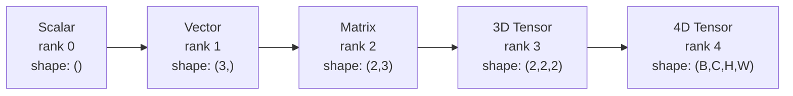
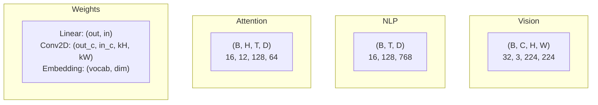
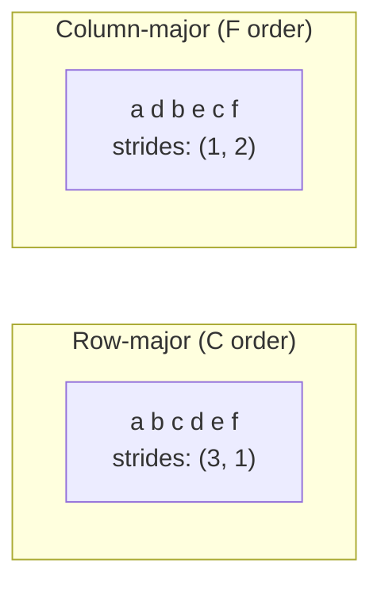
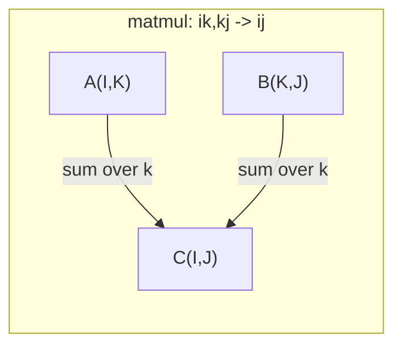

# عملیات تنسور

> تنسورها زبان مشترک بین داده ها و یادگیری عمیق هستند. هر تصویر، هر جمله، هر گرادینت از طریق آنها جریان می یابد.

**Type:** Build
**Language:**پیتون
**Prerequisites:** Phase 1, Lessons 01 (Linear Algebra Intuition), 02 (Vectors, Matrices & Operations)
**Time:** ~90 minutes

## اهداف یادگیری

- پیاده سازی یک کلاس تنسور با شکل، گام، تغییر شکل، انتقال و عملیات هوشمندانه عنصر از ابتدا
- استفاده از قوانین پخش برای کار کردن بر روی تنسورهای شکل های مختلف بدون کپی کردن داده ها
- عبارت های یکسوم را برای محصولات نقطه ای، ضربات ماتریکس، محصولات خارجی و عملیات دسته بندی بنویسید
- شکل های دقیق تنسور را از طریق هر مرحله توجه چند سر ردیابی کنید

## مشکل

تو يه ترانسفورماتور درست ميکني، گذرگاه جلو صاف به نظر مياد، و تو اونو اجرا ميکني و ميگي:`RuntimeError: mat1 and mat2 shapes cannot be multiplied (32x768 and 512x768)`تو به شکل ها نگاه ميکني، تو يه ترانسپوز رو امتحان ميکني، حالا ميگه`Expected 4D input (got 3D input)`تو يه فشار غير قابل فشار اضافه مي کني و چيزي ديگه شکسته ميشه

خطاهای شکل رایج ترین خطای کد یادگیری عمیق هستند. از نظر مفهومی سخت نیستند - هر عملیه یک قرارداد شکل دارد - اما به سرعت چند برابر می شوند. یک ترانسفورماتور ده ها شکل، انتقال و پخش را به هم متصل می کند. یک محور اشتباه و خطای خطا بدتر از همه، بعضی از اشکال اشتباه هیچ گونه اشتباه نمی کنند. آنها به طور خاموشی با پخش در طول ابعاد اشتباه یا جمع کردن در محور اشتباه زباله تولید می کنند.

ماتریکس ها روابط دو مجموعه از چیزها را به صورت جفت انجام می دهند. داده های واقعی به دو ابعاد نمی رسند. یک دسته از 32 تصویر RGB در 224x224 یک تنسور 4D است:`(32, 3, 224, 224)`. خود توجه با 12 سر هم 4D است:`(batch, heads, seq_len, head_dim)`شما به یک ساختار داده نیاز دارید که به تعداد زیادی از ابعاد عمومی شود، با عملیات هایی که به طور تمیز در همه آنها ترکیب شوند. این ساختار تنسور است. عملیات آن را مدیریت کنید و اشتباهات شکل به طور معمولی قابل تنظیم می شوند.

## مفهوم

### تنسور چيست؟

یک تنسور یک مجموعه چند بعدی از اعداد با یک نوع داده یکسان است. تعداد ابعاد است **rank**(یا **order**) هر ابعاد یک**axis**.**shape**یک تپل است که اندازه را در طول هر محور لیست می کند.



کل عناصر = محصول هر اندازه ای. یک شکل `(2, 3, 4)`نگه داره`2 * 3 * 4 = 24`عناصر

### شکل های تنسور در یادگیری عمیق

انواع داده های مختلف به شکل های تنسور خاص با توجه به کنوانسیون نقشه می گیرند.



PyTorch از NCHW (چانل اول) استفاده می کند. TensorFlow به طور پیش فرض به NHWC (چانل آخر) می پردازد. طرح های نامتناسب باعث کاهش یا خطا های خاموش می شوند.

### نحوه کار طرح حافظه

یک آرایه 2D در حافظه یک ردیف 1D بایت است.**Strides**به شما می گویند که چند عنصر را برای حرکت یک قدم در طول هر محور به یاد داشته باشید.



ترانسپوز داده ها را حرکت نمی دهد. این گام ها را عوض می کند، و تنسور را ایجاد می کند **non-contiguous**-- عناصر یک ردیف دیگر در حافظه همسایه نیستند.

### قوانین پخش

پخش اجازه می دهد تا شما در تنسورهای اشکال مختلف بدون کپی داده ها کار کنید. شکل ها را از سمت راست همبستگی کنید. دو ابعاد متوافق هستند زمانی که برابر هستند یا یک است. ابعاد کمتری با 1s در سمت چپ پر می شوند.

```
Tensor A:     (8, 1, 6, 1)
Tensor B:        (7, 1, 5)
Padded B:     (1, 7, 1, 5)
Result:       (8, 7, 6, 5)
```

### انزیم: عملیات تنسور جهانی

آينشتين جمعي هر محور را با يک حرف نام مي دهد محور هاي وارد شده اما نه خروجي جمع مي شوند محور هاي هر دو نگه داشته مي شوند



الگوهای کلیدی: `i,i->`(محصول نقطه ای)`i,j->ij`(محصول خارجی)`ii->`(تراسه)`ij->ji`(ترانسپور)`bij,bjk->bik`(بچ ماتمل)`bhtd,bhsd->bhts`(درستهاي توجه)

```figure
tensor-broadcast
```

## آن را بسازید

کد در "`code/tensors.py`هر مرحله به اجرای آن اشاره دارد.

### مرحله ی ۱: ذخیره سازی تنسور و مراحل

یک تنسور یک لیست مسطح اعداد و همچنین متاداتا شکل را ذخیره می کند. گام ها به منطق شاخص سازی می گویند که چگونه شاخص های چند بعدی را به موقعیت های مسطح نقشه برداری کنیم.

```python
class Tensor:
    def __init__(self, data, shape=None):
        if isinstance(data, (list, tuple)):
            self._data, self._shape = self._flatten_nested(data)
        elif isinstance(data, np.ndarray):
            self._data = data.flatten().tolist()
            self._shape = tuple(data.shape)
        else:
            self._data = [data]
            self._shape = ()

        if shape is not None:
            total = reduce(lambda a, b: a * b, shape, 1)
            if total != len(self._data):
                raise ValueError(
                    f"Cannot reshape {len(self._data)} elements into shape {shape}"
                )
            self._shape = tuple(shape)

        self._strides = self._compute_strides(self._shape)

    @staticmethod
    def _compute_strides(shape):
        if len(shape) == 0:
            return ()
        strides = [1] * len(shape)
        for i in range(len(shape) - 2, -1, -1):
            strides[i] = strides[i + 1] * shape[i + 1]
        return tuple(strides)
```

برای شکل`(3, 4)`، قدم ها`(4, 1)`-- 4 عنصر را برای یک ردیف، 1 عنصر را برای یک ستون رد کنید.

### مرحله دوم: تغییر شکل، فشار، حذف فشار

شکل تغییر بدون تغییر ترتیب عناصر. تعداد کل عناصر باید یکسان بماند. استفاده `-1`برای یک ابعاد برای نتیجه گیری از اندازه آن.

```python
t = Tensor(list(range(12)), shape=(2, 6))
r = t.reshape((3, 4))
r = t.reshape((-1, 3))
```

فشار دادن محور های اندازه 1 را حذف می کند. فشار دادن یک محور است. فشار دادن برای پخش مهم است - یک ویکتور تعصب`(D,)`اضافه شده به یک دسته`(B, T, D)`نیاز به فشار دادن`(1, 1, D)`. .

```python
t = Tensor(list(range(6)), shape=(1, 3, 1, 2))
s = t.squeeze()
v = Tensor([1, 2, 3])
u = v.unsqueeze(0)
```

### مرحله سوم: انتقال و تغییر

نقل دو محور را عوض می کند. تغییر محور را تغییر می دهد. اینگونه بین NCHW و NHWC تبدیل می شود.

```python
mat = Tensor(list(range(6)), shape=(2, 3))
tr = mat.transpose(0, 1)

t4d = Tensor(list(range(24)), shape=(1, 2, 3, 4))
perm = t4d.permute((0, 2, 3, 1))
```

بعد از انتقال یا تغییر، تنسور در حافظه غیر متقابل است.`view`در تنسورهای غیر متقابل شکست می خورد -- استفاده `reshape`یا تماس بگیرید`.contiguous()`اول

### مرحله 4: عملیات و کاهش بر اساس عناصر

عملیات های معقول عنصر (اضاف، ضرب، معایب) به طور مستقل برای هر عنصر اعمال می شوند و شکل را حفظ می کنند. کاهش (جمع، متوسط، حداکثر) یک یا چند محور را سقوط می کند.

```python
a = Tensor([[1, 2], [3, 4]])
b = Tensor([[10, 20], [30, 40]])
c = a + b
d = a * 2
s = a.sum(axis=0)
```

متوسط جهانی جمع آوری در CNN: `(B, C, H, W).mean(axis=[2, 3])`تولید می کند`(B, C)`. متوسط ترتیب جمع آوری در NLP: `(B, T, D).mean(axis=1)`تولید می کند`(B, D)`. .

### مرحله 5: پخش با NumPy

.`demo_broadcasting_numpy()`عملکرد در `tensors.py`الگوهای اصلی را نشان می دهد.

```python
activations = np.random.randn(4, 3)
bias = np.array([0.1, 0.2, 0.3])
result = activations + bias

images = np.random.randn(2, 3, 4, 4)
scale = np.array([0.5, 1.0, 1.5]).reshape(1, 3, 1, 1)
result = images * scale

a = np.array([1, 2, 3]).reshape(-1, 1)
b = np.array([10, 20, 30, 40]).reshape(1, -1)
outer = a * b
```

فاصله با هم از طریق پخش: تغییر شکل`(M, 2)`به`(M, 1, 2)`و`(N, 2)`به`(1, N, 2)`, ازش بکشیم , مربع , جمع کنیم در طول محور آخر , ریشه مربع بگیریم. نتیجه: `(M, N)`. .

### مرحله 6: عملیات آینسم

.`demo_einsum()`و`demo_einsum_gallery()`عملکردها از طریق هر الگوی مشترک حرکت می کنند.

```python
a = np.array([1.0, 2.0, 3.0])
b = np.array([4.0, 5.0, 6.0])
dot = np.einsum("i,i->", a, b)

A = np.array([[1, 2], [3, 4], [5, 6]], dtype=float)
B = np.array([[7, 8, 9], [10, 11, 12]], dtype=float)
matmul = np.einsum("ik,kj->ij", A, B)

batch_A = np.random.randn(4, 3, 5)
batch_B = np.random.randn(4, 5, 2)
batch_mm = np.einsum("bij,bjk->bik", batch_A, batch_B)
```

هزینه های محاسباتی یک انقباض محصول تمام اندازه های شاخص (بند و جمع) است.`bij,bjk->bik`با B=32، I=128، J=64، K=128: `32 * 128 * 64 * 128 = 33,554,432`چندان افزونه

### مرحله 7: مکانیسم توجه از طریق einsum

.`demo_attention_einsum()`عملکرد به صورت چند سر توجه را انجام می دهد.

```python
B, H, T, D = 2, 4, 8, 16
E = H * D

X = np.random.randn(B, T, E)
W_q = np.random.randn(E, E) * 0.02

Q = np.einsum("bte,ek->btk", X, W_q)
Q = Q.reshape(B, T, H, D).transpose(0, 2, 1, 3)

scores = np.einsum("bhtd,bhsd->bhts", Q, K) / np.sqrt(D)
weights = softmax(scores, axis=-1)
attn_output = np.einsum("bhts,bhsd->bhtd", weights, V)

concat = attn_output.transpose(0, 2, 1, 3).reshape(B, T, E)
output = np.einsum("bte,ek->btk", concat, W_o)
```

هر مرحله یک عملیات تنسور است: پروژکتور (ماتمول از طریق einsum) ، تقسیم سر (تازه شکل + انتقال) ، امتیاز توجه (باتچ ماتمول از طریق einsum) ، مقدار وزن شده (باتچ ماتمول از طریق einsum) ، ادغام سر (تازه شکل + تغییر شکل) ، پروژکتور خروجی (ماتمول از طریق einsum).

## ازش استفاده کن

### سکرتچ در مقابل NumPy

| Operation | Scratch (Tensor class) | NumPy |
|---|---|---|
| Create | `Tensor([[1,2],[3,4]])` | `np.array([[1,2],[3,4]])` |
| Reshape | `t.reshape((3,4))` | `a.reshape(3,4)` |
| Transpose | `t.transpose(0,1)` | `a.T` or `a.transpose(0,1)` |
| Squeeze | `t.squeeze(0)` | `np.squeeze(a, 0)` |
| Sum | `t.sum(axis=0)` | `a.sum(axis=0)` |
| Einsum | N/A | `np.einsum("ij,jk->ik", a, b)` |

### سکریچ در مقابل پیتورچ

```python
import torch

t = torch.tensor([[1, 2, 3], [4, 5, 6]], dtype=torch.float32)
t.shape
t.stride()
t.is_contiguous()

t.reshape(3, 2)
t.unsqueeze(0)
t.transpose(0, 1)
t.transpose(0, 1).contiguous()

torch.einsum("ik,kj->ij", A, B)
```

PyTorch اضافه می کند autograd، پشتیبانی از GPU و هسته های BLAS بهینه شده. سیمانیک شکل یکسان است. اگر شما نسخه از خرس را درک کنید، خطاهای شکل PyTorch قابل خواندن می شوند.

### هر لایه شبکه عصبی به عنوان یک عملیات تنسور

| Operation | Tensor Form | Einsum |
|---|---|---|
| Linear layer | `Y = X @ W.T + b` | `"bd,od->bo"` + bias |
| Attention QKV | `Q = X @ W_q` | `"btd,dh->bth"` |
| Attention scores | `Q @ K.T / sqrt(d)` | `"bhtd,bhsd->bhts"` |
| Attention output | `softmax(scores) @ V` | `"bhts,bhsd->bhtd"` |
| Batch norm | `(X - mu) / sigma * gamma` | element-wise + broadcast |
| Softmax | `exp(x) / sum(exp(x))` | element-wise + reduction |

## -باده

این درس دو تا درخواست قابل استفاده مجدد را ارائه می دهد:

1. **`outputs/prompt-tensor-shapes.md`**-- یک پیامک سیستماتیک برای تنظیم اشکال تنسور. شامل جدول های تصمیم گیری برای هر عملیات مشترک (matmul، پخش، گربه، خطی، Conv2d، BatchNorm، softmax) و یک جدول جستجوی درست.

2. **`outputs/prompt-tensor-debugger.md`**-- یک دستور تخفیف خط به خط که شما در هر دستیار هوش مصنوعی قرار می دهید وقتی یک خطای شکل شما را مسدود می کند. به آن پیام خطای و شکل های تنسور خود را بدهید، درست درست را به دست آورید.

## تمرینات

1. **Easy -- Reshape round-trip.**يه تنسور شکل رو بگير`(2, 3, 4)`. دوباره به صورت`(6, 4)`، بعدش به`(24,)`، پس برگرديم به`(2, 3, 4)`. ترتیب عناصر تایید در هر مرحله با چاپ داده های صاف حفظ می شود.

2. **Medium -- Implement broadcasting.**طولاني کردن`Tensor`کلاس با یک`broadcast_to(shape)`روش که ابعاد اندازه 1 را برای مطابقت با شکل هدف گسترش می دهد. سپس تغییر دهید`_elementwise_op`برای پخش خودکار قبل از کار کردن.`(3, 1)`و`(1, 4)`تولید کننده`(3, 4)`. .

3. **Hard -- Build einsum from scratch.**یک روش اساسی را اجرا کنید`einsum(subscripts, *tensors)`عملکردی که حداقل: محصول نقطه ای (`i,i->`), ماتریکس ضرب (`ij,jk->ik`), محصول خارجی (`i,j->ij`) و انتقال (`ij->ji`) رشته زیرنویس را تجزیه و تحلیل کنید، شاخص های قرارداد شده را شناسایی کنید و تمام ترکیب های شاخص را مرور کنید. نتایج خود را با مقایسه کنید.`np.einsum`. .

4. **Hard -- Attention shape tracker.**یک تابع بنویسید که میخواد`batch_size`،`seq_len`،`embed_dim`و`num_heads`به عنوان ورودی و چاپ شکل دقیق در هر مرحله از توجه چند سر: ورودی، Q / K / V پروژکتور، تقسیم سر، توجه امتیازات، وزن نرم حداکثر، وزن مجموعه، سر ادغام، تولید پروژکتور.`demo_attention_einsum()`تولید

## اصطلاحات کلیدی

| Term | What people say | What it actually means |
|---|---|---|
| Tensor | "A matrix but more dimensions" | A multi-dimensional array with uniform type and defined shape, strides, and operations |
| Rank | "The number of dimensions" | The number of axes. A matrix has rank 2, not rank equal to its matrix rank |
| Shape | "The size of the tensor" | A tuple listing the size along each axis. `(2, 3)` means 2 rows, 3 columns |
| Stride | "How memory is laid out" | The number of elements to skip to advance one position along each axis |
| Broadcasting | "It just works when shapes differ" | A strict set of rules: align from right, dimensions must be equal or one must be 1 |
| Contiguous | "The tensor is normal" | Elements stored sequentially in memory with no gaps or reordering from the logical layout |
| Einsum | "A fancy way to write matmul" | A general notation that expresses any tensor contraction, outer product, trace, or transpose in one line |
| View | "Same as reshape" | A tensor sharing the same memory buffer but with different shape/stride metadata. Fails on non-contiguous data |
| Contraction | "Summing over an index" | The general operation where a shared index between tensors is multiplied and summed, producing a lower-rank result |
| NCHW / NHWC | "PyTorch vs TensorFlow format" | Memory layout conventions for image tensors. NCHW puts channels before spatial dims, NHWC puts them after |

## خواندن بیشتر

- [NumPy Broadcasting](https://numpy.org/doc/stable/user/basics.broadcasting.html)-- قوانين قوانين با نمونه هاي بصري
- [PyTorch Tensor Views](https://pytorch.org/docs/stable/tensor_view.html)-- وقتي که نمايش ها کار ميکنن و وقتي که کپي ميکنن
- [einops](https://github.com/arogozhnikov/einops)-- يک کتابخانه که تانسور را قابل خواندن و امن تر مي سازد
- [The Illustrated Transformer](https://jalammar.github.io/illustrated-transformer/)-- شکل های تنسور رو که از طریق توجه جریان داره رو تجسم ميکنه
- [Einstein Summation in NumPy](https://numpy.org/doc/stable/reference/generated/numpy.einsum.html)-- اسناد کامل با نمونه ها
