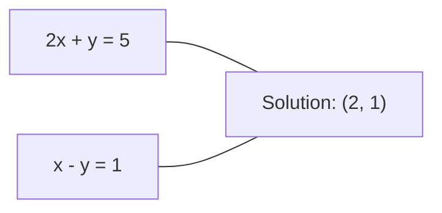
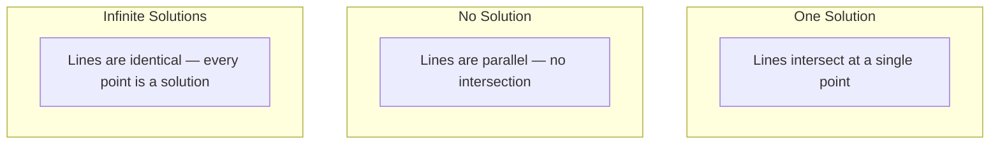

# سیستم های خطی

> حل Ax = b قدیمی ترین مشکل ریاضی است که هنوز شبکه عصبی شما را اداره می کند.

**Type:** Build
**Language:**پیتون
**Prerequisites:** Phase 1, Lessons 01 (Linear Algebra Intuition), 02 (Vectors & Matrices), 03 (Matrix Transformations)
**Time:** ~120 minutes

## اهداف یادگیری

- Ax = b را با استفاده از حذف گوسسی با محور بخشی و جایگزینی عقب حل کنید
- ماتریس فاکتور با تجزیه LU، QR و Cholesky و توضیح دهید که هر کدام مناسب است
- معادلات معمولی را برای کمترین مربع ها بازیافت کنید و آنها را به بازپسین خطی و خطک متصل کنید
- تشخیص سیستم های بد حالت با استفاده از شماره وضعیت و اعمال تنظیم برای ثبات آنها

## مشکل

هر بار که یک رجریشن خطی را تمرین می کنید، یک سیستم خطی را حل می کنید. هر بار که یک تناسب کمترین مربع را محاسبه می کنید، یک سیستم خطی را حل می کنید. هر بار که یک لایه شبکه عصبی محاسبه می کند.`y = Wx + b`وقتی شما یک طرف از یک سیستم خطی را ارزیابی می کنید. وقتی شما تنظیم را اضافه می کنید، سیستم را تغییر می دهید. وقتی شما از فرآیندهای گوسین استفاده می کنید، یک ماتریس را فاکتور می کنید. وقتی شما یک ماتریس کوویاریانس را برای فاصله ماهالانوبیس معکوس می کنید، یک سیستم خطی را حل می کنید.

معادله Ax = b در همه جا ظاهر می شود. A یک ماتریس از معادلات شناخته شده است. b یک متری از خروجی شناخته شده است. x متری ناشناخته است که می خواهید پیدا کنید. در بازپسین خطی، A ماتریس داده شما است، b متری هدف شما است، و x متری وزن شما است. کل مدل به: پیدا کنید x به طوری که Ax به b نزدیک تر باشد.

در این درس هر روش اصلی برای حل این معادله از ابتدا ساخته شده است. شما درک خواهید کرد که چرا برخی از روش ها سریع و برخی دیگر پایدار هستند، چرا برخی فقط برای سیستم های مربع کار می کنند و برخی دیگر برای سیستم های بیش از حد تعیین شده کار می کنند و چرا شماره شرط ماتریک شما تعیین می کند که آیا پاسخ شما به هیچ وجه معنی دارد.

## مفهوم

### آنچه Ax = b به صورت هندسی معنی دارد

یک سیستم معادلات خطی دارای تفسیر هندسی است. هر معادلات یک سطح فوق العاده را تعریف می کند. راه حل نقطه (یا مجموعه نقاط) است که در آن تمام سطح فوق العاده متقاطع می شوند.

```
2x + y = 5          Two lines in 2D.
x - y  = 1          They intersect at x=2, y=1.
```



سه تا اتفاق ميفته:



در قالب ماتریکس، "یک راه حل" به معنای A است قابل برگشت. "هیچ راه حل" به معنای سیستم ناسازگار است. "حل های نامحدود" به معنای A دارای فضای صفر است. اکثر مشکلات ML در دسته "هیچ راه حل دقیق" قرار دارند زیرا شما معادلات (قطعات داده) بیشتری نسبت به نامعلومها (پارامترها) دارید. این جایی است که کمترین مربع وارد می شود.

### تصویر ستون مقابل تصویر ردیف

دو راه برای خواندن Ax = b وجود دارد.

**Row picture.**هر خط از A یک معادله را تعریف می کند. هر معادله یک سطح بالا است. راه حل جایی است که همه آنها متقاطع هستند.

**Column picture.**هر ستون A یک ویکتور است. سوال این است که: کدام ترکیب خطی از ستون های A b را تولید می کند؟

```
A = | 2  1 |    b = | 5 |
    | 1 -1 |        | 1 |

Row picture: solve 2x + y = 5 and x - y = 1 simultaneously.

Column picture: find x1, x2 such that:
  x1 * [2, 1] + x2 * [1, -1] = [5, 1]
  2 * [2, 1] + 1 * [1, -1] = [4+1, 2-1] = [5, 1]   check.
```

تصویر ستون اساسی تر است. اگر b در فضای ستون A قرار دارد، سیستم یک راه حل دارد. اگر b نباشد، نزدیک ترین نقطه را در فضای ستون پیدا می کنید. نزدیک ترین نقطه راه حل کمترین مربع است.

### حذف گاسیان

حذف گاوسیون Ax = b را به یک سیستم مثلث بالا Ux = c تبدیل می کند که شما با جایگزینی عقب حل می کنید. این مستقیم ترین روش است.

الگوریتم:

```
1. For each column k (the pivot column):
   a. Find the largest entry in column k at or below row k (partial pivoting).
   b. Swap that row with row k.
   c. For each row i below k:
      - Compute multiplier m = A[i][k] / A[k][k]
      - Subtract m times row k from row i.
2. Back substitute: solve from the last equation upward.
```

مثال:

```
Original:
| 2  1  1 | 8 |       R2 = R2 - (2)R1     | 2  1   1 |  8 |
| 4  3  3 |20 |  -->  R3 = R3 - (1)R1 --> | 0  1   1 |  4 |
| 2  3  1 |12 |                            | 0  2   0 |  4 |

                       R3 = R3 - (2)R2     | 2  1   1 |  8 |
                                       --> | 0  1   1 |  4 |
                                           | 0  0  -2 | -4 |

Back substitute:
  -2 * x3 = -4    -->  x3 = 2
  x2 + 2  = 4     -->  x2 = 2
  2*x1 + 2 + 2 = 8 --> x1 = 2
```

حذف گاوسیان هزینه های O ((n^3) عملیات است. برای یک سیستم 1000x1000، این حدود یک میلیارد عملیات نقطه شناور است. سریع، اما شما می توانید بهتر اگر شما نیاز به حل چندین سیستم با همان A.

### محور بخشی: چرا اهمیت دارد

بدون محور کردن، حذف گاوسی می تواند شکست بخورد یا زباله تولید کند. اگر یک عنصر محور صفر باشد، شما با صفر تقسیم می کنید. اگر کوچک باشد، شما خطاهای گردآوری را تقویت می کنید.

```
Bad pivot:                       With partial pivoting:
| 0.001  1 | 1.001 |            Swap rows first:
| 1      1 | 2     |            | 1      1 | 2     |
                                 | 0.001  1 | 1.001 |
m = 1/0.001 = 1000              m = 0.001/1 = 0.001
R2 = R2 - 1000*R1               R2 = R2 - 0.001*R1
| 0.001  1     | 1.001   |      | 1      1     | 2     |
| 0     -999   | -999.0  |      | 0      0.999 | 0.999 |

x2 = 1.000 (correct)            x2 = 1.000 (correct)
x1 = (1.001 - 1)/0.001          x1 = (2 - 1)/1 = 1.000 (correct)
   = 0.001/0.001 = 1.000        Stable because the multiplier is small.
```

در ریاضیات نقطه شناور با دقت محدود، نسخه بدون محور می تواند ارقام قابل توجهی را از دست دهد. محور جزئی همیشه بزرگترین محور موجود را برای حداقل سازی تقویت خطا انتخاب می کند.

### تجزیه LU

عوامل تجزیه LU A به یک ماتریس سه بعدی پایین L و یک ماتریس سه بعدی بالا U: A = LU. ماتریس L ضربات از حذف گوسین را ذخیره می کند. ماتریس U نتیجه حذف است.

```
A = L @ U

| 2  1  1 |   | 1  0  0 |   | 2  1   1 |
| 4  3  3 | = | 2  1  0 | @ | 0  1   1 |
| 2  3  1 |   | 1  2  1 |   | 0  0  -2 |
```

چرا فاکتور به جای حذف؟ چون وقتی L و U دارید، حل Ax = b برای هر b جدید تنها O ((n^2) را هزینه می کند:

```
Ax = b
LUx = b
Let y = Ux:
  Ly = b    (forward substitution, O(n^2))
  Ux = y    (back substitution, O(n^2))
```

هزینه O (n^3) در طول فاکتورسازی یک بار پرداخت می شود. هر حل بعدی O (n^2) است. اگر شما نیاز به حل 1000 سیستم با همان A اما متری بی متفاوت دارید، LU یک عامل 1000/3 در کل کار را ذخیره می کند.

با محور بخشی، PA = LU را دریافت می کنیم که P یک ماتریس تغییراتی است که سوئیپ های ردیف را ثبت می کند.

### تجزیه QR

عوامل تجزیه QR A به یک ماتریس Q راست راست و یک ماتریس سه مثلث بالا R: A = QR.

یک ماتریس راست راستو دارای خواص Q^T Q = I است. ستون های آن متری های راستو طبیعی هستند. ضرب با Q طول و زاویه ها را حفظ می کند.

```
A = Q @ R

Q has orthonormal columns: Q^T Q = I
R is upper triangular

To solve Ax = b:
  QRx = b
  Rx = Q^T b    (just multiply by Q^T, no inversion needed)
  Back substitute to get x.
```

QR برای حل مشکلات کمترین مربع از نظر عددی پایدارتر از LU است. فرآیند گرام-شمیدت ستون به ستون Q را ایجاد می کند:

```
Given columns a1, a2, ... of A:

q1 = a1 / ||a1||

q2 = a2 - (a2 . q1) * q1        (subtract projection onto q1)
q2 = q2 / ||q2||                (normalize)

q3 = a3 - (a3 . q1) * q1 - (a3 . q2) * q2
q3 = q3 / ||q3||

R[i][j] = qi . aj    for i <= j
```

هر مرحله بخش را در طول تمام متری های q قبلی حذف می کند و تنها جهت جدید ارتگونال را باقی می گذارد.

### تجزیه چولسکی

وقتی A متقابل است (A = A^T) و مثبت تعریف شده (همه ارزش های خاص مثبت) ، می توانید آن را به عنوان A = L L^T در حالی که L مثلث پایین تر است، فاکتور کنید. این تجزیه چولسکی است.

```
A = L @ L^T

| 4  2 |   | 2  0 |   | 2  1 |
| 2  5 | = | 1  2 | @ | 0  2 |

L[i][i] = sqrt(A[i][i] - sum(L[i][k]^2 for k < i))
L[i][j] = (A[i][j] - sum(L[i][k]*L[j][k] for k < j)) / L[j][j]    for i > j
```

چولسکی دو برابر سریع تر از LU است و نیاز به نیمی از ذخیره سازی دارد. این فقط برای ماتریس های مثبت متقابل کار می کند، اما آنها به طور مداوم ظاهر می شوند:

- ماتریس های کوویاریانس نیمه تعریف مثبت همتایی هستند (محدود مثبت با تنظیم).
- ماتریس هسته در فرآیندهای گوس متراکی مثبت مشخص است.
- Hessian یک تابع مخروط حداقل متقابل مثبت مشخص است.
- A^T A همیشه نیمه تعریف مثبت همتایی است.

در فرآیند های گاوسی، شما ماتریس هسته K را با Cholesky فاکتور می کنید، سپس K alpha = y را برای بدست آوردن متوسط پیش بینی حل می کنید. فاکتور Cholesky همچنین تعیین کننده ی log را برای احتمال حاشیه ای به شما می دهد: log det(K) = 2 * مجموع ((log(diag(L))).

### کمترین مربع ها: زمانی که Ax = b هیچ راه حل دقیق ندارد

اگر A m x n با m > n (معادلات بیشتر از نامعلوم ها) باشد، سیستم بیش از حد تعیین شده است. هیچ راه حل دقیق وجود ندارد. در عوض، شما خطای مربع را به حداقل می رسانید:

```
minimize ||Ax - b||^2

This is the sum of squared residuals:
  sum((A[i,:] @ x - b[i])^2 for i in range(m))
```

کم کردن معادلات معمول را برآورده می کند:

```
A^T A x = A^T b
```

مشتق: گسترش دهیدAx - b b ≠ b^2 = (Ax - b) ^T (Ax - b) = x^T A^T A x - 2 x^T A^T b + b^T b. گریادینتی را نسبت به x بگیرید و آن را به صفر تنظیم کنید: 2 A^T A x - 2 A^T b = 0.

```
Original system (overdetermined, 4 equations, 2 unknowns):
| 1  1 |         | 3 |
| 1  2 | x     = | 5 |       No exact x satisfies all 4 equations.
| 1  3 |         | 6 |
| 1  4 |         | 8 |

Normal equations:
A^T A = | 4  10 |    A^T b = | 22 |
        | 10 30 |            | 63 |

Solve: x = [1.5, 1.7]

This is linear regression. x[0] is the intercept, x[1] is the slope.
```

### معادلات طبیعی = بازپسین خطی

ارتباط دقیق است. در بازپسین خطی، ماتریس داده X شما دارای یک ردیف در هر نمونه و یک ستون در هر ویژگی است. متری هدف شما y دارای یک ورودی در هر نمونه است. متری وزن w را برآورده می کند:

```
X^T X w = X^T y
w = (X^T X)^(-1) X^T y
```

این راه حل بسته برای بازپسین خطی است.`sklearn.linear_model.LinearRegression.fit()`محاسبه این (یا معادل آن از طریق QR یا SVD)

یک اصطلاح تنظیم کننده lambda * I را به ماتریکس اضافه کنید و شما بازپسین ریج را دریافت می کنید:

```
(X^T X + lambda * I) w = X^T y
w = (X^T X + lambda * I)^(-1) X^T y
```

تنظیمات باعث می شود که ماتریس بهتر شرایط شود (با دقت برگشت آن را آسان تر کند) و با کوچک کردن وزن به سمت صفر از اضافه شدن جلوگیری می کند. ماتریس X^T X + lambda * I همیشه مثبت متقابل است وقتی lambda > 0 است، بنابراین می توانید از Cholesky برای حل آن استفاده کنید.

### پلویدونورس (موور-پینروز)

پسودو انورس A+ معکوس متیریک را به ماتریس های غیر مربع و تک تک عمومی می کند. برای هر ماتریس A:

```
x = A+ b

where A+ = V Sigma+ U^T    (computed via SVD)
```

سیگما+ با گرفتن متقابل هر یکتا غیر صفر و انتقال نتیجه تشکیل می شود. اگر A = U Sigma V^T، پس A+ = V Sigma+ U^T.

```
A = U Sigma V^T        (SVD)

Sigma = | 5  0 |       Sigma+ = | 1/5  0  0 |
        | 0  2 |                | 0  1/2  0 |
        | 0  0 |

A+ = V Sigma+ U^T
```

این پسودو انورس، حداقل حل کمترین مربع را می دهد. اگر سیستم:
- یک راه حل: A + b می دهد.
- هیچ راه حل: A + b راه حل کمترین مربع را می دهد.
- راه حل های بی نهایت: A + b به یکی با کوچکترین مقدار B را می دهد.

NumPy's`np.linalg.lstsq`و`np.linalg.pinv`هر دو از SVD در داخل استفاده ميکنن

### شماره شرط

شماره شرط اندازه گیری می کند که محلول چقدر نسبت به تغییرات کوچک در ورودی حساس است. برای ماتریس A، شماره شرط عبارت است از:

```
kappa(A) = ||A|| * ||A^(-1)|| = sigma_max / sigma_min
```

جایی که sigma_max و sigma_min بزرگترین و کوچکترین مقادیر تک تک هستند.

```
Well-conditioned (kappa ~ 1):        Ill-conditioned (kappa ~ 10^15):
Small change in b -->                Small change in b -->
small change in x                    huge change in x

| 2  0 |   kappa = 2/1 = 2          | 1   1          |   kappa ~ 10^15
| 0  1 |   safe to solve            | 1   1+10^(-15) |   solution is garbage
```

قوانین عمومي:
- kappa < 100: ایمن، محلول دقیق است.
- kappa ~ 10^k: شما از دست دادن حدود k ارقام دقت از ارقام شناور نقطه خود را.
- kappa ~ 10^16 (برای float64): راه حل بی معنی است. ماتریس به طور موثر تک تک است.

در ML، شرایط بد زمانی اتفاق می افتد که ویژگی ها تقریباً هم خطی باشند. تنظیم (با اضافه کردن lambda * I) تعداد شرایط را از sigma_max / sigma_min به (sigma_max + lambda) / (sigma_min + lambda) بهبود می بخشد.

### روش های تکراری: گرادینت کنجوجت

برای سیستم های بسیار بزرگ و نادر (میلیون ها ناشناخته) ، روش های مستقیم مانند LU یا Cholesky بسیار گران هستند. روش های تکراری با بهبود حدس در طول چندین تکرار راه حل را نزدیک می کنند.

گرادیانت کنجوجات (CG) Ax = b را هنگامی حل می کند که A مثبت متقابل است. این راه حل دقیق را در حداکثر n تکرار (در حساب دقیق) پیدا می کند، اما معمولاً اگر ارزش های خاص A به گروه بندی شوند، بسیار سریعتر به هم می پیوندد.

```
Algorithm sketch:
  x0 = initial guess (often zero)
  r0 = b - A x0           (residual)
  p0 = r0                 (search direction)

  For k = 0, 1, 2, ...:
    alpha = (rk . rk) / (pk . A pk)
    x_{k+1} = xk + alpha * pk
    r_{k+1} = rk - alpha * A pk
    beta = (r_{k+1} . r_{k+1}) / (rk . rk)
    p_{k+1} = r_{k+1} + beta * pk
    if ||r_{k+1}|| < tolerance: stop
```

CG در موارد زیر استفاده می شود:
- بهینه سازی در مقیاس بزرگ (وارد نیوتن-CG)
- حل تعصب PDE
- روش های هسته ای که ماتریس هسته ای بیش از حد بزرگ است تا فاکتور شود
- پیش زمینه سازی برای سایر حل کننده های تکراری

نرخ تقلب بستگی به تعداد شرایط دارد. سیستم های بهتر شرایط سریعتر تقلب می کنند، که دلیل دیگری است که تنظیم سازی کمک می کند.

### تصویر کامل: چه روش هایی در زمان

| Method | Requirements | Cost | Use case |
|--------|-------------|------|----------|
| Gaussian elimination | Square, nonsingular A | O(n^3) | One-off solve of a square system |
| LU decomposition | Square, nonsingular A | O(n^3) factor + O(n^2) solve | Multiple solves with the same A |
| QR decomposition | Any A (m >= n) | O(mn^2) | Least squares, numerically stable |
| Cholesky | Symmetric positive definite A | O(n^3/3) | Covariance matrices, Gaussian processes, ridge regression |
| Normal equations | Overdetermined (m > n) | O(mn^2 + n^3) | Linear regression (small n) |
| SVD / pseudoinverse | Any A | O(mn^2) | Rank-deficient systems, minimum-norm solutions |
| Conjugate gradient | Symmetric positive definite, sparse A | O(n * k * nnz) | Large sparse systems, k = iterations |

### ارتباط با ML

هر روش در این درس در ML تولید آمده است:

**Linear regression.**راه حل شکل بسته معادلات طبیعی X^T X w = X^T y را حل می کند. این کار از طریق Cholesky (اگر n کوچک باشد) یا QR (اگر ثبات عددی مهم باشد) یا SVD (اگر ماتریس ممکن است درجه کم باشد) انجام می شود.

**Ridge regression.**سیستم تنظیم شده (X^T X + lambda * I) w = X^T y همیشه از طریق Cholesky حل می شود زیرا X^T X + lambda * I برای lambda > 0 مثبت متقابل است.

**Gaussian processes.**متوسط پیش بینی نیاز به حل K alpha = y دارد که K ماتریس هسته است. فاکتورسازی چولسکی از K رویکرد استاندارد است. احتمال حاشیه ی لاگ از log det(K) = 2 جمع می شود.

**Neural network initialization.**ابتدایی Orthogonal از تجزیه QR برای ایجاد ماتریس های وزن که ستون های آنها orthonormal هستند استفاده می کند. این از سقوط سیگنال در شبکه های عمیق جلوگیری می کند.

**Preconditioning.**بهینه سازی های مقیاس بزرگ از چولسکی نامکمل یا LU نامکمل به عنوان پیش شرط برای حل کننده های گرادینت مخلوط استفاده می کنند.

**Feature engineering.**شماره شرط X^T X به شما می گوید که آیا ویژگی های شما هم خطی هستند. اگر kappa بزرگ است، ویژگی ها را رها کنید یا تنظیمات را اضافه کنید.

```figure
linear-system-conditioning
```

## آن را بسازید

### مرحله ی ۱: حذف گاسین با محور بخشی

```python
import numpy as np

def gaussian_elimination(A, b):
    n = len(b)
    Ab = np.hstack([A.astype(float), b.reshape(-1, 1).astype(float)])

    for k in range(n):
        max_row = k + np.argmax(np.abs(Ab[k:, k]))
        Ab[[k, max_row]] = Ab[[max_row, k]]

        if abs(Ab[k, k]) < 1e-12:
            raise ValueError(f"Matrix is singular or nearly singular at pivot {k}")

        for i in range(k + 1, n):
            m = Ab[i, k] / Ab[k, k]
            Ab[i, k:] -= m * Ab[k, k:]

    x = np.zeros(n)
    for i in range(n - 1, -1, -1):
        x[i] = (Ab[i, -1] - Ab[i, i+1:n] @ x[i+1:n]) / Ab[i, i]

    return x
```

### مرحله دوم: تجزیه LU

```python
def lu_decompose(A):
    n = A.shape[0]
    L = np.eye(n)
    U = A.astype(float).copy()
    P = np.eye(n)

    for k in range(n):
        max_row = k + np.argmax(np.abs(U[k:, k]))
        if max_row != k:
            U[[k, max_row]] = U[[max_row, k]]
            P[[k, max_row]] = P[[max_row, k]]
            if k > 0:
                L[[k, max_row], :k] = L[[max_row, k], :k]

        for i in range(k + 1, n):
            L[i, k] = U[i, k] / U[k, k]
            U[i, k:] -= L[i, k] * U[k, k:]

    return P, L, U

def lu_solve(P, L, U, b):
    n = len(b)
    Pb = P @ b.astype(float)

    y = np.zeros(n)
    for i in range(n):
        y[i] = Pb[i] - L[i, :i] @ y[:i]

    x = np.zeros(n)
    for i in range(n - 1, -1, -1):
        x[i] = (y[i] - U[i, i+1:] @ x[i+1:]) / U[i, i]

    return x
```

### مرحله سوم: تجزیه چولسکی

```python
def cholesky(A):
    n = A.shape[0]
    L = np.zeros_like(A, dtype=float)

    for i in range(n):
        for j in range(i + 1):
            s = A[i, j] - L[i, :j] @ L[j, :j]
            if i == j:
                if s <= 0:
                    raise ValueError("Matrix is not positive definite")
                L[i, j] = np.sqrt(s)
            else:
                L[i, j] = s / L[j, j]

    return L
```

### مرحله 4: کمترین مربع ها از طریق معادلات طبیعی

```python
def least_squares_normal(A, b):
    AtA = A.T @ A
    Atb = A.T @ b
    return gaussian_elimination(AtA, Atb)

def ridge_regression(A, b, lam):
    n = A.shape[1]
    AtA = A.T @ A + lam * np.eye(n)
    Atb = A.T @ b
    L = cholesky(AtA)
    y = np.zeros(n)
    for i in range(n):
        y[i] = (Atb[i] - L[i, :i] @ y[:i]) / L[i, i]
    x = np.zeros(n)
    for i in range(n - 1, -1, -1):
        x[i] = (y[i] - L.T[i, i+1:] @ x[i+1:]) / L.T[i, i]
    return x
```

### مرحله 5: شماره شرط

```python
def condition_number(A):
    U, S, Vt = np.linalg.svd(A)
    return S[0] / S[-1]
```

## ازش استفاده کن

جمع کردن قطعات برای بازگشت خطی و بازگشت ریج در داده های واقعی:

```python
np.random.seed(42)
X_raw = np.random.randn(100, 3)
w_true = np.array([2.0, -1.0, 0.5])
y = X_raw @ w_true + np.random.randn(100) * 0.1

X = np.column_stack([np.ones(100), X_raw])

w_ols = least_squares_normal(X, y)
print(f"OLS weights (ours):    {w_ols}")

w_np = np.linalg.lstsq(X, y, rcond=None)[0]
print(f"OLS weights (numpy):   {w_np}")
print(f"Max difference: {np.max(np.abs(w_ols - w_np)):.2e}")

w_ridge = ridge_regression(X, y, lam=1.0)
print(f"Ridge weights (ours):  {w_ridge}")

from sklearn.linear_model import Ridge
ridge_sk = Ridge(alpha=1.0, fit_intercept=False)
ridge_sk.fit(X, y)
print(f"Ridge weights (sklearn): {ridge_sk.coef_}")
```

## -باده

این درس نتیجه می دهد:
- `code/linear_systems.py`حاوی پیاده سازی های از ابتدا از حذف گوس، تجزیه LU، تجزیه چولسکی، کمترین مربع ها و بازگشت ریج
- یک اثبات عملی که معادلات طبیعی و بازپسین خطی sklearn وزن های مشابهی را تولید می کند

## تمرینات

1. سیستم رو حل کن`[[1,2,3],[4,5,6],[7,8,10]] x = [6, 15, 27]`با استفاده از حذف گاس، حل کننده LU و`np.linalg.solve`.بصديق کنين که هر سه تا جوابي در عرض تحمل نقطه شناور برابر داشته باشند

2. یک ماتریس تصادفی 50x5 X و هدف y = X @ w_true + noise را تولید کنید. برای w با استفاده از معادلات عادی، QR (به وسیله `np.linalg.qr`), SVD (به وسیله `np.linalg.svd`) و`np.linalg.lstsq`. تمام چهار راه حل را مقایسه کنید. شماره شرط X^T X را اندازه گیری کنید و توضیح دهید که چگونه بر کدام روش اعتماد می کنید.

3. یک ماتریس تقریبا تک تک با ایجاد دو ستون تقریبا یکسان (به عنوان مثال، ستون 2 = ستون 1 + 1e-10 * صدا) ایجاد کنید. شماره شرایط آن را محاسبه کنید. Ax = b را با و بدون تنظیم (به 0.01 * I اضافه کنید) حل کنید. محلول ها و باقیمانده ها را مقایسه کنید. توضیح دهید که چرا تنظیم کمک می کند.

4. الگوریتم گرادینت کنجوجت را برای یک ماتریس 100 × 100 تصادفی همتایی مثبت مشخص پیاده سازی کنید. شمارش اینکه برای تبدیل به تحمل 1e-8 چه تعداد تکرار لازم است. با حداکثر نظری n تکرار مقایسه کنید.

5. زمان حل کننده Cholesky رو با حل کننده LU رو با`np.linalg.solve`در ماتریس های مثبت متقابل با اندازه 10، 50، 200، 500، نتایج را نشان دهید.

## اصطلاحات کلیدی

| Term | What people say | What it actually means |
|------|----------------|----------------------|
| Linear system | "Solve for x" | A set of linear equations Ax = b. Finding x means finding the input that produces output b under transformation A. |
| Gaussian elimination | "Row reduce" | Systematically zero out entries below the diagonal using row operations, producing an upper triangular system solvable by back substitution. O(n^3). |
| Partial pivoting | "Swap rows for stability" | Before eliminating in column k, swap the row with the largest absolute value in that column to the pivot position. Prevents division by small numbers. |
| LU decomposition | "Factor into triangles" | Write A = LU where L is lower triangular (stores multipliers) and U is upper triangular (the eliminated matrix). Amortizes the O(n^3) cost over multiple solves. |
| QR decomposition | "Orthogonal factorization" | Write A = QR where Q has orthonormal columns and R is upper triangular. More stable than LU for least squares. |
| Cholesky decomposition | "Square root of a matrix" | For symmetric positive definite A, write A = LL^T. Half the cost of LU. Used for covariance matrices, kernel matrices, and ridge regression. |
| Least squares | "Best fit when exact is impossible" | Minimize the sum of squared residuals ||Ax - b||^2 when the system is overdetermined (more equations than unknowns). |
| Normal equations | "The calculus shortcut" | A^T A x = A^T b. Setting the gradient of ||Ax - b||^2 to zero. This IS the closed-form solution to linear regression. |
| Pseudoinverse | "Inversion for non-square matrices" | A+ = V Sigma+ U^T via SVD. Gives the minimum-norm least-squares solution for any matrix, square or rectangular, singular or not. |
| Condition number | "How trustworthy is this answer" | kappa = sigma_max / sigma_min. Measures sensitivity to input perturbations. Lose about log10(kappa) digits of precision. |
| Ridge regression | "Regularized least squares" | Solve (X^T X + lambda I) w = X^T y. Adding lambda I improves conditioning and shrinks weights toward zero. Prevents overfitting. |
| Conjugate gradient | "Iterative Ax=b for big matrices" | An iterative solver for symmetric positive definite systems. Converges in at most n steps. Practical for large sparse systems where factorization is too expensive. |
| Overdetermined system | "More data than parameters" | m > n in an m-by-n system. No exact solution exists. Least squares finds the best approximation. This is every regression problem. |
| Back substitution | "Solve from the bottom up" | Given an upper triangular system, solve the last equation first, then substitute backward. O(n^2). |
| Forward substitution | "Solve from the top down" | Given a lower triangular system, solve the first equation first, then substitute forward. O(n^2). Used in the L step of LU solves. |

## خواندن بیشتر

- [MIT 18.06: Linear Algebra](https://ocw.mit.edu/courses/18-06-linear-algebra-spring-2010/)(گلبر استرانگ) -- دوره قطعی در مورد سیستم های خطی و فاکتورهای ماتریکس
- [Numerical Linear Algebra](https://people.maths.ox.ac.uk/trefethen/text.html)(ترفتن و باو) - مرجع استاندارد برای درک ثبات عددی، شرایط و اینکه چرا الگوریتم ها شکست می خورند
- [Matrix Computations](https://www.press.jhu.edu/books/title/10678/matrix-computations)(گولب و وان قرض) -- مرجع انسیکلوپدی برای هر الگوریتم ماتریکس
- [3Blue1Brown: Inverse Matrices](https://www.3blue1brown.com/lessons/inverse-matrices)-- حس بصری برای آنچه حل Ax = b به طور هندسی معنی دارد
