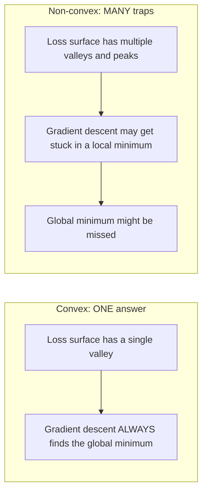
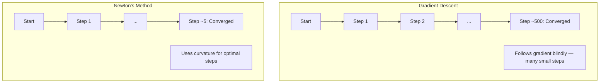
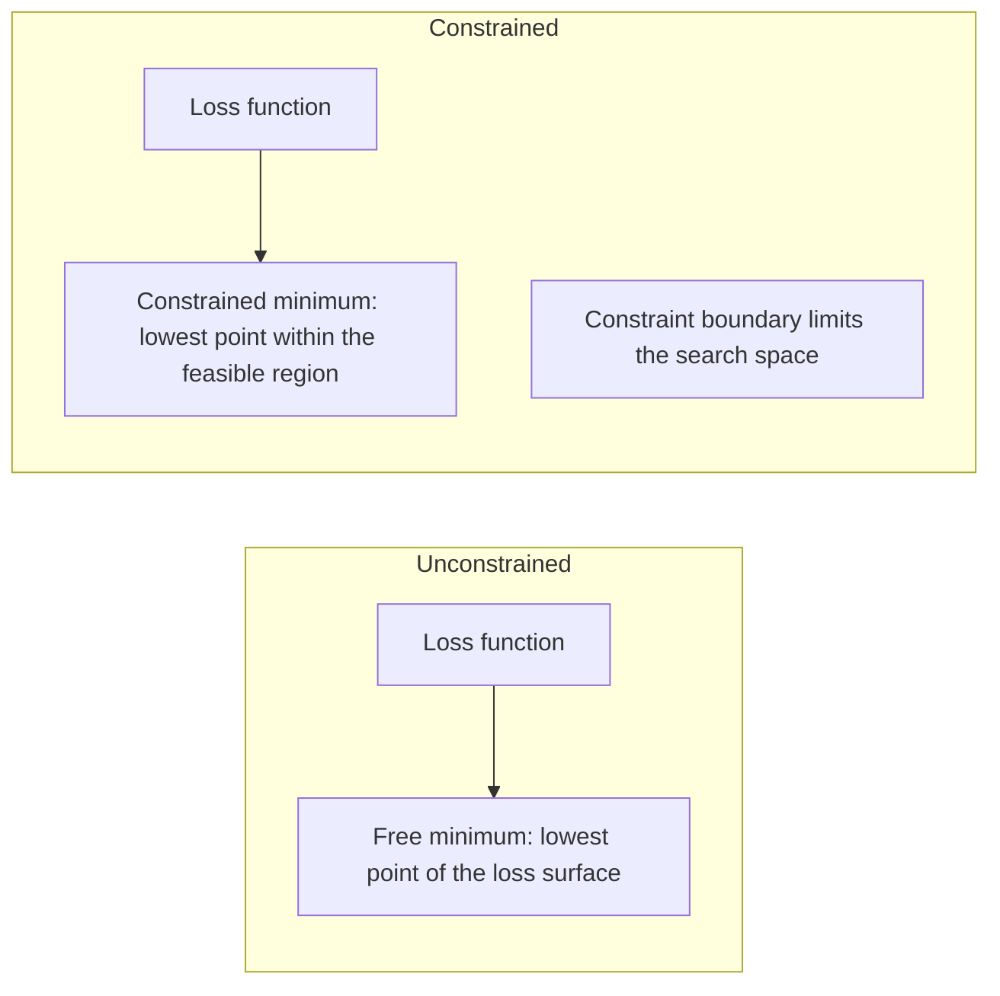
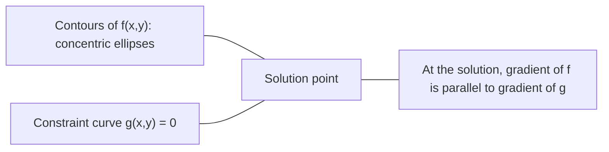

# بهینه سازی مخروط

> مشکلات مخلوط یک دره دارند شبکه های عصبی میلیون ها هستند. دانستن تفاوت مهم است.

**Type:** Build
**Language:**پیتون
**Prerequisites:** Phase 1, Lessons 04 (Calculus for ML), 08 (Optimization)
**Time:** ~90 minutes

## اهداف یادگیری

- آزمایش اینکه آیا یک تابع با استفاده از تعریف، مشتق دوم و معیارهای هسیان مخلوط است
- روش نیوتن را اجرا کنید و کنورژن مربع آن را با کاهش گرادیانت مقایسه کنید
- حل مشکلات بهینه سازی محدود با استفاده از ضربات لاگرنج و تفسیر شرایط KKT
- توضیح بده چرا منظره ی تلف شدن شبکه عصبی غیر متناوب است ولی SGD هنوز راه حل های خوبی پیدا می کند

## مشکل

درس ۸ به شما کاهش گرادینت، حرکت و آدم یاد داد. این بهینه سازی ها در هر سطح به پایین می روند. اما بدون هیچ تضمینی می آیند. کاهش گرادینت در یک منظره غیر خمیده ممکن است در حداقل محلی ضعیف فرود بیاید، در یک نقطه سعد گیر شود یا برای همیشه نوسان کند. شما به هر حال از آن استفاده کردید زیرا شبکه های عصبی خمیده نیستند و هیچ جایگزین ای وجود ندارد.

اما بسیاری از مشکلات یادگیری ماشین مخلوط هستند. بازپسین خطی، بازپسین لجستیک، SVMs، LASSO، بازپسین خروجی. برای این موارد، چیزی قوی تر وجود دارد: بهینه سازی با تضمین های ریاضی. یک مشکل مخلوط دقیقا یک دره دارد. هر الگوریتم که به پایین می رود به حداقل جهانی خواهد رسید. نیازی به شروع مجدد نیست. هیچ برنامه ی نرخ یادگیری نیست. هیچ دعا نیست.

درک کنوکسیت سه چیز را انجام می دهد. اول، آن به شما می گوید که مشکل شما آسان (کونیکس) در مقابل سخت (غیر کنوکس) است. دوم، آن به شما ابزار سریع تر مانند روش نیوتن برای مشکلات کنوکس می دهد. سوم، آن مفاهیم را که در سراسر ML ظاهر می شود توضیح می دهد: تنظیم به عنوان یک محدودیت، دوگانه در SVMs، و چرا یادگیری عمیق با نقض هر ویژگی خوب کنوکسیت به شما می دهد کار می کند.

## مفهوم

### مجموعه های مخلوط

مجموعه S مخلوط است اگر برای هر دو نقطه در S، بخش خط بین آنها نیز به طور کامل در S قرار دارد.

| Convex sets | Not convex |
|---|---|
| **Rectangle**: any two points inside can be connected by a line segment that stays inside | **Star/crescent shape**: a line between two interior points can pass outside the set |
| **Triangle**: same property holds for all interior points | **Donut/annulus**: the hole means some line segments leave the set |
| The line segment between any two points stays within the set | The line segment between some pairs of points exits the set |

آزمون رسمی: برای هر نقطه x، y در S و هر نقطه t در [0, 1]، نقطه tx + (1-t) y نیز در S است.

نمونه های مجموعه های مخروط:
- یک خط، یک هواپیما، همه R^n
- یک توپ (دوگ، توپ، هیپر اسپیر)
- یک نیمه فضا: {x: a^T x <= b}
- متقاطع هر عدد مجموعه های مخروط

نمونه های مجموعه های غیر خمیده:
- یک دونات (آنولوس)
- اتحاد دو دایره متناقض
- هر مجموعه ای که دارای "دنت" یا "جره" باشد

### عملکردهای مخروط

یک تابع f خم است اگر دامنه آن مجموعه خم است و برای هر دو نقطه x، y در دامنه آن و هر t در [0, 1]:

```
f(tx + (1-t)y) <= t*f(x) + (1-t)*f(y)
```

از لحاظ هندسی: قطعه خط بین هر دو نقطه در نمودار در بالای یا در نمودار قرار دارد.

| Property | Convex function | Non-convex function |
|---|---|---|
| **Line segment test** | The line between any two points on the graph lies **above or on** the curve | The line between some points on the graph dips **below** the curve |
| **Shape** | Single bowl/valley curving upward | Multiple peaks and valleys with mixed curvature |
| **Local minima** | Every local minimum is the global minimum | Multiple local minima may exist at different heights |

عملکردهای مخروط مشترک:
- f(x) = x^2 (پارابولا)
- f(x) = ٬ x (قيمة مطلق)
- f(x) = e^x (عکسونی)
- f(x) = max(0, x) (ReLU، اگرچه قطعه ای خطی است)
- f(x) = -log(x) برای x > 0 (log منفی)
- هر تابع خطی f ((x) = a^T x + b (هر دو مخلوط و مخلوط)

### آزمایش تراکم

سه آزمون عملي از ساده ترين تا سخت ترين

**Test 1: Second derivative test (1D).**اگر f'(x) >= 0 برای همه x، پس f مخلوط است.

- f(x) = x^2: f'(x) = 2 >= 0. مخلوط.
- f(x) = x^3: f''(x) = 6x. منفی برای x < 0.
- f(x) = e^x: f'(x) = e^x > 0. مخلوط.

**Test 2: Hessian test (multivariate).**اگر ماتریس هسیانی H(x) برای تمام x نیمه تعریف شده مثبت باشد، پس f مخلوط است. ماتریس هسیانی ماتریس مشتق های جزئی دوم است.

**Test 3: Definition test.**عدم مساوات f(tx + (1-t) y) <= t*f(x) + (1-t) *f(y) را مستقیماً بررسی کنید. برای عملکردهایی که مشتقات سخت محاسبه می شوند مفید است.

### چرا تعقيب مهم است

نظریه مرکزی بهینه سازی مخروط:

**For a convex function, every local minimum is a global minimum.**

این بدان معنی است که نزول گرادینت نمی تواند گیر شود. هر مسیر پایین تپه به همان پاسخ منجر می شود. الگوریتم تضمین شده به راه حل مطلوب تبدیل می شود.



پیامدهای:
- نیازی به بازخورد تصادفی نیست
- نیازی به برنامه های پیشرفته یادگیری نیست
- اثبات تراکم ممکن است (سرمایه بستگی به خواص تابع دارد)
- راه حل منحصر به فرد است (تا مناطق صاف)

### مخلوط با غیر مخلوط در ML

| Problem | Convex? | Why |
|---------|---------|-----|
| Linear regression (MSE) | Yes | Loss is quadratic in weights |
| Logistic regression | Yes | Log-loss is convex in weights |
| SVM (hinge loss) | Yes | Maximum of linear functions |
| LASSO (L1 regression) | Yes | Sum of convex functions is convex |
| Ridge regression (L2) | Yes | Quadratic + quadratic = convex |
| Neural network (any loss) | No | Nonlinear activations create non-convex landscape |
| k-means clustering | No | Discrete assignment step |
| Matrix factorization | No | Product of unknowns |

مدل های خطی با ضایعات مخروط مخروط هستند. وقتی لایه های پنهان با فعال سازی های غیر خطی اضافه می کنید، مخروطیت شکسته می شود.

### ماتریکس هسی

H Hessian یک تابع f: R^n -> R ماتریس n x n مشتق های جزئی دوم است.

```
H[i][j] = d^2 f / (dx_i dx_j)
```

برای f ((x, y) = x^2 + 3xy + y^2:

```
df/dx = 2x + 3y       d^2f/dx^2 = 2      d^2f/dxdy = 3
df/dy = 3x + 2y       d^2f/dydx = 3      d^2f/dy^2 = 2

H = [ 2  3 ]
    [ 3  2 ]
```

" هسی " به شما در مورد منحنیات میگه:
- ارزش های خاص تمام مثبت: تابع در هر جهت به بالا منحنی می شود (به این نقطه مخلوط است)
- ارزش های خاص تمام منفی: منحنیات به سمت پایین در هر جهت (کونکاو، حداکثر محلی)
- نشانه های مخلوط: نقطه سیله (در برخی جهت ها به بالا و در برخی دیگر به پایین خم می شود)
- ارزش خاص صفر: مسطح در این جهت (از دست رفته)

برای خم شدن، Hessian باید نیمه مشخص مثبت (همه ارزش های خاص >= 0) در همه جا باشد، نه فقط در یک نقطه.

### روش نیوتن

در حال حاضر، در حال کاهش درجه بندی، اطلاعات درجه اول (در حال گرادینت) استفاده می شود. روش نیوتن از اطلاعات درجه دوم (در حال هسیان) استفاده می کند. این یک مقربات مربع در نقطه فعلی مناسب است و مستقیما به حداقل این مربع می رود.

```
Update rule:
  x_new = x - H^(-1) * gradient

Compare to gradient descent:
  x_new = x - lr * gradient
```

روش نیوتن سرعت یادگیری مقیاس را با Hessian معکوس جایگزین می کند. این به طور خودکار اندازه و جهت گام را بر اساس منحنیات محلی تنظیم می کند.



مزایا:
- تراکم مربع نزدیک به حداقل (مربع خطای هر مرحله)
- بدون سرعت یادگیری برای تنظیم
- تغییر مقیاس (به هر حال کار می کند، بدون توجه به اینکه چگونه شما مشکل را پارامتر می کنید)

معایب:
- محاسبه Hessian هزینه O  n ^ 2) حافظه و O  n ^ 3) برای برگشت
- برای یک شبکه عصبی با 1 میلیون وزن، یعنی 10^12 ورودی و 10^18 عملیات
- برای یادگیری عمیق عملی نیست

### بهینه سازی محدود

بهینه سازی بدون محدودیت: حداقل f ((x) در تمام x.
بهینه سازی محدود: حداقل f ((x) تحت محدودیت ها.

مشکلات واقعی محدودیت هایی دارند. شما می خواهید هزینه ها را به حداقل برسانید اما بودجه شما محدود است. شما می خواهید خطا ها را به حداقل برسانید اما پیچیدگی مدل شما محدود است.



### ضربگر های لاگارنج

روش ضربگرهای لاگرنج یک مشکل محدود را به یک مشکل بدون محدودیت تبدیل می کند.

مشکل: حداقل کردن f  x) تحت g  x = 0.

راه حل: یک متغیر جدید (لامبدا ضربگر لاگارنج) را معرفی کنید و مشکل بدون محدودیت را حل کنید:

```
L(x, lambda) = f(x) + lambda * g(x)
```

در محلول، گرادینت L صفر است:

```
dL/dx = df/dx + lambda * dg/dx = 0
dL/dlambda = g(x) = 0
```

حس هندسی: در حداقل محدود، گرادینت f باید موازی با گرادینت محدودیت g باشد. اگر آنها موازی نبودند، می توان در امتداد سطح محدودیت حرکت کرد و f را بیشتر کاهش داد.



مثال: حداقل کردن f ((x,y) = x^2 + y^2 تحت x + y = 1.

```
L = x^2 + y^2 + lambda(x + y - 1)

dL/dx = 2x + lambda = 0  =>  x = -lambda/2
dL/dy = 2y + lambda = 0  =>  y = -lambda/2
dL/dlambda = x + y - 1 = 0

From first two: x = y
Substituting: 2x = 1, so x = y = 0.5, lambda = -1
```

نزدیک ترین نقطه خط x + y = 1 به اصل (0.5, 0.5) است.

### شرایط KKT

شرایط کاروش-کوهن-تکر ضربات لاگرنج را به محدودیت های نابرابری گسترش می دهد.

مشکل: حداقل f  x) تحت g  i  x) <= 0 برای i = 1 ، ..., m.

شرایط KKT (ضروری برای بهینه سازی):

```
1. Stationarity:    df/dx + sum(lambda_i * dg_i/dx) = 0
2. Primal feasibility:  g_i(x) <= 0  for all i
3. Dual feasibility:    lambda_i >= 0  for all i
4. Complementary slackness:  lambda_i * g_i(x) = 0  for all i
```

کمکی اضافی بینش کلیدی است: یا محدودیت فعال است (g_i = 0، محلول در مرز قرار دارد) یا ضربگر صفر است (محدودیت مهم نیست). یک محدودیت که بر محلول تأثیر نمی گذارد lambda = 0 دارد.

شرایط KKT برای SVM ها محور هستند. ویکتورهای پشتیبانی نقاط داده هایی هستند که محدودیت آن فعال است (lambda > 0). همه نقاط داده های دیگر lambda = 0 دارند و بر مرز تصمیم گیری تأثیر نمی گذارند.

### تنظیم به عنوان بهینه سازی محدود

تنظیم L1 و L2 ترفند های تعسفی نیستند بلکه مشکلات بهینه سازی محدود در حال پنهان شدن هستند.

**L2 regularization (Ridge):**

```
minimize  Loss(w)  subject to  ||w||^2 <= t

Equivalent unconstrained form:
minimize  Loss(w) + lambda * ||w||^2
```

محدودیت یازم در یازم در یازم در یازم در یازم در یازم در یازم در یازم در یازم در یازم در یازم در یازم در یازم در یازم در یازم در یازم در یازم در یازم در یازم در یازم در یازم در یازم در یازم در یازم در یازم در یازم در یازم در یازم در یازم در یازم در یازم در یازم در یازم در یازم در یازم در یازم در یازم در یازم در یازم در یازم در یازم در یازم در یازم در یازم در یازم در یازم در یازم در یازم در یازم در یازم در یازم در یازم در یازم در یازم در یازم در یازم در یازم در یازم در یازم در یازم در یازم در یازم در یازم در یازم در یازم در یازم در یازم در یازم در یازم در یازم در یازم در یازم در یازم در یازم در یازم در یازم در یازم در یازم در یازم در یازم در یازم در یازم در یازم در یازم در یازم در یازم در یازم در یازم در یازم در یازم در یازم در یازم در یازم در یازم در یازم در یازم در یازم در یازم در یازم در یازم در یازم در یازم در یازم در یازم در یازم در یازم در یازم می است

**L1 regularization (LASSO):**

```
minimize  Loss(w)  subject to  ||w||_1 <= t

Equivalent unconstrained form:
minimize  Loss(w) + lambda * ||w||_1
```

محدودیت "ژو" (= t) یک الماس را تعریف می کند ( مربع چرخش در 2D).

| Property | L2 constraint (circle) | L1 constraint (diamond) |
|---|---|---|
| **Constraint shape** | Circle (sphere in higher dims) | Diamond (rotated square in 2D) |
| **Where loss contour touches** | Smooth boundary — any point on the circle | Corner — aligned with an axis |
| **Solution behavior** | Weights are small but nonzero | Some weights are exactly zero (sparse) |
| **Result** | Weight shrinkage | Feature selection |

این توضیح می دهد که چرا L1 مدل های کمیاب (انتخاب ویژگی ها) را تولید می کند در حالی که L2 فقط وزن را کاهش می دهد. الماس گوشه هایی را با محورها خط می دهد. خطوط از دست دادن بیشتر احتمال دارد به گوشه ای لمس کند و یک یا چند وزن را دقیقا به صفر تنظیم کند.

### دوگانه بودن

هر مشکل بهینه سازی محدود (اول) یک مشکل همراه (دوگانه) دارد. برای مشکلات مخلوط، اول و دوگانه دارای همان ارزش مطلوب هستند. این دوگانه ی قوی است.

تابع دوگانه لاگارنج:

```
Primal: minimize f(x) subject to g(x) <= 0
Lagrangian: L(x, lambda) = f(x) + lambda * g(x)
Dual function: d(lambda) = min_x L(x, lambda)
Dual problem: maximize d(lambda) subject to lambda >= 0
```

چرا دوگانه بودن مهمه:
- مشکل دوگانه گاهی اوقات حلش آسان تر از مشکل اولیه است
- SVM ها به صورت دوگانه خود حل می شوند، جایی که مشکل بستگی به محصولات نقطه ای بین نقاط داده دارد (که امکان ترفند هسته را فراهم می کند)
- دوگانه یک مرز پایین تر را در بهینه اولیه فراهم می کند، مفید برای بررسی کیفیت محلول

برای SVM ها به طور خاص:

```
Primal: find w, b that maximize the margin 2/||w|| subject to
        y_i(w^T x_i + b) >= 1 for all i

Dual:   maximize sum(alpha_i) - 0.5 * sum_ij(alpha_i * alpha_j * y_i * y_j * x_i^T x_j)
        subject to alpha_i >= 0 and sum(alpha_i * y_i) = 0

The dual only involves dot products x_i^T x_j.
Replace x_i^T x_j with K(x_i, x_j) to get the kernel trick.
```

### چرا یادگیری عمیق با وجود عدم تعقّب کار می کند

عملکردهای از دست دادن شبکه عصبی کاملا غیر متناوب هستند. با هر اندازه گیری کلاسیک، بهینه سازی آنها باید شکست یابد. با این حال، کاهش گرادینت استوکاستیک راه حل های خوبی را به طور قابل اعتماد پیدا می کند. چندین عامل این را توضیح می دهد.

**Most local minima are good enough.**در فضاهای ابعاد بالا، نقاط انتقادی تصادفی (که در آن گرادینت صفر است) به طور گسترده ای نقاط سیله هستند، نه حداقل های محلی. حداقل های محلی موجود به طور معمول دارای ارزش های از دست دادن نزدیک به حداقل جهانی هستند. گیر در حداقل محلی وحشتناک بسیار بعید است هنگامی که فضای پارامتر دارای میلیون ها ابعاد است.

**Saddle points, not local minima, are the real obstacle.**در یک تابع با پارامترهای n، یک نقطه سیله ترکیبی از جهت های خم مثبت و منفی دارد. برای یک نقطه انتقادی تصادفی در ابعاد بالا، احتمال وجود همه ارزش های خاص n مثبت (حداقل محلی) حدود 2^-n است. تقریباً همه نقاط انتقادی نقاط سیله هستند. صدا SGD به فرار از آنها کمک می کند.

**Overparameterization smooths the landscape.**شبکه هایی که پارامترهای بیشتری نسبت به نمونه های آموزشی دارند، سطوح خستگی هموارتر و متصل تر دارند. شبکه های گسترده تر حداقل های محلی منفی کمتری دارند. این برعکس است، اما از نظر تجربی سازگار است.

**Loss landscape structure:**

| Property | Low-dimensional space | High-dimensional space |
|---|---|---|
| **Landscape** | Many isolated peaks and valleys | Smoothly connected valleys |
| **Minima** | Many isolated local minima | Few bad local minima; most are near-optimal |
| **Navigation** | Hard to find global minimum | Many paths lead to good solutions |
| **Critical points** | Mix of local minima and saddle points | Overwhelmingly saddle points, not local minima |

**Stochastic noise acts as implicit regularization.**SGD دسته کوچک اضافه می کند که مانع از تنظیم به حداقل های شدید می شود. حداقل های شدید بیش از حد متناسب؛ حداقل های صاف عمومی می شوند. ضوضای تعصب بهینه سازی به سمت مناطق صاف چشم انداز زیان است.

### روش های درجه دوم در عمل

روش نیوتن خالص برای مدل های بزرگ غیر عملی است. چندین محاسبات اطلاعات درجه دوم را قابل استفاده می کند.

**L-BFGS (Limited-memory BFGS):**به منظور استفاده از آخرین تفاوت های گرادینت m، Hessian برعکس را نزدیک می کند. به جای O  n^2 به O  m m) حافظه نیاز دارد. برای مشکلات با حداکثر ~ 10،000 پارامتر خوب کار می کند. در ML کلاسیک (رجریشن لوژیستیک، CRF) استفاده می شود اما یادگیری عمیق نیست.

**Natural gradient:**از ماتریس اطلاعات فیشر (توقع شده هسیان احتمالات تراشه) به جای استاندارد هسیان استفاده می کند. این حساب برای هندسه توزیع احتمالات است. K-FAC (کرونکر-فاکتور شده منحنیات نزدیک) متریس فیشر را به عنوان یک محصول کرونکر نزدیک می کند و آن را برای شبکه های عصبی عملی می کند.

**Hessian-free optimization:**از گرادیانت کنجوجت برای حل Hx = g بدون تشکیل H استفاده می کند. تنها نیاز به محصولات ویکتور هسی دارد که می تواند با استفاده از فرقی خودکار در زمان O (n) محاسبه شود.

**Diagonal approximations:**لحظه دوم آدم یک تقرب دیگنالی از دیگنالی هسیان است. AdaHessian این را با استفاده از عناصر دیگنالی هسیان واقعی از طریق تخمینگر هچینسون گسترش می دهد.

| Method | Memory | Per-step cost | When to use |
|--------|--------|--------------|-------------|
| Gradient descent | O(n) | O(n) | Baseline, large models |
| Newton's method | O(n^2) | O(n^3) | Small convex problems |
| L-BFGS | O(mn) | O(mn) | Medium convex problems |
| Adam | O(n) | O(n) | Deep learning default |
| K-FAC | O(n) | O(n) per layer | Research, large-batch training |

```figure
convex-vs-nonconvex
```

## آن را بسازید

### مرحله ی اول: چک کنویکسیت

یک تابع بسازید که با نمونه گیری نقاط و بررسی تعریف، تعویض را تجربی آزمایش کند.

```python
import random
import math

def check_convexity(f, dim, bounds=(-5, 5), samples=1000):
    violations = 0
    for _ in range(samples):
        x = [random.uniform(*bounds) for _ in range(dim)]
        y = [random.uniform(*bounds) for _ in range(dim)]
        t = random.uniform(0, 1)
        mid = [t * xi + (1 - t) * yi for xi, yi in zip(x, y)]
        lhs = f(mid)
        rhs = t * f(x) + (1 - t) * f(y)
        if lhs > rhs + 1e-10:
            violations += 1
    return violations == 0, violations
```

### مرحله دوم: روش نیوتن برای 2D

روش نيوتن را با استفاده از هسيان صريح اجرا کنيد. سرعت نزديک با نزديک گرادينت را مقایسه کنيد.

```python
def newtons_method(f, grad_f, hessian_f, x0, steps=50, tol=1e-12):
    x = list(x0)
    history = [x[:]]
    for _ in range(steps):
        g = grad_f(x)
        H = hessian_f(x)
        det = H[0][0] * H[1][1] - H[0][1] * H[1][0]
        if abs(det) < 1e-15:
            break
        H_inv = [
            [H[1][1] / det, -H[0][1] / det],
            [-H[1][0] / det, H[0][0] / det],
        ]
        dx = [
            H_inv[0][0] * g[0] + H_inv[0][1] * g[1],
            H_inv[1][0] * g[0] + H_inv[1][1] * g[1],
        ]
        x = [x[0] - dx[0], x[1] - dx[1]]
        history.append(x[:])
        if sum(gi ** 2 for gi in g) < tol:
            break
    return history
```

### مرحله 3: حل کننده ضربگر لاگارنج

بهینه سازی محدود را با استفاده از کاهش گرادینت در لاگارنجین حل کنید.

```python
def lagrange_solve(f_grad, g_val, g_grad, x0, lr=0.01,
                   lr_lambda=0.01, steps=5000):
    x = list(x0)
    lam = 0.0
    history = []
    for _ in range(steps):
        fg = f_grad(x)
        gv = g_val(x)
        gg = g_grad(x)
        x = [
            xi - lr * (fgi + lam * ggi)
            for xi, fgi, ggi in zip(x, fg, gg)
        ]
        lam = lam + lr_lambda * gv
        history.append((x[:], lam, gv))
    return history
```

### مرحله 4: مقایسه ی درجه اول و درجه دوم

از پايين گرادينت و روش نيوتن بر روي همون تابع مربع استفاده کنين و مراحل رو به سمت تقارب شمارش کنين

```python
def quadratic(x):
    return 5 * x[0] ** 2 + x[1] ** 2

def quadratic_grad(x):
    return [10 * x[0], 2 * x[1]]

def quadratic_hessian(x):
    return [[10, 0], [0, 2]]
```

روش نیوتن در یک مرحله (این برای مربع ها دقیق است) به هم می رسد. کاهش درجه به صدها مرحله می رود زیرا ارزش های خاص هسیان با یک فاکتور 5 متفاوت است، ایجاد یک دره طولانی می شود.

## ازش استفاده کن

تجزیه و تحلیل کنوکسیت به طور مستقیم هنگام انتخاب مدل ها و حل کننده های ML اعمال می شود.

برای مشکلات مخلوط (رجساسیون لوژیستیک، SVM، LASSO):
- استفاده از حل کننده های اختصاصی (liblinear، CVXPY، scipy.optimize.minimize با method='L-BFGS-B')
- انتظار راه حل جهانی منحصر به فرد
- روش های دومین درجه عملی و سریع هستند

برای مشکلات غیر خمیده (شبکه های عصبی):
- استفاده از روش های درجه اول (SGD، Adam)
- قبول کن که راه حل بستگی به شروع و تصادفی داره
- استفاده از پارامترسازی بیش از حد، صدا و برنامه های نرخ یادگیری به عنوان تنظیم ضمنی
- وقت خود را برای جستجوی حداقل جهانی تلف نکنید. حداقل محلی خوب کافی است.

```python
from scipy.optimize import minimize

result = minimize(
    fun=lambda w: sum((y - X @ w) ** 2) + 0.1 * sum(w ** 2),
    x0=np.zeros(d),
    method='L-BFGS-B',
    jac=lambda w: -2 * X.T @ (y - X @ w) + 0.2 * w,
)
```

برای SVM، فرمول دوگانه اجازه می دهد تا از ترفند هسته استفاده کنید:

```python
from sklearn.svm import SVC

svm = SVC(kernel='rbf', C=1.0)
svm.fit(X_train, y_train)
print(f"Support vectors: {svm.n_support_}")
```

## تمرینات

1. **Convexity gallery.**این تابع ها را با استفاده از چکگر برای تراکم آزمایش کنید: f(x) = x^4, f(x) = sin(x), f(x,y) = x^2 + y^2, f(x,y) = x*y, f(x) = max(x, 0). توضیح دهید که چرا هر نتیجه منطقی است.

2. **Newton vs gradient descent race.**هر دو روش را با f ((x,y) = 50*x^2 + y^2 از نقطه شروع (10,10) اجرا کنید. هر کدام از مراحل برای رسیدن به ضرر < 1e-10 چه تعداد مرحله ای نیاز دارد؟

3. **Lagrange multiplier geometry.**حداقل f ((x,y) = (x-3)^2 + (y-3)^2 با تابع x + 2y = 4. با بررسی اینکه گرادیئنت f موازی با گرادیئنت g در محلول است، محلول را تأیید کنید.

4. **Regularization constraint.**پیاده سازی بهینه سازی محدود L1: حداقل (x-3)^2 + (y-2)^2 تابع به ٬x ٬ ٬ ٬ ٬ ٬ ٬ ٬ ٬ ٬ ٬ ٬ ٬ ٬ ٬ ٬ ٬ ٬ ٬ ٬ ٬ ٬ ٬ ٬ ٬ ٬ ٬ ٬ ٬ ٬ ٬ ٬ ٬ ٬ ٬ ٬ ٬ ٬ ٬ ٬ ٬ ٬ ٬ ٬ ٬ ٬ ٬ ٬ ٬ ٬ ٬ ٬ ٬ ٬ ٬ ٬ ٬ ٬ ٬ ٬ ٬ ٬ ٬ ٬ ٬ ٬ ٬ ٬ ٬ ٬ ٬ ٬ ٬ ٬ ٬ ٬ ٬ ٬ ٬ ٬ ٬ ٬ ٬ ٬ ٬ ٬ ٬ ٬ ٬ ٬ ٬ ٬ ٬ ٬ ٬ ٬ ٬ ٬ ٬ ٬ ٬ ٬ ٬ ٬ ٬ ٬ ٬ ٬ ٬ ٬ ٬ ٬ ٬ ٬ ٬ ٬ ٬ ٬ ٬ ٬ ٬ ٬ ٬ ٬ ٬ ٬ ٬ ٬ ٬ ٬ ٬ ٬ ٬ ٬ ٬ ٬ ٬ ٬ ٬ ٬ ٬ ٬ ٬ ٬ ٬ ٬ ٬ ٬ ٬ ٬ ٬ ٬ ٬ ٬ ٬ ٬ ٬ ٬ ٬ ٬ ٬ ٬ ٬ ٬ ٬ ٬ ٬ ٬ ٬ ٬ ٬ ٬ ٬ ٬ ٬ ٬ ٬ ٬ ٬ ٬ ٬ ٬ ٬ ٬ ٬ ٬ ٬ ٬ ٬ ٬ ٬ ٬ ٬ ٬ ٬ ٬ ٬ ٬ ٬ ٬ ٬ ٬ ٬ ٬ ٬ ٬ ٬ ٬ ٬ ٬ ٬ ٬ ٬ ٬ ٬ ٬ ٬ ٬                                                   

5. **Hessian eigenvalue analysis.**Hessian را از تابع Rosenbrock در (1,1) و در (-1,1) محاسبه کنید. ارزش های خاص را در هر دو نقطه محاسبه کنید. ارزش های خاص به شما در مورد منحنی در حداقل در مقابل دور از آن چه می گویند؟

## اصطلاحات کلیدی

| Term | What it means |
|------|---------------|
| Convex set | A set where the line segment between any two points in the set stays inside the set |
| Convex function | A function where the line between any two points on its graph lies above or on the graph. Equivalently, Hessian is positive semidefinite everywhere |
| Local minimum | A point lower than all nearby points. For convex functions, every local minimum is the global minimum |
| Global minimum | The lowest point of a function over its entire domain |
| Hessian matrix | The matrix of all second partial derivatives. Encodes curvature information |
| Positive semidefinite | A matrix whose eigenvalues are all non-negative. The multidimensional analogue of "second derivative >= 0" |
| Condition number | Ratio of largest to smallest eigenvalue of the Hessian. High condition number means elongated valleys and slow gradient descent |
| Newton's method | Second-order optimizer that uses the inverse Hessian to determine step direction and size. Quadratic convergence near the minimum |
| Lagrange multiplier | A variable introduced to convert a constrained optimization problem into an unconstrained one |
| KKT conditions | Necessary conditions for optimality with inequality constraints. Generalize Lagrange multipliers |
| Complementary slackness | At the solution, either a constraint is active or its multiplier is zero. Never both nonzero |
| Duality | Every constrained problem has a companion dual problem. For convex problems, both have the same optimal value |
| Strong duality | Primal and dual optimal values are equal. Holds for convex problems satisfying Slater's condition |
| L-BFGS | Approximate second-order method that stores the last m gradient differences instead of the full Hessian |
| Saddle point | A point where the gradient is zero but it is a minimum in some directions and a maximum in others |
| Overparameterization | Using more parameters than training examples. Smooths the loss landscape and reduces bad local minima |

## خواندن بیشتر

- [Boyd & Vandenberghe: Convex Optimization](https://web.stanford.edu/~boyd/cvxbook/)- کتاب درسی استاندارد، به صورت رایگان در اینترنت
- [Bottou, Curtis, Nocedal: Optimization Methods for Large-Scale Machine Learning (2018)](https://arxiv.org/abs/1606.04838)- پل های نظریه بهینه سازی مخروط و تمرین یادگیری عمیق
- [Choromanska et al.: The Loss Surfaces of Multilayer Networks (2015)](https://arxiv.org/abs/1412.0233)چرا منظره های شبکه عصبی غیر مخلوط به اندازه ای بد نیستند که به نظر می رسند
- [Nocedal & Wright: Numerical Optimization](https://link.springer.com/book/10.1007/978-0-387-40065-5)- مرجع جامع برای روش نیوتن، L-BFGS و بهینه سازی محدود
