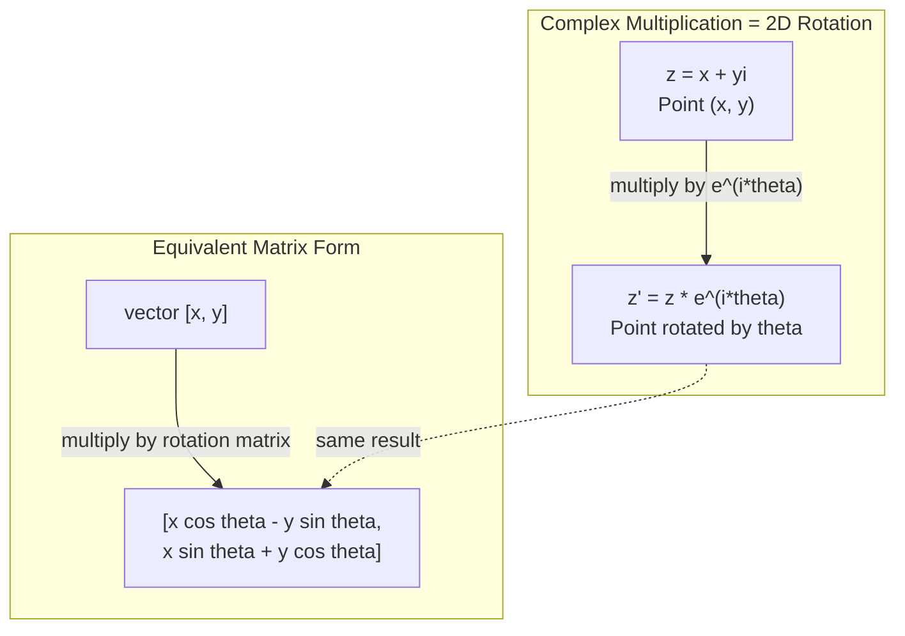
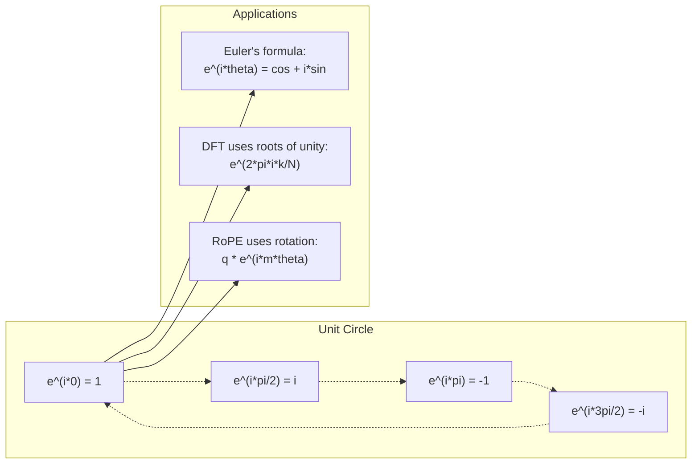

# اعداد پیچیده برای هوش مصنوعی

> ریشه مربع -1 غیر خیالی نیست. این کلید چرخش، فرکانس و نیمی از پردازش سیگنال است.

**Type:** Learn
**Language:**پیتون
**Prerequisites:** Phase 1, Lessons 01-04 (linear algebra, calculus)
**Time:** ~60 minutes

## اهداف یادگیری

- انجام حسابداری پیچیده (جمع، ضرب، تقسیم، مخلوط) در شکل مستطیل و قطبی
- استفاده از فرمول یولر برای تبدیل بین نمادین پیچیده و عملکردهای تریگونومیتری
- پیاده سازی تغییر فوریر متمایز با استفاده از ریشه های پیچیده ی وحدت
- توضیح دهید که چگونه چرخش پیچیده در زمینه کدگذاری موقعیت RoPE و sinusidal در ترانسفورماتورها است.

## مشکل

تو يه مقاله ي درباره ي فرج هاي فوري باز مي کني و اونجاست`i`شما به کدگذاری موقعیت ترانسفورماتور نگاه می کنید و می بینید`sin`و`cos`در فرکانس های مختلف -- بخش های واقعی و خیالی از نمادین پیچیده. شما در مورد محاسبات کوانتومی می خوانید و همه چیز را در فضاهای پیچیده متری بیان می کنید.

اعداد پیچیده به نظر می رسد تجریبه است. یک سیستم عدد ساخته شده بر روی ریشه مربع -1 به نظر می رسد مانند یک ترفند ریاضی است. اما این ترفند نیست. این زبان طبیعی چرخش و نوسان است. هر بار چیزی چرخش، لرزش یا نوسان، اعداد پیچیده ابزار مناسب هستند.

بدون درک اعداد پیچیده، شما نمی توانید Transform Fourier را درک کنید. شما نمی توانید FFT را درک کنید. شما نمی توانید درک کنید که چگونه RoPE (Rotary Position Embedding) در مدل های زبان مدرن کار می کند. شما نمی توانید درک کنید که چرا کدگذاری موقعیت سینوسایدی در کاغذ اصلی Transformer از فرکانس هایی که انجام می دهند استفاده می کند.

این درس ریاضیات پیچیده را از ابتدا می سازد، آن را با هندسه متصل می کند، و دقیقاً به شما نشان می دهد که اعداد پیچیده در یادگیری ماشین کجا ظاهر می شوند.

## مفهوم

### یک عدد پیچیده چیست؟

یک عدد پیچیده دو قسمت دارد: یک قسمت واقعی و یک قسمت خیالی.

```
z = a + bi

where:
  a is the real part
  b is the imaginary part
  i is the imaginary unit, defined by i^2 = -1
```

این است. شما خط اعداد را به یک خط دراز می کنید. اعداد واقعی روی یک محور قرار دارند. اعداد خیالی روی دیگری قرار دارند. هر عدد پیچیده نقطه ای در این خط است.

### ریاضیات پیچیده

**Addition.**قسمت های واقعی رو هم جمع کنید، قسمت های خیالی رو هم جمع کنید.

```
(a + bi) + (c + di) = (a + c) + (b + d)i

Example: (3 + 2i) + (1 + 4i) = 4 + 6i
```

**Multiplication.**از قانون توزیع استفاده کنید و به یاد داشته باشید که i^2 = -1.

```
(a + bi)(c + di) = ac + adi + bci + bdi^2
                 = ac + adi + bci - bd
                 = (ac - bd) + (ad + bc)i

Example: (3 + 2i)(1 + 4i) = 3 + 12i + 2i + 8i^2
                            = 3 + 14i - 8
                            = -5 + 14i
```

**Conjugate.**علامت قسمت خیالی رو برگردونی

```
conjugate of (a + bi) = a - bi
```

محصول یک عدد پیچیده و مخلوط آن همیشه واقعی است:

```
(a + bi)(a - bi) = a^2 + b^2
```

**Division.**عدد و نامگذاری را با مخلوط نامگذاری ضرب کنید.

```
(a + bi) / (c + di) = (a + bi)(c - di) / (c^2 + d^2)
```

این بخش خیالی را از نامزن حذف می کند، و به شما یک عدد پیچیده پاک می دهد.

### سطح پیچیده

خط پیچیده هر عدد پیچیده را به نقطه 2D نقشه می زند. محور افقی محور واقعی است، محور عمودی محور خیالی است.

```
z = 3 + 2i  corresponds to the point (3, 2)
z = -1 + 0i corresponds to the point (-1, 0) on the real axis
z = 0 + 4i  corresponds to the point (0, 4) on the imaginary axis
```

یک عدد پیچیده همزمان یک نقطه و یک بردار از اصل است. این تفسیر دوگانه چیزی است که اعداد پیچیده را برای هندسه مفید می کند.

### شکل قطبی

هر نقطه ای در خط می تواند با فاصله اش از اصل و زاویه اش از محور واقعی مثبت توصیف شود.

```
z = r * (cos(theta) + i*sin(theta))

where:
  r = |z| = sqrt(a^2 + b^2)     (magnitude, or modulus)
  theta = atan2(b, a)             (phase, or argument)
```

شکل مستطیل (a + bi) برای جمع کردن خوب است. شکل قطبی (r، theta) برای ضرب خوب است.

**Multiplication in polar form.**مقادیر را ضرب کنید، زاویه ها را اضافه کنید.

```
z1 = r1 * e^(i*theta1)
z2 = r2 * e^(i*theta2)

z1 * z2 = (r1 * r2) * e^(i*(theta1 + theta2))
```

به همین دلیل اعداد پیچیده برای چرخش مناسب هستند. ضرب با یک عدد پیچیده با مقادیر 1 یک چرخش خالص است.

### فرمول یولر

پل بین نمادین پیچیده و تریگونومیتری:

```
e^(i*theta) = cos(theta) + i*sin(theta)
```

این مهم ترین فرمول در این درس است. وقتی تیتا = پی:

```
e^(i*pi) = cos(pi) + i*sin(pi) = -1 + 0i = -1

Therefore: e^(i*pi) + 1 = 0
```

پنج ثابت اساسی (e, i, pi, 1, 0) در یک معادله مرتبط هستند.

### چرا فرمول یولر برای ML مهم است

فرمول "ایلر" میگه`e^(i*theta)`در theta = 0 شما در (1, 0) هستید. در theta = pi/2, شما در (0, 1). در theta = pi, شما در (-1, 0) هستید. در theta = 3 * pi/2, شما در (0, -1). یک چرخش کامل theta = 2 * pi است.

این بدان معنی است که نمادین پیچیده چرخش هستند. و چرخش ها در هر جا در پردازش سیگنال و ML هستند.

### اتصال به چرخش دو بعدی

ضرب عدد پیچیده (x + yi) با e^(i*theta) نقطه (x, y) را با زاویه theta در اطراف اصل چرخش می کند.

```
Rotation via complex multiplication:
  (x + yi) * (cos(theta) + i*sin(theta))
  = (x*cos(theta) - y*sin(theta)) + (x*sin(theta) + y*cos(theta))i

Rotation via matrix multiplication:
  [cos(theta)  -sin(theta)] [x]   [x*cos(theta) - y*sin(theta)]
  [sin(theta)   cos(theta)] [y] = [x*sin(theta) + y*cos(theta)]
```

آنها نتایج مشابهی را تولید می کنند. ضرب پیچیده چرخش دو بعدی است. ماتریس چرخش فقط ضرب پیچیده ای است که با نماد ماتریس نوشته شده است.



### فیزورها و سیگنال های چرخش

یک نمادین پیچیده e^(i*omega*t) یک نقطه است که در اطراف دایره واحد در فرکانس زاویه ای omega چرخش می کند.

بخش واقعی این نقطه چرخش cos(omega*t است. بخش خیالی sin(omega*t است. یک سیگنال سینوسایدی سایه یک عدد پیچیده چرخش است.

```
e^(i*omega*t) = cos(omega*t) + i*sin(omega*t)

Real part:      cos(omega*t)    -- a cosine wave
Imaginary part: sin(omega*t)    -- a sine wave
```

این است که تصویر فیزور. به جای ردیابی یک موج سینوس حرکت می کنید، شما یک تیر چرخش را به آرامی ردیابی می کنید. تغییر مراحل تبدیل به تعویض زاویه می شود. تغییرات amplitude تبدیل به تغییرات بزرگی می شود. اضافه شدن سیگنال ها تبدیل به اضافه شدن ویکتور می شود.

### ریشه ی وحدت

ریشه های N-th یگانگی N نقطه های مساوی در دایره واحد هستند:

```
w_k = e^(2*pi*i*k/N)    for k = 0, 1, 2, ..., N-1
```

برای N = 4، ریشه ها عبارتند از: 1، i، -1، -i (چهار نقطه کامپوس).
برای N=8، چهار نقطه کامپوس و چهار قطب قطب قطب را دریافت می کنید.

ریشه های وحدت پایه ی ترانسفورم فوریتر متمایز هستند. DFT سیگنال را به اجزای این فرکانس های N با فاصله برابر تجزیه می کند.

### اتصال به DFT

تغییر فوریتر متمایز یک سیگنال x[0], x[1], ..., x[N-1] عبارت است از:

```
X[k] = sum_{n=0}^{N-1} x[n] * e^(-2*pi*i*k*n/N)
```

هر X[k] اندازه گیری می کند که سیگنال چقدر با ریشه kth اتحاد ارتباط دارد - یک سینوساید پیچیده در فرکانس k. DFT سیگنال را به N فازورهای چرخش تقسیم می کند و به شما طول و عرض و مرحله هر یک از آنها می گوید.

### چرا من خيالي نيستم

کلمه "تصور" یک تصادف تاریخی است. دکارتس آن را به طور رد کننده استفاده کرد. اما من از اعداد منفی بیشتر از زمانی که مردم آنها را برای اولین بار رد کردند، تصور نمی کنم. اعداد منفی پاسخ می دهند "چه چیزی را از 5 برای بدست آوردن 3 حذف می کنید؟" واحد تخیل پاسخ می دهد "چه چیزی را به مربع برای بدست آوردن -1 تقسیم می کنید؟"

به طور مفیدی تر: i یک عامل چرخش ۹۰ درجه است. یک عدد واقعی را با i ضرب کنید، ۹۰ درجه به محور خیالی چرخش می کنید. دوباره با i ضرب کنید (i^2) ، ۹۰ درجه دیگر چرخش می کنید - اکنون شما در جهت منفی واقعی اشاره می کنید. به همین دلیل i^2 = -۱. این معجزه نیست. این یک نیمه چرخش است که از دو چهار چهارم چرخش ساخته شده است.

به همین دلیل اعداد پیچیده در همه جا در مهندسی وجود دارد. هر چیزی که چرخش می کند -- امواج الکترومغناطیسی، حالت های کوانتومی، نوسانات سیگنال، کد بندی موقعیت - به طور طبیعی توسط اعداد پیچیده توصیف می شود.

### نمادین پیچیده در مقابل عملکردهای تریگونومیتی

قبل از فرمول یولر، مهندسان سیگنال ها را به عنوان A*cos(omega*t + phi) - امپلیتوود A، فرکانس omega، فاز phi نوشتند. این کار می کند اما ریاضیات را دردناک می کند. اضافه کردن دو کوسین با مراحل مختلف به هویت های تریگونومیتری نیاز دارد.

با نمادین پیچیده، همان سیگنال A*e^(i*(omega*t + phi است)). اضافه کردن دو سیگنال فقط اضافه کردن دو عدد پیچیده است. ضرب (مودول کردن) فقط ضرب بزرگی و اضافه کردن زاویه است. تغییر مرحله تبدیل به اضافه زاویه می شود. تغییر فرکانس تبدیل به ضربات توسط فازورها می شود.

کل زمینه پردازش سیگنال به علامت های نمایی پیچیده تغییر داد زیرا ریاضیات تمیز تر است. "سیگنال واقعی" همیشه تنها بخشی واقعی از نمایش پیچیده است. بخش خیالی به عنوان حسابداری همراه است، به طوری که تمام الجبر به طور طبیعی کار می کند.

### اتصال به ترانسفورماتورها

**Sinusoidal positional encodings**(ورق اصلی ترانسفورماتور):

```
PE(pos, 2i) = sin(pos / 10000^(2i/d))
PE(pos, 2i+1) = cos(pos / 10000^(2i/d))
```

جفت های گناه و cos بخش های واقعی و خیالی از نمادین پیچیده در فرکانس های مختلف هستند. هر فرکانس یک "تحلیل" مختلف برای موقعیت کدگذاری را فراهم می کند. فرکانس های پایین به آرامی تغییر می کنند (وضعیت خشن). فرکانس های بالا به سرعت تغییر می کنند (وضعیت خوب). با هم آنها به هر موقعیت یک اثر انگشت فرکانس منحصر به فرد می دهند.

**RoPE (Rotary Position Embedding)**این روش به طور صریح و مترو کلید را با ماتریس های پیچیدہ چرخش ضرب می کند. موقعیت نسبی بین دو نشانه به زاویه چرخش تبدیل می شود. توجه با استفاده از این مترو چرخش محاسبه می شود، که باعث می شود مدل به موقعیت نسبی از طریق ضرب پیچیده حساس باشد.

| Operation | Algebraic Form | Geometric Meaning |
|-----------|---------------|-------------------|
| Addition | (a+c) + (b+d)i | Vector addition in the plane |
| Multiplication | (ac-bd) + (ad+bc)i | Rotate and scale |
| Conjugate | a - bi | Reflect over real axis |
| Magnitude | sqrt(a^2 + b^2) | Distance from origin |
| Phase | atan2(b, a) | Angle from positive real axis |
| Division | multiply by conjugate | Reverse rotation and rescale |
| Power | r^n * e^(i*n*theta) | Rotate n times, scale by r^n |



```figure
roots-of-unity
```

## آن را بسازید

### مرحله اول: کلاس پیچیده

یک کلاس عدد پیچیده بسازید که از حساب، اندازه، مرحله و تبدیل بین شکل های مستطیل و قطبی پشتیبانی کند.

```python
import math

class Complex:
    def __init__(self, real, imag=0.0):
        self.real = real
        self.imag = imag

    def __add__(self, other):
        return Complex(self.real + other.real, self.imag + other.imag)

    def __mul__(self, other):
        r = self.real * other.real - self.imag * other.imag
        i = self.real * other.imag + self.imag * other.real
        return Complex(r, i)

    def __truediv__(self, other):
        denom = other.real ** 2 + other.imag ** 2
        r = (self.real * other.real + self.imag * other.imag) / denom
        i = (self.imag * other.real - self.real * other.imag) / denom
        return Complex(r, i)

    def magnitude(self):
        return math.sqrt(self.real ** 2 + self.imag ** 2)

    def phase(self):
        return math.atan2(self.imag, self.real)

    def conjugate(self):
        return Complex(self.real, -self.imag)
```

### مرحله دوم: تبدیل قطبی و فرمول یولر

```python
def to_polar(z):
    return z.magnitude(), z.phase()

def from_polar(r, theta):
    return Complex(r * math.cos(theta), r * math.sin(theta))

def euler(theta):
    return Complex(math.cos(theta), math.sin(theta))
```

بررسی کنید:`euler(theta).magnitude()`هميشه بايد 1.0 باشه`euler(0)`باید (1, 0) را بدهد.`euler(pi)`باید (-1, 0) را بدهد.

### مرحله سوم: چرخش

چرخش یک نقطه (x، y) با زاویه theta یک ضرب پیچیده است:

```python
point = Complex(3, 4)
rotated = point * euler(math.pi / 4)
```

اندازه هم همونجاست فقط زاویه عوض میشه

### مرحله 4: DFT از ریاضیات پیچیده

```python
def dft(signal):
    N = len(signal)
    result = []
    for k in range(N):
        total = Complex(0, 0)
        for n in range(N):
            angle = -2 * math.pi * k * n / N
            total = total + Complex(signal[n], 0) * euler(angle)
        result.append(total)
    return result
```

این O(N^2) DFT است. هر خروجی X[k] مجموعه نمونه های سیگنال ضرب شده توسط ریشه های وحدت است.

### مرحله 5: DFT معکوس

DFT معکوس سیگنال اصلی را از طیف خود بازسازی می کند. تنها تغییرات از DFT پیش رو: علامت را در نماد تبدیل کنید و با N تقسیم کنید.

```python
def idft(spectrum):
    N = len(spectrum)
    result = []
    for n in range(N):
        total = Complex(0, 0)
        for k in range(N):
            angle = 2 * math.pi * k * n / N
            total = total + spectrum[k] * euler(angle)
        result.append(Complex(total.real / N, total.imag / N))
    return result
```

این به شما بازسازی کامل می دهد. DFT را اعمال کنید، سپس IDFT، و شما سیگنال اصلی را به دقت ماشین می گیرید. هیچ اطلاعاتی از دست نمی رود.

### مرحله ۶: ریشه ی وحدت

```python
def roots_of_unity(N):
    return [euler(2 * math.pi * k / N) for k in range(N)]
```

دو ویژگی رو بررسی کن:
- هر ریشه به طور دقیق 1 است.
- مجموع تمام ریشه های N صفر است (آن ها با همپردازی حذف می شوند).

این خواص چیزی هستند که DFT را قابل برگشت می کند. ریشه های وحدت یک پایه ارتوگانل برای دامنه فرکانس تشکیل می دهند.

## ازش استفاده کن

پایتون پشتیبانی از اعداد پیچیده ای دارد.`j`واحد خیالی را نشان می دهد.

```python
z = 3 + 2j
w = 1 + 4j

print(z + w)
print(z * w)
print(abs(z))

import cmath
print(cmath.phase(z))
print(cmath.exp(1j * cmath.pi))
```

برای آرایه ها، numpy اعداد پیچیده را به طور بومی اداره می کند:

```python
import numpy as np

z = np.array([1+2j, 3+4j, 5+6j])
print(np.abs(z))
print(np.angle(z))
print(np.conj(z))
print(np.real(z))
print(np.imag(z))

signal = np.sin(2 * np.pi * 5 * np.linspace(0, 1, 128))
spectrum = np.fft.fft(signal)
freqs = np.fft.fftfreq(128, d=1/128)
```

## -باده

فرار کن`code/complex_numbers.py`تولید کردن`outputs/skill-complex-arithmetic.md`. .

## تمرینات

1. **Complex arithmetic by hand.**محاسبه (2 + 3i) * (4 - i) و با کد تأیید کنید. سپس محاسبه (5 + 2i) / (1 - 3i). هر دو نتیجه را در سطح پیچیده کشیده و بررسی کنید که ضرب به طور خودکار گردش کرده و شماره اول را مقیاس بندی کرده است.

2. **Rotation sequence.**با نقطه (1, 0) شروع کنید. به e^(i*pi/6) بارزید. بررسی کنید که پس از ضرب 12 به (1, 0) باز می گردید. مختصات را در هر مرحله چاپ کنید و تایید کنید که آنها یک 12gon منظم را دنبال می کنند.

3. **DFT of a known signal.**یک سیگنال ایجاد کنید که مجموع 2*pi*3*t) و 0.5*sin(2*pi*7*t) نمونه شده در 32 نقطه باشد. DFT خود را اجرا کنید. بررسی کنید که طیف بزرگی در فرکانس های 3 و 7 دارای اوج است، با اوج در 7 نصف ارتفاع اوج در 3 است.

4. **Roots of unity visualization.**8-مثل ریشه ی وحدت را محاسبه کنید. بررسی کنید که آنها به صفر جمع می شوند. بررسی کنید که ضرب هر ریشه ای با ریشه ی ابتدایی e^(2*pi*i/8) ریشه بعدی را می دهد.

5. **Rotation matrix equivalence.**برای 10 زاویه تصادفی و 10 نقطه تصادفی، تایید کنید که ضرب پیچیده همان نتیجه را به عنوان ضرب ماتریس-وکتور با ماتریس چرخش 2x2 می دهد. حداکثر تفاوت عددی چاپ کنید.

## اصطلاحات کلیدی

| Term | What it means |
|------|---------------|
| Complex number | A number a + bi where a is the real part, b is the imaginary part, and i^2 = -1 |
| Imaginary unit | The number i, defined by i^2 = -1. Not imaginary in the philosophical sense -- it is a rotation operator |
| Complex plane | The 2D plane where the x-axis is real and the y-axis is imaginary. Also called the Argand plane |
| Magnitude (modulus) | The distance from the origin: sqrt(a^2 + b^2). Written as \|z\| |
| Phase (argument) | The angle from the positive real axis: atan2(b, a). Written as arg(z) |
| Conjugate | The mirror image across the real axis: conjugate of a + bi is a - bi |
| Polar form | Expressing z as r * e^(i*theta) instead of a + bi. Makes multiplication easy |
| Euler's formula | e^(i*theta) = cos(theta) + i*sin(theta). Connects exponentials to trigonometry |
| Phasor | A rotating complex number e^(i*omega*t) representing a sinusoidal signal |
| Roots of unity | The N complex numbers e^(2*pi*i*k/N) for k = 0 to N-1. N equally spaced points on the unit circle |
| DFT | Discrete Fourier Transform. Decomposes a signal into complex sinusoidal components using roots of unity |
| RoPE | Rotary Position Embedding. Uses complex multiplication to encode relative position in transformer attention |

## خواندن بیشتر

- [Visual Introduction to Euler's Formula](https://betterexplained.com/articles/intuitive-understanding-of-eulers-formula/)- بدون علامت سنگینی، حس هندسی را ایجاد می کند
- [Su et al.: RoFormer (2021)](https://arxiv.org/abs/2104.09864)- مقاله معرفی نصب موقعیت روتر با استفاده از چرخش پیچیده
- [Vaswani et al.: Attention Is All You Need (2017)](https://arxiv.org/abs/1706.03762)- کاغذ اصلی ترانسفورماتور با کد بندی موقعیت سینوسایدی
- [3Blue1Brown: Euler's formula with introductory group theory](https://www.youtube.com/watch?v=mvmuCPvRoWQ)- توضیح بصری از اینکه چرا e^(i*pi) = -1
- [Needham: Visual Complex Analysis](https://global.oup.com/academic/product/visual-complex-analysis-9780198534464)- بهترین درمان بصری اعداد پیچیده، پر از بینش هندسی
- [Strang: Introduction to Linear Algebra, Ch. 10](https://math.mit.edu/~gs/linearalgebra/)- اعداد پیچیده در زمینه الجبر خطی و ارزش های خاص
