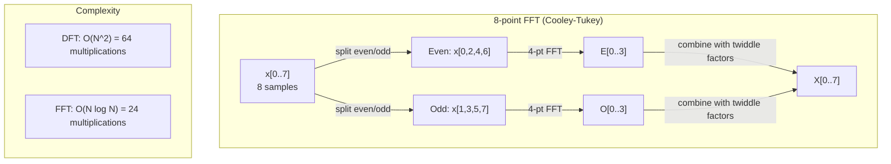
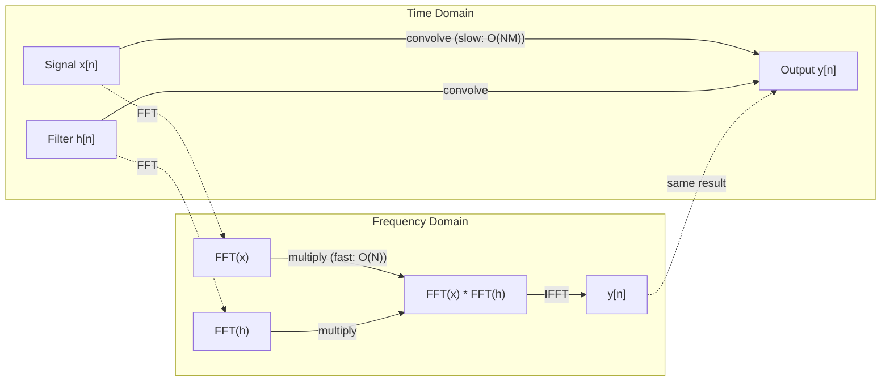

# فرقلای فوری

> هر سیگنال مجموعه امواج سینوس است. تحول فوریه به شما می گوید کدامین هستند.

**Type:** Build
**Language:**پیتون
**Prerequisites:** Phase 1, Lessons 01-04, 19 (complex numbers)
**Time:** ~90 minutes

## اهداف یادگیری

- از ابتدا DFT را اجرا کنید و آن را با O(N log N) Cooley-Tukey FFT تأیید کنید
- تعبیر معادلات فرکانس: آمپلتد، فاز و طیف قدرت را از یک سیگنال استخراج کنید
- استفاده از نظریه کنولوشن برای انجام کنولوشن از طریق ضرب FFT
- اتصال تجزیه فرکانس فوری به کدگذاری موقعیت تبدیل کننده و لایه های کنوولسیون CNN

## مشکل

ضبط صوتی یک ردیف اندازه گیری فشار در طول زمان است. قیمت سهام یک ردیف ارزش ها در طول روز است. یک تصویر یک شبکه از شدت پیکسل ها در فضا است. همه اینها داده های حوزه زمان (یا دامنه فضا) هستند. شما می بینید که ارزش ها در طول برخی شاخص ها تغییر می کنند.

اما بسیاری از الگوها در حوزه زمان نامرئی هستند. آیا این سیگنال صوتی یک صدا خالص یا یک سند است؟ آیا این قیمت سهام چرخه هفتگی دارد؟ آیا این تصویر بافت تکراری دارد؟ این سوالات مربوط به محتوای فرکانس است و دامنه زمان آن را پنهان می کند.

فرور ترانسفورم اطلاعات را از دامنه زمان به دامنه فرکانس تبدیل می کند. این یک سیگنال را می گیرد و آن را به امواج سینوس فرکانس های مختلف تجزیه می کند. هر امواج سینوس دارای یک امپلمیتود (چه مقدار قوی است) و یک مرحله (که از کجا شروع می شود) است. فرور ترانسفورم به شما هر دو را می گوید.

این برای ML مهم است زیرا تفکر دامنه فرکانس در همه جا ظاهر می شود. شبکه های عصبی کنولوشن کنولوشن را انجام می دهند که ضرب در دامنه فرکانس است. کدگذاری موقعیت ترانسفورماتور از تجزیه فرکانس برای نشان دادن موقعیت استفاده می کند. مدل های صوتی (تعرفی سخنران، تولید موسیقی) بر روی طیف ها عمل می کنند - نمایش های فرکانسی صدا. مدل های سری زمان به دنبال الگوهای دوره ای هستند. درک تحول فوریه به شما فرهنگ لغاتی می دهد تا با همه اینها کار کنید.

## مفهوم

### تعریف DFT

با توجه به نمونه های N x[0], x[1], ..., x[N-1]، تغییر فوریتر متمایز، معادلات فرکانس N X[0], X[1], ..., X[N-1] را تولید می کند:

```
X[k] = sum_{n=0}^{N-1} x[n] * e^(-2*pi*i*k*n/N)

for k = 0, 1, ..., N-1
```

هر X [k] یک عدد پیچیده است. بزرگی آن. X [k] به شما عرض فریکوئنسی k می گوید. زاویه فاز آن [X] به شما تعویض فاز این فریکوئنسی می گوید.

نکته کلیدی:`e^(-2*pi*i*k*n/N)`یک فیزور چرخش در فرکانس k است. DFT ارتباط بین سیگنال و هر یک از فرکانس های N با فاصله یکسان را محاسبه می کند. اگر سیگنال حاوی انرژی در فرکانس k باشد، ارتباط بزرگ است. اگر نه، نزدیک به صفر است.

### معنی هر یک از این معادلات

**X[0]: the DC component.**این مجموع تمام نمونه ها است -- متناسب با متوسط. این ثابت (فرکانس صفر) تعویض سیگنال را نشان می دهد.

```
X[0] = sum_{n=0}^{N-1} x[n] * e^0 = sum of all samples
```

**X[k] for 1 <= k <= N/2: positive frequencies.**X[k] نشان دهنده چرخه های فرکانس k در هر نمونه N است. k بالاتر به معنای فرکانس بالاتر (تذبذب سریعتر) است.

**X[N/2]: the Nyquist frequency.**بالاترین فرکانس که می توانید با نمونه های N نشان دهید. بالاتر از این، شما نام مستعار می گیرید - فرکانس های بالا به عنوان فرکانس های پایین پنهان می شوند.

**X[k] for N/2 < k < N: negative frequencies.**برای سیگنال های با ارزش واقعی، X[N-k] = conj(X[k]). فرکانس های منفی تصاویر آینه ای از مثبت هستند. به همین دلیل اطلاعات مفید در اولین معادل های N/2 + 1 است.

### DFT معکوس

DFT معکوس سیگنال اصلی را از معادل های فرکانس خود بازسازی می کند:

```
x[n] = (1/N) * sum_{k=0}^{N-1} X[k] * e^(2*pi*i*k*n/N)

for n = 0, 1, ..., N-1
```

تنها تفاوت های DFT پیش رو: علامت در نماد مثبت (نه منفی) است و یک فاکتور نرمال سازی 1/N وجود دارد.

DFT معکوس بازسازی کامل است. هیچ اطلاعاتی از دست نمی رود. شما می توانید از دامنه زمان به دامنه فرکانس و بدون هیچ خطا برگردید. DFT تغییر پایه است - این دوباره همان اطلاعات را در یک سیستم هماهنگی متفاوت بیان می کند.

### FFT: سرعتش رو بالا ميبرم

DFT همانطور که در بالا تعریف شده است O(N^2) است: برای هر یک از معادل های ن، شما بر روی نمونه های ورودی N جمع می کنید. برای N = 1 میلیون، این 10^12 عملیات است.

فرور فرور سریع (FFT) نتیجه مشابه را در O  N log N محاسبه می کند. برای N = 1 میلیون، این حدود 20 میلیون عملیات به جای یک تریلیون است. این چیزی است که تجزیه و تحلیل فرکانس را عملی می کند.

الگوریتم Cooley-Tukey (شترکی FFT) با تقسیم و فتح کار می کند:

1. سیگنال را به نمونه های حتی و نامتعادل تقسیم کنید.
2. DFT هر نیمه را به صورت تکراری محاسبه کنید.
3. دو DFT نیمه اندازه را با استفاده از "فاکتورهای دوگانه" e^(-2*pi*i*k/N ترکیب کنید.

```
X[k] = E[k] + e^(-2*pi*i*k/N) * O[k]          for k = 0, ..., N/2 - 1
X[k + N/2] = E[k] - e^(-2*pi*i*k/N) * O[k]    for k = 0, ..., N/2 - 1

where E = DFT of even-indexed samples
      O = DFT of odd-indexed samples
```

همتایی به این معنی است که هر سطح تکرار O(N) کار می کند و سطوح log2(N) وجود دارد. کل: O(N log N).



FFT نیاز به طول سیگنال را به یک قدرت 2 است. در عمل، سیگنال ها به صفر به قدرت بعدی 2 بسته می شوند.

### تجزیه و تحلیل طیف

.**power spectrum**این x k^2 است که مقدار مربع هر معادل فرکانس است. این نشان می دهد که چقدر انرژی در هر فرکانس است.

.**phase spectrum**این زاویه ((X[k]) -- تعویض فاز هر فرکانس است. برای اکثر وظایف تجزیه و تحلیل، شما به طیف قدرت اهمیت می دهید و مرحله را نادیده می گیرید.

```
Power at frequency k:  P[k] = |X[k]|^2 = X[k].real^2 + X[k].imag^2
Phase at frequency k:  phi[k] = atan2(X[k].imag, X[k].real)
```

### قطع فریکوئنسی

قطعنامه فرکانس DFT بستگی به تعداد نمونه های N و نرخ نمونه گیری fs دارد.

```
Frequency of bin k:      f_k = k * fs / N
Frequency resolution:    delta_f = fs / N
Maximum frequency:       f_max = fs / 2  (Nyquist)
```

برای حل دو فرکانس که نزدیک به هم هستند، شما نیاز به نمونه های بیشتری دارید. برای گرفتن فرکانس های بالا، شما نیاز به نرخ نمونه گیری بالاتر دارید.

### نظریه پیچیدگی

این یکی از مهم ترین نتایج پردازش سیگنال ها و مستقیماً مربوط به سی ان ان است.

**Convolution in the time domain equals pointwise multiplication in the frequency domain.**

```
x * h = IFFT(FFT(x) . FFT(h))

where * is convolution and . is element-wise multiplication
```

چرا این مهمه:

- پیچ مستقیم دو سیگنال طول N و M عملیات O(N*M را انجام می دهد.
- کنولوشن مبتنی بر FFT O(N log N را می گیرد: هر دو را تبدیل، ضرب، تبدیل به عقب.
- برای هسته های بزرگ، کنولوشن FFT بسیار سریع تر است.
- این دقیقاً اتفاقی است که در لایه های پیچ و خم با میدان های پذیرنده بزرگ رخ می دهد.

توجه: DFT پیچ گرد را محاسبه می کند (سیگنال به اطراف می چرخد). برای پیچ خطی (بدون پیچ) ، صفر-پاد هر دو سیگنال را به طول N + M - 1 قبل از محاسبه می کند.



### پنجره

DFT فرض می کند که سیگنال دوره ای است - این نمونه های N را به عنوان یک دوره از یک سیگنال تکرار بی نهایت در نظر می گیرد. اگر سیگنال در همان مقدار شروع و پایان نشود، این یک عدم تداوم در مرز ایجاد می کند که به عنوان محتوای فرضی فرکانس بالا ظاهر می شود. این به عنوان نشت طیف نامیده می شود.

پنجره سازی باعث کاهش خروجی می شود با کاهش سیگنال به صفر در هر دو پای قبل از محاسبه DFT.

پنجره های مشترک:

| Window | Shape | Main lobe width | Side lobe level | Use case |
|--------|-------|----------------|-----------------|----------|
| Rectangular | Flat (no window) | Narrowest | Highest (-13 dB) | When signal is exactly periodic in N samples |
| Hann | Raised cosine | Moderate | Low (-31 dB) | General purpose spectral analysis |
| Hamming | Modified cosine | Moderate | Lower (-42 dB) | Audio processing, speech analysis |
| Blackman | Triple cosine | Wide | Very low (-58 dB) | When side lobe suppression is critical |

```
Hann window:    w[n] = 0.5 * (1 - cos(2*pi*n / (N-1)))
Hamming window: w[n] = 0.54 - 0.46 * cos(2*pi*n / (N-1))
```

پنجره را با ضرب آن به لحاظ عنصر با سیگنال قبل از DFT اعمال کنید: `X = DFT(x * w)`. .

### خواص DFT

| Property | Time Domain | Frequency Domain |
|----------|-------------|-----------------|
| Linearity | a*x + b*y | a*X + b*Y |
| Time shift | x[n - k] | X[f] * e^(-2*pi*i*f*k/N) |
| Frequency shift | x[n] * e^(2*pi*i*f0*n/N) | X[f - f0] |
| Convolution | x * h | X * H (pointwise) |
| Multiplication | x * h (pointwise) | X * H (circular convolution, scaled by 1/N) |
| Parseval's theorem | sum \|x[n]\|^2 | (1/N) * sum \|X[k]\|^2 |
| Conjugate symmetry (real input) | x[n] real | X[k] = conj(X[N-k]) |

نظريه پارسوال ميگه که کل انرژي در هر دو حوزه ي اين است که انرژي از طريق تحول حفظ ميشه

### اتصال به کد بندی موقعیت

ترانسفورمور اصلی از کد بندی موقعیت سینوسایدی استفاده می کند:

```
PE(pos, 2i)   = sin(pos / 10000^(2i/d_model))
PE(pos, 2i+1) = cos(pos / 10000^(2i/d_model))
```

هر جفت ابعاد (2i، 2i+1) در فرکانس های مختلف تذبذب می کند. فرکانس ها از لحاظ هندسی از بالا (بعد 0.1) تا پایین (بعد آخر) فاصله دارند. این به هر موقعیت یک الگوی منحصر به فرد در تمام باند های فرکانس می دهد - مشابه نحوه شناسایی یک سیگنال به طور منحصر به فرد توسط معادل های فوری.

ویژگی های کلیدی این ماده:

- **Uniqueness:**هیچ دو موقعیت دارای کد مشابه نیستند.
- **Bounded values:**گناه و cos هميشه در [-1, 1] هستند.
- **Relative position:**کدگذاری موقعیت p+k می تواند به عنوان یک تابع خطی کدگذاری در موقعیت p بیان شود. مدل می تواند یاد بگیرد که به موقعیت های نسبی توجه کند.

### ارتباط با سی ان ان

یک لایه کنولوشن یک فیلتر آموخته (کرنل) را با حرکت آن در سیگنال یا تصویر به ورودی می دهد.

با نظریه کنولوشن، این معادل:
1. FFT ورودی
2. FFT هسته
3. چندان در دامنه فرکانس
4. اگر نتیجه

پیاده سازی های استاندارد CNN از کنولوشن مستقیم استفاده می کنند (برای هسته های کوچک 3x3 سریعتر). اما برای هسته های بزرگ یا کنولوشن جهانی، رویکردهای مبتنی بر FFT به طور قابل توجهی سریع تر هستند. برخی از معماری ها (مانند FNet) توجه را به طور کامل با FFT جایگزین می کنند و به جای پیچیدگی O(N^2) دقت رقابتی را با O(N log N به دست می آورند.

### طیف ها و فرسوفورمی کوتاه مدت

یک FFT واحد محتوای فرکانس کل سیگنال را به شما می دهد، اما چیزی در مورد اینکه این فرکانس ها چه زمانی رخ می دهد به شما نمی گوید. یک چرپ (سیگنال که فرکانس آن در طول زمان افزایش می یابد) و یک سند (همه فرکانس ها همزمان وجود دارد) می توانند طیف بزرگی یکسان داشته باشند.

فرجام فوریه کوتاه مدت (STFT) با محاسبه FFT ها در پنجره های متداخل سیگنال این مسئله را حل می کند. نتیجه یک طیف نامه است: یک نمایش 2D با زمان در یک محور و فرکانس در سمت دیگر. شدت در هر نقطه نشان دهنده انرژی در آن فرکانس در آن زمان است.

```
STFT procedure:
1. Choose a window size (e.g., 1024 samples)
2. Choose a hop size (e.g., 256 samples -- 75% overlap)
3. For each window position:
   a. Extract the windowed segment
   b. Apply a Hann/Hamming window
   c. Compute FFT
   d. Store the magnitude spectrum as one column of the spectrogram
```

طیف ها نمایش ورودی استاندارد برای مدل های صوتی ML هستند. مدل های تشخیص سخن (Whisper، DeepSpeech) بر روی طیف های mel عمل می کنند - طیف ها با فرکانس هایی که به مقیاس mel نقشه برداری شده است، که بهتر با درک صدای انسان مطابقت دارد.

### نامگذاری

اگر سیگنال دارای فرکانس های بالاتر از fs/2 (فرکانس نیکویست) باشد، نمونه گیری با نرخ fs نسخه های نامگذاری ایجاد می کند. یک سیگنال 90 Hz که در 100 Hz نمونه گرفته شده به نظر می رسد شبیه سیگنال 10 Hz است. هیچ راهی برای تشخیص آنها از نمونه ها تنها وجود ندارد.

```
Example:
  True signal: 90 Hz sine wave
  Sampling rate: 100 Hz
  Apparent frequency: 100 - 90 = 10 Hz

  The samples from the 90 Hz signal at 100 Hz sampling rate
  are identical to the samples from a 10 Hz signal.
  No amount of math can recover the original 90 Hz.
```

به همین دلیل است که تبدیل کننده های آنالوگ به دیجیتال شامل فیلترهای ضد الایزینگ هستند که فرکانس های بالای نیکیست را قبل از نمونه گیری حذف می کنند. در ML، الایزینگ هنگام نمونه گیری نقشه های ویژگی بدون فیلتر مناسب کم گذری ظاهر می شود - برخی معماری ها با لایه های جمع آوری ضد الایزنگ این موضوع را حل می کنند.

### صفر کردن باعث افزایش وضوح نمی شود

یک تصور نادرست رایج: صفر کردن یک سیگنال قبل از FFT باعث بهبود رزولوشن فرکانس می شود. این کار را نمی کند. صفر کردن بین سطل های فرکانس موجود، به شما طیف ای را به نظر می دهد. اما نمی تواند جزئیات فرکانس را که در نمونه های اصلی وجود نداشت، نشان دهد.

قطعنامه فرکانس واقعی تنها به زمان مشاهده T = N / fs بستگی دارد. برای حل دو فرکانس جدا شده توسط delta_f، شما حداقل T = 1 / delta_f ثانیه داده ها نیاز دارید. هیچ مقدار صفر-پادینگ این حد اساسی را تغییر نمی دهد.

```figure
fourier-synthesis
```

## آن را بسازید

### مرحله ی اول: DFT از ابتدا

O(N^2) DFT مستقیما از تعریف پی می برد.

```python
import math

class Complex:
    ...

def dft(x):
    N = len(x)
    result = []
    for k in range(N):
        total = Complex(0, 0)
        for n in range(N):
            angle = -2 * math.pi * k * n / N
            w = Complex(math.cos(angle), math.sin(angle))
            xn = x[n] if isinstance(x[n], Complex) else Complex(x[n])
            total = total + xn * w
        result.append(total)
    return result
```

### مرحله دوم: DFT معکوس

همان ساختار، معادل مثبت، تقسیم به N

```python
def idft(X):
    N = len(X)
    result = []
    for n in range(N):
        total = Complex(0, 0)
        for k in range(N):
            angle = 2 * math.pi * k * n / N
            w = Complex(math.cos(angle), math.sin(angle))
            total = total + X[k] * w
        result.append(Complex(total.real / N, total.imag / N))
    return result
```

### مرحله سوم: FFT (کولی-تکی)

FFT تکراری نیاز به قدرت دو طول دارد. به دو برابر و عجیب تقسیم شود، تکراری، با عوامل تندیل ترکیب شود.

```python
def fft(x):
    N = len(x)
    if N <= 1:
        return [x[0] if isinstance(x[0], Complex) else Complex(x[0])]
    if N % 2 != 0:
        return dft(x)

    even = fft([x[i] for i in range(0, N, 2)])
    odd = fft([x[i] for i in range(1, N, 2)])

    result = [Complex(0)] * N
    for k in range(N // 2):
        angle = -2 * math.pi * k / N
        twiddle = Complex(math.cos(angle), math.sin(angle))
        t = twiddle * odd[k]
        result[k] = even[k] + t
        result[k + N // 2] = even[k] - t
    return result
```

### مرحله 4: کمک کننده های تجزیه و تحلیل طیف

```python
def power_spectrum(X):
    return [xk.real ** 2 + xk.imag ** 2 for xk in X]

def convolve_fft(x, h):
    N = len(x) + len(h) - 1
    padded_N = 1
    while padded_N < N:
        padded_N *= 2

    x_padded = x + [0.0] * (padded_N - len(x))
    h_padded = h + [0.0] * (padded_N - len(h))

    X = fft(x_padded)
    H = fft(h_padded)

    Y = [xk * hk for xk, hk in zip(X, H)]

    y = idft(Y)
    return [y[n].real for n in range(N)]
```

## ازش استفاده کن

برای کار واقعی، از FFT numpy استفاده کنید که توسط کتابخانه های C بسیار بهینه شده پشتیبانی می شود.

```python
import numpy as np

signal = np.sin(2 * np.pi * 5 * np.arange(256) / 256)
spectrum = np.fft.fft(signal)
freqs = np.fft.fftfreq(256, d=1/256)

power = np.abs(spectrum) ** 2

positive_freqs = freqs[:len(freqs)//2]
positive_power = power[:len(power)//2]
```

برای پنجره سازی و تجزیه و تحلیل طیف پیشرفته تر:

```python
from scipy.signal import windows, stft

window = windows.hann(256)
windowed = signal * window
spectrum = np.fft.fft(windowed)
```

برای پیچ:

```python
from scipy.signal import fftconvolve

result = fftconvolve(signal, kernel, mode='full')
```

برای طیف ها:

```python
from scipy.signal import stft

frequencies, times, Zxx = stft(signal, fs=sample_rate, nperseg=256)
spectrogram = np.abs(Zxx) ** 2
```

ماتریکس طیف نامه شکل دارد (n_frequencies, n_time_frames). هر ستون طیف قدرت در یک پنجره زمان است. این چیزی است که مدل های صوتی ML به عنوان ورودی مصرف می کنند.

## -باده

فرار کن`code/fourier.py`تولید کردن`outputs/prompt-spectral-analyzer.md`. .

## تمرینات

1. **Pure tone identification.**یک سیگنال با یک موج سینوس واحد را با فرکانس ناشناخته (از 1 تا 50 هرتز) ایجاد کنید، که در 128 هرتز برای 1 ثانیه نمونه گیری شود. از DFT خود برای شناسایی فرکانس استفاده کنید. مطابقت پاسخ را بررسی کنید. حالا صداهای گاوسی را با انحراف استاندارد 0.5 اضافه کنید و تکرار کنید. صدا چگونه بر طیف تاثیر می گذارد؟

2. **FFT vs DFT verification.**یک سیگنال تصادفی طول 64 تولید کنید. DFT (O(N^2) و FFT را محاسبه کنید. بررسی کنید که تمام معادل ها با 1e-10 مطابقت دارند. زمان هر دو عملکرد در سیگنال های طول 256, 512, 1024, و 2048. نسبت زمان DFT به زمان FFT را نشان دهید.

3. **Convolution theorem proof by example.**ایجاد سیگنال x = [1, 2, 3, 4, 0, 0, 0, 0] و فیلتر h = [1, 1, 1, 0, 0, 0, 0, 0]. کنولسیون دایره ای آنها را مستقیماً محاسبه کنید (لپول سرپوش). سپس آن را از طریق FFT (تغییر، ضرب، تبدیل معکوس) محاسبه کنید. نتیجه را بررسی کنید. اکنون کنولسیون خطی را با صفر-پاد مناسب انجام دهید.

4. **Windowing effects.**یک سیگنال ایجاد کنید که مجموع دو موج سینوس در 10 هرتز و 12 هرتز (خیلی نزدیک) باشد. یک ثانیه با 128 هرتز نمونه بگیرید. طیف قدرت را بدون پنجره، پنجره هانی و پنجره هامینگ محاسبه کنید. کدام پنجره آسان ترین تشخیص دو اوج را می کند؟ چرا؟

5. **Positional encoding analysis.**برای هر جفت موقعیت (p1 ، p2) ، محصول نقطه ای از کدگذاری های خود را محاسبه کنید. نشان دهید که محصول نقطه ای فقط بر روی p1 - p2 بستگی دارد ، نه روی موقعیت های مطلق. با افزایش فاصله ، به محصول نقطه چه اتفاقی می افتد؟

## اصطلاحات کلیدی

| Term | What it means |
|------|---------------|
| DFT (Discrete Fourier Transform) | Converts N time-domain samples into N frequency-domain coefficients. Each coefficient is the correlation with a complex sinusoid at that frequency |
| FFT (Fast Fourier Transform) | An O(N log N) algorithm to compute the DFT. The Cooley-Tukey algorithm splits even/odd indices recursively |
| Inverse DFT | Reconstructs the time-domain signal from frequency coefficients. Same formula as DFT with flipped exponent sign and 1/N scaling |
| Frequency bin | Each index k in the DFT output represents frequency k*fs/N Hz. The "bin" is the discrete frequency slot |
| DC component | X[0], the zero-frequency coefficient. Proportional to the signal mean |
| Nyquist frequency | fs/2, the maximum frequency representable at sampling rate fs. Frequencies above this alias |
| Power spectrum | \|X[k]\|^2, the squared magnitude of each frequency coefficient. Shows energy distribution across frequencies |
| Phase spectrum | angle(X[k]), the phase offset of each frequency component. Often ignored in analysis |
| Spectral leakage | Spurious frequency content caused by treating a non-periodic signal as periodic. Reduced by windowing |
| Window function | A tapering function (Hann, Hamming, Blackman) applied before DFT to reduce spectral leakage |
| Twiddle factor | The complex exponential e^(-2*pi*i*k/N) used to combine sub-DFTs in the FFT butterfly computation |
| Convolution theorem | Convolution in time domain equals pointwise multiplication in frequency domain. Fundamental to signal processing and CNNs |
| Circular convolution | Convolution where the signal wraps around. This is what the DFT naturally computes |
| Linear convolution | Standard convolution without wraparound. Achieved by zero-padding before DFT |
| Parseval's theorem | Total energy is preserved through the Fourier transform. sum \|x[n]\|^2 = (1/N) sum \|X[k]\|^2 |
| Aliasing | When frequencies above Nyquist appear as lower frequencies due to insufficient sampling rate |

## خواندن بیشتر

- [Cooley & Tukey: An Algorithm for the Machine Calculation of Complex Fourier Series (1965)](https://www.ams.org/journals/mcom/1965-19-090/S0025-5718-1965-0178586-1/)- مقاله اصلی FFT که تغییر داده های کامپیوتری را ایجاد کرد
- [3Blue1Brown: But what is the Fourier Transform?](https://www.youtube.com/watch?v=spUNpyF58BY)- بهترین معرفی بصری به فرسودهای فوری
- [Lee-Thorp et al.: FNet: Mixing Tokens with Fourier Transforms (2021)](https://arxiv.org/abs/2105.03824)- خود توجه را با FFT در ترانسفورماتورها جایگزین می کند
- [Smith: The Scientist and Engineer's Guide to Digital Signal Processing](http://www.dspguide.com/)- کتاب درسی آنلاین رایگان که FFT، پنجره سازی و تحلیل طیف را به طور عمیق پوشش می دهد
- [Vaswani et al.: Attention Is All You Need (2017)](https://arxiv.org/abs/1706.03762)- کد بندی موقعیت سینوسایدی حاصل از تجزیه فرکانس فوری
- [Radford et al.: Whisper (2022)](https://arxiv.org/abs/2212.04356)- تشخیص صدا با استفاده از طیف های میل به عنوان نمایش ورودی
