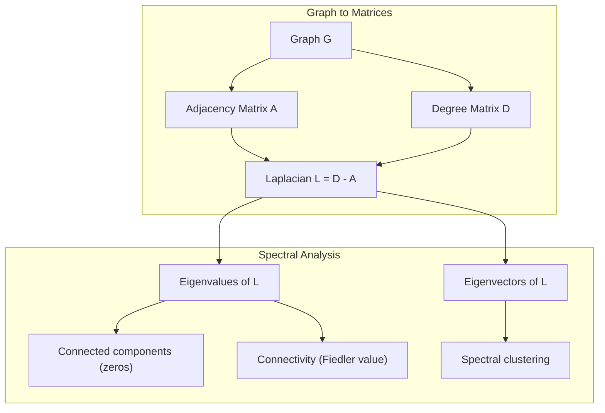
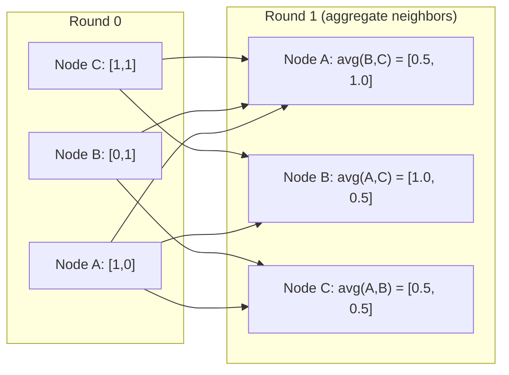

# نظریه گراف برای یادگیری ماشین

> گراف ها ساختار داده های روابط هستند. اگر داده های شما ارتباط دارند، شما به نظریه گراف نیاز دارید.

**Type:** Build
**Language:**پیتون
**Prerequisites:** Phase 1, Lessons 01-03 (linear algebra, matrices)
**Time:** ~90 minutes

## اهداف یادگیری

- ایجاد یک کلاس گرافیک با نمایشگاه های ماتریس یا لیست در نزدیکی و پیاده سازی BFS و DFS عبور
- نمودار Laplacian را محاسبه کنید و از ارزش های خود آن برای تشخیص اجزای متصل و گره های خوشه استفاده کنید
- پیاده سازی یک دور از پیام های سبک GNN به عنوان ضرب ماتریس همسایه سازی عادی
- استفاده از دسته بندی طیف برای تقسیم نمودار با استفاده از فیدلر ویکتور

## مشکل

شبکه های اجتماعی، مولکول ها، پایگاه های دانش، شبکه های نقل قول، نقشه های جاده، همه اینها نمودار هستند. ML سنتی داده ها را به عنوان جدول های مسطح می شناسد. هر ردیف مستقل است. هر ویژگی یک ستون است. اما وقتی ساختار ارتباطات مهم است، جدول ها شکست می خورند.

به یک شبکه اجتماعی فکر کنید. شما می خواهید پیش بینی کنید که کاربر چه محصولی را خریداری می کند. تاریخچه خرید آنها مهم است. اما تاریخچه خرید دوستان آنها مهم تر است. ارتباطات سیگنال را حمل می کنند.

یا به یک مولکول فکر کنید. می خواهید پیش بینی کنید که آیا آن به یک پروتئین متصل می شود. اتم ها مهم هستند، اما آنچه واقعا مهم است این است که چگونه اتم ها به یکدیگر متصل می شوند. ساختار داده ها است.

شبکه های عصبی گرافیک (GNN) سریع ترین منطقه رشد در یادگیری عمیق هستند. آنها کشف مواد مخدر، توصیه های اجتماعی، تشخیص تقلب و استدلال گرافیک دانش را تقویت می کنند. هر GNN بر روی همان پایه ای: نظریه گرافیک اساسی بنا می شود.

تو به چهار چیز نیاز داری:
1. یک روش برای نشان دادن نمودارها به عنوان ماتریس (تا بتوانید آنها را ضرب کنید)
2. الگوریتم های عبور برای کشف ساختار نمودار
3. لاپلاسی - مهم ترین ماتریس در نظریه نمودار های طیف
4. ارسال پیام - عملیات که باعث می شود GNN کار کند

## مفهوم

### نمودار: گره ها و لبه ها

یک نمودار G = (V، E) از عمق (عقد) V و حاشیه E تشکیل شده است. هر حاشیه دو گره را متصل می کند.

**Directed vs undirected.**در یک نمودار غیرمستقیم، کناری (u، v) به معنای u به v متصل می شود و v به u متصل می شود. در یک نمودار هدایت شده (دیگراف) ، کناری (u، v) به معنای u به v اشاره دارد، اما لزوما برعکس نیست.

**Weighted vs unweighted.**در یک نمودار بدون وزن، حاشیه ها وجود دارند یا وجود ندارند. در نمودار با وزن، هر حاشیه دارای وزن عددی است -- فاصله، هزینه، قدرت.

| Graph type | Example |
|-----------|---------|
| Undirected, unweighted | Facebook friendship network |
| Directed, unweighted | Twitter follow network |
| Undirected, weighted | Road map (distances) |
| Directed, weighted | Web page links (PageRank scores) |

### ماتریکس نزدیک

ماتریس همسایه A نشان دهنده هسته است. برای یک نمودار با n گره:

```
A[i][j] = 1    if there is an edge from node i to node j
A[i][j] = 0    otherwise
```

برای نمودار های غیرموجب، A متقابل است: A[i][j] = A[j][i]. برای نمودار های وزن شده، A[i][j] = وزن لبه (i، j).

**Example -- a triangle:**

```
Nodes: 0, 1, 2
Edges: (0,1), (1,2), (0,2)

A = [[0, 1, 1],
     [1, 0, 1],
     [1, 1, 0]]
```

ماتریس همسایه، ورودی برای هر GNN است. عملیات ماتریس در A به عملیات در نمودار مطابقت دارد.

### درجه

درجه یک گره تعداد لبه های متصل به آن است. برای نمودار های هدایت شده، شما در درجه (سطح های وارد) و خارج (سطح های خارج) دارید.

ماتریس درجه D دیگال است:

```
D[i][i] = degree of node i
D[i][j] = 0    for i != j
```

برای مثال مثلث: D = diag(2, 2, 2) چون هر گره به دو گره دیگر متصل می شود.

درجه به شما در مورد اهمیت گره می گوید. درجه بالا = گره گره. توزیع درجه یک شبکه ساختار آن را نشان می دهد. شبکه های اجتماعی قوانین قدرت را دنبال می کنند (گره های کمی، گره های برگ زیادی). نمودار تصادفی دارای درجه های توزیع شده پویسون هستند.

### BFS و DFS

دو الگوریتم عبور گراف اساسی. شما به هر دو نیاز دارید.

**Breadth-First Search (BFS):**اول همه همسايه ها رو بازي کن بعد همسايه ها رو بازي کن

```
BFS from node 0:
  Visit 0
  Queue: [1, 2]        (neighbors of 0)
  Visit 1
  Queue: [2, 3]        (add neighbors of 1)
  Visit 2
  Queue: [3]           (neighbors of 2 already visited)
  Visit 3
  Queue: []            (done)
```

BFS کوتاه ترین مسیر را در نمودار های بدون وزن پیدا می کند. فاصله از شروع به هر گره برابر با سطح BFS است که در آن گره برای اولین بار کشف می شود. به همین دلیل BFS برای فاصله های شمارش hop در شبکه های اجتماعی استفاده می شود.

**Depth-First Search (DFS):**قبل از عقب نشینی تا جایی که ممکن است عمیق تر شوید. از یک استیک (LIFO) یا تکرار استفاده کنید.

```
DFS from node 0:
  Visit 0
  Stack: [1, 2]        (neighbors of 0)
  Visit 2               (pop from stack)
  Stack: [1, 3]         (add neighbors of 2)
  Visit 3               (pop from stack)
  Stack: [1]
  Visit 1               (pop from stack)
  Stack: []             (done)
```

DFS برای:
- پیدا کردن قطعات متصل (DFS را از گره های غیر بازدید شده اجرا کنید)
- تشخیص چرخه (خطای عقب در درخت DFS)
- طبقه بندی توپولوژیکی (ترتیب پایان DFS معکوس)

| Algorithm | Data structure | Finds | Use case |
|-----------|---------------|-------|----------|
| BFS | Queue | Shortest paths | Social network distance, knowledge graph traversal |
| DFS | Stack | Components, cycles | Connectivity, topological sort |

### گراف لاپلاسی

L = D - A. مهم ترین ماتریس در نظریه نمودار های طیف.

برای مثلث:

```
D = [[2, 0, 0],    A = [[0, 1, 1],    L = [[2, -1, -1],
     [0, 2, 0],         [1, 0, 1],         [-1, 2, -1],
     [0, 0, 2]]         [1, 1, 0]]         [-1, -1,  2]]
```

لاپلاسی دارای خواص قابل توجه است:

1. **L is positive semi-definite.**تمام ارزش های خاص >= 0 هستند.

2. **The number of zero eigenvalues equals the number of connected components.**یک نمودار متصل به یک صفر است. یک نمودار با 3 قطعه قطع شده به سه صفر است.

3. **The smallest non-zero eigenvalue (Fiedler value) measures connectivity.**یک مقدار بزرگ فیدر نشان می دهد که نمودار به خوبی متصل است. یک مقدار کوچک فیدر نشان می دهد که نمودار نقطه ضعف دارد - یک گلو بطری.

4. **The eigenvector of the Fiedler value (Fiedler vector) reveals the best split.**گرهای با ارزش های مثبت به یک گروه می روند، گرهای با ارزش های منفی به گروه دیگر می روند. این گروه بندی طیف است.



### خواص طیف

ارزش های خاص ماتریس همسایه و لاپلاسیان بدون هیچ عبور خاصیت های ساختاری را نشان می دهند.

**Spectral clustering**اینجوری کار میکنه:
1. لپلاسی L را محاسبه کنید
2. k کوچکترین ویکتورهای خونی L را پیدا کنید (اولین را رد کنید که برای نمودار های متصل همه یک است)
3. از این ویکتورهای خود به عنوان همبستگی های جدید برای هر گره استفاده کنید
4. از k-میانی ها روی این هماهنگی ها اجرا کنید

چرا این کار می کند؟ ویکتورهای خاص L "سوارترین" عملکرد را در نمودار کدگذاری می کنند. گرهایی که به خوبی متصل هستند، ارزش های ویکتورهای خاص مشابهی را دریافت می کنند. گرهایی که توسط یک گره بطن جدا شده اند، ارزش های متفاوتی را دریافت می کنند. ویکتورهای خاص به طور طبیعی گروه های جداگانه را جدا می کنند.

**Random walk connection.**لپلاسیان عادی شده به راه رفتن تصادفی در نمودار مربوط است. توزیع ثابت یک راه رفتن تصادفی متناسب با درجه گره است. زمان مخلوط (چه سریع راه رفتن به هم می پیوندد) به شکاف طیف بستگی دارد.

### ارسال پیام

عملکرد اصلی شبکه های عصبی گراف. هر گره پیام های همسایه خود را جمع آوری می کند، آنها را جمع آوری می کند و وضعیت خود را به روز می کند.

```
h_v^(k+1) = UPDATE(h_v^(k), AGGREGATE({h_u^(k) : u in neighbors(v)}))
```

در ساده ترین شکل، AGGREGATE = متوسط و UPDATE = تغییر خطی + فعال سازی:

```
h_v^(k+1) = sigma(W * mean({h_u^(k) : u in neighbors(v)}))
```

این ضرب ماتریکس در پوشش است. اگر H ماتریکس تمام ویژگی های گره و A ماتریکس همسایه است:

```
H^(k+1) = sigma(A_norm * H^(k) * W)
```

جایی که A_norm ماتریس همسایه سازی عادی است (هر ردیف به 1 می رسد).

یک دور از ارسال پیام به هر گره اجازه می دهد تا همسایگان نزدیک خود را "بینند". دو دور به آن اجازه می دهد تا همسایگان همسایگان را ببیند. دور K به هر گره اطلاعات از همسایگان K-hop خود را می دهد.



### مفاهیم و کاربرد ML

| Concept | ML Application |
|---------|---------------|
| Adjacency matrix | GNN input representation |
| Graph Laplacian | Spectral clustering, community detection |
| BFS/DFS | Knowledge graph traversal, path finding |
| Degree distribution | Node importance, feature engineering |
| Message passing | GNN layers (GCN, GAT, GraphSAGE) |
| Eigenvalues of L | Community detection, graph partitioning |
| Spectral clustering | Unsupervised node grouping |
| PageRank | Node importance, web search |

```figure
graph-degree-distribution
```

## آن را بسازید

### مرحله اول: کلاس گراف از ابتدا

```python
class Graph:
    def __init__(self, n_nodes, directed=False):
        self.n = n_nodes
        self.directed = directed
        self.adj = {i: {} for i in range(n_nodes)}

    def add_edge(self, u, v, weight=1.0):
        self.adj[u][v] = weight
        if not self.directed:
            self.adj[v][u] = weight

    def neighbors(self, node):
        return list(self.adj[node].keys())

    def degree(self, node):
        return len(self.adj[node])

    def adjacency_matrix(self):
        import numpy as np
        A = np.zeros((self.n, self.n))
        for u in range(self.n):
            for v, w in self.adj[u].items():
                A[u][v] = w
        return A

    def degree_matrix(self):
        import numpy as np
        D = np.zeros((self.n, self.n))
        for i in range(self.n):
            D[i][i] = self.degree(i)
        return D

    def laplacian(self):
        return self.degree_matrix() - self.adjacency_matrix()
```

لیست همسایه (`self.adj`) به طور موثر همسایه ها را ذخیره می کند. تبدیل ماتریس همسایه از numpy استفاده می کند زیرا تمام عملیات طیف به آن نیاز دارند.

### مرحله دوم: BFS و DFS

```python
from collections import deque

def bfs(graph, start):
    visited = set()
    order = []
    distances = {}
    queue = deque([(start, 0)])
    visited.add(start)
    while queue:
        node, dist = queue.popleft()
        order.append(node)
        distances[node] = dist
        for neighbor in graph.neighbors(node):
            if neighbor not in visited:
                visited.add(neighbor)
                queue.append((neighbor, dist + 1))
    return order, distances


def dfs(graph, start):
    visited = set()
    order = []
    stack = [start]
    while stack:
        node = stack.pop()
        if node in visited:
            continue
        visited.add(node)
        order.append(node)
        for neighbor in reversed(graph.neighbors(node)):
            if neighbor not in visited:
                stack.append(neighbor)
    return order
```

BFS از یک دکی (صف دوگانه) برای O(1) popleft استفاده می کند. DFS از یک لیست به عنوان یک استیک استفاده می کند. هر دو هر گره را دقیقاً یک بار بازدید می کنند - O(V + E) زمان.

### مرحله 3: اجزای متصل و ارزش های خاص Laplacian

```python
def connected_components(graph):
    visited = set()
    components = []
    for node in range(graph.n):
        if node not in visited:
            order, _ = bfs(graph, node)
            visited.update(order)
            components.append(order)
    return components


def laplacian_eigenvalues(graph):
    import numpy as np
    L = graph.laplacian()
    eigenvalues = np.linalg.eigvalsh(L)
    return eigenvalues
```

`eigvalsh`برای ماتریس های متقابل است -- Laplacian همیشه متقابل برای نمودار های نامناسب است. ارزش های خود را در ترتیب بالا می برد. صفر ها را برای پیدا کردن تعداد اجزای متصل شمار کنید.

### مرحله 4: گروه بندی طیف

```python
def spectral_clustering(graph, k=2):
    import numpy as np
    L = graph.laplacian()
    eigenvalues, eigenvectors = np.linalg.eigh(L)
    features = eigenvectors[:, 1:k+1]

    labels = np.zeros(graph.n, dtype=int)
    for i in range(graph.n):
        if features[i, 0] >= 0:
            labels[i] = 0
        else:
            labels[i] = 1
    return labels
```

برای k=2، علامت ویکتور فیدر گراف را به دو خوشه تقسیم می کند. برای k>2، شما k-وسط را بر روی اولین k ویکتورهای خاص اجرا می کنید (به استثنای ویکتورهای معمولی تمام واحد).

### مرحله 5: ارسال پیام

```python
def message_passing(graph, features, weight_matrix):
    import numpy as np
    A = graph.adjacency_matrix()
    row_sums = A.sum(axis=1, keepdims=True)
    row_sums[row_sums == 0] = 1
    A_norm = A / row_sums
    aggregated = A_norm @ features
    output = aggregated @ weight_matrix
    return output
```

این یک دور از پیام GNN است. ویژگی های جدید هر گره متوسط وزن شده ویژگی های همسایه آن است که توسط ماتریس وزن تبدیل می شود. برای گسترش اطلاعات بیشتر چند دور را جمع کنید.

## ازش استفاده کن

با شبکهx و numpy، عملیات های مشابه یک خط هستند:

```python
import networkx as nx
import numpy as np

G = nx.karate_club_graph()

A = nx.adjacency_matrix(G).toarray()
L = nx.laplacian_matrix(G).toarray()

eigenvalues = np.linalg.eigvalsh(L.astype(float))
print(f"Smallest eigenvalues: {eigenvalues[:5]}")
print(f"Connected components: {nx.number_connected_components(G)}")

communities = nx.community.greedy_modularity_communities(G)
print(f"Communities found: {len(communities)}")

pr = nx.pagerank(G)
top_nodes = sorted(pr.items(), key=lambda x: x[1], reverse=True)[:5]
print(f"Top 5 PageRank nodes: {top_nodes}")
```

networkx گراف هر اندازه ای را با پس زمینه های بهینه سازی شده C اداره می کند. از آن در تولید استفاده کنید. از پیاده سازی اولیه خود برای درک آنچه انجام می دهد استفاده کنید.

### تجزیه و تحلیل طیف نومی

```python
import numpy as np

A = np.array([
    [0, 1, 1, 0, 0],
    [1, 0, 1, 0, 0],
    [1, 1, 0, 1, 0],
    [0, 0, 1, 0, 1],
    [0, 0, 0, 1, 0]
])

D = np.diag(A.sum(axis=1))
L = D - A

eigenvalues, eigenvectors = np.linalg.eigh(L)
print(f"Eigenvalues: {np.round(eigenvalues, 4)}")
print(f"Fiedler value: {eigenvalues[1]:.4f}")
print(f"Fiedler vector: {np.round(eigenvectors[:, 1], 4)}")

fiedler = eigenvectors[:, 1]
group_a = np.where(fiedler >= 0)[0]
group_b = np.where(fiedler < 0)[0]
print(f"Cluster A: {group_a}")
print(f"Cluster B: {group_b}")
```

ویکتور فیدر این کار را انجام می دهد. ورودی مثبت در یک خوشه، منفی در دیگری. نیازی به بهینه سازی تکراری نیست - فقط یک ترکیب خاص.

## -باده

این درس نتیجه می دهد:
- `outputs/skill-graph-analysis.md`-- یک مرجع مهارت برای تجزیه و تحلیل داده های ساختار یافته نمودار

## ارتباطات

| Concept | Where it shows up |
|---------|------------------|
| Adjacency matrix | GCN, GAT, GraphSAGE input |
| Laplacian | Spectral clustering, ChebNet filters |
| BFS | Knowledge graph traversal, shortest path queries |
| Message passing | Every GNN layer, neural message passing |
| Spectral gap | Graph connectivity, mixing time of random walks |
| Degree distribution | Power-law networks, node feature engineering |
| Connected components | Preprocessing, handling disconnected graphs |
| PageRank | Node importance ranking, attention initialization |

GNN ها مستحق ذکر ویژه هستند. عملیات پیچیدگی گراف در GCN (Kipf & Welling، 2017) از ماتریس همسایه با اضافه کردن حلقه های خود استفاده می کند، A_hat = A + I:

```text
H^(l+1) = sigma(D_hat^(-1/2) * A_hat * D_hat^(-1/2) * H^(l) * W^(l))
```

جایی که A_hat = A + I (مجافتی به علاوه خود حلقه ها) و D_hat ماتریس درجه A_hat است. حلقه های خود اطمینان حاصل می کنند که هر گره شامل ویژگی های خود در هنگام جمع آوری می شود. این دقیقاً پیامی است که با نرمال سازی همتایی می گذرد. D_hat^(-1/2) * A_hat * D_hat^(-1/2) ماتریس همسایه سازی عادی است. لپلاسی ظاهر می شود زیرا این نرمال سازی با L_sym = I - D^(-1/2) * A * D^(-1/2) مرتبط است. درک کردن لپلاسی یعنی درک کردن اینکه چرا GCN ها کار می کنند.

## تمرینات

1. **Implement PageRank from scratch.**با نمره های یکسانی شروع کنید. در هر مرحله: نمره ((v) = (1-d) /n + d * مجموع ((نمره ((u) /out_degree ((u)) برای همه u اشاره به v. استفاده کنید d=0.85. تا تبدیل (تغییر < 1e-6). تست بر روی یک نمودار وب کوچک.

2. **Find communities using spectral clustering.**یک نمودار با دو خوشه به وضوح جدا شده ایجاد کنید (به عنوان مثال دو کلک با یک لبه متصل شده است). خوشه های طیف را اجرا کنید و بررسی کنید که تقسیم صحیح را پیدا می کند. چه اتفاقی می افتد اگر لبه های مختلف خوشه ها را اضافه کنید؟

3. **Implement Dijkstra's algorithm**برای کوتاه ترین مسیرها در نمودار های وزن شده. نتایج را با BFS در همان نمودار با وزن های یکسانی مقایسه کنید.

4. **Build a 2-layer message passing network.**پیام را دو بار با ماتریس های وزن مختلف اجرا کنید. نشان دهید که پس از 2 دور، هر گره اطلاعات از دو گره خود را دارد.

5. **Analyze a real-world graph.**از نمودار کلب کاراته (34 گره، 78 لبه) استفاده کنید. توزیع درجه، ارزش های خاص لاپلاسی و خوشه بندی طیف را محاسبه کنید. نتیجه خوشه بندی طیف را با تقسیم حقیقت زمینی شناخته شده مقایسه کنید.

## اصطلاحات کلیدی

| Term | What people say | What it actually means |
|------|----------------|----------------------|
| Graph | "Nodes and edges" | A mathematical structure G=(V,E) encoding pairwise relationships |
| Adjacency matrix | "The connection table" | An n x n matrix where A[i][j] = 1 if nodes i and j are connected |
| Degree | "How connected a node is" | The number of edges touching a node |
| Laplacian | "D minus A" | L = D - A, the matrix whose eigenvalues reveal graph structure |
| Fiedler value | "The algebraic connectivity" | The smallest non-zero eigenvalue of L, measuring how well-connected the graph is |
| BFS | "Level-by-level search" | Traversal that visits all neighbors before going deeper, finds shortest paths |
| DFS | "Go deep first" | Traversal that follows one path to its end before backtracking |
| Message passing | "Nodes talk to neighbors" | Each node aggregates information from its neighbors, the core of GNNs |
| Spectral clustering | "Cluster by eigenvectors" | Partition a graph using eigenvectors of its Laplacian |
| Connected component | "A separate piece" | A maximal subgraph where every node can reach every other node |

## خواندن بیشتر

- **Kipf & Welling (2017)**-- " طبقه بندی نیمه نظارت شده با شبکه های کنولوشن گراف". مقاله ای که GNN های مدرن را راه اندازی کرد. نشان می دهد که کنولوشن گراف های طیف به انتقال پیام ها ساده تر می شود.
- **Spielman (2012)**-- یادداشت های سخنرانی "نظریه نمودار های طیف"، مقدمه نهایی به لابلاسیان، شکاف های طیف و تقسیم نمودار.
- **Hamilton (2020)**-- "تعلم نمایندگی گراف". کتابی که از اصول اولیه تا برنامه های کاربردی GNN را پوشش می دهد.
- **Bronstein et al. (2021)**-- "علم عمیق هندسی: شبکه ها، گروه ها، نمودارها، زمین شناسی و اندازه گیری ها".
- **Veličković et al. (2018)**-- "شبکه های توجه نمودار". پيام عبور را با مکانیسم های توجه گسترش می دهد.
