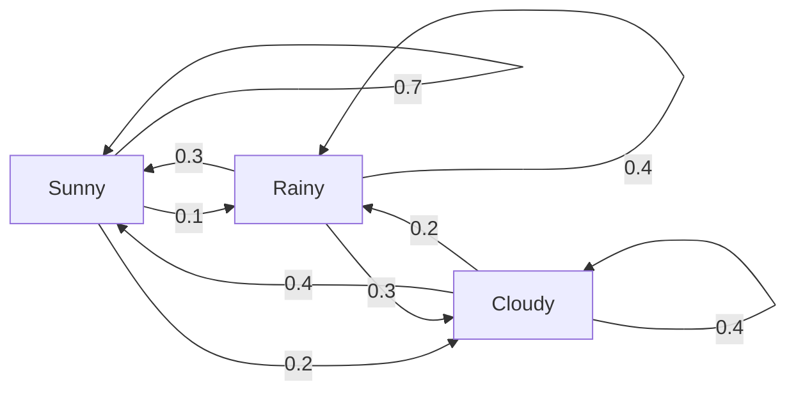
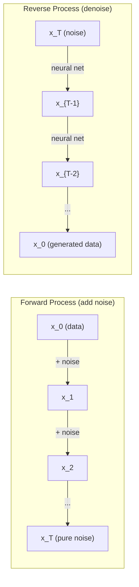

# فرآیندهای استوکاستیک

> تصادف با ساختار، ریاضیات پشت پیاده روی های تصادفی، زنجیره های مارکوف و مدل های انتشار

**Type:** Learn
**Language:**پیتون
**Prerequisites:** Phase 1, Lessons 06-07 (probability, Bayes)
**Time:** ~75 minutes

## اهداف یادگیری

- شبیه سازی 1D و 2D پیاده روی تصادفی و تأیید مقیاس مربع
- ساخت یک شبیه ساز زنجیره مارکوف و محاسبه توزیع ثابت آن از طریق خودندکمپوزشن
- پیاده سازی دینامیک MCMC و Langevin Metropolis-Hastings برای نمونه گیری از توزیع هدف
- فرآیند انتشار جلو را به حرکت براون متصل کنید و توضیح دهید که چگونه فرآیند معکوس داده ها را تولید می کند

## مشکل

بسیاری از سیستم های هوش مصنوعی شامل تصادفی هستند که با گذشت زمان تکامل می یابد. تصادفی استاتیک نیست. تصادفی ساختار یافته و دنباله دار که هر مرحله بستگی به آنچه پیش از آن اتفاق افتاده است.

مدل های زبان یک به یک توکن تولید می کنند. هر توکن بستگی به زمینه قبلی دارد. مدل توزیع احتمال را تولید می کند، نمونه هایی از آن را تولید می کند و حرکت می کند. این یک فرآیند استوکاستیک است.

مدل های انتشار صدا را به یک تصویر به تدریج اضافه می کنند تا آن به حالت خالص ثابت تبدیل شود. سپس روند را معکوس می کنند و مرحله به مرحله تا یک تصویر جدید ظاهر می شود. فرآیند پیش رو زنجیره مارکوف است. فرآیند معکوس یک زنجیره مارکوف آموخته است که به عقب می رود.

عوامل یادگیری تقویت در یک محیط عمل می کنند. هر عمل به یک وضعیت جدید با احتمالاتی منجر می شود. عامل یک سیاست تصادفی را در یک جهان تصادفی دنبال می کند. همه چیز یک فرآیند تصمیم گیری مارکوف است.

نمونه گیری MCMC - ستون فقرات نتیجه گیری بیزیایی - یک زنجیره مارکوف را ایجاد می کند که توزیع ثابت آن قسمت عقب است که می خواهید از آن نمونه بگیرید.

همه اینها بر روی چهار ایده اساسی بنا شده اند:
1. پیاده روی های تصادفی ساده ترین فرآیند استوکاستیک
2. زنجیره های مارکوف -- تصادفی ساختار یافته با ماتریس انتقال
3. دینامیک لانژین - کاهش گرادینت با شور
4. متروپولیس-هستینگز - نمونه گیری از هر توزیع

## مفهوم

### پیاده روی های تصادفی

در هر مرحله یک سکه ی عادلانه را پر کنید. سرها: به سمت راست (+1) حرکت کنید. دمها: به سمت چپ (-1) حرکت کنید.

پس از n گام، موقعیت شما مجموعه از n مقادیر تصادفی +/-1 است. موقعیت انتظار می رود 0 (پیروشی غیر جانبدار است). اما فاصله انتظار می رود از اصل به عنوان مربع ((n) رشد می کند.

این برعکس است. راه رفتن عادلانه است - هیچ انحراف در هر دو جهت. اما با گذشت زمان، از جایی که شروع کرد، دور و دور تر می رود. انحراف استاندارد پس از n قدم به مربع است.

```
Step 0:  Position = 0
Step 1:  Position = +1 or -1
Step 2:  Position = +2, 0, or -2
...
Step 100: Expected distance from origin ~ 10 (sqrt(100))
Step 10000: Expected distance from origin ~ 100 (sqrt(10000))
```

**In 2D**در این مرحله، مسیر به سمت چپ، پایین یا راست با احتمال برابر حرکت می کند. همان مقیاس مربع (n) برای فاصله از اصل اعمال می شود. مسیر الگوی شبیه فراکتال را دنبال می کند.

**Why sqrt(n)?**هر مرحله +1 یا -1 با احتمال برابر است. پس از مراحل n، موقعیت S_n = X_1 + X_2 + ... + X_n جایی که هر X_i +/-1 است. تفاوت هر مرحله 1 است و مراحل مستقل هستند، بنابراین Var(S_n) = n. انحراف استاندارد = sqrt(n. با تئورمه محدودی مرکزی، S_n / sqrt(n) به توزیع عادی استاندارد نزدیک می شود.

این مقیاس مربع ((n) در ML هر جا ظاهر می شود. SGD شور مقیاس به عنوان 1/sqrt(batch_size). گنجانیدن مقیاس ابعاد به عنوان sqrt(d). ریشه مربع علامت اضافه های تصادفی مستقل است.

**Connection to Brownian motion.**یک پیاده روی تصادفی با اندازه مرحله 1/sqrt(n) و n گام در واحد زمان انجام دهید. همانطور که n به بی نهایت می رود، پیاده روی به حرکت براون (B(t) - یک فرآیند مداوم زمانی که B(t) به طور معمول با میانگین 0 و تغیر توزیع می شود.

حرکت براون پایه ریاضی انتشار است. این شکل گیری تصادفی ذرات در یک مایع، نوسانات قیمت سهام و - مهمتر از همه - روند سر و صدا در مدل های انتشار را می سازد.

**Gambler's ruin.**یک پیاده رنده تصادفی که از موقعیت k شروع می شود، با موانع جذب در 0 و N. احتمال رسیدن به N قبل از 0 چیست؟ برای یک پیاده رنده عادلانه: P(reach N) = k/N. این به طرز شگفت انگیزی ساده و زیبا است. این به نظریه مارتینگال ها متصل است - پیاده رنده تصادفی عادلانه یک مارتینگال است (قیمت آینده انتظار می رود = ارزش فعلی).

### زنجیره های مارکوف

یک زنجیره مارکوف یک سیستم است که بر اساس احتمالات ثابت بین کشورها انتقال می یابد. ویژگی کلیدی: دولت بعدی فقط بر اساس وضعیت فعلی، نه تاریخ بستگی دارد.

```
P(X_{t+1} = j | X_t = i, X_{t-1} = ...) = P(X_{t+1} = j | X_t = i)
```

این ویژگی مارکوف است. این بدان معنی است که شما می توانید تمام دینامیک را با یک ماتریس انتقال P توصیف کنید:

```
P[i][j] = probability of going from state i to state j
```

هر ردیف از P به 1 می رسد (شما باید به جایی بروید).

**Example -- Weather:**

```
States: Sunny (0), Rainy (1), Cloudy (2)

P = [[0.7, 0.1, 0.2],    (if sunny: 70% sunny, 10% rainy, 20% cloudy)
     [0.3, 0.4, 0.3],    (if rainy: 30% sunny, 40% rainy, 30% cloudy)
     [0.4, 0.2, 0.4]]    (if cloudy: 40% sunny, 20% rainy, 40% cloudy)
```

پس از بسیاری از انتقال ها، توزیع حالت ها به توزیع ثابت pi، جایی که pi * P = pi، نزدیک می شود. این یکوکتور خروجی چپ P با ارزش خروجی 1 است.

برای زنجیره آب و هوا، توزیع ثابت [0.55, 0.18, 0.27] است -- در دراز مدت، 55 درصد از زمان بدون توجه به حالت آغاز، آفتاب است.



**Computing the stationary distribution.**دو روش وجود دارد:

1. **Power method**: هر توزیع اولیه را با P چند بار ضرب کنید. پس از تکرار های کافی، آن را به هم می پیوندد.
2. **Eigenvalue method**: برای پیدا کردن ویکتور خروجی چپ P با ارزش خروجی 1 پیدا کنید. این ویکتور خروجی P^T با ارزش خروجی 1 است.

هر دو رویکرد نیاز به زنجیره ای برای برآورده کردن شرایط تقارب دارند.

**Convergence conditions.**یک زنجیره مارکوف به یک توزیع ثابت منحصر به فرد متقابل می شود اگر:
- **Irreducible**: هر ایالت از هر ایالت دیگه قابل دسترسی است
- **Aperiodic**: زنجیره با دوره ای ثابت چرخه ای ندارد

اکثر زنجیره هایی که در ML پیدا می کنید هر دو شرط را برآورده می کنند.

**Absorbing states.**یک حالت جذب می شود اگر یک بار وارد آن شوید، هرگز از آن خارج نمی شوید (P[i][i] = 1). جذب زنجیره های مارکوف فرآیندهای مدل با حالت های نهایی - یک بازی که پایان می یابد، مشتری که می ترسد، یک ردیف رمزنگاری که به رمزنگاری پایان متن می رسد.

**Mixing time.**چند مرحله تا زنجیره "بزرگ" به توزیع ثابت است؟ به طور رسمی، تعداد مراحل تا فاصله ی تغییرات کل از ثابتیت زیر یک حد پایین می آید. مخلوط سریع = چند مرحله مورد نیاز است. شکاف طیف P (1 - دومین بزرگ ترین ارزش خاص) زمان مخلوط را کنترل می کند. شکاف بزرگتر = مخلوط سریعتر.

### ارتباط با مدل های زبان

تولید توکن در یک مدل زبان تقریباً یک فرآیند مارکوف است. با توجه به زمینه فعلی، مدل توزیع را در توکن بعدی تولید می کند. دمای کنترل تیز بودن:

```
P(token_i) = exp(logit_i / temperature) / sum(exp(logit_j / temperature))
```

- دمای = 1.0: توزیع استاندارد
- دمای < 1,0: تیز تر (مقرر تر)
- دمای بیشتر از ۱.۰: مسطحتر (به طور تصادفی)
- درجه حرارت -> 0: argmax (طمع)

نمونه گیری top-k به k نشانه های احتمال بالا (برترین) کاهش می یابد. نمونه گیری top-p ( هسته) به کوچکترین مجموعه از نشانه هایی که احتمال تجمعی آن بیش از p است، کاهش می یابد. هر دو احتمالات انتقال مارکوف را تغییر می دهند.

### حرکت براون

محدوده زمان مداوم راه رفتن تصادفی. موقعیت B ((t) دارای سه ویژگی است:
1. B(0) = 0
2. B(t) - B(s) معمولا با میانگین 0 و ت - s متغیر (برای t > s) توزیع می شود
3. افزایش در فواصل بدون تعادل مستقل است

حرکت براونین ثابت است اما هیچ جا قابل تشخیص نیست - در هر مقیاس می چرخد. مسیر دارای ابعاد فراکتال 2 در سطح است.

در شبیه سازی جداگانه، حرکت براون را با:

```
B(t + dt) = B(t) + sqrt(dt) * z,    where z ~ N(0, 1)
```

مقیاس بندی sqrt ((dt) مهم است. این از نظریه محدودی مرکزی استفاده می شود که به راه رفتن تصادفی اعمال می شود.

### دینامیک لانژین

کاهش درجه ای حداقل یک تابع را پیدا می کند. دینامیک لانجین توزیع احتمال را متناسب با exp ((-U ((x) / T) پیدا می کند، جایی که U یک تابع انرژی و T دمای است.

```
x_{t+1} = x_t - dt * gradient(U(x_t)) + sqrt(2 * T * dt) * z_t
```

دو نیروی روی ذره عمل می کنند:
1. **Gradient force**(-dt * گرادینت ((U)): به سمت انرژی پایین فشار می آورد (مانند کاهش گرادینت)
2. **Random force**(sqrt(2*T*dt) * z): فشار در جهت های تصادفی (کشف)

در دمای T = 0، این کاهش تراز خالص است. در دمای بالا، تقریباً یک پیاده روی تصادفی است. در دمای مناسب، ذره چشم انداز انرژی را کشف می کند و زمان بیشتری را در مناطق کم انرژی صرف می کند.

**Connection to diffusion models.**فرآیند پیشروی یک مدل انتشار عبارت است از:

```
x_t = sqrt(alpha_t) * x_{t-1} + sqrt(1 - alpha_t) * noise
```

این یک زنجیره مارکوف است که به تدریج داده ها را با صدا مخلوط می کند. پس از مراحل کافی، x_T صداهای خالص گاس است.

فرآیند معکوس -- از صدا به داده ها باز می گردد -- همچنین یک زنجیره مارکوف است، اما احتمالات انتقال آن توسط یک شبکه عصبی آموخته می شود. شبکه یاد می گیرد تا صدای اضافه شده را در هر مرحله پیش بینی کند، سپس آن را حذف می کند.



### MCMC: زنجیره مارکوف مونت کارلو

گاهی اوقات شما نیاز به نمونه از یک توزیع p ((x) که شما می توانید ارزیابی (تا یک ثابت) اما نمی توانید نمونه از مستقیم. پس از Bayesian نمونه کلاسیک هستند -- شما می دانید احتمال ضرب قبلی، اما ثابت عادی سازی دشوار است.

**Metropolis-Hastings**ساخت زنجیره مارکوف که توزیع ثابت آن p(x است:

1. از یه موقعیت x شروع کن
2. پیشنهاد یک موقعیت جدید x' از یک توزیع پیشنهاد Q(x'
3. نسبت پذیرش محاسبه: a(x') * Q(x
4. قبول کنید x' با احتمال min ((1, a) ، در غیر این صورت در x باقی بمانید.
5. تکرار کنم

اگر Q متقابل باشد به عنوان مثال، Q(x' (بھیx) = Q(x (بھیx') = N(x, sigma^2) ، نسبت به a = p(x') / p(x ساده می شود. شما فقط به نسبت احتمالات نیاز دارید - منسوخی ثابت عادی سازی.

زنجیره تضمین شده است که در شرایط نرم به p ((x) نزدیک شود. اما اگر پیشنهاد خیلی کوچک (پیروشی تصادفی) یا خیلی بزرگ (رفض بالا) باشد، این کنورژن می تواند کند. تنظیم پیشنهاد هنر MCMC است.

**Why it works.**نسبت پذیرش تعادل دقیق را تضمین می کند: احتمال بودن در x و حرکت به x' برابر با احتمال بودن در x' و حرکت به x است. تعادل دقیق نشان می دهد که p(x) توزیع ثابت زنجیره است. پس پس از مراحل کافی، نمونه ها از p(x می آیند.

**Practical considerations:**
- **Burn-in**: اولین نمونه های N را رد کنید. زنجیره زمان لازم دارد تا از نقطه شروع خود به توزیع ثابت برسد.
- **Thinning**: هر نمونه k-th را نگه دارید تا ارتباط خود را کاهش دهید.
- **Multiple chains**: چند زنجیره را از نقاط شروع مختلف اجرا کنید. اگر به یک توزیع یکسان همگام شوند، شواهد همگامگی وجود دارد.
- **Acceptance rate**: برای پیشنهادات گوس در ابعاد d، میزان پذیرش مطلوب حدود 23 درصد است (Roberts & Rosenthal، 2001) .

### فرآیندهای استوکاستیکی در هوش مصنوعی

| Process | AI Application |
|---------|---------------|
| Random walk | Exploration in RL, Node2Vec embeddings |
| Markov chain | Text generation, MCMC sampling |
| Brownian motion | Diffusion models (forward process) |
| Langevin dynamics | Score-based generative models, SGLD |
| Markov decision process | Reinforcement learning |
| Metropolis-Hastings | Bayesian inference, posterior sampling |

```figure
random-walk-diffusion
```

## آن را بسازید

### مرحله ی اول: شبیه ساز پیاده روی تصادفی

```python
import numpy as np

def random_walk_1d(n_steps, seed=None):
    rng = np.random.RandomState(seed)
    steps = rng.choice([-1, 1], size=n_steps)
    positions = np.concatenate([[0], np.cumsum(steps)])
    return positions


def random_walk_2d(n_steps, seed=None):
    rng = np.random.RandomState(seed)
    directions = rng.choice(4, size=n_steps)
    dx = np.zeros(n_steps)
    dy = np.zeros(n_steps)
    dx[directions == 0] = 1   # right
    dx[directions == 1] = -1  # left
    dy[directions == 2] = 1   # up
    dy[directions == 3] = -1  # down
    x = np.concatenate([[0], np.cumsum(dx)])
    y = np.concatenate([[0], np.cumsum(dy)])
    return x, y
```

1D راه انداز مجموعی را ذخیره می کند. هر مرحله +1 یا -1. پس از n مراحل، موقعیت مجموع است. تفاوت خطی با n رشد می کند، بنابراین انحراف استاندارد به عنوان sqrt(n رشد می کند.

### مرحله دوم: زنجیره مارکوف

```python
class MarkovChain:
    def __init__(self, transition_matrix, state_names=None):
        self.P = np.array(transition_matrix, dtype=float)
        self.n_states = len(self.P)
        self.state_names = state_names or [str(i) for i in range(self.n_states)]

    def step(self, current_state, rng=None):
        if rng is None:
            rng = np.random.RandomState()
        probs = self.P[current_state]
        return rng.choice(self.n_states, p=probs)

    def simulate(self, start_state, n_steps, seed=None):
        rng = np.random.RandomState(seed)
        states = [start_state]
        current = start_state
        for _ in range(n_steps):
            current = self.step(current, rng)
            states.append(current)
        return states

    def stationary_distribution(self):
        eigenvalues, eigenvectors = np.linalg.eig(self.P.T)
        idx = np.argmin(np.abs(eigenvalues - 1.0))
        stationary = np.real(eigenvectors[:, idx])
        stationary = stationary / stationary.sum()
        return np.abs(stationary)
```

توزیع ثابت، ویکتور خروجی چپ P با ارزش خروجی 1 است. ما آن را با محاسبه ویکتورهای خروجی P^T پیدا می کنیم (تغییر و انتقال ویکتورهای خروجی چپ به ویکتورهای خروجی راست).

### مرحله سوم: دینامیک لانژوین

```python
def langevin_dynamics(grad_U, x0, dt, temperature, n_steps, seed=None):
    rng = np.random.RandomState(seed)
    x = np.array(x0, dtype=float)
    trajectory = [x.copy()]
    for _ in range(n_steps):
        noise = rng.randn(*x.shape)
        x = x - dt * grad_U(x) + np.sqrt(2 * temperature * dt) * noise
        trajectory.append(x.copy())
    return np.array(trajectory)
```

در حالت تعادل، توزیع نمونه ها متناسب با exp ((-U ((x)) / دمای است.

### مرحله چهارم: متروپولیس هاستینگ

```python
def metropolis_hastings(target_log_prob, proposal_std, x0, n_samples, seed=None):
    rng = np.random.RandomState(seed)
    x = np.array(x0, dtype=float)
    samples = [x.copy()]
    accepted = 0
    for _ in range(n_samples - 1):
        x_proposed = x + rng.randn(*x.shape) * proposal_std
        log_ratio = target_log_prob(x_proposed) - target_log_prob(x)
        if np.log(rng.rand()) < log_ratio:
            x = x_proposed
            accepted += 1
        samples.append(x.copy())
    acceptance_rate = accepted / (n_samples - 1)
    return np.array(samples), acceptance_rate
```

الگوریتم یک نقطه جدید را پیشنهاد می کند، بررسی می کند که آیا احتمال بیشتری دارد (یا با احتمال متناسب با نسبت پذیرفته می شود) و تکرار می کند. نرخ پذیرش باید حدود 23-50٪ برای مخلوط خوب باشد.

## ازش استفاده کن

در عمل، شما از کتابخانه های موجود برای این الگوریتم ها استفاده می کنید اما درک مکانیک برای دیبگ و تنظیم مهم است.

```python
import numpy as np

rng = np.random.RandomState(42)
walk = np.cumsum(rng.choice([-1, 1], size=10000))
print(f"Final position: {walk[-1]}")
print(f"Expected distance: {np.sqrt(10000):.1f}")
print(f"Actual distance: {abs(walk[-1])}")
```

### نمپی برای ماتریس های انتقال

```python
import numpy as np

P = np.array([[0.7, 0.1, 0.2],
              [0.3, 0.4, 0.3],
              [0.4, 0.2, 0.4]])

distribution = np.array([1.0, 0.0, 0.0])
for _ in range(100):
    distribution = distribution @ P

print(f"Stationary distribution: {np.round(distribution, 4)}")
```

توزیع اولیه را با P چندین بار ضرب کنید. پس از تکرار های کافی، این به توزیع ثابت تبدیل می شود، صرف نظر از اینکه از کجا شروع کردید. این روش قدرت برای پیدا کردن متور مالکیت چپ غالب است.

### ارتباطات با چارچوب های واقعی

- **PyTorch diffusion:**.`DDPMScheduler`در صورت بازداشت`diffusers`زنجیره های Markov را به جلو و عقب اجرا می کند
- **NumPyro / PyMC:**استفاده از MCMC (نمونهگر NUTS که در Metropolis-Hastings بهبود می یابد) برای نتیجه گیری بیزی
- **Gymnasium (RL):**تابع مرحله محیط زیست فرآیند تصمیم گیری مارکوف را تعریف می کند

### بررسی تراکنش زنجیره مارکوف

```python
import numpy as np

P = np.array([[0.9, 0.1], [0.3, 0.7]])

eigenvalues = np.linalg.eigvals(P)
spectral_gap = 1 - sorted(np.abs(eigenvalues))[-2]
print(f"Eigenvalues: {eigenvalues}")
print(f"Spectral gap: {spectral_gap:.4f}")
print(f"Approximate mixing time: {1/spectral_gap:.1f} steps")
```

شکاف طیف به شما می گوید که زنجیره چقدر سریع وضعیت اولیه خود را فراموش می کند. شکاف 0.2 به معنای حدود 5 مرحله برای مخلوط کردن است. شکاف 0.01 به معنای حدود 100 مرحله است. همیشه قبل از اجرای شبیه سازی های طولانی این را بررسی کنید - یک محاسبه مخلوط کننده آهسته زنجیره ی زباله.

## -باده

این درس نتیجه می دهد:
- `outputs/prompt-stochastic-process-advisor.md`-- یک پیامک که به شناسایی چارچوب فرآیند استوکاستیک برای یک مشکل خاص کمک می کند

## ارتباطات

| Concept | Where it shows up |
|---------|------------------|
| Random walk | Node2Vec graph embeddings, exploration in RL |
| Markov chain | Token generation in LLMs, MCMC sampling |
| Brownian motion | Forward diffusion process in DDPM, SDE-based models |
| Langevin dynamics | Score-based generative models, stochastic gradient Langevin dynamics (SGLD) |
| Stationary distribution | MCMC convergence target, PageRank |
| Metropolis-Hastings | Bayesian posterior sampling, simulated annealing |
| Temperature | LLM sampling, Boltzmann exploration in RL, simulated annealing |
| Mixing time | Convergence speed of MCMC, spectral gap analysis |
| Absorbing state | End-of-sequence token, terminal states in RL |
| Detailed balance | Correctness guarantee for MCMC samplers |

مدل های انتشار توجه ویژه ای را مستحق می باشند. DDPM (Ho et al., 2020) یک زنجیره مارکوف پیشرو را تعریف می کند:

```
q(x_t | x_{t-1}) = N(x_t; sqrt(1-beta_t) * x_{t-1}, beta_t * I)
```

در حالی که beta_t یک برنامه شور است. پس از مراحل T، x_T تقریبا N(0, I است. فرآیند معکوس توسط یک شبکه عصبی که از صدا پیش بینی می کند، پارامتر شده است:

```
p_theta(x_{t-1} | x_t) = N(x_{t-1}; mu_theta(x_t, t), sigma_t^2 * I)
```

هر مرحله ای از تولید یک مرحله در یک زنجیره مارکوف آموخته است. درک زنجیره های مارکوف به معنای درک چگونگی و چرا مدل های انتشار داده ها را تولید می کنند.

SGLD (داینامکس لنجین گرادین استوکاستیک) کاهش گرادینتی دسته کوچک را با صدای لنجین ترکیب می کند. به جای محاسبه تمام گرادینت، از یک تخمین استوکاستیک استفاده می کنید و صداهای کالیبر شده را اضافه می کنید. با کاهش سرعت یادگیری، SGLD از بهینه سازی به نمونه گیری می گذرد -- شما نمونه های پسروی بیزیایی را رایگان می گیرید. این یکی از ساده ترین راه ها برای دریافت تخمین های عدم اطمینان از یک شبکه عصبی است.

نکته کلیدی در تمام این ارتباطات: فرآیندهای استوکاستیک فقط ابزار نظری نیستند. آنها مکانیسم های محاسباتی در سیستم های مدرن هوش مصنوعی هستند. وقتی دمای مدرک تحصیلی را تنظیم می کنی، یک زنجیره مارکوف را تنظیم می کنی. وقتی یک مدل انتشار را آموزش می دهید، یاد می گیرید یک فرآیند حرکتی شبیه به حرکت براون را معکوس کنید. وقتی نتیجه گیری بیزیایی را اجرا می کنید، یک زنجیره ای را ایجاد می کنید که به عقب هم می رسد.

## تمرینات

1. **Simulate 1000 random walks of 10000 steps.**توزیع موقعیت های نهایی را نقشه برداری کنید. بررسی کنید که تقریباً گاوسی است با میانگین 0 و انحراف استاندارد sqrt ((10000) = 100.

2. **Build a text generator using a Markov chain.**آموزش روی یک کورپوس کوچک: برای هر کلمه، انتقال ها را به کلمه بعدی شمارش کنید. ماتریس انتقال را بسازید. با نمونه گیری از زنجیره جملات جدید تولید کنید.

3. **Implement simulated annealing**با استفاده از Metropolis-Hastings. شروع در دمای بالا (تقریباً همه چیز را قبول کنید) و به تدریج خنک شوید (تنها پیشرفت را قبول کنید). از آن برای پیدا کردن حداقل یک تابع با بسیاری از حداقل های محلی استفاده کنید.

4. **Compare Langevin dynamics at different temperatures.**نمونه از یک پتانسیل چاه دوگانه U(x) = (x^2 - 1)^2. در دمای پایین، نمونه ها در یک چاه جمع می شوند. در دمای بالا، آنها در هر دو چاه گسترش می یابند. دمای انتقادی را پیدا کنید که در آن زنجیره بین چاه ها مخلوط می شود.

5. **Implement the forward diffusion process.**با یک سیگنال یک بعدی (به عنوان مثال، یک موج سینوس) شروع کنید. صدا را به طور تدریجی بیش از 100 مرحله با یک برنامه صدا خطی اضافه کنید. نشان دهید که چگونه سیگنال به صدا خالص کاهش می یابد. سپس یک نشان دهنده ساده را اجرا کنید که روند را معکوس می کند (حتی یک ساده که فقط صدا تخمین زده را حذف می کند).

## اصطلاحات کلیدی

| Term | What people say | What it actually means |
|------|----------------|----------------------|
| Random walk | "Coin-flip movement" | A process where position changes by random increments at each step |
| Markov property | "Memoryless" | The future depends only on the present state, not on the history |
| Transition matrix | "The probability table" | P[i][j] = probability of moving from state i to state j |
| Stationary distribution | "The long-run average" | The distribution pi where pi*P = pi -- the chain's equilibrium |
| Brownian motion | "Random jiggling" | The continuous-time limit of a random walk, B(t) ~ N(0, t) |
| Langevin dynamics | "Gradient descent with noise" | Update rule that combines deterministic gradient and random perturbation |
| MCMC | "Walking toward the target" | Constructing a Markov chain whose stationary distribution is the one you want |
| Metropolis-Hastings | "Propose and accept/reject" | MCMC algorithm that uses acceptance ratios to ensure convergence |
| Temperature | "The randomness knob" | Parameter controlling the tradeoff between exploration and exploitation |
| Diffusion process | "Noise in, noise out" | Forward: gradually add noise. Reverse: gradually remove it. Generates data. |

## خواندن بیشتر

- **Ho, Jain, Abbeel (2020)**-- "مودلهاي احتمالي انتشار را رد ميكنم". مقاله DDPM كه انقلاب مدل انتشار را آغاز کرد. مشتق واضح از زنجیره هاي ماركوف جلو و عقب.
- **Song & Ermon (2019)**-- "نمذره سازی نسل به وسیله تخمین زدنی درجه بندی توزیع داده ها". رویکرد مبتنی بر نمره با استفاده از دینامیک لنجوین برای نمونه گیری.
- **Roberts & Rosenthal (2004)**-- "سلسلات مارکوف و الگوریتم های MCMC" نظریه ی پشت این که MCMC چه زمانی و چرا کار می کند.
- **Norris (1997)**-- "سلسلۀ مارکوف" کتابی استاندارد که شامل تقارب، توزیع ثابت و زمان ضربه می شود.
- **Welling & Teh (2011)**-- "علم بائزی از طریق دینامیک لنجین درجه بندی استوکاستیک".
