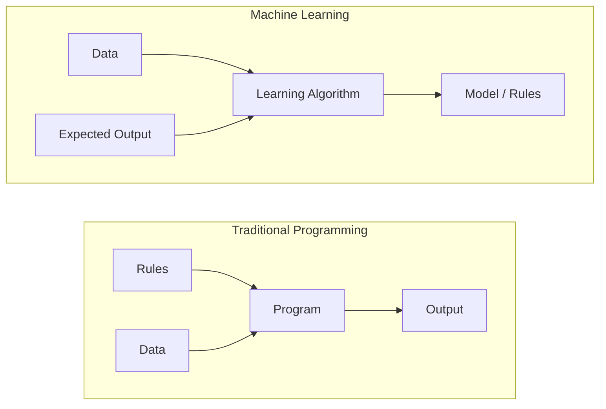
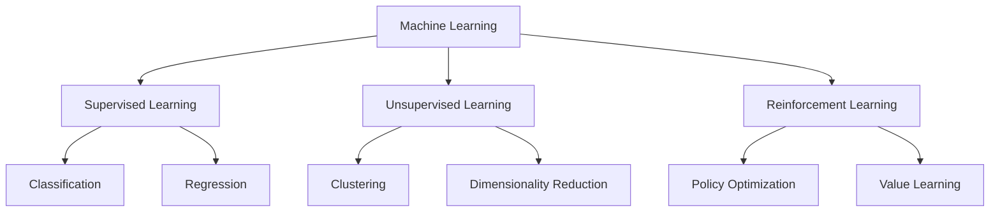
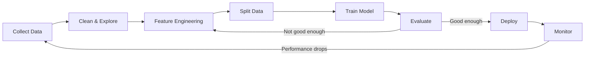
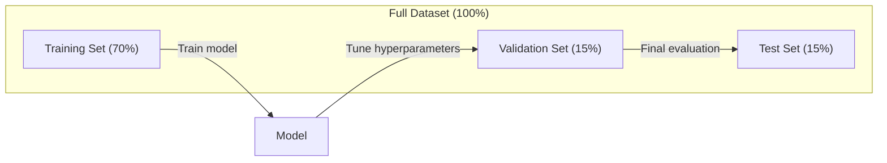
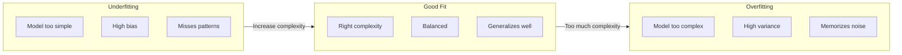
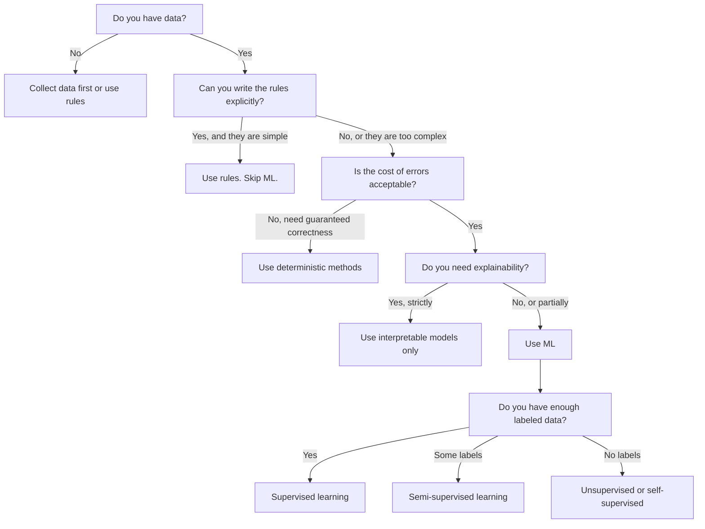

# یادگیری ماشین چیست

> یادگیری ماشین به کامپیوترها می آموزد تا الگوهای داده را پیدا کنند به جای نوشتن قوانین به دست.

**Type:** Learn
**Languages:** Python
**Prerequisites:** Phase 1 (Math Foundations)
**Time:** ~45 minutes

## اهداف یادگیری

- تفاوت بین یادگیری تحت نظارت، بدون نظارت و تقویت را توضیح دهید و مشخص کنید که کدام نوع برای یک مشکل خاص اعمال می شود
- از ابتدا نزدیکترین طبقه بندی کننده مرکز را پیاده سازی کنید و آن را با یک خط پایه تصادفی ارزیابی کنید
- بین وظایف طبقه بندی و بازپسین تفاوت ایجاد کنید و تابع خسارت مناسب برای هر یک از آنها را انتخاب کنید.
- ارزیابی اینکه آیا یک مشکل کسب و کار خاص برای ML مناسب است یا با قوانین تعیین کننده بهتر حل می شود

## مشکل

شما می خواهید یک فیلتر اسپام بسازید. رویکرد سنتی: بنشینید و صدها قانون بنویسید. "اگر ایمیل حاوی "پای رایگان" باشد، آن را اسپام نشان دهید. اگر بیش از 3 علامت فریاد داشته باشد، آن را اسپام نشان دهید". شما هفته ها را صرف نوشتن قوانین می کنید. سپس اسپامرها عبارت خود را تغییر می دهند. قوانین شما شکسته می شوند. شما قوانین بیشتری می نویسید. چرخه هرگز پایان نمی یابد.

یادگیری ماشین این کار را تغییر می دهد. به جای نوشتن قوانین، شما به کامپیوتر هزاران ایمیل با برچسب ("سپم" یا "نه اسپم") می دهید و اجازه می دهید قوانین را به تنهایی مشخص کند. کامپیوتر الگوهای را پیدا می کند که هرگز به آن فکر نمی کنید. وقتی اسپمرها تاکتیک را تغییر می دهند، شما به جای نوشتن کد، روی داده های جدید آموزش می دهید.

این تغییر از "قواعد برنامه نویسی" به "تعلم از داده ها" هسته یادگیری ماشین است. هر موتور توصیه، دستیار صوتی، ماشین خودران و مدل زبان به این ترتیب کار می کند.

## مفهوم

### از اطلاعات یاد بگیریم نه از قوانین

برنامه نویسی سنتی و یادگیری ماشین مشکلات را به جهت های مخالف حل می کند.



برنامه نویسی سنتی: شما قوانین را می نوسیید. برنامه آنها را به داده ها برای تولید محصول اعمال می کند.

یادگیری ماشین: شما داده ها و نتایج انتظار می رود را ارائه می دهید. الگوریتم قوانین را کشف می کند.

"نموذج" که از آموزش به دست می آید، قوانین است، که به عنوان اعداد (وزن، پارامتر) رمزگذاری شده است.

### سه نوع یادگیری ماشین



**Supervised Learning**: شما جفت های ورودی-خروجی دارید. مدل یاد می گیرد ورودی را به خروجی نقشه برداری کند.
- "این 10 هزار عکس با برچسب گربه یا سگ است. یاد بگیرید که آنها را از هم جدا کنید".
- "این ویژگی ها و قیمت خانه ها است.

**Unsupervised Learning**شما فقط ورودی دارید هیچ برچسب ای نیست مدل ساختار خود را پیدا می کند
- "همانجا 10 هزار تا سابقه خرید مشتری هست. گروه های طبیعی پیدا کنید".
- "اين 1000 نقطه داده ابعادي هست، با حفظ ساختار به 2 ابعاد کاهش بده"

**Reinforcement Learning**: یک عامل در محیط کاری انجام می دهد و پاداش یا مجازات دریافت می کند. او یک استراتژی (سیاست) برای حداکثر کردن پاداش کل را یاد می گیرد.
- "این بازی رو بازی کن، +1 برای برنده شدن، -1 برای از دست دادن، یک استراتژی رو پیدا کن".
- "این دست روبات رو کنترل کن +1 برای گرفتن این شی، -0.01 برای هر ثانیه ی تلف شده"

بیشتر آنچه در عمل ایجاد می کنید از یادگیری تحت نظارت استفاده می کند. یادگیری بدون نظارت برای پردازش پیش از انجام و اکتشاف رایج است. یادگیری تقویت بخش قدرت AI بازی، رباتیک و RLHF برای مدل های زبان است.

### فراتر از سه بزرگ

سه دسته بالا تمیز هستند، اما ML دنیای واقعی اغلب خطوط را محو می کند.

**Semi-supervised learning**شما می توانید ۱۰۰ عکس پزشکی با برچسب و ۱۰۰ هزار عکس بدون برچسب داشته باشید. تکنیک ها عبارتند از:

- **Label propagation:**یک نمودار بسازید که نقاط داده مشابه را متصل کند. برچسب ها از گره های برچسب شده به همسایه های بدون برچسب از طریق نمودار گسترش می یابند.
- **Pseudo-labeling:**یک مدل را بر روی داده های برچسب شده آموزش دهید، از آن برای پیش بینی برچسب ها برای داده های نامگذاری نشده استفاده کنید، سپس روی همه چیز آموزش دهید. مدل مجموعه آموزشی خود را شروع می کند.
- **Consistency regularization:**مدل باید برای یک ورودی پیش بینی مشابهی و یک نسخه کمی مختل کننده از آن ورودی ارائه دهد. این حتی بدون برچسب ها کار می کند.

**Self-supervised learning**این مدل از ساختار داده ها، وظیفه پیش بینی خود را ایجاد می کند.

- **Masked language modeling (BERT):**15 درصد کلمات را در جمله پنهان کنید، مدل را برای پیش بینی کلمات گمشده آموزش دهید. "توابع" از متن اصلی آمده است.
- **Contrastive learning (SimCLR):**یک تصویر بگیرید، دو نسخه افزوده ایجاد کنید. مدل را آموزش دهید تا تشخیص دهد که از همان تصویر آمده اند در حالی که آنها را از نسخه های افزوده ای از تصاویر دیگر متمایز می کند.
- **Next-token prediction (GPT):**هر متن متن به عنوان یک مثال آموزشی تبدیل می شود.

این دسته بندی ها از سه دسته بزرگ جدا نیستند. این استراتژی هایی هستند که ایده های تحت نظارت و بدون نظارت را ترکیب می کنند. یادگیری تحت نظارت خود از نظر فنی تحت نظارت است (نموذج چیزی را پیش بینی می کند) ، اما برچسب ها به طور خودکار تولید می شوند، نه توسط انسان.

### طبقه بندی در مقابل بازگشت

این دو وظیفه اصلی یادگیری تحت نظارت است.

| Aspect | Classification | Regression |
|--------|---------------|------------|
| Output | Discrete categories | Continuous numbers |
| Example | "Is this email spam?" | "What will the house price be?" |
| Output space | {cat, dog, bird} | Any real number |
| Loss function | Cross-entropy, accuracy | Mean squared error, MAE |
| Decision | Boundaries between classes | A curve that fits the data |

طبقه بندی پاسخ می دهد "چه دسته" و بازپسین پاسخ می دهد "چقدر؟"

بعضی از مشکلات می توانند به هر دو شکل شکل گرفته شوند. پیش بینی اینکه آیا یک سهام بالا یا پایین می رود طبقه بندی است. پیش بینی قیمت دقیق بازپسین است.

### جریان کار ML

هر پروژه یادگیری ماشین از همان خط تولید پیروی می کند، بدون توجه به الگوریتم.



**Collect Data**: جمع آوری داده های خام. اطلاعات بیشتر تقریبا همیشه بهتر است، اما کیفیت مهم تر از مقدار است.

**Clean & Explore**: مدیریت ارزش های گمشده، حذف دوگونی ها، تصویربرداری توزیع ها، تشخیص ناهنجاری ها. این مرحله اغلب 60-80% از کل زمان پروژه را می گیرد.

**Feature Engineering**: داده های خام را به ویژگی هایی تبدیل کنید که مدل می تواند از آن استفاده کند. تاریخ ها را به روز هفته تبدیل کنید. ستون های عددی را عادی کنید. متغیرهای دسته ای را رمزگذاری کنید. ویژگی های خوب مهم تر از الگوریتم های فانتزی هستند.

**Split Data**: به مجموعه های آموزش، اعتبارسنجی و آزمون تقسیم کنید. مدل ها بر اساس داده های آموزش، شما پارامترهای فوق العاده را بر اساس داده های اعتبارسنجی تنظیم می کنید و شما عملکرد نهایی را بر اساس داده های آزمون گزارش می دهید.

**Train Model**: داده های آموزش را به یک الگوریتم وارد کنید. الگوریتم پارامترهای داخلی را برای حداقل رساندن عملکرد از دست دادن تنظیم می کند.

**Evaluate**: عملکرد را بر اساس داده های تأیید/امتحان اندازه گیری کنید. اگر عملکرد قابل قبول نباشد، برگردید و ویژگی های مختلف، الگوریتم ها یا پارامترهای مختلف را امتحان کنید.

**Deploy**: مدل را به تولید بفرستید که در آن بر اساس داده های جدید پیش بینی کند.

**Monitor**: عملکرد را در طول زمان پیگیری کنید. توزیع داده ها تغییر می کند (دریفت داده ها) و مدل ها کاهش می یابد. هنگامی که عملکرد کاهش می یابد، دوباره آموزش دهید.

### آموزش، تایید و تقسیم آزمون

این مهم ترین مفهوم است که مبتدی ها اشتباه می کنند. شما باید مدل خود را بر اساس داده هایی که در طول آموزش دیده نشده ارزیابی کنید. در غیر این صورت شما یادآوری را اندازه گیری می کنید، نه یادگیری.



| Split | Purpose | When used | Typical size |
|-------|---------|-----------|-------------|
| Training | Model learns from this data | During training | 60-80% |
| Validation | Tune hyperparameters, compare models | After each training run | 10-20% |
| Test | Final unbiased performance estimate | Once, at the very end | 10-20% |

مجموعه تست مقدس است. شما به آن دقیقا یک بار نگاه می کنید. اگر شما به طور مداوم مدل خود را بر اساس عملکرد آزمون تنظیم می کنید، شما به طور موثر در مجموعه تست آموزش می دهید و اعداد گزارش شده شما بی معنی هستند.

برای مجموعه داده های کوچک، از اعتبارسنجی کثیر k استفاده کنید: داده ها را به بخش k تقسیم کنید، بر روی بخش k-1 تمرین کنید، بر روی بخش باقی مانده اعتبارسنجی کنید، نتایج را به طور متوسط و به طور چرخش انجام دهید.

### اضافه کردن نسبت به کم کردن



**Underfitting**: مدل برای گرفتن الگوهای داده ها خیلی ساده است. یک خط مستقیم در تلاش برای متناسب با یک رابطه منحنی است. خطای آموزش زیاد است. خطای آزمایش زیاد است.

**Overfitting**: مدل بیش از حد پیچیده است و داده های آموزش را از جمله صدا آن به یاد می گیرد. منحنی متحرک که از طریق هر نقطه آموزش عبور می کند اما در داده های جدید شکست می خورد. خطا آموزش کم است. خطا آزمون بالا است.

**Good fit**: مدل الگوهای واقعی را بدون حفظ صدا ضبط می کند. خطا آموزش و خطا آزمایش هر دو نسبتا کم است.

نشانه های بیش از حد مناسب:
- دقت آموزش خیلی بالاتر از دقت اعتبار
- این مدل در داده های آموزشی عملکرد خوبی دارد اما در داده های جدید ضعیف است
- اضافه کردن اطلاعات آموزشی بیشتر باعث بهبود عملکرد می شود (نموذج حفظ بود نه یادگیری)

فکس های بیش از حد نصب:
- اطلاعات آموزش بیشتر رو بدست بيار
- کاهش پیچیدگی مدل (پارامترهای کمتر، معماری ساده تر)
- تنظیم (به اضافه کردن مجازات برای وزن های بزرگ)
- ترک (در طول تمرین، نورون های عصبی به طور تصادفی صفر می شوند)
- توقف زودرس (درگیری را متوقف کنید وقتی خطا اعتبارسنجی افزایش می یابد)

ورق های مناسب برای قرار دادن:
- از مدل پیچیده تر استفاده کنید
- ویژگی های بیشتری اضافه کنید
- کاهش تنظیمات
- قطار طولانی تر

### تعصب در میان انواع

این چارچوب ریاضی پشت بیش از حد مناسب و کم مناسب است.

**Bias**خطای اشتباه در مدل: یک مدل خطی دارای تعصب بالایی است وقتی رابطه واقعی غیر خطی است. تعصب بالا منجر به تناسب نپذیر می شود.

**Variance**: خطا از حساسیت به نوسانات کوچک در داده های آموزش. یک مدل با تفاوت بالا پیش بینی های بسیار متفاوتی را هنگام آموزش در زیر مجموعه های مختلف داده ها ارائه می دهد. تفاوت بالا منجر به بیش از حد مناسب می شود.

| Model complexity | Bias | Variance | Result |
|-----------------|------|----------|--------|
| Too low (linear model for curved data) | High | Low | Underfitting |
| Just right | Medium | Medium | Good generalization |
| Too high (degree-20 polynomial for 10 points) | Low | High | Overfitting |

خطای کل = تعصب^2 + تغیر + شور غیر قابل کاهش

شما نمی توانید صداهای غیر قابل کاهش را کاهش دهید (این تصادفی در داده ها است). شما می خواهید نقطه شیرین را پیدا کنید که در آن انحراف^2 + متغیر به حداقل برسد.

### نظريه ناهار رایگان وجود ندارد

هیچ الگوریتم ای وجود ندارد که برای هر مشکل بهترین عملکرد را داشته باشد. یک الگوریتم که در یک کلاس مشکلات عملکرد خوبی داشته باشد، در کلاس دیگری عملکرد ضعیف خواهد داشت. به همین دلیل دانشمندان داده الگوریتم های متعددی را امتحان می کنند و نتایج را مقایسه می کنند.

در عمل، انتخاب بستگی به:
- چقدر اطلاعات داري
- چند تا از ویژگی ها وجود داره
- این رابطه خطی یا غیر خطی است یا نه
- آیا شما نیاز به تفسیر دارید
- چقدر حساب می تونی تحمل کنی

### زمانی که نباید از یادگیری ماشین استفاده کنیم

ML قدرتمند است اما همیشه ابزار مناسب نیست. قبل از اینکه به دنبال یک مدل باشید، بپرسید که آیا واقعا به آن نیاز دارید.

**Do not use ML when:**

- **Rules are simple and well-defined.**محاسبه مالیات، الگوریتم های مرتب کردن، تبدیل واحد. اگر می توانید منطق را در چند صورت بیانات بنویسید، یک مدل بدون سود پیچیدگی اضافه می کند.
- **You have no data or very little data.**ML به نمونه ها نیاز داره تا ازشون یاد بگیره با 10 نقطه داده نمیتونی هیچ چیز معنی دار رو آموزش بدی اول داده ها رو جمع آوری کن
- **The cost of being wrong is catastrophic and you need guaranteed correctness.**محاسبه دوز پزشکی، کنترل رآکتور هسته ای، تأیید رمزنگاری. مدل های ML احتمالاتی هستند. گاهی اوقات اشتباه خواهند کرد. اگر "گاهی اشتباه" قابل قبول نیست، از روش های تعیین کننده استفاده کنید.
- **A lookup table or heuristic solves the problem.**اگر یک حد یا جدول ساده 99 درصد موارد را پوشش دهد، اضافه کردن ML بدون بهبود معنادار هزینه نگهداری را افزایش می دهد.
- **You cannot explain the decision and explainability is required.**صنایع تنظیم شده (قرض، بیمه، عدالت کیفری) گاهی اوقات نیاز به اینکه هر تصمیم به طور کامل توضیح داده شود دارند. برخی از مدل های ML قابل تفسیر هستند (رجس خطی، درختان تصمیم کوچک). اکثر آنها نیستند.
- **The problem changes faster than you can retrain.**اگر قوانین هر روز تغییر کند و آموزش مجدد یک هفته طول بکشد، مدل همیشه قدیمی است.

از این نمودار جریان تصمیم استفاده کنید:



```figure
f3-learning-boundary
```

## آن را بسازید

کد در`code/ml_intro.py`این کار ساده ترین الگوریتم ML را از نو اجرا می کند. این ایده اصلی را نشان می دهد: از داده ها یاد بگیرید، سپس بر روی داده های جدید پیش بینی کنید.

### مرحله اول: نزدیک ترین طبقه بندی کننده سنتراید از ابتدا

نزدیک ترین طبقه بندی کننده مرکز درجه در داده های آموزش مرکز (متوسط) هر کلاس را محاسبه می کند. برای پیش بینی، هر نقطه جدید را به کلاس نزدیک ترین مرکز اختصاص می دهد.

```python
class NearestCentroid:
    def fit(self, X, y):
        self.classes = np.unique(y)
        self.centroids = np.array([
            X[y == c].mean(axis=0) for c in self.classes
        ])

    def predict(self, X):
        distances = np.array([
            np.sqrt(((X - c) ** 2).sum(axis=1))
            for c in self.centroids
        ])
        return self.classes[distances.argmin(axis=0)]
```

این کل الگوریتم است. فیت دو راه را محاسبه می کند. پیش بینی فاصله را محاسبه می کند. هیچ کاهش گرادینت، هیچ تکرار، هیچ پارامترهای فوق العاده ای.

### مرحله دوم: آموزش داده های مصنوعی

ما مجموعه داده های طبقه بندی 2D را با دو کلاس که کمی همپوشیده اند تولید می کنیم. طبقه بندی کننده مرکزین یک مرز تصمیم گیری خطی بین مراکز کلاس را می کشد.

```python
rng = np.random.RandomState(42)
X_class0 = rng.randn(100, 2) + np.array([1.0, 1.0])
X_class1 = rng.randn(100, 2) + np.array([-1.0, -1.0])
X = np.vstack([X_class0, X_class1])
y = np.array([0] * 100 + [1] * 100)
```

### مرحله سوم: با یک خط اصلی مقایسه کنید

هر مدل ML باید با یک خط پایه معمولی مقایسه شود. در اینجا، خط پایه یک کلاس تصادفی را پیش بینی می کند. اگر مدل ML شما حدس تصادفی را نبرد، چیزی اشتباه است.

```python
baseline_preds = rng.choice([0, 1], size=len(y_test))
baseline_acc = np.mean(baseline_preds == y_test)
```

طبقه بندی کننده مرکزي بايد در حدود 90 درصد + دقت در اين مجموعه داده هاي پاك داشته باشه.

### چرا این مهم است

نزدیک ترین طبقه بندی کننده مرکزین به سادگی ساده است. این هیچ پارامترهای بیش از حد، هیچ تکرار، هیچ کاهش گرادینت ندارد. اما آن را ضبط کردن الگوی ML اساسی:

1. **Learn**یک نمایش از داده های آموزشی (مرکز های آموزشی)
2. **Predict**در مورد داده های جدید با استفاده از این نمایش (بهترین فاصله)
3. **Evaluate**در مقایسه با خط پایه (خمط تصادفی)

هر الگوریتم ML، از بازپسین لوژیستیک تا ترانسفورماتور، از این الگوی سه مرحله ای پیروی می کند. نمایش پیچیده تر می شود، اما جریان کار یکسان باقی می ماند.

### مرحله چهارم: کاری که طبقه بندی کننده سنتراید نمی تواند انجام دهد

نزدیک ترین طبقه بندی کننده مرکزین فرض می کند که هر کلاس یک نقطه را تشکیل می دهد. آن مرز تصمیم گیری خطی را می کشد. زمانی که:

- کلاس ها دارای چندین خوشه هستند (به عنوان مثال، رقم "1" می تواند به چندین روش مختلف نوشته شود)
- مرز تصمیم گیری غیر خطی است (به عنوان مثال، یک کلاس اطراف یک کلاس دیگر بسته می شود)
- ویژگی ها دارای مقیاس های بسیار متفاوتی هستند (مسافره توسط ویژگی مقیاس بزرگ تر غالب می شود)

این محدودیت ها هر الگوریتم دیگری را که می آموزید انگیزه می دهند. نزدیک ترین همسایه K چندین خوشه را اداره می کند. درختان تصمیم گیری مرز های غیر خطی را اداره می کنند. مقیاس بندی ویژگی مشکل مقیاس را حل می کند. هر درس بر اساس محدودیت های قبلی ساخته می شود.

## ازش استفاده کن

sklearn ارائه می دهد`NearestCentroid`و ژنراتورهای داده های مصنوعی:

```python
from sklearn.neighbors import NearestCentroid
from sklearn.datasets import make_classification
from sklearn.model_selection import train_test_split

X, y = make_classification(
    n_samples=500, n_features=2, n_redundant=0,
    n_clusters_per_class=1, random_state=42
)
X_train, X_test, y_train, y_test = train_test_split(X, y, test_size=0.3)

clf = NearestCentroid()
clf.fit(X_train, y_train)
print(f"Accuracy: {clf.score(X_test, y_test):.3f}")
```

## -باده

این درس به ما کمک می کند`outputs/prompt-ml-problem-framer.md`-- یک پیام که مشکلات کسب و کار مبهم را به وظایف ML مشخص تبدیل می کند. یک توصیف مشکل را به آن بدهید ("ما می خواهیم کاهش کاهش هزینه" یا "توقع تقاضا برای سه ماهه آینده") و آن نوع یادگیری را شناسایی می کند، هدف پیش بینی را تعریف می کند، ویژگی های کاندید را لیست می کند، یک معیار موفقیت را انتخاب می کند، یک خط پایه را تعیین می کند و به عنوان دزدی داده ها یا عدم تعادل کلاس ها را نشان می دهد. ازش در شروع هر پروژه ML استفاده کنید تا از ساخت چیزی اشتباه اجتناب کنید.

## اصطلاحات کلیدی

| Term | What people say | What it actually means |
|------|----------------|----------------------|
| Model | "The AI" | A mathematical function with learnable parameters that maps inputs to outputs |
| Training | "Teaching the AI" | Running an optimization algorithm to adjust model parameters so predictions match known outputs |
| Feature | "An input column" | A measurable property of the data that the model uses to make predictions |
| Label | "The answer" | The known output for a training example, used to compute the error signal |
| Hyperparameter | "A setting you tweak" | A parameter set before training that controls the learning process (learning rate, number of layers) |
| Loss function | "How wrong the model is" | A function that measures the gap between predicted and actual outputs, which training tries to minimize |
| Overfitting | "It memorized the test" | The model learned training-specific noise instead of general patterns, so it fails on new data |
| Underfitting | "It didn't learn anything" | The model is too simple to capture the real patterns in the data |
| Generalization | "It works on new data" | The model's ability to make accurate predictions on data it was not trained on |
| Cross-validation | "Testing on different chunks" | Repeatedly splitting data into train/test folds and averaging results, giving a more robust performance estimate |
| Regularization | "Keeping weights small" | Adding a penalty term to the loss function that discourages overly complex models |
| Data drift | "The world changed" | The statistical distribution of incoming data shifts over time, degrading model performance |

## تمرینات

1. هر مجموعه داده ای را (به عنوان مثال، Iris، Titanic) بگیرید. آن را 70/15/15 به قطار/تحقق/تحقیق تقسیم کنید. توضیح دهید که چرا نباید پارامترهای هیپرامیتر را در مجموعه آزمایش تنظیم کنید.
2. برای هر یک از این مشکلات، مشخص کنید که آیا آن ها طبقه بندی، بازگشت یا گروه بندی هستند و آیا تحت نظارت هستند یا بدون نظارت.
3. یک مدل در داده های آموزش 99 درصد دقت دارد اما در داده های آزمایش 60 درصد. مشکل را تشخیص دهید و سه چیز را لیست کنید که می خواهید آن را حل کنید.

## خواندن بیشتر

- [An Introduction to Statistical Learning](https://www.statlearning.com/)- کتاب آموزشی رایگان که شامل تمام روش های ML کلاسیک و نمونه های عملی می شود
- [Google's Machine Learning Crash Course](https://developers.google.com/machine-learning/crash-course)- معرفی بصری خلاصه ای از مفاهیم ML
- [Scikit-learn User Guide](https://scikit-learn.org/stable/user_guide.html)- مرجع عملی برای پیاده سازی ML در پایتون
