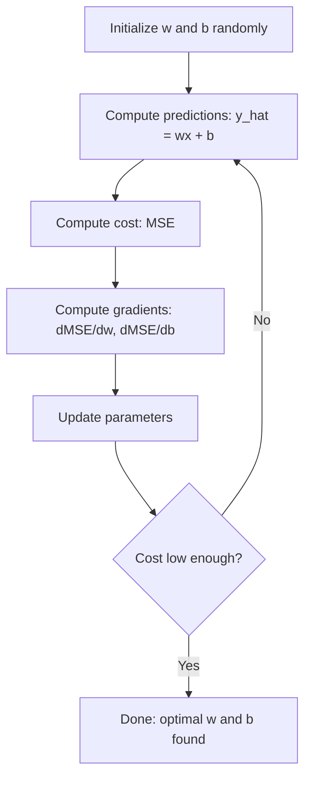

# بازپسین خطی

> بازپسین خطی بهترین خط مستقیم را از طریق داده های شما می کشد. این "سلام دنیا" یادگیری ماشین است.

**Type:** Build
**Languages:** Python
**Prerequisites:** Phase 1 (Linear Algebra, Calculus, Optimization), Phase 2 Lesson 1
**Time:** ~90 minutes

## اهداف یادگیری

- قوانین بروزرسانی کاهش گرادیان برای خطای متوسط مربع را بازیافت کنید و بازپسین خطی را از ابتدا اجرا کنید
- مقایسه کاهش گرادینت و معادله طبیعی از نظر پیچیدگی محاسباتی و زمانی که برای هر یک از آنها استفاده کنید
- یک مدل بازپسین خطی چندگانه با استاندارد سازی ویژگی ها بسازید و وزنه های آموخته شده را تفسیر کنید
- توضیح دهید که چگونه بازپسین ریج (تعدیل L2) از اضافه شدن وزن با مجازات وزن های بزرگ جلوگیری می کند

## مشکل

شما داده هایی دارید: اندازه خانه ها و قیمت فروش آنها. شما می خواهید قیمت خانه جدید را با توجه به اندازه آن پیش بینی کنید. شما می توانید آن را در یک نقشه پخش کنید، اما شما نیاز به فرمول دارید. شما نیاز به یک خط دارید که بهترین تناسب با داده ها را داشته باشد تا بتوانید هر اندازه را وصل کنید و پیش بینی قیمت را بدست آورید.

بازپسین خطی به شما این خط را می دهد. مهمتر از همه، این کل حلقه آموزش ML را معرفی می کند: یک مدل را تعریف کنید، یک تابع هزینه را تعریف کنید، پارامترها را بهینه سازی کنید. هر الگوریتم ML از این الگوی پیروی می کند. با ساده ترین مورد آن را در اینجا مدیریت کنید، و شما آن را در همه جا تشخیص خواهید داد.

این فقط برای مشکلات ساده نیست. بازپسین خطی در سیستم های تولید برای پیش بینی تقاضا، تجزیه و تحلیل آزمون A / B، مدل سازی مالی و به عنوان یک خط پایه برای هر کار بازپسین استفاده می شود.

## مفهوم

### نمونه

بازپسین خطی فرض می کند که رابطه خطی بین ورودی (x) و ورودی (y) وجود داشته باشد:

```
y = wx + b
```

- `w`(وزن/سوال): چقدر y تغییر می کند وقتی x با 1 افزایش می یابد
- `b`(تاهید/قاطع): ارزش y زمانی که x = 0

برای ورودی های متعدد (تخصیصات) این به:

```
y = w1*x1 + w2*x2 + ... + wn*xn + b
```

یا به صورت ویکتور:`y = w^T * x + b`

هدف: یافتن ارزش های w و b که باعث می شود y پیش بینی شده تا حد ممکن به y واقعی در تمام نمونه های آموزش نزدیک شود.

### عملکرد هزینه (خطای متوسط مربع)

چگونه "به عنوان نزدیک به ممکن" اندازه گیری می کنید؟ شما نیاز به یک عدد واحد دارید که نشان دهد پیش بینی های شما چقدر اشتباه است. رایج ترین انتخاب خطای متوسط مربع (MSE) است:

```
MSE = (1/n) * sum((y_predicted - y_actual)^2)
```

چرا مربع؟ دو دلیل. اول، این خطا های بزرگ را بیشتر از اشتباهات کوچک مجازات می کند (خطای 10 برابر 100 برابر بدتر از خطای 1 است نه 10 برابر). دوم، تابع مربع در همه جا صاف و قابل تفاوتی است، که بهینه سازی را ساده می کند.

عملکرد هزینه سطح را ایجاد می کند. برای یک وزن واحد w و bias b، سطح MSE مانند یک کاسه (پاراولاید مخلوط) به نظر می رسد. پایین کاسه جایی است که MSE به حداقل رسانی می رسد. آموزش به معنای یافتن آن پایین است.

### کاهش تدریجی

به طور تدريجي به پايين تخته اي مي رسد با قدم زدن به پايين.



گرادینت ها دو چیز را به شما می گویند: کدام جهت هر پارامتر را حرکت دهید و چقدر حرکت کنید.

برای MSE با y_hat = wx + b:

```
dMSE/dw = (2/n) * sum((y_hat - y) * x)
dMSE/db = (2/n) * sum(y_hat - y)
```

قانون تازه:

```
w = w - learning_rate * dMSE/dw
b = b - learning_rate * dMSE/db
```

سرعت یادگیری اندازه گام را کنترل می کند. بیش از حد بزرگ: شما از حداقل عبور می کنید و منحرف می شوید. بیش از حد کوچک: آموزش برای همیشه طول می کشد. ارزش های اولیه معمول: 0.01، 0.001 یا 0.0001.

### معادله طبیعی (حل شکل بسته)

برای بازپسین خطی به طور خاص، یک فرمول مستقیم وجود دارد که بدون هیچ تکرار، وزنهای مطلوب را می دهد:

```
w = (X^T * X)^(-1) * X^T * y
```

این یک ماتریس را برای حل کردن w در یک مرحله معکوس می کند. این برای مجموعه داده های کوچک به خوبی کار می کند. برای مجموعه داده های بزرگ (میلیون ها ردیف یا هزاران ویژگی) ، کاهش گرادینت ترجیح داده می شود زیرا معکوس ماترسی O(n^3) در تعداد ویژگی ها است.

### بازگشت خطی چندگانه

با ویژگی های متعدد، مدل تبدیل به:

```
y = w1*x1 + w2*x2 + ... + wn*xn + b
```

همه چیز به همان شکل کار می کند: MSE عملکرد هزینه است، گرادینت نزول تمام وزنه ها را به طور همزمان به روز می کند. تنها تفاوت این است که شما یک فرش فرعی را به جای یک خط نصب می کنید.

در این مورد مقیاس بندی ویژگی ها مهم است. اگر یک ویژگی از 0 تا 1 و دیگری از 0 تا 1,000,000 باشد، کاهش گرادینت به دلیل افزایش سطح هزینه ها مشکل خواهد داشت. قبل از آموزش ویژگی های استاندارد (معادل را حذف کنید، با انحراف استاندارد تقسیم کنید) را استاندارد کنید.

### بازپسین چندگانه

اگر رابطه خطی نباشد چه می شود؟ شما هنوز می توانید با ایجاد ویژگی های چندگانه از رجریشن خطی استفاده کنید:

```
y = w1*x + w2*x^2 + w3*x^3 + b
```

این بازپسین "خطی" است زیرا مدل در وزنه ها خطی است (w1، w2، w3). شما فقط از ویژگی های غیر خطی x استفاده می کنید.

چند متغیر درجه بالاتر می تواند منحنیات پیچیده تری را متناسب کند اما خطر بیش از حد مناسب است. یک چند متغیر درجه 10 از طریق هر نقطه در مجموعه داده های 10 نقطه عبور می کند اما در داده های جدید ضعیف پیش بینی می کند.

### امتیاز R مربع

MSE به شما می گوید که چقدر اشتباه می کنید، اما این عدد بستگی به مقیاس y دارد. R- مربع (R^2) یک اندازه گیری مستقل از مقیاس را می دهد:

```
R^2 = 1 - (sum of squared residuals) / (sum of squared deviations from mean)
    = 1 - SS_res / SS_tot
```

- R^2 = 1.0: پیش بینی های کامل
- R^2 = 0.0: مدل بهتر از پیش بینی متوسط هر بار نیست
- R^2 < 0.0: مدل بدتر از پیش بینی متوسط است

### پیش نمایش تنظیم (رجرج ریج)

هنگامی که شما ویژگی های بسیاری دارید، مدل می تواند با اختصاص وزن های بزرگ بیش از حد متناسب باشد. بازگشت ریدج (رجولاریزاسیون L2) یک مجازات اضافه می کند:

```
Cost = MSE + lambda * sum(w_i^2)
```

اصطلاح مجازات وزن های بزرگ را تشویق نمی کند. لامبا هایپر پارامتر کنترل تعویض را کنترل می کند: لامبا های بالاتر به معنای وزن های کوچکتر و تنظیم بیشتر است. این موضوع در یک درس بعدی به طور عمیق مورد بحث قرار می گیرد. برای حال، بدانید که وجود دارد و چرا کمک می کند.

```figure
linear-regression-fit
```

## آن را بسازید

### مرحله 1: تولید داده های نمونه

```python
import random
import math

random.seed(42)

TRUE_W = 3.0
TRUE_B = 7.0
N_SAMPLES = 100

X = [random.uniform(0, 10) for _ in range(N_SAMPLES)]
y = [TRUE_W * x + TRUE_B + random.gauss(0, 2.0) for x in X]

print(f"Generated {N_SAMPLES} samples")
print(f"True relationship: y = {TRUE_W}x + {TRUE_B} (+ noise)")
print(f"First 5 points: {[(round(X[i], 2), round(y[i], 2)) for i in range(5)]}")
```

### مرحله دوم: بازگشت خطی از صفر با کاهش گرادینت

```python
class LinearRegression:
    def __init__(self, learning_rate=0.01):
        self.w = 0.0
        self.b = 0.0
        self.lr = learning_rate
        self.cost_history = []

    def predict(self, X):
        return [self.w * x + self.b for x in X]

    def compute_cost(self, X, y):
        predictions = self.predict(X)
        n = len(y)
        cost = sum((pred - actual) ** 2 for pred, actual in zip(predictions, y)) / n
        return cost

    def compute_gradients(self, X, y):
        predictions = self.predict(X)
        n = len(y)
        dw = (2 / n) * sum((pred - actual) * x for pred, actual, x in zip(predictions, y, X))
        db = (2 / n) * sum(pred - actual for pred, actual in zip(predictions, y))
        return dw, db

    def fit(self, X, y, epochs=1000, print_every=200):
        for epoch in range(epochs):
            dw, db = self.compute_gradients(X, y)
            self.w -= self.lr * dw
            self.b -= self.lr * db
            cost = self.compute_cost(X, y)
            self.cost_history.append(cost)
            if epoch % print_every == 0:
                print(f"  Epoch {epoch:4d} | Cost: {cost:.4f} | w: {self.w:.4f} | b: {self.b:.4f}")
        return self

    def r_squared(self, X, y):
        predictions = self.predict(X)
        y_mean = sum(y) / len(y)
        ss_res = sum((actual - pred) ** 2 for actual, pred in zip(y, predictions))
        ss_tot = sum((actual - y_mean) ** 2 for actual in y)
        return 1 - (ss_res / ss_tot)


print("=== Training Linear Regression (Gradient Descent) ===")
model = LinearRegression(learning_rate=0.005)
model.fit(X, y, epochs=1000, print_every=200)
print(f"\nLearned: y = {model.w:.4f}x + {model.b:.4f}")
print(f"True:    y = {TRUE_W}x + {TRUE_B}")
print(f"R-squared: {model.r_squared(X, y):.4f}")
```

### مرحله 3: معادله طبیعی (حل شکل بسته)

```python
class LinearRegressionNormal:
    def __init__(self):
        self.w = 0.0
        self.b = 0.0

    def fit(self, X, y):
        n = len(X)
        x_mean = sum(X) / n
        y_mean = sum(y) / n
        numerator = sum((X[i] - x_mean) * (y[i] - y_mean) for i in range(n))
        denominator = sum((X[i] - x_mean) ** 2 for i in range(n))
        self.w = numerator / denominator
        self.b = y_mean - self.w * x_mean
        return self

    def predict(self, X):
        return [self.w * x + self.b for x in X]

    def r_squared(self, X, y):
        predictions = self.predict(X)
        y_mean = sum(y) / len(y)
        ss_res = sum((actual - pred) ** 2 for actual, pred in zip(y, predictions))
        ss_tot = sum((actual - y_mean) ** 2 for actual in y)
        return 1 - (ss_res / ss_tot)


print("\n=== Normal Equation (Closed-Form) ===")
model_normal = LinearRegressionNormal()
model_normal.fit(X, y)
print(f"Learned: y = {model_normal.w:.4f}x + {model_normal.b:.4f}")
print(f"R-squared: {model_normal.r_squared(X, y):.4f}")
```

### مرحله 4: بازگشت خطی چندگانه

```python
class MultipleLinearRegression:
    def __init__(self, n_features, learning_rate=0.01):
        self.weights = [0.0] * n_features
        self.bias = 0.0
        self.lr = learning_rate
        self.cost_history = []

    def predict_single(self, x):
        return sum(w * xi for w, xi in zip(self.weights, x)) + self.bias

    def predict(self, X):
        return [self.predict_single(x) for x in X]

    def compute_cost(self, X, y):
        predictions = self.predict(X)
        n = len(y)
        return sum((pred - actual) ** 2 for pred, actual in zip(predictions, y)) / n

    def fit(self, X, y, epochs=1000, print_every=200):
        n = len(y)
        n_features = len(X[0])
        for epoch in range(epochs):
            predictions = self.predict(X)
            errors = [pred - actual for pred, actual in zip(predictions, y)]
            for j in range(n_features):
                grad = (2 / n) * sum(errors[i] * X[i][j] for i in range(n))
                self.weights[j] -= self.lr * grad
            grad_b = (2 / n) * sum(errors)
            self.bias -= self.lr * grad_b
            cost = self.compute_cost(X, y)
            self.cost_history.append(cost)
            if epoch % print_every == 0:
                print(f"  Epoch {epoch:4d} | Cost: {cost:.4f}")
        return self

    def r_squared(self, X, y):
        predictions = self.predict(X)
        y_mean = sum(y) / len(y)
        ss_res = sum((actual - pred) ** 2 for actual, pred in zip(y, predictions))
        ss_tot = sum((actual - y_mean) ** 2 for actual in y)
        return 1 - (ss_res / ss_tot)


random.seed(42)
N = 100
X_multi = []
y_multi = []
for _ in range(N):
    size = random.uniform(500, 3000)
    bedrooms = random.randint(1, 5)
    age = random.uniform(0, 50)
    price = 50 * size + 10000 * bedrooms - 1000 * age + 50000 + random.gauss(0, 20000)
    X_multi.append([size, bedrooms, age])
    y_multi.append(price)


def standardize(X):
    n_features = len(X[0])
    means = [sum(X[i][j] for i in range(len(X))) / len(X) for j in range(n_features)]
    stds = []
    for j in range(n_features):
        variance = sum((X[i][j] - means[j]) ** 2 for i in range(len(X))) / len(X)
        stds.append(variance ** 0.5)
    X_scaled = []
    for i in range(len(X)):
        row = [(X[i][j] - means[j]) / stds[j] if stds[j] > 0 else 0 for j in range(n_features)]
        X_scaled.append(row)
    return X_scaled, means, stds


y_mean_val = sum(y_multi) / len(y_multi)
y_std_val = (sum((yi - y_mean_val) ** 2 for yi in y_multi) / len(y_multi)) ** 0.5
y_scaled = [(yi - y_mean_val) / y_std_val for yi in y_multi]

X_scaled, x_means, x_stds = standardize(X_multi)

print("\n=== Multiple Linear Regression (3 features) ===")
print("Features: house size, bedrooms, age")
multi_model = MultipleLinearRegression(n_features=3, learning_rate=0.01)
multi_model.fit(X_scaled, y_scaled, epochs=1000, print_every=200)

print(f"\nWeights (standardized): {[round(w, 4) for w in multi_model.weights]}")
print(f"Bias (standardized): {multi_model.bias:.4f}")
print(f"R-squared: {multi_model.r_squared(X_scaled, y_scaled):.4f}")
```

### مرحله 5: بازپسین چندگانه

```python
class PolynomialRegression:
    def __init__(self, degree, learning_rate=0.01):
        self.degree = degree
        self.weights = [0.0] * degree
        self.bias = 0.0
        self.lr = learning_rate

    def make_features(self, X):
        return [[x ** (d + 1) for d in range(self.degree)] for x in X]

    def predict(self, X):
        features = self.make_features(X)
        return [sum(w * f for w, f in zip(self.weights, row)) + self.bias for row in features]

    def fit(self, X, y, epochs=1000, print_every=200):
        features = self.make_features(X)
        n = len(y)
        for epoch in range(epochs):
            predictions = [sum(w * f for w, f in zip(self.weights, row)) + self.bias for row in features]
            errors = [pred - actual for pred, actual in zip(predictions, y)]
            for j in range(self.degree):
                grad = (2 / n) * sum(errors[i] * features[i][j] for i in range(n))
                self.weights[j] -= self.lr * grad
            grad_b = (2 / n) * sum(errors)
            self.bias -= self.lr * grad_b
            if epoch % print_every == 0:
                cost = sum(e ** 2 for e in errors) / n
                print(f"  Epoch {epoch:4d} | Cost: {cost:.6f}")
        return self

    def r_squared(self, X, y):
        predictions = self.predict(X)
        y_mean = sum(y) / len(y)
        ss_res = sum((actual - pred) ** 2 for actual, pred in zip(y, predictions))
        ss_tot = sum((actual - y_mean) ** 2 for actual in y)
        return 1 - (ss_res / ss_tot)


random.seed(42)
X_poly = [x / 10.0 for x in range(0, 50)]
y_poly = [0.5 * x ** 2 - 2 * x + 3 + random.gauss(0, 1.0) for x in X_poly]

x_max = max(abs(x) for x in X_poly)
X_poly_norm = [x / x_max for x in X_poly]
y_poly_mean = sum(y_poly) / len(y_poly)
y_poly_std = (sum((yi - y_poly_mean) ** 2 for yi in y_poly) / len(y_poly)) ** 0.5
y_poly_norm = [(yi - y_poly_mean) / y_poly_std for yi in y_poly]

print("\n=== Polynomial Regression (degree 2 vs degree 5) ===")
print("True relationship: y = 0.5x^2 - 2x + 3")

print("\nDegree 2:")
poly2 = PolynomialRegression(degree=2, learning_rate=0.1)
poly2.fit(X_poly_norm, y_poly_norm, epochs=2000, print_every=500)
print(f"  R-squared: {poly2.r_squared(X_poly_norm, y_poly_norm):.4f}")

print("\nDegree 5:")
poly5 = PolynomialRegression(degree=5, learning_rate=0.1)
poly5.fit(X_poly_norm, y_poly_norm, epochs=2000, print_every=500)
print(f"  R-squared: {poly5.r_squared(X_poly_norm, y_poly_norm):.4f}")

print("\nDegree 2 fits the true curve well. Degree 5 fits training data slightly better")
print("but risks overfitting on new data.")
```

### مرحله 6: بازگشت خط (رجولاریزاسیون L2)

```python
class RidgeRegression:
    def __init__(self, n_features, learning_rate=0.01, alpha=1.0):
        self.weights = [0.0] * n_features
        self.bias = 0.0
        self.lr = learning_rate
        self.alpha = alpha

    def predict_single(self, x):
        return sum(w * xi for w, xi in zip(self.weights, x)) + self.bias

    def predict(self, X):
        return [self.predict_single(x) for x in X]

    def fit(self, X, y, epochs=1000, print_every=200):
        n = len(y)
        n_features = len(X[0])
        for epoch in range(epochs):
            predictions = self.predict(X)
            errors = [pred - actual for pred, actual in zip(predictions, y)]
            mse = sum(e ** 2 for e in errors) / n
            reg_term = self.alpha * sum(w ** 2 for w in self.weights)
            cost = mse + reg_term
            for j in range(n_features):
                grad = (2 / n) * sum(errors[i] * X[i][j] for i in range(n))
                grad += 2 * self.alpha * self.weights[j]
                self.weights[j] -= self.lr * grad
            grad_b = (2 / n) * sum(errors)
            self.bias -= self.lr * grad_b
            if epoch % print_every == 0:
                print(f"  Epoch {epoch:4d} | Cost: {cost:.4f} | L2 penalty: {reg_term:.4f}")
        return self


print("\n=== Ridge Regression (L2 Regularization) ===")
print("Same data as multiple regression, with alpha=0.1")
ridge = RidgeRegression(n_features=3, learning_rate=0.01, alpha=0.1)
ridge.fit(X_scaled, y_scaled, epochs=1000, print_every=200)
print(f"\nRidge weights: {[round(w, 4) for w in ridge.weights]}")
print(f"Plain weights: {[round(w, 4) for w in multi_model.weights]}")
print("Ridge weights are smaller (shrunk toward zero) due to the L2 penalty.")
```

## ازش استفاده کن

حالا همین کار را با سکیت-لرن انجام می دهید، که در واقع در تولید استفاده می کنید.

```python
from sklearn.linear_model import LinearRegression as SklearnLR
from sklearn.linear_model import Ridge
from sklearn.preprocessing import PolynomialFeatures, StandardScaler
from sklearn.model_selection import train_test_split
from sklearn.metrics import mean_squared_error, r2_score
import numpy as np

np.random.seed(42)
X_sk = np.random.uniform(0, 10, (100, 1))
y_sk = 3.0 * X_sk.squeeze() + 7.0 + np.random.normal(0, 2.0, 100)

X_train, X_test, y_train, y_test = train_test_split(X_sk, y_sk, test_size=0.2, random_state=42)

lr = SklearnLR()
lr.fit(X_train, y_train)
y_pred = lr.predict(X_test)

print("=== Scikit-learn Linear Regression ===")
print(f"Coefficient (w): {lr.coef_[0]:.4f}")
print(f"Intercept (b): {lr.intercept_:.4f}")
print(f"R-squared (test): {r2_score(y_test, y_pred):.4f}")
print(f"MSE (test): {mean_squared_error(y_test, y_pred):.4f}")

poly = PolynomialFeatures(degree=2, include_bias=False)
X_poly_sk = poly.fit_transform(X_train)
X_poly_test = poly.transform(X_test)

lr_poly = SklearnLR()
lr_poly.fit(X_poly_sk, y_train)
print(f"\nPolynomial degree 2 R-squared: {r2_score(y_test, lr_poly.predict(X_poly_test)):.4f}")

scaler = StandardScaler()
X_train_scaled = scaler.fit_transform(X_train)
X_test_scaled = scaler.transform(X_test)

ridge = Ridge(alpha=1.0)
ridge.fit(X_train_scaled, y_train)
print(f"Ridge R-squared: {r2_score(y_test, ridge.predict(X_test_scaled)):.4f}")
print(f"Ridge coefficient: {ridge.coef_[0]:.4f}")
```

اجرای از ابتدا و یادگیری از ابتدا نتایج مشابهی را به دست می آورند. تفاوت: یادگیری از ابتدا، موارد کناری، ثبات عددی و بهینه سازی عملکرد را مدیریت می کند. از کتابخانه برای تولید استفاده کنید. از نسخه از ابتدا برای درک آنچه که اتفاق می افتد استفاده کنید.

## -باده

این درس نتیجه می دهد:
- `outputs/skill-regression.md`- مهارت برای انتخاب روش بازگشت صحیح بر اساس مشکل

## تمرینات

1. پیاده سازی کاهش گرادینت دسته، کاهش گرادینت ستوکاستیک (SGD) و کاهش گرادینت دسته کوچک. سرعت تقابل در یک مجموعه داده مشابه را مقایسه کنید. کدام یک سریعتر تقابل می کند؟ کدام یک دارای نرمترین منحنی هزینه است؟
2. داده ها را از یک تابع مکعب (y = ax^3 + bx^2 + cx + d + شور) تولید کنید. چند متغیر مناسب درجه 1, 3 و 10. آموزش R^2 و آزمون R^2 را مقایسه کنید.
3. پیاده سازی بازپسین لاسو (L1 تنظیم: مجازات الفا *((=باید)) ، داده های مسکن چند ویژگی را تمرین کنید. مقایسه کنید که کدام وزن به صفر نسبت به ریدج می رود. چرا L1 راه حل های کمیاب تولید می کند در حالی که L2 انجام نمی دهد؟

## اصطلاحات کلیدی

| Term | What people say | What it actually means |
|------|----------------|----------------------|
| Linear regression | "Draw a line through data" | Find weight w and bias b that minimize the sum of squared differences between wx+b and actual y values |
| Cost function | "How bad the model is" | A function that maps model parameters to a single number measuring prediction error, which optimization minimizes |
| Mean squared error | "Average of squared errors" | (1/n) * sum of (predicted - actual)^2, penalizing large errors disproportionately |
| Gradient descent | "Walk downhill" | Iteratively adjust parameters in the direction that reduces the cost function, using partial derivatives |
| Learning rate | "Step size" | A scalar that controls how much parameters change per gradient descent step |
| Normal equation | "Solve it directly" | The closed-form solution w = (X^T X)^-1 X^T y that gives optimal weights without iteration |
| R-squared | "How good the fit is" | The fraction of variance in y explained by the model, ranging from negative infinity to 1.0 |
| Feature scaling | "Make features comparable" | Transforming features to similar ranges (e.g., zero mean, unit variance) so gradient descent converges faster |
| Regularization | "Penalize complexity" | Adding a term to the cost function that shrinks weights, preventing overfitting |
| Ridge regression | "L2 regularization" | Linear regression with a penalty of lambda * sum(w_i^2) added to MSE |
| Polynomial regression | "Fitting curves with linear math" | Linear regression on polynomial features (x, x^2, x^3, ...), still linear in the weights |
| Overfitting | "Memorizing training data" | Using a model so complex that it fits noise in training data and fails on new data |

## خواندن بیشتر

- [An Introduction to Statistical Learning (ISLR)](https://www.statlearning.com/)-- PDF رایگان، فصل های 3 و 6 بازپسین خطی و تنظیم با نمونه های عملی R را پوشش می دهد
- [The Elements of Statistical Learning (ESL)](https://hastie.su.domains/ElemStatLearn/)-- PDF رایگان، همراه ریاضی تر ISLR با درمان عمیق تر کوه و لاسو
- [Stanford CS229 Lecture Notes on Linear Regression](https://cs229.stanford.edu/main_notes.pdf)-- يادداشت هاي اندرو نگ که معادله طبيعي و نزول گرادينت را از اصول اول اخذ مي کنند
- [scikit-learn LinearRegression documentation](https://scikit-learn.org/stable/modules/linear_model.html)-- مرجع عملی برای LinearRegression، Ridge، Lasso و ElasticNet با نمونه های کد
