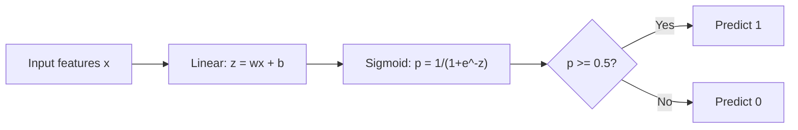
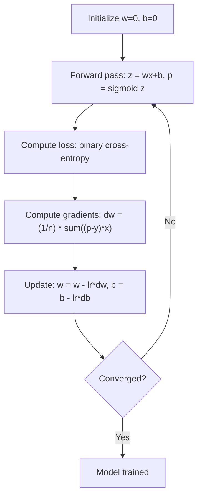

# بازپسین لوژستیکی

> بازپسین لوژیستیک یک خط مستقیم را به یک منحنی S خم می کند تا به سوالات بله یا نه با احتمال پاسخ دهد.

**Type:** Build
**Languages:** Python
**Prerequisites:** Phase 2 Lesson 1-2 (What Is ML, Linear Regression)
**Time:** ~90 minutes

## اهداف یادگیری

- پیاده سازی بازپسین لوژیستی از ابتدا با استفاده از تابع سیگمائید و از دست دادن انترپی کراس دوگانه
- محاسبه و تفسیر دقت، بازپسین، امتیاز F1 و ماتریس سردرگمی برای طبقه بندی دوگانه
- توضیح دهید که چرا MSE برای طبقه بندی شکست می خورد و چرا بینر کراس انترپی سطح هزینه مخروط تولید می کند
- ایجاد یک مدل بازپسین softmax برای طبقه بندی چند طبقه و ارزیابی تعادل تنظیمات آستانه

## مشکل

شما می خواهید پیش بینی کنید که آیا تومور به دلیل اندازه آن بدخیم است یا خیرخیم. شما بازخورد خطی را امتحان می کنید. این اعداد مانند 0.3 یا 1.7 یا -0.5 را تولید می کند. این ها چه معنی دارند؟ 1.7 "خیلی بدخیم" است؟ -0.5 "خیلی خیرخیم" است؟ بازخورد خطی تعداد نامحدود را تولید می کند. طبقه بندی نیاز به احتمالات محدودی بین 0 و 1 دارد و یک تصمیم روشن: بله یا نه.

بازپسین لوژیستیک این مسئله را حل می کند. این ترکیب خطی مشابه (wx + b) را می گیرد و از طریق تابع سیگمائید آن را عبور می کند، که هر عدد را به محدوده (0,1) می کند. تولید یک احتمال است. شما یک حد (معمولاً 0.5) را تنظیم می کنید و تصمیم می گیرید.

این یکی از الگوریتم های گسترده ترین استفاده شده در عمل است. علیرغم نام خود، بازپسین لوگستیک یک الگوریتم طبقه بندی است، نه یک الگوریتم بازپسین. نام از عملکرد لجستیک (sigmoid) که از آن استفاده می کند آمده است.

## مفهوم

### چرا بازپسین خطی برای طبقه بندی شکست می خورد

تصور کنید پیش بینی موفقیت/شکست (1/0) بر اساس ساعت های مطالعه. بازگشت خطی با یک خط در طول داده ها مطابقت دارد:

```
hours:  1   2   3   4   5   6   7   8   9   10
actual: 0   0   0   0   1   1   1   1   1   1
```

یک تطابق خطی ممکن است پیش بینی هایی مانند -0.2 در ساعت 1 و 1.3 در ساعت 10 تولید کند. این مقادیر احتمال نیستند. آنها زیر 0 و بالاتر از 1 می روند. بدتر از این، یک خارج از حد (کسی که 50 ساعت مطالعه کرده است) کل خط را کشیده و پیش بینی ها را برای همه تغییر می دهد.

طبقه بندی نیاز به یک تابع دارد که:
- مقدار خروجی بین 0 و 1 (احتمالات)
- ایجاد یک انتقال حاد (حدود تصمیم گیری)
- با انحرافات دور از مرز، منحرف نمی شود

### عملکرد سیگمائید

تابع سیگمائید دقیقا این کار را انجام می دهد:

```
sigmoid(z) = 1 / (1 + e^(-z))
```

خواص:
- وقتی z بزرگ و مثبت باشد، sigmoid ((z) به 1 نزدیک می شود
- وقتی z بزرگ و منفی است، sigmoid ((z) به 0 نزدیک می شود
- وقتی z = 0، sigmoid ((z) = 0.5
- خروجی همیشه بین 0 تا 1 است
- عملکرد هموار و قابل تفاوتی در همه جا است

مشتق دارای شکل مناسب است: sigmoid'(z) = sigmoid(z) * (1 - sigmoid(z)). این باعث می شود که محاسبه گرادیانت کارآمد باشد.

### بازپسین لوژیستیک = مدل خطی + سیگمائید

مدل z = wx + b را محاسبه می کند (به عنوان بازپسین خطی) ، سپس sigmoid را اعمال می کند:



خروجی p به عنوان P ((y=1)) تفسیر می شود، احتمال اینکه خروجی به کلاس 1 تعلق دارد. مرز تصمیم گیری جایی است که wx + b = 0 است که باعث می شود خروجی sigmoid دقیقاً 0.5 باشد.

### از دست دادن دوگانه ی کراس انترپی

شما نمی توانید از MSE برای بازپسین لوژیستیک استفاده کنید. MSE با یک sigmoid یک سطح هزینه غیر مخلوط با بسیاری از حداقل های محلی ایجاد می کند. در عوض، از بین بردن دوگانه استفاده کنید:

```
Loss = -(1/n) * sum(y * log(p) + (1-y) * log(1-p))
```

چرا این کار می کنه:
- وقتی y=1 و p نزدیک به 1: log(1) =0 باشد، پس از آن، ضرر نزدیک به 0 است (درسته، هزینه کم)
- وقتی y=1 و p نزدیک به 0: log(0) به بی نهایت منفی نزدیک می شود، بنابراین ضرر بسیار زیاد است (خطا، هزینه بالا)
- وقتی y=0 و p نزدیک به 0 است: log(1) = 0, بنابراین ضرر نزدیک به 0 است (درسته، هزینه کم)
- وقتی y=0 و p نزدیک به 1: log(0) به بی نهایت منفی نزدیک می شود، بنابراین ضرر بسیار زیاد است (خطا، هزینه بالا)

این تابع از دست دادن برای بازپسین لوژیستیک منحنی است و حداقل جهانی را تضمین می کند.

### کاهش تدریجی برای بازپسین لجستیک

گرادینت های دوگانه ی انترپی با سیگمائید شکل پاک دارند:

```
dL/dw = (1/n) * sum((p - y) * x)
dL/db = (1/n) * sum(p - y)
```

این ها شبیه گرادیانت های گریگریشن خطی هستند. تفاوت این است که p = sigmoid ((wx + b) به جای p = wx + b. sigmoid عدم خطی را معرفی می کند، اما قانون به روز رسانی گرادیانت یکسان است.



### مرز تصمیم گیری

برای ورودی 2D (دو ویژگی) ، مرز تصمیم گیری خطی است که در آن:

```
w1*x1 + w2*x2 + b = 0
```

نقاط در یک طرف به عنوان 1 طبقه بندی می شوند، نقاط در طرف دیگر به عنوان 0 طبقه بندی می شوند. بازگشت لجستیک همیشه یک مرز تصمیم گیری خطی تولید می کند. اگر به یک مرز منحنی نیاز دارید، یا ویژگی های چندگانه اضافه می کنید یا از یک مدل غیر خطی استفاده می کنید.

### طبقه بندی چند طبقه با Softmax

بازپسین لوژیستیکی دو طبقه را اداره می کند. برای کلاس های k، از تابع softmax استفاده کنید:

```
softmax(z_i) = e^(z_i) / sum(e^(z_j) for all j)
```

هر کلاس ویکتور وزن خود را دارد. مدل یک امتیاز z_i برای هر کلاس محاسبه می کند، سپس softmax امتیاز را به احتمالاتی تبدیل می کند که به 1.

تابع از دست دادن تبدیل به کراس انترپی دسته بندی می شود:

```
Loss = -(1/n) * sum(sum(y_k * log(p_k)))
```

جایی که y_k برای کلاس واقعی 1 و 0 برای همه ی بقیه (کوڈنگ یک گرم) است.

### متریک ارزیابی

دقت به تنهایی کافی نیست. برای مجموعه داده هایی که ۹۵٪ منفی و ۵٪ مثبت هستند، مدل هایی که همیشه منفی پیش بینی می کنند ۹۵٪ دقت دارند اما بی فایده هستند.

**Confusion Matrix**:

| | Predicted Positive | Predicted Negative |
|---|---|---|
| Actually Positive | True Positive (TP) | False Negative (FN) |
| Actually Negative | False Positive (FP) | True Negative (TN) |

**Precision**: از همه مثبت های پیش بینی شده، چند تا مثبت هستند؟
```
Precision = TP / (TP + FP)
```

**Recall**(حساسیت): از همه مثبتات واقعی، چند تا را گرفتیم؟
```
Recall = TP / (TP + FN)
```

**F1 Score**: متوسط هماهنگ دقت و بازپس گرفتن.
```
F1 = 2 * (Precision * Recall) / (Precision + Recall)
```

چه زمانی باید اولویت بندی شود:
- **Precision**: وقتی مثبت های غلط گران هستند (فلتر اسپم، شما نمی خواهید ایمیل مشروع را مسدود کنید)
- **Recall**: وقتی منفی های غلط گران هستند (بررسی سرطان، نمی خواهید از یک تومور غافل شوید)
- **F1**: وقتی به یک متریک متعادل نیاز دارید

```figure
logistic-sigmoid
```

## آن را بسازید

### مرحله 1: عملکرد Sigmoid و تولید داده

```python
import random
import math

def sigmoid(z):
    z = max(-500, min(500, z))
    return 1.0 / (1.0 + math.exp(-z))


random.seed(42)
N = 200
X = []
y = []

for _ in range(N // 2):
    X.append([random.gauss(2, 1), random.gauss(2, 1)])
    y.append(0)

for _ in range(N // 2):
    X.append([random.gauss(5, 1), random.gauss(5, 1)])
    y.append(1)

combined = list(zip(X, y))
random.shuffle(combined)
X, y = zip(*combined)
X = list(X)
y = list(y)

print(f"Generated {N} samples (2 classes, 2 features)")
print(f"Class 0 center: (2, 2), Class 1 center: (5, 5)")
print(f"First 5 samples:")
for i in range(5):
    print(f"  Features: [{X[i][0]:.2f}, {X[i][1]:.2f}], Label: {y[i]}")
```

### مرحله دوم: بازپسین لوژیستی از صفر

```python
class LogisticRegression:
    def __init__(self, n_features, learning_rate=0.01):
        self.weights = [0.0] * n_features
        self.bias = 0.0
        self.lr = learning_rate
        self.loss_history = []

    def predict_proba(self, x):
        z = sum(w * xi for w, xi in zip(self.weights, x)) + self.bias
        return sigmoid(z)

    def predict(self, x, threshold=0.5):
        return 1 if self.predict_proba(x) >= threshold else 0

    def compute_loss(self, X, y):
        n = len(y)
        total = 0.0
        for i in range(n):
            p = self.predict_proba(X[i])
            p = max(1e-15, min(1 - 1e-15, p))
            total += y[i] * math.log(p) + (1 - y[i]) * math.log(1 - p)
        return -total / n

    def fit(self, X, y, epochs=1000, print_every=200):
        n = len(y)
        n_features = len(X[0])
        for epoch in range(epochs):
            dw = [0.0] * n_features
            db = 0.0
            for i in range(n):
                p = self.predict_proba(X[i])
                error = p - y[i]
                for j in range(n_features):
                    dw[j] += error * X[i][j]
                db += error
            for j in range(n_features):
                self.weights[j] -= self.lr * (dw[j] / n)
            self.bias -= self.lr * (db / n)
            loss = self.compute_loss(X, y)
            self.loss_history.append(loss)
            if epoch % print_every == 0:
                print(f"  Epoch {epoch:4d} | Loss: {loss:.4f} | w: [{self.weights[0]:.3f}, {self.weights[1]:.3f}] | b: {self.bias:.3f}")
        return self

    def accuracy(self, X, y):
        correct = sum(1 for i in range(len(y)) if self.predict(X[i]) == y[i])
        return correct / len(y)


split = int(0.8 * N)
X_train, X_test = X[:split], X[split:]
y_train, y_test = y[:split], y[split:]

print("\n=== Training Logistic Regression ===")
model = LogisticRegression(n_features=2, learning_rate=0.1)
model.fit(X_train, y_train, epochs=1000, print_every=200)

print(f"\nTrain accuracy: {model.accuracy(X_train, y_train):.4f}")
print(f"Test accuracy:  {model.accuracy(X_test, y_test):.4f}")
print(f"Weights: [{model.weights[0]:.4f}, {model.weights[1]:.4f}]")
print(f"Bias: {model.bias:.4f}")
```

### مرحله 3: ماتریس و متریک های سردرگمی از ابتدا

```python
class ClassificationMetrics:
    def __init__(self, y_true, y_pred):
        self.tp = sum(1 for t, p in zip(y_true, y_pred) if t == 1 and p == 1)
        self.tn = sum(1 for t, p in zip(y_true, y_pred) if t == 0 and p == 0)
        self.fp = sum(1 for t, p in zip(y_true, y_pred) if t == 0 and p == 1)
        self.fn = sum(1 for t, p in zip(y_true, y_pred) if t == 1 and p == 0)

    def accuracy(self):
        total = self.tp + self.tn + self.fp + self.fn
        return (self.tp + self.tn) / total if total > 0 else 0

    def precision(self):
        denom = self.tp + self.fp
        return self.tp / denom if denom > 0 else 0

    def recall(self):
        denom = self.tp + self.fn
        return self.tp / denom if denom > 0 else 0

    def f1(self):
        p = self.precision()
        r = self.recall()
        return 2 * p * r / (p + r) if (p + r) > 0 else 0

    def print_confusion_matrix(self):
        print(f"\n  Confusion Matrix:")
        print(f"                  Predicted")
        print(f"                  Pos   Neg")
        print(f"  Actual Pos     {self.tp:4d}  {self.fn:4d}")
        print(f"  Actual Neg     {self.fp:4d}  {self.tn:4d}")

    def print_report(self):
        self.print_confusion_matrix()
        print(f"\n  Accuracy:  {self.accuracy():.4f}")
        print(f"  Precision: {self.precision():.4f}")
        print(f"  Recall:    {self.recall():.4f}")
        print(f"  F1 Score:  {self.f1():.4f}")


y_pred_test = [model.predict(x) for x in X_test]
print("\n=== Classification Report (Test Set) ===")
metrics = ClassificationMetrics(y_test, y_pred_test)
metrics.print_report()
```

### مرحله 4: تجزیه و تحلیل مرزهای تصمیم گیری

```python
print("\n=== Decision Boundary ===")
w1, w2 = model.weights
b = model.bias
print(f"Decision boundary: {w1:.4f}*x1 + {w2:.4f}*x2 + {b:.4f} = 0")
if abs(w2) > 1e-10:
    print(f"Solved for x2:     x2 = {-w1/w2:.4f}*x1 + {-b/w2:.4f}")

print("\nSample predictions near the boundary:")
test_points = [
    [3.0, 3.0],
    [3.5, 3.5],
    [4.0, 4.0],
    [2.5, 2.5],
    [5.0, 5.0],
]
for point in test_points:
    prob = model.predict_proba(point)
    pred = model.predict(point)
    print(f"  [{point[0]}, {point[1]}] -> prob={prob:.4f}, class={pred}")
```

### مرحله 5: کلاس چندگانه با softmax

```python
class SoftmaxRegression:
    def __init__(self, n_features, n_classes, learning_rate=0.01):
        self.n_features = n_features
        self.n_classes = n_classes
        self.lr = learning_rate
        self.weights = [[0.0] * n_features for _ in range(n_classes)]
        self.biases = [0.0] * n_classes

    def softmax(self, scores):
        max_score = max(scores)
        exp_scores = [math.exp(s - max_score) for s in scores]
        total = sum(exp_scores)
        return [e / total for e in exp_scores]

    def predict_proba(self, x):
        scores = [
            sum(self.weights[k][j] * x[j] for j in range(self.n_features)) + self.biases[k]
            for k in range(self.n_classes)
        ]
        return self.softmax(scores)

    def predict(self, x):
        probs = self.predict_proba(x)
        return probs.index(max(probs))

    def fit(self, X, y, epochs=1000, print_every=200):
        n = len(y)
        for epoch in range(epochs):
            grad_w = [[0.0] * self.n_features for _ in range(self.n_classes)]
            grad_b = [0.0] * self.n_classes
            total_loss = 0.0
            for i in range(n):
                probs = self.predict_proba(X[i])
                for k in range(self.n_classes):
                    target = 1.0 if y[i] == k else 0.0
                    error = probs[k] - target
                    for j in range(self.n_features):
                        grad_w[k][j] += error * X[i][j]
                    grad_b[k] += error
                true_prob = max(probs[y[i]], 1e-15)
                total_loss -= math.log(true_prob)
            for k in range(self.n_classes):
                for j in range(self.n_features):
                    self.weights[k][j] -= self.lr * (grad_w[k][j] / n)
                self.biases[k] -= self.lr * (grad_b[k] / n)
            if epoch % print_every == 0:
                print(f"  Epoch {epoch:4d} | Loss: {total_loss / n:.4f}")
        return self

    def accuracy(self, X, y):
        correct = sum(1 for i in range(len(y)) if self.predict(X[i]) == y[i])
        return correct / len(y)


random.seed(42)
X_3class = []
y_3class = []

centers = [(1, 1), (5, 1), (3, 5)]
for label, (cx, cy) in enumerate(centers):
    for _ in range(50):
        X_3class.append([random.gauss(cx, 0.8), random.gauss(cy, 0.8)])
        y_3class.append(label)

combined = list(zip(X_3class, y_3class))
random.shuffle(combined)
X_3class, y_3class = zip(*combined)
X_3class = list(X_3class)
y_3class = list(y_3class)

split_3 = int(0.8 * len(X_3class))
X_train_3 = X_3class[:split_3]
y_train_3 = y_3class[:split_3]
X_test_3 = X_3class[split_3:]
y_test_3 = y_3class[split_3:]

print("\n=== Multi-class Softmax Regression (3 classes) ===")
softmax_model = SoftmaxRegression(n_features=2, n_classes=3, learning_rate=0.1)
softmax_model.fit(X_train_3, y_train_3, epochs=1000, print_every=200)
print(f"\nTrain accuracy: {softmax_model.accuracy(X_train_3, y_train_3):.4f}")
print(f"Test accuracy:  {softmax_model.accuracy(X_test_3, y_test_3):.4f}")

print("\nSample predictions:")
for i in range(5):
    probs = softmax_model.predict_proba(X_test_3[i])
    pred = softmax_model.predict(X_test_3[i])
    print(f"  True: {y_test_3[i]}, Predicted: {pred}, Probs: [{', '.join(f'{p:.3f}' for p in probs)}]")
```

### مرحله 6: تنظیم حد

```python
print("\n=== Threshold Tuning ===")
print("Default threshold: 0.5. Adjusting the threshold trades precision for recall.\n")

thresholds = [0.3, 0.4, 0.5, 0.6, 0.7]
print(f"{'Threshold':>10} {'Accuracy':>10} {'Precision':>10} {'Recall':>10} {'F1':>10}")
print("-" * 52)

for t in thresholds:
    y_pred_t = [1 if model.predict_proba(x) >= t else 0 for x in X_test]
    m = ClassificationMetrics(y_test, y_pred_t)
    print(f"{t:>10.1f} {m.accuracy():>10.4f} {m.precision():>10.4f} {m.recall():>10.4f} {m.f1():>10.4f}")
```

## ازش استفاده کن

حالا همش با سکیت-لرن

```python
from sklearn.linear_model import LogisticRegression as SklearnLR
from sklearn.metrics import accuracy_score, precision_score, recall_score, f1_score
from sklearn.metrics import confusion_matrix, classification_report
from sklearn.model_selection import train_test_split
from sklearn.preprocessing import StandardScaler
import numpy as np

np.random.seed(42)
X_0 = np.random.randn(100, 2) + [2, 2]
X_1 = np.random.randn(100, 2) + [5, 5]
X_sk = np.vstack([X_0, X_1])
y_sk = np.array([0] * 100 + [1] * 100)

X_tr, X_te, y_tr, y_te = train_test_split(X_sk, y_sk, test_size=0.2, random_state=42)

scaler = StandardScaler()
X_tr_sc = scaler.fit_transform(X_tr)
X_te_sc = scaler.transform(X_te)

lr = SklearnLR()
lr.fit(X_tr_sc, y_tr)
y_pred = lr.predict(X_te_sc)

print("=== Scikit-learn Logistic Regression ===")
print(f"Accuracy:  {accuracy_score(y_te, y_pred):.4f}")
print(f"Precision: {precision_score(y_te, y_pred):.4f}")
print(f"Recall:    {recall_score(y_te, y_pred):.4f}")
print(f"F1:        {f1_score(y_te, y_pred):.4f}")
print(f"\nConfusion Matrix:\n{confusion_matrix(y_te, y_pred)}")
print(f"\nClassification Report:\n{classification_report(y_te, y_pred)}")
```

پیاده سازی شما از ابتدا همان مرز تصمیم گیری و متریک را تولید می کند. Scikit-learn گزینه های حل کننده (liblinear، lbfgs، saga) ، تنظیم خودکار، استراتژی های چند طبقه (یک در برابر بقیه، چندمجموعه) و بهینه سازی ثبات عددی را اضافه می کند.

## -باده

این درس نتیجه می دهد:
- `code/logistic_regression.py`- بازپسین لوژستیک از نو با متریک

## تمرینات

1. مجموعه داده ای را تولید کنید که به صورت خطی جدا نمی شود (به عنوان مثال دو دایره متمرکز). بازپسین لوژیستیک را تمرین کنید و شکست آن را مشاهده کنید. سپس ویژگی های چندگانه (x1^2, x2^2, x1*x2) را اضافه کنید و دوباره تمرین کنید. نشان دهید که دقت بهبود می یابد.
2. یک ماتریس سردرگمی چند طبقه را برای مدل 3 کلاس نرم ماکس اجرا کنید. دقت هر کلاس را محاسبه کنید و بازپس بگیرید. کدام کلاس سخت ترین طبقه بندی است؟
3. منحنی ROC را از ابتدا بسازید. برای 100 مقدار آستانه از 0 تا 1، نرخ مثبت واقعی و نرخ مثبت نادرست را محاسبه کنید. AUC (جاهای زیر منحنی) را با استفاده از قانون تراپیزوئید محاسبه کنید.

## اصطلاحات کلیدی

| Term | What people say | What it actually means |
|------|----------------|----------------------|
| Logistic regression | "Regression for classification" | A linear model followed by a sigmoid function that outputs class probabilities |
| Sigmoid function | "The S-curve" | The function 1/(1+e^(-z)) that maps any real number to the range (0, 1) |
| Binary cross-entropy | "Log loss" | The loss function -[y*log(p) + (1-y)*log(1-p)] that penalizes confident wrong predictions severely |
| Decision boundary | "The dividing line" | The surface where the model's output probability equals 0.5, separating predicted classes |
| Softmax | "Multi-class sigmoid" | A function that converts a vector of scores into probabilities that sum to 1 |
| Precision | "How many selected are relevant" | TP / (TP + FP), the fraction of positive predictions that are actually positive |
| Recall | "How many relevant are selected" | TP / (TP + FN), the fraction of actual positives that the model correctly identifies |
| F1 score | "Balanced accuracy" | The harmonic mean of precision and recall: 2*P*R / (P+R) |
| Confusion matrix | "The error breakdown" | A table showing TP, TN, FP, FN counts for each class pair |
| Threshold | "The cutoff" | The probability value above which the model predicts class 1 (default 0.5, tunable) |
| One-hot encoding | "Binary columns for categories" | Representing class k as a vector of zeros with a 1 at position k |
| Categorical cross-entropy | "Multi-class log loss" | The extension of binary cross-entropy to k classes using one-hot encoded labels |
