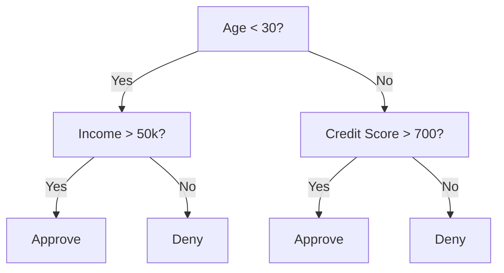
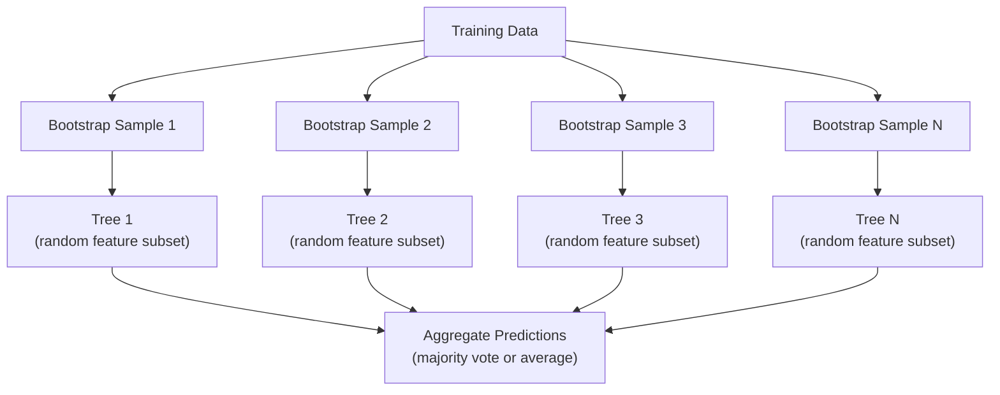

# درختان تصمیم گیری و جنگل های تصادفی

> درخت تصمیم گیری فقط یک نقشه جریان است اما جنگل آنها یکی از قدرتمندترین ابزار ML است

**Type:** Build
**Language:**پیتون
**Prerequisites:** Phase 1 (Lessons 09 Information Theory, 06 Probability)
**Time:** ~90 minutes

## اهداف یادگیری

- پیاده سازی آلودگی جینی، انتروپی و محاسبه های کسب اطلاعات برای پیدا کردن تقسیم بندی درخت تصمیم گیری بهینه
- ایجاد یک طبقه بندی کننده درخت تصمیم از ابتدا با کنترل های پیش از برش (عمق حداکثر، نمونه های حداقل)
- ساخت یک جنگل تصادفی با استفاده از نمونه گیری بوترپ و تصادفی ویژگی ها و توضیح دهید که چرا این تفاوت را کاهش می دهد
- اهمیت ویژگی MDI را با اهمیت تغییر مقایسه کنید و مشخص کنید که MDI متمایز است

## مشکل

شما داده های جدول را دارید. ردیف ها نمونه ها هستند، ستون ها ویژگی ها هستند و یک ستون هدف وجود دارد که می خواهید پیش بینی کنید. شما می توانید یک شبکه عصبی را به آن بیندازید. اما برای داده های جدول، مدل های مبتنی بر درخت (درخت های تصمیم گیری، جنگل های تصادفی، درختان افزایش یافته) به طور مداوم عملکرد یادگیری عمیق را از دست می دهند. رقابت های کگل در داده های ساختاری توسط XGBoost و LightGBM، نه ترانسفورماتورها، تسلط دارند.

چرا؟ درختان بدون پردازش پیش از کار با انواع ویژگی های مخلوط (عددی و دسته بندی) کار می کنند. آنها روابط غیر خطی را بدون مهندسی ویژگی ها اداره می کنند. آنها قابل تفسیر هستند: شما می توانید به درخت نگاه کنید و دقیقا ببینید چرا پیش بینی انجام شده است. و جنگل های تصادفی که به طور متوسط بسیاری از درختان را دارند، بسیار مقاوم به بیش از حد مناسب در مجموعه داده های متوسط هستند.

این درس درختان تصمیم را با استفاده از تقسیم مجدد از ابتدا می سازد، سپس جنگل تصادفی را در بالای آن می سازد. شما ریاضیات پشت معیارهای تقسیم (غیر آلودگی جین، انتروپی، کسب اطلاعات) را پیاده سازی می کنید و درک می کنید که چرا مجموعه ای از دانش آموزان ضعیف به یک قوی تبدیل می شود.

## مفهوم

### درخت تصمیم چیکار میکنه

یک درخت تصمیم، فضای ویژگی را به مناطق مستطیل تقسیم می کند با پرسیدن یک سری از سوالات بله/نه.



هر گره داخلی یک ویژگی را در برابر یک حد آزمایش می کند. هر گره برگ پیش بینی می کند. برای طبقه بندی یک نقطه داده جدید، شما از ریشه شروع می کنید و تا به یک برگ برسید، شاخه ها را دنبال می کنید.

درخت با انتخاب، در هر گره، ویژگی و حدودی که بهترین بخش داده ها را از بالا به پایین می سازد. "بهترین" با معیاری تقسیم تعریف می شود.

### معیارهای تقسیم بندی: اندازه گیری آلودگی

در هر گره، ما مجموعه ای از نمونه ها داریم. ما می خواهیم آنها را تقسیم کنیم تا گره های کودک که به نتیجه می رسند تا حد ممکن "طاهرا" باشند، به این معنی که هر کودک حاوی بیشتر یک کلاس است.

**Gini impurity**احتمال اینکه یک نمونه تصادفی که در این گره طبق توزیع کلاس قرار گرفته است، اشتباه طبقه بندی شود را اندازه گیری می کند.

```
Gini(S) = 1 - sum(p_k^2)

where p_k is the proportion of class k in set S.
```

برای یک گره خالص (همه یک کلاس) ، Gini = 0. برای تقسیم دوگانه با کلاس های 50/50، Gini = 0.5 پایین تر بهتر است.

```
Example: 6 cats, 4 dogs

Gini = 1 - (0.6^2 + 0.4^2) = 1 - (0.36 + 0.16) = 0.48
```

**Entropy**اندازه گیری محتوای اطلاعات (اضطراب) در یک گره. در مرحله 1 درس 09 پوشش داده شده است.

```
Entropy(S) = -sum(p_k * log2(p_k))
```

برای یک گره خالص، انتروپی = 0 برای یک تقسیم دوگانه 50/50، انتروپی = 1.0 پایین تر بهتر است.

```
Example: 6 cats, 4 dogs

Entropy = -(0.6 * log2(0.6) + 0.4 * log2(0.4))
        = -(0.6 * -0.737 + 0.4 * -1.322)
        = 0.442 + 0.529
        = 0.971 bits
```

**Information gain**کاهش آلودگی (انترپی یا جینی) پس از تقسیم.

```
IG(S, feature, threshold) = Impurity(S) - weighted_avg(Impurity(S_left), Impurity(S_right))

where the weights are the proportions of samples in each child.
```

الگوریتم طمع در هر گره: هر ویژگی و هر حد ممکن را امتحان کنید. جفت (صفحه، حد) را انتخاب کنید که اطلاعات را به حداکثر برساند.

### چگونه تقسیم کار می کند

برای مجموعه داده هایی که دارای n ویژگی و m نمونه در گره فعلی هستند:

1. برای هر ویژگی j (j = 1 تا n):
   - نمونه ها را با ویژگی j مرتب کنید
   - هر نقطه وسط بین ارزش های متمایز متوالی را به عنوان یک حد امتحان کنید
   - محاسبه اطلاعات برای هر حد
2. ویژگی و حد را با بیشترین اطلاعات بدست آورید
3. داده ها را به سمت چپ (نمایش <= حد) و سمت راست (نمایش > حد) تقسیم کنید
4. تکرار در هر کودک

این رویکرد طمع آمیز تضمین نمی کند که درخت بهینه در سطح جهانی باشد. پیدا کردن درخت مطلوب NP- سخت است. اما تقسیم طمع آمیز در عمل خوب کار می کند.

### شرایط توقف

درخت بدون توقف رشد می کند تا هر برگ خالص شود (یک نمونه در هر برگ) این به طور کامل اطلاعات آموزش را به یاد می گیرد و به طور وحشتناکی عمومی می شود.

**Pre-pruning**درخت را قبل از رشد کامل متوقف می کند:
- اعمق حداکثر: وقتی درخت به عمق تعیین شده برسد، شکستن را متوقف می کند
- حداقل نمونه ها در هر برگ: توقف اگر یک گره کمتر از k نمونه دارد
- حداقل اطلاعات: توقف اگر بهترین تقسیم باعث بهبود آلودگی کمتر از یک حد شود
- حداکثر گره های برگ: تعداد کل برگ ها را محدود کنید

**Post-pruning**و درخت را به صورت کامل برآورد و سپس آن را به صورت خشک و خشک گرداند.
- پیچیدگی هزینه (که توسط scikit-learn استفاده می شود): مجازات متناسب با تعداد برگ ها اضافه می شود. مجازات را برای گرفتن درختان کوچکتر افزایش دهید
- کاهش خطا: حذف یک زیر درخت اگر خطا اعتبار افزایش نمی یابد

پیش از برش آسان تر و سریع تر است. پس از برش اغلب درختان بهتر تولید می کند زیرا شکافات را که ممکن است منجر به شکافات مفید بیشتر شود، پیش از زمان متوقف نمی کند.

### درختان تصمیم گیری برای بازپسین

برای بازپسین، پیش بینی برگ متوسط ارزش های هدف در آن برگ است. معیار تقسیم نیز تغییر می کند:

**Variance reduction**جایگزین اطلاعات حاصل می شود:

```
VR(S, feature, threshold) = Var(S) - weighted_avg(Var(S_left), Var(S_right))
```

تقسیم را انتخاب کنید که بیشترین تفاوت را کاهش می دهد. درخت فضای ورودی را به مناطق تقسیم می کند و ثابت (متوسط) را در هر منطقه پیش بینی می کند.

### جنگل های تصادفی: قدرت گروه ها

یک درخت تصمیم گیری بسیار متفاوت است. تغییرات کوچک در داده ها می تواند درخت های کاملا متفاوت را تولید کند. جنگل های تصادفی با میانگین درختان بسیاری این مشکل را حل می کنند.



دو منبع تصادفی باعث تنوع درختان می شود:

**Bagging (bootstrap aggregating):**هر درخت بر اساس یک نمونه بوتر است، یک نمونه تصادفی با جایگزینی از داده های آموزش آموزش آموزش داده می شود. حدود 63٪ از نمونه های اصلی در هر بوتر است ظاهر می شوند (بقی نمونه های خارج از کیسه هستند که می توانند برای تأیید استفاده شوند).

**Feature randomization:**در هر تقسیم، فقط زیر مجموعه تصادفی از ویژگی ها در نظر گرفته می شود. برای طبقه بندی، پیش فرض sqrt(n_صفات است. برای بازگشت، n_صفات/3. این مانع از تقسیم تمام درختان در یک ویژگی غالب می شود.

نکته کلیدی: متوسط بسیاری از درختان غیرمسلسل باعث کاهش تفاوت بدون افزایش تعصب می شود. هر درخت ممکن است متوسط باشد. مجموعه قوی است.

### اهمیت ویژگی ها

جنگل های تصادفی به طور طبیعی نمره های اهمیت ویژگی را ارائه می دهند. رایج ترین روش:

**Mean Decrease in Impurity (MDI):**برای هر ویژگی، کل کاهش آلودگی در تمام درختان و تمام گره هایی که این ویژگی استفاده می شود را جمع کنید. ویژگی هایی که کاهش آلودگی بیشتری در تقسیم های قبلی ایجاد می کنند مهم تر هستند.

```
importance(feature_j) = sum over all nodes where feature_j is used:
    (n_samples_at_node / n_total_samples) * impurity_decrease
```

این سرعت (در طول آموزش محاسبه می شود) اما به سمت ویژگی های کارتینیلتی بالا و ویژگی هایی با بسیاری از نقاط تقسیم احتمالی منحرف می شود.

**Permutation importance**گزینه ای است: ارزش های یک ویژگی را مخلوط کنید و اندازه گیری کنید که دقت مدل چقدر کاهش می یابد. قابل اعتمادتر اما کندتر.

### وقتی درختان شبکه های عصبی را شکست می دهند

درختان و جنگل ها بر شبکه های عصبی بر اساس داده های جدول غالب هستند.

| Factor | Trees | Neural networks |
|--------|-------|----------------|
| Mixed types (numeric + categorical) | Native support | Need encoding |
| Small datasets (< 10k rows) | Work well | Overfit |
| Feature interactions | Found by splitting | Need architecture design |
| Interpretability | Full transparency | Black box |
| Training time | Minutes | Hours |
| Hyperparameter sensitivity | Low | High |

شبکه های عصبی برنده می شوند زمانی که داده ها دارای ساختار فضایی یا دنباله دار (تصاویر، متن، صوتی) هستند. برای جدول های مسطح ویژگی ها، درختان پیش فرض هستند.

```figure
decision-tree-depth
```

## آن را بسازید

### مرحله ی اول: آلودگی و انترپی جینی

هر دو معیار تقسیم را از ابتدا بسازید و بررسی کنید که کدام تقسیم ها خوب هستند.

```python
import math

def gini_impurity(labels):
    n = len(labels)
    if n == 0:
        return 0.0
    counts = {}
    for label in labels:
        counts[label] = counts.get(label, 0) + 1
    return 1.0 - sum((c / n) ** 2 for c in counts.values())

def entropy(labels):
    n = len(labels)
    if n == 0:
        return 0.0
    counts = {}
    for label in labels:
        counts[label] = counts.get(label, 0) + 1
    return -sum(
        (c / n) * math.log2(c / n) for c in counts.values() if c > 0
    )
```

### مرحله دوم: بهترین تقسیم را پیدا کنید

هر ویژگی و هر حد را امتحان کن. اونی که بیشترین اطلاعات را بدست آورد، برگرد.

```python
def information_gain(parent_labels, left_labels, right_labels, criterion="gini"):
    measure = gini_impurity if criterion == "gini" else entropy
    n = len(parent_labels)
    n_left = len(left_labels)
    n_right = len(right_labels)
    if n_left == 0 or n_right == 0:
        return 0.0
    parent_impurity = measure(parent_labels)
    child_impurity = (
        (n_left / n) * measure(left_labels) +
        (n_right / n) * measure(right_labels)
    )
    return parent_impurity - child_impurity
```

### مرحله سوم: کلاس DecisionTree را بسازید

تقسیم مکرر، پیش بینی و ردیابی اهمیت ویژگی. `_build`قلب درخت است: وقتی یک گره پاک است یا به حد پیش از برش می رسد متوقف می شود، در غیر این صورت بهترین شکاف را می گیرد و به هر دو کودک بازمی گردد.

```python
import random

class DecisionTree:
    def __init__(self, max_depth=None, min_samples_split=2,
                 min_samples_leaf=1, criterion="gini",
                 max_features=None):
        self.max_depth = max_depth
        self.min_samples_split = min_samples_split
        self.min_samples_leaf = min_samples_leaf
        self.criterion = criterion
        self.max_features = max_features
        self.tree = None
        self.feature_importances_ = None

    def fit(self, X, y):
        self.n_features = len(X[0])
        self.feature_importances_ = [0.0] * self.n_features
        self.n_samples = len(X)
        self.tree = self._build(X, y, depth=0)
        total = sum(self.feature_importances_)
        if total > 0:
            self.feature_importances_ = [
                fi / total for fi in self.feature_importances_
            ]

    def predict(self, X):
        return [self._predict_one(x, self.tree) for x in X]

    def _build(self, X, y, depth):
        if len(set(y)) == 1:
            return {"leaf": True, "value": y[0]}

        if self.max_depth is not None and depth >= self.max_depth:
            return self._make_leaf(y)

        if len(y) < self.min_samples_split:
            return self._make_leaf(y)

        best_feature, best_threshold, best_gain = self._best_split(X, y)

        if best_feature is None or best_gain <= 0:
            return self._make_leaf(y)

        left_X, left_y, right_X, right_y = self._split_data(
            X, y, best_feature, best_threshold
        )

        if len(left_y) < self.min_samples_leaf or len(right_y) < self.min_samples_leaf:
            return self._make_leaf(y)

        weight = len(y) / self.n_samples
        self.feature_importances_[best_feature] += weight * best_gain

        return {
            "leaf": False,
            "feature": best_feature,
            "threshold": best_threshold,
            "left": self._build(left_X, left_y, depth + 1),
            "right": self._build(right_X, right_y, depth + 1),
        }

    def _make_leaf(self, y):
        counts = {}
        for label in y:
            counts[label] = counts.get(label, 0) + 1
        return {"leaf": True, "value": max(counts, key=counts.get)}

    def _best_split(self, X, y):
        best_feature = None
        best_threshold = None
        best_gain = -1.0

        if self.max_features == "sqrt":
            k = max(1, int(math.sqrt(self.n_features)))
            feature_indices = random.sample(range(self.n_features), k)
        elif isinstance(self.max_features, int):
            if self.max_features < 1:
                raise ValueError("max_features must be at least 1 when given as an integer")
            k = min(self.max_features, self.n_features)
            feature_indices = random.sample(range(self.n_features), k)
        else:
            feature_indices = list(range(self.n_features))

        for feature_idx in feature_indices:
            values = sorted(set(X[i][feature_idx] for i in range(len(X))))
            if len(values) <= 1:
                continue

            for i in range(len(values) - 1):
                threshold = (values[i] + values[i + 1]) / 2.0
                left_y = [y[j] for j in range(len(X)) if X[j][feature_idx] <= threshold]
                right_y = [y[j] for j in range(len(X)) if X[j][feature_idx] > threshold]

                if len(left_y) < self.min_samples_leaf or len(right_y) < self.min_samples_leaf:
                    continue

                gain = information_gain(y, left_y, right_y, self.criterion)
                if gain > best_gain:
                    best_gain = gain
                    best_feature = feature_idx
                    best_threshold = threshold

        return best_feature, best_threshold, best_gain

    def _split_data(self, X, y, feature, threshold):
        left_X, left_y, right_X, right_y = [], [], [], []
        for i in range(len(X)):
            if X[i][feature] <= threshold:
                left_X.append(X[i])
                left_y.append(y[i])
            else:
                right_X.append(X[i])
                right_y.append(y[i])
        return left_X, left_y, right_X, right_y

    def _predict_one(self, x, node):
        if node["leaf"]:
            return node["value"]
        if x[node["feature"]] <= node["threshold"]:
            return self._predict_one(x, node["left"])
        return self._predict_one(x, node["right"])
```

### مرحله چهارم: کلاس RandomForest را بسازید

نمونه گیری بوترپ، تصادفی کردن ویژگی ها و رای دادن اکثریت.

```python
class RandomForest:
    def __init__(self, n_trees=100, max_depth=None,
                 min_samples_split=2, max_features="sqrt",
                 criterion="gini"):
        self.n_trees = n_trees
        self.max_depth = max_depth
        self.min_samples_split = min_samples_split
        self.max_features = max_features
        self.criterion = criterion
        self.trees = []

    def fit(self, X, y):
        n = len(X)
        for _ in range(self.n_trees):
            indices = [random.randint(0, n - 1) for _ in range(n)]
            X_boot = [X[i] for i in indices]
            y_boot = [y[i] for i in indices]
            tree = DecisionTree(
                max_depth=self.max_depth,
                min_samples_split=self.min_samples_split,
                max_features=self.max_features,
                criterion=self.criterion,
            )
            tree.fit(X_boot, y_boot)
            self.trees.append(tree)

    def predict(self, X):
        all_preds = [tree.predict(X) for tree in self.trees]
        predictions = []
        for i in range(len(X)):
            votes = {}
            for preds in all_preds:
                v = preds[i]
                votes[v] = votes.get(v, 0) + 1
            predictions.append(max(votes, key=votes.get))
        return predictions
```

ببین`code/trees.py`برای اجرای کامل با تمام روش های کمک کننده.

## ازش استفاده کن

با سکیت-لرن، آموزش یک جنگل تصادفی سه خط است:

```python
from sklearn.ensemble import RandomForestClassifier
from sklearn.datasets import load_iris
from sklearn.model_selection import train_test_split

X, y = load_iris(return_X_y=True)
X_train, X_test, y_train, y_test = train_test_split(X, y, random_state=42)

rf = RandomForestClassifier(n_estimators=100, random_state=42)
rf.fit(X_train, y_train)
print(f"Accuracy: {rf.score(X_test, y_test):.4f}")
print(f"Feature importances: {rf.feature_importances_}")
```

در عمل، درختان افزایش یافته (XGBoost، LightGBM، CatBoost) اغلب قوی تر از جنگل های تصادفی هستند زیرا درختان را به ترتیب می سازند، با هر درخت اصلاح اشتباهات قبلی. اما جنگل های تصادفی برای اشتباه تنظیم کردن سخت تر هستند و تقریباً نیازی به تنظیم هایپرمتر ندارند.

## -باده

این درس به ما کمک می کند`outputs/prompt-tree-interpreter.md`-- یک پیامک که تقسیم درخت تصمیم را برای ذینفعان کسب و کار تفسیر می کند. به آن ساختار درخت آموزش داده شده (عمق، ویژگی ها، آستانه تقسیم، دقت) بدهید و این مدل را به قوانین ساده زبان ترجمه می کند، رتبه بندی اهمیت ویژگی ها، پرچم های بیش از حد یا لیک شدن، و توصیه های بعدی را ارائه می دهد. هر زمان که نیاز دارید یک مدل مبتنی بر درخت را برای کسی که کد نمی خواند توضیح دهید، از آن استفاده کنید.

## تمرینات

1. یک درخت تصمیم گیری را در مجموعه داده های 2D با 3 کلاس آموزش دهید. به صورت دستی تقسیم ها را ردیابی کنید و مرز های تصمیم گیری مستطیل را رسم کنید. مرز ها را در max_depth=2 با max_depth=10 مقایسه کنید.

2. برای درختان بازپسین تقسیم کاهش متغیر را اجرا کنید. y = sin(x) + صدا را برای 200 نقطه تولید کنید و به درخت بازپسین خود را متناسب کنید. پیش بینی های ثابت قطعه درخت را با منحنی واقعی نقشه بزنید.

3. جنگل تصادفی با درختان ۱،۵،۱۰،۵۰ و ۲۰۰ را بسازید. دقت تمرین نقشه و دقت آزمون مقابل تعداد درختان. مشاهده کنید که دقت آزمون مرتفعات است اما کاهش نمی یابد ( جنگل ها مقاومت بیش از حد).

4. مقایسه آلودگی جینی با انتروپی به عنوان معیارهای تقسیم شده در 5 مجموعه داده مختلف. دقت و عمق درخت را اندازه گیری کنید. در اکثر موارد، آنها نتایج تقریبا یکسان را به دست می آورند. توضیح دهید چرا.

5. اهمیت تغییر را پیاده سازی کنید. آن را با اهمیت MDI در مجموعه داده ها مقایسه کنید که یکی از ویژگی ها صدا تصادفی است اما دارای کارتینالیت بالا است. MDI ویژگی صدا را به درجه بالا رتبه بندی می کند. اهمیت تغییر نمی کند.

## اصطلاحات کلیدی

| Term | What people say | What it actually means |
|------|----------------|----------------------|
| Decision tree | "A flowchart for predictions" | A model that partitions feature space into rectangular regions by learning a sequence of if/else splits |
| Gini impurity | "How mixed the node is" | Probability of misclassifying a random sample at a node. 0 = pure, 0.5 = maximum impurity for binary |
| Entropy | "The disorder in a node" | Information content at a node. 0 = pure, 1.0 = maximum uncertainty for binary. From information theory |
| Information gain | "How good a split is" | Reduction in impurity after a split. The greedy criterion for choosing splits |
| Pre-pruning | "Stop the tree early" | Stopping tree growth early by setting max depth, min samples, or min gain thresholds |
| Post-pruning | "Trim the tree after" | Growing the full tree, then removing subtrees that do not improve validation performance |
| Bagging | "Train on random subsets" | Bootstrap aggregating. Train each model on a different random sample with replacement |
| Random forest | "A bunch of trees" | Ensemble of decision trees, each trained on a bootstrap sample with random feature subsets at each split |
| Feature importance (MDI) | "Which features matter" | Total impurity decrease contributed by each feature, summed across all trees and nodes |
| Permutation importance | "Shuffle and check" | Accuracy drop when a feature's values are randomly shuffled. More reliable than MDI for noisy features |
| Variance reduction | "The regression version of info gain" | The regression tree analogue of information gain. Picks the split that reduces target variance the most |
| Bootstrap sample | "Random sample with repeats" | A random sample drawn with replacement from the original dataset. Same size, but with duplicates |

## خواندن بیشتر

- [Breiman: Random Forests (2001)](https://link.springer.com/article/10.1023/A:1010933404324)- کاغذ جنگل تصادفی اصلی
- [Grinsztajn et al.: Why do tree-based models still outperform deep learning on tabular data? (2022)](https://arxiv.org/abs/2207.08815)- مقایسه دقیق درختان با شبکه های عصبی در وظایف جدول
- [scikit-learn Decision Trees documentation](https://scikit-learn.org/stable/modules/tree.html)- راهنمای عملی با ابزار تصویرسازی
- [XGBoost: A Scalable Tree Boosting System (Chen & Guestrin, 2016)](https://arxiv.org/abs/1603.02754)- کاغذي که به سمت کگلي مياد
