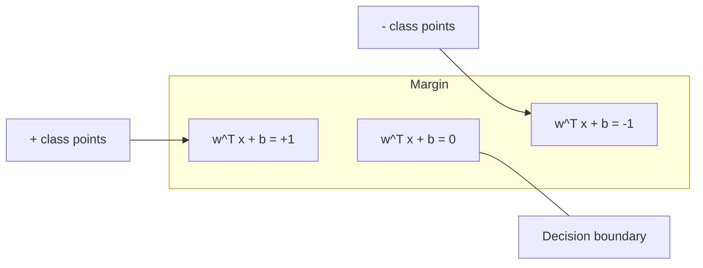
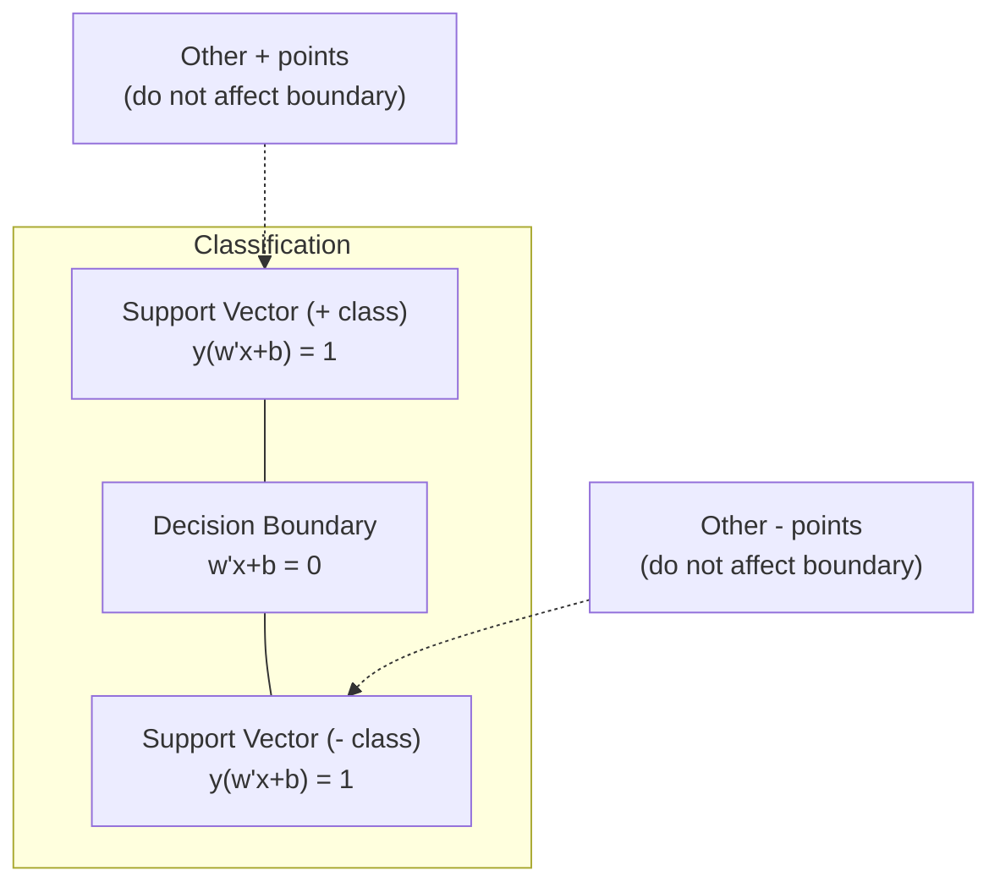
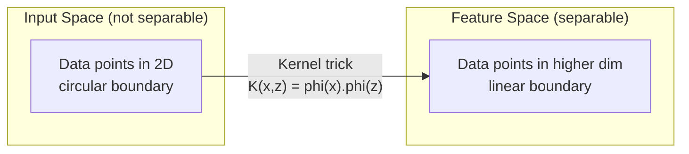

# ماشین های ویکتور پشتیبانی

> .برترین خیابان بین دو طبقه رو پیدا کن

**Type:** Build
**Language:**پیتون
**Prerequisites:** Phase 1 (Lessons 08 Optimization, 14 Norms and Distances, 18 Convex Optimization)
**Time:** ~90 minutes

## اهداف یادگیری

- پیاده سازی یک SVM خطی از ابتدا با استفاده از از دست دادن بازنویسی و کاهش گرادینت در فرمول اولیه
- اصول حداکثر مارژ را توضیح دهید و متورهای پشتیبانی را از یک مدل آموزش دیده شناسایی کنید
- مقایسه هسته های خطی، چندگانه و RBF و توضیح دهید که چگونه ترفند هسته از نقشه برداری آشکار با ابعاد بالا جلوگیری می کند
- ارزیابی تعادل کنترل شده توسط پارامتر C بین عرض حاشیه و خطاهای طبقه بندی

## مشکل

شما دو دسته از نقاط داده دارید و باید یک خط (یا هائپرپلین) را که آنها را از هم جدا می کند، بکشید. خطوط بی نهایت زیادی می توانند کار کنند. کدام یک را انتخاب کنید؟

این که بیشترین مارجین را دارد. مارجین فاصله بین مرز تصمیم گیری و نزدیک ترین نقاط داده در هر طرف است. مارجین گسترده تر به این معنی است که طبقه بندی کننده مطمئن تر است و به اطلاعات ندیده شده بهتر کلی می کند.

این حس منجر به ماشین آلات ویکتور پشتیبانی می شود، یکی از الگوریتم های ریاضی بسیار زیبا در ML. SVM ها روش طبقه بندی غالب قبل از یادگیری عمیق بودند و بهترین انتخاب برای مجموعه داده های کوچک، داده های ابعاد بالا و مشکلات هستند که شما نیاز به یک مدل اصول، با وضوح نظری با تضمینات دارید.

SVM ها مستقیماً به مرحله ۱ متصل می شوند: بهینه سازی مخروط است (درس ۱۸) ، حاشیه با قوانین اندازه گیری می شود (درس ۱۴) و ترفند هسته ای از محصولات نقطه ای برای مدیریت مرزهای غیر خطی بدون هیچ وقت محاسبه در فضای بالا استفاده می کند.

## مفهوم

### طبقه بندی کننده حداکثر مارژین

با توجه به داده های جدا کننده خطی با برچسب y_i در {-1, +1} و متری ویژگی x_i، ما می خواهیم یک سطح فرعی w^T x + b = 0 که کلاس ها را جدا می کند.

فاصله از نقطه x_i تا سطح بالا:

```
distance = |w^T x_i + b| / ||w||
```

برای یک نقطه به درستی طبقه بندی شده: y_i * (w^T x_i + b) > 0. حاشیه دو برابر فاصله از سطح بالا تا نزدیک ترین نقطه در هر دو طرف است.



مشکل بهینه سازی:

```
maximize    2 / ||w||     (the margin width)
subject to  y_i * (w^T x_i + b) >= 1  for all i
```

به طور معادل (حداقل کردن زمان زمان به زمان به طور آسان تر بهینه سازی می شود):

```
minimize    (1/2) ||w||^2
subject to  y_i * (w^T x_i + b) >= 1  for all i
```

این یک برنامه مربع مخلوط است. این یک راه حل جهانی منحصر به فرد دارد. نقاط داده که دقیقا در مرزهای مرزی قرار دارند (که y_i * (w^T x_i + b) = 1) متری پشتیبانی هستند. آنها تنها نقاط هستند که مرزهای تصمیم را تعیین می کنند. هر نقطه متری غیر پشتیبانی را حرکت دهید یا حذف کنید و مرزهای تغییر نمی کنند.

### متورهای پشتیبانی: تعداد کمی مهم



اکثر نقاط آموزش بی ربط هستند. تنها متری های پشتیبانی مهم هستند. به همین دلیل است که SVM ها در زمان پیش بینی حافظه موثر هستند: شما فقط نیاز به ذخیره متری های پشتیبانی دارید، نه کل مجموعه آموزش.

تعداد ویکتورهای پشتیبانی همچنین یک محدودیت در خطای عمومی سازی را فراهم می کند. ویکتورهای پشتیبانی کمتر نسبت به اندازه مجموعه داده ها به معنای عمومی سازی بهتر است.

### حاشیه نرم: کنترل صدا با پارامتر C

داده های واقعی به ندرت کاملاً قابل جدایی هستند. برخی نقاط ممکن است در سمت اشتباه مرز یا داخل حاشیه باشند. فرمولا حاشیه نرم اجازه نقض را با معرفی متغیرهای خستگی می دهد.

```
minimize    (1/2) ||w||^2 + C * sum(xi_i)
subject to  y_i * (w^T x_i + b) >= 1 - xi_i
            xi_i >= 0  for all i
```

متغیر لچک xi_i اندازه گیری می کند که نقطه i چقدر از حاشیه نقض می کند. C کنترل معامله را کنترل می کند:

| C value | Behavior |
|---------|----------|
| Large C | Penalizes violations heavily. Narrow margin, fewer misclassifications. Overfits |
| Small C | Allows more violations. Wide margin, more misclassifications. Underfits |

C قدرت تنظیم است، برعکس. C بزرگتر = تنظیم کمتر. C کوچک = تنظیم بیشتر.

### از دست دادن گره: عملکرد از دست دادن SVM

SVM مارجین نرم می تواند به عنوان یک بهینه سازی بدون محدودیت نوشته شود:

```
minimize    (1/2) ||w||^2 + C * sum(max(0, 1 - y_i * (w^T x_i + b)))
```

اصطلاح max(0, 1 - y_i * f(x_i)) ، از دست دادن کنجک است. صفر است وقتی نقطه به درستی طبقه بندی شده و فراتر از حاشیه است. خطی است وقتی نقطه در داخل حاشیه است یا طبقه بندی اشتباه شده است.

```
Hinge loss for a single point:

loss
  |
  | \
  |  \
  |   \
  |    \
  |     \_______________
  |
  +-----|-----|-------->  y * f(x)
       0     1

Zero loss when y*f(x) >= 1 (correctly classified, outside margin).
Linear penalty when y*f(x) < 1.
```

با از دست دادن لجستیک (رجرجشن لجستیک) مقایسه کنید:

```
Hinge:     max(0, 1 - y*f(x))          Hard cutoff at margin
Logistic:  log(1 + exp(-y*f(x)))        Smooth, never exactly zero
```

از دست دادن هنج راه حل های کمیاب را تولید می کند (تنها ویکتورهای پشتیبانی سهم غیر صفر دارند). از دست دادن لجستیک از همه نقاط داده استفاده می کند. این باعث می شود SVM ها در زمان پیش بینی حافظه بیشتری داشته باشند.

### آموزش یک SVM خطی با کاهش گرادینت

شما می توانید یک SVM خطی را با استفاده از کاهش گرادینت در ضایعات کنجک و همچنین تنظیم L2 آموزش دهید، بدون حل QP محدود:

```
L(w, b) = (lambda/2) * ||w||^2 + (1/n) * sum(max(0, 1 - y_i * (w^T x_i + b)))

Gradient with respect to w:
  If y_i * (w^T x_i + b) >= 1:  dL/dw = lambda * w
  If y_i * (w^T x_i + b) < 1:   dL/dw = lambda * w - y_i * x_i

Gradient with respect to b:
  If y_i * (w^T x_i + b) >= 1:  dL/db = 0
  If y_i * (w^T x_i + b) < 1:   dL/db = -y_i
```

این فرمولا اولیه نامیده می شود. این در O(n * d) به هر دوره اجرا می شود، جایی که n تعداد نمونه ها و d تعداد ویژگی ها است. برای داده های بزرگ، کمیاب، ابعاد بالا (صنعت متن) ، این سریع است.

### دو شکل و ترفند هسته

دوگانه لاگارنجی مشکل SVM (از مرحله 1 درس 18، شرایط KKT) عبارت است از:

```
maximize    sum(alpha_i) - (1/2) * sum_ij(alpha_i * alpha_j * y_i * y_j * (x_i . x_j))
subject to  0 <= alpha_i <= C
            sum(alpha_i * y_i) = 0
```

دوگانه فقط شامل محصولات نقطه x_i . x_j بین نقاط داده است. این بینش کلیدی است. جایگزین هر محصول نقطه با یک تابع هسته K(x_i ، x_j) و SVM می تواند بدون هیچ وقت محاسبه صریح تبدیل مرز های غیر خطی یاد بگیرد.

```
Linear kernel:      K(x, z) = x . z
Polynomial kernel:  K(x, z) = (x . z + c)^d
RBF (Gaussian):     K(x, z) = exp(-gamma * ||x - z||^2)
```

هسته RBF داده ها را به یک فضای بی نهایت ابعاد نقشه می زند. نقاط نزدیک در فضای ورودی دارای ارزش هسته نزدیک به 1. نقاط دور از یکدیگر دارای ارزش هسته نزدیک به 0. می تواند هر مرز تصمیم گیری صاف را یاد بگیرد.



این ترفند هسته محصول نقطه را در فضای بالا بدون رفتن به آنجا محاسبه می کند. برای هسته چندگانه درجه d در ابعاد D، فضای ویژگی صریح ابعاد O  D  D دارد. اما K  x, z) در زمان O  D محاسبه می شود.

### SVM برای بازپسین (SVR)

بازپسین ویکتور پشتیبانی یک لوله ای از عرض ایپسایل را در اطراف داده ها قرار می دهد. نقاط داخل لوله صفر از دست دادن دارند. نقاط خارج از لوله خطی مجازات می شوند.

```
minimize    (1/2) ||w||^2 + C * sum(xi_i + xi_i*)
subject to  y_i - (w^T x_i + b) <= epsilon + xi_i
            (w^T x_i + b) - y_i <= epsilon + xi_i*
            xi_i, xi_i* >= 0
```

پارامتر ایپسایل، عرض لوله را کنترل می کند. لوله گسترده تر = متری پشتیبانی کمتر = تناسب صاف تر. لوله باریکتر = متری پشتیبانی بیشتر = تناسب محکم تر.

### چرا SVM ها به یادگیری عمیق دست پیدا کردند (و هنوز هم برنده می شوند)

SVM ها از اواخر دهه 1990 تا اوایل دهه 2010 بر ML تسلط داشتند. یادگیری عمیق به دلایل مختلفی از آنها فراتر رفت:

| Factor | SVMs | Deep learning |
|--------|------|---------------|
| Feature engineering | Requires it | Learns features |
| Scalability | O(n^2) to O(n^3) for kernel | O(n) per epoch with SGD |
| Image/text/audio | Needs handcrafted features | Learns from raw data |
| Large datasets (>100k) | Slow | Scales well |
| GPU acceleration | Limited benefit | Massive speedup |

در این شرایط هم SVM برنده می شوند:
- مجموعه داده های کوچک (صد تا هزاران نمونه)
- داده های کمیاب با ابعاد بالا (متن با ویژگی های TF-IDF)
- وقتی به تضمین های ریاضی نیاز دارید (حدود های مارجن)
- زمانی که زمان آموزش باید کم باشد (SVM خطی بسیار سریع است)
- طبقه بندی دوگانه با ساختار واضح حاشیه
- تشخیص غیر معمول (SVM یک کلاس)

```figure
svm-margin
```

## آن را بسازید

### مرحله ی اول: از دست دادن لبه و گرادین

پایه، از دست دادن لوله ها و تراشها محاسبه کنید.

```python
def hinge_loss(X, y, w, b):
    n = len(X)
    total_loss = 0.0
    for i in range(n):
        margin = y[i] * (dot(w, X[i]) + b)
        total_loss += max(0.0, 1.0 - margin)
    return total_loss / n
```

### مرحله دوم: SVM خطی از طریق کاهش گرادینت

با حداقل کردن از دست دادن بازي هاي بازي شده، آموزش بده.

```python
class LinearSVM:
    def __init__(self, lr=0.001, lambda_param=0.01, n_epochs=1000):
        self.lr = lr
        self.lambda_param = lambda_param
        self.n_epochs = n_epochs
        self.w = None
        self.b = 0.0

    def fit(self, X, y):
        n_features = len(X[0])
        self.w = [0.0] * n_features
        self.b = 0.0

        for epoch in range(self.n_epochs):
            for i in range(len(X)):
                margin = y[i] * (dot(self.w, X[i]) + self.b)
                if margin >= 1:
                    self.w = [wj - self.lr * self.lambda_param * wj
                              for wj in self.w]
                else:
                    self.w = [wj - self.lr * (self.lambda_param * wj - y[i] * X[i][j])
                              for j, wj in enumerate(self.w)]
                    self.b -= self.lr * (-y[i])

    def predict(self, X):
        return [1 if dot(self.w, x) + self.b >= 0 else -1 for x in X]
```

### مرحله 3: عملکردهای هسته

هسته های خطی، چندگانه و RBF را پیاده سازی کنید.

```python
def linear_kernel(x, z):
    return dot(x, z)

def polynomial_kernel(x, z, degree=3, c=1.0):
    return (dot(x, z) + c) ** degree

def rbf_kernel(x, z, gamma=0.5):
    diff = [xi - zi for xi, zi in zip(x, z)]
    return math.exp(-gamma * dot(diff, diff))
```

### مرحله 4: شناسایی مرزهای و متورهای پشتیبانی

پس از آموزش، مشخص کنید که کدام نقاط متری پشتیبانی هستند و عرض حاشیه را محاسبه کنید.

```python
def find_support_vectors(X, y, w, b, tol=1e-3):
    support_vectors = []
    for i in range(len(X)):
        margin = y[i] * (dot(w, X[i]) + b)
        if abs(margin - 1.0) < tol:
            support_vectors.append(i)
    return support_vectors
```

ببین`code/svm.py`برای اجرای کامل با تمام نمایش ها.

## ازش استفاده کن

با سکیت-علم:

```python
from sklearn.svm import SVC, LinearSVC, SVR
from sklearn.preprocessing import StandardScaler
from sklearn.pipeline import Pipeline

clf = Pipeline([
    ("scaler", StandardScaler()),
    ("svm", SVC(kernel="rbf", C=1.0, gamma="scale")),
])
clf.fit(X_train, y_train)
print(f"Accuracy: {clf.score(X_test, y_test):.4f}")
print(f"Support vectors: {clf['svm'].n_support_}")
```

مهم: همیشه قبل از آموزش یک SVM ویژگی های خود را مقیاس بندی کنید. SVM ها نسبت به شدت ویژگی ها حساس هستند زیرا حاشیه بستگی به ویژگی های غیر مقیاس پذیر دارد و هندسه را تحریف می کند.

برای مجموعه داده های بزرگ، استفاده کنید `LinearSVC`(فرومول اولیه، O(n) در هر دوره) به جای `SVC`(فرومول دوگانه، O(n^2) تا O(n^3)):

```python
from sklearn.svm import LinearSVC

clf = Pipeline([
    ("scaler", StandardScaler()),
    ("svm", LinearSVC(C=1.0, max_iter=10000)),
])
```

## تمرینات

1. یک مجموعه داده های 2D خطی جدا کننده را تولید کنید. LinearSVM خود را تمرین کنید و متری پشتیبانی را شناسایی کنید. بررسی کنید که متری پشتیبانی نزدیک ترین نقطه به مرز تصمیم است.

2. C را از 0.001 تا 1000 در مجموعه داده های سر و صدا تغییر دهید. مرز تصمیم گیری برای هر مقدار C را نشان دهید. انتقال از مارجین وسیع (کم مناسب) به مارجین باریک (مبالغ بیش از حد) را مشاهده کنید.

3. مجموعه داده ای ایجاد کنید که مرزها در آن کلاس دایره ای (نه خطی) هستند. نشان دهید که یک SVM خطی شکست خورده است. ماتریس هسته RBF را محاسبه کنید و نشان دهید که کلاس ها در فضای ویژگی های ناشی از هسته قابل جدایی می شوند.

4. مقایسه از دست دادن بازنواز با از دست دادن لجستیک در یک مجموعه داده. یک SVM خطی و بازپسین لجستیک را تمرین کنید. شمارش کنید که چند نقطه آموزشی به مرز تصمیم گیری هر مدل کمک می کند (وکتورهای پشتیبانی در مقابل همه نقاط).

5. SVR (خسارت بی حس ایپسایلون) را اجرا کنید. آن را به y = sin(x) + شور تنظیم کنید. لوله ایپسایلون را در اطراف پیش بینی ها نشان دهید و متری های پشتیبانی (نقطه های خارج از لوله) را برجسته کنید.

## اصطلاحات کلیدی

| Term | What it actually means |
|------|----------------------|
| Support vectors | The training points closest to the decision boundary. The only points that determine the hyperplane |
| Margin | The distance between the decision boundary and the nearest support vectors. SVMs maximize this |
| Hinge loss | max(0, 1 - y*f(x)). Zero when correctly classified and outside the margin. Linear penalty otherwise |
| C parameter | Trade-off between margin width and classification errors. Large C = narrow margin, small C = wide margin |
| Soft margin | SVM formulation that allows margin violations via slack variables. Handles non-separable data |
| Kernel trick | Computing dot products in a high-dimensional feature space without explicitly mapping to that space |
| Linear kernel | K(x, z) = x . z. Equivalent to standard dot product. For linearly separable data |
| RBF kernel | K(x, z) = exp(-gamma * \|\|x-z\|\|^2). Maps to infinite dimensions. Learns any smooth boundary |
| Polynomial kernel | K(x, z) = (x . z + c)^d. Maps to a feature space of polynomial combinations |
| Dual formulation | Reformulation of the SVM problem that depends only on dot products between data points. Enables kernels |
| SVR | Support Vector Regression. Fits an epsilon-tube around the data. Points inside the tube have zero loss |
| Slack variables | xi_i: measures how much a point violates the margin. Zero for correctly classified points outside margin |
| Maximum margin | The principle of choosing the hyperplane that maximizes the distance to the nearest points of each class |

## خواندن بیشتر

- [Vapnik: The Nature of Statistical Learning Theory (1995)](https://link.springer.com/book/10.1007/978-1-4757-3264-1)- متن اساسی در مورد SVM و یادگیری آماری
- [Cortes & Vapnik: Support-vector networks (1995)](https://link.springer.com/article/10.1007/BF00994018)- ورق اصلی SVM
- [Platt: Sequential Minimal Optimization (1998)](https://www.microsoft.com/en-us/research/publication/sequential-minimal-optimization-a-fast-algorithm-for-training-support-vector-machines/)- الگوریتم SMO که آموزش SVM را عملی کرد
- [scikit-learn SVM documentation](https://scikit-learn.org/stable/modules/svm.html)- راهنمای عملی با جزئیات اجرای
- [LIBSVM: A Library for Support Vector Machines](https://www.csie.ntu.edu.tw/~cjlin/libsvm/)- کتابخانه C++ پشت اکثر پیاده سازی های SVM
