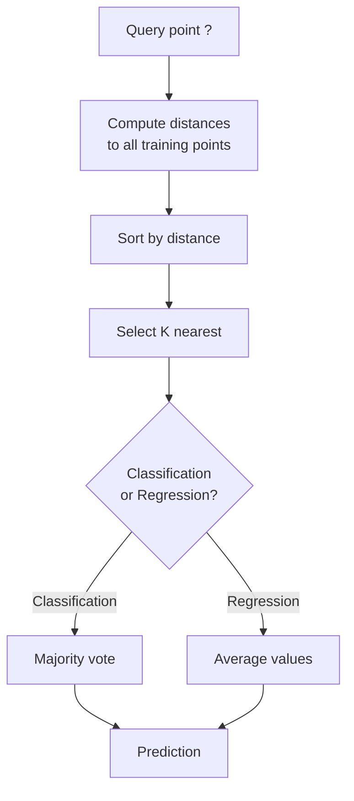
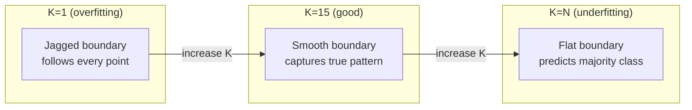
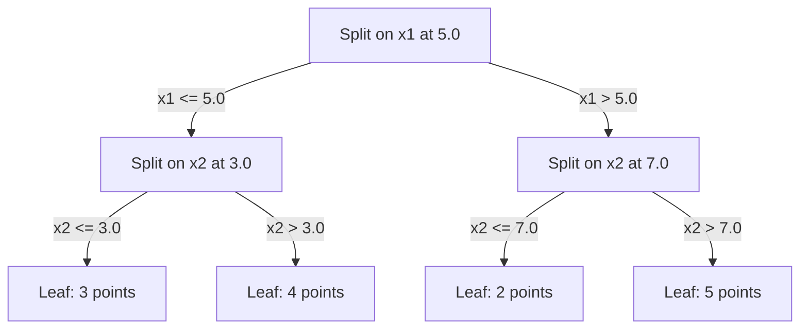

# K- نزدیک ترین همسایه ها و فاصله ها

> همه چيز رو نگه دار، با نگاه کردن به همسايگانت پيش بيني کن ساده ترين الگوریتم که واقعاً جواب ميده

**Type:** Build
**Language:**پیتون
**Prerequisites:** Phase 1 (Lesson 14 Norms and Distances)
**Time:** ~90 minutes

## اهداف یادگیری

- پیاده سازی طبقه بندی KNN و بازگشت از ابتدا با K قابل تنظیم و رای گیری با وزن فاصله
- مقارنة مقادیر فاصله L1, L2, cosine و Minkowski و انتخاب مناسب برای یک نوع داده داده داده
- لعنت ابعاد را توضیح دهید و نشان دهید که چرا KNN در فضاهای ابعاد بالا تخریب می شود
- ساخت یک درخت KD برای جستجوی کارآمد نزدیک ترین همسایه و تجزیه و تحلیل زمانی که آن را بیش از نیروی خام

## مشکل

شما یک مجموعه داده دارید. یک نقطه داده جدید می آید. شما باید آن را طبقه بندی کنید یا ارزش آن را پیش بینی کنید. به جای یادگیری پارامترها از داده ها (مانند بازپسین خطی یا SVM) ، شما فقط نقاط آموزش K را نزدیک ترین نقطه جدید پیدا می کنید و اجازه می دهید آنها را رای دهند.

این نزدیک ترین همسایه های K است. هیچ مرحله آموزشی وجود ندارد. هیچ پارامتر برای یادگیری وجود ندارد. هیچ عملکرد از دست دادن برای حداقل کردن. شما کل مجموعه آموزش را ذخیره می کنید و فاصله ها را در زمان پیش بینی محاسبه می کنید.

این کار برای کار کردن خیلی ساده به نظر می رسد. اما KNN برای بسیاری از مشکلات به طرز شگفت انگیزی رقابتی است، به ویژه با مجموعه داده های کوچک و متوسط، و درک آن مفاهیم اساسی را آشکار می کند: انتخاب متریک فاصله (برقراری ارتباط با درس 14 مرحله 1), لعنت ابعاد، و تفاوت بین یادگیری تنبل و مشتاق.

KNN همچنین در همه جا در هوش مصنوعی مدرن ، فقط تحت نام های مختلف ظاهر می شود. پایگاه داده های ویکتور KNN در مورد گنجانده ها جستجو می کنند. نسل افزایش یافته بازیافت (RAG) نزدیکترین قطعات سند K را پیدا می کند. سیستم های توصیه کننده کاربران یا موارد مشابه را پیدا می کنند. الگوریتم یکسان است. مقیاس و ساختار داده ها متفاوت است.

## مفهوم

### نحوه کار KNN

با توجه به مجموعه داده های نقاط برچسب گذاری شده و یک نقطه جدید سوال:

1. فاصله را از سوال تا هر نقطه در مجموعه داده ها محاسبه کنید
2. با توجه به فاصله
3. نزدیک ترین نقطه K را بگیرید
4. برای طبقه بندی: اکثریت رای در میان همسایه های K
5. برای بازپسین: متوسط (یا متوسط وزن) ارزش های K همسایه



اين تمام الگوریتم ـه، هيچ سازشي، هيچ نزديکيت گرادينتي، هيچ دوره اي

### انتخاب K

K یک پارامتر تک است. این کنترل تعویض-تبدیل تغیرات:

| K | Behavior |
|---|----------|
| K = 1 | Decision boundary follows every point. Zero training error. High variance. Overfits |
| Small K (3-5) | Sensitive to local structure. Can capture complex boundaries |
| Large K | Smoother boundaries. More robust to noise. May underfit |
| K = N | Predicts the majority class for every point. Maximum bias |

یک نقطه شروع مشترک K = sqrt(N) برای مجموعه داده های N نقاط است. برای طبقه بندی دوگانه برای جلوگیری از روابط، از K غیرمرتبط استفاده کنید.



### متریک های فاصله

تابع فاصله تعریف می کند که "تقریبا" چه معنی دارد. متریک های مختلف همسایه های مختلف، پیش بینی های مختلف را تولید می کنند.

**L2 (Euclidean)**فاصله خط مستقيم

```
d(a, b) = sqrt(sum((a_i - b_i)^2))
```

حساس به مقیاس ویژگی ها همیشه قبل از استفاده از L2 با KNN ویژگی های استاندارد را تنظیم کنید.

**L1 (Manhattan)**این مقدار، تفاوت های مطلق را جمع می کند.

```
d(a, b) = sum(|a_i - b_i|)
```

**Cosine distance**این اندازه گیری زاویه بین متری ها بدون توجه به شدت، برای متن و ادغام داده ها ضروری است.

```
d(a, b) = 1 - (a . b) / (||a|| * ||b||)
```

**Minkowski**L1 و L2 را با پارامتر p عمومی می کند.

```
d(a, b) = (sum(|a_i - b_i|^p))^(1/p)

p=1: Manhattan
p=2: Euclidean
p->inf: Chebyshev (max absolute difference)
```

استفاده از کدام متریک بستگی به داده ها دارد:

| Data type | Best metric | Why |
|-----------|------------|-----|
| Numeric features, similar scale | L2 (Euclidean) | Default, works for spatial data |
| Numeric features, outliers | L1 (Manhattan) | Robust, does not amplify large differences |
| Text embeddings | Cosine | Magnitude is noise, direction is meaning |
| High-dimensional sparse | Cosine or L1 | L2 suffers from curse of dimensionality |
| Mixed types | Custom distance | Combine metrics per feature type |

### KNN با وزن

KNN استاندارد وزن برابر را به تمام همسایه های K می دهد اما همسایه ای در فاصله 0.1 باید بیشتر از یک در فاصله 5.0 اهمیت داشته باشد.

**Distance-weighted KNN**وزن هر همسایه را برعکس با فاصله:

```
weight_i = 1 / (distance_i + epsilon)

For classification: weighted vote
For regression:     weighted average = sum(w_i * y_i) / sum(w_i)
```

ایپسایل مانع از تقسیم با صفر می شود وقتی یک نقطه سوال دقیقا با یک نقطه آموزش مطابقت دارد.

KNN با وزن کمتر نسبت به انتخاب K حساس است زیرا همسایه های دور به این موضوع کمک بسیار کمی می کنند.

### لعنت ابعاد

عملکرد KNN در ابعاد بالا کاهش می یابد. این نگرانی مبهم نیست. این یک واقعیت ریاضی است.

**Problem 1: distances converge.**با افزایش ابعاد، نسبت حداکثر فاصله به حداقل فاصله نزدیک می شود 1. همه نقاط به طور یکسان "به دور" از سوال می شوند.

```
In d dimensions, for random uniform points:

d=2:    max_dist / min_dist = varies widely
d=100:  max_dist / min_dist ~ 1.01
d=1000: max_dist / min_dist ~ 1.001

When all distances are nearly equal, "nearest" is meaningless.
```

**Problem 2: volume explodes.**برای گرفتن همسایه های K در یک بخش ثابت از داده ها، شما باید شعاع جستجو خود را برای پوشش بخش بسیار بزرگتر از فضای ویژگی گسترش دهید. "ساحه" در ابعاد بالا شامل بیشتر فضای است.

**Problem 3: corners dominate.**در یک واحد هیپرکوب در ابعاد d، بیشتر حجم در نزدیکی گوشه ها متمرکز می شود، نه در مرکز. یک توپ در مکعب حاوی یک بخش از حجم ناپدید می شود به عنوان d رشد می کند.

نتیجه عملی: KNN به خوبی تا حدود 20-50 ویژگی کار می کند. فراتر از آن، شما نیاز به کاهش ابعاد (PCA، UMAP، t-SNE) قبل از اعمال KNN، یا شما نیاز به استفاده از ساختار جستجوی مبتنی بر درخت است که بهره برداری از ابعاد پایین تر ذاتی داده ها.

### درختان KD: سریعترین همسایه جستجو

نیروی خام KNN فاصله را از جستجو به هر نقطه آموزش محاسبه می کند. این O(n * d) در هر جستجو است. برای مجموعه داده های بزرگ، این بسیار کند است.

یک درخت KD به صورت مکرر فضا را در امتداد محورهای ویژگی تقسیم می کند. در هر سطح، آن را در امتداد یک ابعاد در ارزش میانگین تقسیم می کند.



برای پیدا کردن نزدیک ترین همسایه، درخت را به برگ حاوی سوال عبور کنید، سپس به عقب بروید و فقط اگر نقاط نزدیک تر را در آن ها قرار داده باشید، قسمت های همسایه را بررسی کنید.

زمان متوسط جستجو: O(log n) برای ابعاد پایین. اما درختان KD در ابعاد بالا (d > 20) به O(n کاهش می یابد زیرا عقب نشینی شاخه های کمتر و کمتر را از بین می برد.

### درختان توپ: برای ابعاد متوسط بهتر است

درختان توپ داده ها را به جای جعبه های محور متصل به هیپر اسفیرها تقسیم می کنند. هر گره یک توپ (مرکز + شعاع) را تعریف می کند که شامل تمام نقاط در آن درخت فرعی است.

مزایای درختان KD:
- در ابعاد متوسط (تا 50) بهتر کار می کند
- ساختار غیر محورانه ای
- حجم محدودتر به این معنی است که شاخه های بیشتری در طول جستجو برش می شوند

درختان KD و درختان توپ هم الگوریتم های دقیق هستند. برای جستجوی واقعاً بزرگ (میلیون ها نقطه، صدها ابعاد) ، روش های نزدیکترین همسایه (HNSW، IVF، کوانتاسیون محصول) در عوض استفاده می شود. این موارد در مرحله 1 درس 14 پوشش داده شده است.

### یادگیری تنبل در مقابل یادگیری مشتاق

KNN یک دانش آموز تنبل است: در زمان آموزش کار نمی کند و همه در زمان پیش بینی کار می کنند. اکثر الگوریتم های دیگر (ریگریشن خطی، SVM، شبکه های عصبی) دانش آموزان مشتاق هستند: آنها در زمان آموزش محاسبات سنگین را انجام می دهند تا یک مدل کامپکت بسازند، سپس پیش بینی ها سریع هستند.

| Aspect | Lazy (KNN) | Eager (SVM, neural net) |
|--------|------------|------------------------|
| Training time | O(1) just store data | O(n * epochs) |
| Prediction time | O(n * d) per query | O(d) or O(parameters) |
| Memory at prediction | Store entire training set | Store model parameters only |
| Adapts to new data | Add points instantly | Retrain the model |
| Decision boundary | Implicit, computed on the fly | Explicit, fixed after training |

یادگیری تنبل در صورتی ایده آل است که:
- مجموعه داده ها اغلب تغییر می کند (نقطه ها را بدون آموزش مجدد اضافه یا حذف کنید)
- براي چند تا سوال پيش بيني لازم هست
- تو می خوای زمان آموزش صفر باشه
- مجموعه داده ها به اندازه کافی کوچک است که جستجوی نیروی خشن سریع باشد

### KNN برای بازپسین

به جای رای اکثریت، KNN برای بازپسین میانگین ارزش های هدف همسایه K را محاسبه می کند.

```
prediction = (1/K) * sum(y_i for i in K nearest neighbors)

Or with distance weighting:
prediction = sum(w_i * y_i) / sum(w_i)
where w_i = 1 / distance_i
```

گریگسیون KNN پیش بینی های ثابت قطعه ای (یا نرم قطعه ای با وزن) را تولید می کند. این نمی تواند فراتر از محدوده داده های آموزش استنباط کند. اگر اهداف آموزش بین 0 تا 100 باشد، KNN هرگز پیش بینی 200 را نخواهد کرد.

```figure
knn-smoothness
```

## آن را بسازید

### مرحله اول: عملکردهای فاصله

از فاصله های L1, L2, cosine و Minkowski استفاده کنید که مستقیماً با مرحله 1 درس 14 ارتباط برقرار می کنند.

```python
import math

def l2_distance(a, b):
    return math.sqrt(sum((ai - bi) ** 2 for ai, bi in zip(a, b)))

def l1_distance(a, b):
    return sum(abs(ai - bi) for ai, bi in zip(a, b))

def cosine_distance(a, b):
    dot_val = sum(ai * bi for ai, bi in zip(a, b))
    norm_a = math.sqrt(sum(ai ** 2 for ai in a))
    norm_b = math.sqrt(sum(bi ** 2 for bi in b))
    if norm_a == 0 or norm_b == 0:
        return 1.0
    return 1.0 - dot_val / (norm_a * norm_b)

def minkowski_distance(a, b, p=2):
    if p == float('inf'):
        return max(abs(ai - bi) for ai, bi in zip(a, b))
    return sum(abs(ai - bi) ** p for ai, bi in zip(a, b)) ** (1 / p)
```

### مرحله دوم: طبقه بندی کننده KNN و بازپسین

کامل KNN را با K قابل تنظیم، متریک فاصله و وزن فاصله اختیاری بسازید.

```python
class KNN:
    def __init__(self, k=5, distance_fn=l2_distance, weighted=False,
                 task="classification"):
        self.k = k
        self.distance_fn = distance_fn
        self.weighted = weighted
        self.task = task
        self.X_train = None
        self.y_train = None

    def fit(self, X, y):
        self.X_train = X
        self.y_train = y

    def predict(self, X):
        return [self._predict_one(x) for x in X]
```

### مرحله سوم: درخت KD برای جستجوی موثر

یک درخت KD را از نو بسازید که به صورت تکراری در میان هر ابعاد تقسیم شود.

```python
class KDTree:
    def __init__(self, X, indices=None, depth=0):
        # Recursively partition the data
        self.axis = depth % len(X[0])
        # Split on median of the current axis
        ...

    def query(self, point, k=1):
        # Traverse to leaf, then backtrack
        ...
```

ببین`code/knn.py`برای اجرای کامل با تمام روش های کمک و نمایش.

### مرحله 4: مقیاس بندی ویژگی

KNN نیاز به مقیاس بندی ویژگی دارد زیرا فاصله ها نسبت به شدت ویژگی ها حساس هستند. یک ویژگی از 0 تا 1000، یک ویژگی از 0 تا 1 را تحت سلطه قرار می دهد.

```python
def standardize(X):
    n = len(X)
    d = len(X[0])
    means = [sum(X[i][j] for i in range(n)) / n for j in range(d)]
    stds = [
        max(1e-10, (sum((X[i][j] - means[j]) ** 2 for i in range(n)) / n) ** 0.5)
        for j in range(d)
    ]
    return [[((X[i][j] - means[j]) / stds[j]) for j in range(d)] for i in range(n)], means, stds
```

## ازش استفاده کن

با سکیت-علم:

```python
from sklearn.neighbors import KNeighborsClassifier
from sklearn.preprocessing import StandardScaler
from sklearn.pipeline import Pipeline

clf = Pipeline([
    ("scaler", StandardScaler()),
    ("knn", KNeighborsClassifier(n_neighbors=5, metric="euclidean")),
])
clf.fit(X_train, y_train)
print(f"Accuracy: {clf.score(X_test, y_test):.4f}")
```

Scikit-learn به طور خودکار درخت های KD یا درخت های توپ را زمانی که مجموعه داده ها به اندازه کافی بزرگ و ابعاد آن به اندازه کافی کم است استفاده می کند. برای داده های ابعاد بالا، آن را به نیروی خام برمی گرداند. شما می توانید این را با `algorithm`پارامتر

برای جستجوی نزدیکترین همسایه در مقیاس بزرگ (میلیون ها بردار) ، از FAISS، Annoy یا یک پایگاه داده بردار استفاده کنید:

```python
import faiss

index = faiss.IndexFlatL2(dimension)
index.add(embeddings)
distances, indices = index.search(query_vectors, k=5)
```

## تمرینات

1. طبقه بندی KNN را در مجموعه داده های 2D با 3 کلاس پیاده سازی کنید. مرز تصمیم گیری را برای K=1, K=5, K=15, و K=N مشخص کنید. انتقال از بیش از حد به کم مناسب را مشاهده کنید.

2. 1000 نقطه تصادفی را در ابعاد 2، 5، 10، 50، 100 و 500 تولید کنید. برای هر ابعاد، نسبت حداکثر فاصله دوگانه را به حداقل فاصله دوگانه محاسبه کنید. نسبت به ابعاد را برای تماشای لعنتی ابعاد تراز کنید.

3. مقایسه فاصله L1, L2 و cosine برای KNN در یک مشکل طبقه بندی متن (با استفاده از متریک TF-IDF) کدام متریک بهترین دقت را می دهد؟ چرا cosine برای متن برنده می شود؟

4. پیاده سازی یک درخت KD و اندازه گیری زمان سوال در مقابل نیروی خام برای مجموعه داده های 1k، 10k، و 100k نقطه در 2D، 10D، و 50D. در چه ابعاد درخت KD متوقف می شود سریع تر از نیروی خام است؟

5. یک بازخورد KNN با وزن برای y = sin(x) + صدا بسازید. آن را با KNN بدون وزن برای K=3, 10, 30 مقایسه کنید. نشان دهید که وزن کردن پیش بینی های صاف تری را به ویژه برای K بزرگ تولید می کند.

## اصطلاحات کلیدی

| Term | What it actually means |
|------|----------------------|
| K-nearest neighbors | Non-parametric algorithm that predicts by finding the K closest training points to a query |
| Lazy learning | No computation at training time. All work happens at prediction time. KNN is the canonical example |
| Eager learning | Heavy computation at training time to build a compact model. Most ML algorithms are eager |
| Curse of dimensionality | In high dimensions, distances converge and neighborhoods expand to cover most of the space, making KNN ineffective |
| KD-tree | Binary tree that recursively partitions space along feature axes. O(log n) queries in low dimensions |
| Ball tree | Tree of nested hyperspheres. Works better than KD-trees in moderate dimensions (up to ~50) |
| Weighted KNN | Neighbors weighted inversely by distance. Closer neighbors have more influence on the prediction |
| Feature scaling | Normalizing features to comparable ranges. Required for distance-based methods like KNN |
| Majority vote | Classification by counting which class is most common among K neighbors |
| Brute force search | Computing distance to every training point. O(n*d) per query. Exact but slow for large n |
| Approximate nearest neighbor | Algorithms (HNSW, LSH, IVF) that find approximately nearest points much faster than exact search |
| Voronoi diagram | The partition of space where each region contains all points closer to one training point than any other. K=1 KNN produces Voronoi boundaries |

## خواندن بیشتر

- [Cover & Hart: Nearest Neighbor Pattern Classification (1967)](https://ieeexplore.ieee.org/document/1053964)- مقاله اساسی KNN که ثابت می کند که حداکثر دو برابر میزان خطا باایز مطلوب است
- [Friedman, Bentley, Finkel: An Algorithm for Finding Best Matches in Logarithmic Expected Time (1977)](https://dl.acm.org/doi/10.1145/355744.355745)- کاغذ اصلی KD-tree
- [Beyer et al.: When Is "Nearest Neighbor" Meaningful? (1999)](https://link.springer.com/chapter/10.1007/3-540-49257-7_15)-تحليل رسمي لعنت ابعاديت براي نزديکترين همسایه
- [scikit-learn Nearest Neighbors documentation](https://scikit-learn.org/stable/modules/neighbors.html)- راهنمای عملی با انتخاب الگوریتم
- [FAISS: A Library for Efficient Similarity Search](https://github.com/facebookresearch/faiss)-مكتبة ميتا براي جستجو در مقیاس بيليارد
