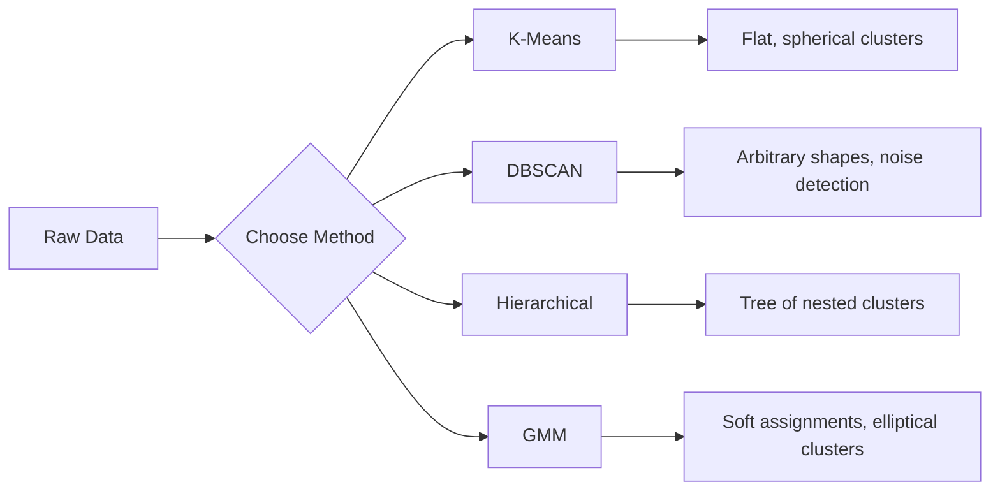

# یادگیری بدون نظارت

> بدون برچسب، بدون معلم الگوریتم ساختار خود را پیدا می کند

**Type:** Build
**Languages:** Python
**Prerequisites:** Phase 1 (Norms & Distances, Probability & Distributions), Phase 2 Lessons 1-6
**Time:** ~90 minutes

## اهداف یادگیری

- از ابتدا مدل های K-Means، DBSCAN و Gaussian Mix را پیاده سازی کنید و رفتار گروه بندی آنها را مقایسه کنید
- با استفاده از نمره شیش و روش لمب، کیفیت خوشبختی را ارزیابی کنید تا K بهینه را انتخاب کنید
- توضیح دهید که DBSCAN چه زمانی از K-Means بهتر است و مشخص کنید که کدام الگوریتم با کلستر های غیر کره ای و غیرمستقیم کار می کند
- ساخت یک خط لوله تشخیص ناهنجاری با استفاده از روش های دسته بندی برای نشان دادن نقاط که از الگوهای معمول منحرف می شوند

## مشکل

تا حالا هر درس ML داده های برچسب شده را فرض کرده است: "این یک ورودی است، این یک خروجی درست است". در دنیای واقعی، برچسب ها گران هستند. یک بیمارستان میلیون ها پرونده بیمار دارد اما هیچکس به صورت دستی هر یک را با یک دسته بیماری برچسب نکرده است. یک سایت تجارت الکترونیک میلیون ها جلسه کاربر دارد اما هیچ کس دارای بخش های مشتری دست به دست نیست. يه گروه امنيتي گزارشات شبکه رو دارن ولي هيچکس هر تشنجي رو نشون نداده

یادگیری بدون نظارت الگوها را بدون اینکه به آنها گفته شود دنبال چه چیزی می شود پیدا می کند. آن نقاط داده مشابه را جمع می کند، ساختارهای پنهان را کشف می کند و ناهنجاری ها را آشکار می کند. اگر یادگیری تحت نظارت از کتاب درسی با کلید پاسخ است، یادگیری بدون نظارت به داده های خام نگاه می کند تا الگوها خود را نشان دهند.

نکته: بدون برچسب ها، نمی توانید مستقیماً "حق" یا "خطای" را اندازه گیری کنید. برای ارزیابی اینکه آیا ساختار الگوریتم شما معنی دارد، به ابزارهای مختلفی نیاز دارید.

## مفهوم

### گروه بندی: گروه بندی کردن چیزهای مشابه

گروه بندی هر نقطه داده را به یک گروه (گروه) اختصاص می دهد تا نقاط داخل همان گروه بیشتر شبیه به یکدیگر باشند تا به نقاط در گروه های دیگر.



### K-Means: اسب کار

K-Means داده ها را به طور دقیق به خوشه های K تقسیم می کند. هر خوشه یک مرکز (مرکز جرم آن) دارد و هر نقطه متعلق به نزدیک ترین مرکز است.

الگوریتم لوید:

1. نقاط تصادفی K را به عنوان مرکزهای اولیه انتخاب کنید
2. هر نقطه داده را به نزدیکترین مرکز قرار دهید
3. هر مرکز را به عنوان میانگین نقاط اختصاص داده شده اش محاسبه کنید
4. مراحل 2-3 را تا زمانی که تغییر وظایف متوقف شود تکرار کنید

تابع هدف (درگیری) فاصله کل مربع از هر نقطه تا مرکز تعیین شده اش را اندازه گیری می کند. K-Means این را به حداقل می رساند، اما فقط حداقل محلی را پیدا می کند. ابتدایی های مختلف می توانند نتایج متفاوتی را ارائه دهند.

### انتخاب K

دو روش استاندارد:

**Elbow method:**K-Means را اجرا کنید برای K = 1, 2, 3, ..., n. سست بودن پلاوت در مقابل K. دنبال "کعب" باشید که در آن اضافه کردن دسته های بیشتر باعث کاهش سست بودن به طور قابل توجهی می شود.

**Silhouette score:**برای هر نقطه، اندازه گیری کنید که چقدر شبیه به خوشه خود (a) در مقابل نزدیکترین خوشه دیگر (b) است. ضریب شیش (b - a) / max(a, b) ، از -1 (کلاستر اشتباه) تا +1 (با خوش خوشه جمع شده) متفاوت است. میانگین در سراسر نقاط برای یک نمره جهانی.

### DBSCAN: گروه بندی مبتنی بر چگالی

K-Means فرض می کند که خوشه ها کره ای هستند و شما را می خواهد که K را پیش از آن انتخاب کنید. DBSCAN هیچ یک از این فرضیه ها را انجام نمی دهد.

دو پارامتر:
- **eps**: شعاع یک محله
- **min_samples**: حداقل تعداد نقاط مورد نیاز برای تشکیل یک منطقه کثیف

سه نوع نقطه:
- **Core point**: حداقل نقطه نمونه ای در فاصله eps دارد
- **Border point**: در فاصله ی یک نقطه اصلی اما خود یک نقطه اصلی نیست
- **Noise point**نه هسته و نه مرز. اینها خارق العاده هستند.

DBSCAN نقاط هسته ای را که در فاصله ی دو نقطه از یکدیگر هستند به یک خوشه متصل می کند. نقاط مرزی به خوشه ی یک نقطه هسته ای نزدیک پیوسته می شوند. نقاط شور به هیچ خوشه ای تعلق ندارند.

نقاط قوت: گروه های هر شکل را پیدا می کند، تعداد گروه ها را به طور خودکار تعیین می کند، نقاط ضعف را شناسایی می کند.

### گروه بندی سلسله مراتبی

درخت (دندروگرام) از خوشه های سرسبز را می سازد.

جمع بندی (از پایین به بالا):
1. از هر نقطه به عنوان دسته خودش شروع کن
2. دو گروه نزدیک رو هم ترکیب کن
3. تا زمانی که تنها یک خوشه باقی بماند تکرار کنید
4. دندروگرام را در سطح مورد نظر برش دهید تا کلستر K بدست آید

"قربت" بین خوشه ها می تواند به شکل زیر اندازه گیری شود:
- **Single linkage**: حداقل فاصله بین هر دو نقطه در دو خوشه
- **Complete linkage**: حداکثر فاصله بین هر دو نقطه
- **Average linkage**: فاصله متوسط بین تمام جفت ها
- **Ward's method**: ادغام که باعث کوچکترین افزایش در مجموع اختلافات درون کلستر می شود

### مدل های مخلوط گاس (GMM)

K-Means به کارآمدی سخت می دهد: هر نقطه متعلق به دقیقا یک خوشه است. GMM به کارآمدی نرم می دهد: هر نقطه احتمال تعلق به هر خوشه است.

GMM فرض می کند که داده ها از ترکیبی از توزیع های K Gaussian تولید شده اند، هر کدام با متوسط و همتای خود. الگوریتم انتظارات-مقرب سازی (EM) بین:

- **E-step**: احتمالي که هر نقطه متعلق به هر گاوسي باشد را محاسبه کنید
- **M-step**:تا به روز رسانی متوسط، همتای و وزن مخلوط هر گاسین برای حداکثر احتمال داده ها

GMM می تواند خوشه های eliptical را مدل کند (نه فقط کره ای مانند K-Means) و به طور طبیعی خوشه های همپوشانی را اداره می کند.

### چه زمانی باید از کدام استفاده کنیم؟

| Method | Best for | Avoid when |
|--------|----------|------------|
| K-Means | Large datasets, spherical clusters, known K | Irregular shapes, outliers present |
| DBSCAN | Unknown K, arbitrary shapes, outlier detection | Varying densities, very high dimensions |
| Hierarchical | Small datasets, need dendrogram, unknown K | Large datasets (O(n^2) memory) |
| GMM | Overlapping clusters, soft assignments needed | Very large datasets, too many dimensions |

### تشخیص ناهنجاری با دسته بندی

دسته بندی به طور طبیعی از تشخیص ناهنجاری پشتیبانی می کند:
- **K-Means**: نقاط دور از هر مرکزي، ناهنجاری هستند
- **DBSCAN**: نقاط شور به طور تعریف ناهنجاری هستند
- **GMM**: نقاط با احتمال کم در تمام گاسیان ها ناهنجاری هستند

```figure
kmeans-step
```

## آن را بسازید

### مرحله اول: K- از ابتدا

```python
import math
import random


def euclidean_distance(a, b):
    return math.sqrt(sum((ai - bi) ** 2 for ai, bi in zip(a, b)))


def kmeans(data, k, max_iterations=100, seed=42):
    random.seed(seed)
    n_features = len(data[0])

    centroids = random.sample(data, k)

    for iteration in range(max_iterations):
        clusters = [[] for _ in range(k)]
        assignments = []

        for point in data:
            distances = [euclidean_distance(point, c) for c in centroids]
            nearest = distances.index(min(distances))
            clusters[nearest].append(point)
            assignments.append(nearest)

        new_centroids = []
        for cluster in clusters:
            if len(cluster) == 0:
                new_centroids.append(random.choice(data))
                continue
            centroid = [
                sum(point[j] for point in cluster) / len(cluster)
                for j in range(n_features)
            ]
            new_centroids.append(centroid)

        if all(
            euclidean_distance(old, new) < 1e-6
            for old, new in zip(centroids, new_centroids)
        ):
            print(f"  Converged at iteration {iteration + 1}")
            break

        centroids = new_centroids

    return assignments, centroids
```

### مرحله دوم: روش کوله و نمره شیوه

```python
def compute_inertia(data, assignments, centroids):
    total = 0.0
    for point, cluster_id in zip(data, assignments):
        total += euclidean_distance(point, centroids[cluster_id]) ** 2
    return total


def silhouette_score(data, assignments):
    n = len(data)
    if n < 2:
        return 0.0

    clusters = {}
    for i, c in enumerate(assignments):
        clusters.setdefault(c, []).append(i)

    if len(clusters) < 2:
        return 0.0

    scores = []
    for i in range(n):
        own_cluster = assignments[i]
        own_members = [j for j in clusters[own_cluster] if j != i]

        if len(own_members) == 0:
            scores.append(0.0)
            continue

        a = sum(euclidean_distance(data[i], data[j]) for j in own_members) / len(own_members)

        b = float("inf")
        for cluster_id, members in clusters.items():
            if cluster_id == own_cluster:
                continue
            avg_dist = sum(euclidean_distance(data[i], data[j]) for j in members) / len(members)
            b = min(b, avg_dist)

        if max(a, b) == 0:
            scores.append(0.0)
        else:
            scores.append((b - a) / max(a, b))

    return sum(scores) / len(scores)


def find_best_k(data, max_k=10):
    print("Elbow method:")
    inertias = []
    for k in range(1, max_k + 1):
        assignments, centroids = kmeans(data, k)
        inertia = compute_inertia(data, assignments, centroids)
        inertias.append(inertia)
        print(f"  K={k}: inertia={inertia:.2f}")

    print("\nSilhouette scores:")
    for k in range(2, max_k + 1):
        assignments, centroids = kmeans(data, k)
        score = silhouette_score(data, assignments)
        print(f"  K={k}: silhouette={score:.4f}")

    return inertias
```

### مرحله 3: DBSCAN از ابتدا

```python
def dbscan(data, eps, min_samples):
    n = len(data)
    labels = [-1] * n
    cluster_id = 0

    def region_query(point_idx):
        neighbors = []
        for i in range(n):
            if euclidean_distance(data[point_idx], data[i]) <= eps:
                neighbors.append(i)
        return neighbors

    visited = [False] * n

    for i in range(n):
        if visited[i]:
            continue
        visited[i] = True

        neighbors = region_query(i)

        if len(neighbors) < min_samples:
            labels[i] = -1
            continue

        labels[i] = cluster_id
        seed_set = list(neighbors)
        seed_set.remove(i)

        j = 0
        while j < len(seed_set):
            q = seed_set[j]

            if not visited[q]:
                visited[q] = True
                q_neighbors = region_query(q)
                if len(q_neighbors) >= min_samples:
                    for nb in q_neighbors:
                        if nb not in seed_set:
                            seed_set.append(nb)

            if labels[q] == -1:
                labels[q] = cluster_id

            j += 1

        cluster_id += 1

    return labels
```

### مرحله 4: مدل مخلوط گاس (الگوریتم EM)

```python
def gmm(data, k, max_iterations=100, seed=42):
    random.seed(seed)
    n = len(data)
    d = len(data[0])

    indices = random.sample(range(n), k)
    means = [list(data[i]) for i in indices]
    variances = [1.0] * k
    weights = [1.0 / k] * k

    def gaussian_pdf(x, mean, variance):
        d = len(x)
        coeff = 1.0 / ((2 * math.pi * variance) ** (d / 2))
        exponent = -sum((xi - mi) ** 2 for xi, mi in zip(x, mean)) / (2 * variance)
        return coeff * math.exp(max(exponent, -500))

    for iteration in range(max_iterations):
        responsibilities = []
        for i in range(n):
            probs = []
            for j in range(k):
                probs.append(weights[j] * gaussian_pdf(data[i], means[j], variances[j]))
            total = sum(probs)
            if total == 0:
                total = 1e-300
            responsibilities.append([p / total for p in probs])

        old_means = [list(m) for m in means]

        for j in range(k):
            r_sum = sum(responsibilities[i][j] for i in range(n))
            if r_sum < 1e-10:
                continue

            weights[j] = r_sum / n

            for dim in range(d):
                means[j][dim] = sum(
                    responsibilities[i][j] * data[i][dim] for i in range(n)
                ) / r_sum

            variances[j] = sum(
                responsibilities[i][j]
                * sum((data[i][dim] - means[j][dim]) ** 2 for dim in range(d))
                for i in range(n)
            ) / (r_sum * d)
            variances[j] = max(variances[j], 1e-6)

        shift = sum(
            euclidean_distance(old_means[j], means[j]) for j in range(k)
        )
        if shift < 1e-6:
            print(f"  GMM converged at iteration {iteration + 1}")
            break

    assignments = []
    for i in range(n):
        assignments.append(responsibilities[i].index(max(responsibilities[i])))

    return assignments, means, weights, responsibilities
```

### مرحله 5: اطلاعات آزمون را تولید کنید و همه چیز را اجرا کنید

```python
def make_blobs(centers, n_per_cluster=50, spread=0.5, seed=42):
    random.seed(seed)
    data = []
    true_labels = []
    for label, (cx, cy) in enumerate(centers):
        for _ in range(n_per_cluster):
            x = cx + random.gauss(0, spread)
            y = cy + random.gauss(0, spread)
            data.append([x, y])
            true_labels.append(label)
    return data, true_labels


def make_moons(n_samples=200, noise=0.1, seed=42):
    random.seed(seed)
    data = []
    labels = []
    n_half = n_samples // 2
    for i in range(n_half):
        angle = math.pi * i / n_half
        x = math.cos(angle) + random.gauss(0, noise)
        y = math.sin(angle) + random.gauss(0, noise)
        data.append([x, y])
        labels.append(0)
    for i in range(n_half):
        angle = math.pi * i / n_half
        x = 1 - math.cos(angle) + random.gauss(0, noise)
        y = 1 - math.sin(angle) - 0.5 + random.gauss(0, noise)
        data.append([x, y])
        labels.append(1)
    return data, labels


if __name__ == "__main__":
    centers = [[2, 2], [8, 3], [5, 8]]
    data, true_labels = make_blobs(centers, n_per_cluster=50, spread=0.8)

    print("=== K-Means on 3 blobs ===")
    assignments, centroids = kmeans(data, k=3)
    print(f"  Centroids: {[[round(c, 2) for c in cent] for cent in centroids]}")
    sil = silhouette_score(data, assignments)
    print(f"  Silhouette score: {sil:.4f}")

    print("\n=== Elbow Method ===")
    find_best_k(data, max_k=6)

    print("\n=== DBSCAN on 3 blobs ===")
    db_labels = dbscan(data, eps=1.5, min_samples=5)
    n_clusters = len(set(db_labels) - {-1})
    n_noise = db_labels.count(-1)
    print(f"  Found {n_clusters} clusters, {n_noise} noise points")

    print("\n=== GMM on 3 blobs ===")
    gmm_assignments, gmm_means, gmm_weights, _ = gmm(data, k=3)
    print(f"  Means: {[[round(m, 2) for m in mean] for mean in gmm_means]}")
    print(f"  Weights: {[round(w, 3) for w in gmm_weights]}")
    gmm_sil = silhouette_score(data, gmm_assignments)
    print(f"  Silhouette score: {gmm_sil:.4f}")

    print("\n=== DBSCAN on moons (non-spherical clusters) ===")
    moon_data, moon_labels = make_moons(n_samples=200, noise=0.1)
    moon_db = dbscan(moon_data, eps=0.3, min_samples=5)
    n_moon_clusters = len(set(moon_db) - {-1})
    n_moon_noise = moon_db.count(-1)
    print(f"  Found {n_moon_clusters} clusters, {n_moon_noise} noise points")

    print("\n=== K-Means on moons (will fail to separate) ===")
    moon_km, moon_centroids = kmeans(moon_data, k=2)
    moon_sil = silhouette_score(moon_data, moon_km)
    print(f"  Silhouette score: {moon_sil:.4f}")
    print("  K-Means splits moons poorly because they are not spherical")

    print("\n=== Anomaly detection with DBSCAN ===")
    anomaly_data = list(data)
    anomaly_data.append([20.0, 20.0])
    anomaly_data.append([-5.0, -5.0])
    anomaly_data.append([15.0, 0.0])
    anomaly_labels = dbscan(anomaly_data, eps=1.5, min_samples=5)
    anomalies = [
        anomaly_data[i]
        for i in range(len(anomaly_labels))
        if anomaly_labels[i] == -1
    ]
    print(f"  Detected {len(anomalies)} anomalies")
    for a in anomalies[-3:]:
        print(f"    Point {[round(v, 2) for v in a]}")
```

## ازش استفاده کن

با Scikit-Learn، همان الگوریتم ها یک خط هستند:

```python
from sklearn.cluster import KMeans, DBSCAN, AgglomerativeClustering
from sklearn.mixture import GaussianMixture
from sklearn.metrics import silhouette_score as sklearn_silhouette

km = KMeans(n_clusters=3, random_state=42).fit(data)
db = DBSCAN(eps=1.5, min_samples=5).fit(data)
agg = AgglomerativeClustering(n_clusters=3).fit(data)
gmm_model = GaussianMixture(n_components=3, random_state=42).fit(data)
```

نسخه های از ابتدا به شما دقیقاً نشان می دهد که این کتابخانه ها چه محاسبه می کنند. K-Means بین اختصاص و بازتعداد تکرار می کند. DBSCAN از دانه های کثیف خوشه ها را رشد می دهد. GMM بین انتظار و حداکثر سازی متناوب است. نسخه های کتابخانه ثبات عددی، ابتدایی هوشمندانه تر (K-Means ++) و تسریع GPU را اضافه می کنند، اما منطق اصلی یکسان است.

## -باده

این درس از ابتدا پیاده سازی های کاری K-Means، DBSCAN و GMM را تولید می کند. کد کلسٹرینگ می تواند به عنوان پایه ای برای روش های پیشرفته تر بدون نظارت استفاده شود.

## تمرینات

1. پیاده سازی K-Means ++ آغاز: به جای انتخاب تصادفی مرکزین، اول را تصادفی انتخاب کنید و هر مرکزین بعدی را با احتمال متناسب با فاصله مربع آن از نزدیک ترین مرکزین موجود انتخاب کنید. سرعت تقارب را با شروع تصادفی مقایسه کنید.
2. به کد دسته بندی های سلسله مراتبی اضافه کنید. پیوند وارد را پیاده سازی کنید و یک دندروگرام (به عنوان یک لیست مخلوط شده از ادغام ها) تولید کنید. آن را در سطوح مختلف برش دهید و با نتایج K-Means مقایسه کنید.
3. یک خط لوله تشخیص غیر معمول ساده بسازید: DBSCAN و GMM را بر روی همان داده ها اجرا کنید، نقاط مرجع که هر دو روش با هم موافق هستند، خارق العاده هستند (ضوضه در DBSCAN، احتمال کم در GMM).

## اصطلاحات کلیدی

| Term | What people say | What it actually means |
|------|----------------|----------------------|
| Clustering | "Grouping similar things" | Partitioning data into subsets where within-group similarity exceeds between-group similarity, measured by a specific distance metric |
| Centroid | "The center of a cluster" | The mean of all points assigned to a cluster; used by K-Means as the cluster representative |
| Inertia | "How tight the clusters are" | Sum of squared distances from each point to its assigned centroid; lower is tighter |
| Silhouette score | "How well-separated clusters are" | For each point, (b - a) / max(a, b) where a is mean intra-cluster distance and b is mean nearest-cluster distance |
| Core point | "A point in a dense region" | A point with at least min_samples neighbors within eps distance, in DBSCAN |
| EM algorithm | "Soft K-Means" | Expectation-Maximization: iteratively compute membership probabilities (E-step) and update distribution parameters (M-step) |
| Dendrogram | "A tree of clusters" | A tree diagram showing the order and distance at which clusters were merged in hierarchical clustering |
| Anomaly | "An outlier" | A data point that does not conform to the expected pattern, identified as noise by DBSCAN or low-probability by GMM |

## خواندن بیشتر

- [Stanford CS229 - Unsupervised Learning](https://cs229.stanford.edu/notes2022fall/main_notes.pdf)- يادداشت هاي سخنرانی اندرو نگ در مورد گروه بندی و EM
- [scikit-learn Clustering Guide](https://scikit-learn.org/stable/modules/clustering.html)- مقایسه عملی تمام الگوریتم های گروه بندی با نمونه های بصری
- [DBSCAN original paper (Ester et al., 1996)](https://www.aaai.org/Papers/KDD/1996/KDD96-037.pdf)- کاغذی که گروه بندی مبتنی بر چگالی را معرفی کرد
