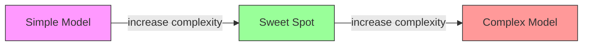
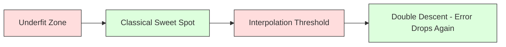
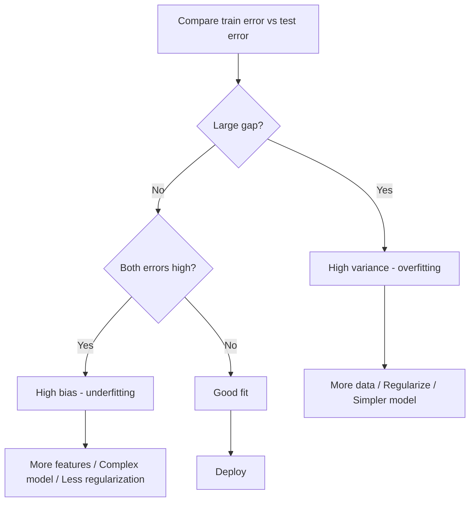
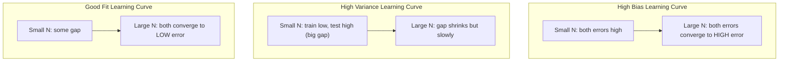
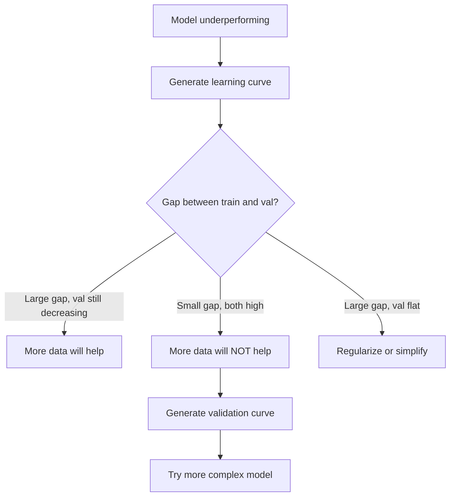

# تعصب در تجارت تنوع

> هر خطا مدل از یکی از سه منبع: تعصب، انحراف یا صدا می آید. شما فقط می توانید دو منبع اول را کنترل کنید.

**Type:** Learn
**Language:**پیتون
**Prerequisites:** Phase 2, Lessons 01-09 (ML basics, regression, classification, evaluation)
**Time:** ~75 minutes

## اهداف یادگیری

- تجزیه انحراف انحراف انحراف خطای پیش بینی انتظار می رود و نقش صداهای غیر قابل کاهش را توضیح دهید
- تشخیص اینکه آیا یک مدل از تعصب بالا یا تفاوت بالا رنج می برد با استفاده از الگوهای آموزش و آزمایش خطا
- توضیح دهید که چگونه تکنیک های تنظیم (L1، L2، ترک، توقف زودرس) تعصب تجاری برای انحراف
- آزمایش هایی را که تعادل تفاوت های تعصب را در میان مدل های پیچیده تر تصویر می کنند، اجرا کنید

## مشکل

شما يه مدل رو آموزش داديد. در داده هاي آزمون اشتباهاتي داره. اون اشتباه از کجا اومده؟

اگر مدل شما خیلی ساده باشد (ریگریشن خطی در مجموعه داده های منحنی) ، به طور مداوم الگوی واقعی را از دست می دهد. این تعصب است. اگر مدل شما خیلی پیچیده باشد (پولینوم درجه 20 در 15 نقطه داده) ، به طور کامل با داده های آموزش مطابقت خواهد داشت اما پیش بینی های کاملا متفاوت در داده های جدید را ارائه می دهد. این تفاوت است.

شما نمی توانید هر دو را در یک زمان برای یک ظرفیت مدل ثابت به حداقل برسانید. تعصب را پایین تر و تعصب را بالا ببرید. تعصب را پایین تر و تعصب را بالا ببرید. درک این تعصب تنها مفیدترین مهارت تشخیصی در یادگیری ماشین است. این به شما می گوید که آیا مدل خود را پیچیده تر یا کمتر پیچیده کنید، آیا داده های بیشتری دریافت کنید یا ویژگی های بهتری را مهندسی کنید، آیا بیشتر یا کمتر تنظیم کنید.

## مفهوم

### تعصب: خطای سیستماتیک

تعصب اندازه گیری می کند که پیش بینی متوسط مدل شما چقدر از ارزش واقعی فاصله دارد. اگر شما یک مدل را بر روی مجموعه های آموزشی مختلف که از یک توزیع گرفته شده و پیش بینی ها را به طور متوسط انجام داده اید، تعصب شکاف بین این متوسط و حقیقت است.

تعصب بالا به این معنی است که مدل برای گرفتن الگوی واقعی خیلی سخت است. یک خط مستقیم متناسب با پارابولا همیشه منحنی را از دست می دهد، مهم نیست که چقدر داده ها را به آن بدهید. این مناسب نیست.

```
High bias (underfitting):
  Model always predicts roughly the same wrong thing.
  Training error: HIGH
  Test error: HIGH
  Gap between them: SMALL
```

### تنوع: حساسیت به داده های آموزش

تغییرات اندازه گیری می کند که زمانی که شما در زیر مجموعه های مختلف داده ها تمرین می کنید، پیش بینی های شما چقدر تغییر می کند. اگر تغییرات کوچک در مجموعه آموزش باعث تغییرات بزرگ در مدل شود، تفاوت زیاد است.

تفاوت بالا به این معنی است که مدل در داده های آموزش، صدا را متناسب می کند، نه سیگنال اصلی. یک چندگانه درجه 20 از طریق هر نقطه آموزش عبور می کند اما بین آنها به شدت نوسان می کند. این بیش از حد مناسب است.

```
High variance (overfitting):
  Model fits training data perfectly but fails on new data.
  Training error: LOW
  Test error: HIGH
  Gap between them: LARGE
```

### تجزیه

برای هر نقطه x، خطای پیش بینی مورد انتظار تحت خسارت مربع دقیقا تجزیه می شود:

```
Expected Error = Bias^2 + Variance + Irreducible Noise

where:
  Bias^2   = (E[f_hat(x)] - f(x))^2
  Variance = E[(f_hat(x) - E[f_hat(x)])^2]
  Noise    = E[(y - f(x))^2]             (sigma^2)
```

- `f(x)`این تابع واقعی است
- `f_hat(x)`پیش بینی مدل شما
- `E[...]`انتظارات در مورد مجموعه های آموزشی مختلف
- `y`برچسب مشاهده شده (کار واقعی به علاوه صدا) است

اصطلاح شور غیر قابل کاهش است. هیچ مدل نمی تواند در داده های سر و صدا بهتر از sigma^2 باشد. کار شما این است که تعادل مناسب بین تعصب^2 و متغیر را پیدا کنید.

### پیچیدگی مدل در مقابل خطا



منحنی کلاسیک شکل U:

| Complexity | Bias | Variance | Total Error |
|-----------|------|----------|-------------|
| Too low | HIGH | LOW | HIGH (underfitting) |
| Just right | MODERATE | MODERATE | LOWEST |
| Too high | LOW | HIGH | HIGH (overfitting) |

### تنظیم به عنوان کنترل متغیرات تعصب

تنظیم عمداً تعصب را افزایش می دهد تا تفاوت را کاهش دهد. این مدل را محدود می کند تا نمی تواند از سر و صدا پیشی بگیرد.

- **L2 (Ridge):**تمام وزن ها رو به صفر کاهش می دهد، تمام ویژگی ها رو حفظ می کنه ولی تاثیرشون رو کاهش می دهد.
- **L1 (Lasso):**چند تا وزن رو به صفر فشار میده انتخاب ویژگی ها رو انجام میده
- **Dropout:**وقتي که در حال آموزش هستي، نورون ها رو از کار مي کنه
- **Early stopping:**قبل از اینکه مدل به طور کامل با داده های آموزش مطابقت داشته باشد، تمرین را متوقف می کند.

قدرت تنظیم (lambda، میزان ترک، تعداد دوره ها) مستقیماً کنترل می کند که شما در منحنی تغییر تغییر در جهت گیری قرار دارید. تنظیم بیشتر به معنای تغییر در جهت گیری بیشتر، تغییر کمتر است.

### دو بارگی: دیدگاه مدرن

نظریه کلاسیک می گوید: پس از نقطه شیرین، پیچیدگی بیشتر همیشه درد می کند. اما تحقیقات از سال 2019 چیزی غیر منتظره را نشان داده است. اگر شما ظرفیت مدل را فراتر از حد مداخله (که مدل پارامترهای کافی برای متناسب با داده های آموزش دارد) افزایش دهید، خطا آزمایش می تواند دوباره کاهش یابد.



این پدیده "زنده شدن دوگانه" توضیح می دهد که چرا شبکه های عصبی بیش از حد پارامتر شده (با پارامترهای بسیار بیشتری از نمونه های آموزش) هنوز هم به خوبی عمومی می شوند. معامله تضییعی کلاسیک تغییر تغییر اشتباه نیست، اما برای رژیم مدرن نامکمل است.

مشاهدات کلیدی در مورد دو بار پایین آمدن:
- این اتفاق در مدل های خطی، درختان تصمیم گیری و شبکه های عصبی رخ می دهد
- داده های بیشتر در واقع می توانند در منطقه ی انترپلاسیون آسیب برسانند (مطابق دو برابر کاهش نمونه)
- دوره های آموزشی بیشتر می تواند باعث آن شود (در جهت دوره دو برابر)
- تنظیمات، اوج را صاف می کند اما از آن خلاص نمی شود

چرا اين اتفاق مي افته؟ در حد تعطیلی، مدل ظرفیت کافی برای قرار دادن تمام نقاط آموزش دارد. این به یک راه حل بسیار خاص که از طریق هر نقطه است و اختلال های کوچک در داده ها باعث تغییرات بزرگ در تناسب می شود. اینجاست که اختلافات به اوج می رسند. بعد از این حد، مدل راه حل های احتمالی زیادی دارد که به طور کامل با داده ها مطابقت دارد. الگوریتم یادگیری (به عنوان مثال، کاهش گرادینت با تنظیم ضمنی) تمایل دارد ساده ترین یکی را از بین آنها انتخاب کند. این تعصب ضمنی به سوی راه حل های ساده، دلیل عمومی شدن مدل های بیش از حد پارامتر شده است.

| Regime | Parameters vs Samples | Behavior |
|--------|----------------------|----------|
| Underparameterized | p << n | Classical tradeoff applies |
| Interpolation threshold | p ~ n | Variance peaks, test error spikes |
| Overparameterized | p >> n | Implicit regularization kicks in, test error drops |

برای اهداف عملی: اگر از شبکه های عصبی یا مجموعه های درختان بزرگ استفاده می کنید، در حد بازتاب توقف نکنید. یا خیلی پایین تر از آن بمانید (با تنظیم صریح) یا خیلی فراتر از آن بروید. بدترین مکان برای قرار گرفتن در حد.

### تشخیص مدل شما



| Symptom | Diagnosis | Fix |
|---------|-----------|-----|
| High train error, high test error | Bias | More features, complex model, less regularization |
| Low train error, high test error | Variance | More data, regularization, simpler model, dropout |
| Low train error, low test error | Good fit | Ship it |
| Train error decreasing, test error increasing | Overfitting in progress | Early stopping |

### استراتژی های عملی

**When bias is the problem:**
- اضافه کردن ویژگی های چندگانه یا تعامل
- از یک مدل انعطاف پذیر تر استفاده کنید (برنامه درختان به جای خطی)
- کاهش قدرت تنظیم
- قطار طولانی تر (اگر هنوز هم به هم نزديک نشده باشد)

**When variance is the problem:**
- اطلاعات آموزش بیشتر رو بدست بيار
- استفاده از بسته بندی (درخش های تصادفی)
- افزایش تنظیمات (لامبدا بالاتر، ترک بیشتر)
- انتخاب ویژگی ها (تغییر کردن ویژگی های سر و صدا)
- برای تشخیص زودرس از اعتبار عبور استفاده کنید

### روش های جمع آوری و کاهش تفاوت

روش های جمع آوری، بهترین ابزار برای مبارزه با اختلافات است.

**Bagging (Bootstrap Aggregating)**در این روش، یک مدل مختلف با نمونه های مختلف از داده های آموزش آموزش داده می شود و سپس پیش بینی های آنها را به طور متوسط انجام می دهد. هر مدل فردی دارای تفاوت زیاد است، اما متوسط دارای تفاوت بسیار کمتری است. جنگل های تصادفی بسته بندی شده در درختان تصمیم گیری اعمال می شوند.

چرا از لحاظ ریاضی کار می کند: اگر پیش بینی های مستقل N را به طور متوسط، هر کدام با تفاوت sigma^2، انجام دهید، تفاوت میانگین sigma^2 / N است. مدل ها واقعا مستقل نیستند (همه آنها داده های مشابه را می بینند) ، بنابراین کاهش کمتر از 1/N است، اما هنوز هم قابل توجهی است.

**Boosting**این روش به طور مداوم به دنباله دارانه مدل ها را ایجاد می کند که هر مدل جدید بر اشتباهات مجموعه تا کنون تمرکز می کند. افزایش درجه بندی و AdaBoost نمونه های اصلی هستند. افزایش می تواند اگر مدل های زیادی را اضافه کنید بیش از حد مناسب باشد، بنابراین شما نیاز به توقف زودرس یا تنظیم مجدد دارید.

| Method | Primary Effect | Bias Change | Variance Change |
|--------|---------------|-------------|-----------------|
| Bagging | Reduces variance | No change | Decreases |
| Boosting | Reduces bias | Decreases | Can increase |
| Stacking | Reduces both | Depends on meta-learner | Depends on base models |
| Dropout | Implicit bagging | Slight increase | Decreases |

**Practical rule:**اگر مدل پایه شما دارای تفاوت زیاد (درخت های عمیق، چند عدد درجه بالا) است، استفاده از بسته بندی کنید. اگر مدل پایه شما دارای تعصب بالا (کوه های نازک، مدل های خطی ساده) است، استفاده از تقویت کنید.

### منحنیات یادگیری

منحنیات یادگیری خطای آموزش و تأیید را به عنوان تابع اندازه مجموعه آموزش نشان می دهند. آنها کاربردی ترین ابزار تشخیصی هستند که شما دارید. برخلاف یک مقایسه قطار / آزمایش، منحنیات یادگیری مسیر مدل شما را نشان می دهد و به شما می گوید که آیا داده های بیشتری کمک خواهد کرد.



چطوري بخوانيم:

| Scenario | Training Error | Validation Error | Gap | What It Means | What to Do |
|----------|---------------|-----------------|-----|---------------|------------|
| High bias | High | High | Small | Model cannot capture the pattern | More features, complex model, less regularization |
| High variance | Low | High | Large | Model memorizes training data | More data, regularization, simpler model |
| Good fit | Moderate | Moderate | Small | Model generalizes well | Ship it |
| High variance, improving | Low | Decreasing with more data | Shrinking | Variance problem that data can fix | Collect more data |
| High bias, flat | High | High and flat | Small and flat | More data will NOT help | Change model architecture |

بینش مهم: اگر هر دو منحنی هم ثابت شده و شکاف کوچک است اما هر دو خطا زیاد است، اطلاعات بیشتر بی فایده است. شما به یک مدل بهتر نیاز دارید. اگر شکاف بزرگ است و هنوز هم کوچک می شود، اطلاعات بیشتری کمک خواهد کرد.

### چگونه منحنیات یادگیری ایجاد کنیم

دو روش وجود دارد:

**Approach 1: Vary training set size, fixed model.**مدل و پارامترهای هیپر ثابت را نگه دارید. روی زیر مجموعه های فزاینده ای از داده های آموزش تمرین کنید. خطای آموزش و خطا اعتبارسنجی را در هر اندازه اندازه گیری کنید. این منحنی یادگیری استاندارد است.

**Approach 2: Vary model complexity, fixed data.**ثابت داده ها را نگه دارید. یک پارامتر پیچیدگی (درجات چندگانه، عمق درخت، تعداد لایه ها) را پاک کنید. خطای آموزش و خطای تأیید را در هر پیچیدگی اندازه گیری کنید. این یک منحنی اعتبار است و به طور مستقیم تعادل تعصب-تبدیل را نشان می دهد.

هر دو رویکرد متقابل هستند. اولین می گوید آیا داده های بیشتری به شما کمک می کند. دوم می گوید آیا یک مدل مختلف به شما کمک می کند. قبل از تصمیم گیری در مورد گام بعدی خود را اجرا کنید.



```figure
bias-variance
```

## آن را بسازید

کد در`code/bias_variance.py`این روش، مرحله به مرحله است.

### مرحله اول: تولید داده های مصنوعی از یک تابع شناخته شده

ما استفاده می کنیم`f(x) = sin(1.5x) + 0.5x`با صداهای گاسین. دانستن تابع واقعی به ما اجازه می دهد تا تحریف و انحراف دقیق را محاسبه کنیم.

```python
def true_function(x):
    return np.sin(1.5 * x) + 0.5 * x

def generate_data(n_samples=30, noise_std=0.5, x_range=(-3, 3), seed=None):
    rng = np.random.RandomState(seed)
    x = rng.uniform(x_range[0], x_range[1], n_samples)
    y = true_function(x) + rng.normal(0, noise_std, n_samples)
    return x, y
```

### مرحله دوم: نمونه گیری بوتر استرپ و تنظیم چندگانه

برای هر درجه چندگانه، ما مجموعه های آموزشی بسیاری از بوتر استر را می کشیم، به چندگانه می سازیم و پیش بینی ها را روی یک شبکه تست ثابت ثبت می کنیم. این به ما توزیع پیش بینی ها در هر نقطه آزمون می دهد.

```python
def fit_polynomial(x_train, y_train, degree, lam=0.0):
    X = np.column_stack([x_train ** d for d in range(degree + 1)])
    if lam > 0:
        penalty = lam * np.eye(X.shape[1])
        penalty[0, 0] = 0
        w = np.linalg.solve(X.T @ X + penalty, X.T @ y_train)
    else:
        w = np.linalg.lstsq(X, y_train, rcond=None)[0]
    return w
```

ما بر روی 200 نمونه مختلف بوترپ قرار می دهیم. هر نمونه بوترپ از همان توزیع اصلی گرفته شده است اما حاوی نقاط مختلف است.

### مرحله 3: محاسبه تعصب^2, تجزیه ویرانس

با 200 مجموعه پیش بینی در هر نقطه آزمایش، ما می توانیم تجزیه را مستقیماً از تعریف محاسبه کنیم:

```python
mean_pred = predictions.mean(axis=0)
bias_sq = np.mean((mean_pred - y_true) ** 2)
variance = np.mean(predictions.var(axis=0))
total_error = np.mean(np.mean((predictions - y_true) ** 2, axis=1))
```

- `mean_pred`E[f_hat(x) ] از نمونه های بوتر است
- `bias_sq`فاصله مربع بین پیش بینی متوسط و حقیقت است
- `variance`میانگین انتشار پیش بینی ها در نمونه های بوتر استرپ است
- `total_error`باید تقریبا برابر با انحراف^2 + انحراف + صدا باشد

### مرحله چهارم: منحنیات یادگیری

منحنیات یادگیری اندازه مجموعه آموزشی را در حالی که پیچیدگی مدل را ثابت نگه می دارند، می توانند نشان دهند که آیا مدل شما محدود به داده ها یا محدود به ظرفیت است.

```python
def demo_learning_curves():
    sizes = [10, 15, 20, 30, 50, 75, 100, 150, 200, 300]
    degree = 5

    for n in sizes:
        train_errors = []
        test_errors = []
        for seed in range(50):
            x_train, y_train = generate_data(n_samples=n, seed=seed * 100)
            w = fit_polynomial(x_train, y_train, degree)
            train_pred = predict_polynomial(x_train, w)
            train_mse = np.mean((train_pred - y_train) ** 2)
            test_pred = predict_polynomial(x_test, w)
            test_mse = np.mean((test_pred - y_test) ** 2)
            train_errors.append(train_mse)
            test_errors.append(test_mse)
        # Average over runs gives the learning curve point
```

برای یک مدل با تنوع بالا (درجات 5 با داده های کوچک) می بینید:
- اشتباه آموزش شروع به کم و افزایش می یابد به عنوان اطلاعات بیشتر به یاد گرفتن سخت تر می کند
- خطا تست بالا شروع می شود و به عنوان مدل می شود بیشتر سیگنال کاهش می یابد
- با داده های بیشتر فاصله کاهش می یابد

برای یک مدل با تعصب بالا (درجات 1) ، هر دو خطا به سرعت به همان مقدار بالا نزدیک می شوند و داده های بیشتر کمک نمی کند.

### مرحله پنجم: پاکسازی منظم

این کد همچنین شامل`demo_regularization_sweep()`، که یک چندگانه درجه بالا (درجه 15) را ثابت می کند و قدرت تنظیمات Ridge را از 0.001 تا 100 می کشد. این نشان می دهد که تعادل تغییر تغییر از زاویه مختلف: به جای پیچیدگی مدل متفاوت، ما قدرت محدودیت را تغییر می دهیم.

```python
def demo_regularization_sweep():
    alphas = [0.001, 0.005, 0.01, 0.05, 0.1, 0.5, 1.0, 5.0, 10.0, 50.0, 100.0]
    for alpha in alphas:
        results = bias_variance_decomposition([15], lam=alpha)
        r = results[15]
        print(f"alpha={alpha:.3f}  bias={r['bias_sq']:.4f}  var={r['variance']:.4f}")
```

در آلفا پایین، چند عدد درجه 15 تقریبا بدون محدودیت است. تنوع غالب است زیرا مدل در هر نمونه بوتسترپ از صدا پیشی می گیرد. در آلفا بالا، مجازات آنقدر قوی است که مدل به طور موثر تبدیل به یک تابع تقریبا ثابت می شود. تعصب غالب است. آلفا مطلوب بین این افراط ها قرار دارد.

این منحنی U مشابهی از درجه چندگانه متفاوت است، اما توسط یک دکمه مداوم به جای یک دکمه جداگانه کنترل می شود. در عمل، تنظیمات راهی برای کنترل معامله است زیرا اجازه می دهد کنترل دانه های نازک بدون تغییر مجموعه ویژگی ها را داشته باشد.

## ازش استفاده کن

sklearn ارائه می دهد`learning_curve`و`validation_curve`برای خودکار کردن این تشخیص بدون نوشتن حلقه های بوتسترپ.

### منحنی اعتبار: پیچیدگی مدل پاکسازی

```python
from sklearn.model_selection import validation_curve
from sklearn.pipeline import make_pipeline
from sklearn.preprocessing import PolynomialFeatures
from sklearn.linear_model import Ridge

degrees = list(range(1, 16))
train_scores_all = []
val_scores_all = []

for d in degrees:
    pipe = make_pipeline(PolynomialFeatures(d), Ridge(alpha=0.01))
    train_scores, val_scores = validation_curve(
        pipe, X, y, param_name="polynomialfeatures__degree",
        param_range=[d], cv=5, scoring="neg_mean_squared_error"
    )
    train_scores_all.append(-train_scores.mean())
    val_scores_all.append(-val_scores.mean())
```

این به شما منحنی تعویض تعویض تعویض به طور مستقیم می دهد. جایی که نمره اعتبارسازی نسبت به نمره تمرین بدترین است، تعویض برتری دارد. جایی که هر دو بد هستند، تعویض برتری دارد.

### منحنی یادگیری: اندازه مجموعه آموزش

```python
from sklearn.model_selection import learning_curve

pipe = make_pipeline(PolynomialFeatures(5), Ridge(alpha=0.01))
train_sizes, train_scores, val_scores = learning_curve(
    pipe, X, y, train_sizes=np.linspace(0.1, 1.0, 10),
    cv=5, scoring="neg_mean_squared_error"
)
train_mse = -train_scores.mean(axis=1)
val_mse = -val_scores.mean(axis=1)
```

نقشه`train_mse`و`val_mse`مخالف`train_sizes`شکل همه چيز رو در مورد مدل شما ميگه

### اعتبارسنجی با بررسی تنظیم

```python
from sklearn.model_selection import cross_val_score

alphas = [0.001, 0.01, 0.1, 1.0, 10.0, 100.0]
for alpha in alphas:
    pipe = make_pipeline(PolynomialFeatures(10), Ridge(alpha=alpha))
    scores = cross_val_score(pipe, X, y, cv=5, scoring="neg_mean_squared_error")
    print(f"alpha={alpha:>7.3f}  MSE={-scores.mean():.4f} +/- {scores.std():.4f}")
```

این قدرت تنظیم را برای یک پیچیدگی مدل ثابت پاک می کند. شما همان تعادل تعصب-تبدیل را مشاهده خواهید کرد: آلفا پایین به معنای تعصب بالا و آلفا بالا به معنای تعصب بالا است.

### جمع کردن همه چیز: یک روند کار تشخیصی کامل

در عمل، این تشخیص ها را به ترتیب انجام می دهید:

1. مدل خود را آموزش دهید، قطار را محاسبه کنید و خطا را امتحان کنید.
2. اگر هر دو بالا باشند، مشکل تعصب دارید. از مرحله چهارم عبور کنید.
3. اگر قطار کم باشد اما آزمون بالا باشد: مشکل انحراف دارید. منحنی یادگیری ایجاد کنید تا ببینید آیا اطلاعات بیشتری کمک می کند. اگر نه، منظم کنید.
4. يه منحني تاييد کننده رو پيدا کن که پارامتر پيچيدگي اصلي رو بگيره
5. در نقطه ی خوب، منحنی یادگیری ایجاد کنید. اگر شکاف هنوز بزرگ باشد، به داده های بیشتری یا تنظیم مجدد نیاز دارید.
6. با استفاده از `cross_val_score`آلفا رو انتخاب کنيد که کمترين اشتباهي که در مورد تصديق کراس داره

این کار 10-15 دقیقه محاسبه برای اکثر مجموعه داده های جدول و ساعت های حدس زدن را صرفه جویی می کند.

## -باده

این درس نتیجه ی این است:`outputs/prompt-model-diagnostics.md`

## تمرینات

1. از طریق `noise_std=0`(بدون صدا) چه اتفاقی برای اصطلاح خطا غیر قابل کاهش می افتد؟ آیا پیچیدگی مطلوب تغییر می کند؟

2. اندازه مجموعه آموزشی را از 30 به 300 افزایش دهید. این چگونه بر عنصر ویرانس تاثیر می گذارد؟ آیا درجه چندگانه مطلوب تغییر می کند؟

3. به آزمایش تنظیم L2 (رجرج ریج) اضافه کنید. برای یک چند عدد درجه بالا ثابت (درجه 15) ، لامبدا را از 0 تا 100 پاک کنید.

4. تغییر تابع واقعی از یک چندگانه به `sin(x)`. چگونه تجزیه تغیرات تعصب تغییر می کند؟ آیا هنوز درجه مطلوب مشخصی وجود دارد؟

5. پیاده سازی یک بسته جمع آوری ساده بوترپ (باگ): آموزش 10 مدل بر روی نمونه های بوترپ و پیش بینی های متوسط. نشان دهید که این تفاوت را بدون افزایش تعصب بسیار کاهش می دهد.

## اصطلاحات کلیدی

| Term | What people say | What it actually means |
|------|----------------|----------------------|
| Bias | "The model is too simple" | Systematic error from wrong assumptions. The gap between the average model prediction and truth. |
| Variance | "The model is overfitting" | Error from sensitivity to training data. How much predictions change across different training sets. |
| Irreducible error | "Noise in the data" | Error from randomness in the true data-generating process. No model can eliminate it. |
| Underfitting | "Not learning enough" | Model has high bias. It misses the real pattern even on training data. |
| Overfitting | "Memorizing the data" | Model has high variance. It fits noise in training data that does not generalize. |
| Regularization | "Constraining the model" | Adding a penalty to reduce model complexity, trading bias for lower variance. |
| Double descent | "More parameters can help" | Test error decreases again when model capacity far exceeds the interpolation threshold. |
| Model complexity | "How flexible the model is" | The capacity of a model to fit arbitrary patterns. Controlled by architecture, features, or regularization. |

## خواندن بیشتر

- [Hastie, Tibshirani, Friedman: Elements of Statistical Learning, Ch. 7](https://hastie.su.domains/ElemStatLearn/)-- درمان نهایی تجزیه تغیرات تعصب
- [Belkin et al., Reconciling modern machine learning practice and the bias-variance trade-off (2019)](https://arxiv.org/abs/1812.11118)- کاغذ دو بار فرود
- [Nakkiran et al., Deep Double Descent (2019)](https://arxiv.org/abs/1912.02292)-- دو بار پایین آمدن با توجه به دوران و نمونه
- [Scott Fortmann-Roe: Understanding the Bias-Variance Tradeoff](http://scott.fortmann-roe.com/docs/BiasVariance.html)-- توضیح بصری واضح
