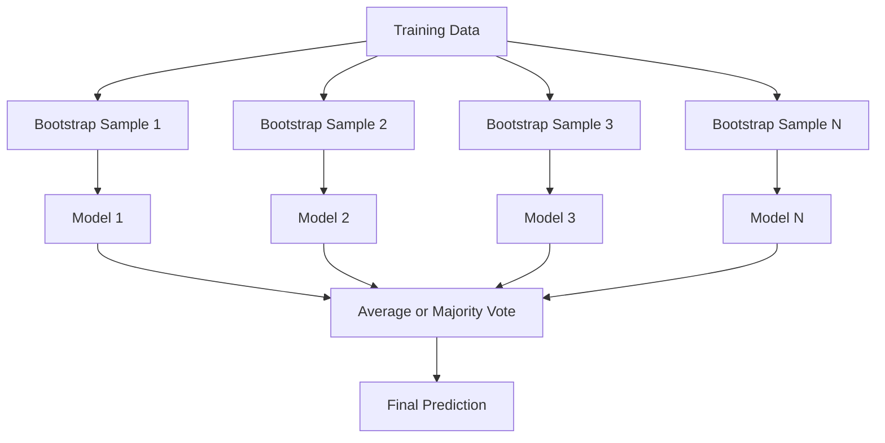
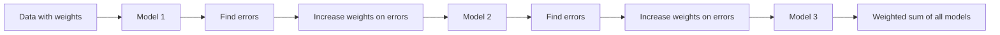
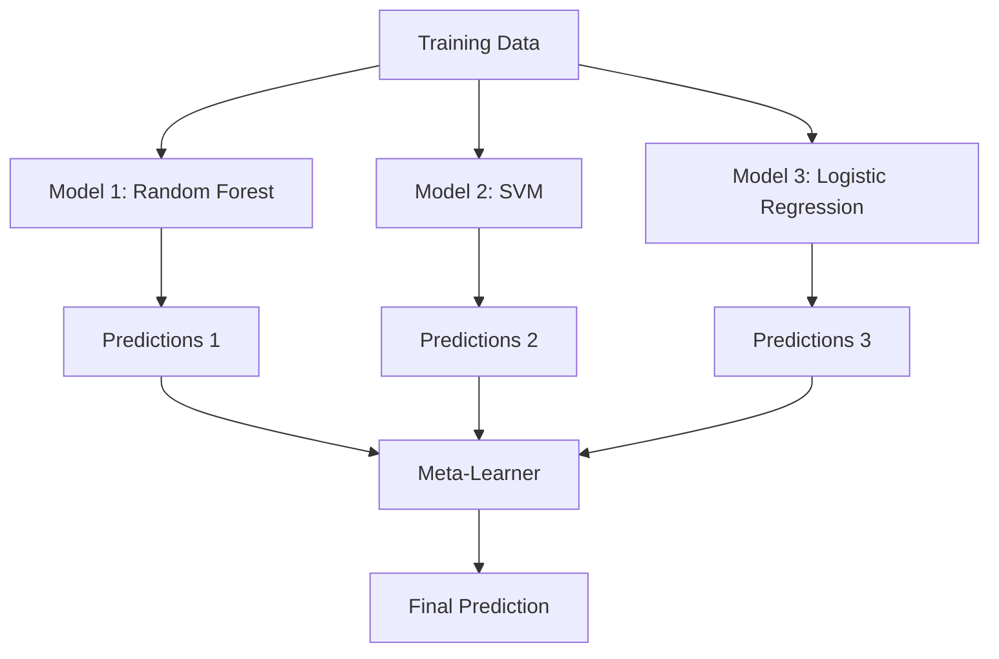

# روش های جمع آوری

> گروهی از دانش آموزان ضعیف، با ترکیب درست، تبدیل به دانش آموز قوی می شوند. این استعاره ای نیست. این یک نظریه است.

**Type:** Build
**Language:**پیتون
**Prerequisites:** Phase 2, Lesson 10 (Bias-Variance Tradeoff)
**Time:** ~120 minutes

## اهداف یادگیری

- پیاده سازی AdaBoost و gradient boosting از ابتدا و توضیح دهید که چگونه افزایش به صورت ترتیب کاهش تعصب
- ساخت یک مجموعه بسته بندی و نشان دادن اینکه چگونه متوسط مدل های غیر مرتبط با تفاوت را بدون افزایش تعصب کاهش می دهد
- مقایسه بسته بندی، تقویت و جمع بندی از نظر اینکه هر روش کدام از عناصر خطای را هدف قرار می دهد
- ارزیابی تنوع مجموعه و توضیح اینکه چرا دقت رای اکثریت با یادگیری ضعیف مستقل تر بهبود می یابد

## مشکل

یک درخت تصمیم گیری سریع برای آموزش و آسان برای تفسیر است، اما بیش از حد. یک مدل خطی واحد در مرز های پیچیده زیرنویسنده است. شما می توانید روزهای را صرف طراحی معماری مدل کامل کنید. یا می توانید مجموعه ای از مدل های نامکمل را ترکیب کنید و چیزی بهتر از هر یک از آنها را به طور جداگانه بدست آورید.

روش های جمع آوری دقیقاً این کار را انجام می دهند. آنها معتبر ترین تکنیک برای برنده شدن در رقابت های Kaggle بر اساس داده های جدول هستند، آنها بیشتر سیستم های تولید ML را تقویت می کنند و آنها تجارت تغییر تغییر در عمل را نشان می دهند. بسته بندی تغییر را کاهش می دهد. افزایش تغییر را کاهش می دهد. جمع آوری یاد می گیرد که به کدام مدل اعتماد کنیم.

## مفهوم

### چرا گروه ها کار می کنند

فرض کنید شما دارای N طبقه بندی مستقل هستید، هر کدام با دقت p > 0.5 هستند.

```
P(majority correct) = sum over k > N/2 of C(N,k) * p^k * (1-p)^(N-k)
```

برای 21 طبقه بندی کننده هر کدام با 60٪ دقت، دقت اکثریت رای حدود 74٪ است. با 101 طبقه بندی کننده، آن را به 84٪ افزایش می دهد.

شرط اصلی اینه**diversity**اگر همه مدل ها اشتباهات مشابهی داشته باشند، ترکیب آنها هیچ فایده ای ندارد. مجموعه ها کار می کنند زیرا از طریق:

- فرعی آموزش های مختلف (بازگیری)
- فرعیتی از ویژگی های مختلف (درست های تصادفی)
- اصلاح خطای دنباله دار (توسع)
- خانواده های مدل مختلف (پاک کردن)

### جمع آوری باگ (باگ)

بسته بندی با آموزش هر مدل در نمونه مختلف از داده های آموزش تنوع ایجاد می کند.



نمونه ی بوترپ با جایگزینی از داده های اصلی، همان اندازه ی اصلی، کشیده می شود. حدود 63.2٪ از نمونه های منحصر به فرد در هر بوترپ ظاهر می شوند. 36.8٪ باقی مانده (نمونه های خارج از کیسه) مجموعه ای از اعتبارنامه را رایگان می کنند.

بسته بندی تفاوت را بدون افزایش تعصب بسیار کاهش می دهد. هر درخت انفرادی به نمونه بوتسترپ خود اضافه می شود، اما اضافه شدن برای هر درخت متفاوت است، بنابراین متوسط کردن صدا را حذف می کند.

**Random Forests**در هر قسمت، فقط زیر مجموعه ای تصادفی از ویژگی ها در نظر گرفته می شود. این باعث تنوع بیشتر در بین درختان می شود. تعداد معمول ویژگی های کاندیدای این است که`sqrt(n_features)`برای طبقه بندی و`n_features / 3`برای بازگشت

### تقویت (صلاح خطای دنباله دار)

افزايش مدل قطار به صورت سلسليانه. هر مدل جديد بر نمونه هاي مدل هاي پيش رو تمرکز ميکنه



افزایش تعصب را کاهش می دهد. هر مدل جدید خطاهای سیستماتیک مجموعه را تا کنون اصلاح می کند. پیش بینی نهایی مجموعه وزن شده همه مدل ها است، جایی که مدل های بهتر وزن بیشتری دارند.

مبادله: افزایش می تواند اگر چند تا دور اجرا کنید بیش از حد مناسب باشد، زیرا این باعث می شود نمونه های سخت تر را متناسب کند، که برخی از آنها ممکن است صدای باشد.

### AdaBoost

AdaBoost (اعتماد افزایشی) اولین الگوریتم عملی تقویت بود. این با هر دانش آموز پایه، به طور معمول تصمیم گیری (درخت های عمق-1) کار می کند.

الگوریتم:

```
1. Initialize sample weights: w_i = 1/N for all i

2. For t = 1 to T:
   a. Train weak learner h_t on weighted data
   b. Compute weighted error:
      err_t = sum(w_i * I(h_t(x_i) != y_i)) / sum(w_i)
   c. Compute model weight:
      alpha_t = 0.5 * ln((1 - err_t) / err_t)
   d. Update sample weights:
      w_i = w_i * exp(-alpha_t * y_i * h_t(x_i))
   e. Normalize weights to sum to 1

3. Final prediction: H(x) = sign(sum(alpha_t * h_t(x)))
```

مدل هایی که خطا کمتری دارند، الفا بالاتر می شوند. نمونه های اشتباه طبقه بندی شده وزن بیشتری دارند، بنابراین مدل بعدی روی آنها تمرکز می کند.

### افزایش تدریجی

افزایش درجه به عملکردهای ضرر تعسفی افزایش می دهد. به جای وزن مجدد نمونه ها، هر مدل جدید را با باقیمانده ها (گرایدینت منفی از ضرر) مجموعه فعلی تطابق می دهد.

```
1. Initialize: F_0(x) = argmin_c sum(L(y_i, c))

2. For t = 1 to T:
   a. Compute pseudo-residuals:
      r_i = -dL(y_i, F_{t-1}(x_i)) / dF_{t-1}(x_i)
   b. Fit a tree h_t to the residuals r_i
   c. Find optimal step size:
      gamma_t = argmin_gamma sum(L(y_i, F_{t-1}(x_i) + gamma * h_t(x_i)))
   d. Update:
      F_t(x) = F_{t-1}(x) + learning_rate * gamma_t * h_t(x)

3. Final prediction: F_T(x)
```

برای خسارت خطای مربع، پسماند های مزخرف فقط باقی مانده های واقعی هستند: `r_i = y_i - F_{t-1}(x_i)`هر درخت به طور حرفي با اشتباهات گروه قبل مطابقت داره

نرخ یادگیری (قصر) کنترل می کند که هر درخت چقدر کمک می کند. نرخ یادگیری کوچکتر نیاز به درختان بیشتری دارد اما به طور کلی بهتر است. ارزش های معمول: 0.01 تا 0.3.

### XGBoost: چرا داده های تابلو را تسلط می دهد

XGBoost (eXtreme Gradient Boosting) افزایش گرادینتی با بهینه سازی های مهندسی است که آن را سریع، دقیق و مقاوم به بیش از حد مناسب می کند:

- **Regularized objective:**مجازات L1 و L2 در مورد وزن برگ ها مانع از اعتماد بیش از حد درختان فردی می شود
- **Second-order approximation:**از مشتقات اول و دوم خسارت استفاده می کند و تصمیمات تقسیم بهتر را می دهد
- **Sparsity-aware splits:**با یادگیری بهترین جهت برای داده های گمشده در هر تقسیم، با استفاده از یک روش بومی، با ارزش های گمشده برخورد می کند
- **Column subsampling:**مثل جنگل های تصادفی، نمونه ها در هر تقسیم برای تنوع
- **Weighted quantile sketch:**به طور موثر نقاط تقسیم برای ویژگی های مداوم در داده های توزیع شده را پیدا می کند
- **Cache-aware block structure:**طرح حافظه بهینه سازی شده برای خط های حافظه کش CPU

برای داده های جدول، XGBoost (و جانشین آن LightGBM) به طور مداوم از شبکه های عصبی بهتر است. این به زودی تغییر نمی کند. اگر داده های شما در یک جدول با ردیف ها و ستون ها قرار دارند، با افزایش گرادینت شروع کنید.

### جمع بندی (متاهپردیش)

استاکینگ از پیش بینی های مدل های پایه چندگانه به عنوان ویژگی های یک متاهل استفاده می کند.



متاهل می آموزد که کدام مدل پایه را برای کدام ورودی اعتماد کند. اگر جنگل تصادفی در مناطق خاصی و SVM در مناطق دیگر بهتر باشد، متاهل می آموزد که به طور متناسب مسیر را یاد بگیرد.

برای جلوگیری از انتشار داده ها، پیش بینی های مدل پایه باید از طریق اعتبارسنجی در مجموعه آموزشی تولید شود. شما هرگز مدل های پایه را آموزش نمی دهید و ویژگی های متا را بر اساس همان داده ها تولید نمی کنید.

### رای دادن

ساده ترين مجموعه، فقط پيش بيني ها رو به طور مستقیم ترکیب کن

- **Hard voting:**اکثریت در مورد برچسب های کلاس رای می دهند.
- **Soft voting:**احتمالات پیش بینی شده متوسط، کلاس با احتمال متوسط بالاتر را انتخاب کنید. معمولا بهتر است چون از اطلاعات اعتماد استفاده می کند.

```figure
f3-ensemble-average
```

## آن را بسازید

### مرحله اول: تصمیم گیری (تعلم آموز پایه)

کد در`code/ensembles.py`با یک درخت با یک شکاف شروع می کنیم.

```python
class DecisionStump:
    def __init__(self):
        self.feature_idx = None
        self.threshold = None
        self.polarity = 1
        self.alpha = None

    def fit(self, X, y, weights):
        n_samples, n_features = X.shape
        best_error = float("inf")

        for f in range(n_features):
            thresholds = np.unique(X[:, f])
            for thresh in thresholds:
                for polarity in [1, -1]:
                    pred = np.ones(n_samples)
                    pred[polarity * X[:, f] < polarity * thresh] = -1
                    error = np.sum(weights[pred != y])
                    if error < best_error:
                        best_error = error
                        self.feature_idx = f
                        self.threshold = thresh
                        self.polarity = polarity

    def predict(self, X):
        n = X.shape[0]
        pred = np.ones(n)
        idx = self.polarity * X[:, self.feature_idx] < self.polarity * self.threshold
        pred[idx] = -1
        return pred
```

### مرحله دوم: AdaBoost از ابتدا

```python
class AdaBoostScratch:
    def __init__(self, n_estimators=50):
        self.n_estimators = n_estimators
        self.stumps = []
        self.alphas = []

    def fit(self, X, y):
        n = X.shape[0]
        weights = np.full(n, 1 / n)

        for _ in range(self.n_estimators):
            stump = DecisionStump()
            stump.fit(X, y, weights)
            pred = stump.predict(X)

            err = np.sum(weights[pred != y])
            err = np.clip(err, 1e-10, 1 - 1e-10)

            alpha = 0.5 * np.log((1 - err) / err)
            weights *= np.exp(-alpha * y * pred)
            weights /= weights.sum()

            stump.alpha = alpha
            self.stumps.append(stump)
            self.alphas.append(alpha)

    def predict(self, X):
        total = sum(a * s.predict(X) for a, s in zip(self.alphas, self.stumps))
        return np.sign(total)
```

### مرحله سوم: افزایش تدریجی از ابتدا

```python
class GradientBoostingScratch:
    def __init__(self, n_estimators=100, learning_rate=0.1, max_depth=3):
        self.n_estimators = n_estimators
        self.lr = learning_rate
        self.max_depth = max_depth
        self.trees = []
        self.initial_pred = None

    def fit(self, X, y):
        self.initial_pred = np.mean(y)
        current_pred = np.full(len(y), self.initial_pred)

        for _ in range(self.n_estimators):
            residuals = y - current_pred
            tree = SimpleRegressionTree(max_depth=self.max_depth)
            tree.fit(X, residuals)
            update = tree.predict(X)
            current_pred += self.lr * update
            self.trees.append(tree)

    def predict(self, X):
        pred = np.full(X.shape[0], self.initial_pred)
        for tree in self.trees:
            pred += self.lr * tree.predict(X)
        return pred
```

### مرحله 4: مقایسه با sklearn

این کد تایید می کند که اجرای ما از ابتدا دقت مشابهی به اسکلارن را تولید می کند`AdaBoostClassifier`و`GradientBoostingClassifier`، و تمام روش ها را کنار هم مقایسه می کند.

## ازش استفاده کن

### چه زمانی باید از هر روش استفاده کنیم

| Method | Reduces | Best for | Watch out for |
|--------|---------|----------|---------------|
| Bagging / Random Forest | Variance | Noisy data, many features | Does not help with bias |
| AdaBoost | Bias | Clean data, simple base learners | Sensitive to outliers and noise |
| Gradient Boosting | Bias | Tabular data, competitions | Slow to train, easy to overfit without tuning |
| XGBoost / LightGBM | Both | Production tabular ML | Many hyperparameters |
| Stacking | Both | Getting last 1-2% accuracy | Complex, risk of overfitting meta-learner |
| Voting | Variance | Quick combination of diverse models | Only helps if models are diverse |

### ستک تولید برای داده های جدول

برای اکثر مشکلات پیش بینی جدول، این ترتیب برای امتحان است:

1. **LightGBM or XGBoost**با پارامترهای پیش فرض
2. تنظیم n_estimators, learning_rate, max_depth, min_child_weight
3. اگه به 0.5 درصد آخر نیاز داشتین، مجموعه ای از 3-5 مدل مختلف بسازید
4. استفاده از اعتبارسنجی در تمام زمان ها

شبکه های عصبی در داده های جدول تقریباً همیشه بدتر از افزایش گرادینت هستند، علی رغم تلاش های تحقیقاتی مداوم. TabNet، NODE و معماری های مشابه گاهی اوقات مطابقت دارند اما به ندرت از یک XGBoost خوب مطابقت دارند.

## -باده

این درس به ما کمک می کند`outputs/prompt-ensemble-selector.md`-- یک پیامک که به شما کمک می کند روش صحیح مجموعه را برای یک مجموعه داده داده ها انتخاب کنید. اطلاعات خود را (حجم، انواع ویژگی ها، سطح سر و صدا، تعادل کلاس) و مشکل حل شده را توصیف کنید. پیامک از طریق یک لیست چک تصمیم گیری عبور می کند، یک روش را توصیه می کند، پیشنهاد می کند که پارامترهای فوق العاده را شروع کنید و در مورد اشتباهات رایج برای این روش هشدار می دهد. همچنین تولید می کند `outputs/skill-ensemble-builder.md`با راهنماي انتخاب کامل

## تمرینات

1. تعدیل پیاده سازی AdaBoost برای ردیابی دقت آموزش پس از هر دور. دقت نقشه مقابل تعداد تخمین دهندگان. چه زمانی آن را به هم می پیوندد؟

2. یک جنگل تصادفی را از ابتدا پیاده سازی کنید با اضافه کردن ویژگی تصادفی نمونه گیری به درخت بازپسین. 100 درخت را با `max_features=sqrt(n_features)`و پیش بینی های متوسط. کاهش تفاوت را با یک درخت مقایسه کنید.

3. در پیاده سازی افزایش گرادینت، توقف اولیه را اضافه کنید: پس از هر دور از دست دادن اعتبار را دنبال کنید و وقتی که برای 10 دور متوالی بهبود نیافته است متوقف شوید.

4. یک مجموعه ی جمع بندی با سه مدل پایه (رجع منطقی، درخت تصمیم، k نزدیک ترین همسایه ها) و یک متامیدان رجع منطقی بسازید. برای تولید متاهمهای متاز ۵ برابر استفاده کنید. با هر مدل پایه به تنهایی مقایسه کنید.

5. XGBoost را با همان مجموعه داده با پارامترهای پیش فرض اجرا کنید. دقت آن را با افزایش گرادینت از ابتدا مقایسه کنید. زمان هر دو. تفاوت سرعت چقدر بزرگ است؟

## اصطلاحات کلیدی

| Term | What people say | What it actually means |
|------|----------------|----------------------|
| Bagging | "Train on random subsets" | Bootstrap aggregating: train models on bootstrap samples, average predictions to reduce variance |
| Boosting | "Focus on hard examples" | Train models sequentially, each correcting errors of the ensemble so far, to reduce bias |
| AdaBoost | "Reweight the data" | Boosting via sample weight updates; misclassified points get higher weight for the next learner |
| Gradient boosting | "Fit the residuals" | Boosting via fitting each new model to the negative gradient of the loss function |
| XGBoost | "The Kaggle weapon" | Gradient boosting with regularization, second-order optimization, and systems-level speed tricks |
| Stacking | "Models on top of models" | Use predictions of base models as input features for a meta-learner |
| Random forest | "Many randomized trees" | Bagging with decision trees, adding random feature subsampling at each split for diversity |
| Ensemble diversity | "Make different mistakes" | Models must be uncorrelated in their errors for the ensemble to improve over individuals |
| Out-of-bag error | "Free validation" | Samples not in a bootstrap draw (~36.8%) serve as a validation set without needing a holdout |

## خواندن بیشتر

- [Schapire & Freund: Boosting: Foundations and Algorithms](https://mitpress.mit.edu/9780262526036/)-- کتاب سازان AdaBoost
- [Friedman: Greedy Function Approximation: A Gradient Boosting Machine (2001)](https://doi.org/10.1214/aos/1013203451)-- کاغذ افزایش گرادینت اصلی
- [Chen & Guestrin: XGBoost (2016)](https://arxiv.org/abs/1603.02754)-- کاغذ XGBoost
- [Wolpert: Stacked Generalization (1992)](https://www.sciencedirect.com/science/article/abs/pii/S0893608005800231)-- کاغذ اصلی جمع بندی
- [scikit-learn Ensemble Methods](https://scikit-learn.org/stable/modules/ensemble.html)-- مرجع عملی
