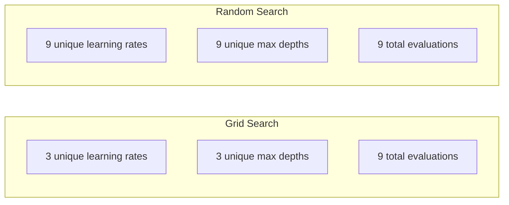
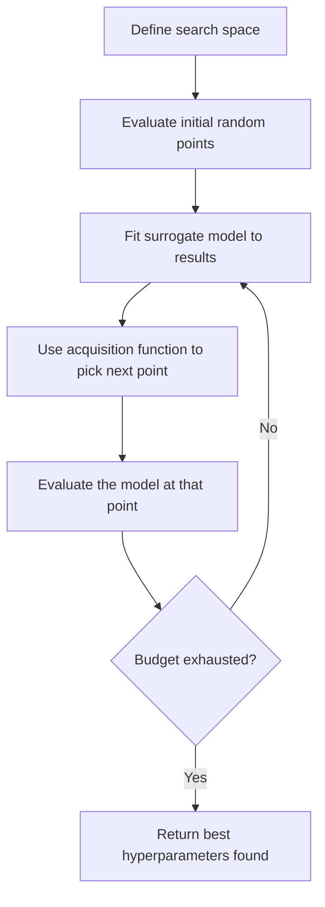
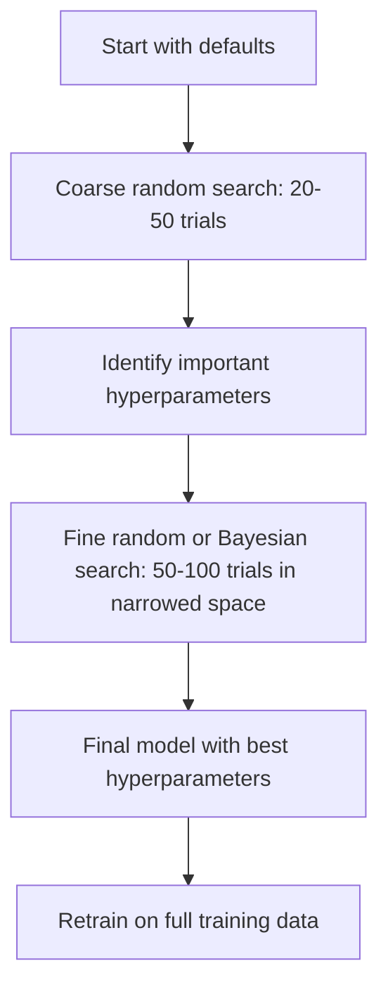
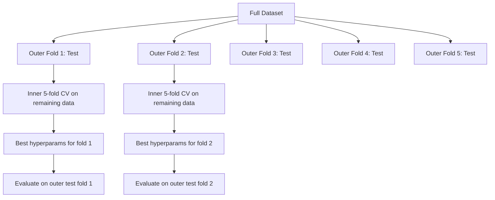

# تنظیم های هیپر پارامتر

> هائپر پارامترها، دستبندهایی هستند که قبل از شروع تمرین می کنید.

**Type:** Build
**Language:**پیتون
**Prerequisites:** Phase 2, Lesson 11 (Ensemble Methods)
**Time:** ~90 minutes

## اهداف یادگیری

- جستجوی شبکه، جستجوی تصادفی و بهینه سازی بیزیانی را از ابتدا اجرا کنید و بهره وری نمونه آنها را مقایسه کنید
- توضیح دهید که چرا جستجوی تصادفی از جستجوی شبکه بهتر است در حالی که اکثر پارامترهای هیپرامیتر دارای ابعاد موثر کم هستند
- ایجاد یک حلقه بهینه سازی بیزی با استفاده از یک مدل جایگزین و تابع جذب برای هدایت جستجو
- طراحی یک استراتژی تنظیم فرعی که از طریق اعتبارسنجی مناسب از طریق اعتبارسنجی متقابل از بیش از حد جلوگیری کند

## مشکل

مدل افزایش گرادینت شما دارای نرخ یادگیری، تعداد درختان، عمق حداکثر، نمونه های حداقل در هر برگ، نسبت نمونه های زیر و نسبت نمونه های ستون است. این شش هیپر پارامتر است. اگر هر یک از آنها دارای 5 مقدار منطقی است، شبکه دارای 5^6 = 15,625 ترکیب است. آموزش هر یک 10 ثانیه است. این 43 ساعت محاسبه برای امتحان همه آنها است.

جستجوی شبکه روشی آشکار و بدترین در مقیاس است. جستجوی تصادفی با کمترین محاسبات بهتر است. بهینه سازی بیزیانی با یادگیری از ارزیابی های گذشته حتی بهتر است. دانستن اینکه کدام استراتژی را استفاده کنید و کدام پارامترهای هیپرامتر واقعا مهم هستند، روزهای تلف شده زمان GPU را صرفه جویی می کند.

## مفهوم

### پارامتر ها در مقابل پارامتر های بالا

پارامترها در طول آموزش آموخته می شوند (وزن، تعصب، آستانه های تقسیم) پارامترهای فوق العاده قبل از شروع آموزش تنظیم می شوند و نحوه یادگیری را کنترل می کنند.

| Hyperparameter | What it controls | Typical range |
|---------------|-----------------|---------------|
| Learning rate | Step size per update | 0.001 to 1.0 |
| Number of trees/epochs | How long to train | 10 to 10,000 |
| Max depth | Model complexity | 1 to 30 |
| Regularization (lambda) | Overfitting prevention | 0.0001 to 100 |
| Batch size | Gradient estimation noise | 16 to 512 |
| Dropout rate | Fraction of neurons dropped | 0.0 to 0.5 |

### جستجو در شبکه

جستجوی شبکه هر ترکیب از ارزش های مشخص شده را ارزیابی می کند. این کامل و آسان برای درک است، اما با تعداد پارامترهای هیپرمتری به طور نمایی مقیاس می گیرد.

```
Grid for 2 hyperparameters:

  learning_rate: [0.01, 0.1, 1.0]
  max_depth:     [3, 5, 7]

  Evaluations: 3 x 3 = 9 combinations

  (0.01, 3)  (0.01, 5)  (0.01, 7)
  (0.1,  3)  (0.1,  5)  (0.1,  7)
  (1.0,  3)  (1.0,  5)  (1.0,  7)
```

جستجوی شبکه یک نقص اساسی دارد: اگر یک پارامتر فوق العاده مهم باشد و دیگری نباشد، اکثر ارزیابی ها ضایع می شوند. شما فقط 3 مقدار منحصر به فرد پارامتر مهم را از 9 ارزیابی می گیرید.

### جستجوی تصادفی

نمونه های تصادفی از هائپر پارامترهای توزیع به جای شبکه جستجو می کنند. با بودجه مشابه 9 ارزیابی، شما 9 ارزش منحصر به فرد هر هائپر پارامتر را دریافت می کنید.



چرا تصادفی از شبکه می ترسیم (Bergstra & Bengio، 2012):

- اکثر هیپر پارامترها دارای ابعاد موثر کم هستند. تنها 1-2 از 6 هیپر پارامتر معمولا برای یک مشکل خاص مهم هستند.
- ارزیابی های زباله های جستجو در شبکه در ابعاد غیر مهم.
- جستجوی تصادفی ابعاد مهم را برای بودجه مشابه به شدت پوشش می دهد.
- در 60 آزمایش تصادفی، شما شانس 95٪ برای پیدا کردن یک نقطه در حدود 5٪ از بهینه (اگر یکی در فضای جستجو وجود دارد) دارید.

### بهینه سازی بیزی

جستجوی تصادفی نتایج را نادیده می گیرد. این مطالعه نمی آموزد که نرخ یادگیری بالا باعث انحراف می شود یا عمق 3 به طور مداوم عمق 10 را از دست می دهد. بهینه سازی بیزیایی از ارزیابی های گذشته برای تصمیم گیری در مورد جایی که باید دنبال کنید استفاده می کند.



دو بخش اصلی:

**Surrogate model:**یک مدل ارزان قیمت برای ارزیابی (معمولا یک فرآیند گاس) که عملکرد هدف گران قیمت را نزدیک می کند. این هم پیش بینی و هم تخمین عدم اطمینان را در هر نقطه در فضای جستجو ارائه می دهد.

**Acquisition function:**تصمیم می گیرد که در کجا ارزیابی شود با تعادل بهره برداری (بحث در نزدیکی نقاط خوب شناخته شده) و اکتشاف (بحث در جایی که عدم اطمینان زیاد است) انتخاب های مشترک:

- **Expected Improvement (EI):**تا چه اندازه بهتر از بهترین ها در حال حاضر انتظار داریم؟
- **Upper Confidence Bound (UCB):**پیش بینی و چند برابر عدم قطعیت، UCB بالاتر به معنی امیدوار کننده یا کشف نشده است.
- **Probability of Improvement (PI):**احتمال این نقطه از بهترین نقطه فعلی چیست؟

بهینه سازی بیزیان معمولاً از جستجوی تصادفی با 2-5 برابر کمتر ارزیابی، پارامترهای بهتری را پیدا می کند. هزینه های بالای سازگاری مدل جایگزین در مقایسه با آموزش مدل واقعی نادیده گرفته می شود.

### توقف زودرس

هر تمرین باید تمام نشود. اگر یک پیکربندی بعد از 10 دوره به وضوح بد باشد، آن را متوقف کنید و به جلو بروید. این توقف زودرس در زمینه جستجوی هیپر پارامتر است.

استراتژی ها:
- **Patience-based:**توقف اگر از دست دادن اعتبار برای دوره های N متوالی بهبود نیافته باشد
- **Median pruning:**اگر نتیجه میانگین آزمایش بدتر از میانگین آزمایش های تکمیل شده در همان مرحله باشد متوقف کنید
- **Hyperband:**بودجه های کوچک را به بسیاری از پیکربندی ها اختصاص دهید، سپس بودجه های بهترین را به تدریج افزایش دهید

هیپر باند به ویژه موثر است. این 81 پیکربندی را با هر یک از یک دوره آغاز می کند، سومین قسمت را حفظ می کند، به آنها 3 دوره می دهد، سومین قسمت را حفظ می کند و غیره. این پیکربندی های خوب را 10-50 برابر سریعتر از ارزیابی تمام پیکربندی ها برای بودجه کامل پیدا می کند.

### برنامه ریزی نرخ یادگیری

سرعت یادگیری تقریبا همیشه مهمترین پارامتر است. به جای نگه داشتن آن ثابت، برنامه نویس ها آن را در طول آموزش تنظیم می کنند.

| Scheduler | Formula | When to use |
|-----------|---------|-------------|
| Step decay | Multiply by 0.1 every N epochs | Classic CNN training |
| Cosine annealing | lr * 0.5 * (1 + cos(pi * t / T)) | Modern default |
| Warmup + decay | Linear increase then cosine decay | Transformers |
| One-cycle | Increase then decrease over one cycle | Fast convergence |
| Reduce on plateau | Reduce by factor when metric stalls | Safe default |

### اهمیت هیپر پارامتر

همه پارامترهای هیپرامیتر به طور یکسان اهمیت ندارند. تحقیقات در جنگل های تصادفی (Probst و همکاران، 2019) و افزایش گرادینت الگوهای سازگار را نشان می دهد:

**High importance:**
- میزان یادگیری (همیشه اول تنظیم کنید)
- تعداد تخمین ها / دوره ها (به جای تنظیم کردن از توقف زودرس استفاده کنید)
- قدرت تنظیم

**Medium importance:**
- حداکثر عمق / تعداد لایه ها
- حداقل نمونه ها در هر برگ / کاهش وزن
- نسبت نمونه فرعی

**Low importance:**
- ویژگی های حداکثر (برای جنگل های تصادفی)
- انتخاب عملکرد فعال سازی خاص
- اندازه دسته (در محدوده مناسب)

اول اوناي مهم رو تنظیم کن، بقیه رو به حالت پیش فرض بذار

### استراتژی عملی



جریان کار بتن:

1. **Start with library defaults.**آنها توسط تمرین کنندگان با تجربه انتخاب می شوند و اغلب 80 درصد از راه را به آنجا می برند.
2. **Coarse random search.**فاصله هاي گسترده، آزمايش هاي 20 تا 50 با توقف زودي براي تيراندازي سريع
3. **Analyze results.**کدام پارامترهای فوق العاده با عملکرد مرتبط هستند؟ فضای جستجو را محدود کنید.
4. **Fine search.**بهینه سازی بیزیایی یا جستجوی تصادفی متمرکز در فضای تنگ. 50-100 آزمایش.
5. **Retrain on all training data**با بهترین پارامترهای موجود

### یکپارچه سازی اعتبارسنجی

تنظیم هائپر پارامتر ها در یک تقسیم اعتبار واحد خطرناک است. بهترین هائپر پارامتر ها ممکن است به فولدهای اعتبار خاص اضافه شوند. اعتبارسنجی متقاطع مستقر با استفاده از دو حلقه حل می کند:

- **Outer loop**(مقياس): داده ها را به قطار+ال و آزمون تقسیم می کند.
- **Inner loop**(تنظیم): train+val را به train و val تقسیم می کند. بهترین پارامترهای هیپرامیتر را پیدا می کند.



هر طناب بیرونی بهترین پارامترهای خود را به طور مستقل پیدا می کند. نمرات خارجی یک تخمین غیر جانبدار از عملکرد عمومی سازی است.

با اسکلارن:

```python
from sklearn.model_selection import cross_val_score, GridSearchCV
from sklearn.ensemble import GradientBoostingRegressor

inner_cv = GridSearchCV(
    GradientBoostingRegressor(),
    param_grid={
        "learning_rate": [0.01, 0.05, 0.1],
        "max_depth": [2, 3, 5],
        "n_estimators": [50, 100, 200],
    },
    cv=5,
    scoring="neg_mean_squared_error",
)

outer_scores = cross_val_score(
    inner_cv, X, y, cv=5, scoring="neg_mean_squared_error"
)

print(f"Nested CV MSE: {-outer_scores.mean():.4f} +/- {outer_scores.std():.4f}")
```

این هزینه بسیار بالا است (5 طایفه بیرونی x 5 طایفه داخلی x 27 نقطه شبکه = 675 نقطه شبکه مناسب مدل) ، اما به شما یک تخمین عملکرد قابل اعتماد می دهد. از آن هنگام گزارش نتایج نهایی در مقالات یا زمانی که شرط تصمیم گیری بالا است استفاده کنید.

### نکات عملی

**Start with the learning rate.**این همیشه مهمترین هیپر پارامتر برای روش های مبتنی بر گرادیانت است. نرخ یادگیری بد باعث می شود همه چیز غیر مرتبط باشد. سایر هیپر پارامتر ها را در حالت پیش فرض تنظیم کنید و درجه یادگیری را ابتدا پاک کنید.

**Use log-uniform distributions for learning rate and regularization.**تفاوت بین 0.001 و 0.01 به اندازه تفاوت بین 0.1 و 1.0 مهم است.

**Use early stopping instead of tuning n_estimators.**برای تقویت و شبکه های عصبی، n_estimators یا epochs را بالا بگذارید و اجازه دهید توقف زودرس تصمیم بگیرد که چه زمانی متوقف شود. این یک هیپر پارامتر را از جستجو حذف می کند.

**Budget allocation.**۶۰ درصد بودجه تدوین خود را برای دو مهم ترین هیپر پارامتر خرج کنید. ۴۰ درصد باقیمانده را برای همه چیز خرج کنید. ۲ مورد اصلی بیشترین تغییرات عملکرد را تشکیل می دهند.

**Scale matters.**هرگز اندازه دسته را بر روی مقیاس ثبت نام جستجو نکنید (16, 32, 64 خوب است). همیشه در مقیاس ثبت نام نرخ یادگیری را جستجو کنید. توزیع جستجو را با چگونگی تأثیر هیپر پارامتر بر مدل مقایسه کنید.

| Model Type | Top Hyperparameters | Recommended Search | Budget |
|-----------|--------------------|--------------------|--------|
| Random Forest | n_estimators, max_depth, min_samples_leaf | Random search, 50 trials | Low (fast training) |
| Gradient Boosting | learning_rate, n_estimators, max_depth | Bayesian, 100 trials + early stopping | Medium |
| Neural Network | learning_rate, weight_decay, batch_size | Bayesian or random, 100+ trials | High (slow training) |
| SVM | C, gamma (RBF kernel) | Grid on log scale, 25-50 trials | Low (2 params) |
| Lasso/Ridge | alpha | 1D search on log scale, 20 trials | Very low |
| XGBoost | learning_rate, max_depth, subsample, colsample | Bayesian, 100-200 trials + early stopping | Medium |

**When in doubt:**جستجوی تصادفی با 2x تعداد هیپر پارامترها به عنوان آزمایش (به عنوان مثال، 6 هیپر پارامتر = حداقل 12 آزمایش) شما شگفت زده خواهید شد که چگونه اغلب جستجوی تصادفی با 50 آزمایش از جستجوی شبکه طراحی شده با دقت بهتر است.

```figure
k-fold-cv
```

## آن را بسازید

### مرحله اول: جستجو از ابتدا

کد در`code/tuning.py`جستجو در شبکه، جستجو تصادفی و یک بهینه سازی ساده بیزیایی را از ابتدا اجرا می کند.

```python
def grid_search(model_fn, param_grid, X_train, y_train, X_val, y_val):
    keys = list(param_grid.keys())
    values = list(param_grid.values())
    best_score = -float("inf")
    best_params = None
    n_evals = 0

    for combo in itertools.product(*values):
        params = dict(zip(keys, combo))
        model = model_fn(**params)
        model.fit(X_train, y_train)
        score = evaluate(model, X_val, y_val)
        n_evals += 1

        if score > best_score:
            best_score = score
            best_params = params

    return best_params, best_score, n_evals
```

### مرحله دوم: جستجوی تصادفی از ابتدا

```python
def random_search(model_fn, param_distributions, X_train, y_train,
                  X_val, y_val, n_iter=50, seed=42):
    rng = np.random.RandomState(seed)
    best_score = -float("inf")
    best_params = None

    for _ in range(n_iter):
        params = {k: sample(v, rng) for k, v in param_distributions.items()}
        model = model_fn(**params)
        model.fit(X_train, y_train)
        score = evaluate(model, X_val, y_val)

        if score > best_score:
            best_score = score
            best_params = params

    return best_params, best_score, n_iter
```

### مرحله سوم: بهینه سازی بیزی (بایدر)

ایده اصلی: یک فرآیند گوسسی را به جفت های مشاهده شده (هایپر پارامتر، امتیاز) متناسب کنید، سپس از یک تابع اکسیژن برای تصمیم گیری در مورد اینکه کجا دنبال کنید استفاده کنید.

```python
class SimpleBayesianOptimizer:
    def __init__(self, search_space, n_initial=5):
        self.search_space = search_space
        self.n_initial = n_initial
        self.X_observed = []
        self.y_observed = []

    def _kernel(self, x1, x2, length_scale=1.0):
        dists = np.sum((x1[:, None, :] - x2[None, :, :]) ** 2, axis=2)
        return np.exp(-0.5 * dists / length_scale ** 2)

    def _fit_gp(self, X_new):
        X_obs = np.array(self.X_observed)
        y_obs = np.array(self.y_observed)
        y_mean = y_obs.mean()
        y_centered = y_obs - y_mean

        K = self._kernel(X_obs, X_obs) + 1e-4 * np.eye(len(X_obs))
        K_star = self._kernel(X_new, X_obs)

        L = np.linalg.cholesky(K)
        alpha = np.linalg.solve(L.T, np.linalg.solve(L, y_centered))
        mu = K_star @ alpha + y_mean

        v = np.linalg.solve(L, K_star.T)
        var = 1.0 - np.sum(v ** 2, axis=0)
        var = np.maximum(var, 1e-6)

        return mu, var

    def _expected_improvement(self, mu, var, best_y):
        sigma = np.sqrt(var)
        z = (mu - best_y) / (sigma + 1e-10)
        ei = sigma * (z * norm_cdf(z) + norm_pdf(z))
        return ei

    def suggest(self):
        if len(self.X_observed) < self.n_initial:
            return sample_random(self.search_space)

        candidates = [sample_random(self.search_space) for _ in range(500)]
        X_cand = np.array([to_vector(c) for c in candidates])
        mu, var = self._fit_gp(X_cand)
        ei = self._expected_improvement(mu, var, max(self.y_observed))
        return candidates[np.argmax(ei)]

    def observe(self, params, score):
        self.X_observed.append(to_vector(params))
        self.y_observed.append(score)
```

GP جایگزین دو چیز را در هر نقطه کاندید می دهد: یک نمره پیش بینی شده (mu) و یک عدم اطمینان (var). انتظار بهبود این موارد را متعادل می کند: آن را ترجیح می دهد نقاطی که مدل نمره های بالا را پیش بینی می کند یا جایی که عدم اطمینان بالا است. در ابتدا، اکثر نقاط عدم اطمینان بالایی دارند بنابراین بهینه کننده کشف می کند. بعداً، بر پر امید ترین منطقه تمرکز می کند.

### مرحله چهارم: تمام روش ها را مقایسه کنید

تمام سه روش را بر روی یک هدف مصنوعی اجرا کنید و مقایسه کنید. این مقایسه با استفاده از یک بسته ساده که هر بهینه سازی کننده را با یک عملکرد هدف مستقیم (هیچ آموزش مدل) فرا می خواند، بنابراین API از پیاده سازی های مبتنی بر مدل بالا متفاوت است:

```python
def synthetic_objective(params):
    lr = params["learning_rate"]
    depth = params["max_depth"]
    return -(np.log10(lr) + 2) ** 2 - (depth - 4) ** 2 + 10

param_grid = {
    "learning_rate": [0.001, 0.01, 0.1, 1.0],
    "max_depth": [2, 3, 4, 5, 6, 7, 8],
}

grid_best = None
grid_score = -float("inf")
grid_history = []
for combo in itertools.product(*param_grid.values()):
    params = dict(zip(param_grid.keys(), combo))
    score = synthetic_objective(params)
    grid_history.append((params, score))
    if score > grid_score:
        grid_score = score
        grid_best = params

param_dist = {
    "learning_rate": ("log_float", 0.001, 1.0),
    "max_depth": ("int", 2, 8),
}

rand_best = None
rand_score = -float("inf")
rand_history = []
rng = np.random.RandomState(42)
for _ in range(28):
    params = {k: sample(v, rng) for k, v in param_dist.items()}
    score = synthetic_objective(params)
    rand_history.append((params, score))
    if score > rand_score:
        rand_score = score
        rand_best = params

optimizer = SimpleBayesianOptimizer(param_dist, n_initial=5)
bayes_history = []
for _ in range(28):
    params = optimizer.suggest()
    score = synthetic_objective(params)
    optimizer.observe(params, score)
    bayes_history.append((params, score))
bayes_score = max(s for _, s in bayes_history)

print(f"{'Method':<20} {'Best Score':>12} {'Evaluations':>12}")
print("-" * 50)
print(f"{'Grid Search':<20} {grid_score:>12.4f} {len(grid_history):>12}")
print(f"{'Random Search':<20} {rand_score:>12.4f} {len(rand_history):>12}")
print(f"{'Bayesian Opt':<20} {bayes_score:>12.4f} {len(bayes_history):>12}")
```

با همان بودجه، بهینه سازی بیزی معمولا بهترین امتیاز را سریع تر پیدا می کند زیرا ارزیابی ها را در مناطق بدی به طور واضح ضایع نمی کند. جستجوی تصادفی زمین بیشتری را از جستجوی شبکه پوشش می دهد. جستجوی شبکه تنها زمانی برنده می شود که شما دارای چند پارامتر های بسیار کم و می توانید هزینه کامل را داشته باشید.

## ازش استفاده کن

### اوپتون در عمل

Optuna کتابخانه توصیه شده برای تنظیم های جدی هیپر پارامتر است. این پشتیبانی از برش، جستجو توزیع شده و تصویربرداری از جعبه.

```python
import optuna

def objective(trial):
    lr = trial.suggest_float("learning_rate", 1e-4, 1e-1, log=True)
    n_est = trial.suggest_int("n_estimators", 50, 500)
    max_depth = trial.suggest_int("max_depth", 2, 10)

    model = GradientBoostingRegressor(
        learning_rate=lr,
        n_estimators=n_est,
        max_depth=max_depth,
    )
    model.fit(X_train, y_train)
    return mean_squared_error(y_val, model.predict(X_val))

study = optuna.create_study(direction="minimize")
study.optimize(objective, n_trials=100)

print(f"Best params: {study.best_params}")
print(f"Best MSE: {study.best_value:.4f}")
```

ویژگی های کلیدی Optuna:
- `suggest_float(..., log=True)`برای پارامتر هایی که بهترین جستجو در مقیاس ثبت شده است (درآمدی یادگیری، تنظیم)
- `suggest_int`برای پارامترهای عدد کامل
- `suggest_categorical`برای انتخاب های متمایز
- مدینپرونر داخلی برای توقف زودرس آزمایشات بد
- `study.trials_dataframe()`برای تجزیه و تحلیل

### اوپتون با برش

کشتن آزمایشات بی امید را زودتر متوقف می کند و باعث می شود که محاسبه ی عظیم را حفظ کند.

```python
import optuna
from sklearn.model_selection import cross_val_score

def objective(trial):
    params = {
        "learning_rate": trial.suggest_float("lr", 1e-4, 0.5, log=True),
        "max_depth": trial.suggest_int("max_depth", 2, 10),
        "n_estimators": trial.suggest_int("n_estimators", 50, 500),
        "subsample": trial.suggest_float("subsample", 0.5, 1.0),
    }

    model = GradientBoostingRegressor(**params)
    scores = cross_val_score(model, X_train, y_train, cv=3,
                             scoring="neg_mean_squared_error")
    mean_score = -scores.mean()

    trial.report(mean_score, step=0)
    if trial.should_prune():
        raise optuna.TrialPruned()

    return mean_score

pruner = optuna.pruners.MedianPruner(n_startup_trials=10, n_warmup_steps=5)
study = optuna.create_study(direction="minimize", pruner=pruner)
study.optimize(objective, n_trials=200)
```

.`MedianPruner`در حال حاضر، در حال انجام آزمایش، اگر ارزش میانگین آن از میانگین تمام آزمایش های انجام شده در همان مرحله بدتر باشد، آزمایش را متوقف می کند.`trial.report()`گزارش متریک های میانگین و`trial.should_prune()`برای بررسی اینکه آیا باید محاکمه متوقف شود.`n_startup_trials=10`حداقل 10 آزمایش قبل از شروع برش کامل را تضمین می کند. این معمولا 40 تا 60 درصد از کل محاسبه را صرفه جویی می کند.

### تونر هاي ساختگي sklearn

برای آزمایش های سریع، sklearn ارائه می دهد`GridSearchCV`،`RandomizedSearchCV`و`HalvingRandomSearchCV`:

```python
from sklearn.model_selection import RandomizedSearchCV
from scipy.stats import loguniform, randint

param_dist = {
    "learning_rate": loguniform(1e-4, 0.5),
    "max_depth": randint(2, 10),
    "n_estimators": randint(50, 500),
}

search = RandomizedSearchCV(
    GradientBoostingRegressor(),
    param_dist,
    n_iter=100,
    cv=5,
    scoring="neg_mean_squared_error",
    random_state=42,
    n_jobs=-1,
)
search.fit(X_train, y_train)
print(f"Best params: {search.best_params_}")
print(f"Best CV MSE: {-search.best_score_:.4f}")
```

استفاده کنید`loguniform`از آموزش برای سرعت یادگیری و تنظیم مجدد استفاده کنید`randint`برای هیپر پارامترهای عدد کامل.`n_jobs=-1`پرچم در تمام هسته های پردازنده متوازنه است.

### اشتباهات رایج در تنظیم های هائپر پارامتر

**Data leakage through preprocessing.**اگر قبل از اعتبارسنجی، یک مقیاسگر را در مجموعه داده های کامل قرار دهید، اطلاعات از فولد اعتبارسنجی به آموزش نفوذ می کند.`Pipeline`پس فقط در قاب تمرین مناسب است.

**Overfitting to the validation set.**اجرای هزاران آزمایش به طور موثر بر روی مجموعه اعتبارسنجی آموزش می دهد. برای تخمین های نهایی عملکرد، از اعتبارسنجی متقابل استفاده کنید، یا یک مجموعه آزمایش جداگانه را که هرگز در هنگام تنظیم آن ها دست نمی زنید، نگه دارید.

**Searching too narrow a range.**اگر بهترین ارزش شما در مرز فضای جستجو شما باشد، شما به اندازه کافی گسترده جستجو نکرده اید. ارزش مطلوب ممکن است خارج از محدوده شما باشد. همیشه بررسی کنید که آیا بهترین پارامترها در حاشیه ها هستند.

**Ignoring interaction effects.**نرخ یادگیری و تعداد تخمین دهندگان به شدت در افزایش تعامل دارند. نرخ یادگیری پایین به تخمین دهندگان بیشتری نیاز دارد. تنظیم آنها به طور مستقل نتایج بدتر از تنظیم آنها را با هم می دهد.

**Not using early stopping for iterative models.**برای افزایش گرادینت و شبکه های عصبی، n_estimators یا epochs را به یک مقدار بالا تنظیم کنید و از توقف زودرس استفاده کنید. این کاملا بهتر از تنظیم تعداد تکرار ها به عنوان یک هیپر پارامتر است.

## تمرینات

1. جستجوی شبکه و جستجوی تصادفی را با بودجه ی کلی یکسان اجرا کنید (به عنوان مثال، 50 ارزیابی). بهترین امتیاز های پیدا شده را مقایسه کنید. آزمایش را 10 بار با دانه های مختلف اجرا کنید. جستجو تصادفی اغلب برنده می شود؟

2. از ابتدا هیپر باند را پیاده سازی کنید. با 81 پیکربندی شروع کنید، هر کدام برای 1 دوره آموزش دیده است. 1/3 بالا را در هر دور نگه دارید و بودجه خود را سه برابر کنید. محاسبه کل (همۀ تمام دوره ها در تمام پیکربندی ها) را با اجرای 81 پیکربندی برای بودجه کامل مقایسه کنید.

3. اضافه کردن یک برنامه ریزی نرخ یادگیری (سنگ کردن کاوش) به گرادینت افزایش اجرای از درس 11. آیا در مقایسه با یک نرخ یادگیری ثابت کمک می کند؟

4. استفاده از Optuna برای تنظیم یک RandomForestClassifier در یک مجموعه داده واقعی (به عنوان مثال، مجموعه داده سرطان پستان sklearn) استفاده کنید.`optuna.visualization.plot_param_importances(study)`آیا این با رتبه بندی اهمیت از این درس مطابقت دارد؟

5. یک تابع ساده کسب (توسعه انتظار) را پیاده سازی کنید و اکتشاف را در مقابل بهره برداری نشان دهید. متوسط و عدم اطمینان مدل جایگزین را نشان دهید و نشان دهید که EI در کجا ارزیابی بعدی را انتخاب می کند.

## اصطلاحات کلیدی

| Term | What people say | What it actually means |
|------|----------------|----------------------|
| Hyperparameter | "A setting you choose" | A value set before training that controls the learning process, not learned from data |
| Grid search | "Try every combination" | Exhaustive search over a specified parameter grid. Exponential cost. |
| Random search | "Just sample randomly" | Sample hyperparameters from distributions. Covers important dimensions better than grid search. |
| Bayesian optimization | "Smart search" | Uses a surrogate model of the objective to decide where to evaluate next, balancing exploration and exploitation |
| Surrogate model | "A cheap approximation" | A model (usually Gaussian process) that approximates the expensive objective function from observed evaluations |
| Acquisition function | "Where to look next" | Scores candidate points by balancing expected improvement with uncertainty. EI and UCB are common choices. |
| Early stopping | "Stop wasting time" | Terminate training early when validation performance stops improving |
| Hyperband | "Tournament bracket for configs" | Adaptive resource allocation: start many configs with small budgets, keep the best and increase their budgets |
| Learning rate scheduler | "Change lr during training" | A function that adjusts the learning rate over the course of training for better convergence |

## خواندن بیشتر

- [Bergstra & Bengio: Random Search for Hyper-Parameter Optimization (2012)](https://jmlr.org/papers/v13/bergstra12a.html)-- روزنامه ای که نشان داد شبکه ضربات تصادفی
- [Snoek et al., Practical Bayesian Optimization of Machine Learning Algorithms (2012)](https://arxiv.org/abs/1206.2944)-- بهینه سازی بیزی برای ML
- [Li et al., Hyperband: A Novel Bandit-Based Approach (2018)](https://jmlr.org/papers/v18/16-558.html)-- کاغذ های هیپر باند
- [Optuna: A Next-generation Hyperparameter Optimization Framework](https://arxiv.org/abs/1907.10902)-- روزنامه اوپتونا
- [Probst et al., Tunability: Importance of Hyperparameters (2019)](https://jmlr.org/papers/v20/18-444.html)-- که چند پارامتر مهم است
