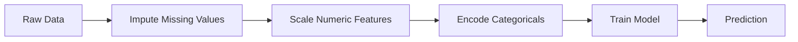
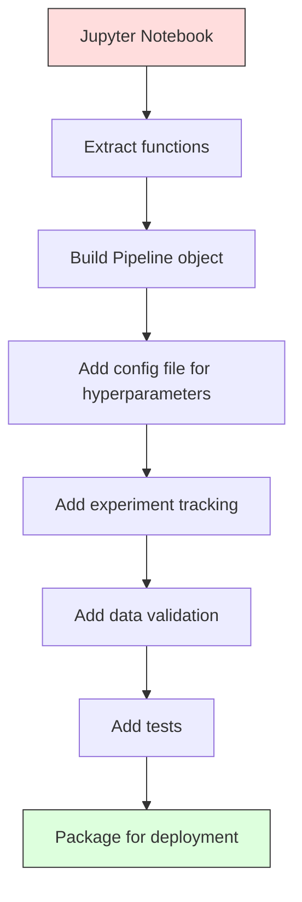

# خطوط لوله ML

> یک مدل محصول نیست. یک لوله است. لوله همه چیز از داده های خام تا پیش بینی های پیاده سازی است، و هر مرحله باید قابل تکرار باشد.

**Type:** Build
**Language:**پیتون
**Prerequisites:** Phase 2, Lesson 12 (Hyperparameter Tuning)
**Time:** ~120 minutes

## اهداف یادگیری

- ساخت یک لوله ML از ابتدا که فرض، مقیاس بندی، کدگذاری و آموزش مدل را به یک شی واحد قابل تکرار متصل می کند
- شناسایی سناریوهای خروجی داده ها و توضیح اینکه چگونه لوله ها از آنها جلوگیری می کنند با نصب ترانسفورماتورها فقط بر روی داده های آموزش
- ساخت یک ColumnTransformer که پردازش قبلی مختلف را برای ویژگی های عددی و دسته بندی اعمال می کند
- اجرای سریال سازی خط لوله و نشان دادن این که یک خط لوله نصب شده نتایج مشابهی در آموزش و تولید را به دست می آورد

## مشکل

شما یک دفترچه دارید که داده ها را بار می کند، مقادیر گمشده را با میانگین پر می کند، ویژگی های مقیاس را اندازه گیری می کند، یک مدل را آموزش می دهد و دقت را چاپ می کند. کار می کند. شما آن را ارسال می کنید.

بعد از يک ماه، يکي مدل رو دوباره آموزش ميده و نتيجهاي مختلفي ميگيره متوسط بر اساس مجموعه داده های کامل از جمله داده های آزمایش (سرخ داده ها) محاسبه شد. پارامترهای مقیاس بندی ذخیره نشده است، بنابراین نتیجه گیری از آمار های مختلف استفاده می کند. کد مهندسی ویژگی بین آموزش و خدمت کاپی-پست شده بود و کپی ها متمایز بودند. یک ستون قطعی در تولید ارزش جدیدی به دست آورد که کدگر هرگز ندیده است.

این ها فرضیه ای نیستند. این ها شایع ترین دلایل شکست سیستم های ML در تولید هستند. لوله ها همه آنها را با بسته بندی هر مرحله تحول به یک شی واحد، مرتب و قابل تولید حل می کنند.

## مفهوم

### خط لوله چیست

یک خط لوله یک ردیف ترتیب شده از تحولات داده ها است که توسط یک مدل دنبال می شود. هر مرحله از محصول مرحله قبلی به عنوان ورودی می گیرد. کل خط لوله یک بار بر روی داده های آموزش نصب می شود. در زمان نتیجه گیری، همان خط لوله مجهز داده های جدید را تبدیل می کند و پیش بینی ها را تولید می کند.



خط لوله تضمین می کند:
- تحولات فقط بر اساس داده های آموزش نصب می شوند (هیچ تخلیه ای وجود ندارد)
- در زمان نتیجه گیری هم همین تحولات اعمال می شود
- کل این شی را می توان به صورت سریالی و به عنوان یک آرتیفاکت استفاده کرد
- اعتبارسنجی متقابل در هر لایه استفاده می شود تا از خروجی ظریف جلوگیری شود.

### دزدی اطلاعات: قاتل ساکت

دزدی داده ها زمانی اتفاق می افتد که اطلاعات از مجموعه آزمایش یا داده های آینده آموزش را آلوده می کند. لوله ها مانع رایج ترین اشکال می شوند.

**Leaky (wrong):**
```python
X = df.drop("target", axis=1)
y = df["target"]

scaler = StandardScaler()
X_scaled = scaler.fit_transform(X)

X_train, X_test = X_scaled[:800], X_scaled[800:]
y_train, y_test = y[:800], y[800:]
```

مقیاسگر داده های آزمایش را مشاهده کرد. متوسط و انحراف استاندارد شامل نمونه های آزمایش می شود. این تخمین ها را افزایش می دهد.

**Correct:**
```python
X_train, X_test = X[:800], X[800:]

scaler = StandardScaler()
X_train_scaled = scaler.fit_transform(X_train)
X_test_scaled = scaler.transform(X_test)
```

با یک لوله، نیازی به فکر کردن در مورد این نیست. لوله به طور خودکار آن را اداره می کند.

### لوله لوله

کلورن`Pipeline`این یک محور زنجیره ای و یک تخمین دهنده است.`.fit()`،`.predict()`و`.score()`که همه مراحل را به ترتیب اجرا می کنند.

```python
from sklearn.pipeline import Pipeline
from sklearn.preprocessing import StandardScaler
from sklearn.linear_model import LogisticRegression

pipe = Pipeline([
    ("scaler", StandardScaler()),
    ("model", LogisticRegression()),
])

pipe.fit(X_train, y_train)
predictions = pipe.predict(X_test)
```

وقتي که زنگ ميزني`pipe.fit(X_train, y_train)`:
1. زنگ هاي اسکالر`fit_transform`در قطار X
2. نمونه تماس ها`fit`در قطار X_scale

وقتي که زنگ ميزني`pipe.predict(X_test)`:
1. زنگ هاي اسکالر`transform`(فيت_ترانسفورم نشده) در X_test
2. نمونه تماس ها`predict`در آزمون X_test مقیاس

در طول نصب، ترازنده هرگز داده های تست را نمی بیند.

### ستونترانسفارمر: خطوط لوله های مختلف برای ستون های مختلف

مجموعه داده های واقعی دارای ستون های عددی و دسته بندی هستند که نیاز به پردازش قبلی متفاوتی دارند. `ColumnTransformer`اينو حل ميکنه

```python
from sklearn.compose import ColumnTransformer
from sklearn.preprocessing import StandardScaler, OneHotEncoder
from sklearn.impute import SimpleImputer

numeric_pipe = Pipeline([
    ("impute", SimpleImputer(strategy="median")),
    ("scale", StandardScaler()),
])

categorical_pipe = Pipeline([
    ("impute", SimpleImputer(strategy="most_frequent")),
    ("encode", OneHotEncoder(handle_unknown="ignore")),
])

preprocessor = ColumnTransformer([
    ("num", numeric_pipe, ["age", "income", "score"]),
    ("cat", categorical_pipe, ["city", "gender", "plan"]),
])

full_pipeline = Pipeline([
    ("preprocess", preprocessor),
    ("model", GradientBoostingClassifier()),
])
```

.`handle_unknown="ignore"`در OneHotEncoder برای تولید حیاتی است. هنگامی که یک دسته جدید ظاهر می شود (شهر ای که مدل هرگز ندیده است) ، به جای سقوط یک ویکتور صفر تولید می کند.

### ردیابی آزمایش

یک خط لوله آموزش را قابل تکرار می کند، اما شما همچنین باید آنچه را که در سراسر آزمایش ها اتفاق افتاده است ردیابی کنید: کدام هائپر پارامترها استفاده شده، کدام نسخه مجموعه داده ها، معیارها چه چیزی بودند، کد کدام اجرا شده بود.

**MLflow**رایج ترین راه حل منبع باز است:

```python
import mlflow

with mlflow.start_run():
    mlflow.log_param("max_depth", 5)
    mlflow.log_param("n_estimators", 100)
    mlflow.log_param("learning_rate", 0.1)

    pipe.fit(X_train, y_train)
    accuracy = pipe.score(X_test, y_test)

    mlflow.log_metric("accuracy", accuracy)
    mlflow.sklearn.log_model(pipe, "model")
```

هر اجرا با پارامترها، متریکها، آثار و مدل کامل ثبت می شود. می توانید اجراها را مقایسه کنید، هر آزمایش را بازتولید کنید و هر نسخه مدل را پیاده سازی کنید.

**Weights & Biases (wandb)**قابلیت های مشابهی را با یک داشبورد میزبان فراهم می کند:

```python
import wandb

wandb.init(project="my-pipeline")
wandb.config.update({"max_depth": 5, "n_estimators": 100})

pipe.fit(X_train, y_train)
accuracy = pipe.score(X_test, y_test)

wandb.log({"accuracy": accuracy})
```

### نسخه سازی مدل

بعد از آزمایشات، باید نسخه های مدل رو مدیریت کنی کدام مدل در حال تولید است؟ کدام مدل در حال اجرا است؟ کدام مدل هفته گذشته بود؟

در سجل مدل MLflow ذکر شده است:
- **Version tracking:**هر مدل ذخیره شده شماره نسخه ای را دریافت می کند
- **Stage transitions:**"استجاره"، "پروژکتور"، "آرشیو شده"
- **Approval workflow:**مدل ها باید به طور صریح به تولید ارتقا یابند
- **Rollback:**فوراً به نسخه قبلی برگردید

### نسخه سازی داده ها با DVC

کد با git نسخه شده است. داده ها نیز باید نسخه شوند، اما git نمی تواند با فایل های بزرگ کار کند. DVC (Data Version Control) این مسئله را حل می کند.

```
dvc init
dvc add data/training.csv
git add data/training.csv.dvc data/.gitignore
git commit -m "Track training data"
dvc push
```

DVC داده های واقعی را در ذخیره سازی از راه دور (S3, GCS, Azure) ذخیره می کند و یک `.dvc`وقتی یه کامیت Git رو چک میکنید`dvc checkout`داده های دقیق را که استفاده شده است، بازمی گرداند.

این بدان معنی است که هر گیت هم کد و هم داده ها را به طور کامل بازتولید می کند.

### آزمایش های قابل تکرار

یک آزمایش قابل تکرار چهار چیز را نیاز دارد:

1. **Fixed random seeds:**تخم های تعیین شده برای نپپی، تصادفی و چارچوب (معل، sklearn)
2. **Pinned dependencies:**requirements.txt یا poetry.lock با نسخه های دقیق
3. **Versioned data:**DVC یا مشابه
4. **Config files:**تمام هیپر پارامتر ها در یک پیکربندی، غیر کد سخت

```python
import numpy as np
import random

def set_seed(seed=42):
    random.seed(seed)
    np.random.seed(seed)
    try:
        import torch
        torch.manual_seed(seed)
        torch.cuda.manual_seed_all(seed)
        torch.backends.cudnn.deterministic = True
    except ImportError:
        pass
```

### از نوتیب به تولید



پیشرفت معمول:

1. **Notebook exploration:**آزمایشات سریع، تجسمات، ایده های ویژگی
2. **Extract functions:**پیش پردازش، مهندسی ویژگی ها، ارزیابی را به ماژول ها منتقل کنید
3. **Build Pipeline:**تبدیل زنجیره به یک لوله لوله یا کلاس سفارشی
4. **Config management:**تمام هیپر پارامترها را به یک پیکربندی YAML/JSON منتقل کنید
5. **Experiment tracking:**اضافه کردن MLflow یا logging wandb
6. **Data validation:**قبل از آموزش، طرح ها، توزیع ها و الگوهای ارزش های گمشده را بررسی کنید
7. **Tests:**آزمایشات واحد برای ترانسفورماتورها، آزمایشات ادغام برای کل خط لوله
8. **Deployment:**خط لوله را سریالیز کنید، در یک API (FastAPI، Flask) بسته بندی کنید، ظرف سازی کنید

### اشتباهات معمول لوله کشی

| Mistake | Why it is bad | Fix |
|---------|-------------|-----|
| Fitting on full data before splitting | Data leakage | Use Pipeline with cross_val_score |
| Feature engineering outside pipeline | Different transforms at train vs serve | Put all transforms in the Pipeline |
| Not handling unknown categories | Production crash on new values | OneHotEncoder(handle_unknown="ignore") |
| Hardcoded column names | Breaks when schema changes | Use column name lists from config |
| No data validation | Silently wrong predictions on bad data | Add schema checks before prediction |
| Training/serving skew | Model sees different features in prod | One Pipeline object for both |

```figure
f3-pipeline-flow
```

## آن را بسازید

کد در`code/pipeline.py`یک خط لوله ML کامل را از ابتدا ایجاد می کند:

### مرحله اول: ترانسفورماتور سفارشی

```python
class CustomTransformer:
    def __init__(self):
        self.means = None
        self.stds = None

    def fit(self, X):
        self.means = np.mean(X, axis=0)
        self.stds = np.std(X, axis=0)
        self.stds[self.stds == 0] = 1.0
        return self

    def transform(self, X):
        return (X - self.means) / self.stds

    def fit_transform(self, X):
        return self.fit(X).transform(X)
```

### مرحله دوم: خط لوله از ابتدا

```python
class PipelineFromScratch:
    def __init__(self, steps):
        self.steps = steps

    def fit(self, X, y=None):
        X_current = X.copy()
        for name, step in self.steps[:-1]:
            X_current = step.fit_transform(X_current)
        name, model = self.steps[-1]
        model.fit(X_current, y)
        return self

    def predict(self, X):
        X_current = X.copy()
        for name, step in self.steps[:-1]:
            X_current = step.transform(X_current)
        name, model = self.steps[-1]
        return model.predict(X_current)
```

### مرحله سوم: اعتبارسنجی با خط لوله

این کد نشان می دهد که چگونه اعتبارسنجی با یک خط لوله از انتشار داده ها جلوگیری می کند: مقیاسگر به طور جداگانه در داده های آموزش هر لایه نصب شده است.

### مرحله 4: خط لوله تولید کامل با sklearn

یک خط لوله کامل با `ColumnTransformer`، چندین مسیر پیش پردازش و یک مدل، آموزش داده شده با اعتبار صحیح و ثبت آزمایش.

## -باده

این درس نتیجه می دهد:
- `outputs/prompt-ml-pipeline.md`-- مهارت برای ساخت و خراب کردن خط لوله های ML
- `code/pipeline.py`-- یک خط لوله کامل از ابتدا تا کلورن

## تمرینات

1. یک خط لوله بسازید که با 3 ستون عددی و 2 ستون دسته ای یک مجموعه داده ها را اداره کند. استفاده کنید `ColumnTransformer`برای اعمال میانگین فرضیه + مقیاس بندی به اعداد و اغلب فرضیه + کدگذاری یک گرم برای دسته بندی ها. تمرین با 5 برابر اعتبار متقابل.

2. به طور عمدی انتشار داده ها را معرفی کنید: قبل از تقسیم، مقیاس را در مجموعه داده های کامل قرار دهید. نمره اعتبارسنجی متقابل (سنجی) را با نمره اعتبارسنجی متقابل لوله (صاف) مقایسه کنید. تفاوت چقدر بزرگ است؟

3. خط لوله رو با `joblib.dump`.شویش رو به اسکریپت جداگانه ای بارین و پیش بینی ها رو اجرا کنین .آیا پیش بینی ها یکسان هستند؟

4. یک ترانسفارمر سفارشی را به لوله اضافه کنید که ویژگی های چندگانه (درجات 2) را برای دو ستون مهم عددی ایجاد می کند.

5. ردیابی جریان ML را برای خط لوله تنظیم کنید. 5 آزمایش با پارامترهای مختلف انجام دهید.`mlflow ui`) برای مقایسه ران ها و انتخاب بهترین مدل.

## اصطلاحات کلیدی

| Term | What people say | What it actually means |
|------|----------------|----------------------|
| Pipeline | "Chain of transforms + model" | An ordered sequence of fitted transformers and a model, applied as one unit to prevent leakage |
| Data leakage | "Test info leaked into training" | Using information from outside the training set to build the model, inflating performance estimates |
| ColumnTransformer | "Different preprocessing per column" | Applies different pipelines to different subsets of columns, combining results |
| Experiment tracking | "Logging your runs" | Recording parameters, metrics, artifacts, and code versions for every training run |
| MLflow | "Track and deploy models" | Open-source platform for experiment tracking, model registry, and deployment |
| DVC | "Git for data" | Version control system for large data files, storing hashes in git and data in remote storage |
| Model registry | "Model version catalog" | A system that tracks model versions with stage labels (staging, production, archived) |
| Training/serving skew | "It worked in the notebook" | Differences between how data is processed during training versus inference, causing silent errors |
| Reproducibility | "Same code, same result" | The ability to get identical results from the same code, data, and configuration |

## خواندن بیشتر

- [scikit-learn Pipeline docs](https://scikit-learn.org/stable/modules/compose.html)-- مرجع رسمی خط لوله
- [MLflow documentation](https://mlflow.org/docs/latest/index.html)-- ردیابی آزمایش و ثبت مدل
- [DVC documentation](https://dvc.org/doc)-- ورژن سازی داده ها
- [Sculley et al., Hidden Technical Debt in Machine Learning Systems (2015)](https://papers.nips.cc/paper/2015/hash/86df7dcfd896fcaf2674f757a2463eba-Abstract.html)-- مقاله اصلی در مورد پیچیدگی سیستم های ML
- [Google ML Best Practices: Rules of ML](https://developers.google.com/machine-learning/guides/rules-of-ml)-- مشاوره عملی تولید ML
