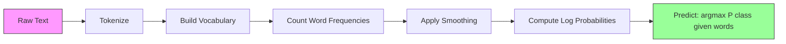

# بیز ساده

> فرضیه "سافه" اشتباهه و به هر حال جواب میده.

**Type:** Build
**Language:**پیتون
**Prerequisites:** Phase 2, Lessons 01-07 (classification, Bayes' theorem)
**Time:** ~75 minutes

## اهداف یادگیری

- پیاده سازی بیز های بیگانه چندگانه از ابتدا با صاف کردن Laplace برای طبقه بندی متن
- توضیح دهید که چرا فرضیه ساده استقلال از نظر ریاضی اشتباه است اما در عمل رتبه بندی درست را به دست می آورد
- انواع چندگانه، برنوولی و گاوسی را مقایسه کنید و گزینه مناسب را برای یک نوع خاصیت خاص انتخاب کنید
- ارزیابی بیز ساده با بازپسین لوژیستیک در داده های کمیاب با ابعاد بالا و توضیح دادن تعادل تعصب در محل کار

## مشکل

شما باید متن را طبقه بندی کنید. ایمیل ها به اسپم یا غیر اسپم. بررسی های مشتری به مثبت یا منفی. بلیط های پشتیبانی به دسته بندی. شما هزاران ویژگی (یک در هر کلمه) و داده های آموزشی محدود دارید.

اکثر طبقه بندی کنندگان در اینجا خنک می شوند. بازگشت لجستیک نیاز به نمونه های کافی برای تخمین زدن هزاران وزن به طور قابل اعتماد دارد. درختان تصمیم در یک کلمه در یک زمان تقسیم می شوند و به طور وحشیانه بیش از حد متناسب می شوند. KNN در 10،000 ابعاد بی معنی است زیرا هر نقطه به طور یکسان از هر نقطه دیگر فاصله دارد.

بايز ساده انگيز اين کار رو ميکنه این فرضیه ریاضی اشتباه است (که هر ویژگی مستقل از هر ویژگی دیگر به عنوان یک کلاس است) و هنوز هم از مدل های "ذمه تر" در طبقه بندی متن، به ویژه با مجموعه های کوچکی آموزش، بالاتر است. این یکبار از طریق داده ها عبور می کند. به میلیون ها ویژگی می رسد. این تخمین احتمال را تولید می کند (اگرچه اغلب به دلیل فرض استقلال ضعیف کالیبر شده است).

درک اینکه چرا فرضیه اشتباه منجر به پیش بینی های خوب می شود، چیزی اساسی در مورد یادگیری ماشین را به شما می آموزد: بهترین مدل درست ترین نیست، بلکه بهترین مدل با بهترین تعویض و تعویض برای داده های شما است.

## مفهوم

### نظریه بیز (تجزیه سریع)

نظريه بايز احتمالات مشروط رو رد ميکنه:

```
P(class | features) = P(features | class) * P(class) / P(features)
```

ما میخوایم`P(class | features)`-- احتمال اینکه یک سند متعلق به یک کلاس به گفته کلمات موجود در آن است.
- `P(features | class)`-- احتمال دیدن این کلمات در اسناد این کلاس
- `P(class)`-- احتمال قبلی کلاس (که اسپم به طور کلی چقدر رایج است؟)
- `P(features)`-- شواهد، برای همه کلاس ها یکسان است، بنابراین ما می توانیم آن را نادیده بگیریم

اون کلاس که بالاترين درجه رو داره`P(class | features)`برنده ميشه

### فرض استقلال ساده

محاسبات`P(features | class)`با یک لغت 10 هزار کلمه، شما باید توزیع بیش از 2^10،000 ترکیب احتمالی را تخمین بزنید. غیرممکن.

فرض ساده: هر ویژگی به لحاظ شرایط مستقل با توجه به کلاس است.

```
P(w1, w2, ..., wn | class) = P(w1 | class) * P(w2 | class) * ... * P(wn | class)
```

به جای یک توزیع مشترک غیرممکن، شما n توزیع ساده در هر ویژگی را تخمین می زنید.

این فرضیه به وضوح اشتباه است. کلمات " ماشین " و " یادگیری " در هیچ سند مستقل نیستند. اما طبقه بندی کننده به تخمین های احتمالی درست نیاز ندارد. به رتبه بندی درست نیاز دارد - کدام کلاس احتمال بالاتر دارد. فرضیه استقلال خطاهای سیستماتیک را معرفی می کند، اما این خطاها بر همه کلاس ها به طور مشابه تاثیر می گذارد، بنابراین رتبه بندی درست باقی می ماند.

### چرا هنوز موثر است

سه دلیل:

1. **Ranking over calibration.**طبقه بندی فقط نیاز به درجه بندی بالا را درست است. حتی اگر P(spam) = 0.99999 زمانی که احتمال واقعی 0.7 است، طبقه بندی کننده هنوز هم اسپام را درست انتخاب می کند. ما به احتمالات درست نیاز نداریم. ما به برنده درست نیاز داریم.

2. **High bias, low variance.**فرض استقلال یک پیش فرض قوی است. این مدل را به شدت محدود می کند، که از بیش از حد مناسب شدن جلوگیری می کند. با داده های آموزشی محدود، یک مدل که کمی اشتباه است اما پایدار است، مدل ای را که از نظر نظری درست است اما بسیار نامستقیم است، می پرشد. این تعادل تعصب-غیرتی در عمل است.

3. **Feature redundancy cancels out.**ویژگی های مرتبط شواهد اضافی را فراهم می کنند. طبقه بندی کننده این شواهد را دو برابر می شمرد، اما برای کلاس درست نیز دو برابر می شمرد. اگر " ماشین " و " یادگیری " همیشه با هم ظاهر شوند، هر دو شواهد را برای کلاس " تکنولوژی " فراهم می کنند. NB آنها را دو برابر می شمرد، اما آنها را دو برابر برای کلاس درست می شمرد.

یک دلیل چهارم و عملی: بیز بی نظیر بسیار سریع است. آموزش یک گذرگاهی از طریق فرکانس های شمارش داده است. پیش بینی ضرب ماتریکس است. شما می توانید در یک میلیون سند در ثانیه آموزش دهید. این سرعت به این معنی است که شما می توانید سریع تر تکرار کنید، مجموعه های ویژگی بیشتری را امتحان کنید و آزمایشات بیشتری را از مدل های آهسته تر انجام دهید.

### ریاضیات قدم به قدم

اجازه دهید از طریق یک مثال مشخص، دنبال کنیم. فرض کنید دو دسته داریم: اسپام و غیر اسپام. لغت ما سه کلمه دارد: "آزاد"، "پای"، "اجتماع".

اطلاعات آموزش:
- ایمیل های اسپام 80 بار از "بخش" ، 60 بار از "پای" ، 10 بار از "ملاقات" (جمعیت 150 کلمه) اشاره دارند
- ایمیل های غیر اسپام 5 بار "بخش" ، 10 بار "پای" ، 100 بار "مقابله" را ذکر می کنند (115 کلمه در کل)
- ۴۰ درصد از ایمیل ها اسپم هستند، ۶۰ درصد از آنها اسپم نیستند

با صاف کردن Laplace (alpha=1):

```
P(free | spam)    = (80 + 1) / (150 + 3) = 81/153 = 0.529
P(money | spam)   = (60 + 1) / (150 + 3) = 61/153 = 0.399
P(meeting | spam) = (10 + 1) / (150 + 3) = 11/153 = 0.072

P(free | not-spam)    = (5 + 1) / (115 + 3) = 6/118 = 0.051
P(money | not-spam)   = (10 + 1) / (115 + 3) = 11/118 = 0.093
P(meeting | not-spam) = (100 + 1) / (115 + 3) = 101/118 = 0.856
```

ایمیل جدید شامل: "برانه" (2 بار) ، "پای" (1 بار) ، "اجتماع" (0 بار) است.

```
log P(spam | email) = log(0.4) + 2*log(0.529) + 1*log(0.399) + 0*log(0.072)
                    = -0.916 + 2*(-0.637) + (-0.919) + 0
                    = -3.109

log P(not-spam | email) = log(0.6) + 2*log(0.051) + 1*log(0.093) + 0*log(0.856)
                        = -0.511 + 2*(-2.976) + (-2.375) + 0
                        = -8.838
```

اسپام با بازده بزرگی برنده می شود. کلمه "آزاد" که دو بار ظاهر می شود، شواهد قوی برای اسپام است. توجه داشته باشید که "اجتماع" که ظاهر نمی شود به هر دو مجموعه ثبت (0 * log(P)) کمک صفر می کند - در Multinomial NB، کلمات غایب هیچ اثر ای ندارند. این Bernoulli NB است که به طور صریح نماد غیبت کلمه را نشان می دهد.

### سه نوع

بايز ساده اي در سه طعم وجود داره.`P(feature | class)`. متفاوت

#### بائیس بیز بیگانه

مدل ها هر ویژگی را به عنوان یک شمارش انجام می دهند. بهترین برای داده های متن که ویژگی ها فرکانس کلمات یا ارزش های TF-IDF هستند.

```
P(word_i | class) = (count of word_i in class + alpha) / (total words in class + alpha * vocab_size)
```

.`alpha`این نوع کار برای طبقه بندی متن است.

#### بائیس ساده گاوسی

هر مدل به عنوان توزیع طبیعی، بهترین برای ویژگی های مداوم است.

```
P(x_i | class) = (1 / sqrt(2 * pi * var)) * exp(-(x_i - mean)^2 / (2 * var))
```

هر کلاس متوسط و متغیر خاص خود را برای هر ویژگی دارد. این کار خوب زمانی که ویژگی ها واقعاً در هر کلاس به منحنی زنگ عمل کنند.

#### برنولی بیز ساده

مدل ها هر ویژگی را به عنوان دوگانه (حاضر یا غایب) می کند. بهترین برای متن کوتاه یا ویکتورهای دوگانه است.

```
P(word_i | class) = (docs in class containing word_i + alpha) / (total docs in class + 2 * alpha)
```

برنولی به طور صریح عدم وجود یک کلمه را مجازات می کند. اگر "آزاد" معمولا در اسپم ظاهر می شود اما از این ایمیل غائب است، برنولی این را به عنوان شواهد علیه اسپم حساب می کند.

### چه زمانی باید از هر نوع استفاده کنیم

| Variant | Feature Type | Best For | Example |
|---------|-------------|----------|---------|
| Multinomial | Counts or frequencies | Text classification, bag-of-words | Email spam, topic classification |
| Gaussian | Continuous values | Tabular data with normal-ish features | Iris classification, sensor data |
| Bernoulli | Binary (0/1) | Short text, binary feature vectors | SMS spam, presence/absence features |

### نرم کردن لپلاز

چه اتفاقی می افتد وقتی یک کلمه در داده های آزمون ظاهر شود اما هرگز در داده های آموزش برای یک کلاس خاص ظاهر نشود؟

بدون نرم کردن:`P(word | class) = 0/N = 0`. يک صفر چندان شده در کل محصول باعث ميشه`P(class | features) = 0`، بدون توجه به تمام شواهد دیگر یک کلمه ناشناخته کل پیش بینی را نابود می کند، مهم نیست که چه شواهد دیگری آن را پشتیبانی می کند.

صاف کردن لپلاز تعداد کمی اضافه می کنه`alpha`(معمولاً 1) به هر عدد ویژگی:

```
P(word_i | class) = (count(word_i, class) + alpha) / (total_words_in_class + alpha * vocab_size)
```

با الفا=1، هر کلمه حداقل یک احتمال کوچک دریافت می کند. کلمه "discombobulate" که در یک ایمیل آزمون ظاهر می شود، دیگر احتمال اسپام را نمی کشد. صاف کردن تفسیر بیزیایی دارد: معادل قرار دادن یک Dirichlet یکنواخت در پیش توزیع کلمات است.

آلفا بالا به معنای صاف سازی قوی تر (توزيعات یکسانی بیشتر) است. آلفا پایین به معنای این است که مدل به داده ها بیشتر اعتماد می کند. آلفا یک پارامتر فوق العاده است که شما تنظیم می کنید.

اثر آلفا:

| Alpha | Effect | When to use |
|-------|--------|-------------|
| 0.001 | Almost no smoothing, trust the data | Very large training set, no unseen features expected |
| 0.1 | Light smoothing | Large training set |
| 1.0 | Standard Laplace smoothing | Default starting point |
| 10.0 | Heavy smoothing, flattens distributions | Very small training set, many unseen features expected |

### محاسبه زمان و مکان

ضرب صدها احتمال (هر یک کمتر از 1) باعث کاهش جریان نقطه شناور می شود. محصول در نقطه شناور صفر می شود حتی اگر ارزش واقعی یک عدد مثبت بسیار کوچک باشد.

راه حل: کار در فضای Log. به جای ضرب احتمالات، الگورتم های آنها را اضافه کنید:

```
log P(class | x1, x2, ..., xn) = log P(class) + sum_i log P(xi | class)
```

این پیش بینی را به یک محصول نقطه تبدیل می کند:

```
log_scores = X @ log_feature_probs.T + log_class_priors
prediction = argmax(log_scores)
```

ضرب ماتریکس. به همین دلیل پیش بینی بیز ساده خیلی سریع است -- این همان عملیات یک مدل خطی یک لایه است.

### بیز ساده و بازپسین لوژیستیک

هر دو طبقه بندی کننده خطی برای متن هستند. تفاوت در آنچه مدل می کنند.

| Aspect | Naive Bayes | Logistic Regression |
|--------|------------|-------------------|
| Type | Generative (models P(X\|Y)) | Discriminative (models P(Y\|X)) |
| Training | Count frequencies | Optimize loss function |
| Small data | Better (strong prior helps) | Worse (not enough to estimate weights) |
| Large data | Worse (wrong assumption hurts) | Better (flexible boundary) |
| Features | Assumes independence | Handles correlations |
| Speed | Single pass, very fast | Iterative optimization |
| Calibration | Poor probabilities | Better probabilities |

قانون عمومي: با باايز ساده شروع کن. اگر اطلاعات و سطح هاي بالا NB کافی داشته باشيد، به رجسيون لوژستيک تبديل شويد.

### خط لوله طبقه بندی



در عمل، ما در فضای چوبی کار می کنیم تا از جریان پایین نقطه شناور جلوگیری کنیم. به جای ضرب بسیاری از احتمال های کوچک، ما لوگاریتم آنها را اضافه می کنیم:

```
log P(class | features) = log P(class) + sum_i log P(feature_i | class)
```

```figure
naive-bayes
```

## آن را بسازید

کد در`code/naive_bayes.py`هر دو MultinomialNB و GaussianNB را از ابتدا اجرا می کند.

### چند نام NB

اجرای از ابتدا:

1. **fit(X, y)**: برای هر کلاس، فرکانس هر ویژگی را بشمارید. صاف کردن Laplace را اضافه کنید. احتمالات ثبت را محاسبه کنید. پیشینه های کلاس ذخیره کنید (log فرکانس کلاس).

2. **predict_log_proba(X)**: برای هر نمونه، حساب کردن log P(class) + مجموعه از log P(صفحه_i در تمام کلاس ها. این یک ضرب ماتریکس است: X @ log_probs.T + log_priors.

3. **predict(X)**: کلاس با بالاترین احتمال ثبت را برگردانید.

```python
class MultinomialNB:
    def __init__(self, alpha=1.0):
        self.alpha = alpha

    def fit(self, X, y):
        classes = np.unique(y)
        n_classes = len(classes)
        n_features = X.shape[1]

        self.classes_ = classes
        self.class_log_prior_ = np.zeros(n_classes)
        self.feature_log_prob_ = np.zeros((n_classes, n_features))

        for i, c in enumerate(classes):
            X_c = X[y == c]
            self.class_log_prior_[i] = np.log(X_c.shape[0] / X.shape[0])
            counts = X_c.sum(axis=0) + self.alpha
            self.feature_log_prob_[i] = np.log(counts / counts.sum())

        return self
```

نکته کلیدی: پس از سازگاری، پیش بینی فقط ضرب ماتریکس به علاوه یک تعصب است. به همین دلیل بیز ساده اینقدر سریع است.

### گاسینNB

برای ویژگی های مداوم، ما میانگین و انحراف را در هر کلاس و هر ویژگی تخمین می دهیم:

```python
class GaussianNB:
    def __init__(self):
        pass

    def fit(self, X, y):
        classes = np.unique(y)
        self.classes_ = classes
        self.means_ = np.zeros((len(classes), X.shape[1]))
        self.vars_ = np.zeros((len(classes), X.shape[1]))
        self.priors_ = np.zeros(len(classes))

        for i, c in enumerate(classes):
            X_c = X[y == c]
            self.means_[i] = X_c.mean(axis=0)
            self.vars_[i] = X_c.var(axis=0) + 1e-9
            self.priors_[i] = X_c.shape[0] / X.shape[0]

        return self
```

پیش بینی از PDF گوسین در هر ویژگی استفاده می کند، ضرب شده در میان ویژگی ها (در فضای ثبت اضافه می شود).

### نمایش: طبقه بندی متن

این کد داده های مصنوعی از دو کلاس (مقالات تکنولوژی و مقالات ورزشی) را شبیه سازی می کند. هر کلاس دارای توزیع فرکانس کلمه ای متفاوت است. MultinomialNB آنها را با استفاده از شمارش کلمات طبقه بندی می کند.

داده های مصنوعی به این ترتیب کار می کنند: ما 200 کلمه (عمود ویژگی) ایجاد می کنیم. کلمات 0-39 در مقالات فنی و کم در ورزش فرکانس بالایی دارند. کلمات 80-119 در ورزش فرکانس بالایی و کم در فناوری دارند. کلمات 40-79 در هر دو فرکانس متوسط هستند. این یک سناریو واقع بینانه ایجاد می کند که برخی کلمات شاخص های قوی کلاس هستند و دیگران سر و صدا هستند.

### نمایش: ویژگی های مداوم

این کد داده های شبیه به آیریس (3 کلاس، 4 ویژگی، خوشه های گاوسی) را تولید می کند. GaussianNB با استفاده از میانگین و متغیر در هر کلاس طبقه بندی می کند. هر کلاس دارای مرکز (وکتور متوسط) و گسترش (متغیر) متفاوت است، که داده های دنیای واقعی را تقلید می کند که اندازه گیری ها به طور سیستماتیک بین دسته ها متفاوت است.

این کد همچنین نشان می دهد:
- **Smoothing comparison:**آموزش MultinomialNB با ارزش های آلفا مختلف برای نشان دادن اثر قدرت صاف کردن بر دقت.
- **Training size experiment:**چگونه دقت NB با افزایش داده های آموزش از 20 تا 1600 نمونه افزایش می یابد. NB حتی با تعداد بسیار کمی نمونه ها به دقت مناسب می رسد - این مزیت اصلی آن است.
- **Confusion matrix:**دقت در هر کلاس، بازپرداخت و نمره فول 1 برای نشان دادن اینکه NB کجا اشتباه می کند.

### سرعت پیش بینی

پیش بینی بیز ساده یک ضرب ماتریکس است. برای نمونه های n با ویژگی های d و کلاس های k:
- چندگانهNB: یک ماتریس ضرب (n x d) @ (d x k) = O(n * d * k)
- GaussianNB: n * k ارزیابی های Gaussian PDF، هر یک از آنها دارای ویژگی های d = O(n * d * k)

هر دو در هر ابعاد خطی هستند. این را با KNN (که نیاز به محاسبه فاصله به تمام نقاط آموزش دارد) یا SVM با هسته RBF (که نیاز به ارزیابی هسته در برابر تمام متری پشتیبانی دارد) مقایسه کنید. NB در زمان پیش بینی با دستورات بزرگی سریعتر است.

## ازش استفاده کن

با sklearn، هر دو نوع یک خط هستند:

```python
from sklearn.naive_bayes import GaussianNB, MultinomialNB

gnb = GaussianNB()
gnb.fit(X_train, y_train)
print(f"GaussianNB accuracy: {gnb.score(X_test, y_test):.3f}")

mnb = MultinomialNB(alpha=1.0)
mnb.fit(X_train_counts, y_train)
print(f"MultinomialNB accuracy: {mnb.score(X_test_counts, y_test):.3f}")
```

برای طبقه بندی متن با sklearn:

```python
from sklearn.feature_extraction.text import CountVectorizer
from sklearn.naive_bayes import MultinomialNB
from sklearn.pipeline import Pipeline

text_clf = Pipeline([
    ("vectorizer", CountVectorizer()),
    ("classifier", MultinomialNB(alpha=1.0)),
])

text_clf.fit(train_texts, train_labels)
accuracy = text_clf.score(test_texts, test_labels)
```

کد در`naive_bayes.py`مقایسه اجرای از ابتدا با sklearn بر روی همان داده ها برای تأیید درستی.

### TF-IDF با بیز ساده

شمارش کلمات خام هر کلمه را وزن برابر در هر اتفاق می دهد. اما کلمات رایج مانند "the" و "is" اغلب در هر کلاس ظاهر می شوند - آنها هیچ اطلاعاتی را ندارند. TF-IDF (تردد اصطلاح - فرکانس متن برعکس) کلمات رایج را کاهش می دهد و کلمات نادر و تبعیض آمیز را افزایش می دهد.

```python
from sklearn.feature_extraction.text import TfidfVectorizer
from sklearn.naive_bayes import MultinomialNB
from sklearn.pipeline import Pipeline

text_clf = Pipeline([
    ("tfidf", TfidfVectorizer()),
    ("classifier", MultinomialNB(alpha=0.1)),
])
```

ارزش های TF-IDF غیر منفی هستند، بنابراین با MultinomialNB کار می کنند. ترکیبی از TF-IDF + MultinomialNB یکی از قوی ترین خط های پایه برای طبقه بندی متن است. اغلب مدل های پیچیده تری را در مجموعه داده ها با کمتر از 10،000 نمونه آموزش شکست می دهد.

### برنولیNB برای متن کوتاه

برای متن کوتاه (توییت ها، پیام های پیامک، چت) ، BernoulliNB می تواند MultinomialNB را از دست دهد. متن های کوتاه تعداد کلمات کم دارند، بنابراین اطلاعات فرکانسی که MultinomialNB به آن اعتماد دارد شور و صدا است. BernoulliNB فقط به حضور یا غیاب اهمیت می دهد، که با متن کوتاه قابل اعتماد تر است.

```python
from sklearn.naive_bayes import BernoulliNB
from sklearn.feature_extraction.text import CountVectorizer

text_clf = Pipeline([
    ("vectorizer", CountVectorizer(binary=True)),
    ("classifier", BernoulliNB(alpha=1.0)),
])
```

.`binary=True`پرچم در CountVectorizer تمام شمارش ها را به 0/1 تبدیل می کند. بدون آن، BernoulliNB هنوز کار می کند اما شمارش هایی را می بیند که برای آن طراحی نشده است.

### کالیبر کردن NB احتمالات

احتمالات NB ضعیف است. وقتی NB می گوید P(spam) = 0.95، احتمال واقعی ممکن است 0.7 باشد. اگر به تخمین های احتمالی قابل اعتماد نیاز دارید (به عنوان مثال، برای تعیین یک حد و یا ترکیب با مدل های دیگر) ، از KlassifierCalibratedCV sklearn استفاده کنید:

```python
from sklearn.calibration import CalibratedClassifierCV

calibrated_nb = CalibratedClassifierCV(MultinomialNB(), cv=5, method="sigmoid")
calibrated_nb.fit(X_train, y_train)
proba = calibrated_nb.predict_proba(X_test)
```

این یک بازپسین لوژیستیک در بالای نمرات خام NB با استفاده از اعتبارسنجی است. احتمالات حاصل شده به فرکانس های کلاس واقعی بسیار نزدیک تر است.

### گوتش های مشترک

1. **Negative feature values.**MultinomialNB نیاز به ویژگی های غیر منفی دارد. اگر شما دارای ارزش های منفی (مانند TF-IDF با تنظیمات خاص یا ویژگی های استاندارد شده) هستید، به جای آن از GaussianNB استفاده کنید یا ویژگی ها را به صورت مثبت تغییر دهید.

2. **Zero variance features.**GaussianNB با متغیر تقسیم می شود. اگر یک ویژگی دارای متغیر صفر برای یک کلاس (همه ارزش ها یکسان هستند) ، محاسبه احتمال شکسته می شود. کد یک اصطلاح صاف سازی کوچک (1e-9) را به تمام متغیرها اضافه می کند تا از این جلوگیری شود.

3. **Class imbalance.**اگر 99 درصد از ایمیل ها اسپم نیستند، پی پی قبلی (P(non-spam) = 0.99 آنقدر قوی است که شواهد احتمال را مغلوب می کند. شما می توانید اولویت های کلاس را به صورت دستی تنظیم کنید یا از پارامتر class_prior در sklearn استفاده کنید.

4. **Feature scaling.**MultinomialNB به مقیاس بندی نیاز ندارد (بر اساس شمارش کار می کند). GaussianNB به مقیاس بندی نیز نیاز ندارد (اسطاتتیک های فی فیچر را تخمین می زند). این یک مزیت نسبت به بازپسین لوژیستیک و SVM است که نسبت به مقیاس ویژگی ها حساس هستند.

## -باده

این درس نتیجه می دهد:
- `outputs/skill-naive-bayes-chooser.md`-- مهارت تصميم براي انتخاب گزینه مناسب NB
- `code/naive_bayes.py`-- MultinomialNB و GaussianNB از ابتدا، با مقایسه sklearn

### وقتی بیز ساده غریبه شکست می خورد

NB شکست می خورد وقتی فرض استقلال باعث رتبه بندی نادرست می شود (نه فقط احتمالات نادرست). این اتفاق می افتد وقتی:

1. **Strong feature interactions.**اگر کلاس به ترکیب دو ویژگی بستگی دارد اما نه به تنهایی (نمونه های شبیه XOR) ، NB به طور کامل آن را از دست می دهد. هر ویژگی به تنهایی هیچ مدرکی را ارائه نمی دهد و NB نمی تواند آنها را غیر خطی ترکیب کند.

2. **Highly correlated features with opposing evidence.**اگر ویژگی A می گوید "اسپام" و ویژگی B می گوید "غیر اسپام"، اما A و B کاملا مرتبط هستند (هم وقت در واقعیت موافقند) ، NB شواهد متناقض را در جایی که هیچ وجود ندارد می بیند.

3. **Very large training sets.**با داده های کافی، مدل های تبعیض آمیز مانند بازپسین لوژیستیک، مرز تصمیم گیری واقعی را یاد می گیرند و از NB بهتر عمل می کنند. فرض استقلال که با داده های کوچک کمک می کرد، اکنون مدل را عقب نگه می دارد.

در عمل، این حالت های شکست برای طبقه بندی متن نادر است. ویژگی های متن متعدد و فردی ضعیف هستند و اشتباهات فرضیه استقلال تمایل به لغو دارند. برای داده های جدول با ویژگی های بسیار مرتبط، ابتدا رجعت لوژیستیک یا مدل های مبتنی بر درخت را در نظر بگیرید.

## تمرینات

1. **Smoothing experiment.**آموزش MultinomialNB در داده های متن با ارزش های آلفا 0.01، 0.1، 1.0, 10.0 و 100.0. دقت نقشه در مقابل آلفا. عملکرد بالاتر کجاست؟ چرا آلفا بسیار بالا درد می کند؟

2. **Feature independence test.**یک مجموعه داده های واقعی متن را بگیرید. دو کلمه را انتخاب کنید که به وضوح مرتبط هستند (" ماشین " و " یادگیری "). حساب کنید P  کلمه 1  کلاس) * P  کلمه 2  کلاس) و آن را با P  کلمه 1 و کلمه 2  کلاس مقایسه کنید. فرضیه استقلال چقدر اشتباه است؟ آیا این بر دقت طبقه بندی تاثیر می گذارد؟

3. **Bernoulli implementation.**کد را با یک کلاس BernoulliNB گسترش دهید. کلاه کلمات را به دوگانه (حاضر/ غائب) تبدیل کنید و دقت را با MultinomialNB در داده های متن مقایسه کنید. Bernoulli چه زمانی برنده می شود؟

4. **NB vs Logistic Regression.**هر دو را بر اساس داده های متن آموزش دهید. با 100 نمونه آموزش شروع کنید و به 10،000 افزایش دهید. دقت نقشه مقابل اندازه مجموعه آموزش برای هر دو. در چه نقطه بازپسین لوژیستیک بهایز ساده را پیشی می گیرد؟

5. **Spam filter.**یک دسته بندی اسپام کامل بسازید: نماد متن ایمیل خام را نشان دهید، ذخایر لغاتی بسازید، ویژگی های کیف کلمات را ایجاد کنید، MultinomialNB را آموزش دهید، با دقت ارزیابی کنید و به یاد بیاورید (نه فقط دقت - چرا؟)

## اصطلاحات کلیدی

| Term | What people say | What it actually means |
|------|----------------|----------------------|
| Naive Bayes | "Simple probabilistic classifier" | A classifier that applies Bayes' theorem with the assumption that features are conditionally independent given the class |
| Conditional independence | "Features don't affect each other" | P(A, B \| C) = P(A \| C) * P(B \| C) -- knowing B tells you nothing new about A once you know C |
| Laplace smoothing | "Add-one smoothing" | Adding a small count to every feature to prevent zero probabilities from dominating the prediction |
| Prior | "What you believed before seeing data" | P(class) -- the probability of each class before observing any features |
| Likelihood | "How well the data fits" | P(features \| class) -- the probability of observing these features if the class is known |
| Posterior | "What you believe after seeing data" | P(class \| features) -- the updated probability of the class after observing the features |
| Generative model | "Models how data is generated" | A model that learns P(X \| Y) and P(Y), then uses Bayes' theorem to get P(Y \| X) |
| Discriminative model | "Models the decision boundary" | A model that directly learns P(Y \| X) without modeling how X is generated |
| Log probability | "Avoid underflow" | Working with log P instead of P to prevent the product of many small numbers from becoming zero in floating point |

## خواندن بیشتر

- [scikit-learn Naive Bayes docs](https://scikit-learn.org/stable/modules/naive_bayes.html)-- همه سه نوع با جزئیات ریاضی
- [McCallum and Nigam, A Comparison of Event Models for Naive Bayes Text Classification (1998)](https://www.cs.cmu.edu/~knigam/papers/multinomial-aaaiws98.pdf)-- مقایسه کلاسیک چندگانه با برنولی برای متن
- [Rennie et al., Tackling the Poor Assumptions of Naive Bayes Text Classifiers (2003)](https://people.csail.mit.edu/jrennie/papers/icml03-nb.pdf)-- بهبود در NB برای متن
- [Ng and Jordan, On Discriminative vs. Generative Classifiers (2001)](https://ai.stanford.edu/~ang/papers/nips01-discriminativegenerative.pdf)-- ثابت می کند NB با داده های کمتر سریعتر از LR به هم می پیوندد
