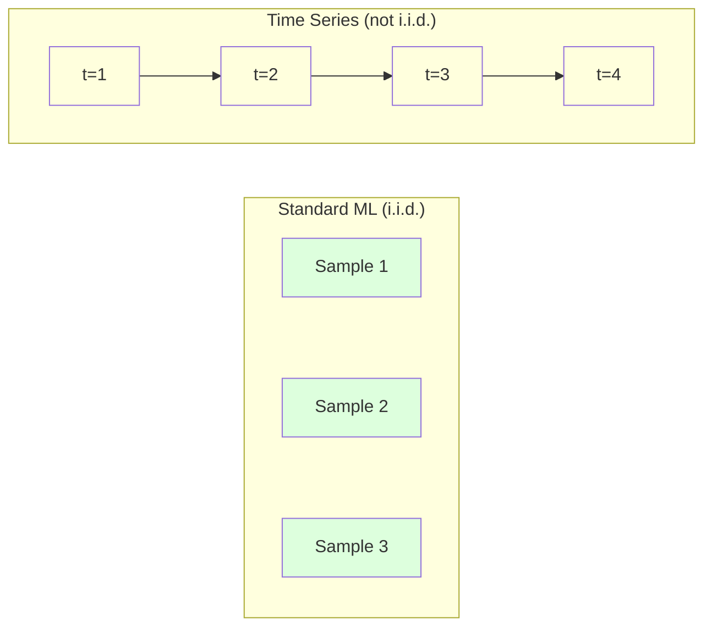
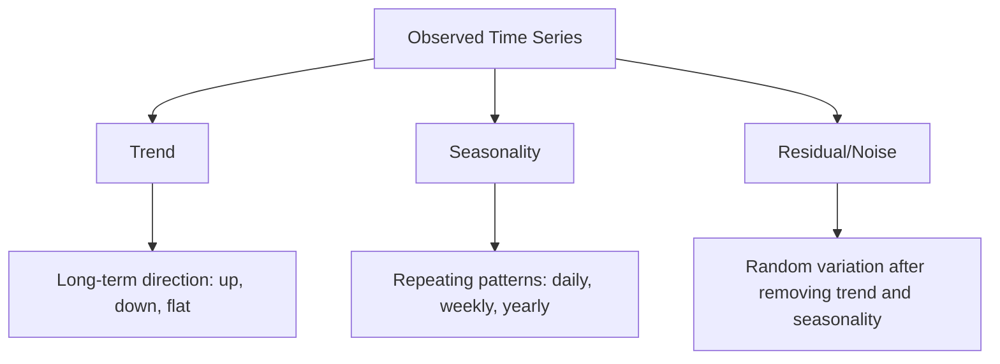
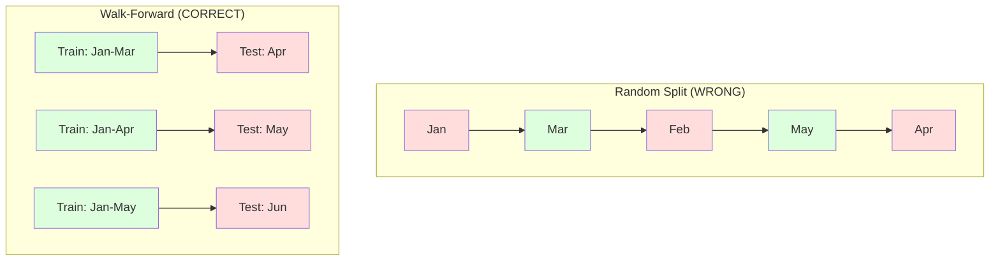

# اصول سری زمان

> عملکرد گذشته نتایج آینده را پیش بینی می کند -- اگر ابتدا ثابتیت را بررسی کنید.

**Type:** Build
**Language:**پیتون
**Prerequisites:** Phase 2, Lessons 01-09
**Time:** ~90 minutes

## اهداف یادگیری

- تجزیه یک سری زمانی به روند، فصلییت و اجزای باقیمانده و آزمایش ثابت بودن
- پیاده سازی ویژگی های تاخیر و آمار گردش برای تبدیل یک سری زمان به یک مشکل یادگیری تحت نظارت
- ساخت یک چارچوب اعتبارسنجی پیشرو که از نفوذ داده های آینده به آموزش جلوگیری کند
- توضیح دهید که چرا تقسیم های تصادفی قطار/تخت برای سری های زمانی غیرفعال هستند و شکاف عملکرد را در مقابل تقسیم های زمانی مناسب نشان دهید.

## مشکل

شما داده های مرتب شده با زمان دارید، فروش روزانه، دمای ساعت، مصرف پردازنده در دقیقه، قیمت سهام هفته ای می خواهید ارزش بعدی، هفته آینده، سه ماهه آینده را پیش بینی کنید.

شما به ابزار استاندارد ML خود برسید: قسمت تصادفی قطار/تست، اعتبارسنجی، ماتریس ویژگی ها، پیش بینی خارج. هر مرحله اشتباه است.

سری زمان فرضیه هایی را که استاندارد ML بر آن تکیه می کند شکسته است. نمونه ها مستقل نیستند - دمای امروز به دمای دیروز بستگی دارد. تقسیم های تصادفی اطلاعات آینده را به گذشته لیک می کنند. ویژگی هایی که در آزمایشات پس از کار عالی هستند در تولید شکست می خورند زیرا بر الگوهای تغییر پذیر تکیه می کنند.

یک مدل که 95 درصد دقت را با اعتبار تصادفی به دست آورد، ممکن است 55 درصد را با ارزیابی مناسب مبتنی بر زمان بدست آورد. تفاوت یک فکرکاری نیست. تفاوت بین یک مدل که روی کاغذ کار می کند و یک مدل که در تولید کار می کند.

این درس اصول اساسی را پوشش می دهد: آنچه داده های زمان را متفاوت می کند، چگونه مدل ها را صادقانه ارزیابی کنیم و چگونه یک سری زمان را به ویژگی هایی تبدیل کنیم که مدل های استاندارد ML می توانند مصرف کنند.

## مفهوم

### چه چیزی باعث می شود که سری زمان متفاوت باشد

ML استاندارد فرض می کند i.i.d. -- مستقل و به طور یکسان توزیع شده است. هر نمونه از همان توزیع، مستقل از نمونه های دیگر گرفته شده است. سری زمان هر دو را نقض می کند:

- **Not independent.**قیمت سهام امروز بستگی به قیمت دیروز داره. فروش این هفته با اون هفته ی گذشته همبستگی داره.
- **Not identically distributed.**توزیع با گذشت زمان تغییر می کند. فروش در ماه دسامبر با فروش در ماه مارس متفاوت است.

این نقض ها جزئی نیستند. آنها نحوه ساخت ویژگی ها، نحوه ارزیابی مدل ها و الگوریتم های کار را تغییر می دهند.



در ML استاندارد، نمونه ها قابل تعویض هستند. مخلوط کردن آنها هیچ تغییری نمی کند. در سری زمان، نظم همه چیز است. مخلوط کردن سیگنال را نابود می کند.

### اجزای یک سری زمان

هر سری زمان ترکیبی از:



- **Trend**: جهت بلند مدت، درآمد در حال رشد 10 درصد در سال، دمای جهانی در حال افزایش است
- **Seasonality**: تکرار الگوهای با فواصل ثابت. فروش خرده فروشی در دسامبر افزایش یافته است. استفاده از تهویه مطبوع در ماه ژوئیه اوج می یابد.
- **Residual**هر چیزی که پس از حذف روند و فصلی باقی مانده است. اگر باقی مانده به صدای سفید شبیه باشد، تجزیه سیگنال را ضبط می کند.

### ثابت بودن

یک سری زمانی ثابت است اگر خواص آماری آن (متوسط، متغیر، ارتباط خودکار) با گذشت زمان تغییر نکند. اکثر روش های پیش بینی ثابت را فرض می کنند.

**Why it matters:**یک سری غیر ثابت دارای یک متوسط است که حرکت می کند. یک مدل آموزش داده شده بر اساس داده های ژانویه یک متوسط متفاوت از آنچه که فوریه نشان می دهد آموخته است. این به طور سیستماتیک اشتباه خواهد بود.

**How to check:**متوسط چرخاندن و انحراف استاندارد چرخاندن را بر روی پنجره ها محاسبه کنید. اگر آنها حرکت کنند، سری غیر ثابت است.

**How to fix:**تفاوت: به جای مدل سازی ارزش های خام، مدل سازی تغییر بین ارزش های متوالی:

```
diff[t] = value[t] - value[t-1]
```

اگر یک دور از تفاوت باعث توقف سری نمی شود، آن را دوباره اعمال کنید (تفرق دوم). اکثر سری های دنیای واقعی به حداکثر دو دور نیاز دارند.

**Example:**

مجموعه اصلی: [100، ۱۰۲، ۱۰۶، ۱۱۲، ۱۲۰]
فرق اول: [۲، ۴، ۶، ۸] (همچنین به سمت بالا حرکت می کند)
فرق دوم: [2, 2, 2] (ثابت -- ثابت)

در سری اصلی یک روند مربع داشت. اولین تفاوت آن را به یک روند خطی تبدیل کرد. دومین تفاوت آن را مسطح کرد. در عمل، شما به ندرت بیش از دو دور نیاز دارید.

**Formal test:**آزمون DICKY-FULLER (ADF) آزمون آماری استاندارد برای ثابت بودن است. فرضیه صفر این است که "سلسلسل غیر ثابت است". یک p- ارزش زیر 0.05 به این معنی است که شما می توانید null را رد کنید و ثابت بودن را نتیجه بگیرید. ما ADF را از ابتدا اجرا نمی کنیم (این نیازمند جدول های توزیع غیرمتناوب است) ، اما رویکرد آماری چرخنده در کد ما یک بررسی بصری عملی را می دهد.

### ارتباط خودکار

خودتوافق اندازه گیری می کند که مقدار یک ارزش در زمان t به مقدار در زمان t-k (ک گام در گذشته) مربوط است. تابع خودتوافق (ACF) این ارتباط را برای هر تاخیر k نشان می دهد.

**ACF tells you:**
- اگه ACF بعد از 5 مرحله به صفر افتد، ارزش های قبل از 5 مرحله مهم نیست.
- آیا فصلی وجود دارد. اگر ACF در 12 (داده ماهانه) افزایش یابد، فصلی سالانه وجود دارد.
- چند تا از ویژگی های تاخیر ایجاد کنید. از تاخیر ها تا جایی استفاده کنید که ACF نادیده گرفته شود.

**PACF (Partial Autocorrelation Function)**اگر امروز با 3 روز پیش مرتبط باشد فقط به این دلیل که هر دو با دیروز مرتبط هستند، PACF در lag 3 صفر خواهد بود در حالی که ACF در lag 3 نخواهد بود.

### ویژگی های Lag: تبدیل سری زمان به یادگیری تحت نظارت

مدل های استاندارد ML نیاز به یک ماتریس ویژگی X و یک هدف y دارند. سری زمان به شما یک ستون واحد از مقادیر می دهد. پل ویژگی های تاخیر است.

سری [10, 12, 14, 13, 15] را بگیرید و ویژگی های lag-1 و lag-2 را ایجاد کنید:

| lag_2 | lag_1 | target |
|-------|-------|--------|
| 10    | 12    | 14     |
| 12    | 14    | 13     |
| 14    | 13    | 15     |

حالا شما یک مشکل رجعت استاندارد دارید. هر مدل ML (رجعت خطی، جنگل تصادفی، افزایش گرادینت) می تواند هدف را از پس انداز پیش بینی کند.

ویژگی های اضافی که می توانید طراحی کنید:
- **Rolling statistics:**متوسط، std، min، حداکثر بیش از آخرین k ارزش ها
- **Calendar features:**روز هفته، ماه، تعطیلات، آخر هفته
- **Differenced values:**تغییر از مرحله قبلی
- **Expanding statistics:**متوسط تجمعی، مبلغ تجمعی
- **Ratio features:**ارزش فعلی / متوسط چرخنده (چه قدر از متوسط اخیر فاصله دارد)
- **Interaction features:**1 * روز_حداثیت هفته (تأثيرات روز هفته بر سرعت)

**How many lags?**اگر ACF تا 10 تاخیر قابل توجه باشد، حداقل 10 تاخیر را استفاده کنید. اگر فصلیتی هفتگی وجود دارد، شامل 7 (و احتمالا 14) تاخیر کنید.

**The target alignment trap.**وقتی ویژگی های تاخیر را ایجاد می کنید، هدف باید ارزش در زمان t باشد و همه ویژگی ها باید از ارزش ها در زمان t-1 یا قبل استفاده کنند. اگر شما تصادفی ارزش در زمان t را به عنوان یک ویژگی اضافه کنید، شما یک پیش بینی کامل دارید - و یک مدل کاملا بی فایده. این رایج ترین خطا در مهندسی ویژگی های سری زمان است.

### تاییدیه پیشروی

این مهمترین مفهوم در این درس است. اعتبارسنجی متقاطع استاندارد k-fold به طور تصادفی نمونه ها را برای آموزش و آزمایش اختصاص می دهد. برای سری های زمانی، این اطلاعات آینده را به دست می آورد.



اعتبارسنجی پیش رو:
1. آموزش داده ها تا زمان t
2. پیش بینی در زمان t+1 (یا t+1 تا t+k برای چند مرحله)
3. پنجره رو جلو بکش
4. تکرار کنید

هر قسمت آزمون تنها حاوی داده هایی است که پس از تمام داده های آموزش وجود دارد. هیچ تخلیه آینده ای وجود ندارد. این به شما یک تخمین صادقانه از عملکرد مدل را در هنگام استفاده می دهد.

**Expanding window**تمام داده های تاریخی را برای آموزش استفاده می کند (چندوی رشد می کند). **Sliding window**استفاده از پنجره آموزشی با اندازه ثابت (سلائیز پنجره) استفاده کنید. استفاده از گسترش زمانی که شما معتقدید داده های قدیمی هنوز هم مرتبط هستند. استفاده از حرکت در زمانی که جهان تغییر می کند و داده های قدیمی آسیب می بینند.

### "آريما"

ARIMA مدل سری زمان کلاسیک است. این مدل دارای سه جزء است:

- **AR (Autoregressive):**پیش بینی از ارزش های گذشته. AR ((p) از آخرین ارزش های p استفاده می کند.
- **I (Integrated):**تفاوت برای رسیدن به ثابت بودن.
- **MA (Moving Average):**پیش بینی از اشتباهات پیش بینی گذشته. MA(q) از آخرین اشتباهات q استفاده می کند.

ARIMA ((p, d, q) سه را ترکیب می کند. شما p, d, q را بر اساس تجزیه و تحلیل ACF / PACF یا جستجوی خودکار (ARIMA) انتخاب می کنید.

ما از ابتدا ARIMA را اجرا نمی کنیم -- این نیازمند بهینه سازی عددی است که فراتر از حوزه این درس است. بینش کلیدی این است که درک کنید هر جزء چه می کند تا بتوانید نتایج ARIMA را تفسیر کنید و بدانید که چه زمانی از آن استفاده کنید.

### چه زمانی باید از چه چیزی استفاده کنیم

| Approach | Best For | Handles Seasonality | Handles External Features |
|----------|---------|-------------------|------------------------|
| Lag features + ML | Tabular with many external features | With calendar features | Yes |
| ARIMA | Single univariate series, short-term | SARIMA variant | No (ARIMAX for limited) |
| Exponential smoothing | Simple trend + seasonality | Yes (Holt-Winters) | No |
| Prophet | Business forecasting, holidays | Yes (Fourier terms) | Limited |
| Neural networks (LSTM, Transformer) | Long sequences, many series | Learned | Yes |

برای اکثر مشکلات عملی، ویژگی های تاخیر + افزایش گرادینت قوی ترین نقطه شروع است. این ویژگی های خارجی را به طور طبیعی اداره می کند، نیازی به ثابت ماندن ندارد و آسان تر از اشکال است.

### پیش بینی افق ها و استراتژی ها

پیش بینی یک مرحله پیش بینی یک مرحله جلوتر است. پیش بینی چند مرحله پیش بینی چندین مرحله است. سه استراتژی وجود دارد:

**Recursive (iterated):**پیش بینی یک قدم جلوتر، از پیش بینی به عنوان ورودی برای گام بعدی استفاده کنید. ساده اما اشتباهات جمع می شوند - هر پیش بینی از پیش بینی قبلی استفاده می کند، بنابراین اشتباهات مخلوط می شوند.

**Direct:**مدل 1 t+1 را پیش بینی می کند، مدل 5 t+5 را پیش بینی می کند. هیچ تراکم خطا وجود ندارد، اما هر مدل نمونه های آموزش کمتری دارد و اطلاعات را به اشتراک نمی گذارند.

**Multi-output:**یک مدل را آموزش دهید که تمام افق ها را به طور همزمان تولید کند. اطلاعات را در افق ها به اشتراک می گذارد اما نیاز به یک مدل است که از چندین محصول پشتیبانی کند (یا یک تابع ضایعات سفارشی).

برای اکثر مشکلات عملی، با بازخورد برای افق های کوتاه (1-5 مرحله) و مستقیم برای افق های طولانی تر شروع کنید.

### اشتباهات رایج در سری زمان

| Mistake | Why it happens | How to fix |
|---------|---------------|-----------|
| Random train/test split | Habit from standard ML | Use walk-forward or temporal split |
| Using future features | Feature at time t included by mistake | Audit every feature for temporal alignment |
| Overfitting to seasonality | Model memorizes calendar patterns | Hold out a full seasonal cycle in the test set |
| Ignoring scale changes | Revenue doubles but patterns stay | Model percentage change instead of absolute |
| Too many lag features | "More history is better" | Use ACF to determine relevant lags |
| Not differencing | "The model will figure it out" | Tree models handle trends; linear models need stationarity |

```figure
f3-series-decompose
```

## آن را بسازید

کد در`code/time_series.py`از نو بلوک های اصلی را اجرا می کند.

### سازنده ویژگی های Lag

```python
def make_lag_features(series, n_lags):
    n = len(series)
    X = np.full((n, n_lags), np.nan)
    for lag in range(1, n_lags + 1):
        X[lag:, lag - 1] = series[:-lag]
    valid = ~np.isnan(X).any(axis=1)
    return X[valid], series[valid]
```

این یک سری یک بعدی را به یک ماتریس ویژگی تبدیل می کند که هر ردیف آخرین آن را دارد `n_lags`ارزش ها به عنوان ویژگی ها و ارزش فعلی به عنوان هدف.

### اعتبارسنجی متقابل

```python
def walk_forward_split(n_samples, n_splits=5, min_train=50):
    assert min_train < n_samples, "min_train must be less than n_samples"
    step = max(1, (n_samples - min_train) // n_splits)
    for i in range(n_splits):
        train_end = min_train + i * step
        test_end = min(train_end + step, n_samples)
        if train_end >= n_samples:
            break
        yield slice(0, train_end), slice(train_end, test_end)
```

هر تقسیم تضمین می کند که داده های آموزش قبل از داده های آزمون به طور دقیق ارائه می شود. پنجره آموزش با هر پیچ گسترش می یابد.

### مدل ساده خودکشی

یک مدل AR خالص فقط بازپسین خطی در ویژگی های تاخیر است:

```python
class SimpleAR:
    def __init__(self, n_lags=5):
        self.n_lags = n_lags
        self.weights = None
        self.bias = None

    def fit(self, series):
        X, y = make_lag_features(series, self.n_lags)
        # Solve via normal equations
        X_b = np.column_stack([np.ones(len(X)), X])
        theta = np.linalg.lstsq(X_b, y, rcond=None)[0]
        self.bias = theta[0]
        self.weights = theta[1:]
        return self
```

این از نظر مفهومی مشابه بازپسین خطی از درس 02 است، اما به نسخه های زمانبندی از همان متغیر اعمال می شود.

### چک ثابت بودن

این کد آمار چرخنده را برای ارزیابی بصری و عددی ثابت بودن محاسبه می کند:

```python
def check_stationarity(series, window=50):
    rolling_mean = np.array([
        series[max(0, i - window):i].mean()
        for i in range(1, len(series) + 1)
    ])
    rolling_std = np.array([
        series[max(0, i - window):i].std()
        for i in range(1, len(series) + 1)
    ])
    return rolling_mean, rolling_std
```

اگر متوسط حرکت چرخاندن یا تغییر در حرکت چرخاندن، سری غیر ثابت است.

این کد همچنین با مقایسه نیمه اول و نیمه دوم سری ثابتیت را بررسی می کند. اگر میانگین بیش از نیمی از انحراف استاندارد متفاوت باشد یا نسبت انحراف بیش از 2x باشد، سری به عنوان غیر ثابت نشان داده می شود.

### ارتباط خودکار

```python
def autocorrelation(series, max_lag=20):
    n = len(series)
    mean = series.mean()
    var = series.var()
    acf = np.zeros(max_lag + 1)
    for k in range(max_lag + 1):
        cov = np.mean((series[:n-k] - mean) * (series[k:] - mean))
        acf[k] = cov / var if var > 0 else 0
    return acf
```

## ازش استفاده کن

با sklearn، شما از ویژگی های lag مستقیماً با هر regressor استفاده می کنید:

```python
from sklearn.linear_model import Ridge
from sklearn.ensemble import GradientBoostingRegressor

X, y = make_lag_features(series, n_lags=10)

for train_idx, test_idx in walk_forward_split(len(X)):
    model = Ridge(alpha=1.0)
    model.fit(X[train_idx], y[train_idx])
    predictions = model.predict(X[test_idx])
```

برای ARIMA از مدل های آمار استفاده کنید:

```python
from statsmodels.tsa.arima.model import ARIMA

model = ARIMA(train_series, order=(5, 1, 2))
fitted = model.fit()
forecast = fitted.forecast(steps=30)
```

کد در`time_series.py`هر دو رویکرد را نشان می دهد و با استفاده از اعتبارسنجی راه به جلو آنها را مقایسه می کند.

### sklearn TimeSeriesSplit

sklearn ارائه می دهد`TimeSeriesSplit`که اعتبارسنجی راه اندازی را اجرا می کند:

```python
from sklearn.model_selection import TimeSeriesSplit

tscv = TimeSeriesSplit(n_splits=5)
for train_index, test_index in tscv.split(X):
    X_train, X_test = X[train_index], X[test_index]
    y_train, y_test = y[train_index], y[test_index]
    model.fit(X_train, y_train)
    score = model.score(X_test, y_test)
```

اين معادل شروع ما هست`walk_forward_split`اما به چارچوب اعتبارسنجی صلیبی sklearn ادغام شده است.`cross_val_score`:

```python
from sklearn.model_selection import cross_val_score

scores = cross_val_score(model, X, y, cv=TimeSeriesSplit(n_splits=5))
print(f"Mean score: {scores.mean():.4f} +/- {scores.std():.4f}")
```

### متریک ارزیابی

پیش بینی سری زمان از متریک های رجریشن استفاده می کند، اما با زمینه آگاه با زمان:

- **MAE (Mean Absolute Error):**متوسط y_true - y_pred = y_pred = y_pred = y_pred = y_pred = y_pred = y_pred = y_pred = y_pred = y_pred = y_pred = y_pred = y_pred = y_pred = y_pred = y_pred = y_pred = y_pred = y_pred = y_pred = y_pred = y_pred = y_pred = y_pred = y_pred = y_pred = y_pred = y_pred = y_pred = y_pred = y_pred = y_pred = y_pred = y_pred = y_pred = y_pred = y_pred = y_pred = y_pred = y_pred = y_pred = y_pred = y_pred = y_pred = y_pred = y_pred = y_pred = y_pred = y_pred = y_pred = y_pred = y_y_pred = y_y_y_pred = y_y_y_= y_pred = y_y_y_y_y_y_y_de= y_y_y_y_y_y_y_y_y_y_y_y_y_y_y_y_y_y_y_y_y_y_y_y_y_y_y_y_y_y_y_y_y_y_y_y_y_y_y_y_y_y_y_y_y_y_y_y_y_y_y_y_y_y_y_y_y_y_y_y_y_y_y_y_y_y_y_y_y_y_y_y_y_y_y_y_y_y_y_y_y_y_y_y_y_y_y_y_y_y_y_y_y_y_y_y_y_y_y_y_y_y_y_y_y_y_y_y_y_y_y_y_y_y_y_y_y_y_y_y_y_y_y_y_y_y_y_y_y_y
- **RMSE (Root Mean Squared Error):**ریشه مربع اشتباه متوسط مربع. مجازات اشتباهات بزرگ بیشتر از MAE. استفاده کنید زمانی که اشتباهات بزرگ بدتر از اشتباهات کوچک هستند.
- **MAPE (Mean Absolute Percentage Error):**متوسط خطا / true_value = 100 است. مستقل از مقیاس، برای مقایسه در سری های مختلف مفید است. اما نامحدود زمانی که ارزش های واقعی صفر هستند.
- **Naive baseline comparison:**همیشه با خط های پایه ساده مقایسه کنید. خط پایه بی نظیر فصلی ارزش را از یک دوره گذشته (روز گذشته، هفته گذشته) پیش بینی می کند. اگر مدل شما نمی تواند بی نظیر را شکست دهد، چیزی اشتباه است.

### ویژگی های چرخنده

کد نشان می دهد که اضافه کردن آمار گردش (متوسط، std، min، max در پنجره های 7 و 14 روز) برای ویژگی های تاخیر. این اطلاعات را در مورد روند اخیر و نوسانات ارائه می دهد که ویژگی های تاخیر به تنهایی نمی توانند آن را ضبط کنند.

به عنوان مثال، اگر متوسط چرخاندن در حال افزایش است، این نشان می دهد یک روند صعود است. اگر std چرخاندن در حال افزایش است، این نشان می دهد نوسانات در حال افزایش است. این گونه الگوهای است که مدل های مبتنی بر درخت می توانند از آنها یاد بگیرند اما مدل های خطی نمی توانند.

## -باده

این درس نتیجه می دهد:
- `outputs/prompt-time-series-advisor.md`-- یک پیام برای چارچوب کردن مشکلات سری زمان
- `code/time_series.py`-- ویژگی های تاخیر، اعتبار دادن به جلو، مدل AR، چک های ثابت

### اصول لازم برای شکست

قبل از ساخت هر مدل، خط های پایه را تعیین کنید:

1. **Last value (persistence).**پیش بینی کنید که فردا مثل امروز خواهد بود برای بسیاری از سریال ها این به طرز شگفت انگیزی سخت است
2. **Seasonal naive.**پیش بینی کنید که امروز همان روز هفته گذشته (یا سال گذشته) خواهد بود. اگر مدل شما نمی تواند این را شکست دهد، آن را هیچ الگوی مفید فراتر از فصلی آموخته است.
3. **Moving average.**متوسط آخرین ارزش های k را پیش بینی کنید. شور را صاف می کند اما نمی تواند تغییرات ناگهانی را ضبط کند.

اگر مدل ML فانتزی شما به اساس بی نظیر فصلی از دست می دهد، شما یک خطای دارید. اغلب: خروجی آینده در ویژگی ها، روش ارزیابی اشتباه، یا سری واقعا تصادفی و غیر قابل پیش بینی است.

### نکات عملی

1. **Start with plotting.**قبل از هر مدل سازی، سری خام را نقشه بزنید. به دنبال روند، فصلی، خارق العاده، شکاف های ساختاری (تغییر ناگهانی در رفتار) باشید. یک بازرسی بصری ۳۰ ثانیه اغلب بیش از یک ساعت تجزیه و تحلیل خودکار را به شما می گوید.

2. **Difference first, model second.**اگر مجموعه ای از روند مشخصی داشته باشد، قبل از ایجاد ویژگی های تاخیر، آن را متفاوت کنید. مدل های مبتنی بر درخت می توانند روند را مدیریت کنند، اما مدل های خطی نمی توانند، و تفاوت هرگز آسیب نمی رساند.

3. **Hold out at least one full seasonal cycle.**اگر شما دارای فصلی هفتگی هستید، مجموعه آزمایش شما حداقل یک هفته کامل نیاز دارد. اگر ماهانه باشد، حداقل یک ماه کامل. در غیر این صورت شما نمی توانید ارزیابی کنید که آیا مدل الگوی فصلی را ضبط کرده است یا خیر.

4. **Monitor in production.**مدل های سری زمان با گذشت زمان با تغییر جهان کاهش می یابد. خطاهای پیش بینی را به صورت مداوم ردیابی کنید. هنگامی که خطاها افزایش می یابد، مدل را بر اساس داده های اخیر آموزش دهید.

5. **Beware of regime changes.**یک مدل که بر اساس داده های پیش از همه گیری آموزش دیده است، رفتار پس از همه گیری را پیش بینی نمی کند. شاخص های تغییرات رژیم شناخته شده را به عنوان ویژگی ها شامل کنید یا از پنجره ای که داده های قدیمی را فراموش می کند استفاده کنید.

6. **Log-transform skewed series.**درآمد، قیمت ها و شمارش ها اغلب به سمت راست منحرف می شوند. گرفتن سوابق تغییر را ثابت می کند و الگوهای چندگانه را افزودنی می کند، که مدل های خطی می توانند با آن مقابله کنند. پیش بینی در فضای سوابق، سپس به ارقام نمایی برای بازگشت به واحد های اصلی.

## تمرینات

1. **Stationarity experiment.**یک سری با یک روند خطی تولید کنید. ثابتیت را با آمار چرخاندن بررسی کنید. اولین فرقی را اعمال کنید. دوباره بررسی کنید. برای یک روند مربع چند دور فرقی لازم است؟

2. **Lag selection.**ACF را بر روی یک سری فصلی (مدت=7) محاسبه کنید. کدام تاخیر ها بیشترین ارتباط خودکار را دارند؟ ویژگی های تاخیر را با استفاده از فقط آن تاخیر ها (نه تاخیر های متوالی) ایجاد کنید. آیا دقت در مقایسه با استفاده از تاخیر 1 تا 7 بهبود می یابد؟

3. **Walk-forward vs random split.**یک رجس را بر روی ویژگی های تاخیر تمرین کنید. با تقسیم تصادفی 80/20 و با اعتبار به جلو ارزیابی کنید. تقسیم تصادفی عملکرد را چقدر بیش از حد ارزیابی می کند؟

4. **Feature engineering.**میانگین رولینگ (چاله = 7) ، رولینگ std (چاله = 7) و ویژگی های روز هفته را به ویژگی های تاخیر اضافه کنید. دقت را با استفاده از اعتبارات پیشرو با استفاده از این افزونه ها و بدون آنها مقایسه کنید.

5. **Multi-step forecasting.**مدل AR را تغییر دهید تا به جای 5 مرحله پیش بینی کنید. دو استراتژی را مقایسه کنید: (أ) یک مرحله را پیش بینی کنید، از پیش بینی به عنوان ورودی برای مرحله بعدی (بازدید) استفاده کنید و (ب) مدل های جداگانه را برای هر افق (راست) آموزش دهید. کدام دقیق تر است؟

## اصطلاحات کلیدی

| Term | What people say | What it actually means |
|------|----------------|----------------------|
| Stationarity | "The stats don't change over time" | A series whose mean, variance, and autocorrelation structure are constant over time |
| Differencing | "Subtract consecutive values" | Computing y[t] - y[t-1] to remove trends and achieve stationarity |
| Autocorrelation (ACF) | "How a series correlates with itself" | The correlation between a time series and a lagged copy of itself, as a function of the lag |
| Partial autocorrelation (PACF) | "Direct correlation only" | Autocorrelation at lag k after removing the effect of all shorter lags |
| Lag features | "Past values as inputs" | Using y[t-1], y[t-2], ..., y[t-k] as features to predict y[t] |
| Walk-forward validation | "Time-respecting cross-validation" | Evaluation where training data always precedes test data chronologically |
| ARIMA | "The classic time series model" | AutoRegressive Integrated Moving Average: combines past values (AR), differencing (I), and past errors (MA) |
| Seasonality | "Repeating calendar patterns" | Regular, predictable cycles in a time series tied to calendar periods (daily, weekly, yearly) |
| Trend | "The long-term direction" | A persistent increase or decrease in the series level over time |
| Expanding window | "Use all history" | Walk-forward validation where the training set grows with each fold |
| Sliding window | "Fixed-size history" | Walk-forward validation where the training set is a fixed-length window that slides forward |

## خواندن بیشتر

- [Hyndman and Athanasopoulos, Forecasting: Principles and Practice (3rd ed.)](https://otexts.com/fpp3/)-- بهترين کتاب درسي رایگان در مورد پيش بيني سري هاي زماني
- [scikit-learn Time Series Split](https://scikit-learn.org/stable/modules/generated/sklearn.model_selection.TimeSeriesSplit.html)-- جدا کننده جلو در sklearn
- [statsmodels ARIMA docs](https://www.statsmodels.org/stable/generated/statsmodels.tsa.arima.model.ARIMA.html)-- اجرای ARIMA با تشخیص
- [Makridakis et al., The M5 Competition (2022)](https://www.sciencedirect.com/science/article/pii/S0169207021001874)-- رقابت پیش بینی در مقیاس بزرگ که روش های ML را در مقابل روش های آماری نشان می دهد
