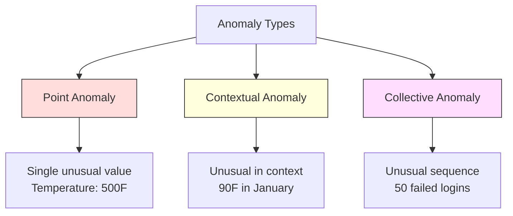
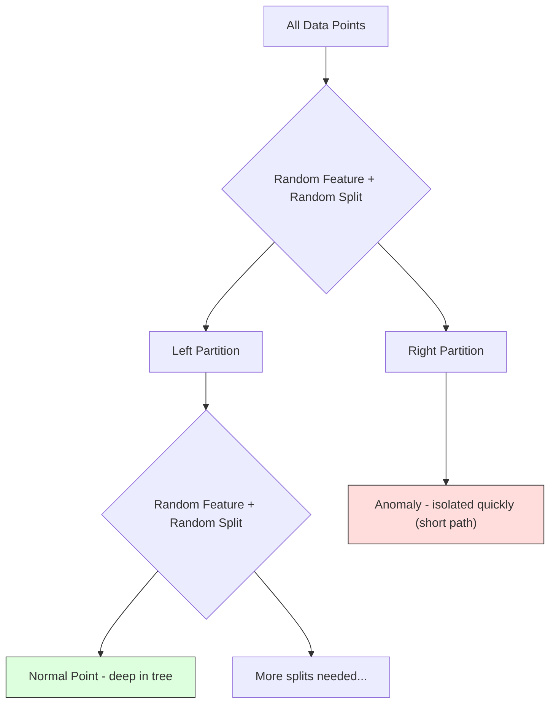
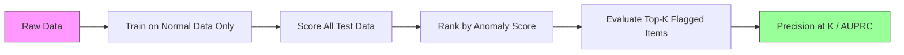

# تشخیص ناهنجاری

> تعریف کردن نرمال آسانه، غیر نرمال هرچیزی که مناسب نیست

**Type:** Build
**Language:**پیتون
**Prerequisites:** Phase 2, Lessons 01-09
**Time:** ~75 minutes

## اهداف یادگیری

- از ابتدا روش های تشخیص ز-سکور، IQR و انزوا در جنگل را اجرا کنید
- تفاوت بین ناهنجاری های نقطه ای، زمینه ای و جمعی را تشخیص دهید و روش تشخیص مناسب را برای هر یک از آنها انتخاب کنید.
- توضیح دهید که چرا تشخیص ناهنجاری به عنوان مدل سازی داده های معمولی به جای طبقه بندی ناهنجاری ها طراحی شده است
- مقایسه تشخیص غیر نظارت شده با طبقه بندی تحت نظارت و ارزیابی تعادل بین پوشش جدید و دقت

## مشکل

یک کارت اعتباری در نیویورک در ساعت ۲ بعد از ظهر و سپس در توکیو در ساعت ۲:۰۵ بعد از ظهر استفاده می شود. یک سنسور کارخانه زمانی که محدوده عادی 80 تا 120 است، 150 درجه را می خواند. یک سرور در ثانیه ۵۰ هزار درخواست را ارسال می کند وقتی متوسط روزانه ۲۰۰ است.

اينها ناهنجاري ها هستن. پيدا کردنشون مهمه. کلاهبرداري بيليون ها دلار ميخوره. خرابه تجهیزات زمان خاموشي ميخوره.

چالش: شما به ندرت نمونه های ناهنجاری را برچسب گذاری کرده اید. کلاهبرداری 0.1 درصد از معاملات را تشکیل می دهد. خرابی تجهیزات چند بار در سال اتفاق می افتد. شما نمی توانید یک طبقه بندی استاندارد را آموزش دهید چون تقریباً هیچ چیز در کلاس "غیر معمول" برای یادگیری نیست. حتی اگر شما برخی از برچسب ها را داشته باشید، ناهنجاری هایی که دیده اید تنها نوع هایی نیستند که شما با آنها روبرو خواهید شد. طرح کلاهبرداری فردا از امروز متفاوت به نظر می رسد.

تشخیص ناهنجاری مشکل را تغییر می دهد. به جای یادگیری آنچه غیر طبیعی است، یاد بگیرید که چه چیزی طبیعی است. هر چیزی که از معمول منحرف می شود مشکوک است. این بدون برچسب کار می کند، با انواع جدید ناهنجاری سازگار می شود و به مجموعه داده های گسترده مقیاس می یابد.

## مفهوم

### انواع ناهنجاری ها

همه ناهنجاری ها یکسان نیستند

- **Point anomalies.**یک نقطه داده ای که بدون توجه به زمینه غیر معمول است.$50,000 from an account that normally spends $۵۰ تا
- **Contextual anomalies.**يه نقطه داده که با توجه به سيستم آن غير معموله درجه حرارت 90 درجه در تابستان طبيعي است، در زمستان غير معموله ارزش مشابهي، سيستم متفاوت
- **Collective anomalies.**یک ردیف نقاط داده که به عنوان یک گروه غیر معمول است، حتی اگر هر نقطه فردی ممکن است طبیعی باشد. پنج شکست ورود طبیعی است. پنجاه در یک ردیف حمله نیروی خشن است.

اکثر روش ها ناهنجاری های نقطه ای را تشخیص می دهند. ناهنجاری های زمینه ای نیاز به ویژگی های زمان یا مکان دارند. ناهنجاری های جمعی نیاز به روش های آگاه به دنباله دارند.



### ساخت بدون نظارت

در طبقه بندی استاندارد، شما برای هر دو کلاس برچسب دارید. در تشخیص ناهنجاری، شما معمولاً یکی از سه موقعیت را دارید:

1. **Fully unsupervised.**هیچ برچسب ای نداره تو تمام داده ها رو روی دیتکتور قرار می دهی و امیدواریم ناهنجاری ها به اندازه کافی نادر باشند تا مدل "عادی" را خراب نکنند
2. **Semi-supervised.**شما یک مجموعه داده های پاک از داده های معمولی فقط دارید. شما در این مجموعه تمیز قرار می دهید و همه چیز دیگر را نمره می دهید. این قوی ترین تنظیمات است که ممکن است.
3. **Weakly supervised.**چندتا ناهنجاری با برچسب دارید ازشون برای ارزیابی استفاده کنید نه برای آموزش آموزش بدون نظارت و بعد دقت و بازپس گرفتن را بر روی زیر مجموعه با برچسب اندازه گیری کنید

نکته کلیدی: تشخیص ناهنجاری اساساً از طبقه بندی متفاوت است. شما توزیع داده های عادی را مدل می کنید، نه مرز تصمیم گیری بین دو کلاس.

### نظارت و نا نظارت: معامله

اگر شما علایم نامگذاری شده اید، آیا باید از آنها برای آموزش (تشکيل تحت نظارت) یا فقط برای ارزیابی (انتخاب بدون نظارت) استفاده کنید؟

**Supervised (treat as classification):**
- انواع معلولیت های دقیق را که قبلا دیده اید را می گیرد
- دقت بالاتر در انواع معروفه شناخته شده
- انواع جدید ناهنجاری را کاملاً از دست می دهد
- نیاز به آموزش مجدد در هنگام ظهور انواع جدید ناهنجاری
- نیاز به نمونه های ناکافی (معمولاً کمی)

**Unsupervised (model normal, flag deviations):**
- هر انحراف از نوع عادی را از جمله انواع جدید می گیرد
- نیاز به نامگذاری ناهنجاری ندارد
- نرخ مثبت دروغین بالاتر (همه چیز غیر معمول بد نیست)
- قوی تر به تغییر توزیع

در عمل، بهترین سیستم ها هر دو را ترکیب می کنند: تشخیص بدون نظارت برای پوشش گسترده، مدل های تحت نظارت برای انواع معروفه با اولویت بالا شناخته شده و بررسی انسانی برای موارد مبهم.

### روش Z-Score

ساده ترین روش: متوسط و انحراف استاندارد هر ویژگی را محاسبه کنید. هر نقطه بیش از k انحراف استاندارد از متوسط را نشان دهید.

```text
z_score = (x - mean) / std
anomaly if |z_score| > threshold
```

حد پیش فرض 3.0 است (99.7٪ از داده های معمولی در 3 انحراف استاندارد برای توزیع گاسسی قرار می گیرد).

**Strengths:**ساده، سریع، تفسیر پذیر (این مقدار 4.5 انحراف استاندارد از معمول است).

**Weaknesses:**فرض می کند که داده ها به طور معمول توزیع می شوند. حساس به متغیرات در داده های آموزش (متغیرات میانگین را تغییر می دهند و STD را افزایش می دهند، و تشخیص آنها را دشوار می کند).

**When it works well:**نظارت یک ویژگی که داده ها تقریبا به شکل زنگ است. زمان پاسخ سرور، تحمل تولید، خواندن سنسور با خط پایه پایدار.

**When it fails:**داده های چندگروه (دو محل دفتر با دمای پایه متفاوت) ، داده های منحرف (مبلغ معاملات که 1000 دلار نادر است اما غیر معمول نیست) ، داده هایی که با نرخ های غیر معمول در مجموعه آموزش هستند.

### روش IQR

از نمره زاد قوی تر است. از محدوده بین کوارتل به جای انحراف متوسط و استاندارد استفاده می کند.

```
Q1 = 25th percentile
Q3 = 75th percentile
IQR = Q3 - Q1
lower_bound = Q1 - factor * IQR
upper_bound = Q3 + factor * IQR
anomaly if x < lower_bound or x > upper_bound
```

فاکتور پیش فرض 1.5 است.

**Strengths:**با ثبات تا غیرمعمول (پاسخ ها تحت تأثیر ارزش های شدید قرار نمی گیرند) ، روی توزیع های منحرف کار می کند. هیچ فرضیه طبیعی نیست.

**Weaknesses:**تنها متغیر (به طور مستقل برای هر ویژگی اعمال می شود). نمی تواند ناهنجاری هایی را که غیر معمول هستند تنها زمانی که ویژگی ها را با هم در نظر گرفته می شود تشخیص دهد (یک نقطه ممکن است در هر ویژگی به طور جداگانه طبیعی باشد اما در فضای مشترک غیر معمول باشد).

**Practical note:**فاکتور 1.5 در IQR به ضربان در یک نقشه جعبه مطابقت دارد. نقاط خارج از ضربان دارای استثنا بالقوه هستند. استفاده از 3.0 به جای 1.5 باعث می شود که آشکارگر محافظه کارتر باشد (فلام های کمتر، مثبت های نادرست کمتر). فاکتور درست بستگی به تحمل شما برای هشدارهای نادرست دارد.

### جنگل های منزوی

نکته کلیدی: ناهنجاری ها کمی و متفاوت هستند. در تقسیم تصادفی داده ها، ناهنجاری ها آسان تر برای جدا کردن هستند -- برای جدا کردن آنها از بقیه، به تقسیم تصادفی کمتری نیاز دارند.



**How it works:**
1. درختان تصادفی بسیاری بسازید (درخت های منزوی)
2. در هر گره، یک ویژگی تصادفی و یک مقدار تقسیم تصادفی بین min و max ویژگی را انتخاب کنید
3. تا هر نقطه ای از خود جدا شود، تقسیم کنید
4. انومالی ها در طول مسیرهای میانگین تمام درختان کوتاه تر هستند

**Why it works:**نقاط عادی در مناطق کثافت زندگی می کنند. برای جدا کردن یک از همسایه های خود، بسیاری از تقسیم های تصادفی مورد نیاز است. انومالی ها در مناطق نادر زندگی می کنند. یک یا دو تقسیم تصادفی برای جدا کردن آنها کافی است.

نمره ناهنجاری بر اساس طول مسیر متوسط در تمام درختان است، که با طول مسیر انتظار می رود یک درخت جستجوی دوگانه تصادفی عادی می شود:

```
score(x) = 2^(-average_path_length(x) / c(n))
```

کجا`c(n)`طول مسیر انتظار می رود برای نمونه های n. امتیاز نزدیک به 1 به معنای ناهنجاری است. امتیاز نزدیک به 0.5 به معنای طبیعی است. امتیاز نزدیک به 0 به معنای بسیار طبیعی است (در خوشه های کثیف).

**Strengths:**هیچ فرضیه توزیع ای وجود ندارد. در ابعاد بالا کار می کند. مقیاس خوب (به عنوان نمونه زیر خطی است زیرا هر درخت از یک زیر نمونه استفاده می کند). انواع ویژگی های مخلوط را اداره می کند.

**Weaknesses:**مبارزه با ناهنجاری در مناطق کثافت (علاقه پنهان کردن) تقسیم تصادفی کمتر موثر است زمانی که بسیاری از ویژگی ها غیرمستقیم هستند.

**Key hyperparameters:**
- `n_estimators`تعداد درختان. 100 معمولا کافی است. درختان بیشتر نمره های پایدار تری را می دهند اما محاسبه کندتر است.
- `max_samples`تعداد نمونه ها در هر درخت. 256 در ورق اصلی است. ارزش های کوچکتر باعث می شود درخت های فردی دقیق تر باشند اما تنوع را افزایش دهند. نمونه گیری زیر چیزی است که جنگل انزوا را سریع می کند - هر درخت بخش کوچکی از داده ها را می بیند.
- `contamination`: فرقی انتظار می رود از ناهنجاری ها. تنها برای تعیین حد استفاده می شود. بر خود نمره ها تاثیر نمی گذارد.

### فاکتور خارجی محلی (LOF)

LOF تراکم محلی در اطراف یک نقطه را با تراکم اطراف همسایگان خود مقایسه می کند. یک نقطه در یک منطقه نادر و احاطه شده توسط مناطق تراکم غیر معمول است.

**How it works:**
1. برای هر نقطه، نزدیک ترین همسایه های k را پیدا کنید
2. تراکم دسترسی محلی را محاسبه کنید (چه تراکم محله است)
3. تراکم هر نقطه را با تراکم همسایه ها مقایسه کنید
4. اگر نقطه ای تراکم بسیار کمتری نسبت به همسایگانش داشته باشد، یک نقطه غیر قابل تشخیص است

**LOF score:**
- LOF نزدیک به 1.0 یعنی تراکم مشابه با همسایه ها (معمول)
- LOF بزرگتر از 1.0 یعنی تراکم کمتری نسبت به همسایه ها (ممکن است غیر طبیعی باشد)
- LOF بسیار بزرگتر از 1.0 (به عنوان مثال، 2.0+) به معنای تراکم قابل توجهی کمتر (ان anomaly احتمالی) است

بخش "مقامی" مهم است. مجموعه داده ای را با دو خوشه: یک خوشه باریک 1000 نقطه و یک خوشه کم 50 نقطه در نظر بگیرید. یک نقطه در لبه خوشه باریک جهانی غیر معمول نیست - 50 همسایه دارد. اما اگر همسایه های نزدیک آن از آن کثافت بیشتری داشته باشند، محلی غیر معمول است. LOF این رنگ را ضبط می کند که روش های جهانی از آن غافل می شوند.

**Strengths:**تشخیص ناهنجاری های محلی (نقطه هایی که در محله خود غیر معمول هستند، حتی اگر در سطح جهانی غیر معمول نباشند)

**Weaknesses:**در مجموعه داده های بزرگ کند (O  n ^ 2) برای پیاده سازی ساده) حساس به انتخاب k. در ابعاد بسیار بالا خوب کار نمی کند (لعنت ابعاد بر محاسبه فاصله تأثیر می گذارد).

### مقایسه

| Method | Assumptions | Speed | Handles High Dims | Detects Local Anomalies |
|--------|------------|-------|-------------------|------------------------|
| Z-score | Normal distribution | Very fast | Yes (per feature) | No |
| IQR | None (per feature) | Very fast | Yes (per feature) | No |
| Isolation Forest | None | Fast | Yes | Partially |
| LOF | Distance is meaningful | Slow | Poorly | Yes |

### چالش های ارزیابی

ارزیابی آشکارگرهای ناهنجاری سخت تر از ارزیابی طبقه بندی کننده ها است:

- **Extreme class imbalance.**با 0.1 درصد ناهنجاری، پیش بینی "عادي" برای همه چیز 99.9 درصد دقت را می دهد.
- **AUROC is misleading.**با عدم تعادل شدید، AUROC حتی زمانی که مدل بیشتر ناهنجاری ها را در حد عملی از دست می دهد، می تواند خوب به نظر برسد.
- **Better metrics:**Precision@k (از موارد بالا k نشان داده شده، چند انحراف واقعی وجود دارد) AUPRC (مناطق زیر منحنی بازخواهی دقیق) و بازخواهی با نرخ مثبت غلط ثابت.



### خط لوله تشخیص ناهنجاری

در عمل، تشخیص ناهنجاری به این جریان کار ادامه می دهد:

1. **Collect baseline data.**ایده آل، دوره ای که می دانید هیچ (یا بسیار کمی) ناهنجاری وجود ندارد.
2. **Feature engineering.**ویژگی های خام و ویژگی های مشتق (استاتتیک های چرخاندن، ویژگی های زمان، نسبت ها).
3. **Train the detector.**با داده های پایه مطابقت داره، مدل می فهمه که "عادي" چه شکلیه
4. **Score new data.**هر مشاهدي جديد نمره اي از ناهنجاري ميگيره
5. **Threshold selection.**این یک تصمیم تجاری است: حد بالاتر به معنای کمترین هشدار نادرست اما بیشتر ناهنجاری های نادیده گرفته شده است.
6. **Alert and investigate.**نقاط پرچمدار به بررسی انسان یا پاسخ خودکار میرسند.
7. **Feedback collection.**ثبت کنید که آیا موارد نشان داده شده غیرمستقیمتی های واقعی یا هشدارهای غلط بوده اند. از این داده ها برای ارزیابی آشکارگر استفاده کنید و حد زمانی را تنظیم کنید.

این خط لوله هرگز "به پایان نمی رسد". توزیع داده ها تغییر می کند، انواع جدید ناهنجاری ظاهر می شوند و آستانه ها نیاز به تنظیم دارند. تشخیص ناهنجاری را به عنوان یک سیستم زنده، نه یک مدل یک بارگرفتگی، نگاه کنید.

```figure
f3-anomaly-fence
```

## آن را بسازید

کد در`code/anomaly_detection.py`از صفر استفاده می کند از نمره Z، IQR و جنگل انزوا.

### ردیاب Z-Score

```python
def zscore_detect(X, threshold=3.0):
    mean = X.mean(axis=0)
    std = X.std(axis=0)
    std[std == 0] = 1.0
    z = np.abs((X - mean) / std)
    return z.max(axis=1) > threshold
```

ساده و متراکم شده. اگر هر ویژگی از حد عبور کند، یک نقطه را نشان می دهد.

### آشکارساز IQR

```python
def iqr_detect(X, factor=1.5):
    q1 = np.percentile(X, 25, axis=0)
    q3 = np.percentile(X, 75, axis=0)
    iqr = q3 - q1
    iqr[iqr == 0] = 1.0
    lower = q1 - factor * iqr
    upper = q3 + factor * iqr
    outside = (X < lower) | (X > upper)
    return outside.any(axis=1)
```

### جنگل از ابتدا

پیاده سازی از ابتدا درختان انزوا را ایجاد می کند که به طور تصادفی فضای ویژگی را تقسیم می کنند:

```python
class IsolationTree:
    def __init__(self, max_depth):
        self.max_depth = max_depth

    def fit(self, X, depth=0):
        n, p = X.shape
        if depth >= self.max_depth or n <= 1:
            self.is_leaf = True
            self.size = n
            return self
        self.is_leaf = False
        self.feature = np.random.randint(p)
        x_min = X[:, self.feature].min()
        x_max = X[:, self.feature].max()
        if x_min == x_max:
            self.is_leaf = True
            self.size = n
            return self
        self.threshold = np.random.uniform(x_min, x_max)
        left_mask = X[:, self.feature] < self.threshold
        self.left = IsolationTree(self.max_depth).fit(X[left_mask], depth + 1)
        self.right = IsolationTree(self.max_depth).fit(X[~left_mask], depth + 1)
        return self
```

طول مسیر برای جدا کردن یک نقطه نمره معادله اش را تعیین می کند. مسیرهای کوتاهتر به معنی معادله بیشتر است.

.`IsolationForest`کلاس بسته های درختان متعدد:

```python
class IsolationForest:
    def __init__(self, n_estimators=100, max_samples=256, seed=42):
        self.n_estimators = n_estimators
        self.max_samples = max_samples

    def fit(self, X):
        sample_size = min(self.max_samples, X.shape[0])
        max_depth = int(np.ceil(np.log2(sample_size)))
        for _ in range(self.n_estimators):
            idx = rng.choice(X.shape[0], size=sample_size, replace=False)
            tree = IsolationTree(max_depth=max_depth)
            tree.fit(X[idx])
            self.trees.append(tree)

    def anomaly_score(self, X):
        avg_path = average path length across all trees
        scores = 2.0 ** (-avg_path / c(max_samples))
        return scores
```

عامل عادی سازی`c(n)`طول مسیر انتظار می رود از یک جستجوی ناموفق در یک درخت جستجو دوگانه با n عنصر است. برابر است `2 * H(n-1) - 2*(n-1)/n`کجا`H`این نرمال سازی تضمین می کند که نمرات در مجموعه داده های اندازه های مختلف قابل مقایسه باشند.

### سناریوهای دمو

این کد چندین سناریوی آزمایش را تولید می کند:

1. **Single cluster with outliers.**يه خوشه دو بعدی گاسي با ناهنجاري ها که از مرکز دور تزريق شده
2. **Multimodal data.**سه دسته با اندازه و چگالی متفاوت. نقاط بین دسته ها غیرمعمول هستند. امتیاز Z به دلیل دامنه های هر ویژگی گسترده است.
3. **High-dimensional data.**50 ویژگی، اما ناهنجاری ها تنها در 5 مورد از آنها متفاوت است. آزمایش می کند که آیا روش ها می توانند ناهنجاری ها را در زیر مجموعه ای از ویژگی ها پیدا کنند.

هر نمایش تمام روش ها را با استفاده از دقت، بازپس، F1 و Precision@k مقایسه می کند.

## ازش استفاده کن

با sklearn (با استفاده از پیاده سازی کتابخانه، نه از ابتدا):

```python
from sklearn.ensemble import IsolationForest
from sklearn.neighbors import LocalOutlierFactor

iso = IsolationForest(n_estimators=100, contamination=0.05, random_state=42)
iso.fit(X_train)
predictions = iso.predict(X_test)

lof = LocalOutlierFactor(n_neighbors=20, contamination=0.05, novelty=True)
lof.fit(X_train)
predictions = lof.predict(X_test)
```

يادداشت`contamination`این مقدار کمی از آنمالی ها را تعیین می کند. تنظیم آن به درستی مهم است -- خیلی کم از آنمالی ها را از دست می دهد، خیلی بالا از آنالاری های غلط ایجاد می کند.

کد در`anomaly_detection.py`مقایسه اجرای از ابتدا با sklearn بر روی همان داده ها.

### پارامتر آلودگی sklearn

.`contamination`پارامتر در sklearn، حد برای تبدیل نمره های غیرمستقیم به پیش بینی های دوگانه را تعیین می کند.

```python
iso_5 = IsolationForest(contamination=0.05)
iso_10 = IsolationForest(contamination=0.10)
```

هر دو نمره همينه از معلوليت ها رو پيدا ميکنن`iso_5`5 درصد برتر را نشان می دهد و در حالی که`iso_10`اگر نرخ واقعی ناهنجاری را نمی دانید (به طور معمول نمی دانید) ، آلودگی را به "خود" تنظیم کنید و مستقیماً با نمرات خام کار کنید.

### یک کلاس SVM

یکی دیگر از آشکارگرهای غیر نظارت شده غیرمعمولی که ارزش دانستن دارد. یک کلاس SVM حدود حدود داده های معمولی را در یک فضای ویژگی های بالا بعدی (با استفاده از ترفند هسته) تنظیم می کند.

```python
from sklearn.svm import OneClassSVM

oc_svm = OneClassSVM(kernel="rbf", gamma="auto", nu=0.05)
oc_svm.fit(X_train)
predictions = oc_svm.predict(X_test)
```

.`nu`پارامتر نسبت به بخش معلولیت ها را نزدیک می کند. SVM یک کلاس در مجموعه داده های کوچک و متوسط خوب کار می کند اما به داده های بسیار بزرگ مقیاس نمی گیرد (ماتریک هسته به صورت مربع رشد می کند).

### روش خودکار کدگذاری (پیش نمایش)

آتوکودرها شبکه های عصبی هستند که یاد می گیرند داده ها را فشرده و بازسازی کنند. روی داده های عادی آموزش می دهند. در زمان آزمایش، ناهنجاری ها خطا بازسازی بالایی دارند زیرا شبکه فقط یاد می گیرد الگوهای طبیعی را بازسازی کند.

این موضوع در مرحله سوم (تعلّم عمیق) پوشش داده شده است، اما اصل همان است: مدل آنچه که طبیعی است، نشان دهید چه چیزی منحرف می شود.

### جمع آوری تشخیص ناهنجاری

درست مانند روش های مجموعه ای که طبقه بندی را بهبود می بخشد (درس ۱۱) ، ترکیب چندین آشکارگر غیر طبیعی، تشخیص را بهبود می بخشد. ساده ترین رویکرد:

1. چندین آشکارساز را اجرا کنید (Z-score، IQR، جنگل انزوا، LOF)
2. نمره های هر آشکارگر را به [0, 1] عادی کنید
3. متوسط نمرات عادی شده
4. نقاط پرچم بالاتر از حد در میانگین امتیاز

این باعث کاهش مثبت های غلط می شود زیرا روش های مختلف حالت های شکست متفاوتی دارند. نقطه ای که توسط هر چهار روش نشان داده می شود تقریباً مطمئناً غیرمعمول است. نقطه ای که تنها توسط یک روش نشان داده می شود ممکن است یک ویژگی از این روش باشد.

مجموعه های پیچیده تر وزن هر آشکارگر را با قابلیت اطمینان تخمین زده شده (که در مجموعه اعتبار با ناهنجاری های شناخته شده، اگر در دسترس باشد، اندازه گیری می شود) جمع می کنند.

### ملاحظات تولید

1. **Threshold drift.**با تغییر توزیع داده ها، یک حد ثابت قدیمی می شود.
2. **Alert fatigue.**بسیاری از هشدارهای غلط و اپراتورها توجه را متوقف می کنند. با یک حد بلند (احذارات کمتر و قابل اعتماد تر) شروع کنید و با افزایش اعتماد آن را کاهش دهید.
3. **Ensemble approach.**در تولید، چندین آشکارساز را ترکیب کنید. یک نقطه را تنها در صورتی نشان دهید که چندین روش موافق باشند غیرمنتظره است. این به طور قابل توجهی مثبت های غلط را کاهش می دهد.
4. **Feature engineering.**ویژگی های خام به ندرت کافی است. اضافه کردن آمار چرخاندن، نسبت، زمان از آخرین رویداد و ویژگی های خاص دامنه. یک ویژگی خوب مهم تر از انتخاب آشکارساز است.
5. **Feedback loop.**هنگامی که اپراتورها عناصر نشان داده شده را بررسی می کنند و آنها را تایید یا رد می کنند، این اطلاعات را به سیستم بازمی دهند. اطلاعات برچسب شده را در طول زمان برای ارزیابی و بهبود آشکارساز جمع آوری می کنند.

## -باده

این درس نتیجه می دهد:
- `outputs/skill-anomaly-detector.md`-- مهارت تصمیم گیری برای انتخاب آشکارساز مناسب
- `code/anomaly_detection.py`-- نمره Z، IQR، و جنگل انزوا از ابتدا، با مقایسه sklearn

### انتخاب یک حد

نمره ناهنجاری مستمر است. برای تصمیم گیری های دوگانه به یک حد نیاز دارید. این یک تصمیم تجاری است، نه یک تصمیم فنی.

به دو حالت فکر کنید:
- **Fraud detection.**گم شدن کلاهبرداری گران است (بازتداد هزینه، اعتماد مشتری) ، هشدارهای غلط به یک تحلیلگر انسانی 5 دقیقه برای تحقیق هزینه می کند. برای گرفتن کلاهبرداری بیشتر، آستانه را پایین بگذارید، هشدارهای غلط بیشتری را بپذیرید.
- **Equipment maintenance.**يه هشدار غلط به معنی توقف غير ضروري و هزینه اي$50,000. A missed failure means a $500 هزار تعمیرات، حدش رو تعیین کن تا این هزینه ها رو توازن بده

در هر دو مورد، حد مطلوب بستگی به نسبت هزینه بین مثبت های غلط و منفی های غلط دارد. دقت نقشه برداری و بازپسین در حد های مختلف، پوشش عملکرد هزینه و انتخاب حداقل نقطه هزینه.

### مقیاس بندی تا تولید

برای تشخیص ناهنجاری در زمان واقعی در تولید:

1. **Batch training, online scoring.**مدل را به صورت دوره ای (روزانه، هفتگی) با داده های عادی اخیر آموزش دهید. هر مشاهده جدید را در هنگام ورود به آن امتیاز دهید.
2. **Feature computation must match.**اگر شما با آمار در طول 30 روز آموزش داده اید، به 30 روز سابقه نیاز دارید تا ویژگی های یک مشاهده جدید را محاسبه کنید.
3. **Score distribution monitoring.**در طول زمان، توزیع نمرات غیرمعمولی را پیگیری کنید. اگر نمرات میانگین به سمت بالا حرکت کند، یا داده ها تغییر می کنند یا مدل قدیمی است.
4. **Explainability.**وقتی یک ناهنجاری را نشان می دهید، دلیلش را بگویید. نمره Z: "نمره X 4.2 انحراف استاندارد بالاتر از طبیعی است". جنگل انزوا: "این نقطه به طور متوسط در 3.1 تقسیم جدا شده است (نمره های طبیعی 8.5 است)".

## تمرینات

1. **Threshold tuning.**از دیتکتور Z-score با حدودی از 1.0 تا 5.0 در مراحل 0.5 اجرا کنید. دقت نقشه و بازپس گرفتن در هر حد. نقطه شیرین برای داده های شما کجاست؟

2. **Multivariate anomalies.**ایجاد داده های 2D که هر ویژگی به صورت جداگانه طبیعی به نظر می رسد، اما ترکیبی غیرمعمول است (به عنوان مثال، نقاط دور از دیگاکال کلستر اصلی). نشان دهید که نمره Z هر ویژگی از این موارد غافل می شود اما جنگل انزوا آنها را می گیرد.

3. **LOF from scratch.**فاکتور خارج از محل را با استفاده از k نزدیک ترین همسایه ها پیاده سازی کنید. با LocalOutlierFactor sklearn در همان داده ها مقایسه کنید. از k=10 و k=50 استفاده کنید - انتخاب k چگونه بر نتایج تاثیر می گذارد؟

4. **Streaming anomaly detection.**تغییر دهنده Z-score را برای کار در یک تنظیم جریان: متوسط اجرا و متغیر را با ورود نقاط جدید (الگوریتم آنلاین ویلفورد) به روز کنید. مقایسه با گروه Z-score بر روی همان داده ها.

5. **Real-world evaluation.**یک مجموعه داده با ناهنجاری های شناخته شده (به عنوان مثال کگل) را بگیرید. از هر چهار روش با استفاده از precision@100، precision@500 و AUPRC ارزیابی کنید. کدام روش بهتر کار می کند؟ چرا؟

## اصطلاحات کلیدی

| Term | What people say | What it actually means |
|------|----------------|----------------------|
| Anomaly | "Outlier, unusual point" | A data point that deviates significantly from the expected pattern of normal data |
| Point anomaly | "A single weird value" | An individual observation that is unusual regardless of context |
| Contextual anomaly | "Normal value, wrong context" | An observation that is unusual given its context (time, location, etc.) but might be normal in another context |
| Isolation Forest | "Random splits to find outliers" | An ensemble of random trees that isolates anomalies with fewer splits than normal points |
| Local Outlier Factor | "Compare density to neighbors" | A method that flags points whose local density is much lower than their neighbors' density |
| Z-score | "Standard deviations from mean" | (x - mean) / std, measuring how far a point is from the center in units of standard deviation |
| IQR | "Interquartile range" | Q3 - Q1, measuring the spread of the middle 50% of data, used for robust outlier detection |
| Contamination | "Expected fraction of anomalies" | A hyperparameter telling the detector what proportion of the data it should flag as anomalous |
| Precision@k | "Of the top k flags, how many are real" | Precision computed on only the k most suspicious points, useful for imbalanced anomaly detection |
| AUPRC | "Area under precision-recall curve" | A metric that summarizes precision-recall performance across all thresholds, better than AUROC for imbalanced data |

## خواندن بیشتر

- [Liu et al., Isolation Forest (2008)](https://cs.nju.edu.cn/zhouzh/zhouzh.files/publication/icdm08b.pdf)-- کاغذ اصلی جنگل انزوا
- [Breunig et al., LOF: Identifying Density-Based Local Outliers (2000)](https://dl.acm.org/doi/10.1145/342009.335388)-- کاغذ LOF اصلی
- [scikit-learn Outlier Detection docs](https://scikit-learn.org/stable/modules/outlier_detection.html)-- بررسي از تمام دستگاه هاي تشخیصي عوارض اسکلرن
- [Chandola et al., Anomaly Detection: A Survey (2009)](https://dl.acm.org/doi/10.1145/1541880.1541882)-- بررسی جامع روش های تشخیص ناهنجاری
- [Goldstein and Uchida, A Comparative Evaluation of Unsupervised Anomaly Detection Algorithms (2016)](https://journals.plos.org/plosone/article?id=10.1371/journal.pone.0152173)-- مقایسه تجربی از 10 روش در مجموعه داده های واقعی
