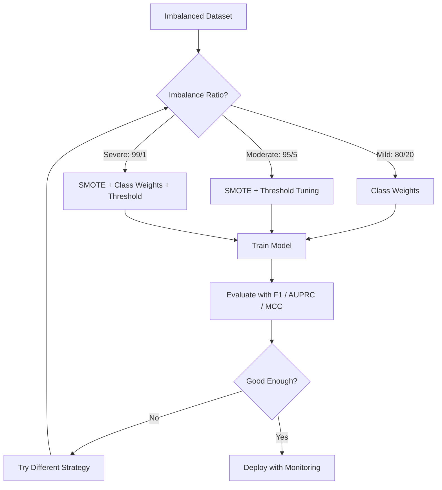
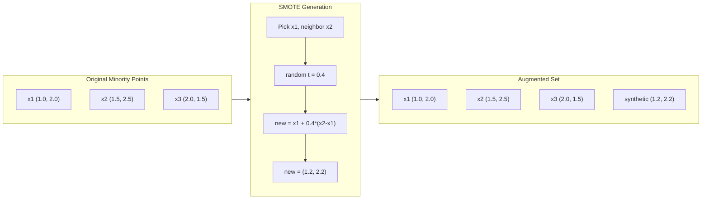
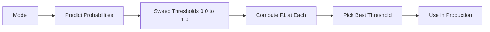
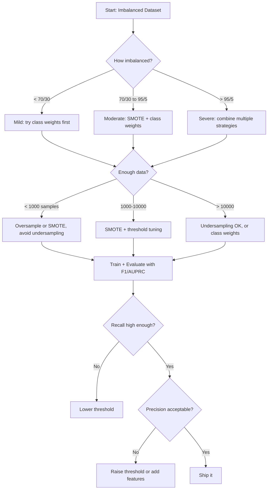

# مدیریت داده های نامتناسب

> وقتی 99 درصد اطلاعات شما "عادي" باشه، دقت دروغ است.

**Type:** Build
**Language:**پیتون
**Prerequisites:** Phase 2, Lessons 01-09 (especially evaluation metrics)
**Time:** ~90 minutes

## اهداف یادگیری

- از ابتدا SMOTE را پیاده سازی کنید و توضیح دهید که چگونه نمونه گیری بیش از حد مصنوعی از دوگانه تصادفی متفاوت است
- ارزیابی طبقه بندی کننده های نامتناسب با استفاده از ف1، AUPRC و متوس همبستگی ضریب به جای دقت
- مقایسه وزن کلاس، تنظیم حد و استراتژی های نمونه گیری مجدد و انتخاب رویکرد مناسب برای یک نسبت عدم تعادل داده شده
- ایجاد یک خط خط کامل داده های نامتناسب که ترکیب SMOTE، وزن کلاس و بهینه سازی حد را ترکیب کند

## مشکل

شما یک مدل شناسایی کلاهبرداری ایجاد می کنید، ۹۹.۹ درصد دقت دارد، جشن می برید، سپس متوجه می شوید که برای هر معامله ای پیش بینی "کلاهبرداری نیست".

این یک خطا نیست. این یک کار منطقی است که زمانی انجام شود که تنها 0.1٪ از معاملات کلاهبرداری است. مدل یاد می گیرد که همیشه حدس زدن کلاس اکثریت، خطای کلی را به حداقل می رساند. از نظر فنی درست و کاملا بی فایده است.

این اتفاق در همه جا اتفاق می افتد که در مورد طبقه بندی واقعی است. تشخیص بیماری: 1 درصد مثبت. نفوذ شبکه: 0.01 درصد حملات. نقص تولید: 0.5 درصد ناقص. فیلتر اسپام: 20 درصد اسپام. پیش بینی چرن: 5 درصد چرنر. طبقۀ اقلیت بیشتر نتیجه گیری می کند، به طور نادرتر است.

دقت شکست می خورد زیرا با همه پیش بینی های درست به طور یکسان برخورد می کند. برچسب گذاری صحیح یک معامله مشروع و شناسایی صحیح کلاهبرداری هر دو به عنوان یک نقطه دقت حساب می شوند. اما گرفتن کلاهبرداری دلیل اصلی وجود مدل است. ما به معیارهای، تکنیک ها و استراتژی های آموزشی نیاز داریم که مدل را مجبور به توجه به کلاس نادر اما مهم کند.

## مفهوم

### چرا دقت شکست می خورد

به مجموعه داده ای با 1000 نمونه فکر کنید: 990 منفی، 10 مثبت. یک مدل که همیشه منفی پیش بینی می کند:

|  | Predicted Positive | Predicted Negative |
|--|---|---|
| Actually Positive | 0 (TP) | 10 (FN) |
| Actually Negative | 0 (FP) | 990 (TN) |

دقت = (0 + 990) / 1000 = 99.0%

مدل صفر کلاهبرداری، صفر بیماری، صفر نقص، اما دقت 99 درصد میگه، به همین دلیل دقت برای مشکلات بی تعادل خطرناک است.

### متریک های بهتر

**Precision**= TP / (TP + FP). از همه چیز که به عنوان مثبت نشان داده شده، واقعاً چند تا هستند؟ دقت بالا به معنای کمترین هشدار نادرست است.

**Recall**= TP / (TP + FN). از همه چیز مثبت، چند تا را گرفتیم؟

**F1 Score**= 2 * دقت * یادآوری / (درست + یادآوری) متوسط هماهنگ. عدم تعادل شدید بین دقت و یادآوری را بیشتر از متوسط ریاضی مجازات می کند.

**F-beta Score**= (1 + بتا^2) * دقت * یادآوری / (beta^2 * دقت + یادآوری). وقتی بتا > 1 ، یادآوری مهم تر است. وقتی بتا < 1 ، دقت مهم تر است. F2 در تشخیص تقلب رایج است (تغییر گمشده بدتر از هشدار نادرست است).

**AUPRC**(جایۀ زیر منحنی دقت-بازگیره) مانند AUC-ROC اما اطلاعات بیشتری برای داده های نامتناسب دارد. یک طبقه بندی تصادفی AUPRC برابر با نرخ کلاس مثبت (نه 0.5 مانند ROC) دارد. این باعث می شود بهبود ها را مشاهده کند.

**Matthews Correlation Coefficient**= (TP * TN - FP * FN) / sqrt((TP+FP)(TP+FN)(TN+FP)(TN+FN)). از -1 تا +1 فاصله دارد. تنها زمانی نمره بالایی را می دهد که مدل در هر دو کلاس خوب انجام دهد. حتی زمانی که کلاس ها اندازه های بسیار متفاوتی دارند، متعادل است.

برای مدل "همیشه پیش بینی منفی" در بالا: دقت = 0/0 (غیر تعریف شده، اغلب به 0 تنظیم شده) ، یادآوری = 0/10 = 0, F1 = 0, MCC = 0. این متریکها به درستی مدل را به عنوان بی ارزش شناسایی می کنند.

### خط لوله داده های بی تعادل



### SMOTE: تکنیک نمونه گیری بیش از حد اقلیت مصنوعی

نمونه گیری تصادفی بیش از حد نمونه های موجود اقلیت را دوبرابر می کند. این کار می کند اما خطر بیش از حد مناسب است زیرا مدل نقاط یکسان را بارها و بارها می بیند.

SMOTE نمونه های اقلیت مصنوعی جدیدی ایجاد می کند که قابل قبول هستند اما کپی نیستند. الگوریتم:

1. برای هر نمونه اقلیت x، نزدیک ترین همسایه های k را در میان نمونه های دیگر اقلیت پیدا کنید
2. به طور تصادفی یه همسایه را انتخاب کن
3. یک نمونه جدید را در قطعه خط بین x و همسایه ایجاد کنید

فرمول: `new_sample = x + random(0, 1) * (neighbor - x)`

این بین نقاط اقلیت واقعی ارتباط برقرار می کند و نمونه هایی را در همان منطقه از فضای ویژگی ایجاد می کند بدون اینکه فقط داده های موجود را کپی کند.



### مقایسه استراتژی های نمونه گیری

**Random Oversampling**: نمونه های اقلیت دوگانه را برای مطابقت با تعداد اکثریت.
- مزایایی: ساده، بدون از دست دادن اطلاعات
- مزیت: دوگونی دقیق باعث بیش از حد مناسب شدن، زمان آموزش را افزایش می دهد

**Random Undersampling**: نمونه های اکثریت را برای مطابقت با تعداد اقلیت ها حذف کنید.
- مزاياي: آموزش سريع، ساده
- مزیت: داده های اکثریت بالقوه مفید را از بین می برد، تفاوت بالاتر

**SMOTE**: نمونه های اقلیت مصنوعی را از طریق انترپولاسیون ایجاد کنید.
- مزایایی: ایجاد نقاط داده جدید، کاهش بیش از حد مناسب در مقایسه با نمونه گیری تصادفی
- مزیت: می تواند نمونه های سر و صدا را در نزدیکی مرز تصمیم گیری ایجاد کند، توزیع کلاس اکثریت را در نظر نمی گیرد

| Strategy | Data Changed | Risk | When to Use |
|----------|-------------|------|-------------|
| Oversample | Minority duplicated | Overfitting | Small datasets, moderate imbalance |
| Undersample | Majority removed | Information loss | Large datasets, want fast training |
| SMOTE | Synthetic minority added | Boundary noise | Moderate imbalance, enough minority samples for k-NN |

### وزن کلاس

به جای تغییر داده ها، تغییر کنید که چگونه مدل با خطا ها برخورد می کند. وزن بیشتری را به طبقه بندی اشتباه طبقه بندی اقلیت اختصاص دهید.

برای یک مشکل دوگانه با 950 نمونه منفی و 50 نمونه مثبت:
- وزن برای کلاس منفی = n_samples / (2 * n_negative) = 1000 / (2 * 950) = 0.526
- وزن برای کلاس مثبت = n_samples / (2 * n_positive) = 1000 / (2 * 50) = 10.0

کلاس مثبت 19 برابر وزن دارد. اشتباه طبقه بندی یک نمونه مثبت هزینه های بسیار زیادی را به عنوان اشتباه طبقه بندی 19 نمونه منفی. مدل مجبور به توجه به کلاس اقلیت است.

در بازپسین لوژیستیک، این عملکرد از دست دادن را تغییر می دهد:

```
weighted_loss = -sum(w_i * [y_i * log(p_i) + (1-y_i) * log(1-p_i)])
```

جایی که w_i بستگی به کلاس نمونه i دارد.

وزن کلاس ریاضی معادل بیش از حد نمونه گیری در انتظار است، اما بدون ایجاد نقاط داده جدید. این باعث می شود آنها سریع تر و از خطر بیش از حد مناسب نمونه های تکراری جلوگیری شود.

### تنظیم حد

اکثر طبقه بندی کنندگان احتمال را تولید می کنند. حد پیش فرض 0.5 است: اگر P ((مثبت) >= 0.5، مثبت پیش بینی می شود. اما 0.5 تعسفی است. هنگامی که کلاس ها بی تعادل هستند، حد مطلوب معمولا بسیار پایین تر است.

پروسه:
1. آموزش یک مدل
2. احتمالات پیش بینی شده را در مجموعه اعتباربخشی بدست آورید
3. حدود پاکسازی از 0 تا 1.0
4. F1 را در هر حد محاسبه کنید (یا متریک انتخاب شده)
5. اون حد رو انتخاب کن که میتریک رو حداکثر کنه



یک مدل ممکن است P ((احتيال) = 0.15 برای یک معامله احتيال آمیز تولید کند. در حد 0.5 این به عنوان احتيال طبقه بندی نمی شود. در حد 0.10 به درستی دستگیر می شود. کالیبراسیون احتمال کمتر از رتبه بندی مهم است - تا زمانی که احتيال احتمال بیشتری نسبت به غیراحتيال داشته باشد، یک حد وجود دارد که آنها را از هم جدا می کند.

### یادگیری با هزینه های پایین

به جای هزینه های یکسانی، هزینه های اشتباه طبقه بندی خاص را اختصاص دهید:

| | Predict Positive | Predict Negative |
|--|---|---|
| Actually Positive | 0 (correct) | C_FN = 100 |
| Actually Negative | C_FP = 1 | 0 (correct) |

از دست دادن یک معامله جعلی (FN) 100 برابر بیشتر از یک هشدار نادرست (FP) هزینه می کند. مدل برای کل هزینه بهینه سازی می کند، نه برای کل تعداد خطا.

این اصل ترین رویکرد است که در آن می توانید هزینه های واقعی را تخمین بزنید. تشخیص سرطان که از دست رفته است، هزینه بسیار متفاوتی دارد از هشدار نادرستی که منجر به بیوپسی اضافی می شود. این هزینه ها را آشکار سازی می کند که تعادل های مناسب را ایجاد می کند.

### نمودار جریان تصمیم گیری



```figure
class-imbalance
```

## آن را بسازید

### مرحله اول: ایجاد مجموعه داده های نامتناسب

```python
import numpy as np


def make_imbalanced_data(n_majority=950, n_minority=50, seed=42):
    rng = np.random.RandomState(seed)

    X_maj = rng.randn(n_majority, 2) * 1.0 + np.array([0.0, 0.0])
    X_min = rng.randn(n_minority, 2) * 0.8 + np.array([2.5, 2.5])

    X = np.vstack([X_maj, X_min])
    y = np.concatenate([np.zeros(n_majority), np.ones(n_minority)])

    shuffle_idx = rng.permutation(len(y))
    return X[shuffle_idx], y[shuffle_idx]
```

### مرحله دوم: از ابتدا حذف کنید

```python
def euclidean_distance(a, b):
    return np.sqrt(np.sum((a - b) ** 2))


def find_k_neighbors(X, idx, k):
    distances = []
    for i in range(len(X)):
        if i == idx:
            continue
        d = euclidean_distance(X[idx], X[i])
        distances.append((i, d))
    distances.sort(key=lambda x: x[1])
    return [d[0] for d in distances[:k]]


def smote(X_minority, k=5, n_synthetic=100, seed=42):
    rng = np.random.RandomState(seed)
    n_samples = len(X_minority)
    k = min(k, n_samples - 1)
    synthetic = []

    for _ in range(n_synthetic):
        idx = rng.randint(0, n_samples)
        neighbors = find_k_neighbors(X_minority, idx, k)
        neighbor_idx = neighbors[rng.randint(0, len(neighbors))]
        t = rng.random()
        new_point = X_minority[idx] + t * (X_minority[neighbor_idx] - X_minority[idx])
        synthetic.append(new_point)

    return np.array(synthetic)
```

### مرحله سوم: نمونه گیری تصادفی بیش از حد و نمونه گیری کمتر

```python
def random_oversample(X, y, seed=42):
    rng = np.random.RandomState(seed)
    classes, counts = np.unique(y, return_counts=True)
    max_count = counts.max()

    X_resampled = list(X)
    y_resampled = list(y)

    for cls, count in zip(classes, counts):
        if count < max_count:
            cls_indices = np.where(y == cls)[0]
            n_needed = max_count - count
            chosen = rng.choice(cls_indices, size=n_needed, replace=True)
            X_resampled.extend(X[chosen])
            y_resampled.extend(y[chosen])

    X_out = np.array(X_resampled)
    y_out = np.array(y_resampled)
    shuffle = rng.permutation(len(y_out))
    return X_out[shuffle], y_out[shuffle]


def random_undersample(X, y, seed=42):
    rng = np.random.RandomState(seed)
    classes, counts = np.unique(y, return_counts=True)
    min_count = counts.min()

    X_resampled = []
    y_resampled = []

    for cls in classes:
        cls_indices = np.where(y == cls)[0]
        chosen = rng.choice(cls_indices, size=min_count, replace=False)
        X_resampled.extend(X[chosen])
        y_resampled.extend(y[chosen])

    X_out = np.array(X_resampled)
    y_out = np.array(y_resampled)
    shuffle = rng.permutation(len(y_out))
    return X_out[shuffle], y_out[shuffle]
```

### مرحله 4: بازپسین لوژیستی با وزنه های کلاس

```python
def sigmoid(z):
    return 1.0 / (1.0 + np.exp(-np.clip(z, -500, 500)))


def logistic_regression_weighted(X, y, weights, lr=0.01, epochs=200):
    n_samples, n_features = X.shape
    w = np.zeros(n_features)
    b = 0.0

    for _ in range(epochs):
        z = X @ w + b
        pred = sigmoid(z)
        error = pred - y
        weighted_error = error * weights

        gradient_w = (X.T @ weighted_error) / n_samples
        gradient_b = np.mean(weighted_error)

        w -= lr * gradient_w
        b -= lr * gradient_b

    return w, b


def compute_class_weights(y):
    classes, counts = np.unique(y, return_counts=True)
    n_samples = len(y)
    n_classes = len(classes)
    weight_map = {}
    for cls, count in zip(classes, counts):
        weight_map[cls] = n_samples / (n_classes * count)
    return np.array([weight_map[yi] for yi in y])
```

### مرحله 5: تنظیم حد

```python
def find_optimal_threshold(y_true, y_probs, metric="f1"):
    best_threshold = 0.5
    best_score = -1.0

    for threshold in np.arange(0.05, 0.96, 0.01):
        y_pred = (y_probs >= threshold).astype(int)
        tp = np.sum((y_pred == 1) & (y_true == 1))
        fp = np.sum((y_pred == 1) & (y_true == 0))
        fn = np.sum((y_pred == 0) & (y_true == 1))

        if metric == "f1":
            precision = tp / (tp + fp) if (tp + fp) > 0 else 0.0
            recall = tp / (tp + fn) if (tp + fn) > 0 else 0.0
            score = 2 * precision * recall / (precision + recall) if (precision + recall) > 0 else 0.0
        elif metric == "recall":
            score = tp / (tp + fn) if (tp + fn) > 0 else 0.0
        elif metric == "precision":
            score = tp / (tp + fp) if (tp + fp) > 0 else 0.0

        if score > best_score:
            best_score = score
            best_threshold = threshold

    return best_threshold, best_score
```

### مرحله 6: عملکردهای ارزیابی

```python
def confusion_matrix_values(y_true, y_pred):
    tp = np.sum((y_pred == 1) & (y_true == 1))
    tn = np.sum((y_pred == 0) & (y_true == 0))
    fp = np.sum((y_pred == 1) & (y_true == 0))
    fn = np.sum((y_pred == 0) & (y_true == 1))
    return tp, tn, fp, fn


def compute_metrics(y_true, y_pred):
    tp, tn, fp, fn = confusion_matrix_values(y_true, y_pred)
    accuracy = (tp + tn) / (tp + tn + fp + fn)
    precision = tp / (tp + fp) if (tp + fp) > 0 else 0.0
    recall = tp / (tp + fn) if (tp + fn) > 0 else 0.0
    f1 = 2 * precision * recall / (precision + recall) if (precision + recall) > 0 else 0.0

    denom = np.sqrt(float((tp + fp) * (tp + fn) * (tn + fp) * (tn + fn)))
    mcc = (tp * tn - fp * fn) / denom if denom > 0 else 0.0

    return {
        "accuracy": accuracy,
        "precision": precision,
        "recall": recall,
        "f1": f1,
        "mcc": mcc,
    }
```

### مرحله 7: تمام روش ها را مقایسه کنید

```python
X, y = make_imbalanced_data(950, 50, seed=42)
split = int(0.8 * len(y))
X_train, X_test = X[:split], X[split:]
y_train, y_test = y[:split], y[split:]

# Baseline: no treatment
w_base, b_base = logistic_regression_weighted(
    X_train, y_train, np.ones(len(y_train)), lr=0.1, epochs=300
)
probs_base = sigmoid(X_test @ w_base + b_base)
preds_base = (probs_base >= 0.5).astype(int)

# Oversampled
X_over, y_over = random_oversample(X_train, y_train)
w_over, b_over = logistic_regression_weighted(
    X_over, y_over, np.ones(len(y_over)), lr=0.1, epochs=300
)
preds_over = (sigmoid(X_test @ w_over + b_over) >= 0.5).astype(int)

# SMOTE
minority_mask = y_train == 1
X_minority = X_train[minority_mask]
synthetic = smote(X_minority, k=5, n_synthetic=len(y_train) - 2 * int(minority_mask.sum()))
X_smote = np.vstack([X_train, synthetic])
y_smote = np.concatenate([y_train, np.ones(len(synthetic))])
w_sm, b_sm = logistic_regression_weighted(
    X_smote, y_smote, np.ones(len(y_smote)), lr=0.1, epochs=300
)
preds_smote = (sigmoid(X_test @ w_sm + b_sm) >= 0.5).astype(int)

# Class weights
sample_weights = compute_class_weights(y_train)
w_cw, b_cw = logistic_regression_weighted(
    X_train, y_train, sample_weights, lr=0.1, epochs=300
)
probs_cw = sigmoid(X_test @ w_cw + b_cw)
preds_cw = (probs_cw >= 0.5).astype(int)

# Threshold tuning (tune on held-out validation set, not test set)
probs_val = sigmoid(X_val @ w_cw + b_cw)
best_thresh, best_f1 = find_optimal_threshold(y_val, probs_val, metric="f1")
preds_thresh = (probs_cw >= best_thresh).astype(int)
```

فایل کد همه این ها را در یک اسکریپت اجرا می کند و نتایج را چاپ می کند.

## ازش استفاده کن

با یادگیری سکیت و یادگیری نامتوازن، این تکنیک ها یک خط هستند:

```python
from sklearn.linear_model import LogisticRegression
from sklearn.metrics import classification_report, f1_score
from sklearn.model_selection import train_test_split
from imblearn.over_sampling import SMOTE
from imblearn.under_sampling import RandomUnderSampler
from imblearn.pipeline import Pipeline

X_train, X_test, y_train, y_test = train_test_split(X, y, stratify=y)

model_weighted = LogisticRegression(class_weight="balanced")
model_weighted.fit(X_train, y_train)
print(classification_report(y_test, model_weighted.predict(X_test)))

smote = SMOTE(random_state=42)
X_resampled, y_resampled = smote.fit_resample(X_train, y_train)
model_smote = LogisticRegression()
model_smote.fit(X_resampled, y_resampled)
print(classification_report(y_test, model_smote.predict(X_test)))

pipeline = Pipeline([
    ("smote", SMOTE()),
    ("model", LogisticRegression(class_weight="balanced")),
])
pipeline.fit(X_train, y_train)
print(classification_report(y_test, pipeline.predict(X_test)))
```

در این مرحله، این روش به طور دقیق به هر یک از تکنیک ها اشاره می کند. SMOTE فقط یک ک-این-این است که در کلاس اقلیت ها به کار گرفته می شود. وزن کلاس ها از دست دادن را چند برابر می کند. تنظیم حد حد یک حلقه برای قطع کردن است. هیچ جادویی وجود ندارد.

## -باده

این درس نتیجه می دهد:
- `outputs/skill-imbalanced-data.md`-- یک لیست چک تصمیم گیری برای رسیدگی به مشکلات طبقه بندی نامتناسب

## تمرینات

1. **Borderline-SMOTE**: تغییر در اجرای SMOTE به طوری که فقط نمونه های مصنوعی برای نقاط اقلیت که در نزدیکی مرز تصمیم گیری هستند تولید شود (آن هایی که نزدیک ترین همسایه k آنها شامل نمونه های کلاس اکثریت است). نتایج را با SMOTE استاندارد در مجموعه داده ای که کلاس ها همپوشان هستند مقایسه کنید.

2. **Cost matrix optimization**: یادگیری حساس به هزینه را در جایی که ماتریس هزینه یک پارامتر است اجرا کنید. یک تابع ایجاد کنید که یک ماتریس هزینه را بگیرد و پیش بینی های مطلوب را که هزینه انتظار می رود را به حداقل رسانی می رساند. با نسبت های هزینه های مختلف (1:10, 1:100, 1:1000) تست کنید و نشان دهید که چگونه تعادل دقیق-بازتماس تغییر می کند.

3. **Threshold calibration**: پیاده سازی مقیاس Platt (تخفیف لوژیستیکی را در خروجی خام مدل برای تولید احتمالات کالیبر شده) مقایسه کنید پیش از کالیبر و پس از کالیبر. نشان دهید که کالیبر تغییر رتبه بندی نمی کند (AUC یکسان است) اما احتمالات را معنی دار تر می کند.

4. **Ensemble with balanced bagging**: آموزش چندین مدل، هر کدام بر روی یک نمونه با توازن (همه اقلیت + زیر مجموعه تصادفی اکثریت) است. پیش بینی های آنها را میانگین کنید. این رویکرد را با یک مدل واحد با SMOTE مقایسه کنید. عملکرد و تفاوت در میان اجراها را اندازه گیری کنید.

5. **Imbalance ratio experiment**: یک مجموعه داده های متعادل را بگیرید و نسبت عدم تعادل را به تدریج افزایش دهید (50/50, 70/30, 90/10, 95/5, 99/1). برای هر نسبت، با و بدون SMOTE تمرین کنید. نسبت F1 در مقابل عدم تعادل برای هر دو رویکرد. SMOTE در چه نسبت شروع به ایجاد تفاوت معنی دار می کند؟

## اصطلاحات کلیدی

| Term | What people say | What it actually means |
|------|----------------|----------------------|
| Class imbalance | "One class has way more samples" | The distribution of classes in the dataset is significantly skewed, causing models to favor the majority class |
| SMOTE | "Synthetic oversampling" | Creates new minority samples by interpolating between existing minority samples and their k-nearest minority neighbors |
| Class weights | "Making errors on rare classes more expensive" | Multiplying the loss function by class-specific weights so the model penalizes minority misclassification more heavily |
| Threshold tuning | "Moving the decision boundary" | Changing the probability cutoff for classification from the default 0.5 to a value that optimizes the desired metric |
| Precision-recall tradeoff | "You cannot have both" | Lowering the threshold catches more positives (higher recall) but also flags more false positives (lower precision), and vice versa |
| AUPRC | "Area under the PR curve" | Summarizes the precision-recall curve into a single number; more informative than AUC-ROC when classes are heavily imbalanced |
| Matthews Correlation Coefficient | "The balanced metric" | A correlation between predicted and actual labels that produces a high score only when the model performs well on both classes |
| Cost-sensitive learning | "Different mistakes cost different amounts" | Incorporating real-world misclassification costs into the training objective so the model optimizes for total cost, not error count |
| Random oversampling | "Duplicate the minority" | Repeating minority class samples to balance class counts; simple but risks overfitting to duplicated points |

## خواندن بیشتر

- [SMOTE: Synthetic Minority Over-sampling Technique (Chawla et al., 2002)](https://arxiv.org/abs/1106.1813)-- مقاله اصلی SMOTE، هنوز هم بیشترین ذکر شده در مورد یادگیری نامتوازن
- [Learning from Imbalanced Data (He & Garcia, 2009)](https://ieeexplore.ieee.org/document/5128907)-- بررسی جامع شامل نمونه گیری، روش های حساس به هزینه و الگوریتم
- [imbalanced-learn documentation](https://imbalanced-learn.org/stable/)-- کتابخانه پایتون با انواع SMOTE، استراتژی های زیر نمونه سازی و ادغام خط لوله
- [The Precision-Recall Plot Is More Informative than the ROC Plot (Saito & Rehmsmeier, 2015)](https://journals.plos.org/plosone/article?id=10.1371/journal.pone.0118432)-- چه زمانی و چرا برای مشکلات عدم تعادل، منحنیات روابط عمومی را بر روی منحنیات ROC ترجیح دهیم
