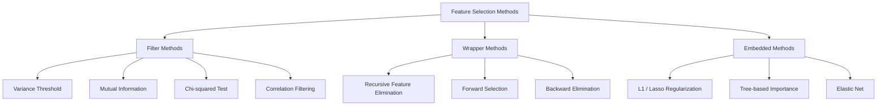
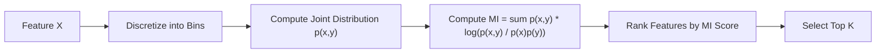
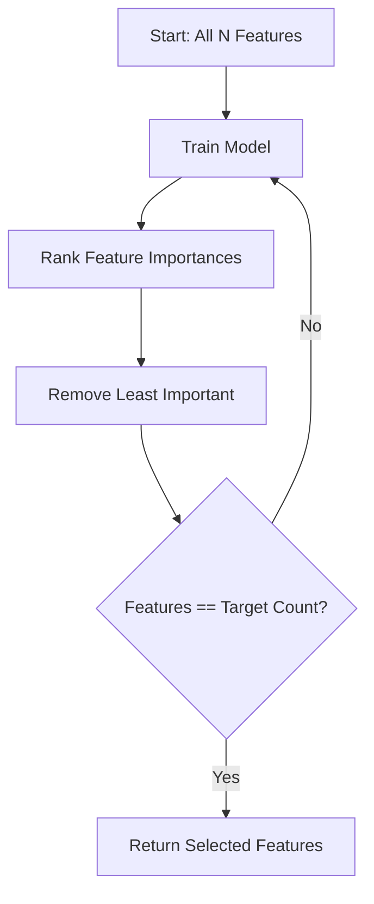
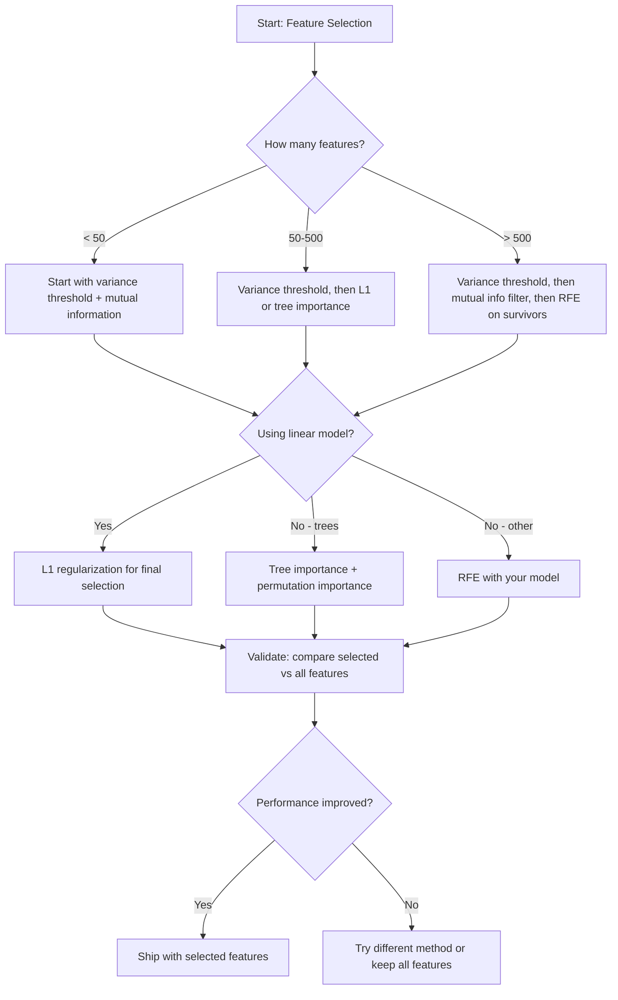

# انتخاب ویژگی

> ویژگی های بیشتر بهتر نیست، ویژگی های درست بهتر است.

**Type:** Build
**Language:**پیتون
**Prerequisites:** Phase 2, Lessons 01-09, 08 (feature engineering)
**Time:** ~75 minutes

## اهداف یادگیری

- از ابتدا روش های فیلتر (حرم تغییرات، اطلاعات متقابل، چِ- مربع) و روش های بسته بندی (RFE، انتخاب جلو) را پیاده سازی کنید.
- توضیح دهید که چرا اطلاعات متقابل روابط غیر خطی را با ویژگی های هدف که ارتباط را از دست می دهد، ضبط می کند
- مقایسه تنظیم L1 (انتخاب داخلی) با RFE (انتخاب بسته بندی) و ارزیابی تعادل های محاسباتی آنها
- ایجاد یک خط انتخاب ویژگی که چندین روش را ترکیب می کند و نشان می دهد که عمومی سازی بهتر در داده های نگه داشته شده است

## مشکل

شما 500 ویژگی دارید. مدل شما به آرامی آموزش می گیرد، به طور مداوم بیش از حد می گذرد، و هیچ کس نمی تواند آنچه را که آموخته است را توضیح دهد. شما ویژگی های بیشتری را اضافه می کنید به امید بهبود عملکرد. بدتر می شود.

این لعنت ابعاد در عمل است. به عنوان تعداد ویژگی ها افزایش می یابد، حجم فضای ویژگی ها منفجر می شود. نقاط داده کم می شوند. فاصله بین نقاط به هم می پیوندد. مدل به طور نمایی داده های بیشتری برای یافتن الگوهای واقعی نیاز دارد. ویژگی های سر و صدا ویژگی های سیگنال را غرق می کنند. بیش از حد تبدیل به پیش فرض می شود.

انتخاب ویژگی ها داروی ضدعفونی است. شور را دور کنید. تخفیف را دور کنید. ویژگی هایی را نگه دارید که اطلاعات واقعی در مورد هدف را حمل می کنند. نتیجه: آموزش سریعتر، عمومی سازی بهتر و مدل هایی که می توانید واقعا توضیح دهید.

هدف استفاده از تمام اطلاعات موجود نیست بلکه استفاده از اطلاعات درست است.

## مفهوم

### سه دسته از انتخاب ویژگی

هر روش انتخاب ویژگی به یکی از سه دسته تعلق می گیرد:



**Filter methods**هر ویژگی را با استفاده از یک اندازه گیری آماری مستقل ارزیابی کنید. آنها از یک مدل استفاده نمی کنند. سریع، اما تعاملات ویژگی را از دست می دهند.

**Wrapper methods**آنها عملکرد مدل را به عنوان امتیاز استفاده می کنند. نتایج بهتر، اما گران است زیرا آنها مدل را بارها و بارها آموزش می دهند.

**Embedded methods**انتخاب ویژگی ها به عنوان بخشی از آموزش مدل. تنظیم L1 وزنه ها را به صفر می رساند. درختان تصمیم بر روی مفیدترین ویژگی ها تقسیم می شوند. انتخاب در هنگام نصب اتفاق می افتد، نه به عنوان یک مرحله جداگانه.

### حد اختلاف

ساده ترین فیلتر. اگر ویژگی ای در میان نمونه ها به سختی متفاوت باشد، تقریباً هیچ اطلاعاتی را در خود ندارد.

به یک ویژگی که 0.0 برای 999 از 1000 نمونه است، توجه کنید. تفاوت آن نزدیک به صفر است. هیچ مدل نمی تواند از آن برای تشخیص کلاس ها استفاده کند. آن را حذف کنید.

```
variance(x) = mean((x - mean(x))^2)
```

یک حد (به عنوان مثال، 0.01) تنظیم کنید. هر ویژگی با تفاوت زیر آن را رها کنید. این ویژگی های ثابت یا نزدیک به ثابت را بدون نگاه به متغیر هدف حذف می کند.

زمانی که باید از آن استفاده کرد: به عنوان یک مرحله پیش پردازش قبل از سایر روش ها. این به طور واضح ویژگی های بی فایده را با هزینه نزدیک به صفر می گیرد.

محدودیت: یک ویژگی می تواند دارای تفاوت زیاد و هنوز هم صدا خالص باشد.

### اطلاعات متقابل

اطلاعات متقابل اندازه گیری می کند که چقدر دانستن ارزش ویژگی X عدم اطمینان در مورد هدف Y را کاهش می دهد.

```
I(X; Y) = sum_x sum_y p(x, y) * log(p(x, y) / (p(x) * p(y)))
```

اگر X و Y مستقل باشند، p(x، y) = p(x) * p(y) ، پس اصطلاح ثبت صفر است و I(X؛ Y) = 0. هرچه X بیشتر درباره Y به شما بگوید، اطلاعات متقابل بالاتر است.

مزیت اصلی بر روی ارتباط: اطلاعات متقابل روابط غیر خطی را ضبط می کند. یک ویژگی ممکن است ارتباط صفر با هدف داشته باشد اما اطلاعات متقابل بالا است زیرا رابطه مربع یا دوره ای است.

برای ویژگی های مداوم، ابتدا به سطل ها (تقدیر مبتنی بر هیستogram) امتیاز دهید. تعداد سطل ها بر تخمین تاثیر می گذارد - بیش از حد تعداد سطل ها اطلاعات را از دست می دهند، بیش از حد تعداد سطل ها صدا اضافه می کنند. یک انتخاب رایج: مربع ((n) سطل ها یا قانون استرجز (1 + log2 ((n)).



### حذف ویژگی مکرر (RFE)

RFE یک روش بسته بندی است. از اهمیت ویژگی های یک مدل برای برش تکراری استفاده می کند:

1. مدل رو با تمام ویژگی ها آموزش بده
2. ویژگی های رتبه بندی به لحاظ اهمیت (عادلات برای مدل های خطی، کاهش آلودگی برای درختان)
3. کمترین ویژگی مهم را حذف کنید
4. تا زمانی که تعداد مطلوب ویژگی ها باقی بماند تکرار کنید



RFE تعاملات ویژگی ها را در نظر می گیرد زیرا مدل تمام ویژگی های باقیمانده را با هم می بیند. حذف یک ویژگی اهمیت سایر ویژگی ها را تغییر می دهد. این باعث می شود که آن را دقیق تر از روش های فیلتر کند.

هزینه: شما مدل N را آموزش می دهید - زمان هدف. با 500 ویژگی و هدف 10 ، این 490 تمرین است. برای مدل های گران قیمت ، این آهسته است. شما می توانید با حذف چندین ویژگی در هر مرحله (به عنوان مثال ، حذف پایین 10٪ هر دور) آن را تسریع کنید.

### L1 (لاسسو) تنظیم

تنظیم L1 ارزش مطلق وزن را به تابع از دست دادن اضافه می کند:

```
loss = prediction_error + alpha * sum(|w_i|)
```

پارامتر آلفا کنترل می کند که چه طور پرتیجنتانه ویژگی ها را برش می دهند. آلفا بالاتر به معنای وزن بیشتر به صفر می رسد.

چرا دقیقا صفر؟ مجازات L1 یک منطقه محدود در شکل الماس در فضای وزن ایجاد می کند. راه حل بهینه تمایل به فرود در گوشه ای از این الماس دارد، جایی که یک یا چند وزن صفر هستند. تنظیم L2 (سنگ) یک محدودیت دایره ای ایجاد می کند که در آن وزن ها کوچک می شوند اما به ندرت به صفر می رسند.

این انتخاب ویژگی های داخلی است: مدل در طول آموزش یاد می گیرد که چه ویژگی هایی را نادیده بگیرد. ویژگی های با وزن صفر به طور موثر حذف می شوند.

مزایا: یک دوره آموزشی، کنترل ویژگی های مرتبط (یک را انتخاب می کند و صفر را دیگر) ، ساخته شده در اکثر پیاده سازی مدل خطی.

محدودیت: فقط برای مدل های خطی کار می کند. نمی تواند اهمیت ویژگی های غیر خطی را ضبط کند.

### اهمیت ویژگی درختان

درختان تصمیم و مجموعه های آنها (درست های تصادفی، افزایش گرادینت) به طور طبیعی ویژگی های مرتب می شوند. هر تقسیم باعث کاهش آلودگی می شود (Gini یا entropy برای طبقه بندی، انحراف برای بازگشت). ویژگی هایی که باعث کاهش آلودگی بزرگتر می شوند مهم تر هستند.

برای جنگل تصادفی با درختان T:

```
importance(feature_j) = (1/T) * sum over all trees of
    sum over all nodes splitting on feature_j of
        (n_samples * impurity_decrease)
```

این یک نمره اهمیت عادی برای هر ویژگی را می دهد. این روابط غیر خطی و تعاملات ویژگی را به طور خودکار اداره می کند.

توجه: اهمیت درختان به سمت ویژگی هایی با بسیاری از ارزش های منحصر به فرد (کاردینالیتی بالا) طرفدار است. یک ستون ID تصادفی مهم به نظر می رسد زیرا به طور کامل هر نمونه را تقسیم می کند. از اهمیت تغییر به عنوان یک بررسی عقل استفاده کنید.

### اهمیت تغییر

یک روش مدل-آگنوستیک:

1. آموزش مدل و ثبت عملکرد خط پایه بر روی داده های اعتبار
2. برای هر ویژگی: به طور تصادفی مقادیر آن را مخلوط کنید، کاهش عملکرد را اندازه گیری کنید
3. هرچه قطره بزرگتر باشه، ویژگی مهم تر ميشه

اگر تغییر یک ویژگی به عملکرد آسیب نپذیرد، مدل به آن وابسته نیست. اگر عملکرد سقوط کند، این ویژگی حیاتی است.

اهمیت تغییر در جهت گیری در مورد اهمیت درختان جلوگیری می کند. اما آهسته است: یک ارزیابی کامل برای هر ویژگی، چندین بار برای ثبات تکرار می شود.

### جدول مقایسه

| Method | Type | Speed | Nonlinear | Feature Interactions |
|--------|------|-------|-----------|---------------------|
| Variance threshold | Filter | Very fast | No | No |
| Mutual information | Filter | Fast | Yes | No |
| Correlation filter | Filter | Fast | No | No |
| RFE | Wrapper | Slow | Depends on model | Yes |
| L1 / Lasso | Embedded | Fast | No (linear) | No |
| Tree importance | Embedded | Medium | Yes | Yes |
| Permutation importance | Model-agnostic | Slow | Yes | Yes |

### نمودار جریان تصمیم گیری



```figure
f3-feature-prune
```

## آن را بسازید

### مرحله 1: تولید داده های مصنوعی با ساختار ویژگی شناخته شده

```python
import numpy as np


def make_feature_selection_data(n_samples=500, seed=42):
    rng = np.random.RandomState(seed)

    x1 = rng.randn(n_samples)
    x2 = rng.randn(n_samples)
    x3 = rng.randn(n_samples)
    x4 = x1 + 0.1 * rng.randn(n_samples)
    x5 = x2 + 0.1 * rng.randn(n_samples)

    informative = np.column_stack([x1, x2, x3, x4, x5])

    correlated = np.column_stack([
        x1 * 0.9 + 0.1 * rng.randn(n_samples),
        x2 * 0.8 + 0.2 * rng.randn(n_samples),
        x3 * 0.7 + 0.3 * rng.randn(n_samples),
        x1 * 0.5 + x2 * 0.5 + 0.1 * rng.randn(n_samples),
        x2 * 0.6 + x3 * 0.4 + 0.1 * rng.randn(n_samples),
    ])

    noise = rng.randn(n_samples, 10) * 0.5

    X = np.hstack([informative, correlated, noise])
    y = (2 * x1 - 1.5 * x2 + x3 + 0.5 * rng.randn(n_samples) > 0).astype(int)

    feature_names = (
        [f"info_{i}" for i in range(5)]
        + [f"corr_{i}" for i in range(5)]
        + [f"noise_{i}" for i in range(10)]
    )

    return X, y, feature_names
```

ما حقیقت اصلی را می دانیم: ویژگی های 0-4 اطلاعاتی هستند (به علاوه 3 و 4 نسخه های مرتبط با 0 و 1) ، ویژگی های 5-9 با ویژگی های اطلاعاتی مرتبط هستند، ویژگی های 10-19 صداهای خالص هستند. یک روش انتخاب خوب باید رتبه 0-4 بالاترین و 10-19 پایین ترین را داشته باشد.

### مرحله دوم: حد اختلاف

```python
def variance_threshold(X, threshold=0.01):
    variances = np.var(X, axis=0)
    mask = variances > threshold
    return mask, variances
```

### مرحله سوم: اطلاعات متقابل (مخفوف)

```python
def discretize(x, n_bins=10):
    min_val, max_val = x.min(), x.max()
    if max_val == min_val:
        return np.zeros_like(x, dtype=int)
    bin_edges = np.linspace(min_val, max_val, n_bins + 1)
    binned = np.digitize(x, bin_edges[1:-1])
    return binned


def mutual_information(X, y, n_bins=10):
    n_samples, n_features = X.shape
    mi_scores = np.zeros(n_features)

    y_vals, y_counts = np.unique(y, return_counts=True)
    p_y = y_counts / n_samples

    for f in range(n_features):
        x_binned = discretize(X[:, f], n_bins)
        x_vals, x_counts = np.unique(x_binned, return_counts=True)
        p_x = dict(zip(x_vals, x_counts / n_samples))

        mi = 0.0
        for xv in x_vals:
            for yi, yv in enumerate(y_vals):
                joint_mask = (x_binned == xv) & (y == yv)
                p_xy = np.sum(joint_mask) / n_samples
                if p_xy > 0:
                    mi += p_xy * np.log(p_xy / (p_x[xv] * p_y[yi]))
        mi_scores[f] = mi

    return mi_scores
```

### مرحله چهارم: حذف ویژگی تکراری

```python
def simple_logistic_importance(X, y, lr=0.1, epochs=100):
    n_samples, n_features = X.shape
    w = np.zeros(n_features)
    b = 0.0

    for _ in range(epochs):
        z = X @ w + b
        pred = 1.0 / (1.0 + np.exp(-np.clip(z, -500, 500)))
        error = pred - y
        w -= lr * (X.T @ error) / n_samples
        b -= lr * np.mean(error)

    return w, b


def rfe(X, y, n_features_to_select=5, lr=0.1, epochs=100):
    n_total = X.shape[1]
    remaining = list(range(n_total))
    rankings = np.ones(n_total, dtype=int)
    rank = n_total

    while len(remaining) > n_features_to_select:
        X_subset = X[:, remaining]
        w, _ = simple_logistic_importance(X_subset, y, lr, epochs)
        importances = np.abs(w)

        least_idx = np.argmin(importances)
        original_idx = remaining[least_idx]
        rankings[original_idx] = rank
        rank -= 1
        remaining.pop(least_idx)

    for idx in remaining:
        rankings[idx] = 1

    selected_mask = rankings == 1
    return selected_mask, rankings
```

### مرحله 5: انتخاب ویژگی L1

```python
def soft_threshold(w, alpha):
    return np.sign(w) * np.maximum(np.abs(w) - alpha, 0)


def l1_feature_selection(X, y, alpha=0.1, lr=0.01, epochs=500):
    n_samples, n_features = X.shape
    w = np.zeros(n_features)
    b = 0.0

    for _ in range(epochs):
        z = X @ w + b
        pred = 1.0 / (1.0 + np.exp(-np.clip(z, -500, 500)))
        error = pred - y

        gradient_w = (X.T @ error) / n_samples
        gradient_b = np.mean(error)

        w -= lr * gradient_w
        w = soft_threshold(w, lr * alpha)
        b -= lr * gradient_b

    selected_mask = np.abs(w) > 1e-6
    return selected_mask, w
```

### مرحله 6: اهمیت درخت (درخت تصمیم گیری ساده)

```python
def gini_impurity(y):
    if len(y) == 0:
        return 0.0
    classes, counts = np.unique(y, return_counts=True)
    probs = counts / len(y)
    return 1.0 - np.sum(probs ** 2)


def best_split(X, y, feature_idx):
    values = np.unique(X[:, feature_idx])
    if len(values) <= 1:
        return None, -1.0

    best_threshold = None
    best_gain = -1.0
    parent_gini = gini_impurity(y)
    n = len(y)

    for i in range(len(values) - 1):
        threshold = (values[i] + values[i + 1]) / 2.0
        left_mask = X[:, feature_idx] <= threshold
        right_mask = ~left_mask

        n_left = np.sum(left_mask)
        n_right = np.sum(right_mask)

        if n_left == 0 or n_right == 0:
            continue

        gain = parent_gini - (n_left / n) * gini_impurity(y[left_mask]) - (n_right / n) * gini_impurity(y[right_mask])

        if gain > best_gain:
            best_gain = gain
            best_threshold = threshold

    return best_threshold, best_gain


def tree_importance(X, y, n_trees=50, max_depth=5, seed=42):
    rng = np.random.RandomState(seed)
    n_samples, n_features = X.shape
    importances = np.zeros(n_features)

    for _ in range(n_trees):
        sample_idx = rng.choice(n_samples, size=n_samples, replace=True)
        feature_subset = rng.choice(n_features, size=max(1, int(np.sqrt(n_features))), replace=False)

        X_boot = X[sample_idx]
        y_boot = y[sample_idx]

        tree_imp = _build_tree_importance(X_boot, y_boot, feature_subset, max_depth)
        importances += tree_imp

    total = importances.sum()
    if total > 0:
        importances /= total

    return importances


def _build_tree_importance(X, y, feature_subset, max_depth, depth=0):
    n_features = X.shape[1]
    importances = np.zeros(n_features)

    if depth >= max_depth or len(np.unique(y)) <= 1 or len(y) < 4:
        return importances

    best_feature = None
    best_threshold = None
    best_gain = -1.0

    for f in feature_subset:
        threshold, gain = best_split(X, y, f)
        if gain > best_gain:
            best_gain = gain
            best_feature = f
            best_threshold = threshold

    if best_feature is None or best_gain <= 0:
        return importances

    importances[best_feature] += best_gain * len(y)

    left_mask = X[:, best_feature] <= best_threshold
    right_mask = ~left_mask

    importances += _build_tree_importance(X[left_mask], y[left_mask], feature_subset, max_depth, depth + 1)
    importances += _build_tree_importance(X[right_mask], y[right_mask], feature_subset, max_depth, depth + 1)

    return importances
```

### مرحله 7: تمام روش ها را اجرا کنید و مقایسه کنید

فایل کد تمام پنج روش را در یک مجموعه داده های مصنوعی اجرا می کند و یک جدول مقایسه ای را چاپ می کند که نشان می دهد هر روش چه ویژگی هایی را انتخاب می کند.

## ازش استفاده کن

با scikit-learn، انتخاب ویژگی ها به خط لوله ساخته شده است:

```python
from sklearn.feature_selection import (
    VarianceThreshold,
    mutual_info_classif,
    RFE,
    SelectFromModel,
)
from sklearn.linear_model import Lasso, LogisticRegression
from sklearn.ensemble import RandomForestClassifier

vt = VarianceThreshold(threshold=0.01)
X_filtered = vt.fit_transform(X)

mi_scores = mutual_info_classif(X, y)
top_k = np.argsort(mi_scores)[-10:]

rfe_selector = RFE(LogisticRegression(), n_features_to_select=10)
rfe_selector.fit(X, y)
X_rfe = rfe_selector.transform(X)

lasso_selector = SelectFromModel(Lasso(alpha=0.01))
lasso_selector.fit(X, y)
X_lasso = lasso_selector.transform(X)

rf = RandomForestClassifier(n_estimators=100)
rf.fit(X, y)
importances = rf.feature_importances_
```

پیاده سازی های از ابتدا دقیقاً نشان می دهد که در داخل هر روش چه اتفاق می افتد.`var(X, axis=0)`و استفاده از ماسک. اطلاعات متقابل شمارش فرکانس های مفصل و حاشیه ای در یک جدول حوادث است. RFE یک حلقه است که قطار، رتبه و کج است. L1 کاهش گرادینت با یک گام نرم است. اهمیت درخت کاهش کثافت در میان تقسیم ها را جمع می کند. هیچ جادویی - فقط آمار و حلقه ها.

نسخه های sklearn قابلیت تقویت را اضافه می کنند (به عنوان مثال mutual_info_classif از تخمین تراکم k-NN به جای bining استفاده می کند) ، سرعت (تطبيقات C) و ادغام لوله.

## -باده

این درس نتیجه می دهد:
- `outputs/skill-feature-selector.md`-- یک درخت تصمیم گیری سریع برای انتخاب روش انتخاب ویژگی مناسب

## تمرینات

1. **Forward selection**: برعکس RFE را اجرا کنید. با صفر ویژگی شروع کنید. در هر مرحله، ویژگی ای را اضافه کنید که بیشترین بهبود عملکرد مدل را ایجاد می کند. هنگام اضافه کردن ویژگی ها دیگر کمک نمی کند. ویژگی های انتخاب شده را با نتایج RFE مقایسه کنید. کدام یک سریعتر است؟ کدام یک نتایج بهتری را می دهد؟

2. **Stability selection**: انتخاب ویژگی L1 را 50 بار اجرا کنید، هر بار بر روی یک نمونه فرعی تصادفی 80٪ از داده ها، با ارزش های آلفا کمی متفاوت. شمارش کنید که چقدر اغلب هر ویژگی انتخاب می شود. ویژگی های انتخاب شده در > 80٪ از اجراها "ثابت" هستند. ویژگی های پایدار را با انتخاب L1 یک بار مقایسه کنید. کدام یک قابل اعتماد تر است؟

3. **Multicollinearity detection**: حساب متیکس ارتباط برای همه ویژگی ها. اجرای یک تابع که با توجه به یک حد ارتباط (به عنوان مثال 0.9) یک ویژگی را از هر جفت بسیار مرتبط حذف می کند (از آن جفت با اطلاعات متقابل بالاتر با هدف حفظ می شود). آزمایش روی مجموعه داده های مصنوعی و تأیید آن ویژگی های مرتبط اضافی را حذف می کند.

4. **Feature selection pipeline**: حد حد اختلاف زنجیره ای، فیلتر اطلاعات متقابل و RFE در یک لوله. ابتدا ویژگی های تقریبا صفر متغیر را حذف کنید، سپس 50٪ را با اطلاعات متقابل نگه دارید، سپس RFE را روی بقایای زنده نگه دارید. این لوله را با اجرای RFE تنها در تمام ویژگی ها مقایسه کنید. آیا لوله سریع تر است؟ آیا به همان اندازه دقیق است؟

5. **Permutation importance from scratch**: اهمیت تغییر را اجرا کنید. برای هر ویژگی، ارزش های آن را 10 بار مخلوط کنید، کاهش متوسط در نمره F1 را اندازه گیری کنید. رتبه بندی را با اهمیت مبتنی بر درخت مقایسه کنید. موارد را پیدا کنید که در آن اختلاف نظر دارند و دلیل آن را توضیح دهید (توصیه: ویژگی های مرتبط).

## اصطلاحات کلیدی

| Term | What people say | What it actually means |
|------|----------------|----------------------|
| Filter method | "Score features independently" | A feature selection approach that ranks features using a statistical measure without training a model, evaluating each feature in isolation |
| Wrapper method | "Use the model to pick features" | A feature selection approach that evaluates feature subsets by training a model and using its performance as the selection criterion |
| Embedded method | "The model selects features during training" | Feature selection that happens as part of model fitting, such as L1 regularization driving weights to zero |
| Mutual information | "How much one variable tells you about another" | A measure of the reduction in uncertainty about Y given knowledge of X, capturing both linear and nonlinear dependencies |
| Recursive Feature Elimination | "Train, rank, prune, repeat" | An iterative wrapper method that trains a model, removes the least important feature(s), and repeats until a target count is reached |
| L1 / Lasso regularization | "Penalty that kills features" | Adding the sum of absolute weight values to the loss function, which drives unimportant feature weights to exactly zero |
| Variance threshold | "Remove constant features" | Dropping features whose variance across samples falls below a specified threshold, filtering out features that carry no information |
| Feature importance | "Which features matter most" | A score indicating how much each feature contributes to model predictions, computed from split gains (trees) or coefficient magnitudes (linear) |
| Permutation importance | "Shuffle and measure the damage" | Evaluating feature importance by randomly shuffling each feature's values and measuring the resulting drop in model performance |
| Curse of dimensionality | "Too many features, not enough data" | The phenomenon where adding features increases the volume of the feature space exponentially, making data sparse and distances meaningless |

## خواندن بیشتر

- [An Introduction to Variable and Feature Selection (Guyon & Elisseeff, 2003)](https://jmlr.org/papers/v3/guyon03a.html)-- بررسی اساسی روش های انتخاب ویژگی ها، هنوز به طور گسترده ای مورد توجه قرار می گیرد
- [scikit-learn Feature Selection Guide](https://scikit-learn.org/stable/modules/feature_selection.html)-- مرجع عملی برای روش های فیلتر، بسته بندی و ورودی با نمونه های کد
- [Stability Selection (Meinshausen & Buhlmann, 2010)](https://arxiv.org/abs/0809.2932)-- ترکیب نمونه گیری زیر با انتخاب ویژگی برای نتایج قوی و قابل تکرار
- [Beware Default Random Forest Importances (Strobl et al., 2007)](https://bmcbioinformatics.biomedcentral.com/articles/10.1186/1471-2105-8-25)-- نشان می دهد که تعصب کاردینالیتی در اهمیت درختان و پیشنهاد اهمیت مشروط به عنوان یک جایگزین
