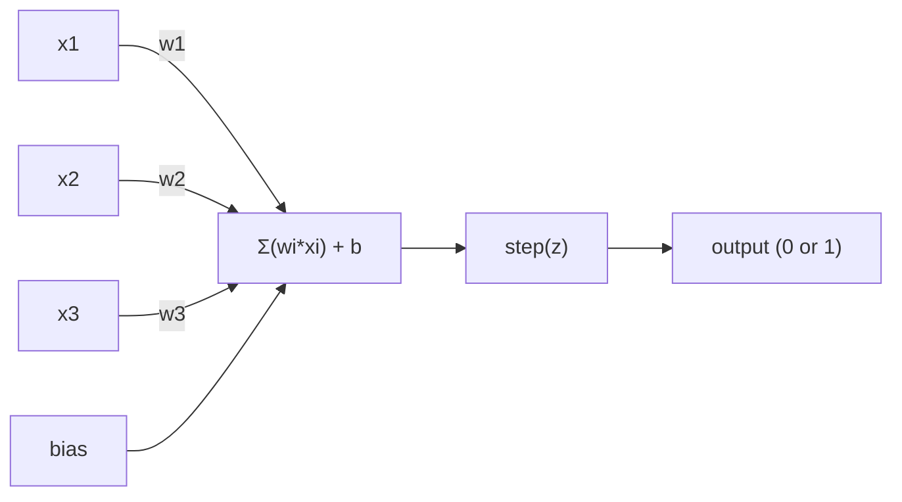
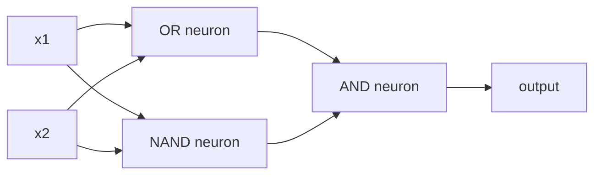

# پرسپترون

> درکترون اتم شبکه های عصبی است. آن را باز کنید و وزن، تعصب و تصمیم می گیرید.

**Type:** Build
**Languages:** Python
**Prerequisites:** Phase 1 (Linear Algebra Intuition)
**Time:** ~60 minutes

## اهداف یادگیری

- پیاده سازی یک perceptron از ابتدا در پایتون، از جمله قانون به روز رسانی وزن و تابع فعال سازی مرحله
- توضیح دهید که چرا یک perceptron تنها می تواند مشکلات جدا کننده خطی را حل کند و مورد شکست XOR را نشان دهد
- ساخت یک پرسپرتون چند لایه با ترکیب دروازه های OR، NAND و AND برای حل XOR
- آموزش شبکه دو لایه با فعال سازی sigmoid و backpropagation برای یادگیری XOR به طور خودکار

## مشکل

شما متری و محصولات نقطه ای را می شناسید. می دانید که یک ماتریکس ورودی را به ورودی تبدیل می کند. اما چگونه یک ماشین یاد می گیرد که چه تحولاتی را استفاده کند؟

درکترون به این پاسخ می دهد. ساده ترین ماشین یادگیری ممکن است: چند ورودی را بگیرید، با وزن ضرب کنید، یک تعصب اضافه کنید و یک تصمیم دوگانه بگیرید. سپس تنظیم کنید. این تمام است. هر شبکه عصبی ساخته شده لایه ای از این ایده است که به هم بسته شده است.

درک درکترون به معنای درک آنچه که "تعلم" در واقع در کد معنی دارد: تنظیم اعداد تا زمانی که محصول با واقعیت مطابقت داشته باشد.

## مفهوم

### یک نورون، یک تصمیم

یک پرسپرتون n ورودی را می گیرد، هر یک را با وزن ضرب می کند، آنها را جمع می کند، یک تعصب اضافه می کند و نتیجه را از طریق یک تابع فعال سازی منتقل می کند.



تابع مرحله ای بی رحمانه است: اگر مقدار وزن شده به علاوه تعصب >=0 باشد، خروجی 1. در غیر این صورت خروجی 0.

```
step(z) = 1  if z >= 0
           0  if z < 0
```

این یک طبقه بندی خطی است. وزنه ها و تعصب یک خط (یا یک سطح بالا در ابعاد بالاتر) را تعریف می کنند که فضای ورودی را به دو منطقه تقسیم می کند.

### مرز تصمیم گیری

برای دو ورودی، پرسپرتون یک خط را از طریق فضای دو بعدی می کشد:

```
  x2
  ┤
  │  Class 1        /
  │    (0)          /
  │                /
  │               / w1·x1 + w2·x2 + b = 0
  │              /
  │             /     Class 2
  │            /        (1)
  ┼───────────/──────────── x1
```

هر چیزی که در یک طرف خط است، 0 تولید می کند. هر چیزی که در طرف دیگر است، 1 تولید می کند. آموزش این خط را حرکت می دهد تا به درستی کلاس ها را جدا کند.

### قانون یادگیری

قانون یادگیری درکتون ساده است:

```
For each training example (x, y_true):
    y_pred = predict(x)
    error = y_true - y_pred

    For each weight:
        w_i = w_i + learning_rate * error * x_i
    bias = bias + learning_rate * error
```

اگر پیش بینی درست باشد، خطا = 0، هیچ تغییری نمی کند. اگر پیش بینی 0 باشد اما باید 1 باشد، وزنه ها افزایش می یابد. اگر پیش بینی 1 باشد اما باید 0 باشد، وزنه ها کاهش می یابد. نرخ یادگیری کنترل می کند که هر تنظیم چقدر بزرگ است.

### مشکل XOR

اينجوري شکسته ميشه ببينيد اين دروازه هاي منطقيه

```
AND gate:           OR gate:            XOR gate:
x1  x2  out         x1  x2  out         x1  x2  out
0   0   0           0   0   0           0   0   0
0   1   0           0   1   1           0   1   1
1   0   0           1   0   1           1   0   1
1   1   1           1   1   1           1   1   0
```

AND و OR به صورت خطی قابل جداسازی هستند: می توانید یک خط واحد را برای جدا کردن 0s از 1s بکشید. XOR نیست. هیچ خط واحد نمی تواند [0,1] و [1,0] را از [0,0] و [1,1] جدا کند.

```
AND (separable):        XOR (not separable):

  x2                      x2
  1 ┤  0     1            1 ┤  1     0
    │     /                 │
  0 ┤  0 / 0              0 ┤  0     1
    ┼──/──────── x1         ┼──────────── x1
       line works!          no single line works!
```

این یک محدودیت اساسی است. یک درکترون تنها می تواند مشکلات خطی جدا کننده را حل کند. مینسکی و پاپرت این را در سال 1969 ثابت کردند و تقریباً تحقیقات شبکه های عصبی را برای یک دهه نابود کرد.

راه حل: پرسپرتون ها را به لایه ها جمع کنید. یک پرسپرتون چند لایه می تواند XOR را با ترکیب دو تصمیم خطی به یک تصمیم غیر خطی حل کند.

```figure
perceptron-boundary
```

## آن را بسازید

### مرحله اول: کلاس پرسپترون

```python
class Perceptron:
    def __init__(self, n_inputs, learning_rate=0.1):
        self.weights = [0.0] * n_inputs
        self.bias = 0.0
        self.lr = learning_rate

    def predict(self, inputs):
        total = sum(w * x for w, x in zip(self.weights, inputs))
        total += self.bias
        return 1 if total >= 0 else 0

    def train(self, training_data, epochs=100):
        for epoch in range(epochs):
            errors = 0
            for inputs, target in training_data:
                prediction = self.predict(inputs)
                error = target - prediction
                if error != 0:
                    errors += 1
                    for i in range(len(self.weights)):
                        self.weights[i] += self.lr * error * inputs[i]
                    self.bias += self.lr * error
            if errors == 0:
                print(f"Converged at epoch {epoch + 1}")
                return
        print(f"Did not converge after {epochs} epochs")
```

### مرحله دوم: آموزش دروازه های منطق

```python
and_data = [
    ([0, 0], 0),
    ([0, 1], 0),
    ([1, 0], 0),
    ([1, 1], 1),
]

or_data = [
    ([0, 0], 0),
    ([0, 1], 1),
    ([1, 0], 1),
    ([1, 1], 1),
]

not_data = [
    ([0], 1),
    ([1], 0),
]

print("=== AND Gate ===")
p_and = Perceptron(2)
p_and.train(and_data)
for inputs, _ in and_data:
    print(f"  {inputs} -> {p_and.predict(inputs)}")

print("\n=== OR Gate ===")
p_or = Perceptron(2)
p_or.train(or_data)
for inputs, _ in or_data:
    print(f"  {inputs} -> {p_or.predict(inputs)}")

print("\n=== NOT Gate ===")
p_not = Perceptron(1)
p_not.train(not_data)
for inputs, _ in not_data:
    print(f"  {inputs} -> {p_not.predict(inputs)}")
```

### مرحله 3: مشاهده شکست XOR

```python
xor_data = [
    ([0, 0], 0),
    ([0, 1], 1),
    ([1, 0], 1),
    ([1, 1], 0),
]

print("\n=== XOR Gate (single perceptron) ===")
p_xor = Perceptron(2)
p_xor.train(xor_data, epochs=1000)
for inputs, expected in xor_data:
    result = p_xor.predict(inputs)
    status = "OK" if result == expected else "WRONG"
    print(f"  {inputs} -> {result} (expected {expected}) {status}")
```

اين دليل سختي است که يک پرسپرتون نمي تونه XOR رو ياد بگيره

### مرحله 4: XOR را با دو لایه حل کنید

راه حل: XOR = (x1 OR x2) و نه (x1 AND x2)



```python
def xor_network(x1, x2):
    or_neuron = Perceptron(2)
    or_neuron.weights = [1.0, 1.0]
    or_neuron.bias = -0.5

    nand_neuron = Perceptron(2)
    nand_neuron.weights = [-1.0, -1.0]
    nand_neuron.bias = 1.5

    and_neuron = Perceptron(2)
    and_neuron.weights = [1.0, 1.0]
    and_neuron.bias = -1.5

    hidden1 = or_neuron.predict([x1, x2])
    hidden2 = nand_neuron.predict([x1, x2])
    output = and_neuron.predict([hidden1, hidden2])
    return output


print("\n=== XOR Gate (multi-layer network) ===")
for inputs, expected in xor_data:
    result = xor_network(inputs[0], inputs[1])
    print(f"  {inputs} -> {result} (expected {expected})")
```

همه چهار مورد درست است. جمع کردن پرسپرتون ها به لایه ها مرز تصمیم گیری را ایجاد می کند که هیچ پرسپرتون ای نمی تواند تولید کند.

### مرحله پنجم: شبکه دو لایه ای را آموزش دهید

مرحله 4 وزن ها را به دست متصل کرد. این برای XOR کار می کند، اما برای مشکلات واقعی که وزن های صحیح را از پیش نمی دانید، کارساز: عملکرد مرحله را با sigmoid جایگزین کنید و وزن ها را به طور خودکار از طریق پخش عقب یاد بگیرید.

```python
class TwoLayerNetwork:
    def __init__(self, learning_rate=0.5):
        import random
        random.seed(0)
        self.w_hidden = [[random.uniform(-1, 1), random.uniform(-1, 1)] for _ in range(2)]
        self.b_hidden = [random.uniform(-1, 1), random.uniform(-1, 1)]
        self.w_output = [random.uniform(-1, 1), random.uniform(-1, 1)]
        self.b_output = random.uniform(-1, 1)
        self.lr = learning_rate

    def sigmoid(self, x):
        import math
        x = max(-500, min(500, x))
        return 1.0 / (1.0 + math.exp(-x))

    def forward(self, inputs):
        self.inputs = inputs
        self.hidden_outputs = []
        for i in range(2):
            z = sum(w * x for w, x in zip(self.w_hidden[i], inputs)) + self.b_hidden[i]
            self.hidden_outputs.append(self.sigmoid(z))
        z_out = sum(w * h for w, h in zip(self.w_output, self.hidden_outputs)) + self.b_output
        self.output = self.sigmoid(z_out)
        return self.output

    def train(self, training_data, epochs=10000):
        for epoch in range(epochs):
            total_error = 0
            for inputs, target in training_data:
                output = self.forward(inputs)
                error = target - output
                total_error += error ** 2

                d_output = error * output * (1 - output)

                saved_w_output = self.w_output[:]
                hidden_deltas = []
                for i in range(2):
                    h = self.hidden_outputs[i]
                    hd = d_output * saved_w_output[i] * h * (1 - h)
                    hidden_deltas.append(hd)

                for i in range(2):
                    self.w_output[i] += self.lr * d_output * self.hidden_outputs[i]
                self.b_output += self.lr * d_output

                for i in range(2):
                    for j in range(len(inputs)):
                        self.w_hidden[i][j] += self.lr * hidden_deltas[i] * inputs[j]
                    self.b_hidden[i] += self.lr * hidden_deltas[i]
```

```python
net = TwoLayerNetwork(learning_rate=2.0)
net.train(xor_data, epochs=10000)
for inputs, expected in xor_data:
    result = net.forward(inputs)
    predicted = 1 if result >= 0.5 else 0
    print(f"  {inputs} -> {result:.4f} (rounded: {predicted}, expected {expected})")
```

دو تفاوت کلیدی از مرحله ۴. اول، سیگمائید جایگزین تابع مرحله می شود -- هموار است، بنابراین گرادینت ها وجود دارند. دوم، `train`روش انتشار خطای عقب از خروجی به لایه پنهان، تنظیم هر وزن متناسب با سهم آن به خطای. این به عقب گسترش در 20 خط است.

اين پل به درس سومه.`d_output`و`hidden_deltas`قانون زنجیره ای که روی نمودار شبکه اعمال می شود.

## ازش استفاده کن

همه چيزي که از ابتدا ساخته بودي در يک واردات وجود داره

```python
from sklearn.linear_model import Perceptron as SkPerceptron
import numpy as np

X = np.array([[0,0],[0,1],[1,0],[1,1]])
y = np.array([0, 0, 0, 1])

clf = SkPerceptron(max_iter=100, tol=1e-3)
clf.fit(X, y)
print([clf.predict([x])[0] for x in X])
```

پنج خط، 30 خط تو`Perceptron`کلاس کار مشابهی می کند. نسخه sklearn بررسی های تقارب، عملکردهای تلف چندگانه و پشتیبانی ورودی کمی را اضافه می کند - اما حلقه اصلی یکسان است: مقدار وزن شده، عملکرد مرحله، بروز رسانی وزن در مورد خطا.

شکاف واقعی در مقیاس ظاهر می شود. چه تغییرات در شبکه های تولید:

- تابع مرحله ای تبدیل به سیگمائید، ReLU، یا دیگر فعال سازی های صاف می شود
- وزن ها به صورت خودکار از طریق پخش عقب (درسی 03) آموخته می شوند.
- لایه ها عمیق تر می شوند: 3، 10، 100+ لایه
- همان اصل برقرار است: هر لایه ویژگی های جدیدی از خروجی لایه قبلی ایجاد می کند

فقط يک پرسپرتون مي تونه خطوط مستقيم رو رسم کنه و مي تونه هر شکل رو رسم کنه

## -باده

این درس نتیجه می دهد:
- `outputs/skill-perceptron.md`- مهارت هایی که زمانی که معماری های یک لایه و چند لایه مورد نیاز است را پوشش می دهد

## تمرینات

1. یک پرسپرتون را روی یک دروازه NAND (دروازه جهانی - هر مدار منطقی می تواند از NAND ساخته شود) آموزش دهید. وزن و تعصب آن را یک مرز تصمیم گیری معتبر تشکیل دهید.
2. کلاس Perceptron را تغییر دهید تا مرز تصمیم گیری (w1*x1 + w2*x2 + b = 0) را در هر دوره ردیابی کنید.
3. یک perceptron 3 input را بسازید که تنها زمانی که حداقل 2 از 3 input 1 (یک تابع رای اکثریت) باشد، 1 را تولید کند. آیا این به صورت خطی قابل جداسازی است؟ چرا؟

## اصطلاحات کلیدی

| Term | What people say | What it actually means |
|------|----------------|----------------------|
| Perceptron | "A fake neuron" | A linear classifier: dot product of inputs and weights, plus bias, through a step function |
| Weight | "How important an input is" | A multiplier that scales each input's contribution to the decision |
| Bias | "The threshold" | A constant that shifts the decision boundary, letting the perceptron fire even with zero inputs |
| Activation function | "The thing that squishes values" | A function applied after the weighted sum - step function for perceptrons, sigmoid/ReLU for modern networks |
| Linearly separable | "You can draw a line between them" | A dataset where a single hyperplane can perfectly separate the classes |
| XOR problem | "The thing perceptrons can't do" | Proof that single-layer networks cannot learn non-linearly-separable functions |
| Decision boundary | "Where the classifier switches" | The hyperplane w*x + b = 0 that divides input space into two classes |
| Multi-layer perceptron | "A real neural network" | Perceptrons stacked in layers, where each layer's output feeds the next layer's input |

## خواندن بیشتر

- فرانک روزنبلات، "پرسپترون: یک مدل احتمالی برای ذخیره سازی اطلاعات و سازمان در مغز" (1958) - مقاله اصلی که همه چیز را آغاز کرد
- منسکی و پاپرت، "پرسپترون ها" (1969) - کتابی که ثابت کرد XOR توسط شبکه های یک لایه حل نشده است و تحقیقات پرسپترون را برای یک دهه کشت
- مایکل نیلسن، "شبکه های عصبی و یادگیری عمیق"، فصل 1 (http://neuralnetworksanddeeplearning.com/) -- رایگان آنلاین، بهترین توضیح بصری از چگونگی ترکیب درکترون ها به شبکه ها
