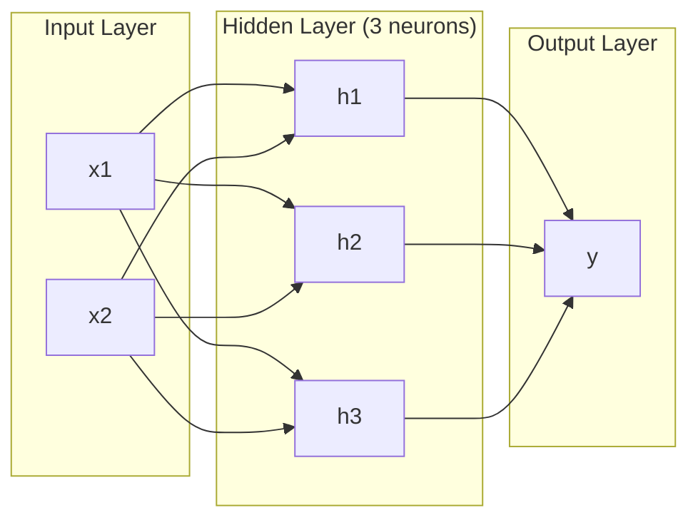
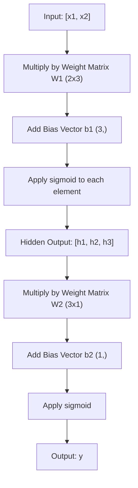
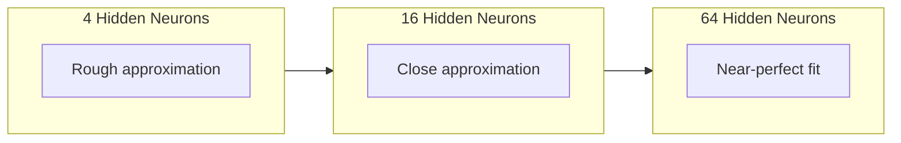

# شبکه های چند لایه و گذرنامه پیش رو

> يک نورون خطي رو مي کشيد. آنها را جمع کنيد و ميتونيد هر چيزي رو رسم كنيد.

**Type:** Build
**Languages:** Python
**Prerequisites:** Phase 01 (Math Foundations), Lesson 03.01 (The Perceptron)
**Time:** ~90 minutes

## اهداف یادگیری

- یک شبکه چند لایه را با کلاس های لایه و شبکه که یک گذر کامل را انجام می دهند از ابتدا بسازید
- ابعاد ماتریس را از طریق هر لایه ی شبکه ردیابی کنید و عدم مطابقت شکل را شناسایی کنید
- توضیح دهید که چگونه تکه کردن فعال سازی های غیر خطی باعث می شود یک شبکه برای یادگیری مرزهای تصمیم گیری منحنی شود
- مشکل XOR را با استفاده از معماری 2-2-1 با وزنهای سیگمائید دست ساز حل کنید

## مشکل

یک نورون یک کشش خط است. این همه است. یک خط مستقیم از طریق داده های شما. هر مشکل واقعی در هوش مصنوعی -- تشخیص تصویر، درک زبان، بازی Go -- نیاز به منحنیات دارد. جمع آوری نورون ها به لایه ها این است که چگونه منحنیات را پیدا می کنید.

در سال 1969، مینسکی و پپر ثابت کردند که این محدودیت فاتیل است: یک شبکه یک لایه نمی تواند XOR را یاد بگیرد. نه "جنگ برای یادگیری" - ریاضی نمی تواند. جدول حقیقت XOR [0,1] و [1,0] را در یک طرف، [0,0] و [1,1] در طرف دیگر قرار می دهد. هیچ خطی آنها را جدا نمی کند.

این باعث شد که بیش از یک دهه از تامین مالی شبکه عصبی در معرض خطر قرار گیرد. راه حل در گذشته واضح بود: از استفاده از یک لایه جلوگیری کنید. سلول های عصبی را به لایه ها جمع کنید. اجازه دهید لایه اول فضای ورودی را به ویژگی های جدید کند و اجازه دهید لایه دوم این ویژگی ها را به تصمیماتی که هیچ خطی نمی تواند بگیرد، ترکیب کند.

این استیک شبکه چند لایه است. این پایه ی هر مدل یادگیری عمیق در تولید امروز است. گذرگاه پیش رو - داده هایی که از ورودی از طریق لایه های پنهان به ورودی جریان دارند - اولین چیزی است که باید قبل از اینکه هر چیز دیگری کار کند بسازید.

## مفهوم

### لایه ها: ورودی، پنهان، خروجی

یک شبکه چند لایه دارای سه نوع لایه است:

**Input layer**-- نه در واقع یک لایه. این داده های خام شما را نگه می دارد. دو ویژگی به معنای دو گره ورودی است. هیچ محاسباتی در اینجا اتفاق نمی افتد.

**Hidden layers**هر نورون هر محصولی را از لایه قبلی می گیرد، وزنه ها و تعصب را اعمال می کند، سپس نتیجه را از طریق یک تابع فعال سازی می گذرد. "پوشیده" چون شما هرگز این ارزش ها را مستقیما در داده های آموزش نمی بینید.

**Output layer**-- پاسخ نهایی. برای طبقه بندی دوگانه، یک نورون با سیگمائید. برای کلاس های متعدد، یک نورون در هر کلاس.



این یک شبکه 2-3-1 است. دو ورودی، سه نورون مخفی، یک خروجی. هر اتصال وزن دارد. هر نورون (به جز ورودی) دارای تعصب است.

هر لایه یک ویکتور اعداد را به نام حالت پنهان تولید می کند. برای متن، حالت پنهان ابعاد را افزایش می دهد -- رمزگذاری یک کلمه به عنوان 768 عدد برای گرفتن معنای معنایی. برای تصاویر، ابعاد را کاهش می دهند -- فشرده سازی میلیون ها پیکسل به یک نمایش قابل کنترل. حالت پنهان جایی است که یادگیری زندگی می کند.

### نورون ها و فعال سازی

هر نورون سه کار انجام میده:

1. هر ورودی را با وزن مربوطه اش ضرب کنید
2. تمام محصولات را جمع کنید و یک تعصب اضافه کنید
3. جمع را از طریق یک تابع فعال سازی منتقل کنید

در حال حاضر، فعاليت سيگمايد است:

```
sigmoid(z) = 1 / (1 + e^(-z))
```

سیگمائید هر عدد را به محدوده (0,1) می کند. ورودی های مثبت بزرگ به سمت ۱ حرکت می کنند. ورودی های منفی بزرگ به سمت صفر حرکت می کنند. نقشه های صفر به 0.5 می رسند. این منحنی صاف است که یادگیری را ممکن می کند - برخلاف مرحله سخت پرسپرتون، سیگمائید در همه جا گرادینت دارد.

### گذرنامه پیش رو: چگونه جریان داده ها

گذرگاه پیشرو داده های ورودی را از طریق شبکه، لایه به لایه، فشار می دهد تا به محصول برسد. هیچ یادگیری در طول گذرگاه پیشرو اتفاق نمی افتد. این محاسبات خالص است: ضرب، اضافه، فعال، تکرار.



در هر لایه سه عمل در یک ترتیب انجام می شود:

```
z = W * input + b       (linear transformation)
a = sigmoid(z)           (activation)
```

خروجی یک لایه به ورودی بعدی تبدیل می شود. این کل گذرگاه پیش رو است.

### ابعاد ماتریکس

اندازه گیری ابعاد مهم ترین مهارت های دیبگینگ در یادگیری عمیق است. در اینجا شبکه 2-3-1 است:

| Step | Operation | Dimensions | Result Shape |
|------|-----------|------------|-------------|
| Input | x | -- | (2,) |
| Hidden linear | W1 * x + b1 | W1: (3, 2), b1: (3,) | (3,) |
| Hidden activation | sigmoid(z1) | -- | (3,) |
| Output linear | W2 * h + b2 | W2: (1, 3), b2: (1,) | (1,) |
| Output activation | sigmoid(z2) | -- | (1,) |

قانون: ماتریس وزن W در لایه k دارای شکل است (نورون ها_در لایه_ک، نورون ها_در لایه_ک_منوس_1). صف ها با لایه فعلی مطابقت دارند. ستون ها با لایه قبلی مطابقت دارند. اگر اشکال به هم خط نمی کنند، شما یک خط خطا دارید.

### نظریه نزدیک شدن جهانی

در سال ۱۹۸۹، جورج سایبنکو چیزی قابل توجه را ثابت کرد: یک شبکه عصبی با یک لایه پنهان و سلول های عصبی کافی می تواند هر عملکرد مداوم را به هر دقت مطلوب نزدیک کند.

این بدان معنا نیست که یک لایه پنهان همیشه بهترین است. این بدان معنی است که معماری از نظر تئوری قابل است. در عمل، شبکه های عمیق تر (طبقات بیشتر، نورون های کمتری در هر لایه) با پارامترهای کلی بسیار کمتر از شبکه های سطح پایین، عملکردهای مشابه را یاد می گیرند. به همین دلیل یادگیری عمیق کار می کند.

این حس: هر نورون در لایه پنهان یک "بوم" یا ویژگی را یاد می گیرد. ضربه های کافی که در مکان های مناسب قرار داده می شوند می توانند هر منحنی صاف را نزدیک کنند. نورون های بیشتر، ضربه های بیشتر، نزدیک شدن بهتر است.



### ترکیب پذیری

شبکه های عصبی قابل ترکیب هستند. شما می توانید آنها را دسته بندی کنید، آنها را زنجیره کنید، آنها را موازی اجرا کنید. یک مدل Whisper از یک شبکه کدرها برای پردازش صوتی و یک شبکه کدرها جداگانه برای تولید متن استفاده می کند. LLM های مدرن فقط کدرها هستند. BERT فقط کدرها است. T5 کدرها-دکودرها است. انتخاب معماری آنچه را که مدل می تواند انجام دهد تعریف می کند.

```figure
mlp-forward
```

## آن را بسازید

پایتون خالص، هیچ جنجال نیست، هر عملیاتی ماتریکس از نو نوشته شده

### مرحله ی اول: فعال سازی سیگمائید

```python
import math

def sigmoid(x):
    x = max(-500.0, min(500.0, x))
    return 1.0 / (1.0 + math.exp(-x))
```

.چسب به [500،500] مانع از پر شدن`math.exp(500)`بزرگ اما محدود است.`math.exp(1000)`این بی نهایت است.

### مرحله دوم: طبقه طبقه

مهم ترین عملیات در تمام یادگیری عمیق ضرب ماتریکس است. هر لایه، هر سر توجه، هر عبور جلو، تمام راه به پایین ماتمول است. یک لایه خطی یک ویکتور ورودی را می گیرد، آن را با یک ماتریکس وزن ضرب می کند و یک ویکتور تعصب اضافه می کند: y = Wx + b. این معادله ی تکانه 90 درصد محاسبه در یک شبکه عصبی است.

یک لایه دارای ماتریکس وزن و یک ویکتور تعصب است. روش پیشروی آن یک ویکتور ورودی را می گیرد و خروجی فعال را باز می گرداند.

```python
class Layer:
    def __init__(self, n_inputs, n_neurons, weights=None, biases=None):
        if weights is not None:
            self.weights = weights
        else:
            import random
            self.weights = [
                [random.uniform(-1, 1) for _ in range(n_inputs)]
                for _ in range(n_neurons)
            ]
        if biases is not None:
            self.biases = biases
        else:
            self.biases = [0.0] * n_neurons

    def forward(self, inputs):
        self.last_input = inputs
        self.last_output = []
        for neuron_idx in range(len(self.weights)):
            z = sum(
                w * x for w, x in zip(self.weights[neuron_idx], inputs)
            )
            z += self.biases[neuron_idx]
            self.last_output.append(sigmoid(z))
        return self.last_output
```

ماتریس وزن شکل دارد (n_neurons, n_inputs). هر ردیف وزن یک نورون در تمام ورودی است. روش پیشرو از طریق نورون ها دور می رود، مجموع وزن شده را به همراه تعصب محاسبه می کند، sigmoid را اعمال می کند و نتایج را جمع آوری می کند.

### مرحله سوم: کلاس شبکه

یک شبکه یک لیست از لایه ها است. گذر جلو آنها را زنجیره می کند: خروجی از لایه k به لایه k + 1 تغذیه می کند.

```python
class Network:
    def __init__(self, layers):
        self.layers = layers

    def forward(self, inputs):
        current = inputs
        for layer in self.layers:
            current = layer.forward(current)
        return current
```

این تمام خط های پیش رو است. چهار خط منطق. داده ها وارد می شوند، از طریق هر لایه جریان می گیرند، از طرف دیگر خارج می شوند.

### مرحله 4: XOR با وزن های دست تنظیم شده

در درس 01, ما XOR را با ترکیب OR، NAND و AND perceptrons حل کردیم. حالا با کلاس های لایه و شبکه ما همین کار را انجام دهید. معماری 2-2-1: دو ورودی، دو نورون پنهان، یک خروجی.

```python
hidden = Layer(
    n_inputs=2,
    n_neurons=2,
    weights=[[20.0, 20.0], [-20.0, -20.0]],
    biases=[-10.0, 30.0],
)

output = Layer(
    n_inputs=2,
    n_neurons=1,
    weights=[[20.0, 20.0]],
    biases=[-30.0],
)

xor_net = Network([hidden, output])

xor_data = [
    ([0, 0], 0),
    ([0, 1], 1),
    ([1, 0], 1),
    ([1, 1], 0),
]

for inputs, expected in xor_data:
    result = xor_net.forward(inputs)
    predicted = 1 if result[0] >= 0.5 else 0
    print(f"  {inputs} -> {result[0]:.6f} (rounded: {predicted}, expected: {expected})")
```

وزن های بزرگ (20، -20) باعث می شود سیگمائید مانند یک تابع مرحله ای عمل کند. اولین نورون پنهان به OR نزدیک می شود. دوم به NAND نزدیک می شود. نورون خروجی آنها را به AND ترکیب می کند که XOR است.

### مرحله 5: طبقه بندی دایره

مشکل سخت تر این است که نقاط دو بعدی را به عنوان داخل یا خارج از یک دایره ی شعاع 0.5 که در مرکز آن قرار دارد طبقه بندی کنیم. این نیاز به یک مرز تصمیم گیری منحنی دارد که برای یک پرسپترون غیرممکن است.

```python
import random
import math

random.seed(42)

data = []
for _ in range(200):
    x = random.uniform(-1, 1)
    y = random.uniform(-1, 1)
    label = 1 if (x * x + y * y) < 0.25 else 0
    data.append(([x, y], label))

circle_net = Network([
    Layer(n_inputs=2, n_neurons=8),
    Layer(n_inputs=8, n_neurons=1),
])
```

با وزن های تصادفی، شبکه به خوبی طبقه بندی نمی شود. اما گذرۀ پیش هنوز هم اجرا می شود. این نکته است - گذرۀ پیش فقط محاسبات است. یادگیری وزن های صحیح بازپسین است، که در درس 03.

```python
correct = 0
for inputs, expected in data:
    result = circle_net.forward(inputs)
    predicted = 1 if result[0] >= 0.5 else 0
    if predicted == expected:
        correct += 1

print(f"Accuracy with random weights: {correct}/{len(data)} ({100*correct/len(data):.1f}%)")
```

وزن تصادفی دقت ضعیف را می دهد -- اغلب بدتر از حدس زدن کلاس اکثریت. پس از آموزش (درس 03) ، این معماری با 8 سلول عصبی پنهان یک مرز منحنی را می کشد که درون را از بیرون جدا می کند.

## ازش استفاده کن

پي تورچ همه چيز رو در چهار خط انجام ميده:

```python
import torch
import torch.nn as nn

model = nn.Sequential(
    nn.Linear(2, 8),
    nn.Sigmoid(),
    nn.Linear(8, 1),
    nn.Sigmoid(),
)

x = torch.tensor([[0.0, 0.0], [0.0, 1.0], [1.0, 0.0], [1.0, 1.0]])
output = model(x)
print(output)
```

`nn.Linear(2, 8)`کلاس لایه شما: ماتریس وزن شکل (8, 2) ، ویکتور تعصب شکل (8,) است. `nn.Sigmoid()`این تابع سیگمائید شما به لحاظ عنصر استفاده می شود.`nn.Sequential`کلاس شبکه شما: لایه های زنجیره ای در ترتیب

تفاوت در سرعت و مقیاس است. PyTorch روی GPU اجرا می شود، دسته های میلیون ها نمونه را اداره می کند و به طور خودکار گرادینتهای برای گسترش به عقب را محاسبه می کند. اما منطق عبور به جلو شبیه به آنچه که شما از ابتدا ساخته اید است.

## -باده

این درس یک پرامپت قابل استفاده مجدد برای طراحی معماری شبکه را تولید می کند:

- `outputs/prompt-network-architect.md`

وقتی نیاز دارید تصمیم بگیرید که چند لایه، چند سلول عصبی در هر لایه و کدام عملکرد فعال سازی برای یک مشکل خاص استفاده شود.

## تمرینات

1. یک شبکه 2-4-2-1 (دو لایه پنهان) بسازید و انتقال پیش رو را با وزن تصادفی XOR اجرا کنید. خروجی لایه پنهان میانگین را چاپ کنید تا ببینید که چگونه نمایش در هر لایه تغییر می کند.

2. اندازه لایه پنهان در طبقه بندی دایره را از 8 به 2 تغییر دهید. سپس به 32 تغییر دهید. هر بار با وزن تصادفی به جلو بروید. آیا تعداد نورون های پنهان محدوده خروجی یا توزیع را تغییر می دهد؟ چرا؟

3. اجرای یک`count_parameters`روش در کلاس شبکه که تعداد کل وزنهای قابل تمرین و تعصب را باز می گرداند. آن را در یک شبکه 784-256-128-10 (ارشیکتوری کلاسیک MNIST) آزمایش کنید. چند پارامتر دارد؟

4. یک گذرگاه پیش رو برای یک شبکه 3-4-4-2 بسازید. به آن ارزش های رنگ RGB (معمولی به 0-1) بدهید و دو خروجی را مشاهده کنید. این معماری برای یک طبقه بندی کننده رنگ ساده با دو کلاس است.

5. تغییر سیگمائید با تابع "خطای خروجی": 0.01 * z را اگر z < 0 باشد، پس از آن 1.0. با همان وزنه های دست سازانه از مرحله 4 در XOR اجرا کنید. آیا هنوز هم کار می کند؟ چرا سیگمائید صاف به جای قطع سخت ترجیح داده می شود؟

## اصطلاحات کلیدی

| Term | What people say | What it actually means |
|------|----------------|----------------------|
| Forward pass | "Running the model" | Pushing input through every layer -- multiply by weights, add bias, activate -- to produce an output |
| Hidden layer | "The middle part" | Any layer between input and output whose values are not directly observed in the data |
| Multi-layer network | "A deep neural network" | Layers of neurons stacked sequentially, where each layer's output feeds the next layer's input |
| Activation function | "The nonlinearity" | A function applied after the linear transformation that introduces curves into the decision boundary |
| Sigmoid | "The S-curve" | sigma(z) = 1/(1+e^(-z)), squashes any real number to (0,1), smooth and differentiable everywhere |
| Weight matrix | "The parameters" | A matrix W of shape (current_layer_neurons, previous_layer_neurons) containing learnable connection strengths |
| Bias vector | "The offset" | A vector added after the matrix multiply that lets neurons activate even when all inputs are zero |
| Universal approximation | "Neural nets can learn anything" | A single hidden layer with enough neurons can approximate any continuous function -- but "enough" can mean billions |
| Linear transformation | "The matrix multiply step" | z = W * x + b, the computation before activation, which maps inputs to a new space |
| Decision boundary | "Where the classifier switches" | The surface in input space where the network output crosses the classification threshold |

## خواندن بیشتر

- مایکل نیلسن، "شبکه های عصبی و یادگیری عمیق"، فصل 1-2 (http://neuralnetworksanddeeplearning.com/) -- واضح ترین توضیح رایگان از گذرگاه های پیش رو و ساختار شبکه، با تصویرسازی های تعاملی
- سایبنکو، "تقریبا با تعویضات یک تابع سیگمائیدال" (1989) - مقاله اصلی نظریه تقرب جهانی، شگفت انگیز قابل خواندن
- 3Blue1Brown، "اما شبکه عصبی چیست؟"https://www.youtube.com/watch?v=aircAruvnKk) -- 20 دقیقه راه رفتن بصری از لایه ها، وزنه ها و گذرگاه های جلو که ساخت مدل ذهنی مناسب
- رفيق خوب، بنگيو، کورویل، "تعلمی عمیق"، فصل 6 (https://www.deeplearningbook.org/) -- مرجع استاندارد برای شبکه های چند لایه، رایگان آنلاین
