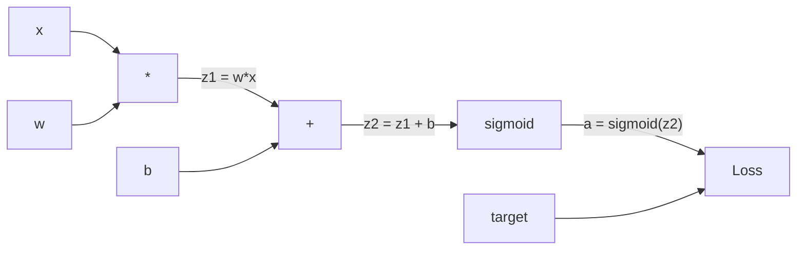
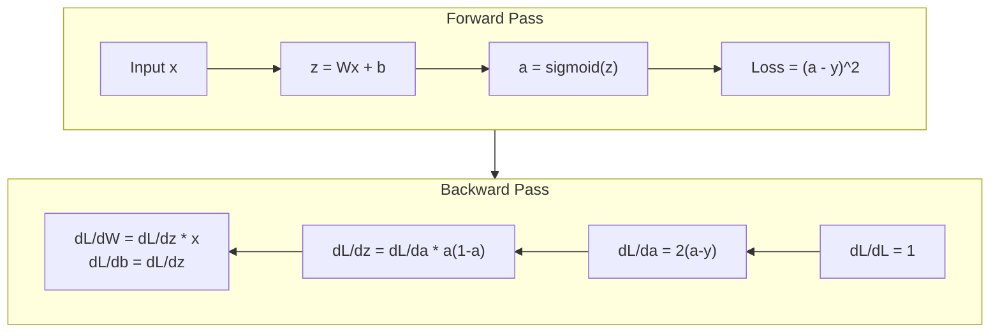
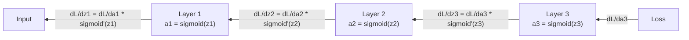

# پخش برگشت از سکرت

> بازپاشش الگوریتم است که یادگیری را ممکن می کند. بدون آن، شبکه های عصبی فقط ژنراتورهای تصادفی گران قیمت هستند.

**Type:** Build
**Languages:** Python
**Prerequisites:** Lesson 03.02 (Multi-Layer Networks)
**Time:** ~120 minutes

## اهداف یادگیری

- پیاده سازی موتور خودکشی مبتنی بر ارزش که یک نمودار محاسباتی را ایجاد می کند و gradients را از طریق طبقه بندی توپولوژیکی محاسبه می کند
- از طریق قانون زنجیره ای، عبور عقب را برای اضافه کردن، ضرب و شقاوت و سیگمائید بازگردانید
- یک شبکه چند لایه را با استفاده از موتور پخش عقب از ابتدا در XOR و طبقه بندی دایره آموزش دهید
- مشکل انحلال در شبکه های عمیق sigmoid را شناسایی کنید و توضیح دهید که چرا انحلال به طور نمایی کاهش می یابد

## مشکل

شبکه شما دارای یک لایه پنهان با 768 ورودی و 3072 خروجی است. این 2،359،296 وزن است. این پیش بینی اشتباه را انجام داد. کدام وزن باعث خطا شده است؟ آزمایش هر وزن به صورت جداگانه به معنی 2.3 میلیون عبور به جلو است. پسرویگرافی تمام 2.3 میلیون گرادینت را در یک گذر به عقب محاسبه می کند. این بهینه سازی نیست. این تفاوت بین قابل آموزش و غیرممکن است.

روش ساده ای: یک وزن را بردارید، کمی آن را فشار دهید، دوباره حرکت کنید، اندازه بگیرید که آیا از دست دادن به بالا یا پایین رفته است. این به شما گرادینت این وزن را می دهد. حالا برای هر وزن در شبکه انجام دهید. هزاران مرحله تمرین و میلیون نقطه داده ضرب کنید. برای آموزش هر چیزی مفید، زمان ژئولوژیکی لازم است.

پس از گسترش، این مسئله حل می شود. یک گذر جلو، یک گذر عقب، تمام گرادینت ها محاسبه می شوند. این ترفند قانون زنجیره ای از حساب، به طور سیستماتیک به یک نمودار محاسباتی اعمال می شود. این الگوریتم است که یادگیری عمیق را عملی می کند. بدون آن، ما هنوز در مشکلات اسباب بازی گیر می شویم.

## مفهوم

### قانون زنجیره ای، برای شبکه ها اعمال می شود

شما قانون زنجیره را در مرحله 01, درس 05 مشاهده کردید. خلاصه سریع: اگر y = f(g(x) ، پس dy/dx = f'(g(x)) * g'(x. شما مشتقات را در طول زنجیره ضرب می کنید.

در یک شبکه عصبی، "سلسل" ردیف عملیات از ورودی به ضرر است. هر لایه وزن اعمال می کند، تعصب اضافه می کند، از طریق یک فعال سازی عبور می کند. تابع ضرر محصول نهایی را با هدف مقایسه می کند. پس از گسترش این زنجیره به عقب، محاسبه می کند که چگونه هر عمل به اشتباه کمک کرد.

### نمودار های محاسباتی

هر گذرگاه پیش رو یک نمودار را ایجاد می کند. هر گره یک عملیات (گوهش، اضافه، sigmoid) است. هر لبه یک مقدار به جلو و یک گرادینت به عقب را حمل می کند.



عبور جلو: ارزش ها از چپ به راست جریان می کنند. x و w z1 = w*x را تولید می کنند. b را اضافه کنید تا z2 را دریافت کنید. sigmoid فعال سازی a را می دهد. با استفاده از تابع از دست دادن a را با هدف y مقایسه کنید.

رد به عقب: گرادیانت ها از راست به چپ جریان دارند. با dL/da شروع کنید (چگونه از دست دادن با فعال سازی تغییر می کند). با da/dz2 (تولید سیگمائید) ضرب کنید. این dL/dz2 را می دهد. به dL/dz2 تقسیم می شود (که برابر به dL/dz2 است، زیرا z2 = z1 + b) و dL/dz1 است. سپس dL/dw = dL/dz1 * x و dL/dx = dL/dz1 * w.

هر گره ای در نمودار یک کار در طول عبور عقب دارد: گرادینت را که از بالا می آید، بردارید، با مشتق محلی آن ضرب کنید و آن را به پایین منتقل کنید.

### پیش رو و عقب



گذرگاه پیشروی هر مقدار میانگین را ذخیره می کند: z، a، ورودی برای هر لایه. گذرگاه عقبروی برای محاسبه گرادینت ها به این مقدار ذخیره شده نیاز دارد. این معامله حافظه-حاسبات در قلب پشتروی است. شما حافظه (فعال سازی ذخیره سازی) را با سرعت (یک گذر به جای میلیون ها) معامله می کنید.

### جریان تدریجی از طریق شبکه

برای یک شبکه سه لایه، زنجیره گرادینت ها در هر لایه:



در هر لایه، گرادینت با مشتق سیگمائید ضرب می شود. مشتق سیگمائید یک * (1 - a) است که حداکثر 0.25 (وقتی a = 0.5) است. در سه لایه عمیق، گرادینت به حداکثر 0.25^3 = 0.0156 ضرب شده است. ده لایه عمیق: 0.25^10 = 0.000001.

### کاهش درجه بندی

این مشکل گرادینت ناپدید می شود. سیگمائید تولید خود را بین 0 تا 1 خرد می کند. مشتق آن همیشه کمتر از 0.25 است. لایه های سیگمائید کافی را جمع آوری کنید و گرادینت ها به هیچ چیز کوچک می شوند. لایه های اولیه به سختی یاد می گیرند زیرا گرادینت های نزدیک به صفر را دریافت می کنند.

```
sigmoid(z):     Output range [0, 1]
sigmoid'(z):    Max value 0.25 (at z = 0)

After 5 layers:   gradient * 0.25^5 = 0.001x original
After 10 layers:  gradient * 0.25^10 = 0.000001x original
```

به همین دلیل آموزش شبکه های عمیق سیگمائید تقریباً غیرممکن است. راه حل - ReLU و انواع آن - موضوع درس 04. برای همین حالا، درک کنید که پشت پشت به طور کامل کار می کند. مشکل این است که چه چیزی از طریق آن کار می کند.

### اخذ گرادینت ها برای شبکه دو لایه

ریاضیات کامنت برای شبکه با ورودی x، لایه پنهان با sigmoid، لایه خروجی با sigmoid و از دست دادن MSE.

گذرنامه جلو:
```
z1 = W1 * x + b1
a1 = sigmoid(z1)
z2 = W2 * a1 + b2
a2 = sigmoid(z2)
L = (a2 - y)^2
```

گذرگاه عقب (طبق قاعده زنجیره ای مرحله به مرحله):
```
dL/da2 = 2(a2 - y)
da2/dz2 = a2 * (1 - a2)
dL/dz2 = dL/da2 * da2/dz2 = 2(a2 - y) * a2 * (1 - a2)

dL/dW2 = dL/dz2 * a1
dL/db2 = dL/dz2

dL/da1 = dL/dz2 * W2
da1/dz1 = a1 * (1 - a1)
dL/dz1 = dL/da1 * da1/dz1

dL/dW1 = dL/dz1 * x
dL/db1 = dL/dz1
```

هر گرادينت محصولي از مشتقات محلي است که از بازيابي بازيابي شده است.

```figure
backprop-vanishing
```

## آن را بسازید

### مرحله اول: گره ارزش

هر عدد در محاسبه ما به یک مقدار تبدیل می شود. داده ها، گرادینت و نحوه ایجاد آن را ذخیره می کند (تا بتواند گرادینت ها را به عقب محاسبه کند).

```python
class Value:
    def __init__(self, data, children=(), op=''):
        self.data = data
        self.grad = 0.0
        self._backward = lambda: None
        self._children = set(children)
        self._op = op

    def __repr__(self):
        return f"Value(data={self.data:.4f}, grad={self.grad:.4f})"
```

هنوز هیچ گرادینتی (0.0) وجود ندارد. هنوز هیچ تابع عقب نشینی (نه-op) وجود ندارد.`_children`ردیابی کنید که کدام ارزش ها این را تولید کردند، بنابراین ما می توانیم بعد از آن نمودار را توپولوژیک مرتب کنیم.

### مرحله دوم: عملیات با عملکردهای عقب

هر عملیه یک ارزش جدید ایجاد می کند و چگونگی جریان گریادینت ها را از طریق آن تعریف می کند.

```python
def __add__(self, other):
    other = other if isinstance(other, Value) else Value(other)
    out = Value(self.data + other.data, (self, other), '+')

    def _backward():
        self.grad += out.grad
        other.grad += out.grad

    out._backward = _backward
    return out

def __mul__(self, other):
    other = other if isinstance(other, Value) else Value(other)
    out = Value(self.data * other.data, (self, other), '*')

    def _backward():
        self.grad += other.data * out.grad
        other.grad += self.data * out.grad

    out._backward = _backward
    return out
```

برای اضافه کردن: d(a+b) /da = 1، d(a+b) /db = 1. بنابراین هر دو ورودی به طور مستقیم گرادینت خروجی را دریافت می کنند.

برای ضرب: d(a*b)/da = b, d(a*b)/db = a. هر ورودی مقدار دیگری را بر سر گرادینت خروجی دریافت می کند.

.`+=`یک مقدار ممکن است در چندین عملیات استفاده شود. گرادینت آن مجموعه گرادینت های تمام مسیرها است.

### مرحله سوم: سیگمائید و از دست دادن

```python
import math

def sigmoid(self):
    x = self.data
    x = max(-500, min(500, x))
    s = 1.0 / (1.0 + math.exp(-x))
    out = Value(s, (self,), 'sigmoid')

    def _backward():
        self.grad += (s * (1 - s)) * out.grad

    out._backward = _backward
    return out
```

مشتق سیگمائید: سیگمائید ((x) * (1 - سیگمائید ((x)). ما سیگمائید ((x) = s را در طول عبور جلو محاسبه کردیم. آن را دوباره استفاده کنید. هیچ کار اضافی نیست.

```python
def mse_loss(predicted, target):
    diff = predicted + Value(-target)
    return diff * diff
```

MSE برای یک محصول: (پیش بینی - هدف) ^2. ما معاینه را به عنوان جمع با یک ارزش منفی بیان می کنیم.

### مرحله چهارم: گذرگاه عقب

نوع توپولوژیکی تضمین می کند که ما گره ها را در ترتیب مناسب پردازش کنیم - گرادینت یک گره قبل از اینکه ما از طریق آن گسترش دهیم به طور کامل جمع می شود.

```python
def backward(self):
    topo = []
    visited = set()

    def build_topo(v):
        if v not in visited:
            visited.add(v)
            for child in v._children:
                build_topo(child)
            topo.append(v)

    build_topo(self)
    self.grad = 1.0
    for v in reversed(topo):
        v._backward()
```

از ضایعات شروع کنید (گرادیانت = 1.0، از آنجا که dL / dL = 1) ، از طریق نمودار مرتب شده به عقب بروید.`_backward`به بچه هاش فشار می دهد.

### مرحله 5: لایه و شبکه

```python
import random

class Neuron:
    def __init__(self, n_inputs):
        scale = (2.0 / n_inputs) ** 0.5
        self.weights = [Value(random.uniform(-scale, scale)) for _ in range(n_inputs)]
        self.bias = Value(0.0)

    def __call__(self, x):
        act = sum((wi * xi for wi, xi in zip(self.weights, x)), self.bias)
        return act.sigmoid()

    def parameters(self):
        return self.weights + [self.bias]


class Layer:
    def __init__(self, n_inputs, n_outputs):
        self.neurons = [Neuron(n_inputs) for _ in range(n_outputs)]

    def __call__(self, x):
        out = [n(x) for n in self.neurons]
        return out[0] if len(out) == 1 else out

    def parameters(self):
        params = []
        for n in self.neurons:
            params.extend(n.parameters())
        return params


class Network:
    def __init__(self, sizes):
        self.layers = []
        for i in range(len(sizes) - 1):
            self.layers.append(Layer(sizes[i], sizes[i + 1]))

    def __call__(self, x):
        for layer in self.layers:
            x = layer(x)
            if not isinstance(x, list):
                x = [x]
        return x[0] if len(x) == 1 else x

    def parameters(self):
        params = []
        for layer in self.layers:
            params.extend(layer.parameters())
        return params

    def zero_grad(self):
        for p in self.parameters():
            p.grad = 0.0
```

یک نورون ورودی را می گیرد، جمع وزن شده + تعصب را محاسبه می کند و سیگمائید را اعمال می کند. مقیاس های ابتدایی وزن توسط sqrt(2/n_inputs) برای جلوگیری از شتاب سیگمائید در شبکه های عمیق تر. یک لایه یک لیست از نورون ها است. یک شبکه یک لیست از لایه ها است.`parameters()`روش جمع آوری تمام ارزش های قابل یادگیری است تا بتوانیم آنها را به روز کنیم.

### مرحله 6: قطار در XOR

```python
random.seed(42)
net = Network([2, 4, 1])

xor_data = [
    ([0.0, 0.0], 0.0),
    ([0.0, 1.0], 1.0),
    ([1.0, 0.0], 1.0),
    ([1.0, 1.0], 0.0),
]

learning_rate = 1.0

for epoch in range(1000):
    total_loss = Value(0.0)
    for inputs, target in xor_data:
        x = [Value(i) for i in inputs]
        pred = net(x)
        loss = mse_loss(pred, target)
        total_loss = total_loss + loss

    net.zero_grad()
    total_loss.backward()

    for p in net.parameters():
        p.data -= learning_rate * p.grad

    if epoch % 100 == 0:
        print(f"Epoch {epoch:4d} | Loss: {total_loss.data:.6f}")

print("\nXOR Results:")
for inputs, target in xor_data:
    x = [Value(i) for i in inputs]
    pred = net(x)
    print(f"  {inputs} -> {pred.data:.4f} (expected {target})")
```

از پیش بینی های تصادفی تا اصلاح خروجی XOR، که به طور کامل توسط گرادینتهای محاسباتی پس از گسترش و فشار وزن در جهت درست هدایت می شود.

### مرحله هفتم: طبقه بندی دایره

در درس دو، وزن ها را برای طبقه بندی دایره ها به دست تنظیم می کنید. حالا اجازه دهید شبکه آنها را یاد بگیرد.

```python
random.seed(7)

def generate_circle_data(n=100):
    data = []
    for _ in range(n):
        x1 = random.uniform(-1.5, 1.5)
        x2 = random.uniform(-1.5, 1.5)
        label = 1.0 if x1 * x1 + x2 * x2 < 1.0 else 0.0
        data.append(([x1, x2], label))
    return data

circle_data = generate_circle_data(80)

circle_net = Network([2, 8, 1])
learning_rate = 0.5

for epoch in range(2000):
    random.shuffle(circle_data)
    total_loss_val = 0.0
    for inputs, target in circle_data:
        x = [Value(i) for i in inputs]
        pred = circle_net(x)
        loss = mse_loss(pred, target)
        circle_net.zero_grad()
        loss.backward()
        for p in circle_net.parameters():
            p.data -= learning_rate * p.grad
        total_loss_val += loss.data

    if epoch % 200 == 0:
        correct = 0
        for inputs, target in circle_data:
            x = [Value(i) for i in inputs]
            pred = circle_net(x)
            predicted_class = 1.0 if pred.data > 0.5 else 0.0
            if predicted_class == target:
                correct += 1
        accuracy = correct / len(circle_data) * 100
        print(f"Epoch {epoch:4d} | Loss: {total_loss_val:.4f} | Accuracy: {accuracy:.1f}%")
```

ما در اینجا از SGD آنلاین استفاده می کنیم - وزن ها را پس از هر نمونه به جای جمع آوری مجموعه کامل به روز می کنیم. این باعث شکستن همپایزی سریعتر می شود و از اشباع سیگمائید در چشم انداز کامل از دست دادن جلوگیری می کند. مخلوط کردن داده ها در هر دوره از یادآوری نظم شبکه جلوگیری می کند.

هیچ تنظیم دستی نیست. شبکه مرز تصمیم گیری دایره را به تنهایی کشف می کند. این قدرت گسترش عقب است: شما معماری، عملکرد از دست دادن و داده ها را تعریف می کنید. الگوریتم وزن را محاسبه می کند.

## ازش استفاده کن

پیتورچ همه چیز را در چند خط انجام می دهد. ایده اصلی یکسان است - autograd یک نمودار محاسباتی را در طول عبور به جلو ایجاد می کند و آن را به عقب ردیابی می کند تا گرادیانت های محاسباتی را محاسبه کند.

```python
import torch
import torch.nn as nn

model = nn.Sequential(
    nn.Linear(2, 4),
    nn.Sigmoid(),
    nn.Linear(4, 1),
    nn.Sigmoid(),
)
optimizer = torch.optim.SGD(model.parameters(), lr=1.0)
criterion = nn.MSELoss()

X = torch.tensor([[0,0],[0,1],[1,0],[1,1]], dtype=torch.float32)
y = torch.tensor([[0],[1],[1],[0]], dtype=torch.float32)

for epoch in range(1000):
    pred = model(X)
    loss = criterion(pred, y)
    optimizer.zero_grad()
    loss.backward()
    optimizer.step()

print("PyTorch XOR Results:")
with torch.no_grad():
    for i in range(4):
        pred = model(X[i])
        print(f"  {X[i].tolist()} -> {pred.item():.4f} (expected {y[i].item()})")
```

`loss.backward()`تو هستي`total_loss.backward()`.`optimizer.step()`اين راهنماي شماست`p.data -= lr * p.grad`.`optimizer.zero_grad()`تو هستي`net.zero_grad()`. همان الگوریتم، پیاده سازی قدرت صنعتی. PyTorch سرعت GPU، دقت مخلوط، کنترل گرادینت و صدها نوع لایه را اداره می کند. اما عبور به عقب همان قانون زنجیره ای است که برای همان نمودار محاسباتی اعمال می شود.

تمرین کردن به جلو، پس از آن به عقب، و بعد از آن به روز کردن وزن. اينفرنس فقط به جلو عبور ميکنه هيچ گرادينت و تازه اي نيست این تفاوت مهم است زیرا نتیجه گیری چیزی است که در تولید اتفاق می افتد. وقتی به یک API مانند کلاود یا GPT زنگ می زنید، نتیجه گیری می کنید -- پیام شما از طریق شبکه به جلو جریان می یابد و توکن ها از انتهای دیگر بیرون می آیند. هیچ تغییر وزن نیست درک پشت پشت مهم است چون هر وزن در شبکه را شکل داده است.

## -باده

این درس نتیجه می دهد:
- `outputs/prompt-gradient-debugger.md`-- یک پیامک قابل استفاده مجدد برای تشخیص مشکلات گرادینت (زوال، انفجار، NaN) در هر شبکه عصبی

## تمرینات

1. اضافه کنید`__sub__`روش به کلاس ارزش (a - b = a + (-1 * b)). سپس یک `__neg__`روش: بررسی کنید که گرادینت ها درست هستند با مقایسه با محاسبه دستی برای یک عبارت ساده مانند (a - b) ^ 2.

2. اضافه کنید`relu`روش به ارزش (خروجی حداکثر ((0, x) ، مشتق 1 است اگر x > 0, دیگر 0). جای sigmoid را با relue در لایه های پنهان و تمرین دوباره در XOR. سرعت تقابل. شما باید آموزش سریع تر را ببینید - این پیش نمایش درس 04.

3. اجرای یک`__pow__`روش در مورد ارزش برای قدرتهای عدد کامل.`mse_loss`با یک مناسب`(predicted - target) ** 2`تعبير. ترازها را با اجراات اصلی مطابقت دهید.

4. اضافه کردن کتیج گرادینت به حلقه آموزش: پس از تماس `backward()`، تمام گرادینتهای را به [-1, 1] برش دهید. یک شبکه عمیق تر (4+ لایه با سیگمائید) را تمرین کنید و منحنیات از دست دادن را با و بدون برش مقایسه کنید. این اولین دفاع شما در برابر گرادینتهای انفجار است.

5. ساخت یک تصویر: پس از آموزش در XOR، گرادینت هر پارامتر در شبکه چاپ کنید. شناسایی کنید که کدام لایه دارای کوچکترین گرادینت است. این مسئله گرادینت ناپدید شدن را نشان می دهد که در بخش مفهوم در مورد آن مطالعه کرده اید.

## اصطلاحات کلیدی

| Term | What people say | What it actually means |
|------|----------------|----------------------|
| Backpropagation | "The network learns" | An algorithm that computes dL/dw for every weight by applying the chain rule backward through the computational graph |
| Computational graph | "The network structure" | A directed acyclic graph where nodes are operations and edges carry values (forward) and gradients (backward) |
| Chain rule | "Multiply the derivatives" | If y = f(g(x)), then dy/dx = f'(g(x)) * g'(x) -- the mathematical foundation of backpropagation |
| Gradient | "The direction of steepest ascent" | The partial derivative of the loss with respect to a parameter -- tells you how to change that parameter to reduce the loss |
| Vanishing gradient | "Deep networks don't learn" | Gradients shrink exponentially as they propagate through layers with saturating activations like sigmoid |
| Forward pass | "Running the network" | Computing the output from inputs by sequentially applying each layer's operations and storing intermediate values |
| Backward pass | "Computing gradients" | Traversing the computational graph in reverse, accumulating gradients at each node using the chain rule |
| Learning rate | "How fast it learns" | A scalar that controls the step size when updating weights: w_new = w_old - lr * gradient |
| Topological sort | "The right order" | An ordering of graph nodes where each node appears after all nodes it depends on -- ensures gradients are fully accumulated before propagation |
| Autograd | "Automatic differentiation" | A system that builds computational graphs during forward computation and automatically computes gradients -- what PyTorch's engine does |

## خواندن بیشتر

- Rumelhart, Hinton & Williams, "تعلیم نمایش ها با اشتباهات پخش برگشت" (1986) - مقاله ای که پخش برگشت را جریان اصلی و آموزش شبکه چند لایه باز کرد
- 3Blue1Brown، سری "شبکه های عصبی" (https://www.youtube.com/playlist?list=PLZHQObOWTQDNU6R1_67000Dx_ZCJB-3pi) -- بهترین توضیح بصری از پخش عقب و جریان گرادینت از طریق شبکه ها
