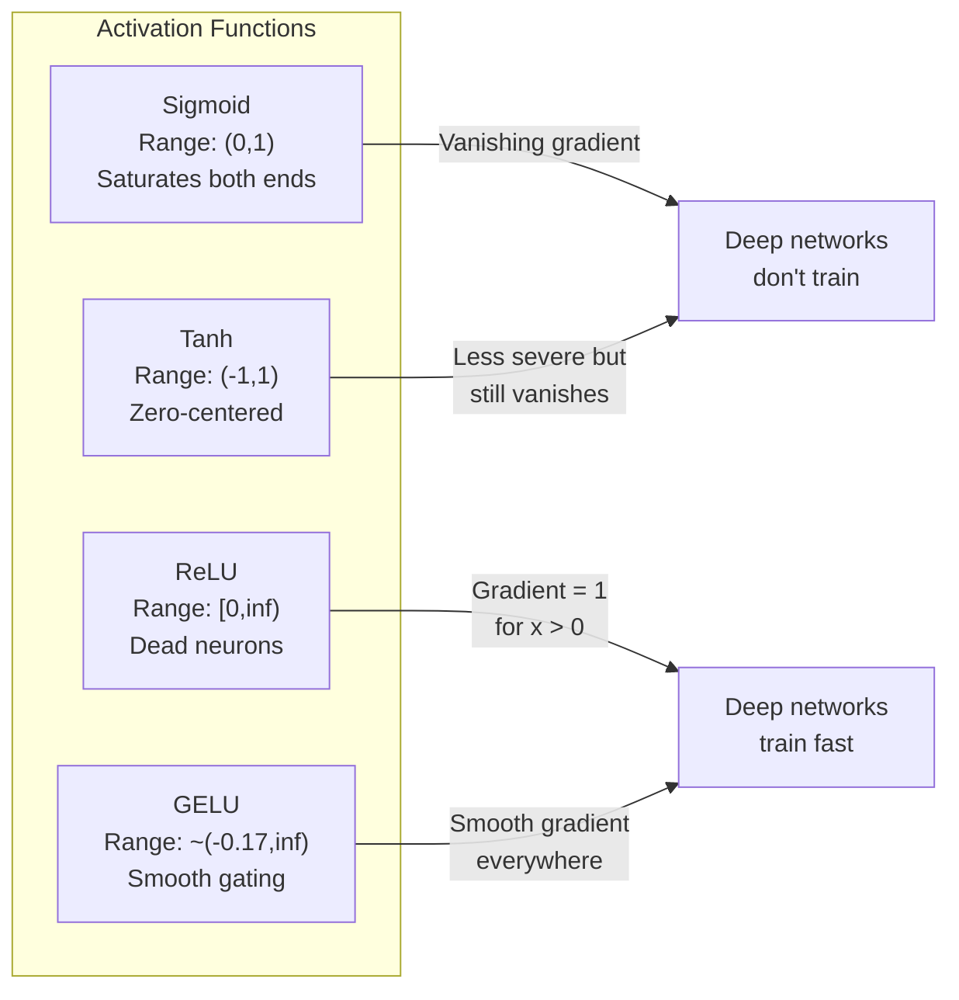
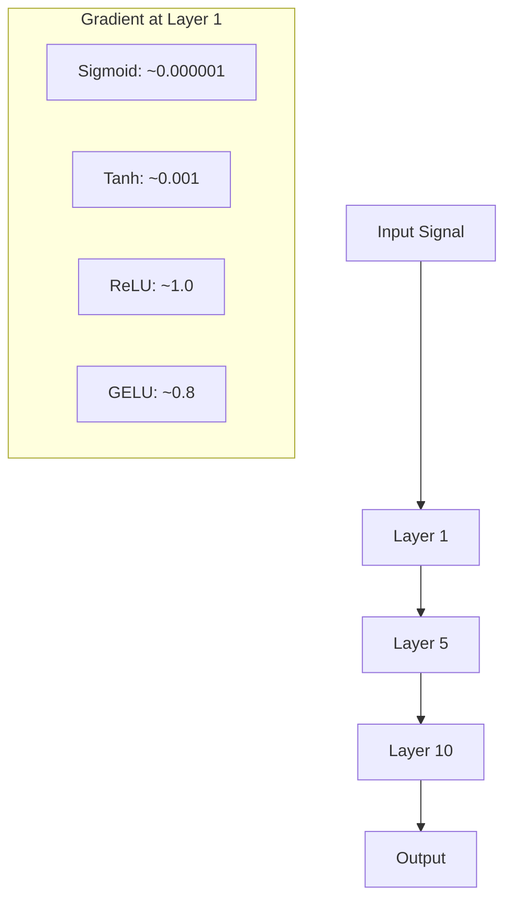
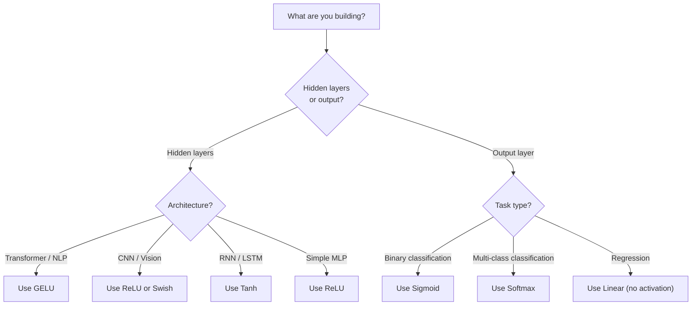

# عملکردهای فعال سازی

> بدون غیر خطی، شبکه ۱۰۰ لایه شما یک ماتریس فانتزی است که چند برابر می شود. فعال سازی دروازه هایی است که اجازه می دهد شبکه های عصبی به منحنی فکر کنند.

**Type:** Build
**Languages:** Python
**Prerequisites:** Lesson 03.03 (Backpropagation)
**Time:** ~75 minutes

## اهداف یادگیری

- پیاده سازی sigmoid، tanh، ReLU، Leaky ReLU، GELU، Swish، و softmax با مشتق های خود را از ابتدا
- تشخیص مشکل گرادینت ناپدید شدن با اندازه گیری مقادیر فعال سازی از طریق 10+ لایه با فعال سازی های مختلف
- سلول های عصبی مرده را در شبکه ReLU شناسایی کنید و توضیح دهید چرا GELU از این حالت شکست اجتناب می کند
- عملکرد فعال سازی صحیح را برای یک معماری داده شده انتخاب کنید (ترانسفارمر، CNN، RNN، لایه خروجی)

## مشکل

دو تحول خطی را جمع کنید: y = W2 ((W1x + b1) + b2. آن را گسترش دهید: y = W2W1x + W2b1 + b2. این فقط y = Ax + c - یک تحول خطی است. مهم نیست که چند لایه خطی را جمع کنید، نتیجه به یک ماتریک ضرب می شود. شبکه 100 لایه شما دارای همان قدرت نمایشگری یک لایه است.

این یک کنجکاوی نظری نیست. این بدان معنی است که یک شبکه خطی عمیق به معنای واقعی کلمه نمی تواند XOR را یاد بگیرد، نمی تواند مجموعه داده های اسپرالی را طبقه بندی کند، نمی تواند چهره ای را تشخیص دهد. بدون عملکردهای فعال سازی، عمق یک توهم است.

تابع فعال کردن خطييت رو مي شکند آنها خروجی هر لایه را از طریق یک تابع غیر خطی منحنی می کنند، به شبکه توانایی خم کردن مرز تصمیم گیری، تقریبی کردن عملکردهای تعسفی و یادگیری واقعی را می دهند. اما اگر فعال سازی اشتباه را انتخاب کنید، گرادینت های شما به صفر (سیگمائید در شبکه های عمیق) ناپدید می شوند، به بی نهایت (آکتیواسیون های بی محدودی بدون ابتدایی دقیق) انفجار می کنند، یا نورون های شما به طور دائمی می میرند (ReLU با تعصب های منفی بزرگ). انتخاب تابع فعال سازی مستقیماً تعیین می کند که آیا شبکه شما در همه چیز یاد می گیرد یا خیر.

## مفهوم

### چرا غیر خطی ضروری است

ضرب ماتریکس قابل ترکیب است. ضرب یک متری با ماتریکس A سپس ماتریکس B یکسان با ضرب با AB است. این بدان معنی است که جمع کردن ده لایه خطی به طور ریاضی معادل یک لایه خطی با یک ماتریکس بزرگ است. همه این پارامترها، تمام این عمق - ضایع شده است. شما نیاز به چیزی برای شکستن زنجیره دارید. این کاری است که عملکردهای فعال سازی انجام می دهند.

این اثبات است. یک لایه خطی محاسبه f ((x) = Wx + b.

```
Layer 1: h = W1 * x + b1
Layer 2: y = W2 * h + b2
```

جایگزین:

```
y = W2 * (W1 * x + b1) + b2
y = (W2 * W1) * x + (W2 * b1 + b2)
y = A * x + c
```

یک لایه. یک فعال سازی غیر خطی g (() بین لایه ها وارد کنید:

```
h = g(W1 * x + b1)
y = W2 * h + b2
```

حالا جایگزین شدن شکسته می شود. W2 * g(W1 * x + b1) + b2 نمی تواند به یک تحول خطی واحد کاهش یابد. شبکه می تواند عملکردهای غیر خطی را نشان دهد. هر لایه اضافی با یک فعال سازی ظرفیت نمایندگی را اضافه می کند.

### سیگمائید

عملکرد فعال سازی اصلی شبکه های عصبی

```
sigmoid(x) = 1 / (1 + e^(-x))
```

محدوده خروجی: (0,1) ، صاف، قابل تفاوتی، هر عدد واقعی را به یک مقدار شبیه به احتمال نقشه می زند.

مشتق:

```
sigmoid'(x) = sigmoid(x) * (1 - sigmoid(x))
```

حداکثر ارزش این مشتق 0.25 است، که در x = 0 اتفاق می افتد. در پس گسترش، گرادینتها از طریق لایه ها چند برابر می شوند. ده لایه از سیگمائید به این معنی است که گرادینت حداکثر 0.25 به ده برابر ضرب می شود:

```
0.25^10 = 0.000000953674
```

کمتر از یک میلیونم از سیگنال اصلی. این مشکل انحدار ناپدید می شود. گرادیانت در لایه های اولیه به حدی کوچک می شود که وزن ها به سختی به روز می شوند. شبكه به نظر می رسد یاد می گیرد - از دست دادن در لایه های بعدی کاهش می یابد - اما لایه های اول منجمد شده است. شبکه های عمیق سیگمائید به سادگی آموزش نمی دهند.

مشکل اضافی: خروجی سیگمائید همیشه مثبت است (0 تا 1), به این معنی که گرادینت ها در وزن ها همیشه همان علامت هستند. این باعث زگ زگ در طول نزول گرادینت می شود.

### تَن

نسخه ي مركزي سيگمايد

```
tanh(x) = (e^x - e^(-x)) / (e^x + e^(-x))
```

محدوده خروجی: (-1,1) مرکز صفر، که مشکل زیگ زاج را از بین می برد.

مشتق:

```
tanh'(x) = 1 - tanh(x)^2
```

حداکثر مشتق 1.0 در x = 0 - چهار برابر بهتر از sigmoid است. اما مشکل گرادینت ناپدید شدن هنوز وجود دارد. برای ورودی های مثبت یا منفی بزرگ، مشتق به صفر نزدیک می شود. ده لایه هنوز هم گرادینت را خرد می کنند، فقط به شدت کمتر.

### ReLU: پیشرفت

واحد خطی اصلاح شده. برای یادگیری عمیق توسط نایر و هینتون در سال 2010 محبوب شد (خود عملکرد به کار فوکوشیما در سال 1969 می رسد) ، همه چیز را تغییر داد.

```
relu(x) = max(0, x)
```

محدوده خروجی: [0, بی نهایت) مشتق به سادگی ساده است:

```
relu'(x) = 1  if x > 0
            0  if x <= 0
```

هیچ گرادینت ناپدید می شود برای ورودی مثبت. گرادینت دقیقا 1 است، به طور مستقیم از طریق آن عبور می کند. به همین دلیل شبکه های عمیق قابل تمرین شده اند - ReLU میزان گرادینت را در سراسر لایه ها حفظ می کند.

اما یک حالت شکست وجود دارد: مشکل نورون مرده. اگر ورودی وزن شده یک نورون همیشه منفی باشد (به دلیل یک تحریف منفی بزرگ یا ابتدایی وزن بدبختانه) ، خروجی آن همیشه صفر است، گرادیانت آن همیشه صفر است و هرگز به روز نمی شود. به طور دائم مرده است. در عمل، 10-40٪ نورون ها در یک شبکه ReLU ممکن است در طول آموزش بمیرند.

### رلو

ساده ترين راه حل براي سلول هاي عصبی مرده

```
leaky_relu(x) = x        if x > 0
                alpha * x if x <= 0
```

جایی که آلفا یک ثابت کوچک است، معمولاً 0.01، طرف منفی دارای یک منحنی کوچک به جای صفر است، بنابراین نورون های مرده هنوز هم یک سیگنال گرادینت را دریافت می کنند و می توانند بهبود یابند.

### گلو: پیش فرض مدرن

واحد خط خطی خطی گاسین. توسط Hendrycks و Gimpel در سال 2016 معرفی شد. فعال سازی پیش فرض در BERT، GPT و اکثر ترانسفورماتورهای مدرن.

```
gelu(x) = x * Phi(x)
```

جایی که Phi ((x) تابع توزیع تجمعی توزیع معمولی استاندارد است.

```
gelu(x) ~= 0.5 * x * (1 + tanh(sqrt(2/pi) * (x + 0.044715 * x^3)))
```

GELU در همه جا صاف است، اجازه می دهد تا ارزش های منفی کوچک (به خلاف ReLU که به صفر می رسد) ، و تفسیر احتمالی دارد: هر ورودی را با احتمال اینکه در یک توزیع گاوسی مثبت باشد وزن می کند. این گیتینگ صاف ReLU را در معماری ترانسفورم بهتر می کند زیرا جریان گرادینت بهتری را فراهم می کند و از مشکل نورون مرده کاملا اجتناب می کند.

### سوئیس / سیلو

فعال سازی خود بند شده توسط رامچاندران و همکاران در سال 2017 از طریق جستجوی خودکار کشف شد.

```
swish(x) = x * sigmoid(x)
```

سويش به طور رسمی x * sigmoid است. گوگل آن را از طریق جستجوی خودکار در فضای عملکرد فعال سازی کشف کرد -- یک شبکه عصبی که بخش هایی از شبکه های عصبی را طراحی می کند.

این سیستم مانند GELU هموار، غیر یکسوانه است و اجازه می دهد تا مقدار منفی کوچک داشته باشد. تفاوت ظریف است: سوئیس از sigmoid برای گاتینگ استفاده می کند در حالی که GELU از CDF گاس استفاده می کند. در عمل، عملکرد تقریبا یکسان است. سوئیس در EfficientNet و برخی مدل های بینایی استفاده می شود. GELU در مدل های زبان غالب است.

### Softmax: فعال کردن خروجی

Softmax یک ویکتور از نمرات خام (logits) را به توزیع احتمال تبدیل می کند.

```
softmax(x_i) = e^(x_i) / sum(e^(x_j) for all j)
```

هر خروجی بین 0 و 1 است. همه خروجی ها به 1 می رسند. این باعث می شود که آن را فعال سازی نهایی استاندارد برای طبقه بندی چند طبقه قرار دهد. بزرگترین منطق بیشترین احتمال را به دست می آورد، اما برخلاف argmax، softmax قابل تفاوتی است و اطلاعات مربوط به اعتماد نسبی را حفظ می کند.

### مقایسه شکل ها



### مقایسه جریان تدریجی



### چه زمانی فعال می شود



```figure
softmax-temperature
```

## آن را بسازید

### مرحله 1: اجرای تمام عملکردهای فعال سازی با مشتقات

هر تابع یک شناور را می گیرد و یک شناور را باز می آورد. هر تابع مشتق ورودی مشابه را می گیرد و گرادینت را باز می آورد.

```python
import math

def sigmoid(x):
    x = max(-500, min(500, x))
    return 1.0 / (1.0 + math.exp(-x))

def sigmoid_derivative(x):
    s = sigmoid(x)
    return s * (1 - s)

def tanh_act(x):
    return math.tanh(x)

def tanh_derivative(x):
    t = math.tanh(x)
    return 1 - t * t

def relu(x):
    return max(0.0, x)

def relu_derivative(x):
    return 1.0 if x > 0 else 0.0

def leaky_relu(x, alpha=0.01):
    return x if x > 0 else alpha * x

def leaky_relu_derivative(x, alpha=0.01):
    return 1.0 if x > 0 else alpha

def gelu(x):
    return 0.5 * x * (1 + math.tanh(math.sqrt(2 / math.pi) * (x + 0.044715 * x ** 3)))

def gelu_derivative(x):
    phi = 0.5 * (1 + math.erf(x / math.sqrt(2)))
    pdf = math.exp(-0.5 * x * x) / math.sqrt(2 * math.pi)
    return phi + x * pdf

def swish(x):
    return x * sigmoid(x)

def swish_derivative(x):
    s = sigmoid(x)
    return s + x * s * (1 - s)

def softmax(xs):
    max_x = max(xs)
    exps = [math.exp(x - max_x) for x in xs]
    total = sum(exps)
    return [e / total for e in exps]
```

### مرحله دوم: جایی که گرادینت ها می میرند را تصور کنید

گرادینت را در 100 نقطه با فاصله مساوی از -5 تا 5 محاسبه کنید. یک هیستogram متن چاپ کنید که نشان می دهد هر گرادینت فعال سازی نزدیک به صفر است.

```python
def gradient_scan(name, derivative_fn, start=-5, end=5, n=100):
    step = (end - start) / n
    near_zero = 0
    healthy = 0
    for i in range(n):
        x = start + i * step
        g = derivative_fn(x)
        if abs(g) < 0.01:
            near_zero += 1
        else:
            healthy += 1
    pct_dead = near_zero / n * 100
    print(f"{name:15s}: {healthy:3d} healthy, {near_zero:3d} near-zero ({pct_dead:.0f}% dead zone)")

gradient_scan("Sigmoid", sigmoid_derivative)
gradient_scan("Tanh", tanh_derivative)
gradient_scan("ReLU", relu_derivative)
gradient_scan("Leaky ReLU", leaky_relu_derivative)
gradient_scan("GELU", gelu_derivative)
gradient_scan("Swish", swish_derivative)
```

### مرحله سوم: آزمایش ناپدید شدن

سیگنال را از طریق لایه های N با استفاده از sigmoid در مقابل ReLU به جلو منتقل کنید. اندازه گیری چگونگی تغییر شدت فعال سازی.

```python
import random

def vanishing_gradient_experiment(activation_fn, name, n_layers=10, n_inputs=5):
    random.seed(42)
    values = [random.gauss(0, 1) for _ in range(n_inputs)]

    print(f"\n{name} through {n_layers} layers:")
    for layer in range(n_layers):
        weights = [random.gauss(0, 1) for _ in range(n_inputs)]
        z = sum(w * v for w, v in zip(weights, values))
        activated = activation_fn(z)
        magnitude = abs(activated)
        bar = "#" * int(magnitude * 20)
        print(f"  Layer {layer+1:2d}: magnitude = {magnitude:.6f} {bar}")
        values = [activated] * n_inputs

vanishing_gradient_experiment(sigmoid, "Sigmoid")
vanishing_gradient_experiment(relu, "ReLU")
vanishing_gradient_experiment(gelu, "GELU")
```

### مرحله چهارم: کشف کننده نورون مرده

شبکه ای را ایجاد کنید، ورودی تصادفی را از طریق آن منتقل کنید، شمارش کنید که چه تعداد نورون هرگز آتش نمی زنند.

```python
def dead_neuron_detector(n_inputs=5, hidden_size=20, n_samples=1000):
    random.seed(0)
    weights = [[random.gauss(0, 1) for _ in range(n_inputs)] for _ in range(hidden_size)]
    biases = [random.gauss(0, 1) for _ in range(hidden_size)]

    fire_counts = [0] * hidden_size

    for _ in range(n_samples):
        inputs = [random.gauss(0, 1) for _ in range(n_inputs)]
        for neuron_idx in range(hidden_size):
            z = sum(w * x for w, x in zip(weights[neuron_idx], inputs)) + biases[neuron_idx]
            if relu(z) > 0:
                fire_counts[neuron_idx] += 1

    dead = sum(1 for c in fire_counts if c == 0)
    rarely_fire = sum(1 for c in fire_counts if 0 < c < n_samples * 0.05)
    healthy = hidden_size - dead - rarely_fire

    print(f"\nDead Neuron Report ({hidden_size} neurons, {n_samples} samples):")
    print(f"  Dead (never fired):     {dead}")
    print(f"  Barely alive (<5%):     {rarely_fire}")
    print(f"  Healthy:                {healthy}")
    print(f"  Dead neuron rate:       {dead/hidden_size*100:.1f}%")

    for i, c in enumerate(fire_counts):
        status = "DEAD" if c == 0 else "WEAK" if c < n_samples * 0.05 else "OK"
        bar = "#" * (c * 40 // n_samples)
        print(f"  Neuron {i:2d}: {c:4d}/{n_samples} fires [{status:4s}] {bar}")

dead_neuron_detector()
```

### مرحله 5: مقایسه تمرین - سیگمائید vs رِلو vs ژلو

شبکی دو لایه ای را در مجموعه داده های دایره (نقطه های داخل دایره = کلاس 1، خارج = کلاس 0) با سه فعال سازی مختلف تمرین کنید. سرعت تقارب را مقایسه کنید.

```python
def make_circle_data(n=200, seed=42):
    random.seed(seed)
    data = []
    for _ in range(n):
        x = random.uniform(-2, 2)
        y = random.uniform(-2, 2)
        label = 1.0 if x * x + y * y < 1.5 else 0.0
        data.append(([x, y], label))
    return data


class ActivationNetwork:
    def __init__(self, activation_fn, activation_deriv, hidden_size=8, lr=0.1):
        random.seed(0)
        self.act = activation_fn
        self.act_d = activation_deriv
        self.lr = lr
        self.hidden_size = hidden_size

        self.w1 = [[random.gauss(0, 0.5) for _ in range(2)] for _ in range(hidden_size)]
        self.b1 = [0.0] * hidden_size
        self.w2 = [random.gauss(0, 0.5) for _ in range(hidden_size)]
        self.b2 = 0.0

    def forward(self, x):
        self.x = x
        self.z1 = []
        self.h = []
        for i in range(self.hidden_size):
            z = self.w1[i][0] * x[0] + self.w1[i][1] * x[1] + self.b1[i]
            self.z1.append(z)
            self.h.append(self.act(z))

        self.z2 = sum(self.w2[i] * self.h[i] for i in range(self.hidden_size)) + self.b2
        self.out = sigmoid(self.z2)
        return self.out

    def backward(self, target):
        error = self.out - target
        d_out = error * self.out * (1 - self.out)

        for i in range(self.hidden_size):
            d_h = d_out * self.w2[i] * self.act_d(self.z1[i])
            self.w2[i] -= self.lr * d_out * self.h[i]
            for j in range(2):
                self.w1[i][j] -= self.lr * d_h * self.x[j]
            self.b1[i] -= self.lr * d_h
        self.b2 -= self.lr * d_out

    def train(self, data, epochs=200):
        losses = []
        for epoch in range(epochs):
            total_loss = 0
            correct = 0
            for x, y in data:
                pred = self.forward(x)
                self.backward(y)
                total_loss += (pred - y) ** 2
                if (pred >= 0.5) == (y >= 0.5):
                    correct += 1
            avg_loss = total_loss / len(data)
            accuracy = correct / len(data) * 100
            losses.append(avg_loss)
            if epoch % 50 == 0 or epoch == epochs - 1:
                print(f"    Epoch {epoch:3d}: loss={avg_loss:.4f}, accuracy={accuracy:.1f}%")
        return losses


data = make_circle_data()

configs = [
    ("Sigmoid", sigmoid, sigmoid_derivative),
    ("ReLU", relu, relu_derivative),
    ("GELU", gelu, gelu_derivative),
]

results = {}
for name, act_fn, act_d_fn in configs:
    print(f"\n=== Training with {name} ===")
    net = ActivationNetwork(act_fn, act_d_fn, hidden_size=8, lr=0.1)
    losses = net.train(data, epochs=200)
    results[name] = losses

print("\n=== Final Loss Comparison ===")
for name, losses in results.items():
    print(f"  {name:10s}: start={losses[0]:.4f} -> end={losses[-1]:.4f} (improvement: {(1 - losses[-1]/losses[0])*100:.1f}%)")
```

## ازش استفاده کن

PyTorch همه این موارد را به عنوان فرم های کاربردی و ماژول ارائه می دهد:

```python
import torch
import torch.nn as nn
import torch.nn.functional as F

x = torch.randn(4, 10)

relu_out = F.relu(x)
gelu_out = F.gelu(x)
sigmoid_out = torch.sigmoid(x)
swish_out = F.silu(x)

logits = torch.randn(4, 5)
probs = F.softmax(logits, dim=1)

model = nn.Sequential(
    nn.Linear(10, 64),
    nn.GELU(),
    nn.Linear(64, 32),
    nn.GELU(),
    nn.Linear(32, 5),
)
```

لایه های پنهان در یک ترانسفورماتور: GELU. لایه های پنهان در یک CNN: ReLU. لایه های خروجی برای طبقه بندی: softmax. لایه های خروجی برای بازگشت: هیچ (خطی). لایه های خروجی برای احتمالات: sigmoid. این است. با این پیش فرض ها شروع کنید. آنها را فقط زمانی تغییر دهید که شما شواهد دارید.

RNNs و LSTMs از tanh برای حالت پنهان و sigmoid برای دروازه ها استفاده می کنند، اما اگر امروز از نو می سازید، احتمالا از RNNs استفاده نمی کنید. اگر نورون ها در شبکه ReLU شما می میرند، به GELU تغییر دهید. به غیر این که دلیل خاصی داشته باشید، به دنبال Leaky ReLU نباشید. GELU مشکل نورون های مرده را حل می کند و جریان گرادینت بهتری را می دهد.

## -باده

این درس نتیجه می دهد:
- `outputs/prompt-activation-selector.md`-- یک پیامک قابل استفاده مجدد که به شما کمک می کند تا عملکرد فعال سازی مناسب را برای هر معماری انتخاب کنید

## تمرینات

1. پیاده سازی Parametric ReLU (PReLU) در حالی که آلفا منحنی منفی یک پارامتر قابل یادگیری است. آن را بر روی مجموعه داده های دایره تمرین کنید و با ReLU لکی ثابت مقایسه کنید.

2. آزمایش گرادینت ناپدید شدن را با 50 لایه به جای 10 اجرا کنید. میزان هر لایه را برای sigmoid، tanh، ReLU و GELU نقشه بزنید. در کدام لایه سیگنال هر فعال سازی به طور موثر به صفر می رسد؟

3. ELU (یگانۀ خطی تعدد) را پیاده سازی کنید: elu(x) = x اگر x > 0, الفا * (e^x - 1) اگر x <= 0. نرخ نورون های مرده آن را با ReLU در همان شبکه مقایسه کنید.

4. یک "منیتر سلامت درجه" بسازید که در طول تمرین اجرا شود: در هر دوره، میزان متوسط درجه در هر لایه را محاسبه کنید. هشدار را چاپ کنید هنگامی که درجه در هر لایه زیر 0.001 یا بیش از 100 کاهش یابد.

5. مقایسه آموزش را تغییر دهید تا از مجموعه داده XOR در درس 01 به جای دایره ها استفاده کنید. کدام فعال سازی سریعترین در XOR به هم می پیوندد؟ چرا این از نتایج دایره متفاوت است؟

## اصطلاحات کلیدی

| Term | What people say | What it actually means |
|------|----------------|----------------------|
| Activation function | "The nonlinear part" | A function applied to each neuron's output that breaks linearity, enabling the network to learn nonlinear mappings |
| Vanishing gradient | "Gradients disappear in deep networks" | Gradients shrink exponentially through layers when the activation's derivative is less than 1, making early layers untrainable |
| Exploding gradient | "Gradients blow up" | Gradients grow exponentially through layers when the effective multiplier exceeds 1, causing unstable training |
| Dead neuron | "A neuron that stopped learning" | A ReLU neuron whose input is permanently negative, producing zero output and zero gradient |
| Sigmoid | "Squishes values to 0-1" | The logistic function 1/(1+e^-x), historically important but causes vanishing gradients in deep networks |
| ReLU | "Clips negatives to zero" | max(0, x) -- the activation that made deep learning practical by preserving gradient magnitude |
| GELU | "The transformer activation" | Gaussian Error Linear Unit, a smooth activation that weights inputs by their probability of being positive |
| Swish/SiLU | "Self-gated ReLU" | x * sigmoid(x), discovered through automated search, used in EfficientNet |
| Softmax | "Turns scores into probabilities" | Normalizes a vector of logits into a probability distribution where all values are in (0,1) and sum to 1 |
| Leaky ReLU | "ReLU that doesn't die" | max(alpha*x, x) where alpha is small (0.01), preventing dead neurons by allowing small negative gradients |
| Saturation | "The flat part of sigmoid" | Regions where an activation's derivative approaches zero, blocking gradient flow |
| Logit | "The raw score before softmax" | The unnormalized output of the final layer before applying softmax or sigmoid |

## خواندن بیشتر

- نیر و هینتون، "یکت های خطی اصلاح شده ماشین های محدود بلزمان را بهبود می بخشند" (2010) - مقاله ای که ReLU را معرفی کرد و آموزش شبکه های عمیق را امکان پذیر کرد
- هندریکس و گیمپل، "یگان های خط خطی خطی گاسیان (GELUs) " (2016) - عملکرد فعال سازی را معرفی کرد که به طور پیش فرض برای ترانسفورماتورها تبدیل شد
- رامچاندران و همکارانش، " جستجوی عملکردهای فعال سازی " (2017) - جستجوی خودکار برای کشف سوئیس استفاده کرد، نشان می دهد که طراحی فعال سازی می تواند خودکار شود
- گلورت و بنگیو، "فهامیدن مشکل آموزش شبکه های عصبی عمیق" (2010) - مقاله ای که تشخیص گرادینت های ناپدید شدن / انفجار و پیشنهاد اولیه سازی Xavier را ارائه داد
- رفيق خوب، بنگيو، کورویل، "تعلّم عمیق" فصل 6.3 (https://www.deeplearningbook.org/) -- درمان دقیق واحدهای پنهان و عملکردهای فعال سازی
