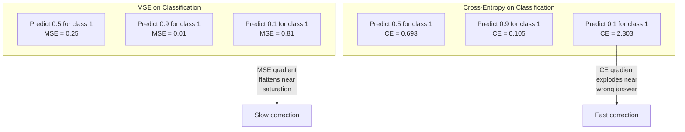
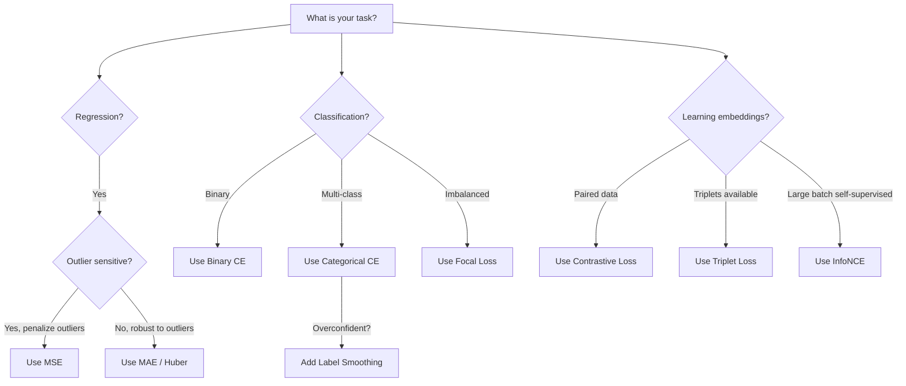
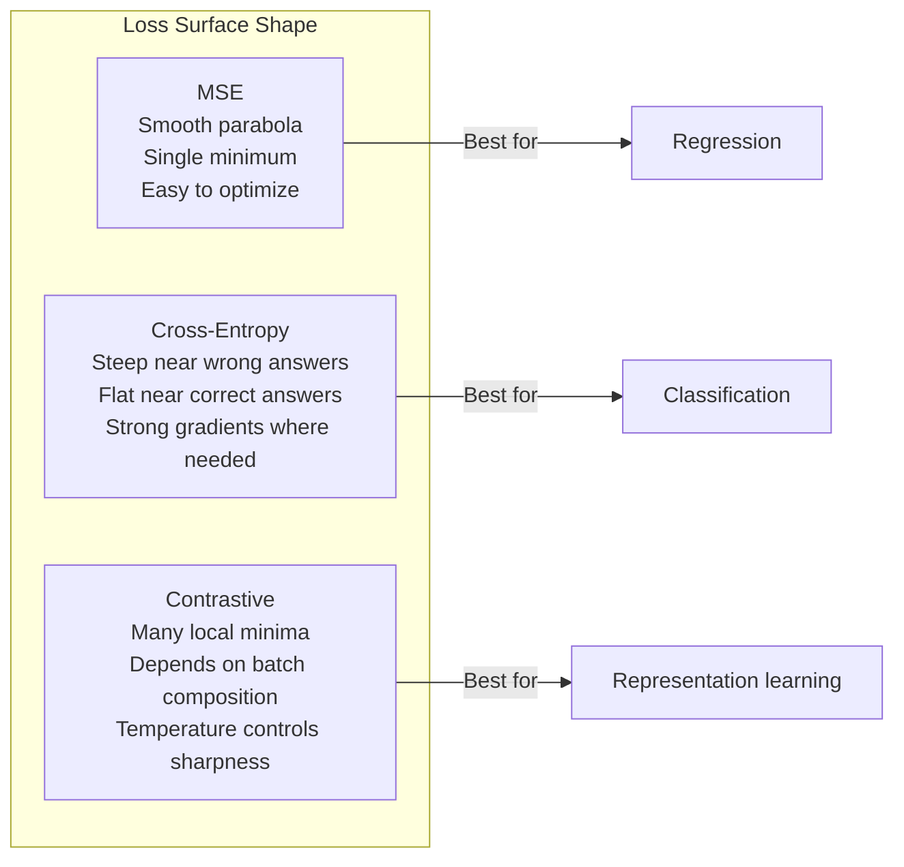

# عملکردهای از دست رفته

> شبکه شما پیش بینی می کند. حقیقت اصلی برعکس می گوید. چقدر اشتباه است؟ این عدد ضرر است. عملکرد ضرر اشتباه را انتخاب کنید و مدل شما برای چیز اشتباه کاملا بهینه می شود.

**Type:** Build
**Languages:** Python
**Prerequisites:** Lesson 03.04 (Activation Functions)
**Time:** ~75 minutes

## اهداف یادگیری

- پیاده سازی MSE، کراس اینترپی دوگانه، کراس اینترپی دسته بندی و از دست دادن متناقض (InfoNCE) از ابتدا با گرادینت های آنها
- توضیح دهید که چرا MSE برای طبقه بندی شکست می یابد با نشان دادن حالت شکست "پیش بینی 0.5 برای همه چیز"
- استفاده از نرم کردن برچسب برای انترپی کراس و توصیف چگونگی جلوگیری از پیش بینی های بیش از حد مطمئن
- عملکرد صحیح از دست دادن را برای بازپسین، طبقه بندی دوگانه، طبقه بندی چند طبقه و گنجانیدن وظایف یادگیری انتخاب کنید

## مشکل

یک مدل که MSE را در یک مشکل طبقه بندی به حداقل می رساند به طور مطمئن برای همه چیز 0.5 پیش بینی می کند. این کاهش ضرر است. همچنین بی فایده است.

تابع خسارت تنها چیزی است که مدل شما واقعا بهینه سازی می کند. دقت نداره نمره فول 1 نه هر اندازهي که به مدير خود گزارش ميکني بهینه ساز گرادینت تابع از دست دادن را می گیرد و وزنه ها را تنظیم می کند تا این عدد را کوچکتر کند. اگر تابع از دست دادن چیزی را که شما اهمیت می دهید را ضبط نکند، مدل ارزان ترین راه ریاضی برای برآورده کردن آن را پیدا می کند، و این راه تقریبا هرگز چیزی نیست که شما می خواهید.

این یک مثال مشخص است. شما يه کار طبقه بندي دوگانه دارين دو کلاس، 50/50 تقسیم تو از MSE به عنوان ضرر خودت استفاده می کنی مدل پیش بینی می کند 0.5 برای هر ورودی واحد. متوسط MSE 0.25 است که حداقل امکان بدون اینکه واقعا چیزی یاد بگیریم. مدل صفر توانایی تبعیض داره اما از نظر فنی عملکرد خسارت شما رو به حداقل رسونده تغییر به کرس-انترپی و همان مدل مجبور است پیش بینی ها را به سمت 0 یا 1 فشار دهد، زیرا -log(0.5) = 0.693 یک ضرر وحشتناک است، در حالی که -log(0.99) = 0.01 پاداش های مطمئن پیش بینی های صحیح است. انتخاب تابع از دست دادن تفاوت بین یک مدل که یاد می گیرد و یک مدل که متریک را بازی می کند.

بدتر می شود. در یادگیری خود نظارت، شما حتی برچسب ها را ندارید. ضایعات تعارفی سیگنال یادگیری را کاملا تعریف می کند: چه چیزی به عنوان مشابه، چه چیزی به عنوان متفاوت محسوب می شود، و چقدر سخت باید مدل آنها را از هم جدا کند. ضایعات تعارفی را اشتباه بگیرید و گنجانیدگی های شما به یک نقطه سقوط می کنند - هر ورودی نقشه به همان ویکتور است. از نظر فنی صفر ضایعات. کاملا بی ارزش.

## مفهوم

### خطای متوسط مربع (MSE)

پیش فرض برای بازگشت. تفاوت مربع بین پیش بینی و هدف را محاسبه کنید، متوسط در تمام نمونه ها.

```
MSE = (1/n) * sum((y_pred - y_true)^2)
```

چرا مربع کردن مهم است: این اشتباهات بزرگ را به صورت مربع مجازات می کند. یک اشتباه 2 هزینه 4 برابر یک اشتباه 1 است. یک اشتباه 10 هزینه 100 برابر است. این باعث می شود MSE حساس به غیر معمول - یک پیش بینی کاملاً نادرست تنها بر ضرر غالب است.

اعداد واقعی: اگر مدل شما قیمت مسکن را پیش بینی کند و تا $10,000 on most houses but off by $200 هزار دلار در یک عمارت، MSE به شدت سعی خواهد کرد که آن عمارت را درست کند، که به طور بالقوه عملکرد 99 خانه دیگر را آسیب می رساند.

گرادینت MSE در رابطه با یک پیش بینی عبارت است از:

```
dMSE/dy_pred = (2/n) * (y_pred - y_true)
```

خطی در خطا. خطاهای بزرگتر گرادیان بزرگتر می شوند. این یک ویژگی برای بازگشت (خطاهای بزرگ نیاز به اصلاحات بزرگ) و یک خطا برای طبقه بندی (شما می خواهید پاسخ های اشتباه مطمئن را به صورت نمایی، نه خطی مجازات کنید).

### از دست دادن کرس-انترپی

تابع خسارت برای طبقه بندی. ریشه در نظریه اطلاعات -- این تفاوت بین توزیع احتمال پیش بینی شده و توزیع واقعی را اندازه گیری می کند.

**Binary Cross-Entropy (BCE):**

```
BCE = -(y * log(p) + (1 - y) * log(1 - p))
```

جایی که y برچسب واقعی (0 یا 1) و p احتمال پیش بینی شده است.

چرا -log(p) کار می کند: وقتی برچسب واقعی 1 است و شما پیش بینی p = 0.99، از دست دادن -log(0.99) = 0.01 است. وقتی پیش بینی p = 0.01، از دست دادن -log(0.01) = 4.6 است. این تفاوت 460x دلیل کار این است که اینترپی کراس است. این به شدت مجازات می کند پیش بینی های اشتباه مطمئن در حالی که به سختی مجازات می کند درست مطمئن.

گرادینت هم همین داستان رو میگه:

```
dBCE/dp = -(y/p) + (1-y)/(1-p)
```

وقتی y = 1 و p نزدیک صفر است، گرادینت -1/p است که به بی نهایت منفی نزدیک می شود. مدل یک سیگنال عظیم برای اصلاح اشتباه خود دریافت می کند. وقتی p نزدیک به 1 است، گرادینت کوچک است. قبلا درست است، هیچ چیز برای اصلاح نیست.

**Categorical Cross-Entropy:**

برای طبقه بندی چند طبقه با هدف های رمزگذاری شده یک گرم.

```
CCE = -sum(y_i * log(p_i))
```

تنها کلاس واقعی به از دست دادن کمک می کند (چون تمام y_i های دیگر صفر هستند). اگر 10 کلاس وجود داشته باشد و کلاس درست احتمال 0.1 (خمط تصادفی) را بدست آورد، از دست دادن -log(0.1) = 2.3 است. اگر کلاس درست احتمال 0.9 را بدست آورد، از دست دادن -log(0.9) = 0.105 است. مدل یاد می گیرد تا جرم احتمال را بر روی پاسخ صحیح متمرکز کند.

### چرا MSE در طبقه بندی شکست می خورد



گرادینتهای MSE هنگامی که پیش بینی ها نزدیک به 0 یا 1 هستند (به دلیل اشباع سیگمائید) ، مسطح می شوند. گرادینتهای کراس-انترپی این را تعویض می کنند - -log مناطق مسطح سیگمائید را لغو می کند و گرادینتهای قوی را دقیقا در جایی که بیشتر مورد نیاز هستند، می دهد.

### نرم کردن برچسب

برچسب های استاندارد یک گرم میگن "این 100 درصد کلاس 3 و 0 درصد همه چیز دیگه" این یک ادعا قوی است.

```
smooth_label = (1 - alpha) * one_hot + alpha / num_classes
```

با الفا = 0.1 و 10 کلاس: به جای [0, 0, 1, 0, ...]، هدف به [0.01، 0.01, 0.91, 0.01, ... می شود. مدل هدف 0.91 به جای 1.0.

چرا این کار می کند: یک مدل که سعی دارد دقیقاً 1.0 را از طریق یک نرم حداکثر تولید کند، باید لوجیت ها را به بی نهایت فشار دهد. این باعث اعتماد بیش از حد می شود، به کلی سازی آسیب می رساند و باعث می شود مدل شکننده به تغییر توزیع شود. صاف کردن برچسب هدف را در 0.9 (با الفا = 0.1) محدود می کند، نگه داشتن لوجیت ها در محدوده معقول است. GPT و اکثر مدل های مدرن از صاف کردن برچسب یا معادل آن استفاده می کنند.

### خسارت های متناقض

هیچ برچسب، هیچ کلاس، فقط جفت ورودی و سوال این است که آیا این ها مشابه هستند یا متفاوت؟

**SimCLR-style contrastive loss (NT-Xent / InfoNCE):**

یک تصویر را بگیرید. دو دیدگاه افزوده از آن را ایجاد کنید (پاییدن، چرخش، رنگ عصبانیت). این ها "دو زوج مثبت" هستند - باید به طور مشابه گنجانده شوند. هر تصویر دیگری در دسته یک "دو زوج منفی" را تشکیل می دهد - باید گنجانده های متفاوتی داشته باشند.

```
L = -log(exp(sim(z_i, z_j) / tau) / sum(exp(sim(z_i, z_k) / tau)))
```

در جایی که sim() شباهت کوسین است، z_i و z_j جفت مثبت هستند، مجموع بر روی تمام منفی ها است، و tau (طمرات) کنترل می کند که توزیع چقدر تیز است. دمای پایین تر = منفی سختتر = جداسازی تهاجمی تر.

اعداد واقعی: اندازه دسته 256 به معنای 255 منفی برای هر جفت مثبت است. دمای tau = 0.07 (SimCLR پیش فرض). از دست دادن به نظر می رسد مانند یک نرم حداکثر بر روی شباهت - آن می خواهد شباهت جفت مثبت بالاتر از همه 256 گزینه است.

**Triplet Loss:**

سه ورودی را می گیرد: لنگر، مثبت (همین کلاس) و منفی (مجموعه مختلف).

```
L = max(0, d(anchor, positive) - d(anchor, negative) + margin)
```

این مارژین (معمولا 0.2-1.0) حداقل فاصله بین فاصله های مثبت و منفی را اعمال می کند. اگر منفی به اندازه کافی دور باشد، ضرر صفر است - هیچ گرادینت، هیچ بروزرسانی نیست. این باعث می شود آموزش کارآمد باشد اما نیازمند استخراج دقیق تریپلتی است (انتخاب منفی سخت که نزدیک لنگر است).

### از دست دادن تمرکز

برای مجموعه داده های نامتناسب. انترپی متقابل استاندارد تمام نمونه های طبقه بندی شده به طور یکسان را در نظر می گیرد. از دست دادن فوکال به پایین وزن نمونه های آسان:

```
FL = -alpha * (1 - p_t)^gamma * log(p_t)
```

در حالی که p_t احتمال پیش بینی شده کلاس واقعی است و گاما تمرکز را کنترل می کند. با گاما = 0، این یک انترپی متقاطع استاندارد است. با گاما = 2 (پیش فرض):

- مثال ساده (p_t = 0.9): وزن = (0.1) ^ 2 = 0.01.
- مثال سخت (p_t = 0.1): وزن = (0.9) ^2 = 0.81.

از دست دادن فوکال توسط لین و همکاران برای تشخیص اشیاء معرفی شد، جایی که 99٪ از مناطق کاندید پس زمینه هستند (منفیات آسان). بدون از دست دادن فوکال، مدل در نمونه های پس زمینه آسان غرق می شود و هرگز یاد نمی گیرد تا اشیاء را شناسایی کند. با آن، مدل ظرفیت خود را بر موارد سخت و مبهم که اهمیت دارند متمرکز می کند.

### درخت تصمیم گیری از دست دادن عملکرد



### زمین شناسی از دست رفته



```figure
cross-entropy-loss
```

## آن را بسازید

### مرحله ی اول: MSE و درجه بندی آن

```python
def mse(predictions, targets):
    n = len(predictions)
    total = 0.0
    for p, t in zip(predictions, targets):
        total += (p - t) ** 2
    return total / n

def mse_gradient(predictions, targets):
    n = len(predictions)
    grads = []
    for p, t in zip(predictions, targets):
        grads.append(2.0 * (p - t) / n)
    return grads
```

### مرحله دوم: دوگانه ی کراس انترپی

مشکل log(0) واقعی است. اگر مدل دقیقاً 0 را برای یک مثال مثبت پیش بینی کند، log(0) = بی نهایت منفی است. کلیک این را جلوگیری می کند.

```python
import math

def binary_cross_entropy(predictions, targets, eps=1e-15):
    n = len(predictions)
    total = 0.0
    for p, t in zip(predictions, targets):
        p_clipped = max(eps, min(1 - eps, p))
        total += -(t * math.log(p_clipped) + (1 - t) * math.log(1 - p_clipped))
    return total / n

def bce_gradient(predictions, targets, eps=1e-15):
    grads = []
    for p, t in zip(predictions, targets):
        p_clipped = max(eps, min(1 - eps, p))
        grads.append(-(t / p_clipped) + (1 - t) / (1 - p_clipped))
    return grads
```

### مرحله 3: کراس انتروپی دسته بندی با Softmax

نرم ماکس، Logit خام رو به احتمالي تبديل ميکنه و بعد ما اينتروپي کراس رو با هدف هاي يکطرفه محاسبه مي کنيم

```python
def softmax(logits):
    max_val = max(logits)
    exps = [math.exp(x - max_val) for x in logits]
    total = sum(exps)
    return [e / total for e in exps]

def categorical_cross_entropy(logits, target_index, eps=1e-15):
    probs = softmax(logits)
    p = max(eps, probs[target_index])
    return -math.log(p)

def cce_gradient(logits, target_index):
    probs = softmax(logits)
    grads = list(probs)
    grads[target_index] -= 1.0
    return grads
```

گرادینت نرم ماکس + انترپی کراس به خوبی ساده می شود: فقط (احتمال پیش بینی شده - 1) برای کلاس واقعی و (احتمال پیش بینی شده) برای تمام کلاس های دیگر. این ساده سازی زیبا تصادفی نیست - به همین دلیل نرم ماکس و انترپی کراس جفت شده است.

### مرحله چهارم: نرم کردن برچسب

```python
def label_smoothed_cce(logits, target_index, num_classes, alpha=0.1, eps=1e-15):
    probs = softmax(logits)
    loss = 0.0
    for i in range(num_classes):
        if i == target_index:
            smooth_target = 1.0 - alpha + alpha / num_classes
        else:
            smooth_target = alpha / num_classes
        p = max(eps, probs[i])
        loss += -smooth_target * math.log(p)
    return loss
```

### مرحله 5: ضایعات متناقض (InfoNCE ساده)

```python
def cosine_similarity(a, b):
    dot = sum(x * y for x, y in zip(a, b))
    norm_a = math.sqrt(sum(x * x for x in a))
    norm_b = math.sqrt(sum(x * x for x in b))
    if norm_a < 1e-10 or norm_b < 1e-10:
        return 0.0
    return dot / (norm_a * norm_b)

def contrastive_loss(anchor, positive, negatives, temperature=0.07):
    sim_pos = cosine_similarity(anchor, positive) / temperature
    sim_negs = [cosine_similarity(anchor, neg) / temperature for neg in negatives]

    max_sim = max(sim_pos, max(sim_negs)) if sim_negs else sim_pos
    exp_pos = math.exp(sim_pos - max_sim)
    exp_negs = [math.exp(s - max_sim) for s in sim_negs]
    total_exp = exp_pos + sum(exp_negs)

    return -math.log(max(1e-15, exp_pos / total_exp))
```

### مرحله 6: MSE در مقابل کراس انتروپی در طبقه بندی

از درس 04 (مجموعه داده دایره) با هر دو عملکرد از دست دادن، همان شبکه را تمرین کنید.

```python
import random

def sigmoid(x):
    x = max(-500, min(500, x))
    return 1.0 / (1.0 + math.exp(-x))

def make_circle_data(n=200, seed=42):
    random.seed(seed)
    data = []
    for _ in range(n):
        x = random.uniform(-2, 2)
        y = random.uniform(-2, 2)
        label = 1.0 if x * x + y * y < 1.5 else 0.0
        data.append(([x, y], label))
    return data


class LossComparisonNetwork:
    def __init__(self, loss_type="bce", hidden_size=8, lr=0.1):
        random.seed(0)
        self.loss_type = loss_type
        self.lr = lr
        self.hidden_size = hidden_size

        self.w1 = [[random.gauss(0, 0.5) for _ in range(2)] for _ in range(hidden_size)]
        self.b1 = [0.0] * hidden_size
        self.w2 = [random.gauss(0, 0.5) for _ in range(hidden_size)]
        self.b2 = 0.0

    def forward(self, x):
        self.x = x
        self.z1 = []
        self.h = []
        for i in range(self.hidden_size):
            z = self.w1[i][0] * x[0] + self.w1[i][1] * x[1] + self.b1[i]
            self.z1.append(z)
            self.h.append(max(0.0, z))

        self.z2 = sum(self.w2[i] * self.h[i] for i in range(self.hidden_size)) + self.b2
        self.out = sigmoid(self.z2)
        return self.out

    def backward(self, target):
        if self.loss_type == "mse":
            d_loss = 2.0 * (self.out - target)
        else:
            eps = 1e-15
            p = max(eps, min(1 - eps, self.out))
            d_loss = -(target / p) + (1 - target) / (1 - p)

        d_sigmoid = self.out * (1 - self.out)
        d_out = d_loss * d_sigmoid

        for i in range(self.hidden_size):
            d_relu = 1.0 if self.z1[i] > 0 else 0.0
            d_h = d_out * self.w2[i] * d_relu
            self.w2[i] -= self.lr * d_out * self.h[i]
            for j in range(2):
                self.w1[i][j] -= self.lr * d_h * self.x[j]
            self.b1[i] -= self.lr * d_h
        self.b2 -= self.lr * d_out

    def compute_loss(self, pred, target):
        if self.loss_type == "mse":
            return (pred - target) ** 2
        else:
            eps = 1e-15
            p = max(eps, min(1 - eps, pred))
            return -(target * math.log(p) + (1 - target) * math.log(1 - p))

    def train(self, data, epochs=200):
        losses = []
        for epoch in range(epochs):
            total_loss = 0.0
            correct = 0
            for x, y in data:
                pred = self.forward(x)
                self.backward(y)
                total_loss += self.compute_loss(pred, y)
                if (pred >= 0.5) == (y >= 0.5):
                    correct += 1
            avg_loss = total_loss / len(data)
            accuracy = correct / len(data) * 100
            losses.append((avg_loss, accuracy))
            if epoch % 50 == 0 or epoch == epochs - 1:
                print(f"    Epoch {epoch:3d}: loss={avg_loss:.4f}, accuracy={accuracy:.1f}%")
        return losses
```

## ازش استفاده کن

PyTorch تمام عملکردهای معیاری از دست دادن را با ثبات عددی ساخته شده در:

```python
import torch
import torch.nn as nn
import torch.nn.functional as F

predictions = torch.tensor([0.9, 0.1, 0.7], requires_grad=True)
targets = torch.tensor([1.0, 0.0, 1.0])

mse_loss = F.mse_loss(predictions, targets)
bce_loss = F.binary_cross_entropy(predictions, targets)

logits = torch.randn(4, 10)
labels = torch.tensor([3, 7, 1, 9])
ce_loss = F.cross_entropy(logits, labels)
ce_smooth = F.cross_entropy(logits, labels, label_smoothing=0.1)
```

استفاده کنید`F.cross_entropy`(نه)`F.nll_loss`و نرمترین دستکاری) این یک کارایی ثابت در یک عملیات استوار عددی است. نرمترین را به طور جداگانه اعمال کنید و سپس از دست دادن این کار کمتر استوار است - شما دقت خود را در معادلات بزرگ از دست می دهید.

برای یادگیری متناقض، اکثر تیم ها از پیاده سازی های سفارشی یا کتابخانه هایی مانند `lightly`یا`pytorch-metric-learning`حلقه اصلی همیشه یکسان است: شباهت های جفت را محاسبه کنید، نرمترین مقدار را بر مثبت و منفی ایجاد کنید، به عقب گسترش دهید.

## -باده

این درس نتیجه می دهد:
- `outputs/prompt-loss-function-selector.md`-- یک پیام قابل استفاده مجدد برای انتخاب عملکرد صحیح از دست دادن
- `outputs/prompt-loss-debugger.md`-- يه پيام تشخيصي براي وقتي که منحني خسارت شما اشتباه به نظر مياد

## تمرینات

1. از دست دادن هوبر (خساری نرم L1) را پیاده سازی کنید که MSE برای اشتباهات کوچک و MAE برای اشتباهات بزرگ است. شبکه بازپسین را با پیش بینی y = sin(x با MSE در مقابل هوبر اجرا کنید وقتی که 5% از اهداف آموزش دارای اضافه شده ی تصادفی شور (غیر عادی) هستند. اشتباه آزمون نهایی را مقایسه کنید.

2. اضافه کردن ضایعات فوکال به حلقه آموزش طبقه بندی دوگانه. مجموعه داده های نامتناسب ایجاد کنید (90% کلاس 0, 10% کلاس 1) . مقایسه استاندارد BCE با ضایعات فوکال (گاما=2) در یادآوری کلاس اقلیت پس از 200 دوره.

3. از دست دادن سه قطعه با استخراج منفی نیمه سخت پیاده سازی کنید. داده های گنجانده 2D را برای 5 کلاس ایجاد کنید. برای هر لنگر سخت ترین منفی را پیدا کنید که هنوز هم از مثبت ( نیمه سخت) دور تر است. تقابل کنورژن با انتخاب سه قطعه تصادفی کنید.

4. مقایسه MSE و entropy cross را اجرا کنید اما در طول آموزش، شدت گرادینت را در هر لایه ردیابی کنید. استاندارد گرادینت متوسط را در هر دوره مشخص کنید. بررسی کنید که گرادینت های cross-entropy در دوره های اولیه که مدل بسیار نامشخص است، گرادینت های بزرگتر را تولید می کند.

5. از دست دادن انحراف KL را پیاده سازی کنید و بررسی کنید که به حداقل رساندن KL ((حقیقی معنایی پیش بینی شده) همان گرادیانس های عبور اینترپی را هنگامی که توزیع واقعی یک گرم است، می دهد. سپس اهداف نرم (مانند لوله سازی دانش) را امتحان کنید که توزیع "واقعی" از تولید نرم حداکثر مدل معلم است.

## اصطلاحات کلیدی

| Term | What people say | What it actually means |
|------|----------------|----------------------|
| Loss function | "How wrong the model is" | A differentiable function mapping predictions and targets to a scalar that the optimizer minimizes |
| MSE | "Average squared error" | Mean of squared differences between predictions and targets; penalizes large errors quadratically |
| Cross-entropy | "The classification loss" | Measures divergence between predicted probability distribution and true distribution using -log(p) |
| Binary cross-entropy | "BCE" | Cross-entropy for two classes: -(y*log(p) + (1-y)*log(1-p)) |
| Label smoothing | "Softening the targets" | Replacing hard 0/1 targets with soft values (e.g., 0.1/0.9) to prevent overconfidence and improve generalization |
| Contrastive loss | "Pull together, push apart" | A loss that learns representations by making similar pairs close and dissimilar pairs far in embedding space |
| InfoNCE | "The CLIP/SimCLR loss" | Normalized temperature-scaled cross-entropy over similarity scores; treats contrastive learning as classification |
| Focal loss | "The imbalanced data fix" | Cross-entropy weighted by (1-p_t)^gamma to down-weight easy examples and focus on hard ones |
| Triplet loss | "Anchor-positive-negative" | Pushes anchor closer to positive than negative by at least a margin in embedding space |
| Temperature | "Sharpness knob" | A scalar divisor on logits/similarities that controls how peaked the resulting distribution is; lower = sharper |

## خواندن بیشتر

- Lin et al., "خسارت فوکال برای تشخیص اشیاء کثیف" (2017) -- برای مدیریت عدم تعادل کلاس شدید در تشخیص اشیاء (RetinaNet) ، از دست دادن فوکال را معرفی کرد
- چن و همکارانش، " چارچوب ساده ای برای یادگیری متناقض نمایش های بصری " (SimCLR، 2020) - لوله یادگیری متناقض مدرن را با از دست دادن NT-Xent تعریف کرد
- زگدی و همکارانش، "برابر معماری آغاز" (2016) -- نرم کردن برچسب را به عنوان یک تکنیک تنظیم سازی معرفی کردند، که اکنون در اکثر مدل های بزرگ استاندارد است
- هینتون و همکارانش، "استفاده از دانش در شبکه عصبی" (2015) -- استفاده از هدف های نرم و انحراف KL، پایه ای برای فشرده سازی مدل
