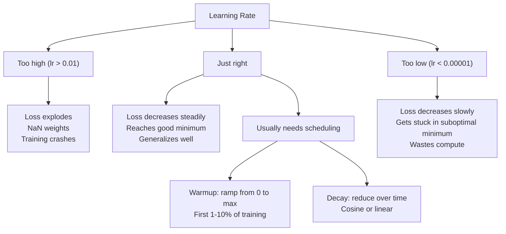
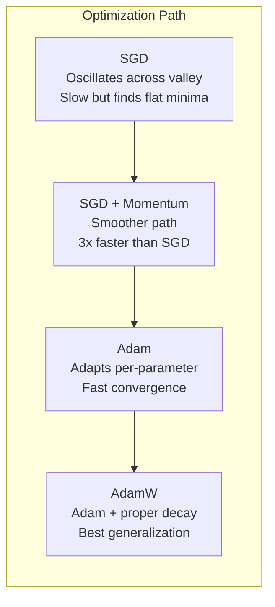
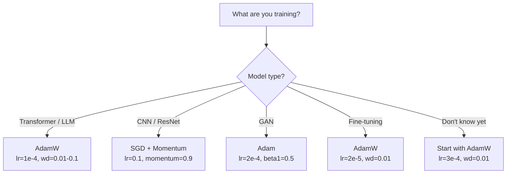

# بهینه سازی کننده ها

> در حالي که در حال حرکت در حال حرکت است، به شما ميگه چه جهت حرکت مي کني. در اين باره هيچ چيزي نميگه چقدر فاصله يا سرعت. SGD يک کامپوس است. آدم GPS با داده هاي ترافیک است.

**Type:** Build
**Languages:** Python
**Prerequisites:** Lesson 03.05 (Loss Functions)
**Time:** ~75 minutes

## اهداف یادگیری

- پیاده سازی SGD، SGD با پتانوم، آدم، و آدمW بهینه سازی از ابتدا در پایتون
- توضیح دهید که چگونه اصلاح تعصب آدم برای تخمین های لحظه ای صفر در مراحل اولیه آموزش تعویض می کند
- نشان دهید که چرا AdamW تولید عمومی سازی بهتر از Adam با L2 تنظیم در همان کار
- بهینه سازی مناسب و فرایندهای پیش فرض را برای ترانسفورماتورها، سی ان ان ها، GAN ها و تنظیم دقیق انتخاب کنید

## مشکل

شما گرادینت ها را محاسبه کردید. می دانید که وزن شماره 4721 باید 0.003 کاهش یابد تا از دست دادن را کاهش دهد. اما 0.003 در کدام واحد؟ به چه اندازه؟ و آیا شما باید مقدار مشابهی را در مرحله 1 و در مرحله 1000 حرکت دهید؟

کاهش گرادینت وانیل سرعت یادگیری مشابهی را برای هر پارامتر در هر مرحله اعمال می کند: گرادینت w = w - lr *. این سه مشکل ایجاد می کند که آموزش شبکه های عصبی را در عمل دردناک می کند.

اول، نوسان. منظره خسارت به ندرت به شکل یک کاسه صاف شکل می گیرد. بیشتر شبیه یک دره طولانی و تنگه گرادینت به سمت دره (در جهت عمق) اشاره دارد، نه در طول آن (در جهت کم عمق). نزول درجه ای از بعد و بعد در طول ابعاد باریک حرکت می کند در حالی که پیشرفت های کوچکی در طول ابعاد مفید انجام می دهد. شما این را دیده اید: از دست دادن به سرعت به بعد از ارتفاع ها کاهش می یابد، نه به این دلیل که مدل همگام شده است بلکه به این دلیل که نوسان دارد.

دوم، یک نرخ یادگیری برای همه پارامترها اشتباه است. برخی از وزن ها نیاز به بروزرسانی های بزرگ دارند (آن ها در مرحله اولیه، مناسب نیستند). دیگران نیاز به بروزرسانی های کوچک دارند (آن ها نزدیک به ارزش مطلوب خود هستند). یک نرخ یادگیری که برای اولین کار می کند، آخرین را نابود می کند و برعکس.

سوم، نقاط سیله. در ابعاد بالا، منظره خسارت مناطق مسطح وسیع دارد که گرادینت نزدیک به صفر است. SGD وانیل با سرعت گرادینت، که به طور عملی صفر است، از میان آنها خزید. مدل به نظر می رسد گیر کرده است. گیر نشده است - در یک منطقه مسطح با نزول مفید در طرف دیگر است. اما SGD هیچ مکانیسم برای فشار دادن از طریق ندارد.

آدم سه تا رو حل ميکنه این دو میانگین در حال اجرا را در هر پارامتر حفظ می کند - gradient متوسط (مومنتوم، نوسانات را اداره می کند) و gradient متوسط مربع (سرعت سازنده، مقیاس های مختلف را اداره می کند). با اصلاح تعصب برای چند گام اول، این یک بهینه سازی واحد را به شما می دهد که در 80٪ از مشکلات با پارامترهای پیش فرض کار می کند. این درس آن را از ابتدا می سازد تا شما دقیقاً بفهمید که چه زمانی و چرا در ۲۰ درصد دیگر شکست می خورد.

## مفهوم

### کاهش درجه ای استوکاستیک (SGD)

ساده ترين بهینه سازي، تراز رو بر روي يه دسته ي کوچک محاسبه کن و به سمت مخالف حرکت کن

```
w = w - lr * gradient
```

"استوچاستیک" به معنای استفاده از یک زیر مجموعه تصادفی از داده ها برای تخمین گیری گرادینت است، نه کل مجموعه داده ها. این صدا در واقع مفید است -- به فرار از حداقل های محلی شدید کمک می کند. اما صدا همچنین باعث نوسان می شود.

نرخ یادگیری تنها دکمه است. بیش از حد بالا: از دست دادن متفاوت است. بیش از حد پایین: آموزش برای همیشه طول می کشد. ارزش مطلوب بستگی به معماری، داده ها، اندازه دسته و مرحله فعلی آموزش دارد. برای SGD وانیل در شبکه های مدرن، ارزش های معمول از 0.01 تا 0.1 است. اما حتی در یک دوره آموزشی، نرخ یادگیری ایده آل تغییر می کند.

### حرکت

این مقایسه با چرخاندن توپ و پایین رفتن بیش از حد استفاده شده اما دقیق است. به جای اینکه تنها از طریق گرادینت قدم بزنی، سرعتی را حفظ می کنی که در گرادینت های گذشته جمع می شود.

```
m_t = beta * m_{t-1} + gradient
w = w - lr * m_t
```

با بتا = 0.9، حرکت تقریباً میانگین 10 گرادیانت گذشته (1 / (1 - 0.9) = 10 است.

چرا این نوسان را تنظیم می کند: گرادیانت هایی که به همان جهت اشاره می کنند جمع می شوند. گرادیانت هایی که به سمت دیگر حرکت می کنند حذف می شوند. در این دره باریک، بخش "تراپی" هر گام را نشان می دهد و کاهش می یابد. بخش "در طول" ثابت می ماند و تقویت می شود. نتیجه تسریع صاف در جهت مفید است.

اعداد واقعی: SGD تنها در یک چشم انداز ضرر بد شرایط ممکن است 10،000 قدم طول بکشد. SGD با حرکت (beta = 0.9) معمولاً در مورد یک مشکل 3000 تا 5000 قدم طول می کشد. سرعت بالا حاشیه ای نیست.

### RMSProp

اولین روش نرخ یادگیری سازنده در هر پارامتر که واقعا کار کرد. توسط هینتون در سخنرانی Coursera پیشنهاد شد (که هرگز به طور رسمی منتشر نشد).

```
s_t = beta * s_{t-1} + (1 - beta) * gradient^2
w = w - lr * gradient / (sqrt(s_t) + epsilon)
```

s_t میانگین جریان گرادینت های مربع را ردیابی می کند. پارامترهای دارای گرادینت های مداوم بزرگ با یک عدد بزرگ تقسیم می شوند (سرمایه یادگیری موثر کوچکتر). پارامترهای دارای گرادینت های کوچک با یک عدد کوچک تقسیم می شوند (سرمایه یادگیری موثر بزرگتر).

این مشکل یک نرخ یادگیری برای همه پارامترها را حل می کند. وزن ای که قبلاً به روزرسانی های بزرگ رسیده است احتمالاً نزدیک به هدفش است -- کندش می کند. وزن ای که به روزرسانی های کوچک رسیده است ممکن است زیر تمرین باشد -- سرعتش را افزایش دهد.

اپسایلون (معمولا 1e-8) مانع تقسیم با صفر می شود وقتی یک پارامتر به روز نشده است.

### آدم: پمپنتم + RMSProp

آدم هر دو ایده رو ترکیب می کنه.

```
m_t = beta1 * m_{t-1} + (1 - beta1) * gradient        (first moment: mean)
v_t = beta2 * v_{t-1} + (1 - beta2) * gradient^2       (second moment: variance)
```

**Bias correction**در مرحله 1، m_1 = (1 - beta1) * گرادینت. با beta1 = 0.9, که 0.1 * گرادینت -- ده برابر کوچک است. متوسط متحرک هنوز گرم نشده است. تعدیل تعویض:

```
m_hat = m_t / (1 - beta1^t)
v_hat = v_t / (1 - beta2^t)
```

در مرحله 1 با بتا1 = 0.9: m_hat = m_1 / (1 - 0.9) = m_1 / 0.1 = گرادینت واقعی. در مرحله 100: (1 - 0.9^100) حدود 1.0 است، بنابراین اصلاح ناپدید می شود. اصلاح تعصب برای اولین ~ 10 مرحله مهم است و بعد از ~ 50 غیر مرتبط است.

تازه ترین:

```
w = w - lr * m_hat / (sqrt(v_hat) + epsilon)
```

آدم پیش فرض: lr = 0.001، beta1 = 0.9، beta2 = 0.999, epsilon = 1e-8. این پیش فرض ها برای 80٪ از مشکلات کار می کنند. وقتی که نمی کنند، اول lr را تغییر دهید. سپس beta2. تقریبا هرگز beta1 یا epsilon را تغییر ندهید.

### کاهش وزن درست انجام شد

در L2 تنظیم کردن lambda * w^2 به از دست دادن اضافه می کند. در SGD وانیل، این معادل کاهش وزن (به حذف lambda * w از وزن در هر مرحله) است. در آدم، این معادلات شکسته می شود.

بینش لوشیلوف و هاتر: وقتی L2 را به ضایعات اضافه می کنید و سپس آدم گرادیانت را پردازش می کند، سرعت یادگیری سازگاری نیز اصطلاح تنظیم را مقیاس می گیرد. پارامترهای دارای تفاوت گرادیانت بزرگ تنظیم کمتری دارند. پارامترهای دارای تفاوت کوچک تنظیم بیشتری دارند. این چیزی نیست که شما می خواهید - شما می خواهید تنظیم یکسانی بدون توجه به آمار گرادیانت.

AdamW این مشکل را با استفاده از کاهش وزن مستقیماً بر روی وزن ها، پس از بروزرسانی آدم، حل می کند:

```
w = w - lr * m_hat / (sqrt(v_hat) + epsilon) - lr * lambda * w
```

اصطلاح کاهش وزن (lr * lambda * w) با فاکتور سازگاری آدم مقیاس پذیر نیست. هر پارامتر دارای انقباض متناسب یکسان است.

این به نظر می رسد یک جزئیات کوچک. این نیست. AdamW به راه حل های بهتر از تنظیم آدم + L2 در تقریبا هر کار نزدیک می شود. این بهینه سازی پیش فرض در PyTorch برای آموزش ترانسفر، مدل های انتشار و اکثر معماری های مدرن است. BERT، GPT، LLaMA، انتشار پایدار - همه با AdamW آموزش دیده اند.

### نرخ یادگیری: مهم ترین فرامیتر



اگر یک پارامتر فوق العاده را تنظیم کنید، سرعت یادگیری را تنظیم کنید. تغییر 10 برابر در سرعت یادگیری مهم تر از هر تصمیم معماری است که شما می کنید.

- SGD: lr = 0.01 تا 0.1
- آدم/آدمW: lr = 1e-4 تا 3e-4
- مدل های پیش از آموزش: lr = 1e-5 تا 5e-5
- افزایش سرعت یادگیری: رمپ خطی در 1-10% مراحل اول

### مقایسه بهینه سازی



### وقتی هر بهینه ساز برنده می شود



```figure
optimizer-trajectory
```

## آن را بسازید

### مرحله ی اول: SGD وانیل

```python
class SGD:
    def __init__(self, lr=0.01):
        self.lr = lr

    def step(self, params, grads):
        for i in range(len(params)):
            params[i] -= self.lr * grads[i]
```

### مرحله دوم: SGD با Momentum

```python
class SGDMomentum:
    def __init__(self, lr=0.01, beta=0.9):
        self.lr = lr
        self.beta = beta
        self.velocities = None

    def step(self, params, grads):
        if self.velocities is None:
            self.velocities = [0.0] * len(params)
        for i in range(len(params)):
            self.velocities[i] = self.beta * self.velocities[i] + grads[i]
            params[i] -= self.lr * self.velocities[i]
```

### مرحله سوم: آدم

```python
import math

class Adam:
    def __init__(self, lr=0.001, beta1=0.9, beta2=0.999, epsilon=1e-8):
        self.lr = lr
        self.beta1 = beta1
        self.beta2 = beta2
        self.epsilon = epsilon
        self.m = None
        self.v = None
        self.t = 0

    def step(self, params, grads):
        if self.m is None:
            self.m = [0.0] * len(params)
            self.v = [0.0] * len(params)

        self.t += 1

        for i in range(len(params)):
            self.m[i] = self.beta1 * self.m[i] + (1 - self.beta1) * grads[i]
            self.v[i] = self.beta2 * self.v[i] + (1 - self.beta2) * grads[i] ** 2

            m_hat = self.m[i] / (1 - self.beta1 ** self.t)
            v_hat = self.v[i] / (1 - self.beta2 ** self.t)

            params[i] -= self.lr * m_hat / (math.sqrt(v_hat) + self.epsilon)
```

### مرحله چهارم: آدم

```python
class AdamW:
    def __init__(self, lr=0.001, beta1=0.9, beta2=0.999, epsilon=1e-8, weight_decay=0.01):
        self.lr = lr
        self.beta1 = beta1
        self.beta2 = beta2
        self.epsilon = epsilon
        self.weight_decay = weight_decay
        self.m = None
        self.v = None
        self.t = 0

    def step(self, params, grads):
        if self.m is None:
            self.m = [0.0] * len(params)
            self.v = [0.0] * len(params)

        self.t += 1

        for i in range(len(params)):
            self.m[i] = self.beta1 * self.m[i] + (1 - self.beta1) * grads[i]
            self.v[i] = self.beta2 * self.v[i] + (1 - self.beta2) * grads[i] ** 2

            m_hat = self.m[i] / (1 - self.beta1 ** self.t)
            v_hat = self.v[i] / (1 - self.beta2 ** self.t)

            params[i] -= self.lr * m_hat / (math.sqrt(v_hat) + self.epsilon)
            params[i] -= self.lr * self.weight_decay * params[i]
```

### مرحله پنجم: مقایسه آموزش

شبكه دو لایه اي را در مجموعه داده هاي دايره از درس 05 با تمام چهار بهینه سازي آموزش دهيد.

```python
import random

def sigmoid(x):
    x = max(-500, min(500, x))
    return 1.0 / (1.0 + math.exp(-x))

def make_circle_data(n=200, seed=42):
    random.seed(seed)
    data = []
    for _ in range(n):
        x = random.uniform(-2, 2)
        y = random.uniform(-2, 2)
        label = 1.0 if x * x + y * y < 1.5 else 0.0
        data.append(([x, y], label))
    return data


class OptimizerTestNetwork:
    def __init__(self, optimizer, hidden_size=8):
        random.seed(0)
        self.hidden_size = hidden_size
        self.optimizer = optimizer

        self.w1 = [[random.gauss(0, 0.5) for _ in range(2)] for _ in range(hidden_size)]
        self.b1 = [0.0] * hidden_size
        self.w2 = [random.gauss(0, 0.5) for _ in range(hidden_size)]
        self.b2 = 0.0

    def get_params(self):
        params = []
        for row in self.w1:
            params.extend(row)
        params.extend(self.b1)
        params.extend(self.w2)
        params.append(self.b2)
        return params

    def set_params(self, params):
        idx = 0
        for i in range(self.hidden_size):
            for j in range(2):
                self.w1[i][j] = params[idx]
                idx += 1
        for i in range(self.hidden_size):
            self.b1[i] = params[idx]
            idx += 1
        for i in range(self.hidden_size):
            self.w2[i] = params[idx]
            idx += 1
        self.b2 = params[idx]

    def forward(self, x):
        self.x = x
        self.z1 = []
        self.h = []
        for i in range(self.hidden_size):
            z = self.w1[i][0] * x[0] + self.w1[i][1] * x[1] + self.b1[i]
            self.z1.append(z)
            self.h.append(max(0.0, z))

        self.z2 = sum(self.w2[i] * self.h[i] for i in range(self.hidden_size)) + self.b2
        self.out = sigmoid(self.z2)
        return self.out

    def compute_grads(self, target):
        eps = 1e-15
        p = max(eps, min(1 - eps, self.out))
        d_loss = -(target / p) + (1 - target) / (1 - p)
        d_sigmoid = self.out * (1 - self.out)
        d_out = d_loss * d_sigmoid

        grads = [0.0] * (self.hidden_size * 2 + self.hidden_size + self.hidden_size + 1)
        idx = 0
        for i in range(self.hidden_size):
            d_relu = 1.0 if self.z1[i] > 0 else 0.0
            d_h = d_out * self.w2[i] * d_relu
            grads[idx] = d_h * self.x[0]
            grads[idx + 1] = d_h * self.x[1]
            idx += 2

        for i in range(self.hidden_size):
            d_relu = 1.0 if self.z1[i] > 0 else 0.0
            grads[idx] = d_out * self.w2[i] * d_relu
            idx += 1

        for i in range(self.hidden_size):
            grads[idx] = d_out * self.h[i]
            idx += 1

        grads[idx] = d_out
        return grads

    def train(self, data, epochs=300):
        losses = []
        for epoch in range(epochs):
            total_loss = 0.0
            correct = 0
            for x, y in data:
                pred = self.forward(x)
                grads = self.compute_grads(y)
                params = self.get_params()
                self.optimizer.step(params, grads)
                self.set_params(params)

                eps = 1e-15
                p = max(eps, min(1 - eps, pred))
                total_loss += -(y * math.log(p) + (1 - y) * math.log(1 - p))
                if (pred >= 0.5) == (y >= 0.5):
                    correct += 1
            avg_loss = total_loss / len(data)
            accuracy = correct / len(data) * 100
            losses.append((avg_loss, accuracy))
            if epoch % 75 == 0 or epoch == epochs - 1:
                print(f"    Epoch {epoch:3d}: loss={avg_loss:.4f}, accuracy={accuracy:.1f}%")
        return losses
```

## ازش استفاده کن

بهینه سازی های PyTorch گروه های پارامتر، کپی گرادینت و برنامه ریزی سرعت یادگیری را مدیریت می کنند:

```python
import torch
import torch.optim as optim

model = torch.nn.Sequential(
    torch.nn.Linear(784, 256),
    torch.nn.ReLU(),
    torch.nn.Linear(256, 10),
)

optimizer = optim.AdamW(model.parameters(), lr=3e-4, weight_decay=0.01)

scheduler = optim.lr_scheduler.CosineAnnealingLR(optimizer, T_max=100)

for epoch in range(100):
    optimizer.zero_grad()
    output = model(torch.randn(32, 784))
    loss = torch.nn.functional.cross_entropy(output, torch.randint(0, 10, (32,)))
    loss.backward()
    torch.nn.utils.clip_grad_norm_(model.parameters(), max_norm=1.0)
    optimizer.step()
    scheduler.step()
```

این الگوی همیشه: صفر_ درجه، پیش، از دست دادن، عقب، (کلیپ) ، مرحله، (جدول) است. این ترتیب را به یاد داشته باشید. اشتباه گرفتن آن (به عنوان مثال، تماس با برنامه ریزی کننده.دقیقه() قبل از بهینه سازی کننده.دقیقه()) یک منبع رایج از اشکال ظریف است.

برای CNNs، بسیاری از تمرین کنندگان هنوز هم SGD + پتانزم (lr=0.1، پتانزم =0.9، وزن_فراغت =1e-4) را با یک برنامه مرحله ای یا کوسین ترجیح می دهند. SGD حداقل های مسطح تر را پیدا می کند، که اغلب بهتر عمومی می شوند. برای ترانسفورماتورها و LLM، AdamW با گرم شدن + تجزیه کوسین پیش فرض جهانی است. بدون دلیل اندازه گیری با اجماع مبارزه نکنید.

## -باده

این درس نتیجه می دهد:
- `outputs/prompt-optimizer-selector.md`-- یک تصمیم فوری برای انتخاب بهینه سازی مناسب و نرخ یادگیری برای هر معماری

## تمرینات

1. حرکت Nesterov را پیاده سازی کنید، جایی که gradient را در موقعیت "lookhead" (w - lr * beta * v) به جای موقعیت فعلی محاسبه کنید.

2. برنامه ی گرمایش سرعت یادگیری را اجرا کنید: رامپ خطی از 0 تا max_lr در 10 درصد مراحل آموزش، سپس تجزیه کوسین به 0. آموزش با آدم + گرمایش در مقابل آدم بدون گرمایش. اندازه گیری اینکه چه تعداد دوره ای طول می کشد تا به 90 درصد دقت در مجموعه داده های دایره برسد.

3. سرعت یادگیری موثر برای هر پارامتر در طول آموزش آدم را ردیابی کنید. نرخ موثر lr * m_hat / (sqrt(v_hat) + eps است. توزیع نرخ های موثر را پس از 10، 50 و 200 مرحله نقشه بزنید. آیا همه پارامترها با همان سرعت به روز می شوند؟

4. پیاده سازی کلیک گرادینت (کلیک با استاندارد جهانی). استاندارد کلیک ماکس را به 1.0 تنظیم کنید. با استفاده از نرخ یادگیری بالا (lr=0.01 برای آدم) و بدون کلیک تمرین کنید. شمارش کنید که چه تعداد رنز متفاوت است (خسارت به NaN) با و بدون کلیک بیش از 10 دانه تصادفی.

5. مقایسه آدم با آدم و در شبکه با وزن های بزرگ. همه وزن ها را به مقادیر تصادفی در [-5, 5] (بسیاری بزرگتر از حد معمول) آغاز کنید. برای 200 دوره با وزن_فراختن=0.1 تمرین کنید. نورم L2 وزن را بر روی تمرین برای هر دو بهینه کننده نشان دهید. آدم و باید کاهش وزن سریعتر نشان دهد.

## اصطلاحات کلیدی

| Term | What people say | What it actually means |
|------|----------------|----------------------|
| Learning rate | "Step size" | The scalar multiplier on the gradient update; the single most impactful hyperparameter in training |
| SGD | "Basic gradient descent" | Stochastic gradient descent: update weights by subtracting lr * gradient, computed on a mini-batch |
| Momentum | "Rolling ball analogy" | Exponential moving average of past gradients; dampens oscillation and accelerates consistent directions |
| RMSProp | "Adaptive learning rate" | Divides each parameter's gradient by the running RMS of its recent gradients; equalizes learning rates |
| Adam | "The default optimizer" | Combines momentum (first moment) and RMSProp (second moment) with bias correction for the initial steps |
| AdamW | "Adam done right" | Adam with decoupled weight decay; applies regularization directly to weights rather than through the gradient |
| Bias correction | "Warmup for running averages" | Dividing by (1 - beta^t) to compensate for the zero-initialization of Adam's moment estimates |
| Weight decay | "Shrink the weights" | Subtracting a fraction of the weight value at each step; a regularizer that penalizes large weights |
| Learning rate schedule | "Changing lr over time" | A function that adjusts the learning rate during training; warmup + cosine decay is the modern default |
| Gradient clipping | "Capping the gradient norm" | Scaling down the gradient vector when its norm exceeds a threshold; prevents exploding gradient updates |

## خواندن بیشتر

- کنگما و با، "آدم: یک روش برای بهینه سازی استوکاستیک" (2014) - مقاله اصلی آدم با تجزیه و تحلیل تقارب و محور اصلاح تحریف
- لوشچیلوف و هاتر، "دستورسازی کاهش وزن قطع شده" (2017) -- ثابت کرد که تنظیم L2 و کاهش وزن در آدم معادل نیستند، و پیشنهاد کرد که AdamW
- اسمیت، "سرکی نرخ یادگیری برای آموزش شبکه های عصبی" (2017) -- آزمایش دامنه LR و برنامه های چرخه ای را معرفی کرد که نیاز به تنظیم نرخ یادگیری ثابت را از بین می برد
- رودر، "تعمیر کلی الگوریتم های بهینه سازی گرادینت Descent" (2016) - بهترین بررسی تک تک از همه انواع بهینه سازی، با مقایسه و بینش های واضح
