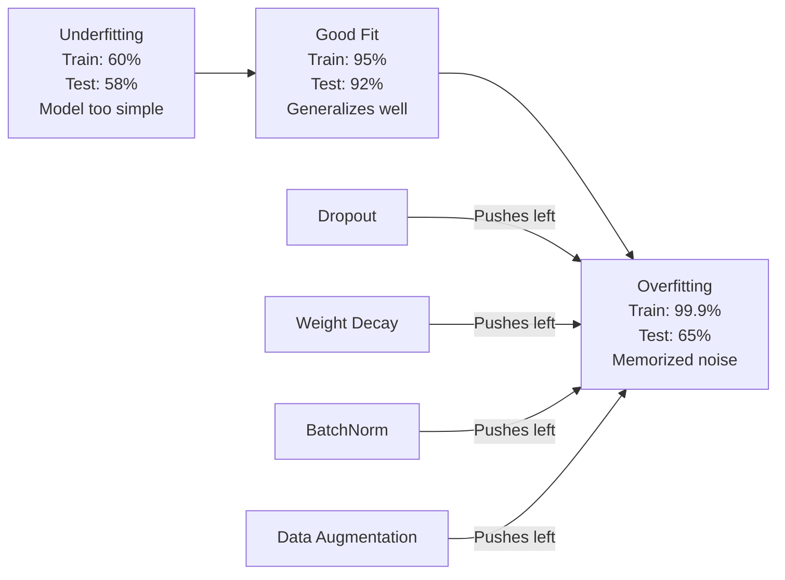
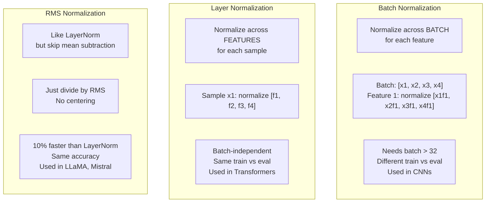
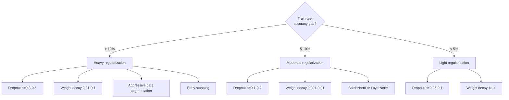

# تنظیم

> مدل شما 99 درصد از داده های آموزش و 60 درصد از داده های آزمون را بدست می آورد. به جای یادگیری یاد می گیرد. تنظیم کردن مالیاتی است که شما بر پیچیدگی تحمیل می کنید تا کلی سازی را مجبور کنید.

**Type:** Build
**Languages:** Python
**Prerequisites:** Lesson 03.06 (Optimizers)
**Time:** ~75 minutes

## اهداف یادگیری

- پیاده سازی ترک با مقیاس باز، کاهش وزن L2، نرمال سازی دسته، نرمال سازی لایه و RMSNorm از ابتدا
- اندازه گیری شکاف دقت آزمون قطار و تشخیص بیش از حد با استفاده از آزمایش های تنظیم
- توضیح دهید که چرا ترانسفورماتورها از LayerNorm به جای BatchNorm استفاده می کنند و چرا LLM های مدرن RMSNorm را ترجیح می دهند.
- ترکیب صحیح تکنیک های تنظیم را بر اساس شدت بیش از حد مناسب استفاده کنید.

## مشکل

شبکه عصبی با پارامترهای کافی می تواند هر مجموعه داده را به یاد آورد. این فرضیه ای نیست - ژانگ و همکاران (2017) این را با آموزش شبکه های استاندارد در ImageNet با برچسب های تصادفی اثبات کرد. شبکه ها در وظایف برچسب های تصادفی به صفر نزدیک شدند. آنها یک میلیون جفت ورودی و خروجی تصادفی را بدون الگوی برای یادگیری به یاد آوردند. از دست دادن تمرین کامل بود. دقت آزمون صفر بود.

این مشکل بیش از حد مناسب است و با افزایش حجم مدل ها بدتر می شود. GPT-3 دارای 175 میلیارد پارامتر است. مجموعه آموزشی حدود 500 میلیارد توکن دارد. با این پارامتر ها، مدل ظرفیت کافی برای حفظ قطعات قابل توجهی از داده های آموزشی به معنای واقعی کلمه دارد. بدون تنظیم، آن را فقط نمونه های آموزش به جای یادگیری الگوهای عمومی.

شکاف بین عملکرد آموزش و عملکرد آزمون، شکاف بیش از حد مناسب است. هر تکنیک در این درس از زاویه ی متفاوتی به این شکاف حمله می کند. ترک کردن باعث می شود شبکه به هیچ نورون انحصاری نداشته باشد. کاهش وزن مانع از افزایش وزن می شود. نرمال سازی دسته باعث نرم شدن منظر خسارت می شود تا بهینه کننده حداقل های مسطح تر و قابل عمومی تر را پیدا کند. نرمال سازی لایه ها همان کار را انجام می دهد اما در جایی که نرمال سازی دسته شکست می خورد (مجموعه های کوچک، دنباله های طول متغیر) کار می کند. RMSNorm با کاهش متوسط محاسبه 10 درصد سریع تر انجام می دهد. هر تکنیک ساده است. با هم، تفاوت بین یک مدل که یاد می گیرد و یک مدل که عمومی می شود.

## مفهوم

### طیف بیش از حد مناسب

هر مدل در جایی در طیف قرار دارد از زیرنویس (به اندازه کافی ساده برای گرفتن الگوی) تا بیش از حد مناسب (به اندازه ای پیچیده که صدای را ضبط می کند). نقطه شیرین در میان است و تنظیم سازی مدل ها را از طرف overfit به سمت آن فشار می دهد.



### ترک

ساده ترين روش تنظيم با معجزه هاي انعکاسي در طول آموزش، به طور تصادفي، خروجي هر نورون به صفر با احتمال p

```
output = activation(z) * mask    where mask[i] ~ Bernoulli(1 - p)
```

با p=0.5، نیمی از نورون ها در هر گذرگاه جلو صفر می شوند. شبکه باید نمایش های اضافی را یاد بگیرد چون نمی تواند پیش بینی کند که کدام نورون ها در دسترس هستند. این مانع از تطابق مشترک می شود - نورون ها یاد می گیرند که به نورون های خاص دیگری که در دسترس هستند اعتماد کنند.

تفسیر مجموعه: یک شبکه با N نورون و ترک ایجاد 2^N زیر شبکه ممکن (هر ترکیب از نورون ها فعال یا خاموش است). آموزش با ترک تقریبا تمام زیر شبکه های 2N را همزمان در دسته های مختلف ترانز می کند. در زمان آزمون، تمام نورون ها را (بدون تخفیف) استفاده می کنید و مقدار تولیدات را با (1 - p) اندازه گیری می کنید تا با مقدار انتظار شده در طول تمرین مطابقت داشته باشد. این معادل متوسط پیش بینی های زیر شبکه های 2^N است -- مجموعه ای عظیم از یک مدل.

در عمل، مقیاس گذاری در زمان آموزش به جای آزمایش (پایز برگشت) اعمال می شود:

```
During training:  output = activation(z) * mask / (1 - p)
During testing:   output = activation(z)   (no change needed)
```

این تمیز تر است چون کد تست نیازی به دانستن در مورد ترک در تمام نیست.

نرخ پیش فرض: p = 0.1 برای ترانسفورماتورها، p = 0.5 برای MLPs، p = 0.2-0.3 برای CNNs. کاهش بیشتر = تنظیمات قویتر = خطر مناسبیت بیشتر.

### کاهش وزن (تعدیل L2)

به اندازه مربع تمام وزن ها اضافه کنید:

```
total_loss = task_loss + (lambda / 2) * sum(w_i^2)
```

گرادینت اصطلاح تنظیم lambda * w است. این بدان معنی است که در هر مرحله، هر وزن به سمت صفر با یک بخش متناسب با شدت آن کاهش می یابد. وزن های بزرگ بیشتر مجازات می شوند. مدل به سمت راه حل هایی که هیچ وزن واحد تسلط ندارد، فشار می یابد.

چرا این به عمومی سازی کمک می کند: مدل های overfit به طور کلی دارای وزنهای بزرگ هستند که در داده های آموزش شور را تقویت می کنند. کاهش وزن وزن وزن را کوچک نگه می دارد، که ظرفیت موثر مدل را محدود می کند و آن را مجبور می کند به جای ویژگی های قابل به خاطر آمده، به ویژگی های قوی و عمومی اعتماد کند.

هائپر پارامتر لامبدا قدرت را کنترل می کند.

- 0.01 برای AdamW در ترانسفورماتورها
- 1e-4 برای SGD در سی ان ان
- 0.1 برای مدل های بیش از حد مناسب

همانطور که در درس 06: کاهش وزن و تنظیم L2 در SGD معادل هستند اما در آدم نیست. همیشه از AdamW (زوال وزن قطع شده) هنگام تمرین با آدم استفاده کنید.

### نرمال سازی دسته

تولید هر لایه را در سراسر دسته کوچک قبل از انتقال آن به لایه بعدی عادی کنید.

برای یک دسته کوچک از فعال سازی در برخی لایه ها:

```
mu = (1/B) * sum(x_i)           (batch mean)
sigma^2 = (1/B) * sum((x_i - mu)^2)   (batch variance)
x_hat = (x_i - mu) / sqrt(sigma^2 + eps)   (normalize)
y = gamma * x_hat + beta        (scale and shift)
```

گاما و بتا پارامترهای قابل یادگیری هستند که به شبکه اجازه می دهند که عادی سازی را اگر مطلوب باشد، رد کند. بدون آنها، شما می خواهید هر لایه تولید شود تا صفر متوسط واحد-فرق باشد، که ممکن است چیزی نباشد که شبکه می خواهد.

**Training vs inference split:**در طول تمرین، mu و sigma از دسته کوچک فعلی می آیند. در طول نتیجه گیری، شما از میانگین های اجرا جمع شده در طول تمرین استفاده می کنید (متوسط متحرک تعرضی با حرکت = 0.1, یعنی 90٪ قدیمی + 10٪ جدید).

چرا BatchNorm کار می کند هنوز بحث می شود. مقاله اصلی ادعا کرد که "تبدیل کوویریات داخلی" را کاهش می دهد (توزعه ورودی لایه ها با بروز رسانی لایه های قبلی تغییر می کند). سنتورکر و همکاران (2018) نشان داد این توضیح اشتباه است. دلیل اصلی: باتچ نورم باعث می شود که وضعیت خسارت هموار تر شود. گرادینت ها پیش بینی بیشتری دارند، ثابت های لیپسکیتز کوچکتر هستند و بهینه کننده می تواند گام های بزرگتر را به طور ایمن انجام دهد. به همین دلیل است که BatchNorm به شما اجازه می دهد از نرخ یادگیری بالاتر استفاده کنید و سریعتر به هم نزدیک شوید.

BatchNorm دارای محدودیت اساسی است: این بستگی به آمار دسته دارد. با اندازه دسته 1، متوسط و تفاوت بی معنی هستند. با دسته های کوچک (<32) ، آمار ها سر و صدا و عملکرد آسیب پذیر هستند. این برای وظایف مانند تشخیص اشیاء (که حافظه اندازه دسته را محدود می کند) و مدل سازی زبان (که طول دنباله ها متفاوت است) مهم است.

### عادی سازی لایه

برای یک نمونه ی واحد:

```
mu = (1/D) * sum(x_j)           (feature mean)
sigma^2 = (1/D) * sum((x_j - mu)^2)   (feature variance)
x_hat = (x_j - mu) / sqrt(sigma^2 + eps)
y = gamma * x_hat + beta
```

D ابعاد ویژگی است. هر نمونه به طور مستقل عادی می شود - هیچ وابستگی به اندازه دسته ای نیست. به همین دلیل ترانسفورماتورها از LayerNorm به جای BatchNorm استفاده می کنند. دنباله ها دارای طول متغیر هستند، اندازه دسته اغلب کوچک است (یا 1 در طول تولید) و محاسبه بین آموزش و نتیجه گیری یکسان است.

LayerNorm در ترانسفورماتورها پس از هر بلوک خود توجه و هر بلوک ارسال (پوس-LN) یا قبل از آنها (Pre-LN) اعمال می شود که برای آموزش پایدارتر است.

### RMSNorm

LayerNorm بدون معادلات متوسط. پیشنهاد شده توسط Zhang & Sennrich (2019).

```
rms = sqrt((1/D) * sum(x_j^2))
y = gamma * x / rms
```

این است. هیچ محاسبات متوسط، هیچ پارامتر بتا. مشاهده: بازمرکز (حاشیه متوسط) در LayerNorm به عملکرد مدل بسیار کم کمک می کند، اما هزینه محاسبات است. حذف آن به دقت مشابه با حدود 10 درصد هزینه های عمومی کمتر می دهد.

LLaMA، LLaMA، LLaMA، LLaMA، Mistral، و اکثر LLM های مدرن از RMSNorm به جای LayerNorm استفاده می کنند. در مقیاس میلیاردها پارامتر و تریلیون توکن، این 10٪ پس انداز قابل توجه است.

### مقایسه عادی سازی



### افزایش داده ها به عنوان تنظیم

نه یک تغییر مدل بلکه یک تغییر داده. در حالی که برچسب ها را حفظ می کند، ورودی های آموزش را تغییر دهید:

- تصاویر: محصول تصادفی، فلپ، چرخش، رنگ عصبانی، قطع
- متن: جایگزینی مترادف، ترجمه مجدد، حذف تصادفی
- صدا: زمان کشش، تغییر سرعت، اضافه شدن صدا

این اثر مشابه به تنظیم است: این اندازه واقعی مجموعه آموزش را افزایش می دهد و برای مدل حفظ نمونه های خاص دشوارتر می شود. یک مدل که هر تصویر را تنها یک بار در شکل اصلی خود می بیند می تواند آن را به یاد بگیرد. یک مدل که 50 نسخه افزوده از هر تصویر را می بیند مجبور به یادگیری ساختار غیر متغیر است.

### توقف زودرس

ساده ترین تنظیم کننده: توقف تمرین زمانی که از دست دادن اعتبار شروع به افزایش می کند. مدل هنوز در آن نقطه بیش از حد مناسب نیست. در عمل، شما از دست دادن اعتبار را در هر دوره ردیابی می کنید، بهترین مدل را ذخیره می کنید و برای پنجره "صبر" (معمولا 5-20 دوره) آموزش را ادامه می دهید. اگر از دست دادن اعتبار در پنجره صبر بهبود نیاابد، شما متوقف می شوید و بهترین مدل ذخیره شده را بارگذاری می کنید.

### چه زمانی باید چه کاری را انجام دهیم



```figure
l2-regularization
```

## آن را بسازید

### مرحله ی اول: ترک (ترین و حالت Eval)

```python
import random
import math


class Dropout:
    def __init__(self, p=0.5):
        self.p = p
        self.training = True
        self.mask = None

    def forward(self, x):
        if not self.training:
            return list(x)
        self.mask = []
        output = []
        for val in x:
            if random.random() < self.p:
                self.mask.append(0)
                output.append(0.0)
            else:
                self.mask.append(1)
                output.append(val / (1 - self.p))
        return output

    def backward(self, grad_output):
        grads = []
        for g, m in zip(grad_output, self.mask):
            if m == 0:
                grads.append(0.0)
            else:
                grads.append(g / (1 - self.p))
        return grads
```

### مرحله دوم: کاهش وزن L2

```python
def l2_regularization(weights, lambda_reg):
    penalty = 0.0
    for w in weights:
        penalty += w * w
    return lambda_reg * 0.5 * penalty

def l2_gradient(weights, lambda_reg):
    return [lambda_reg * w for w in weights]
```

### مرحله سوم: عادی سازی دسته

```python
class BatchNorm:
    def __init__(self, num_features, momentum=0.1, eps=1e-5):
        self.gamma = [1.0] * num_features
        self.beta = [0.0] * num_features
        self.eps = eps
        self.momentum = momentum
        self.running_mean = [0.0] * num_features
        self.running_var = [1.0] * num_features
        self.training = True
        self.num_features = num_features

    def forward(self, batch):
        batch_size = len(batch)
        if self.training:
            mean = [0.0] * self.num_features
            for sample in batch:
                for j in range(self.num_features):
                    mean[j] += sample[j]
            mean = [m / batch_size for m in mean]

            var = [0.0] * self.num_features
            for sample in batch:
                for j in range(self.num_features):
                    var[j] += (sample[j] - mean[j]) ** 2
            var = [v / batch_size for v in var]

            for j in range(self.num_features):
                self.running_mean[j] = (1 - self.momentum) * self.running_mean[j] + self.momentum * mean[j]
                self.running_var[j] = (1 - self.momentum) * self.running_var[j] + self.momentum * var[j]
        else:
            mean = list(self.running_mean)
            var = list(self.running_var)

        self.x_hat = []
        output = []
        for sample in batch:
            normalized = []
            out_sample = []
            for j in range(self.num_features):
                x_h = (sample[j] - mean[j]) / math.sqrt(var[j] + self.eps)
                normalized.append(x_h)
                out_sample.append(self.gamma[j] * x_h + self.beta[j])
            self.x_hat.append(normalized)
            output.append(out_sample)
        return output
```

### مرحله چهارم: عادی سازی لایه

```python
class LayerNorm:
    def __init__(self, num_features, eps=1e-5):
        self.gamma = [1.0] * num_features
        self.beta = [0.0] * num_features
        self.eps = eps
        self.num_features = num_features

    def forward(self, x):
        mean = sum(x) / len(x)
        var = sum((xi - mean) ** 2 for xi in x) / len(x)

        self.x_hat = []
        output = []
        for j in range(self.num_features):
            x_h = (x[j] - mean) / math.sqrt(var + self.eps)
            self.x_hat.append(x_h)
            output.append(self.gamma[j] * x_h + self.beta[j])
        return output
```

### مرحله 5: RMSNorm

```python
class RMSNorm:
    def __init__(self, num_features, eps=1e-6):
        self.gamma = [1.0] * num_features
        self.eps = eps
        self.num_features = num_features

    def forward(self, x):
        rms = math.sqrt(sum(xi * xi for xi in x) / len(x) + self.eps)
        output = []
        for j in range(self.num_features):
            output.append(self.gamma[j] * x[j] / rms)
        return output
```

### مرحله ۶: آموزش با و بدون تنظیمات

```python
def sigmoid(x):
    x = max(-500, min(500, x))
    return 1.0 / (1.0 + math.exp(-x))


def make_circle_data(n=200, seed=42):
    random.seed(seed)
    data = []
    for _ in range(n):
        x = random.uniform(-2, 2)
        y = random.uniform(-2, 2)
        label = 1.0 if x * x + y * y < 1.5 else 0.0
        data.append(([x, y], label))
    return data


class RegularizedNetwork:
    def __init__(self, hidden_size=16, lr=0.05, dropout_p=0.0, weight_decay=0.0):
        random.seed(0)
        self.hidden_size = hidden_size
        self.lr = lr
        self.dropout_p = dropout_p
        self.weight_decay = weight_decay
        self.dropout = Dropout(p=dropout_p) if dropout_p > 0 else None

        self.w1 = [[random.gauss(0, 0.5) for _ in range(2)] for _ in range(hidden_size)]
        self.b1 = [0.0] * hidden_size
        self.w2 = [random.gauss(0, 0.5) for _ in range(hidden_size)]
        self.b2 = 0.0

    def forward(self, x, training=True):
        self.x = x
        self.z1 = []
        self.h = []
        for i in range(self.hidden_size):
            z = self.w1[i][0] * x[0] + self.w1[i][1] * x[1] + self.b1[i]
            self.z1.append(z)
            self.h.append(max(0.0, z))

        if self.dropout and training:
            self.dropout.training = True
            self.h = self.dropout.forward(self.h)
        elif self.dropout:
            self.dropout.training = False
            self.h = self.dropout.forward(self.h)

        self.z2 = sum(self.w2[i] * self.h[i] for i in range(self.hidden_size)) + self.b2
        self.out = sigmoid(self.z2)
        return self.out

    def backward(self, target):
        eps = 1e-15
        p = max(eps, min(1 - eps, self.out))
        d_loss = -(target / p) + (1 - target) / (1 - p)
        d_sigmoid = self.out * (1 - self.out)
        d_out = d_loss * d_sigmoid

        for i in range(self.hidden_size):
            d_relu = 1.0 if self.z1[i] > 0 else 0.0
            d_h = d_out * self.w2[i] * d_relu
            self.w2[i] -= self.lr * (d_out * self.h[i] + self.weight_decay * self.w2[i])
            for j in range(2):
                self.w1[i][j] -= self.lr * (d_h * self.x[j] + self.weight_decay * self.w1[i][j])
            self.b1[i] -= self.lr * d_h
        self.b2 -= self.lr * d_out

    def evaluate(self, data):
        correct = 0
        total_loss = 0.0
        for x, y in data:
            pred = self.forward(x, training=False)
            eps = 1e-15
            p = max(eps, min(1 - eps, pred))
            total_loss += -(y * math.log(p) + (1 - y) * math.log(1 - p))
            if (pred >= 0.5) == (y >= 0.5):
                correct += 1
        return total_loss / len(data), correct / len(data) * 100

    def train_model(self, train_data, test_data, epochs=300):
        history = []
        for epoch in range(epochs):
            total_loss = 0.0
            correct = 0
            for x, y in train_data:
                pred = self.forward(x, training=True)
                self.backward(y)
                eps = 1e-15
                p = max(eps, min(1 - eps, pred))
                total_loss += -(y * math.log(p) + (1 - y) * math.log(1 - p))
                if (pred >= 0.5) == (y >= 0.5):
                    correct += 1
            train_loss = total_loss / len(train_data)
            train_acc = correct / len(train_data) * 100
            test_loss, test_acc = self.evaluate(test_data)
            history.append((train_loss, train_acc, test_loss, test_acc))
            if epoch % 75 == 0 or epoch == epochs - 1:
                gap = train_acc - test_acc
                print(f"    Epoch {epoch:3d}: train_acc={train_acc:.1f}%, test_acc={test_acc:.1f}%, gap={gap:.1f}%")
        return history
```

## ازش استفاده کن

PyTorch تمام نورمال سازی و تنظیمات را به عنوان ماژول ها فراهم می کند:

```python
import torch
import torch.nn as nn

model = nn.Sequential(
    nn.Linear(784, 256),
    nn.BatchNorm1d(256),
    nn.ReLU(),
    nn.Dropout(0.3),
    nn.Linear(256, 128),
    nn.BatchNorm1d(128),
    nn.ReLU(),
    nn.Dropout(0.3),
    nn.Linear(128, 10),
)

model.train()
out_train = model(torch.randn(32, 784))

model.eval()
out_test = model(torch.randn(1, 784))
```

.`model.train()`-`model.eval()`این کلید مهم است. این گزینه فعال/ خاموش می شود و به BatchNorm می گوید که از آمار دسته بندی در مقابل آمار اجرا استفاده کند. فراموش کردن `model.eval()`درست بودن آزمون شما به طور تصادفی نوسان خواهد یافت زیرا ترک هنوز فعال است و BatchNorm از آمار دسته بندی استفاده می کند.

برای ترانسفورماتورها، الگوی متفاوت است:

```python
class TransformerBlock(nn.Module):
    def __init__(self, d_model=512, nhead=8, dropout=0.1):
        super().__init__()
        self.attention = nn.MultiheadAttention(d_model, nhead, dropout=dropout)
        self.norm1 = nn.LayerNorm(d_model)
        self.ff = nn.Sequential(
            nn.Linear(d_model, d_model * 4),
            nn.GELU(),
            nn.Linear(d_model * 4, d_model),
            nn.Dropout(dropout),
        )
        self.norm2 = nn.LayerNorm(d_model)
        self.dropout = nn.Dropout(dropout)

    def forward(self, x):
        attended, _ = self.attention(x, x, x)
        x = self.norm1(x + self.dropout(attended))
        x = self.norm2(x + self.ff(x))
        return x
```

LayerNorm نه BatchNorm. droput p=0.1، نه p=0.5. اینها پیش فرض ترانسفورماتور هستند.

## -باده

این درس نتیجه می دهد:
- `outputs/prompt-regularization-advisor.md`-- یک پیامک که تشخیص بیش از حد مناسب و توصیه می کند استراتژی منظم مناسب

## تمرینات

1. پیاده سازی ترک فضایی برای داده های 2D: به جای ترک کردن سلول های عصبی فردی، ترک کردن کانال های ویژگی کامل. این را با درمان گروه های ویژگی های متوالی به عنوان کانال ها و ترک کردن گروه های کامل شبیه سازی کنید. فاصله آزمون قطار را با ترک استاندارد در مجموعه داده های دایره با hidden_size=32 مقایسه کنید.

2. پیاده سازی صاف کردن برچسب از درس 05 همراه با ترک از این درس. قطار با چهار پیکربندی: هیچ یک، تنها ترک، فقط صاف کردن برچسب، هر دو. اندازه گیری شکاف دقت نهایی قطار- آزمون برای هر یک. کدام ترکیب کوچکترین شکاف را می دهد؟

3. یک لایه BatchNorm را بین لایه پنهان و فعال سازی در شبکه دایره-داتاست خود اضافه کنید. با و بدون BatchNorm در نرخ یادگیری 0.01, 0.05 و 0.1 تمرین کنید. BatchNorm باید آموزش پایدار را در نرخ یادگیری بالاتر در جایی که شبکه وانیل منحرف می شود، امکان دهد.

4. پیاده سازی توقف اولیه: از دست دادن آزمایش هر دوره، حفظ بهترین وزن ها و متوقف کردن اگر از دست دادن آزمایش برای 20 دوره بهبود نیافته است. شبکه منظم را برای 1000 دوره اجرا کنید. گزارش دهید که کدام دوره بهترین دقت آزمایش را داشته است و چه تعداد دوره محاسباتی را نجات داده اید.

5. مقایسه LayerNorm vs RMSNorm در یک شبکه 4 لایه (نه فقط 2). هر دو را با وزن های مشابه آغاز کنید. 200 دوره تمرین کنید و دقت نهایی، سرعت تمرین (زمان در هر دوره) و شدت گرادینت را در لایه اول مقایسه کنید. بررسی کنید که RMSNorm با دقت مشابه سریع تر است.

## اصطلاحات کلیدی

| Term | What people say | What it actually means |
|------|----------------|----------------------|
| Overfitting | "Model memorized the data" | When a model's training performance significantly exceeds its test performance, indicating it learned noise rather than signal |
| Regularization | "Preventing overfitting" | Any technique that constrains model complexity to improve generalization: dropout, weight decay, normalization, augmentation |
| Dropout | "Random neuron deletion" | Zeroing random neurons during training with probability p, forcing redundant representations; equivalent to training an ensemble |
| Weight decay | "L2 penalty" | Shrinking all weights toward zero by subtracting lambda * w at each step; penalizes complexity through weight magnitude |
| Batch normalization | "Normalize per batch" | Normalizing layer outputs across the batch dimension using batch statistics during training and running averages during inference |
| Layer normalization | "Normalize per sample" | Normalizing across features within each sample; batch-independent, used in transformers where batch size varies |
| RMSNorm | "LayerNorm without the mean" | Root mean square normalization; drops the mean subtraction from LayerNorm for 10% speedup with equal accuracy |
| Early stopping | "Stop before overfit" | Halting training when validation loss stops improving; the simplest regularizer, often used alongside others |
| Data augmentation | "More data from less" | Transforming training inputs (flip, crop, noise) to increase effective dataset size and force invariance learning |
| Generalization gap | "Train-test split" | The difference between training and test performance; regularization aims to minimize this gap |

## خواندن بیشتر

- سریواستافا و همکارانش، "دروپوت: یک راه ساده برای جلوگیری از شبکه های عصبی از بیش از حد مناسب" (2014) - مقاله اصلی ترک با تفسیر مجموعه و آزمایش های گسترده
- Ioffe & Szegedy، "نورمال سازی دسته: تسریع آموزش شبکه عمیق با کاهش تغییر داخلی" (2015) -- BatchNorm و روش آموزش آن را معرفی کرد، یکی از مهمترین مقالات یادگیری عمیق
- ژانگ و سنریچ، "روت میان مربع طبقه عادی سازی" (2019) -- نشان داد RMSNorm مطابقت با دقت LayerNorm با محاسبه کاهش یافته؛ پذیرفته شده توسط LLaMA و Mistral
- ژانگ و همکارانش، "فهام یادگیری عمیق نیاز به بازنویسی عمومی سازی دارد" (2017) - مقاله تاریخی که نشان می دهد شبکه های عصبی می توانند برچسب های تصادفی را به یاد بگیرند، دیدگاه های سنتی عمومی سازی را به چالش می کشد
